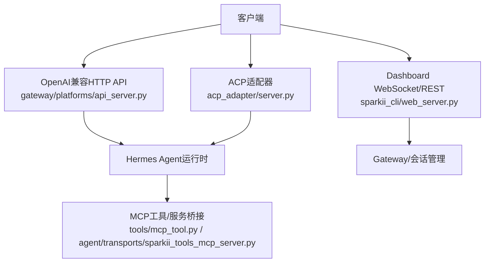
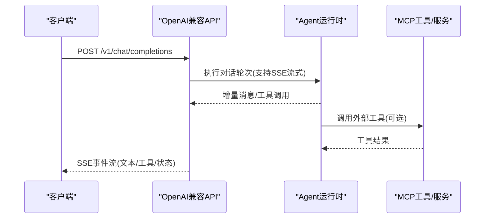
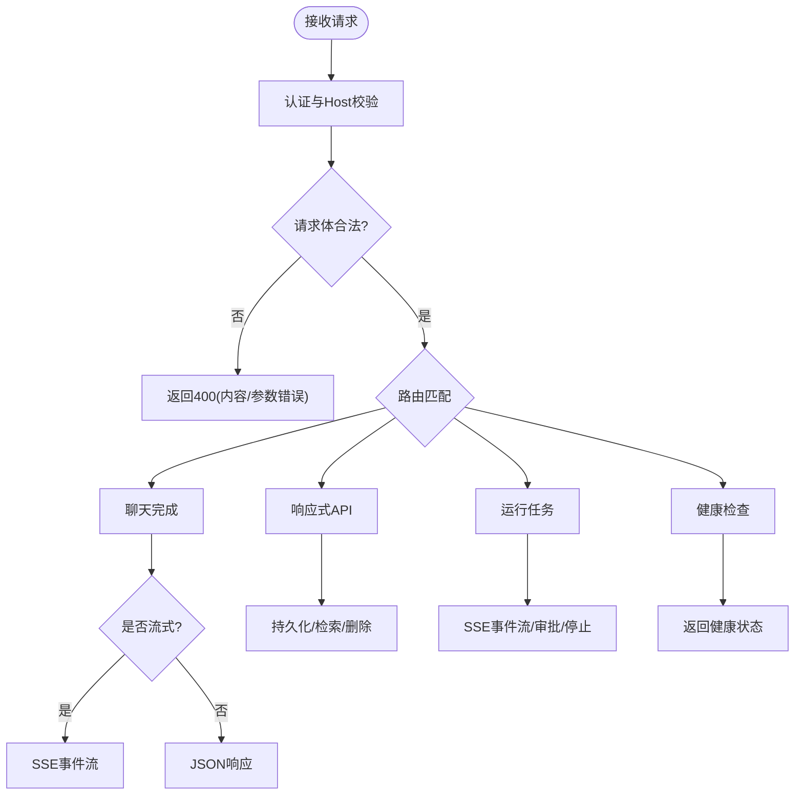
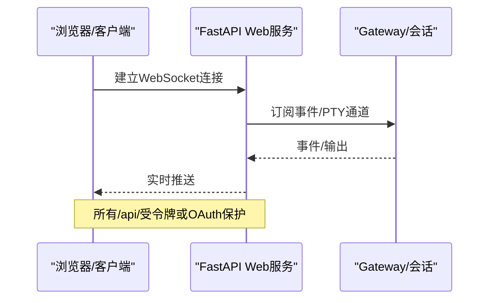
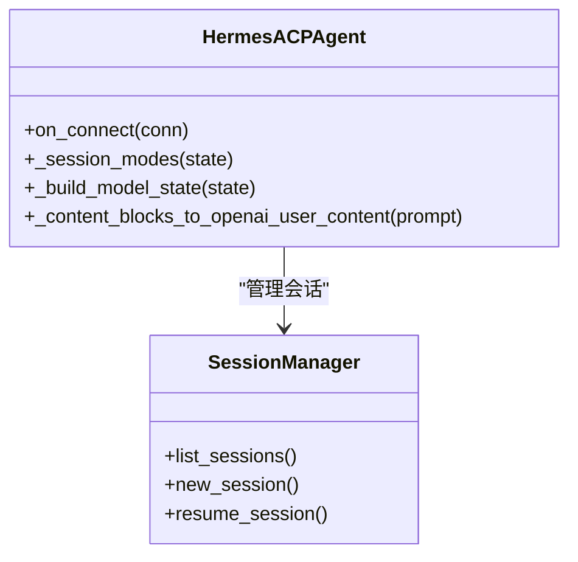
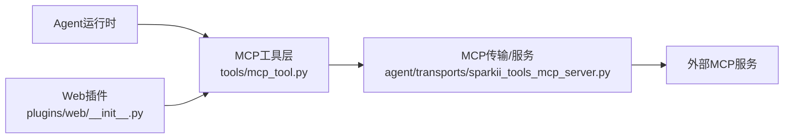
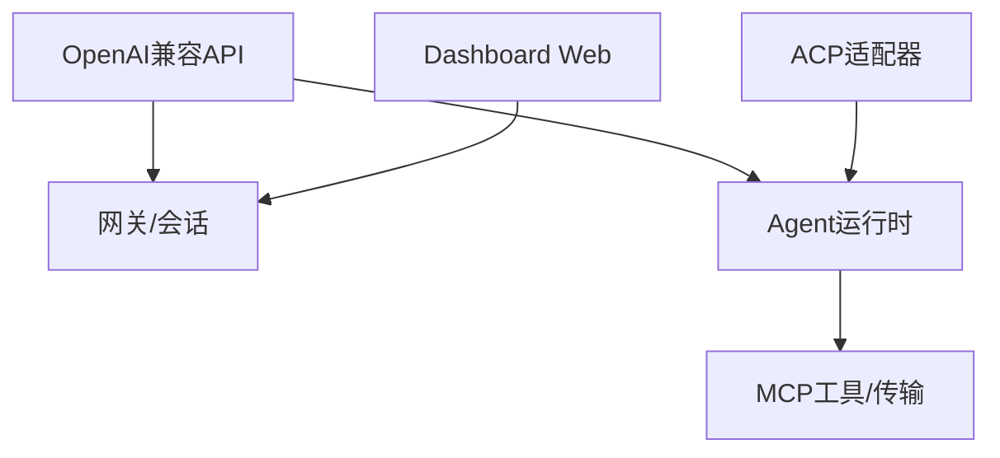

# API参考

<cite>
**本文引用的文件**
- [gateway/platforms/api_server.py](file://gateway/platforms/api_server.py)
- [sparkii_cli/web_server.py](file://sparkii_cli/web_server.py)
- [acp_adapter/server.py](file://acp_adapter/server.py)
- [agent/transports/sparkii_tools_mcp_server.py](file://agent/transports/sparkii_tools_mcp_server.py)
- [tools/mcp_tool.py](file://tools/mcp_tool.py)
- [plugins/web/__init__.py](file://plugins/web/__init__.py)
</cite>

## 目录
1. [简介](#简介)
2. [项目结构](#项目结构)
3. [核心组件](#核心组件)
4. [架构总览](#架构总览)
5. [详细组件分析](#详细组件分析)
6. [依赖关系分析](#依赖关系分析)
7. [性能与限流](#性能与限流)
8. [故障排查指南](#故障排查指南)
9. [结论](#结论)
10. [附录](#附录)

## 简介
本参考文档面向集成方，系统化说明本项目的对外接口能力，包括：
- OpenAI兼容REST API（聊天完成、响应式API、模型列表、能力探测等）
- WebSocket接口（Dashboard/PTY事件通道）
- ACP（Agent Client Protocol）适配器
- MCP（Model Context Protocol）集成方式与扩展机制
- 安全、限流、版本管理与迁移建议

## 项目结构
本项目提供三类主要对外服务面：
- OpenAI兼容HTTP API服务器（aiohttp），暴露/v1/*端点
- Dashboard Web服务（FastAPI），提供管理型REST与WebSocket
- ACP适配器（基于acp库），以协议化方式暴露Agent能力
- MCP工具与服务桥接，用于将外部MCP能力接入Agent工作流

**图示来源**
- [gateway/platforms/api_server.py:1-40](file://gateway/platforms/api_server.py#L1-L40)
- [sparkii_cli/web_server.py:1-10](file://sparkii_cli/web_server.py#L1-L10)
- [acp_adapter/server.py:1-63](file://acp_adapter/server.py#L1-L63)
- [tools/mcp_tool.py](file://tools/mcp_tool.py)
- [agent/transports/sparkii_tools_mcp_server.py](file://agent/transports/sparkii_tools_mcp_server.py)

**章节来源**
- [gateway/platforms/api_server.py:1-40](file://gateway/platforms/api_server.py#L1-L40)
- [sparkii_cli/web_server.py:1-10](file://sparkii_cli/web_server.py#L1-L10)
- [acp_adapter/server.py:1-63](file://acp_adapter/server.py#L1-L63)

## 核心组件
- OpenAI兼容HTTP API服务器：提供聊天完成、响应式API、模型列表、能力探测、会话管理、运行任务控制与健康检查。
- Dashboard Web服务：提供配置、环境、会话管理等REST接口，以及PTY/WebSocket实时通道。
- ACP适配器：通过标准协议暴露Agent能力，支持会话、模型选择、工具调用、资源附件等。
- MCP集成：通过工具层与传输层桥接外部MCP服务，使Agent可调用外部工具。

**章节来源**
- [gateway/platforms/api_server.py:1-40](file://gateway/platforms/api_server.py#L1-L40)
- [sparkii_cli/web_server.py:1-10](file://sparkii_cli/web_server.py#L1-L10)
- [acp_adapter/server.py:1-63](file://acp_adapter/server.py#L1-L63)
- [tools/mcp_tool.py](file://tools/mcp_tool.py)
- [agent/transports/sparkii_tools_mcp_server.py](file://agent/transports/sparkii_tools_mcp_server.py)

## 架构总览
OpenAI兼容API作为统一入口，内部路由到Hermes Agent；Dashboard提供本地Web管理界面与实时通信；ACP为编辑器/IDE场景提供标准化Agent交互；MCP作为工具生态扩展。

**图示来源**
- [gateway/platforms/api_server.py:1-40](file://gateway/platforms/api_server.py#L1-L40)
- [tools/mcp_tool.py](file://tools/mcp_tool.py)
- [agent/transports/sparkii_tools_mcp_server.py](file://agent/transports/sparkii_tools_mcp_server.py)

## 详细组件分析

### OpenAI兼容REST API
- 认证
  - 使用API密钥进行鉴权（环境变量或平台配置）。请求需携带相应认证头。
- 端点概览
  - POST /v1/chat/completions：OpenAI Chat Completions格式，支持流式与非流式；可选会话延续与长期记忆作用域头。
  - POST /v1/responses：OpenAI Responses格式，支持previous_response_id与会话键。
  - GET /v1/responses/{response_id}：获取已存储响应。
  - DELETE /v1/responses/{response_id}：删除已存储响应。
  - GET /v1/models：列出虚拟模型与别名。
  - GET /v1/capabilities：机器可读的能力清单。
  - /api/sessions*：创建、读取、更新、删除会话；读取历史；分支会话；发起聊天（含流式）。
  - /v1/runs*：启动任务、查询状态、SSE事件流、审批、停止。
  - /health, /health/detailed：健康检查。
- 请求/响应模式
  - 聊天完成：遵循OpenAI Chat Completions规范；支持content数组（text/image_url）；支持model_options、reasoning等扩展字段。
  - 响应式API：遵循Responses规范；支持历史截断与压缩摘要保留。
  - 流式：SSE帧封装，统一序列化逻辑。
- 错误处理
  - 多模态内容校验失败返回400，包含错误码与参数定位。
  - 未授权/非法Host等由中间件拦截并返回对应状态码。
- 版本与兼容性
  - 虚拟模型名（如sparkii-agent）保持稳定；provider/model可在请求中覆盖。
  - 向后兼容：对字符串布尔值、旧版content形状做宽容解析。

**图示来源**
- [gateway/platforms/api_server.py:1-40](file://gateway/platforms/api_server.py#L1-L40)
- [gateway/platforms/api_server.py:187-207](file://gateway/platforms/api_server.py#L187-L207)
- [gateway/platforms/api_server.py:477-666](file://gateway/platforms/api_server.py#L477-L666)
- [gateway/platforms/api_server.py:683-693](file://gateway/platforms/api_server.py#L683-L693)

**章节来源**
- [gateway/platforms/api_server.py:1-40](file://gateway/platforms/api_server.py#L1-L40)
- [gateway/platforms/api_server.py:187-207](file://gateway/platforms/api_server.py#L187-L207)
- [gateway/platforms/api_server.py:477-666](file://gateway/platforms/api_server.py#L477-L666)
- [gateway/platforms/api_server.py:683-693](file://gateway/platforms/api_server.py#L683-L693)

### Dashboard Web服务（FastAPI）
- 功能
  - 提供配置、环境、会话管理等REST接口。
  - 提供WebSocket与PTY通道，用于前端实时交互与终端输出。
- 安全
  - 支持两种认证：
    - 回环绑定：注入会话令牌（X-Hermes-Session-Token或Bearer）。
    - 非回环绑定：强制OAuth或密码门控。
  - Host头校验防止DNS重绑定攻击。
  - 插件API按启用状态动态门控。
- 速率限制
  - 针对敏感端点实现简单速率限制（例如reveal端点窗口计数）。
- 健康自检
  - 周期性自测受保护端点可用性，汇总至健康状态。

**图示来源**
- [sparkii_cli/web_server.py:1-10](file://sparkii_cli/web_server.py#L1-L10)
- [sparkii_cli/web_server.py:330-468](file://sparkii_cli/web_server.py#L330-L468)
- [sparkii_cli/web_server.py:538-671](file://sparkii_cli/web_server.py#L538-L671)
- [sparkii_cli/web_server.py:698-800](file://sparkii_cli/web_server.py#L698-L800)

**章节来源**
- [sparkii_cli/web_server.py:330-468](file://sparkii_cli/web_server.py#L330-L468)
- [sparkii_cli/web_server.py:538-671](file://sparkii_cli/web_server.py#L538-L671)
- [sparkii_cli/web_server.py:698-800](file://sparkii_cli/web_server.py#L698-L800)

### ACP适配器（Agent Client Protocol）
- 角色
  - 将Hermes Agent能力以标准ACP协议暴露给编辑器/IDE（如Zed等）。
- 能力
  - 会话管理、模型选择、工具调用、资源附件（文本/图片）、命令提示。
- 数据转换
  - 将ACP内容块转换为OpenAI/Hermes可理解的文本与图像部分。
  - 支持本地文件URI与嵌入资源，限制大小与类型。
- 模型目录
  - 聚合已认证提供者与自定义命名端点，限制每提供者条目数，保证UI体验。

**图示来源**
- [acp_adapter/server.py:566-800](file://acp_adapter/server.py#L566-L800)
- [acp_adapter/server.py:90-191](file://acp_adapter/server.py#L90-L191)
- [acp_adapter/server.py:332-477](file://acp_adapter/server.py#L332-L477)

**章节来源**
- [acp_adapter/server.py:566-800](file://acp_adapter/server.py#L566-L800)
- [acp_adapter/server.py:90-191](file://acp_adapter/server.py#L90-L191)
- [acp_adapter/server.py:332-477](file://acp_adapter/server.py#L332-L477)

### MCP集成与扩展
- 集成方式
  - 通过工具层（tools/mcp_tool.py）与传输层（agent/transports/sparkii_tools_mcp_server.py）桥接外部MCP服务。
  - 插件体系（plugins/web/__init__.py）可扩展Web相关能力。
- 扩展机制
  - 新增MCP服务时，注册传输与工具定义，Agent在工具调用阶段按需启动/复用进程。
  - 支持标准MCP发现与能力协商，结合权限与安全策略。

**图示来源**
- [tools/mcp_tool.py](file://tools/mcp_tool.py)
- [agent/transports/sparkii_tools_mcp_server.py](file://agent/transports/sparkii_tools_mcp_server.py)
- [plugins/web/__init__.py](file://plugins/web/__init__.py)

**章节来源**
- [tools/mcp_tool.py](file://tools/mcp_tool.py)
- [agent/transports/sparkii_tools_mcp_server.py](file://agent/transports/sparkii_tools_mcp_server.py)
- [plugins/web/__init__.py](file://plugins/web/__init__.py)

## 依赖关系分析
- OpenAI兼容API依赖aiohttp与网关模块，负责HTTP路由、SSE流式、会话与任务管理。
- Dashboard依赖FastAPI/Starlette，提供Web UI与管理接口，内置CORS、认证中间件与健康自检。
- ACP适配器依赖acp库与Hermes会话管理，负责协议适配与内容转换。
- MCP集成依赖工具层与传输层，将外部服务纳入Agent工具生态。

**图示来源**
- [gateway/platforms/api_server.py:1-40](file://gateway/platforms/api_server.py#L1-L40)
- [sparkii_cli/web_server.py:1-10](file://sparkii_cli/web_server.py#L1-L10)
- [acp_adapter/server.py:1-63](file://acp_adapter/server.py#L1-L63)
- [tools/mcp_tool.py](file://tools/mcp_tool.py)
- [agent/transports/sparkii_tools_mcp_server.py](file://agent/transports/sparkii_tools_mcp_server.py)

**章节来源**
- [gateway/platforms/api_server.py:1-40](file://gateway/platforms/api_server.py#L1-L40)
- [sparkii_cli/web_server.py:1-10](file://sparkii_cli/web_server.py#L1-L10)
- [acp_adapter/server.py:1-63](file://acp_adapter/server.py#L1-L63)
- [tools/mcp_tool.py](file://tools/mcp_tool.py)
- [agent/transports/sparkii_tools_mcp_server.py](file://agent/transports/sparkii_tools_mcp_server.py)

## 性能与限流
- 流式输出
  - 统一SSE帧序列化，减少延迟与重复编码开销。
- 内存与体积限制
  - 请求体上限、归一化文本长度、内容数组项数限制，防止滥用。
- 进程回收
  - 断开连接后后台进程回收，避免泄漏。
- Dashboard速率限制
  - 对敏感端点实施窗口内次数限制。
- 健康自检
  - 定期检测受保护端点可用性，快速发现退化。

[本节为通用指导，不直接分析具体文件]

## 故障排查指南
- 400错误（内容/参数）
  - 多模态内容校验失败会返回明确错误码与参数位置，检查image_url/data URL与type字段。
- 401未授权
  - Dashboard的/api/路径需要会话令牌或OAuth；确保Header正确且Host匹配。
- 5xx错误
  - Dashboard记录最近未处理异常与自测状态，查看健康端点与日志。
- 流式中断
  - 客户端断开后，API服务器会触发后台进程回收，避免僵尸进程。

**章节来源**
- [gateway/platforms/api_server.py:683-693](file://gateway/platforms/api_server.py#L683-L693)
- [sparkii_cli/web_server.py:538-671](file://sparkii_cli/web_server.py#L538-L671)
- [sparkii_cli/web_server.py:698-800](file://sparkii_cli/web_server.py#L698-L800)

## 结论
本项目提供统一的OpenAI兼容API、Dashboard Web服务、ACP适配器与MCP集成，满足多种客户端与场景需求。通过严格的认证、Host校验、速率限制与健康自检，保障安全性与稳定性。建议在集成时遵循请求体规范、合理使用流式接口，并结合MCP扩展工具能力。

[本节为总结性内容，不直接分析具体文件]

## 附录

### OpenAI兼容API端点速查
- POST /v1/chat/completions：聊天完成（支持流式）
- POST /v1/responses：响应式API（支持历史ID与会话键）
- GET /v1/responses/{id}：获取响应
- DELETE /v1/responses/{id}：删除响应
- GET /v1/models：模型列表
- GET /v1/capabilities：能力清单
- /api/sessions*：会话CRUD、历史、分支、聊天（含流式）
- /v1/runs*：任务生命周期（启动、状态、事件、审批、停止）
- /health, /health/detailed：健康检查

**章节来源**
- [gateway/platforms/api_server.py:1-40](file://gateway/platforms/api_server.py#L1-L40)

### 认证与安全要点
- OpenAI兼容API：使用API密钥鉴权。
- Dashboard：
  - 回环绑定：会话令牌（X-Hermes-Session-Token或Bearer）。
  - 非回环绑定：强制OAuth或密码门控。
  - Host头校验防DNS重绑定。
  - 插件API按启用状态动态门控。

**章节来源**
- [sparkii_cli/web_server.py:330-468](file://sparkii_cli/web_server.py#L330-L468)
- [sparkii_cli/web_server.py:538-671](file://sparkii_cli/web_server.py#L538-L671)

### 版本管理与迁移建议
- 虚拟模型名稳定，provider/model可按请求覆盖。
- 向后兼容：对字符串布尔、旧版content形状宽容解析。
- 迁移策略：优先使用/v1/chat/completions与/v1/responses；逐步引入runs与sessions管理能力。

**章节来源**
- [gateway/platforms/api_server.py:1-40](file://gateway/platforms/api_server.py#L1-L40)
- [gateway/platforms/api_server.py:221-243](file://gateway/platforms/api_server.py#L221-L243)
- [gateway/platforms/api_server.py:477-666](file://gateway/platforms/api_server.py#L477-L666)