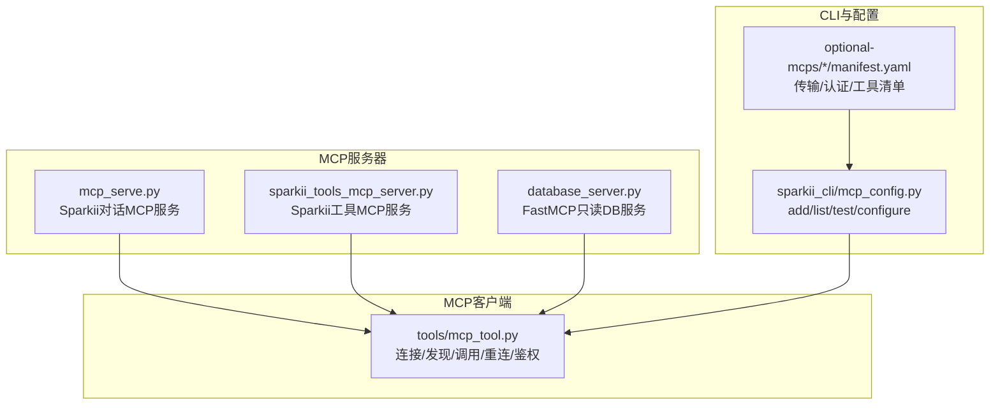
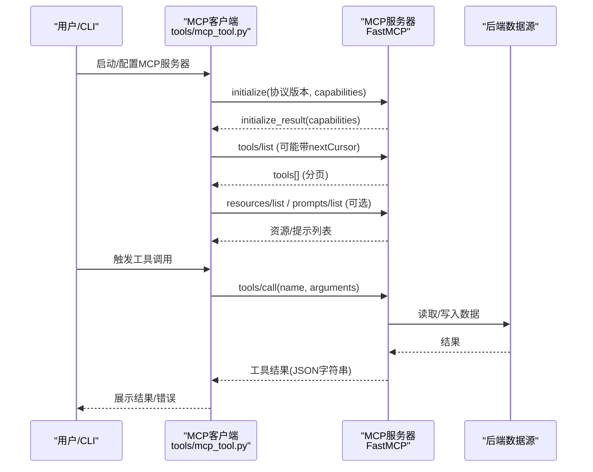
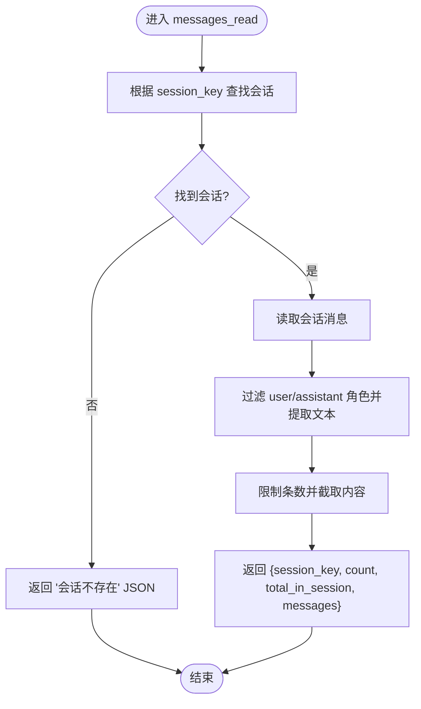
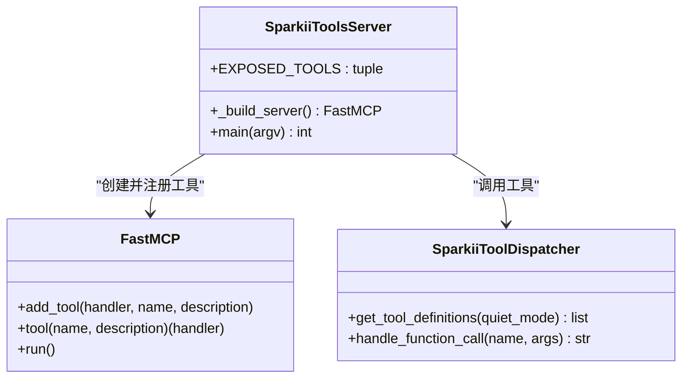
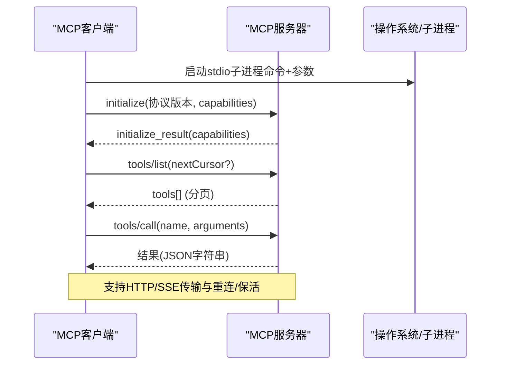
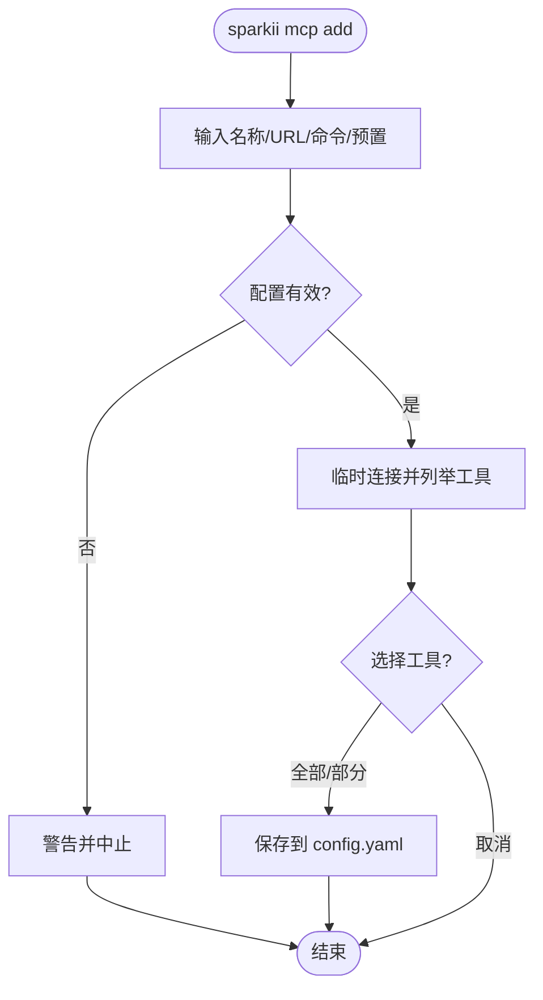
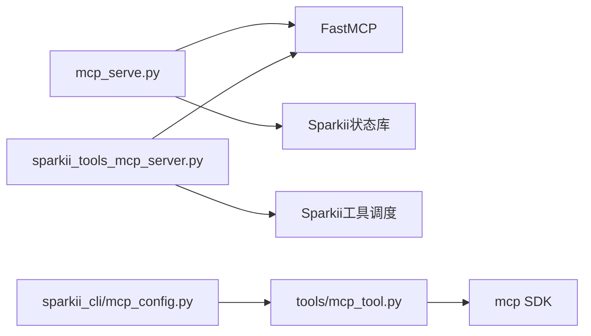

# MCP协议

<cite>
**本文引用的文件**   
- [mcp_serve.py](file://mcp_serve.py)
- [sparkii_tools_mcp_server.py](file://agent/transports/sparkii_tools_mcp_server.py)
- [mcp_tool.py](file://tools/mcp_tool.py)
- [mcp_config.py](file://sparkii_cli/mcp_config.py)
- [database_server.py](file://optional-skills/mcp/fastmcp/templates/database_server.py)
- [blender_manifest.yaml](file://optional-mcps/blender/manifest.yaml)
- [n8n_manifest.yaml](file://optional-mcps/n8n/manifest.yaml)
- [unreal_engine_manifest.yaml](file://optional-mcps/unreal-engine/manifest.yaml)
</cite>

## 目录
1. [简介](#简介)
2. [项目结构](#项目结构)
3. [核心组件](#核心组件)
4. [架构总览](#架构总览)
5. [详细组件分析](#详细组件分析)
6. [依赖关系分析](#依赖关系分析)
7. [性能考量](#性能考量)
8. [故障排查指南](#故障排查指南)
9. [结论](#结论)
10. [附录](#附录)

## 简介
本文件面向在本仓库中实现与使用MCP（Model Context Protocol）的开发者与集成者，系统性说明MCP服务器与客户端的架构设计、消息格式与通信模式；完整记录工具发现、注册、调用的流程；解释上下文传递、参数校验与结果返回的数据结构；提供MCP服务器与客户端的实现指南（含标准扩展与自定义工具开发）、配置文件与环境变量、安全策略；并给出集成示例与调试技巧，以及与现有工具的兼容性与迁移方案。

## 项目结构
仓库中与MCP相关的代码主要分布在以下位置：
- MCP服务端实现与示例
  - mcp_serve.py：Sparkii内置MCP服务器，暴露对话、消息、事件等能力
  - agent/transports/sparkii_tools_mcp_server.py：将Sparkii工具集以MCP形式暴露给Codex运行时
  - optional-skills/mcp/fastmcp/templates/database_server.py：FastMCP数据库只读服务模板
- MCP客户端与连接管理
  - tools/mcp_tool.py：MCP客户端核心，支持stdio/HTTP/SSE传输、重连、鉴权、动态能力探测、采样与通知处理
- CLI配置与管理
  - sparkii_cli/mcp_config.py：MCP服务器增删改查、测试、OAuth与头信息配置、工具选择
- 官方/第三方MCP目录清单
  - optional-mcps/*：各MCP服务的manifest.yaml，描述传输、认证、默认启用工具、安装后步骤等

**图表来源**
- [mcp_serve.py:590-664](file://mcp_serve.py#L590-L664)
- [sparkii_tools_mcp_server.py:152-245](file://agent/transports/sparkii_tools_mcp_server.py#L152-L245)
- [mcp_tool.py:219-280](file://tools/mcp_tool.py#L219-L280)
- [mcp_config.py:278-378](file://sparkii_cli/mcp_config.py#L278-L378)
- [blender_manifest.yaml:20-41](file://optional-mcps/blender/manifest.yaml#L20-L41)
- [n8n_manifest.yaml:14-56](file://optional-mcps/n8n/manifest.yaml#L14-L56)
- [unreal_engine_manifest.yaml:18-26](file://optional-mcps/unreal-engine/manifest.yaml#L18-L26)

**章节来源**
- [mcp_serve.py:1-28](file://mcp_serve.py#L1-L28)
- [mcp_tool.py:1-95](file://tools/mcp_tool.py#L1-L95)
- [mcp_config.py:1-9](file://sparkii_cli/mcp_config.py#L1-L9)

## 核心组件
- MCP服务器
  - Sparkii对话MCP服务：通过FastMCP暴露conversations_list、conversation_get、messages_read、attachments_fetch、events_poll、events_wait、messages_send、permissions相关工具，用于跨平台消息会话管理
  - Sparkii工具MCP服务：将Sparkii工具集（搜索、浏览器自动化、视觉、图像生成、技能、TTS、看板等）以MCP工具形式暴露给外部运行时（如Codex）
  - FastMCP数据库服务模板：演示如何构建只读SQLite查询服务
- MCP客户端
  - 统一连接抽象：支持stdio子进程、HTTP/Streamable HTTP、SSE三种传输
  - 能力发现与工具注册：list_tools、分页拉取、动态工具变更通知
  - 鉴权与安全：Bearer/OAuth、环境变量插值、子进程环境白名单、错误信息脱敏
  - 可靠性：指数退避重连、keepalive保活、空闲回收、停泊重试
  - 扩展能力：采样（server请求LLM）、Elicitation（交互式输入）、日志级别映射
- CLI与配置
  - 交互式添加/测试/列出MCP服务器，支持预置、OAuth、头信息、工具筛选
  - manifest.yaml声明式描述传输、认证、默认工具、安装后步骤

**章节来源**
- [mcp_serve.py:590-800](file://mcp_serve.py#L590-L800)
- [sparkii_tools_mcp_server.py:100-245](file://agent/transports/sparkii_tools_mcp_server.py#L100-L245)
- [database_server.py:18-77](file://optional-skills/mcp/fastmcp/templates/database_server.py#L18-L77)
- [mcp_tool.py:338-374](file://tools/mcp_tool.py#L338-L374)
- [mcp_config.py:415-617](file://sparkii_cli/mcp_config.py#L415-L617)

## 架构总览
MCP在仓库中的整体交互如下：
- 客户端（tools/mcp_tool.py）负责建立到MCP服务器的连接（stdio/HTTP/SSE），完成initialize握手，获取capabilities，发现工具列表（支持分页与动态通知），并将工具注册到Sparkii工具表供模型调用。
- 服务器端（mcp_serve.py、sparkii_tools_mcp_server.py、database_server.py）通过FastMCP暴露工具或资源，按MCP规范响应工具调用、资源读取、提示列表等。
- CLI（sparkii_cli/mcp_config.py）提供用户友好的配置入口，支持从manifest.yaml导入或手动配置，进行连通性测试与工具选择。
- manifest.yaml作为“可安装MCP”的声明式清单，描述传输方式、认证、默认启用的工具以及安装后步骤。

**图表来源**
- [mcp_tool.py:661-699](file://tools/mcp_tool.py#L661-L699)
- [mcp_serve.py:611-664](file://mcp_serve.py#L611-L664)
- [sparkii_tools_mcp_server.py:180-237](file://agent/transports/sparkii_tools_mcp_server.py#L180-L237)
- [database_server.py:34-73](file://optional-skills/mcp/fastmcp/templates/database_server.py#L34-L73)

## 详细组件分析

### 组件A：Sparkii对话MCP服务（mcp_serve.py）
- 职责：提供跨平台消息会话的工具集合，包括会话列表、会话详情、消息读取、附件提取、事件轮询与等待、消息发送、权限请求等。
- 关键数据结构
  - 会话索引：从state.db或sessions.json构建，包含session_key、platform、chat_type、display_name、origin等
  - 事件队列：QueueEvent(cursor, type, session_key, data)，维护cursor游标与类型过滤
- 处理逻辑
  - 会话列表：按平台过滤、名称搜索、限制数量排序
  - 消息读取：按session_id读取消息，过滤user/assistant角色，截取内容长度
  - 附件提取：解析多部分content块与MEDIA标签，输出图片/媒体路径
  - 事件桥：后台线程轮询state.db，基于mtime变化增量投递新消息，支持wait_for_event阻塞等待
- 错误处理
  - 会话不存在、数据库不可用、读取异常均返回结构化JSON错误
  - 数字参数强制转换与边界钳制

**图表来源**
- [mcp_serve.py:701-754](file://mcp_serve.py#L701-L754)

**章节来源**
- [mcp_serve.py:63-281](file://mcp_serve.py#L63-L281)
- [mcp_serve.py:284-584](file://mcp_serve.py#L284-L584)
- [mcp_serve.py:590-800](file://mcp_serve.py#L590-L800)

### 组件B：Sparkii工具MCP服务（sparkii_tools_mcp_server.py）
- 职责：将Sparkii工具集以MCP工具形式暴露给Codex等运行时，屏蔽底层调度细节，仅暴露必要的安全工具集。
- 关键机制
  - 工具白名单：EXPOSED_TOOLS限定暴露范围
  - 动态签名生成：从Sparkii工具定义中提取JSON Schema，构造Python函数签名与注解
  - 分发器：通过handle_function_call调用Sparkii内部工具，捕获异常并返回结构化错误
- 错误处理
  - 工具未注册时跳过
  - 调用异常捕获并返回JSON错误

**图表来源**
- [sparkii_tools_mcp_server.py:100-245](file://agent/transports/sparkii_tools_mcp_server.py#L100-L245)

**章节来源**
- [sparkii_tools_mcp_server.py:1-43](file://agent/transports/sparkii_tools_mcp_server.py#L1-L43)
- [sparkii_tools_mcp_server.py:152-245](file://agent/transports/sparkii_tools_mcp_server.py#L152-L245)
- [sparkii_tools_mcp_server.py:248-285](file://agent/transports/sparkii_tools_mcp_server.py#L248-L285)

### 组件C：MCP客户端（tools/mcp_tool.py）
- 传输支持
  - stdio：子进程启动，stderr重定向到共享日志文件，避免污染TUI
  - HTTP/Streamable HTTP：自动检测新旧API，支持skip_preflight
  - SSE：可选传输，用于特定MCP服务器
- 连接与生命周期
  - 初始化握手、capabilities协商
  - 指数退避重连、最大重试次数、停泊期自探活
  - keepalive保活间隔（可配置，最小5秒）
- 工具发现与注册
  - tools/list分页拉取（nextCursor），限制最大页数防止无限循环
  - 动态工具变更通知（tools/list_changed）
  - 工具描述注入扫描（警告级别）
- 鉴权与安全
  - 环境变量插值（${VAR}、env:VAR）
  - 子进程安全环境白名单（PATH/HOME/XDG_*等）
  - 错误信息脱敏（令牌、密钥、Bearer等）
- 扩展能力
  - 采样：server发起LLM请求（text/tool-use）
  - Elicitation：server在工具调用中请求结构化输入
  - 日志级别映射：RFC 5424 syslog -> Python logging

**图表来源**
- [mcp_tool.py:219-280](file://tools/mcp_tool.py#L219-L280)
- [mcp_tool.py:661-699](file://tools/mcp_tool.py#L661-L699)
- [mcp_tool.py:493-532](file://tools/mcp_tool.py#L493-L532)

**章节来源**
- [mcp_tool.py:97-131](file://tools/mcp_tool.py#L97-L131)
- [mcp_tool.py:134-204](file://tools/mcp_tool.py#L134-L204)
- [mcp_tool.py:338-374](file://tools/mcp_tool.py#L338-L374)
- [mcp_tool.py:493-532](file://tools/mcp_tool.py#L493-L532)
- [mcp_tool.py:547-586](file://tools/mcp_tool.py#L547-L586)
- [mcp_tool.py:620-699](file://tools/mcp_tool.py#L620-L699)

### 组件D：CLI与配置管理（sparkii_cli/mcp_config.py）
- 功能
  - add：交互式添加MCP服务器，支持URL/命令/预置、OAuth、头信息、工具选择
  - remove：删除服务器并清理OAuth缓存
  - list：列出已配置服务器及状态
  - test：测试连接并显示发现的工具
  - configure：批量替换mcp_servers映射，支持验证与回滚
- 安全
  - 可疑命令/参数拒绝保存
  - Bearer token规范化（去除前缀）
  - 环境变量插值与掩码显示
- 能力探测
  - 临时连接服务器，列举工具，必要时探测prompts/resources能力
  - 尊重服务器advertised capabilities，避免无效调用

**图表来源**
- [mcp_config.py:415-617](file://sparkii_cli/mcp_config.py#L415-L617)
- [mcp_config.py:278-378](file://sparkii_cli/mcp_config.py#L278-L378)

**章节来源**
- [mcp_config.py:78-157](file://sparkii_cli/mcp_config.py#L78-L157)
- [mcp_config.py:218-276](file://sparkii_cli/mcp_config.py#L218-L276)
- [mcp_config.py:415-617](file://sparkii_cli/mcp_config.py#L415-L617)
- [mcp_config.py:721-782](file://sparkii_cli/mcp_config.py#L721-L782)

### 组件E：FastMCP数据库服务模板（database_server.py）
- 只读约束：仅允许SELECT查询，PRAGMA table_info用于描述表结构
- 安全：表名正则校验，限制最大行数
- 工具：list_tables、describe_table、query

**章节来源**
- [database_server.py:18-77](file://optional-skills/mcp/fastmcp/templates/database_server.py#L18-L77)

## 依赖关系分析
- 模块耦合
  - mcp_serve.py依赖FastMCP与Sparkii状态库（SessionDB、常量）
  - sparkii_tools_mcp_server.py依赖FastMCP与Sparkii工具调度（model_tools）
  - tools/mcp_tool.py依赖mcp SDK（可选），封装stdio/HTTP/SSE客户端
  - sparkii_cli/mcp_config.py依赖tools/mcp_tool.py进行连接探测
- 外部依赖
  - mcp包（FastMCP/ClientSession/传输客户端）
  - 第三方MCP服务器（Blender、n8n、Unreal Engine等）
- 潜在循环依赖
  - 通过延迟导入与条件导入避免启动时强依赖（如mcp包缺失时的降级）

**图表来源**
- [mcp_serve.py:47-57](file://mcp_serve.py#L47-L57)
- [sparkii_tools_mcp_server.py:152-167](file://agent/transports/sparkii_tools_mcp_server.py#L152-L167)
- [mcp_tool.py:219-280](file://tools/mcp_tool.py#L219-L280)
- [mcp_config.py:294-300](file://sparkii_cli/mcp_config.py#L294-L300)

**章节来源**
- [mcp_serve.py:47-57](file://mcp_serve.py#L47-L57)
- [sparkii_tools_mcp_server.py:152-167](file://agent/transports/sparkii_tools_mcp_server.py#L152-L167)
- [mcp_tool.py:219-280](file://tools/mcp_tool.py#L219-L280)
- [mcp_config.py:294-300](file://sparkii_cli/mcp_config.py#L294-L300)

## 性能考量
- 事件轮询优化：基于state.db mtime变化跳过无变更轮询，降低CPU占用
- 分页限制：tools/resources/prompts分页最多50页，防止无限拉取
- 重连策略：指数退避+抖动，避免雪崩；停泊期自探活恢复
- Keepalive：默认180秒，最小5秒，适配不同服务器TTL
- 子进程stderr重定向：避免TUI渲染被破坏
- 工具调用超时：默认300秒，可按服务器配置调整

[本节为通用指导，不直接分析具体文件]

## 故障排查指南
- 连接失败
  - 检查transport类型（stdio/url/sse）与网络可达性
  - 查看mcp-stderr.log定位子进程启动错误
  - 确认connect_timeout与keepalive_interval设置合理
- 工具未列出
  - 检查服务器是否实现tools/list或是否支持分页
  - 查看capabilities是否包含tools字段
  - 使用sparkii mcp test诊断
- 鉴权问题
  - 确认Bearer token或OAuth配置正确
  - 检查.env中变量是否生效（插值与掩码）
- 错误信息泄露
  - 客户端会自动脱敏敏感信息，若仍出现，检查上游服务器日志

**章节来源**
- [mcp_tool.py:134-204](file://tools/mcp_tool.py#L134-L204)
- [mcp_tool.py:526-532](file://tools/mcp_tool.py#L526-L532)
- [mcp_config.py:721-782](file://sparkii_cli/mcp_config.py#L721-L782)

## 结论
本仓库实现了完整的MCP生态：服务器端通过FastMCP暴露对话与工具能力，客户端统一抽象多种传输并提供健壮的连接管理、能力发现与鉴权机制，CLI提供友好配置入口，manifest.yaml标准化可安装MCP服务。该架构兼顾安全性、可扩展性与易用性，适合在复杂系统中集成多样化工具与服务。

[本节为总结，不直接分析具体文件]

## 附录

### MCP配置文件格式与环境变量
- 配置文件位置：~/.sparkii/config.yaml下的mcp_servers键
- 关键字段
  - command/args：stdio子进程命令与参数
  - url：HTTP/Streamable HTTP端点
  - transport：sse（可选）
  - headers：Authorization等头信息，支持${ENV}插值
  - env：子进程环境变量（安全白名单过滤）
  - connect_timeout/timeout：连接与调用超时
  - keepalive_interval/idle_timeout_seconds/max_lifetime_seconds：生命周期管理
  - supports_parallel_tool_calls：并发工具调用开关
  - sampling：server-initiated LLM请求配置
- 环境变量
  - SPARKII_HOME：工作目录
  - SPARKII_QUIET/SPARKII_REDACT_SECRETS：静默与脱敏
  - MCP_{SERVER}_API_KEY：Bearer token存储键

**章节来源**
- [mcp_tool.py:13-66](file://tools/mcp_tool.py#L13-L66)
- [mcp_tool.py:376-411](file://tools/mcp_tool.py#L376-L411)
- [mcp_config.py:153-196](file://sparkii_cli/mcp_config.py#L153-L196)

### 安全策略
- 子进程环境白名单：仅传递安全变量与XDG_*、秘密源注入变量
- 错误信息脱敏：移除令牌、密钥、Bearer等敏感片段
- 工具描述注入扫描：警告潜在prompt注入模式
- 可疑配置拒绝：阻止shell+egress载荷型命令
- OAuth与Bearer：安全存储与插值

**章节来源**
- [mcp_tool.py:493-532](file://tools/mcp_tool.py#L493-L532)
- [mcp_tool.py:593-638](file://tools/mcp_tool.py#L593-L638)
- [mcp_config.py:88-104](file://sparkii_cli/mcp_config.py#L88-L104)

### 集成示例与调试技巧
- 快速启动Sparkii对话MCP服务：sparkii mcp serve
- 添加远程MCP服务器：sparkii mcp add <name> --url <endpoint>
- 添加stdio服务器：sparkii mcp add <name> --command <cmd> --args <args...>
- 测试连接：sparkii mcp test <name>
- 调试
  - 查看mcp-stderr.log定位子进程错误
  - 使用--verbose提升日志级别
  - 检查capabilities与工具列表

**章节来源**
- [mcp_serve.py:15-27](file://mcp_serve.py#L15-L27)
- [mcp_config.py:415-617](file://sparkii_cli/mcp_config.py#L415-L617)
- [mcp_tool.py:134-204](file://tools/mcp_tool.py#L134-L204)

### 与现有工具的兼容性与迁移方案
- 兼容性
  - 支持旧版与新版mcp SDK（条件导入与API检测）
  - 兼容SSE与Streamable HTTP传输
  - 兼容不同MCP服务器的capabilities差异
- 迁移
  - 从sparkii CLI迁移至sparkii CLI：配置键与行为保持一致
  - 从OpenClaw 9-tool通道迁移：Sparkii MCP服务匹配其工具表面并扩展channels_list
  - 从本地脚本迁移至manifest.yaml：标准化传输、认证、工具清单与安装后步骤

**章节来源**
- [mcp_serve.py:1-28](file://mcp_serve.py#L1-L28)
- [mcp_tool.py:219-280](file://tools/mcp_tool.py#L219-L280)
- [blender_manifest.yaml:20-41](file://optional-mcps/blender/manifest.yaml#L20-L41)
- [n8n_manifest.yaml:14-56](file://optional-mcps/n8n/manifest.yaml#L14-L56)
- [unreal_engine_manifest.yaml:18-26](file://optional-mcps/unreal-engine/manifest.yaml#L18-L26)