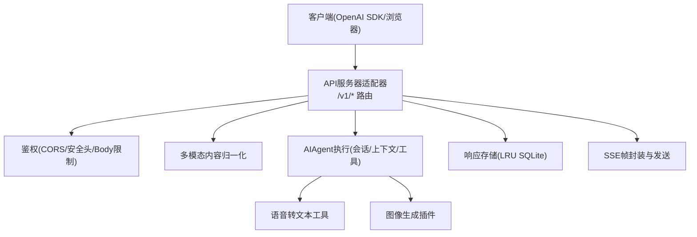
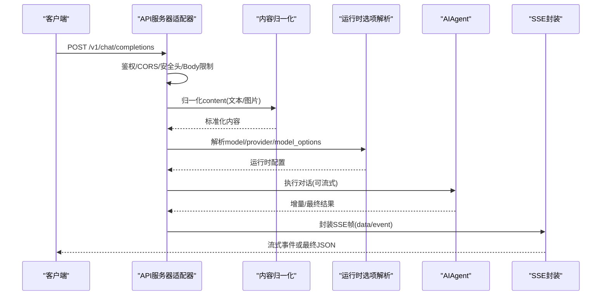
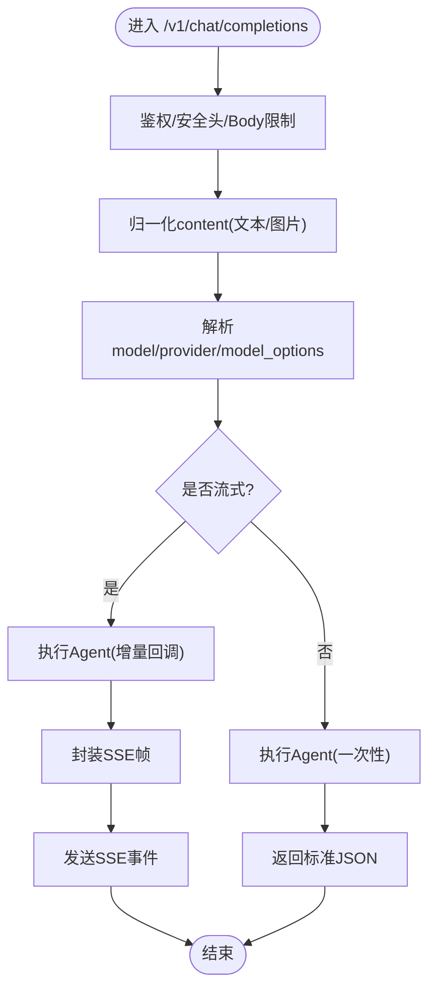
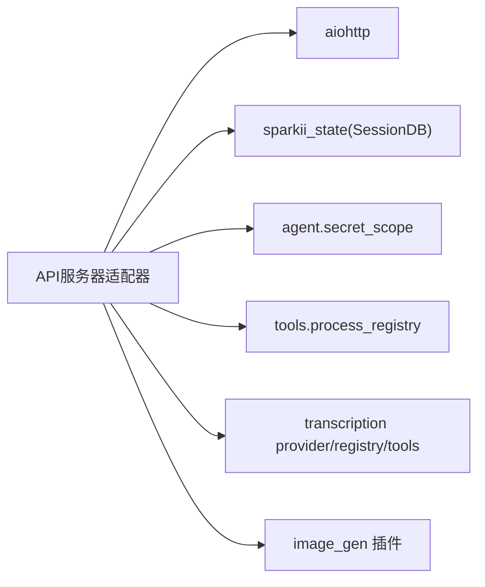

# OpenAI兼容API

<cite>
**本文引用的文件**
- [gateway/platforms/api_server.py](file://gateway/platforms/api_server.py)
- [agent/transcription_provider.py](file://agent/transcription_provider.py)
- [agent/transcription_registry.py](file://agent/transcription_registry.py)
- [tools/transcription_tools.py](file://tools/transcription_tools.py)
- [plugins/image_gen/openai/__init__.py](file://plugins/image_gen/openai/__init__.py)
</cite>

## 目录
1. [简介](#简介)
2. [项目结构](#项目结构)
3. [核心组件](#核心组件)
4. [架构总览](#架构总览)
5. [详细组件分析](#详细组件分析)
6. [依赖关系分析](#依赖关系分析)
7. [性能与限流](#性能与限流)
8. [故障排查指南](#故障排查指南)
9. [结论](#结论)
10. [附录：接口规范与示例](#附录接口规范与示例)

## 简介
本仓库提供与OpenAI兼容的HTTP API服务，核心由网关平台的API服务器适配器实现。该适配器暴露/v1/chat/completions等标准端点，支持SSE流式响应、多模态输入（文本+图片）、会话持久化、能力查询、模型列表以及运行任务管理。同时，系统内建语音转文本能力并通过工具层暴露；图像生成通过插件体系接入。本文档聚焦于OpenAI兼容接口的请求参数、响应格式、流式输出、错误码映射、限流与重试、多模态与媒体处理，以及与OpenAI SDK的调用方式说明。

## 项目结构
- API服务器适配器位于网关平台模块，负责路由、鉴权、限流、SSE流式封装、多模态内容归一化、会话与响应存储、并发控制等。
- 语音转文本能力以“提供者/注册表/工具”三层组织，便于扩展不同后端。
- 图像生成功能以插件形式提供，按提供商隔离实现。

图表来源
- [gateway/platforms/api_server.py:187-206](file://gateway/platforms/api_server.py#L187-L206)
- [gateway/platforms/api_server.py:1090-1099](file://gateway/platforms/api_server.py#L1090-L1099)
- [gateway/platforms/api_server.py:1210-1255](file://gateway/platforms/api_server.py#L1210-L1255)
- [gateway/platforms/api_server.py:1604-1641](file://gateway/platforms/api_server.py#L1604-L1641)

章节来源
- [gateway/platforms/api_server.py:1-40](file://gateway/platforms/api_server.py#L1-L40)
- [gateway/platforms/api_server.py:187-206](file://gateway/platforms/api_server.py#L187-L206)
- [gateway/platforms/api_server.py:1090-1099](file://gateway/platforms/api_server.py#L1090-L1099)
- [gateway/platforms/api_server.py:1210-1255](file://gateway/platforms/api_server.py#L1210-L1255)
- [gateway/platforms/api_server.py:1604-1641](file://gateway/platforms/api_server.py#L1604-L1641)

## 核心组件
- API服务器适配器：提供OpenAI兼容端点、鉴权、CORS与安全头、请求体大小限制、SSE帧封装、多模态内容归一化、会话与响应存储、并发上限控制、幂等缓存、模型路由与运行时选项解析。
- 语音转文本：通过transcription provider/registry/tools分层，统一对外暴露转录能力。
- 图像生成：通过image_gen插件体系接入不同提供商。

章节来源
- [gateway/platforms/api_server.py:1351-1473](file://gateway/platforms/api_server.py#L1351-L1473)
- [agent/transcription_provider.py](file://agent/transcription_provider.py)
- [agent/transcription_registry.py](file://agent/transcription_registry.py)
- [tools/transcription_tools.py](file://tools/transcription_tools.py)
- [plugins/image_gen/openai/__init__.py](file://plugins/image_gen/openai/__init__.py)

## 架构总览
API服务器作为单一入口，将OpenAI格式请求转换为内部AIAgent调用，并返回标准JSON或SSE流。关键流程包括：
- 请求进入后先进行鉴权、CORS与安全头注入、请求体大小校验。
- 对聊天消息内容进行多模态归一化（文本/图片URL）。
- 根据model/provider/model_options解析运行时配置（推理强度、服务等级等）。
- 执行Agent对话，必要时使用会话数据库保持上下文。
- 非流式直接返回结果；流式通过SSE逐块推送增量。
- 错误统一包装为OpenAI风格error对象。

图表来源
- [gateway/platforms/api_server.py:187-206](file://gateway/platforms/api_server.py#L187-L206)
- [gateway/platforms/api_server.py:477-665](file://gateway/platforms/api_server.py#L477-L665)
- [gateway/platforms/api_server.py:2314-2334](file://gateway/platforms/api_server.py#L2314-L2334)
- [gateway/platforms/api_server.py:1090-1099](file://gateway/platforms/api_server.py#L1090-L1099)

## 详细组件分析

### 聊天完成接口 /v1/chat/completions
- 功能：接收OpenAI格式的聊天请求，返回文本或流式增量。
- 请求要点：
  - model：虚拟模型名或具体模型标识；可通过provider指定后端；支持model_routes别名映射。
  - messages：支持字符串或数组形式的多模态内容（text/image_url/input_image），自动归一化。
  - stream：布尔或字符串化的布尔值均被识别。
  - model_options：包含reasoning(enabled/effort)、service_tier/fast等运行时选项。
  - 头部：Authorization Bearer令牌用于鉴权；可选X-Sparkii-Session-Id/X-Sparkii-Session-Key用于会话与长期记忆作用域。
- 响应：
  - 非流式：标准OpenAI聊天完成JSON。
  - 流式：SSE事件，data字段为增量片段，event可为delta等。
- 多模态：
  - 仅支持text与image_url/input_image；不支持inline file/file_id。
  - image_url支持http(s)与data:image/* URL，带detail字段时会被保留。
- 会话与历史：
  - 支持基于system prompt与首条用户消息派生稳定session ID，复用Hermes会话。
  - 响应存储采用SQLite LRU，支持previous_response_id续聊。

图表来源
- [gateway/platforms/api_server.py:477-665](file://gateway/platforms/api_server.py#L477-L665)
- [gateway/platforms/api_server.py:187-206](file://gateway/platforms/api_server.py#L187-L206)
- [gateway/platforms/api_server.py:2314-2334](file://gateway/platforms/api_server.py#L2314-L2334)
- [gateway/platforms/api_server.py:1264-1279](file://gateway/platforms/api_server.py#L1264-L1279)

章节来源
- [gateway/platforms/api_server.py:187-206](file://gateway/platforms/api_server.py#L187-L206)
- [gateway/platforms/api_server.py:477-665](file://gateway/platforms/api_server.py#L477-L665)
- [gateway/platforms/api_server.py:1090-1099](file://gateway/platforms/api_server.py#L1090-L1099)
- [gateway/platforms/api_server.py:1264-1279](file://gateway/platforms/api_server.py#L1264-L1279)
- [gateway/platforms/api_server.py:2314-2334](file://gateway/platforms/api_server.py#L2314-L2334)

### 图像生成接口 /v1/images/generations
- 现状：仓库未在本适配器中直接暴露/v1/images/generations端点；图像生成功能通过插件体系提供（例如openai图像生成插件）。
- 建议用法：
  - 若需OpenAI兼容的图像生成端点，可在上层网关或代理层转发到对应插件实现。
  - 当前仓库更侧重聊天完成与运行任务流；图像生成可作为工具在Agent内部调用。

章节来源
- [plugins/image_gen/openai/__init__.py](file://plugins/image_gen/openai/__init__.py)

### 语音转文本接口 /v1/audio/transcriptions
- 现状：仓库未在本适配器中直接暴露/v1/audio/transcriptions端点；语音转文本能力通过transcription provider/registry/tools提供，供Agent工具链调用。
- 建议用法：
  - 通过Agent工具调用转录能力，或在网关层新增路由转发至转录工具。
  - 现有实现已具备多提供商支持与工具化封装。

章节来源
- [agent/transcription_provider.py](file://agent/transcription_provider.py)
- [agent/transcription_registry.py](file://agent/transcription_registry.py)
- [tools/transcription_tools.py](file://tools/transcription_tools.py)

### 模型选择与高级选项
- model/provider：
  - 支持provider::model前缀拆分；支持model_routes别名映射，可将不同后端模型路由到同一别名。
  - direct_model_requests开关允许通用OpenAI客户端直接传入裸model名回落到默认配置。
- model_options：
  - reasoning.enabled/effort：控制推理强度与开关。
  - service_tier/fast：服务等级或快速通道。
- 运行时覆盖：
  - 可从请求体中提取api_key/base_url/provider/api_mode/command/args/credential_pool/max_tokens等运行时覆盖项。

章节来源
- [gateway/platforms/api_server.py:2243-2286](file://gateway/platforms/api_server.py#L2243-L2286)
- [gateway/platforms/api_server.py:2305-2312](file://gateway/platforms/api_server.py#L2305-L2312)
- [gateway/platforms/api_server.py:2314-2334](file://gateway/platforms/api_server.py#L2314-L2334)
- [gateway/platforms/api_server.py:312-368](file://gateway/platforms/api_server.py#L312-L368)

### 流式响应与SSE
- SSE帧封装：统一的_sse_frame函数负责序列化事件与数据行。
- 流式写入：聊天完成与运行事件流共用同一SSE封装逻辑，确保协议一致性。
- 心跳：聊天完成SSE保持心跳间隔，避免连接空闲断开。

章节来源
- [gateway/platforms/api_server.py:187-206](file://gateway/platforms/api_server.py#L187-L206)
- [gateway/platforms/api_server.py:154-155](file://gateway/platforms/api_server.py#L154-L155)

### 多模态输入与媒体处理
- 内容归一化：
  - 支持纯文本、文本数组、image_url/input_image；忽略未知类型以保证向前兼容。
  - 对data:image/*与http(s) URL进行严格校验，拒绝非图片data URL。
  - 文本部分长度限制，防止滥用。
- 本地媒体标签：
  - MEDIA:<path>在回复中会被替换为内联base64 data URL（仅限受控路径与图片扩展名），便于远程前端展示。

章节来源
- [gateway/platforms/api_server.py:477-665](file://gateway/platforms/api_server.py#L477-L665)
- [gateway/platforms/api_server.py:1031-1079](file://gateway/platforms/api_server.py#L1031-L1079)

### 错误码映射与异常处理
- 统一错误封装：_openai_error生成OpenAI风格的error对象，包含message/type/param/code。
- 常见错误：
  - 缺失message、无效content part、不支持的文件类型、图片URL非法、请求体过大、鉴权失败、网关排空中、平台不可用等。
- 安全：
  - 错误文本会进行敏感信息脱敏；安全头强制注入；CORS白名单控制。

章节来源
- [gateway/platforms/api_server.py:1090-1099](file://gateway/platforms/api_server.py#L1090-L1099)
- [gateway/platforms/api_server.py:1162-1185](file://gateway/platforms/api_server.py#L1162-L1185)
- [gateway/platforms/api_server.py:1778-1831](file://gateway/platforms/api_server.py#L1778-L1831)
- [gateway/platforms/api_server.py:1187-1207](file://gateway/platforms/api_server.py#L1187-L1207)

### 限流与并发控制
- 并发上限：
  - max_concurrent_runs从配置读取，默认10，用于限制所有Agent服务的并发度，防止资源耗尽。
- 请求体大小：
  - 基于Content-Length与aiohttp限制，超过阈值返回413。
- 幂等缓存：
  - 内存TTL+LRU缓存，避免重复计算相同指纹的请求。

章节来源
- [gateway/platforms/api_server.py:1604-1641](file://gateway/platforms/api_server.py#L1604-L1641)
- [gateway/platforms/api_server.py:1162-1185](file://gateway/platforms/api_server.py#L1162-L1185)
- [gateway/platforms/api_server.py:1210-1255](file://gateway/platforms/api_server.py#L1210-L1255)

### 重试机制与SDK兼容性
- 服务端侧：
  - 网关排空期间返回503并附带Retry-After头，客户端应据此重试。
  - 幂等缓存可减少重复请求成本。
- 客户端侧（OpenAI SDK）：
  - 建议在客户端启用指数退避重试；对于5xx与限流错误进行重试。
  - 流式场景下，注意断线重连与增量拼接。

章节来源
- [gateway/platforms/api_server.py:1555-1566](file://gateway/platforms/api_server.py#L1555-L1566)
- [gateway/platforms/api_server.py:1210-1255](file://gateway/platforms/api_server.py#L1210-L1255)

## 依赖关系分析
- API服务器适配器依赖：
  - aiohttp用于HTTP服务与中间件。
  - sparkii_state用于会话数据库与WAL回退。
  - agent.secret_scope用于密钥作用域读取。
  - tools.process_registry用于进程生命周期管理。
- 转录与图像生成：
  - transcription provider/registry/tools提供转录能力。
  - image_gen插件提供图像生成能力。

图表来源
- [gateway/platforms/api_server.py:86-99](file://gateway/platforms/api_server.py#L86-L99)
- [gateway/platforms/api_server.py:816-981](file://gateway/platforms/api_server.py#L816-L981)
- [agent/transcription_provider.py](file://agent/transcription_provider.py)
- [agent/transcription_registry.py](file://agent/transcription_registry.py)
- [tools/transcription_tools.py](file://tools/transcription_tools.py)
- [plugins/image_gen/openai/__init__.py](file://plugins/image_gen/openai/__init__.py)

章节来源
- [gateway/platforms/api_server.py:86-99](file://gateway/platforms/api_server.py#L86-L99)
- [gateway/platforms/api_server.py:816-981](file://gateway/platforms/api_server.py#L816-L981)

## 性能与限流
- 并发控制：max_concurrent_runs限制整体并发，保护CPU/内存与上游配额。
- 请求体限制：提前拒绝超大请求，避免内存压力。
- 幂等缓存：减少重复计算，降低上游负载。
- SSE心跳：维持长连接稳定性。
- 会话数据库：WAL回退提升可靠性；权限收紧保障数据安全。

[本节为通用指导，不直接分析具体文件]

## 故障排查指南
- 鉴权失败：检查Authorization Bearer令牌是否与API_SERVER_KEY一致；确认命名profile的密钥作用域正确。
- 请求体过大：检查Content-Length与请求payload；必要时分片或压缩。
- 多模态错误：确认content类型为text或image_url/input_image；image_url必须为http(s)或data:image/*。
- 网关排空：收到503并含Retry-After时稍后重试。
- 平台不可用：平台事件回调返回503，检查平台适配器是否已连接。

章节来源
- [gateway/platforms/api_server.py:1778-1831](file://gateway/platforms/api_server.py#L1778-L1831)
- [gateway/platforms/api_server.py:1162-1185](file://gateway/platforms/api_server.py#L1162-L1185)
- [gateway/platforms/api_server.py:477-665](file://gateway/platforms/api_server.py#L477-L665)
- [gateway/platforms/api_server.py:1555-1566](file://gateway/platforms/api_server.py#L1555-L1566)
- [gateway/platforms/api_server.py:1869-1956](file://gateway/platforms/api_server.py#L1869-L1956)

## 结论
本仓库通过API服务器适配器提供了与OpenAI高度兼容的聊天完成接口，支持SSE流式、多模态输入、会话持久化、并发限流与幂等缓存。图像生成与语音转文本以插件与工具形式存在，可在Agent内部或网关层集成。结合合理的客户端重试策略与限流配置，可实现稳定可靠的OpenAI兼容服务。

[本节为总结性内容，不直接分析具体文件]

## 附录：接口规范与示例

### /v1/chat/completions
- 方法：POST
- 认证：Authorization: Bearer <API_SERVER_KEY>
- 请求体关键字段：
  - model：字符串，虚拟模型或provider::model；可选provider与model_options。
  - messages：字符串或数组，支持text与image_url/input_image。
  - stream：布尔或字符串化的布尔值。
  - model_options：reasoning(enabled/effort)、service_tier/fast。
- 响应：
  - 非流式：标准OpenAI聊天完成JSON。
  - 流式：SSE事件，data为增量片段。
- 示例（同步调用，OpenAI SDK）：
  - 设置base_url指向API服务器地址，使用相同的API key，messages按OpenAI格式构造，stream设为True获取增量。
- 示例（异步调用，OpenAI SDK）：
  - 使用异步客户端，await流式迭代，收集增量并拼接。

章节来源
- [gateway/platforms/api_server.py:187-206](file://gateway/platforms/api_server.py#L187-L206)
- [gateway/platforms/api_server.py:477-665](file://gateway/platforms/api_server.py#L477-L665)
- [gateway/platforms/api_server.py:2314-2334](file://gateway/platforms/api_server.py#L2314-L2334)

### /v1/responses（状态化响应）
- 方法：POST/GET/DELETE
- 功能：支持previous_response_id续聊，响应存储在SQLite LRU中。
- 适用场景：需要跨轮次维护完整上下文与工具调用的状态化交互。

章节来源
- [gateway/platforms/api_server.py:816-981](file://gateway/platforms/api_server.py#L816-L981)

### /v1/models
- 方法：GET
- 功能：列出虚拟模型与模型路由别名，便于客户端发现可用模型。

章节来源
- [gateway/platforms/api_server.py:2041-2092](file://gateway/platforms/api_server.py#L2041-L2092)

### /v1/runs（运行任务）
- 方法：POST/GET/GET events/POST approval/POST stop
- 功能：启动后台任务，返回run_id；通过SSE事件流获取生命周期事件；支持审批与停止。

章节来源
- [gateway/platforms/api_server.py:2041-2092](file://gateway/platforms/api_server.py#L2041-L2092)

### 图像生成与语音转文本
- 图像生成：通过image_gen插件提供；如需OpenAI兼容端点，可在网关层转发。
- 语音转文本：通过transcription provider/registry/tools提供；可在Agent工具链中使用。

章节来源
- [plugins/image_gen/openai/__init__.py](file://plugins/image_gen/openai/__init__.py)
- [agent/transcription_provider.py](file://agent/transcription_provider.py)
- [agent/transcription_registry.py](file://agent/transcription_registry.py)
- [tools/transcription_tools.py](file://tools/transcription_tools.py)