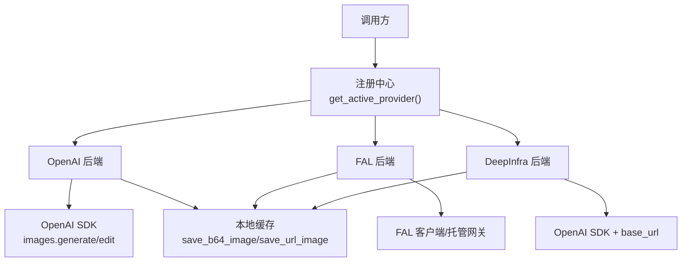
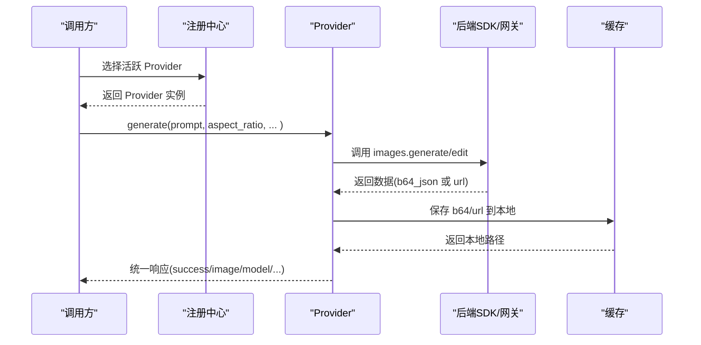
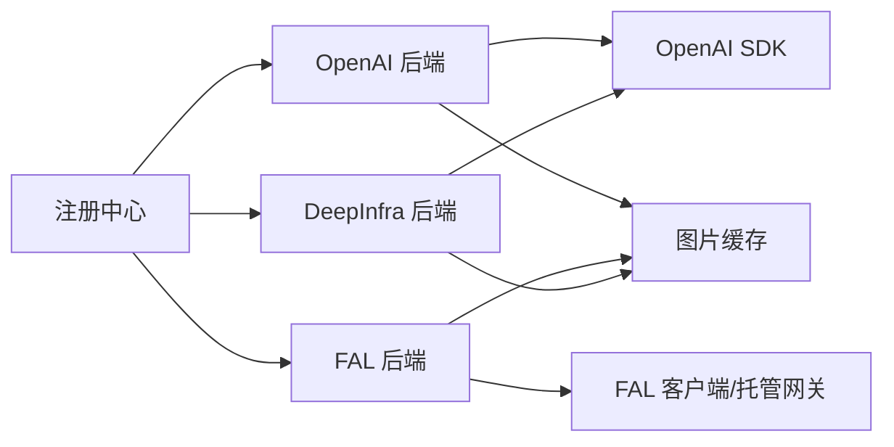

# 图像生成接口

<cite>
**本文引用的文件**
- [agent/image_gen_provider.py](file://agent/image_gen_provider.py)
- [agent/image_gen_registry.py](file://agent/image_gen_registry.py)
- [tools/image_generation_tool.py](file://tools/image_generation_tool.py)
- [plugins/image_gen/openai/__init__.py](file://plugins/image_gen/openai/__init__.py)
- [plugins/image_gen/fal/__init__.py](file://plugins/image_gen/fal/__init__.py)
- [plugins/image_gen/deepinfra/__init__.py](file://plugins/image_gen/deepinfra/__init__.py)
</cite>

## 目录
1. [简介](#简介)
2. [项目结构](#项目结构)
3. [核心组件](#核心组件)
4. [架构总览](#架构总览)
5. [详细组件分析](#详细组件分析)
6. [依赖关系分析](#依赖关系分析)
7. [性能与成本](#性能与成本)
8. [故障排查指南](#故障排查指南)
9. [结论](#结论)
10. [附录：API 规范（/v1/images/generations）](#附录v1imagesgenerations)

## 简介
本文件面向“图像生成”能力，提供统一的调用入口与实现细节说明。系统通过插件化的后端抽象（ImageGenProvider）将多种图像模型（如 OpenAI gpt-image-2、FAL.ai 多模型族、DeepInfra 等）统一暴露为一致的请求/响应契约；同时提供 FAL 专属的模型目录、尺寸映射、质量与批量参数、以及后处理（缓存本地化、可选放大）。

注意：仓库未直接暴露名为 /v1/images/generations 的 HTTP 路由；但多个后端（OpenAI、DeepInfra）使用 OpenAI 兼容的 images.generate 语义。本文在附录中给出该端点的标准化请求/响应约定，便于上层网关或客户端对接。

## 项目结构
- 抽象层：定义统一的 Provider 接口、通用工具函数（比例归一化、参考图归一化、b64/URL 图片落盘、成功/失败响应构造）。
- 注册中心：维护已注册的 Provider，按配置选择当前生效的后端。
- 具体后端：
  - OpenAI：gpt-image-2 三档 quality（low/medium/high），支持文生图与编辑（image-to-image）。
  - FAL：集中式模型目录与负载构建，支持多模型族与可选 Clarity 放大。
  - DeepInfra：动态发现模型，OpenAI 兼容的 images.generate 调用。
- 工具层：FAL 专用模型目录、尺寸映射、默认参数、提交与托管网关选择、放大链。

图表来源
- [agent/image_gen_registry.py:75-139](file://agent/image_gen_registry.py#L75-L139)
- [plugins/image_gen/openai/__init__.py:165-409](file://plugins/image_gen/openai/__init__.py#L165-L409)
- [plugins/image_gen/fal/__init__.py:40-202](file://plugins/image_gen/fal/__init__.py#L40-L202)
- [plugins/image_gen/deepinfra/__init__.py:126-331](file://plugins/image_gen/deepinfra/__init__.py#L126-L331)
- [agent/image_gen_provider.py:245-344](file://agent/image_gen_provider.py#L245-L344)

章节来源
- [agent/image_gen_registry.py:1-146](file://agent/image_gen_registry.py#L1-L146)
- [agent/image_gen_provider.py:1-400](file://agent/image_gen_provider.py#L1-L400)

## 核心组件
- ImageGenProvider 抽象类
  - 统一方法 generate(prompt, aspect_ratio, image_url, reference_image_urls, **kwargs)，返回统一的成功/失败字典。
  - 能力声明 capabilities() 告知是否支持 text-to-image 与 image-to-image，以及参考图上限。
  - 模型目录 list_models()、默认模型 default_model()、设置引导 get_setup_schema()。
- 注册中心
  - 读取配置 image_gen.provider，回退策略：唯一可用提供者 > 历史 fal > None。
  - 线程安全注册表，避免并发冲突。
- 工具函数
  - 比例归一化 resolve_aspect_ratio：限制为 landscape/square/portrait。
  - 参考图归一化 normalize_reference_images：字符串或列表清洗。
  - 图片落盘 save_b64_image/save_url_image：统一缓存到 $SPARKII_HOME/cache/images/，限制大小与类型。
  - 成功/失败响应 success_response/error_response：统一字段 success、image、model、prompt、aspect_ratio、modality、provider、error、error_type。

章节来源
- [agent/image_gen_provider.py:64-194](file://agent/image_gen_provider.py#L64-L194)
- [agent/image_gen_provider.py:202-399](file://agent/image_gen_provider.py#L202-L399)
- [agent/image_gen_registry.py:36-139](file://agent/image_gen_registry.py#L36-L139)

## 架构总览
- 调用路径
  - 客户端通过统一入口（例如 tools.image_generate_tool 或 Provider.generate）发起请求。
  - 注册中心根据配置选择活跃 Provider。
  - 各 Provider 将请求转换为后端特定调用（OpenAI SDK、FAL 客户端、DeepInfra base_url）。
  - 响应统一封装为 success/error 字典，并可能将 b64/URL 图片缓存到本地。
- 关键特性
  - 文生图与图编辑统一入口：presence of image_url/reference_image_urls 决定路由。
  - 尺寸映射：不同模型族采用不同 size 风格（preset、aspect ratio、literal）。
  - 质量与批量：quality（OpenAI）、num_images（FAL/部分模型）、resolution（Nano Banana）。
  - 可选放大：Clarity Upscaler 对指定模型启用。

图表来源
- [agent/image_gen_registry.py:75-139](file://agent/image_gen_registry.py#L75-L139)
- [plugins/image_gen/openai/__init__.py:219-409](file://plugins/image_gen/openai/__init__.py#L219-L409)
- [plugins/image_gen/fal/__init__.py:118-202](file://plugins/image_gen/fal/__init__.py#L118-L202)
- [plugins/image_gen/deepinfra/__init__.py:174-331](file://plugins/image_gen/deepinfra/__init__.py#L174-L331)
- [agent/image_gen_provider.py:245-344](file://agent/image_gen_provider.py#L245-L344)

## 详细组件分析

### 抽象与工具（ImageGenProvider）
- 输入
  - prompt：必填文本提示词。
  - aspect_ratio：landscape/square/portrait，自动归一化。
  - image_url/reference_image_urls：用于图编辑/风格参考，会被归一化为列表并受各后端 max_reference_images 限制。
  - kwargs：向后兼容扩展（如 upscale、seed、num_images 等）。
- 输出
  - 成功：success=true，包含 image（URL 或本地路径）、model、prompt、aspect_ratio、modality、provider，可选 extra。
  - 失败：success=false，包含 error、error_type、provider、model、prompt、aspect_ratio。
- 能力
  - modalities：["text"] 或 ["text","image"]。
  - max_reference_images：参考图数量上限。

章节来源
- [agent/image_gen_provider.py:64-194](file://agent/image_gen_provider.py#L64-L194)
- [agent/image_gen_provider.py:202-399](file://agent/image_gen_provider.py#L202-L399)

### OpenAI 后端（gpt-image-2）
- 模型与质量
  - 虚拟模型 ID：gpt-image-2-low/medium/high，对应 quality=low/medium/high。
  - 尺寸：landscape=1536x1024，square=1024x1024，portrait=1024x1536。
- 功能
  - 文生图：images.generate，返回 b64_json 或 url。
  - 图编辑：images.edit，支持多源图（最多 16 张）。
- 后处理
  - 优先保存 b64 到本地；若返回 URL，则尝试下载到本地缓存，失败则退回裸 URL。
- 错误处理
  - 缺失 API Key、包未安装、网络/IO 异常、空响应等均有明确 error_type。

章节来源
- [plugins/image_gen/openai/__init__.py:45-83](file://plugins/image_gen/openai/__init__.py#L45-L83)
- [plugins/image_gen/openai/__init__.py:165-409](file://plugins/image_gen/openai/__init__.py#L165-L409)

### FAL 后端（多模型族）
- 模型目录
  - 集中管理于 tools/image_generation_tool.py 的 FAL_MODELS，涵盖 FLUX 2、Z-Image、Nano Banana、GPT Image 1.5/2、Recraft、Ideogram、Qwen、Krea、Seedream、MAI 等。
  - 每个模型声明 size_style（image_size_preset/aspect_ratio/gpt_literal）、sizes 映射、defaults（如 num_inference_steps、guidance_scale、output_format、sync_mode 等）、supports 白名单、upscale 开关、edit_endpoint（若支持编辑）及 max_reference_images。
- 提交与网关
  - 支持直连 FAL_KEY 或通过托管 Nous 网关（fal-queue）提交，自动选择。
  - 幂等键 x-idempotency-key 保证重试安全。
- 后处理
  - 可选 Clarity Upscaler 放大（按模型开关）。
- 错误处理
  - 托管网关 4xx 时给出可操作提示（切换直连或更换模型）。

章节来源
- [tools/image_generation_tool.py:76-667](file://tools/image_generation_tool.py#L76-L667)
- [tools/image_generation_tool.py:690-766](file://tools/image_generation_tool.py#L690-L766)
- [plugins/image_gen/fal/__init__.py:40-202](file://plugins/image_gen/fal/__init__.py#L40-L202)

### DeepInfra 后端（OpenAI 兼容）
- 模型发现
  - 动态从 DeepInfra 目录拉取 image-gen 标签模型，支持 env/config 覆盖。
- 调用方式
  - 使用 OpenAI SDK，设置 base_url 指向 DeepInfra，调用 images.generate。
- 尺寸
  - 沿用与 OpenAI 一致的 size 字符串映射。
- 后处理
  - 优先保存 b64；若返回 URL，尝试下载到本地缓存，失败退回裸 URL。
- 错误处理
  - 无可用模型、缺少密钥、网络/IO 异常、空响应等均有明确 error_type。

章节来源
- [plugins/image_gen/deepinfra/__init__.py:48-124](file://plugins/image_gen/deepinfra/__init__.py#L48-L124)
- [plugins/image_gen/deepinfra/__init__.py:126-331](file://plugins/image_gen/deepinfra/__init__.py#L126-L331)

### 尺寸规格与质量/批量
- 尺寸规格
  - 按模型族采用不同 size 风格：
    - image_size_preset：如 landscape_16_9、square_hd、portrait_16_9（FLUX、Recraft、Ideogram、Qwen、Seedream 等）。
    - aspect_ratio：如 16:9、1:1、9:16（Nano Banana、Krea、MAI 等）。
    - gpt_literal：如 1536x1024、1024x1024、1024x1536（GPT Image 1.5/2）。
  - 统一由 aspect_ratio 映射到具体值，未知值回退到 square。
- 质量设置
  - OpenAI：quality=low/medium/high（影响速度与保真度）。
  - FAL：各模型 defaults 中的 quality/resolution/rendering_speed 等。
- 批量生成
  - num_images：多数 FAL 模型支持；OpenAI 固定 n=1。
  - 部分模型有最大像素或分辨率限制（如 GPT Image 2 最小像素要求）。

章节来源
- [tools/image_generation_tool.py:97-661](file://tools/image_generation_tool.py#L97-L661)
- [plugins/image_gen/openai/__init__.py:78-83](file://plugins/image_gen/openai/__init__.py#L78-L83)
- [plugins/image_gen/deepinfra/__init__.py:48-55](file://plugins/image_gen/deepinfra/__init__.py#L48-L55)

### 同步与异步调用
- 同步
  - 大多数 Provider 调用为同步阻塞（OpenAI SDK 同步、FAL 同步提交）。
- 异步
  - 代码库未在本模块暴露显式异步 images.generate；如需异步，可在上层以任务队列/协程包装调用。
- 幂等
  - FAL 提交携带 x-idempotency-key，适合重试场景。

章节来源
- [tools/image_generation_tool.py:725-766](file://tools/image_generation_tool.py#L725-L766)
- [plugins/image_gen/openai/__init__.py:219-409](file://plugins/image_gen/openai/__init__.py#L219-L409)
- [plugins/image_gen/deepinfra/__init__.py:174-331](file://plugins/image_gen/deepinfra/__init__.py#L174-L331)

### 响应格式与元信息
- 成功响应字段
  - success: true
  - image: 字符串（HTTP URL 或本地绝对路径）
  - model: 提供商内部模型标识
  - prompt: 原始提示词
  - aspect_ratio: 归一化后的比例
  - modality: "text" 或 "image"
  - provider: 提供商名称
  - extra: 可选扩展（如 size、quality、revised_prompt、upscaled 等）
- 失败响应字段
  - success: false
  - error: 人类可读错误信息
  - error_type: 分类（如 invalid_argument、auth_required、api_error、empty_response、io_error 等）
  - 其他字段同成功响应（尽可能保留上下文）

章节来源
- [agent/image_gen_provider.py:347-399](file://agent/image_gen_provider.py#L347-L399)
- [plugins/image_gen/openai/__init__.py:397-409](file://plugins/image_gen/openai/__init__.py#L397-L409)
- [plugins/image_gen/deepinfra/__init__.py:324-331](file://plugins/image_gen/deepinfra/__init__.py#L324-L331)

### 错误处理、限流与成本控制
- 错误处理
  - 参数校验：空 prompt、不支持的模态（DeepInfra 仅文生图）。
  - 鉴权：缺失 API Key（OpenAI/DeepInfra）。
  - 依赖：openai 包未安装。
  - 网络/IO：下载失败、文件大小超限、内容类型非图像。
  - 空响应：后端未返回 b64_json 或 url。
- 限流机制
  - 代码库未内置全局限流器；建议在上层网关或 SDK 层基于供应商配额进行节流与退避。
- 成本控制
  - 质量档位（OpenAI low/medium/high）控制费用与速度。
  - FAL 模型定价与 MP/每图计费差异明显，按需选择。
  - 分辨率/尺寸（如 Nano Banana 1K vs 4K）影响单价。
  - 批量 num_images 增加线性成本。

章节来源
- [plugins/image_gen/openai/__init__.py:176-217](file://plugins/image_gen/openai/__init__.py#L176-L217)
- [plugins/image_gen/deepinfra/__init__.py:141-158](file://plugins/image_gen/deepinfra/__init__.py#L141-L158)
- [tools/image_generation_tool.py:97-661](file://tools/image_generation_tool.py#L97-L661)

### 图像后处理、格式转换与安全过滤
- 后处理
  - 本地缓存：b64 解码写入 $SPARKII_HOME/cache/images/；URL 下载并限制最大字节数（默认 25MB）。
  - 格式推断：依据 Content-Type 或 URL 后缀推断 png/jpg/webp/gif，未知回退 png。
  - 可选放大：FAL 模型可按开关启用 Clarity Upscaler。
- 安全过滤
  - 部分模型支持 enable_safety_checker、safety_tolerance 等参数（见 FAL_MODELS defaults/supports）。
  - 本地文件读取前执行安全检查（OpenAI 后端加载参考图时对本地路径调用安全守卫）。

章节来源
- [agent/image_gen_provider.py:236-344](file://agent/image_gen_provider.py#L236-L344)
- [plugins/image_gen/openai/__init__.py:127-157](file://plugins/image_gen/openai/__init__.py#L127-L157)
- [tools/image_generation_tool.py:97-661](file://tools/image_generation_tool.py#L97-L661)

## 依赖关系分析
- 组件耦合
  - 注册中心依赖配置与 Provider 可用性检测。
  - 各 Provider 依赖各自 SDK（openai）或 FAL 客户端/托管网关。
  - 工具函数被所有 Provider 复用（比例/参考图归一化、图片落盘、响应构造）。
- 外部依赖
  - openai Python 包（OpenAI/DeepInfra 后端）。
  - requests（下载 URL 图片）。
  - 文件系统（缓存目录创建与写入）。

图表来源
- [agent/image_gen_registry.py:75-139](file://agent/image_gen_registry.py#L75-L139)
- [plugins/image_gen/openai/__init__.py:165-409](file://plugins/image_gen/openai/__init__.py#L165-L409)
- [plugins/image_gen/fal/__init__.py:40-202](file://plugins/image_gen/fal/__init__.py#L40-L202)
- [plugins/image_gen/deepinfra/__init__.py:126-331](file://plugins/image_gen/deepinfra/__init__.py#L126-L331)
- [agent/image_gen_provider.py:245-344](file://agent/image_gen_provider.py#L245-L344)

章节来源
- [agent/image_gen_registry.py:1-146](file://agent/image_gen_registry.py#L1-L146)
- [agent/image_gen_provider.py:1-400](file://agent/image_gen_provider.py#L1-L400)

## 性能与成本
- 性能
  - 模型速度差异显著（<1s 至 ~2min），选择合适模型与 quality。
  - 上传/下载大图的 IO 开销；缓存本地可减少重复传输。
  - 托管网关可能引入额外延迟，但简化鉴权与计费。
- 成本
  - OpenAI quality 越高越贵；FAL 按 MP/每图计费；分辨率提升（如 1K→4K）会增加单价。
  - 批量 num_images 线性增长成本。
  - 放大（Upscaler）额外步骤，带来时间与费用。

[本节为通用指导，不直接分析具体文件]

## 故障排查指南
- 常见错误与定位
  - 空提示词：invalid_argument。
  - 缺少 API Key：auth_required（OpenAI/DeepInfra）。
  - 依赖缺失：missing_dependency（未安装 openai）。
  - 后端拒绝：api_error（含 4xx 时查看托管网关提示）。
  - 空响应：empty_response（无 b64_json 或 url）。
  - IO 错误：io_error（下载失败、文件过大、内容类型非图像）。
- 诊断要点
  - 确认 image_gen.provider 配置与实际注册一致。
  - 检查环境变量（OPENAI_API_KEY、DEEPINFRA_API_KEY、FAL_KEY）。
  - 查看缓存目录是否存在且可写。
  - 对于 FAL 托管网关 4xx，考虑切换直连或更换模型。

章节来源
- [plugins/image_gen/openai/__init__.py:219-409](file://plugins/image_gen/openai/__init__.py#L219-L409)
- [plugins/image_gen/deepinfra/__init__.py:174-331](file://plugins/image_gen/deepinfra/__init__.py#L174-L331)
- [tools/image_generation_tool.py:725-766](file://tools/image_generation_tool.py#L725-L766)

## 结论
本系统通过统一的 Provider 抽象与注册中心，将多种图像生成后端整合为一致的调用体验。尺寸、质量、批量与后处理均在各后端内精细化控制，并通过工具函数保障一致性。建议在业务侧结合模型特性与成本模型选择合适的 provider/model/quality/size，并在网关层实施限流与重试策略。

[本节为总结性内容，不直接分析具体文件]

## 附录：API 规范（/v1/images/generations）
说明：仓库未直接暴露该 HTTP 路由；以下规范基于 OpenAI 兼容语义与各 Provider 行为归纳，适用于上层网关或客户端对接。

- 端点
  - POST /v1/images/generations
- 认证
  - 通过 Provider 配置的密钥（OPENAI_API_KEY、DEEPINFRA_API_KEY、FAL_KEY）或托管网关鉴权。
- 请求体
  - prompt: string（必填）
  - model: string（可选；Provider 内部模型标识，如 gpt-image-2、fal-ai/...）
  - size: string（可选；如 1024x1024、1536x1024、1024x1536；或由 aspect_ratio 映射）
  - aspect_ratio: string（可选；landscape/square/portrait，将被归一化）
  - n: integer（可选；批量数量，OpenAI 固定为 1，FAL 多数模型支持）
  - quality: string（可选；OpenAI gpt-image-2 支持 low/medium/high）
  - resolution: string（可选；如 1K/4K，针对特定模型）
  - image_url: string（可选；图编辑主图）
  - reference_image_urls: string[]（可选；风格/构图参考图）
  - seed: integer（可选；随机种子）
  - output_format: string（可选；png/jpg/webp/gif 等，依模型支持）
  - sync_mode: boolean（可选；部分模型同步模式）
  - 其他：由各模型 supports 白名单决定（如 guidance_scale、num_inference_steps、rendering_speed、enable_safety_checker 等）
- 响应体
  - success: boolean
  - image: string（HTTP URL 或本地绝对路径）
  - model: string
  - prompt: string
  - aspect_ratio: string
  - modality: string（"text"|"image"）
  - provider: string
  - extra: object（可选；size、quality、revised_prompt、upscaled 等）
  - 失败时：error: string、error_type: string
- 错误码与含义
  - invalid_argument：参数无效（如空 prompt）
  - auth_required：鉴权失败（缺少 API Key）
  - missing_dependency：依赖缺失（如未安装 openai）
  - api_error：后端 API 错误
  - empty_response：后端未返回有效图像数据
  - io_error：IO/下载/保存失败
  - modality_unsupported：模态不支持（如 DeepInfra 仅文生图）
  - no_model_available：无可用模型（如目录不可达且未配置）
- 示例（概念性）
  - 同步调用（OpenAI）
    - 请求：{ "prompt": "...", "model": "gpt-image-2", "size": "1024x1024", "n": 1, "quality": "medium" }
    - 响应：{ "success": true, "image": "/path/to/cache/image.png", "model": "gpt-image-2-medium", "prompt": "...", "aspect_ratio": "square", "modality": "text", "provider": "openai", "extra": { "size": "1024x1024", "quality": "medium" } }
  - 同步调用（FAL）
    - 请求：{ "prompt": "...", "model": "fal-ai/flux-2-pro", "size": "square_hd", "n": 1, "output_format": "png" }
    - 响应：{ "success": true, "image": "/path/to/cache/image.png", "model": "fal-ai/flux-2-pro", "prompt": "...", "aspect_ratio": "square", "modality": "text", "provider": "fal", "extra": { "size": "square_hd" } }
  - 图编辑（OpenAI）
    - 请求：{ "prompt": "...", "model": "gpt-image-2", "size": "1024x1024", "image_url": "https://...", "reference_image_urls": ["..."], "n": 1, "quality": "high" }
    - 响应：同上，modality="image"
- 注意事项
  - 尺寸映射与质量档位因模型而异，请参照各 Provider 的模型目录与 defaults。
  - 批量 n>1 会线性增加成本与耗时。
  - 图编辑需确保参考图数量不超过模型上限。
  - 缓存目录需具备写入权限。

[本节为概念性规范，不直接分析具体文件]