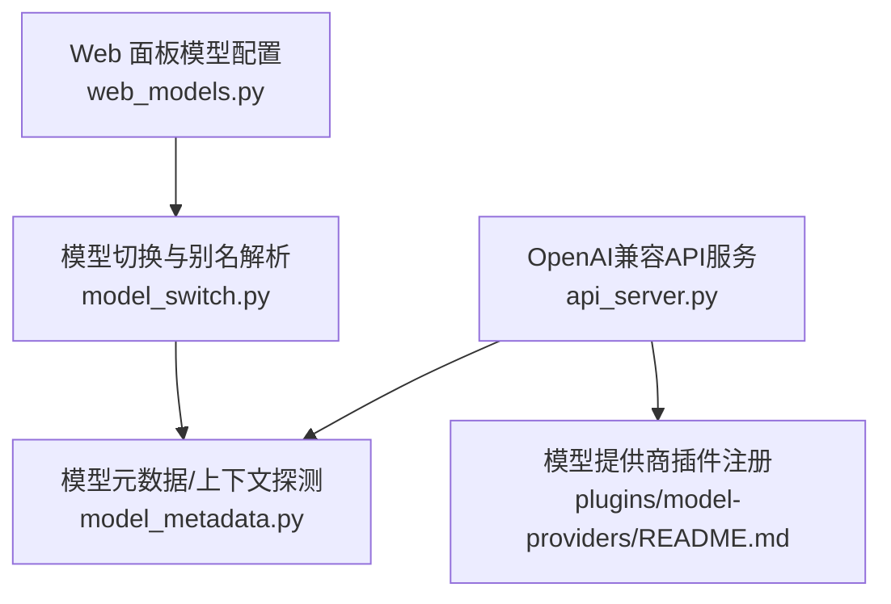
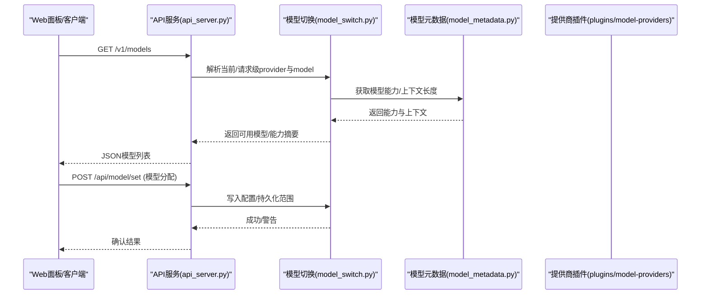
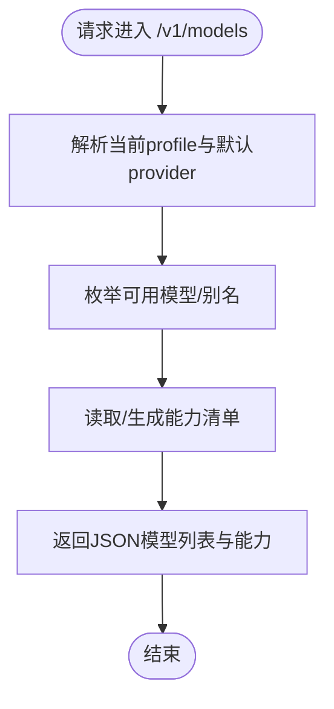
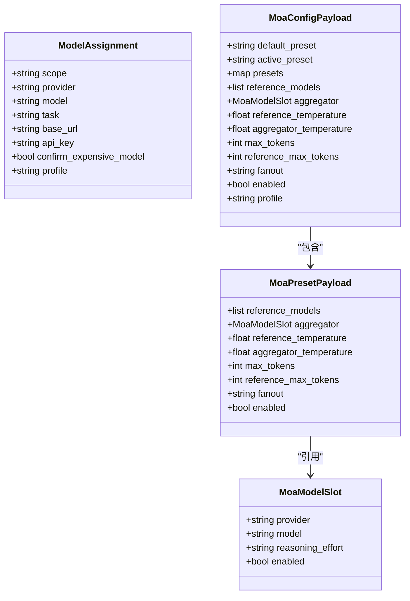
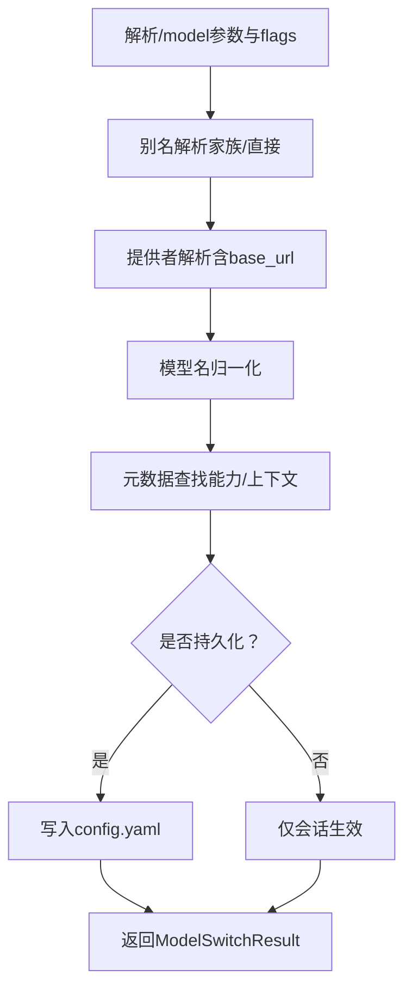
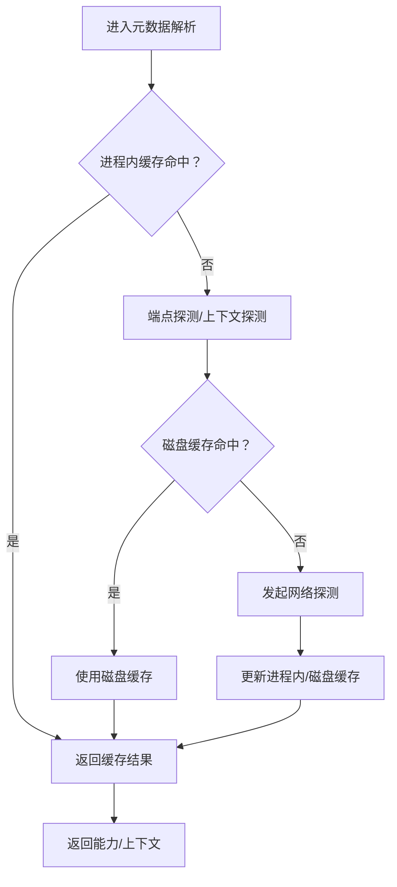
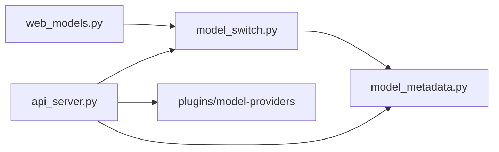

# 模型管理接口

<cite>
**本文引用的文件**
- [sparkii_cli/web_models.py](file://sparkii_cli/web_models.py)
- [sparkii_cli/model_switch.py](file://sparkii_cli/model_switch.py)
- [agent/model_metadata.py](file://agent/model_metadata.py)
- [gateway/platforms/api_server.py](file://gateway/platforms/api_server.py)
- [plugins/model-providers/README.md](file://plugins/model-providers/README.md)
</cite>

## 目录
1. [简介](#简介)
2. [项目结构](#项目结构)
3. [核心组件](#核心组件)
4. [架构总览](#架构总览)
5. [详细组件分析](#详细组件分析)
6. [依赖关系分析](#依赖关系分析)
7. [性能考虑](#性能考虑)
8. [故障排查指南](#故障排查指南)
9. [结论](#结论)
10. [附录](#附录)

## 简介
本文件面向“模型管理”的完整API文档，覆盖以下能力：
- 模型列表查询、模型切换与模型配置（RESTful）
- 支持的模型提供商（OpenAI、Anthropic、Google等）及功能特性
- 模型能力检测、价格计算与使用统计接口
- 模型选择策略、负载均衡与故障转移配置
- 模型缓存机制、预热优化与性能监控
- 自定义模型注册、模型版本管理与A/B测试支持
- 安全访问控制、权限验证与审计日志

说明：本文档基于仓库中实际代码路径与实现进行归纳，所有端点与行为均以源码为依据。

## 项目结构
围绕模型管理的核心代码分布在以下位置：
- Web 面板请求/响应模型定义：sparkii_cli/web_models.py
- 模型切换与别名解析逻辑：sparkii_cli/model_switch.py
- 模型元数据、上下文长度探测与缓存：agent/model_metadata.py
- OpenAI兼容API服务（含 /v1/models 等）：gateway/platforms/api_server.py
- 模型提供商插件注册与发现：plugins/model-providers/README.md

**图表来源**
- [sparkii_cli/web_models.py:122-215](file://sparkii_cli/web_models.py#L122-L215)
- [sparkii_cli/model_switch.py:292-477](file://sparkii_cli/model_switch.py#L292-L477)
- [agent/model_metadata.py:130-161](file://agent/model_metadata.py#L130-L161)
- [gateway/platforms/api_server.py:1-40](file://gateway/platforms/api_server.py#L1-L40)
- [plugins/model-providers/README.md:17-27](file://plugins/model-providers/README.md#L17-L27)

**章节来源**
- [sparkii_cli/web_models.py:122-215](file://sparkii_cli/web_models.py#L122-L215)
- [sparkii_cli/model_switch.py:292-477](file://sparkii_cli/model_switch.py#L292-L477)
- [agent/model_metadata.py:130-161](file://agent/model_metadata.py#L130-L161)
- [gateway/platforms/api_server.py:1-40](file://gateway/platforms/api_server.py#L1-L40)
- [plugins/model-providers/README.md:17-27](file://plugins/model-providers/README.md#L17-L27)

## 核心组件
- 模型分配与MOA多模型配置（Web面板）：用于将provider/model绑定到主槽或辅助槽，并支持MOA预设与聚合器配置。
- 模型切换引擎：统一解析/flags、别名解析、提供者解析、凭据解析、名称归一化、元数据查找与结果构建。
- 模型元数据与上下文探测：提供模型能力、上下文长度探测、端点探测缓存、本地探针磁盘缓存等。
- OpenAI兼容API服务：暴露/v1/models、/v1/capabilities等端点，供外部客户端消费。
- 模型提供商插件：通过注册表动态发现与加载各提供商Profile。

**章节来源**
- [sparkii_cli/web_models.py:122-215](file://sparkii_cli/web_models.py#L122-L215)
- [sparkii_cli/model_switch.py:292-477](file://sparkii_cli/model_switch.py#L292-L477)
- [agent/model_metadata.py:130-161](file://agent/model_metadata.py#L130-L161)
- [gateway/platforms/api_server.py:1-40](file://gateway/platforms/api_server.py#L1-L40)
- [plugins/model-providers/README.md:17-27](file://plugins/model-providers/README.md#L17-L27)

## 架构总览
系统以“Web面板 + API服务 + 模型切换引擎 + 元数据/缓存 + 提供商插件”构成闭环：
- Web面板通过配置更新与模型分配接口驱动运行时配置。
- API服务对外暴露OpenAI兼容端点，内部复用模型切换与元数据能力。
- 模型切换引擎负责别名、提供者、凭据、名称归一化与持久化范围决策。
- 元数据模块提供上下文长度探测、端点探测缓存与本地磁盘缓存，提升启动与切换性能。
- 提供商插件通过注册表动态加载，支持扩展新厂商。

**图表来源**
- [gateway/platforms/api_server.py:1-40](file://gateway/platforms/api_server.py#L1-L40)
- [sparkii_cli/model_switch.py:292-477](file://sparkii_cli/model_switch.py#L292-L477)
- [agent/model_metadata.py:130-161](file://agent/model_metadata.py#L130-L161)
- [plugins/model-providers/README.md:17-27](file://plugins/model-providers/README.md#L17-L27)

## 详细组件分析

### RESTful API端点（模型相关）
- 模型列表查询
  - 方法/路径：GET /v1/models
  - 作用：列出sparkii-agent与配置的模型路由别名，供OpenAI兼容前端使用。
  - 说明：由API服务提供，内部复用模型切换与元数据能力。
- 模型能力检测
  - 方法/路径：GET /v1/capabilities
  - 作用：机器可读的API能力清单，便于外部UI适配。
- 会话与运行（与模型选择联动）
  - 方法/路径：POST /v1/chat/completions、POST /v1/responses、GET /v1/runs、POST /v1/runs/{run_id}/stop 等
  - 作用：在请求体中可指定provider/model/model_options，触发一次性的模型/提供者覆盖。

注意：以上端点定义来源于API服务模块的注释与实现入口。

**章节来源**
- [gateway/platforms/api_server.py:1-40](file://gateway/platforms/api_server.py#L1-L40)

### 模型列表查询与能力检测流程

**图表来源**
- [gateway/platforms/api_server.py:1-40](file://gateway/platforms/api_server.py#L1-L40)

**章节来源**
- [gateway/platforms/api_server.py:1-40](file://gateway/platforms/api_server.py#L1-L40)

### 模型切换与配置（Web面板）
- 模型分配（主槽/辅助槽）
  - 方法/路径：POST /api/model/set
  - 载荷：ModelAssignment（scope/provider/model/base_url/api_key/profile等）
  - 作用：将provider与model绑定到主槽或辅助槽；支持一次性/会话/全局持久化范围。
- MOA多模型配置
  - 方法/路径：PUT/PATCH /api/moa（具体路径见Web面板路由）
  - 载荷：MoaConfigPayload/MoaPresetPayload（参考模型槽、聚合器、温度、最大token、启用开关等）
  - 作用：配置多路参考模型与聚合器的推理参数与启用状态。
- 环境变量与自定义端点
  - 方法/路径：PUT /api/env、DELETE /api/env、自定义端点更新
  - 载荷：EnvVarUpdate/EnvVarDelete/CustomEndpointUpdate
  - 作用：设置/删除环境变量，配置自定义本地/自托管端点（如Ollama、vLLM）。

**图表来源**
- [sparkii_cli/web_models.py:122-215](file://sparkii_cli/web_models.py#L122-L215)

**章节来源**
- [sparkii_cli/web_models.py:122-215](file://sparkii_cli/web_models.py#L122-L215)

### 模型切换引擎（别名、提供者、持久化范围）
- 别名解析：内置家族别名（如sonnet/gpt/gemini等），以及直接别名映射（绕过目录解析）。
- 提供者解析：从配置/请求级覆盖解析出最终provider与base_url。
- 持久化范围：根据--once/--session/--global与配置项决定写入config.yaml的范围。
- 结果对象：ModelSwitchResult封装成功/失败、新模型、提供者变更、能力、警告等信息。

**图表来源**
- [sparkii_cli/model_switch.py:292-477](file://sparkii_cli/model_switch.py#L292-L477)

**章节来源**
- [sparkii_cli/model_switch.py:292-477](file://sparkii_cli/model_switch.py#L292-L477)

### 模型元数据、能力检测与缓存
- 能力与上下文长度：集中维护各模型族/端点的上下文长度默认值与探测降级策略。
- 端点探测缓存：进程内缓存+磁盘缓存（TTL控制），避免重复网络探测导致的启动卡顿。
- 黑名单机制：对连接超时端点进行短期屏蔽，减少无效重试。
- 本地探针磁盘缓存：记录成功探测结果，跨CLI冷启动加速。

**图表来源**
- [agent/model_metadata.py:130-161](file://agent/model_metadata.py#L130-L161)
- [agent/model_metadata.py:238-349](file://agent/model_metadata.py#L238-L349)

**章节来源**
- [agent/model_metadata.py:130-161](file://agent/model_metadata.py#L130-L161)
- [agent/model_metadata.py:238-349](file://agent/model_metadata.py#L238-L349)

### 模型提供商与功能特性
- 支持厂商：OpenAI、Anthropic、Google（Gemini）、DeepSeek、X.AI、Meta、Qwen/Alibaba、MiniMax、Nvidia、Kimi/Moonshot、Z.AI、StepFun、Xiaomi、Arcee、GMI、Novita、Ollama Cloud等。
- 插件机制：每个子目录为独立ProviderProfile，通过register_provider注册，支持用户覆盖内置插件。
- 功能特性：不同提供商具备不同的能力（如工具调用、思考模式、图像输入、流式输出等），由各自Profile与传输层适配。

**章节来源**
- [plugins/model-providers/README.md:1-71](file://plugins/model-providers/README.md#L1-L71)

### 价格计算与使用统计
- 说明：仓库中存在计费与用量相关模块（如billing_usage、usage_pricing等），但本仓库未暴露独立的“价格计算/使用统计”REST端点。若需对外提供，可在API服务中新增对应路由，复用现有计费/用量模块。
- 建议：在新增端点时遵循现有错误处理与限流策略，确保幂等性与审计日志。

[本节为概念性说明，不直接分析具体文件]

### 模型选择策略、负载均衡与故障转移
- 选择策略：
  - 优先级：会话覆盖 > 通道/会话持久化 > 全局默认。
  - 别名优先：家族别名与直接别名先于目录解析。
  - 请求级覆盖：API请求体中的provider/model/model_options可临时覆盖。
- 负载均衡：
  - 可通过多实例部署与反向代理实现；或在MOA模式下并行调用多个参考模型后聚合。
- 故障转移：
  - 结合端点探测缓存与黑名单机制，快速跳过不可用端点；必要时回退至备选provider/model。

**章节来源**
- [sparkii_cli/model_switch.py:760-784](file://sparkii_cli/model_switch.py#L760-L784)
- [agent/model_metadata.py:130-161](file://agent/model_metadata.py#L130-L161)

### 模型缓存机制、预热优化与性能监控
- 缓存机制：
  - 进程内缓存：短TTL，避免重复探测。
  - 磁盘缓存：跨进程/重启保留成功探测结果，缩短冷启动时间。
  - 端点黑名单：对连接超时端点短期屏蔽。
- 预热优化：
  - 启动阶段批量探测常用端点，填充缓存。
  - 对高频模型/端点预取能力与上下文长度。
- 性能监控：
  - 建议在API服务中增加指标上报（请求耗时、错误率、缓存命中率），并结合现有健康检查端点。

**章节来源**
- [agent/model_metadata.py:130-161](file://agent/model_metadata.py#L130-L161)
- [agent/model_metadata.py:238-349](file://agent/model_metadata.py#L238-L349)

### 自定义模型注册、版本管理与A/B测试
- 自定义模型注册：
  - 通过CustomEndpointUpdate配置自定义base_url与可选models白名单，支持无Key的本地/自托管端点。
  - 使用model_aliases在配置中建立直接别名映射。
- 版本管理：
  - 通过别名与模型ID区分版本；MOA预设可按任务维度选择不同版本组合。
- A/B测试：
  - 借助MOA多模型并行与聚合器，对不同模型输出进行对比评估；或通过流量切分（网关层）实现灰度。

**章节来源**
- [sparkii_cli/web_models.py:53-63](file://sparkii_cli/web_models.py#L53-L63)
- [sparkii_cli/model_switch.py:377-441](file://sparkii_cli/model_switch.py#L377-L441)
- [sparkii_cli/web_models.py:151-215](file://sparkii_cli/web_models.py#L151-L215)

### 安全访问控制、权限验证与审计日志
- 访问控制：
  - API服务要求认证密钥（如API_SERVER_KEY），支持多profile前缀隔离。
  - 环境变量与密钥通过受控方式注入，避免泄露。
- 权限验证：
  - Web面板操作需鉴权；敏感操作（如模型切换）可加入二次确认字段（confirm_expensive_model）。
- 审计日志：
  - 建议在关键操作（模型切换、配置更新、模型分配）写入审计日志，记录操作者、时间、变更前后值。

**章节来源**
- [gateway/platforms/api_server.py:1-40](file://gateway/platforms/api_server.py#L1-L40)
- [sparkii_cli/web_models.py:122-149](file://sparkii_cli/web_models.py#L122-L149)

## 依赖关系分析
- Web面板模型配置依赖模型切换引擎进行持久化与生效。
- 模型切换引擎依赖模型元数据模块获取能力与上下文长度。
- API服务依赖模型切换与元数据模块，同时通过提供商插件注册表发现可用厂商。
- 提供商插件通过注册表集中管理，支持用户覆盖内置实现。

**图表来源**
- [sparkii_cli/web_models.py:122-215](file://sparkii_cli/web_models.py#L122-L215)
- [sparkii_cli/model_switch.py:292-477](file://sparkii_cli/model_switch.py#L292-L477)
- [agent/model_metadata.py:130-161](file://agent/model_metadata.py#L130-L161)
- [gateway/platforms/api_server.py:1-40](file://gateway/platforms/api_server.py#L1-L40)
- [plugins/model-providers/README.md:17-27](file://plugins/model-providers/README.md#L17-L27)

**章节来源**
- [sparkii_cli/web_models.py:122-215](file://sparkii_cli/web_models.py#L122-L215)
- [sparkii_cli/model_switch.py:292-477](file://sparkii_cli/model_switch.py#L292-L477)
- [agent/model_metadata.py:130-161](file://agent/model_metadata.py#L130-L161)
- [gateway/platforms/api_server.py:1-40](file://gateway/platforms/api_server.py#L1-L40)
- [plugins/model-providers/README.md:17-27](file://plugins/model-providers/README.md#L17-L27)

## 性能考虑
- 减少重复探测：充分利用进程内与磁盘缓存，降低启动与切换延迟。
- 端点黑名单：对连接超时端点短期屏蔽，避免雪崩式重试。
- 请求级覆盖：仅在必要时覆盖provider/model，避免频繁重解析。
- 流式输出：利用SSE/流式接口降低首字节延迟。
- 资源限制：对内容长度、列表大小等进行防御性限制，防止滥用。

[本节为通用性能建议，不直接分析具体文件]

## 故障排查指南
- 模型列表为空：
  - 检查自定义端点可达性与鉴权头；必要时发送api_key进行连通性探测。
  - 查看端点黑名单与缓存是否误判。
- 模型切换失败：
  - 检查别名解析与提供者解析是否正确；确认持久化范围是否符合预期。
  - 查看警告信息（如非智能模型提示）。
- 上下文长度异常：
  - 确认端点探测是否成功；必要时手动设置context_length。
- API服务不可用：
  - 检查端口绑定、鉴权密钥与多profile前缀配置。

**章节来源**
- [sparkii_cli/web_models.py:23-33](file://sparkii_cli/web_models.py#L23-L33)
- [sparkii_cli/model_switch.py:206-289](file://sparkii_cli/model_switch.py#L206-L289)
- [agent/model_metadata.py:130-161](file://agent/model_metadata.py#L130-L161)

## 结论
本仓库提供了完整的模型管理能力：从Web面板的配置与分配，到API服务的对外暴露，再到模型切换引擎与元数据缓存的底层支撑。通过插件化的提供商注册机制，系统具备良好的可扩展性。建议在新增“价格计算/使用统计”等能力时，沿用现有架构与错误处理规范，并确保安全与审计完备。

[本节为总结性内容，不直接分析具体文件]

## 附录
- 常用端点速查
  - GET /v1/models：模型列表
  - GET /v1/capabilities：能力清单
  - POST /api/model/set：模型分配（主槽/辅助槽）
  - PUT/PATCH /api/moa：MOA多模型配置
  - PUT /api/env、DELETE /api/env：环境变量管理
  - CustomEndpointUpdate：自定义端点配置

[本节为补充信息，不直接分析具体文件]