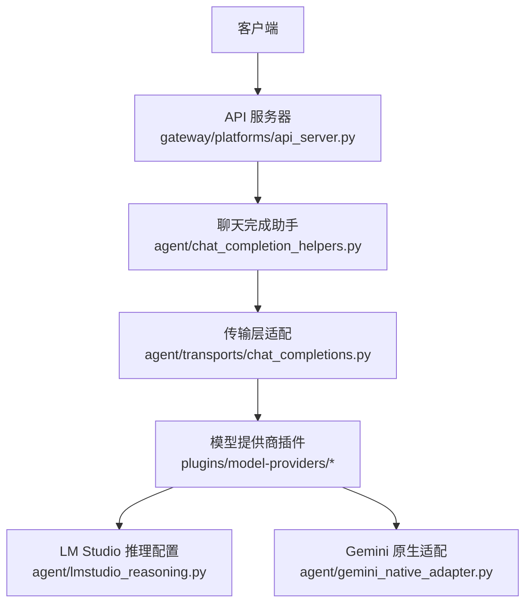
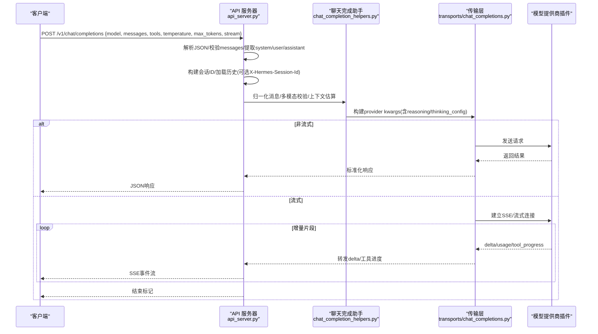
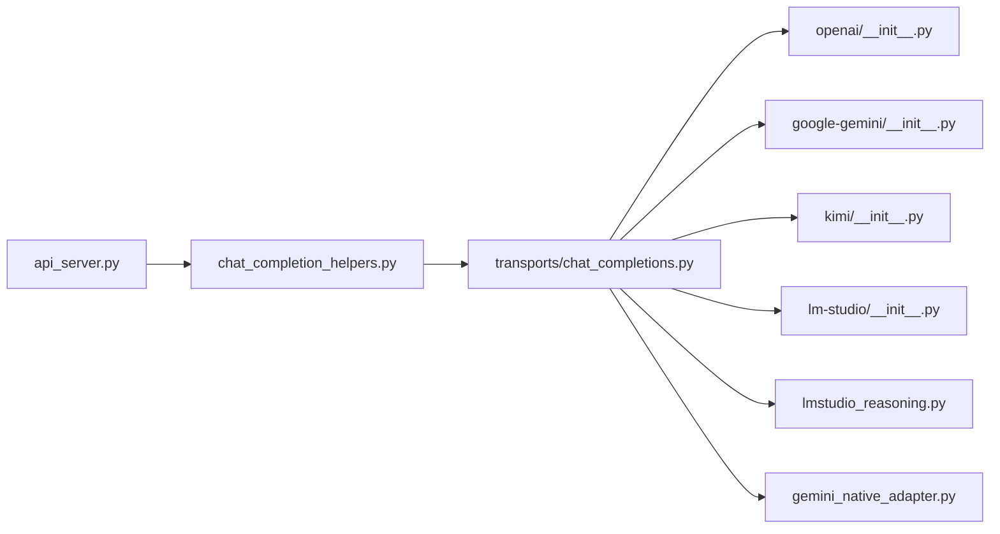

# 聊天完成接口

<cite>
**本文引用的文件**
- [gateway/platforms/api_server.py](file://gateway/platforms/api_server.py)
- [agent/chat_completion_helpers.py](file://agent/chat_completion_helpers.py)
- [agent/transports/chat_completions.py](file://agent/transports/chat_completions.py)
- [agent/lmstudio_reasoning.py](file://agent/lmstudio_reasoning.py)
- [agent/gemini_native_adapter.py](file://agent/gemini_native_adapter.py)
- [agent/turn_context.py](file://agent/turn_context.py)
- [agent/message_content.py](file://agent/message_content.py)
- [agent/message_sanitization.py](file://agent/message_sanitization.py)
- [agent/model_metadata.py](file://agent/model_metadata.py)
- [plugins/model-providers/openai/__init__.py](file://plugins/model-providers/openai/__init__.py)
- [plugins/model-providers/google-gemini/__init__.py](file://plugins/model-providers/google-gemini/__init__.py)
- [plugins/model-providers/kimi/__init__.py](file://plugins/model-providers/kimi/__init__.py)
- [plugins/model-providers/lm-studio/__init__.py](file://plugins/model-providers/lm-studio/__init__.py)
</cite>

## 目录
1. [简介](#简介)
2. [项目结构](#项目结构)
3. [核心组件](#核心组件)
4. [架构总览](#架构总览)
5. [详细组件分析](#详细组件分析)
6. [依赖关系分析](#依赖关系分析)
7. [性能考量](#性能考量)
8. [故障排查指南](#故障排查指南)
9. [结论](#结论)
10. [附录](#附录)

## 简介
本文件面向使用 OpenAI 兼容接口的调用方，提供 /v1/chat/completions 端点的完整 API 文档。内容涵盖请求参数、消息格式、工具调用协议、流式响应处理、多模态输入与媒体处理、不同模型提供商的特殊参数（如 Gemini 的 thinking_config、Kimi 的 reasoning_effort、LM Studio 的推理配置）以及错误处理、重试与限流策略。同时给出 Python SDK 同步与异步调用示例路径，便于快速集成。

## 项目结构
聊天完成接口由网关层暴露 HTTP 路由，内部通过助手函数进行消息解析、会话上下文管理、模型路由与传输层适配，最终调用具体模型提供商。

图表来源
- [gateway/platforms/api_server.py:4020-4219](file://gateway/platforms/api_server.py#L4020-L4219)
- [agent/chat_completion_helpers.py:1-200](file://agent/chat_completion_helpers.py#L1-L200)
- [agent/transports/chat_completions.py:1-200](file://agent/transports/chat_completions.py#L1-L200)
- [agent/lmstudio_reasoning.py:1-61](file://agent/lmstudio_reasoning.py#L1-L61)
- [agent/gemini_native_adapter.py:500-520](file://agent/gemini_native_adapter.py#L500-L520)

章节来源
- [gateway/platforms/api_server.py:4020-4219](file://gateway/platforms/api_server.py#L4020-L4219)
- [agent/chat_completion_helpers.py:1-200](file://agent/chat_completion_helpers.py#L1-L200)
- [agent/transports/chat_completions.py:1-200](file://agent/transports/chat_completions.py#L1-L200)

## 核心组件
- 网关处理器：负责解析请求体、校验 messages、提取 system/user/assistant 角色、构建会话 ID、选择模型路由、开启流式或非流式响应、并发限制与鉴权。
- 聊天完成助手：统一封装消息归一化、多模态内容校验、上下文估算、重试与回退、系统提示合并等逻辑。
- 传输层适配：将 OpenAI 风格的请求转换为各提供商所需的 wire 格式，处理 max_tokens、temperature、reasoning_config、thinking_config 等字段映射。
- 提供商插件：OpenAI、Google Gemini、Kimi、LM Studio 等各自实现具体的请求构造与响应解析。

章节来源
- [gateway/platforms/api_server.py:4020-4219](file://gateway/platforms/api_server.py#L4020-L4219)
- [agent/chat_completion_helpers.py:1-200](file://agent/chat_completion_helpers.py#L1-L200)
- [agent/transports/chat_completions.py:1-200](file://agent/transports/chat_completions.py#L1-L200)

## 架构总览
下图展示了从客户端到模型提供商的端到端调用流程，包括流式与非流式分支、工具调用事件、会话历史加载与模型路由。

图表来源
- [gateway/platforms/api_server.py:4020-4219](file://gateway/platforms/api_server.py#L4020-L4219)
- [agent/chat_completion_helpers.py:1-200](file://agent/chat_completion_helpers.py#L1-L200)
- [agent/transports/chat_completions.py:1-200](file://agent/transports/chat_completions.py#L1-L200)

## 详细组件分析

### 端点与请求参数
- 端点：POST /v1/chat/completions
- 核心请求字段
  - model：字符串，指定使用的模型或别名；支持按客户端的路由覆盖（见“模型路由”）。
  - messages：数组，包含 role 为 system、user、assistant 的消息；content 可为字符串或多模态对象（图片、音频、视频等），需通过多模态校验。
  - tools：数组，描述可用工具（函数定义、名称、参数 schema），用于工具调用。
  - temperature：数值，控制随机性；默认值由传输层根据提供商设定。
  - max_tokens：整数，最大生成 token 数；部分提供商有最小/最大限制。
  - stream：布尔，是否启用流式响应；默认 false。
  - extra_body：可选字典，透传额外字段给提供商（例如 prompt_cache_key、reasoning_config 等）。
- 其他行为
  - system 消息会被合并为临时系统提示，叠加在核心系统提示之上。
  - user 消息必须包含可见内容，否则返回无效请求错误。
  - 支持通过 X-Hermes-Session-Id 继续已有会话并加载历史；需要 API Key 鉴权。
  - 支持通过 X-Hermes-Session-Key 限定长期记忆范围。

章节来源
- [gateway/platforms/api_server.py:4020-4219](file://gateway/platforms/api_server.py#L4020-L4219)
- [agent/chat_completion_helpers.py:1-200](file://agent/chat_completion_helpers.py#L1-L200)

### 消息格式与多模态
- 角色
  - system：系统提示，不支持图片；内容会被归一化为文本并合并。
  - user：用户输入，支持多模态内容（文本+媒体），需通过多模态校验。
  - assistant：助手回复，通常用于对话历史。
- 多模态处理
  - 内容归一化与校验由助手模块完成，确保符合提供商要求。
  - 若 content 不合法，返回多模态验证错误。
- 会话历史
  - 当未提供 X-Hermes-Session-Id 时，系统基于首条用户消息与系统提示派生稳定会话 ID。
  - 当提供 X-Hermes-Session-Id 且已配置 API Key 时，会从状态数据库加载历史消息。

章节来源
- [gateway/platforms/api_server.py:4020-4219](file://gateway/platforms/api_server.py#L4020-L4219)
- [agent/message_content.py:1-200](file://agent/message_content.py#L1-L200)
- [agent/message_sanitization.py:1-200](file://agent/message_sanitization.py#L1-L200)

### 工具调用协议
- 工具定义：在 messages 之外通过 tools 字段声明函数签名与参数 schema。
- 工具执行：
  - 流式模式下，会发出 sparkii.tool.progress 事件，包含 toolCallId、status（running/completed）、tool 名称、emoji、label 等。
  - 内部工具（名称以下划线开头）不会对外暴露。
- 工具调用结果：
  - 在后续消息中以 assistant 角色携带 tool_calls 与 tool_results，形成闭环。

章节来源
- [gateway/platforms/api_server.py:4185-4219](file://gateway/platforms/api_server.py#L4185-L4219)

### 流式响应处理
- 流式开关：stream=true 时，服务端以 SSE 形式推送增量片段。
- 增量事件：
  - 文本增量：逐块返回 content 片段。
  - 工具进度：sparkii.tool.progress 事件，区分 running/completed。
  - 用量统计：usage 信息可在结束时汇总。
- 终止条件：
  - 通过 agent_task.done() 检测任务完成，避免误用 None 作为结束哨兵导致前端提前关闭。

章节来源
- [gateway/platforms/api_server.py:4169-4219](file://gateway/platforms/api_server.py#L4169-L4219)

### 模型路由与提供商特殊参数
- 模型路由：
  - 支持 per-client 模型路由，可将请求中的 model 映射到特定 provider/route。
  - 冲突检测：若请求覆盖与路由配置冲突，返回错误。
- 提供商特殊参数
  - Gemini：
    - thinking_config：将 Hermes/OpenRouter 风格的 reasoning_config 翻译为 Gemini 的 thinkingConfig（includeThoughts、thinkingLevel、thinkingBudget）。
    - 对非 Gemini 模型（如 Gemma/PaLM/Bard）不发送该字段，避免 400。
    - 对 Gemini 3 Flash/Pro 的 thinkingLevel 做严格映射。
  - Kimi：
    - reasoning_effort：顶层字段，控制推理强度；传输层会根据模型能力进行钳制。
  - LM Studio：
    - reasoning_effort：顶层字段；通过 resolve_lmstudio_effort 将通用 effort 映射到 LM Studio 允许集合，必要时省略字段以避免 400。
  - OpenAI：
    - prompt_cache_key：仅在 api.openai.com 主机下自动注入，用于缓存路由。
    - reasoning_config：对 gpt-5.6+ 的 effort=ultra 映射为 max。

章节来源
- [agent/transports/chat_completions.py:79-161](file://agent/transports/chat_completions.py#L79-L161)
- [agent/lmstudio_reasoning.py:1-61](file://agent/lmstudio_reasoning.py#L1-L61)
- [agent/chat_completion_helpers.py:2240-2600](file://agent/chat_completion_helpers.py#L2240-L2600)
- [agent/gemini_native_adapter.py:500-520](file://agent/gemini_native_adapter.py#L500-L520)

### 错误处理机制
- 请求校验：
  - 非法 JSON：返回 400 invalid_request_error。
  - 缺少或非法 messages：返回 400 invalid_request_error。
  - 无可见用户消息：返回 400 invalid_request_error。
  - 多模态内容校验失败：返回多模态验证错误。
  - 会话 ID 不安全或过长：返回 400 invalid_request_error。
  - 会话续期未鉴权：返回 403 禁止访问。
- 运行时错误：
  - 会话历史加载失败：记录警告并降级为空历史。
  - 流式回调中过滤 None 增量，避免提前关闭响应。
- 重试与回退：
  - 非速率限制失败时，全链耗尽后进入短冷却期，避免重复重建大上下文导致的资源耗尽。
  - 速率限制/计费原因保持独立冷却策略。

章节来源
- [gateway/platforms/api_server.py:4020-4219](file://gateway/platforms/api_server.py#L4020-L4219)
- [agent/chat_completion_helpers.py:48-60](file://agent/chat_completion_helpers.py#L48-L60)

### 重试策略与限流控制
- 并发限制：
  - 入口处进行并发限制，超限直接返回受限响应。
- 重试策略：
  - 针对速率限制与计费原因采用独立冷却时间。
  - 非速率限制失败全链耗尽后进入短冷却期，防止频繁重试造成内存/交换压力。
- 限流控制：
  - 通过网关层的并发限制与提供商侧的速率限制共同保障稳定性。

章节来源
- [gateway/platforms/api_server.py:4020-4026](file://gateway/platforms/api_server.py#L4020-L4026)
- [agent/chat_completion_helpers.py:48-60](file://agent/chat_completion_helpers.py#L48-L60)

### Python SDK 调用示例
- 同步模式：
  - 使用 OpenAI SDK 的 ChatCompletion 接口，传入 model、messages、tools、temperature、max_tokens、stream=false。
  - 参考路径：[plugins/model-providers/openai/__init__.py](file://plugins/model-providers/openai/__init__.py)
- 异步模式：
  - 使用 AsyncOpenAI 的 acompletion.create，设置 stream=true 接收 SSE 增量。
  - 参考路径：[plugins/model-providers/openai/__init__.py](file://plugins/model-providers/openai/__init__.py)
- 注意：
  - 对于 Gemini/Kimi/LM Studio，可通过 extra_body.reasoning_config 或 top-level reasoning_effort 传递提供商特定参数。
  - 对于 Gemini，thinking_config 会在传输层自动映射。

章节来源
- [plugins/model-providers/openai/__init__.py](file://plugins/model-providers/openai/__init__.py)
- [plugins/model-providers/google-gemini/__init__.py](file://plugins/model-providers/google-gemini/__init__.py)
- [plugins/model-providers/kimi/__init__.py](file://plugins/model-providers/kimi/__init__.py)
- [plugins/model-providers/lm-studio/__init__.py](file://plugins/model-providers/lm-studio/__init__.py)

## 依赖关系分析

图表来源
- [gateway/platforms/api_server.py:4020-4219](file://gateway/platforms/api_server.py#L4020-L4219)
- [agent/chat_completion_helpers.py:1-200](file://agent/chat_completion_helpers.py#L1-L200)
- [agent/transports/chat_completions.py:1-200](file://agent/transports/chat_completions.py#L1-L200)
- [agent/lmstudio_reasoning.py:1-61](file://agent/lmstudio_reasoning.py#L1-L61)
- [agent/gemini_native_adapter.py:500-520](file://agent/gemini_native_adapter.py#L500-L520)

章节来源
- [gateway/platforms/api_server.py:4020-4219](file://gateway/platforms/api_server.py#L4020-L4219)
- [agent/transports/chat_completions.py:1-200](file://agent/transports/chat_completions.py#L1-L200)

## 性能考量
- 上下文估算：
  - 通过 estimate_request_context_tokens 估算消息与工具的字符规模，用于超时与缩放策略。
- 缓存键：
  - 对 OpenAI 官方主机自动注入 prompt_cache_key，提升缓存命中率。
- 流式优化：
  - 增量推送减少首字节延迟；工具进度事件帮助前端及时更新 UI。
- 并发与冷却：
  - 入口并发限制与失败冷却降低资源压力，避免雪崩。

章节来源
- [agent/chat_completion_helpers.py:79-129](file://agent/chat_completion_helpers.py#L79-L129)
- [agent/transports/chat_completions.py:44-77](file://agent/transports/chat_completions.py#L44-L77)
- [gateway/platforms/api_server.py:4020-4026](file://gateway/platforms/api_server.py#L4020-L4026)

## 故障排查指南
- 常见错误
  - Invalid JSON in request body：检查请求体是否为合法 JSON。
  - Missing or invalid 'messages' field：确保 messages 为非空数组。
  - No user message found in messages：确保至少有一条 user 消息且包含可见内容。
  - Session continuation requires API key authentication：启用 API_SERVER_KEY 并正确鉴权。
  - Invalid session ID / Session ID too long：检查 X-Hermes-Session-Id 的安全性与长度。
- 调试建议
  - 查看流式事件中的 tool_progress，确认工具调用生命周期。
  - 检查提供商返回的错误码与消息，结合 reasoning_config/thinking_config 调整参数。
  - 对于 Gemini，确认模型名以 gemini 开头，避免发送 thinking_config 到非 Gemini 模型。

章节来源
- [gateway/platforms/api_server.py:4020-4219](file://gateway/platforms/api_server.py#L4020-L4219)
- [agent/transports/chat_completions.py:93-161](file://agent/transports/chat_completions.py#L93-L161)

## 结论
/v1/chat/completions 提供了统一的 OpenAI 兼容接口，支持多模态、工具调用、流式响应与多提供商适配。通过会话 ID 与密钥可实现安全的会话续期与长期记忆作用域。针对不同提供商的参数映射与校验确保了请求的正确性与稳定性。建议在生产环境中启用并发限制、合理配置 reasoning_config/thinking_config，并结合流式事件优化用户体验。

## 附录
- 多模态输入与媒体处理
  - 支持图片、音频、视频等多模态内容，需在 messages.content 中按 OpenAI 格式组织。
  - 内容归一化与校验由助手模块完成，确保符合提供商要求。
- 文件上传
  - 当前接口通过消息内容承载媒体数据；如需大文件，建议使用外部存储并传入 URL 或引用。
- 最佳实践
  - 明确设置 max_tokens 与 temperature，避免过度消耗。
  - 使用 tools 声明函数，配合 sparkii.tool.progress 事件提升可观测性。
  - 对 Gemini/Kimi/LM Studio 使用对应的 reasoning_config/reasoning_effort 以获得更稳定的推理效果。