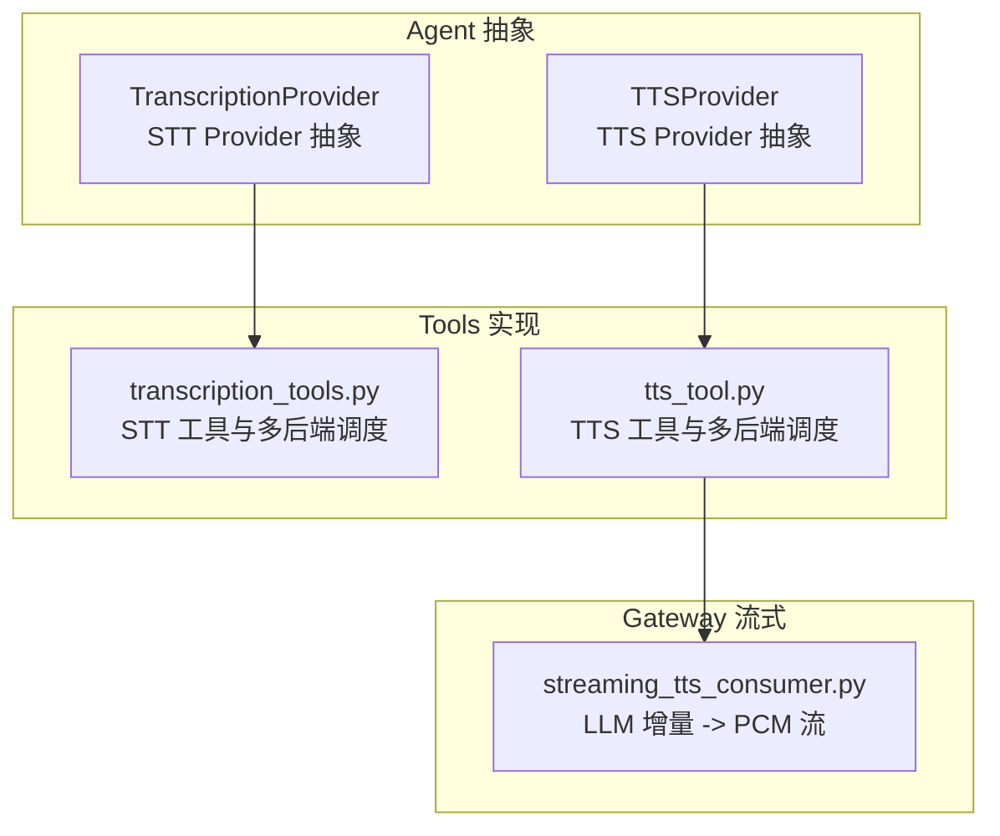
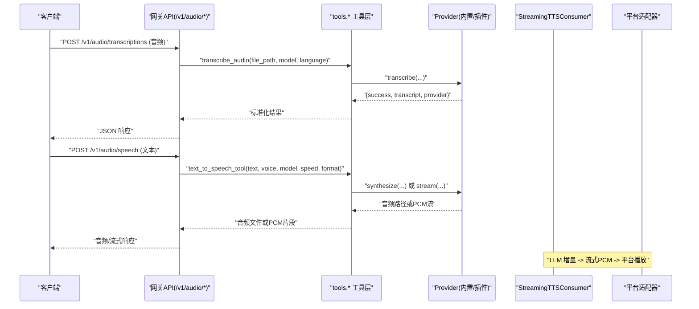
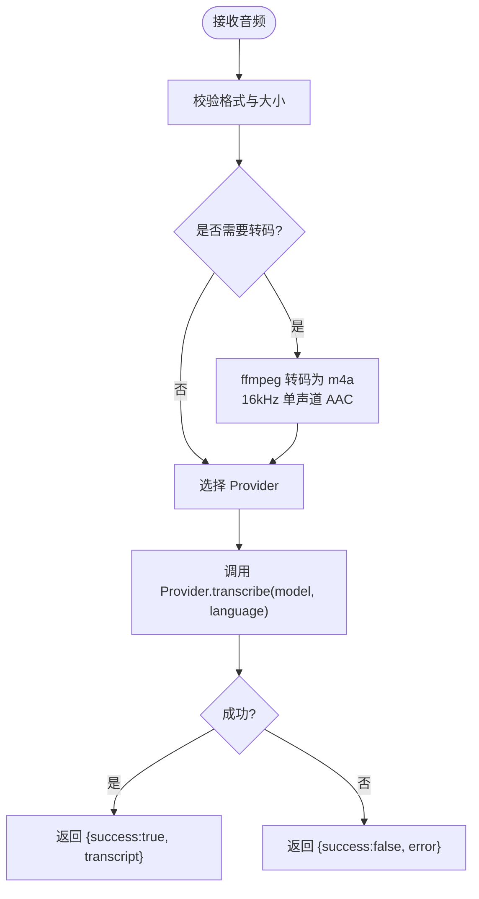
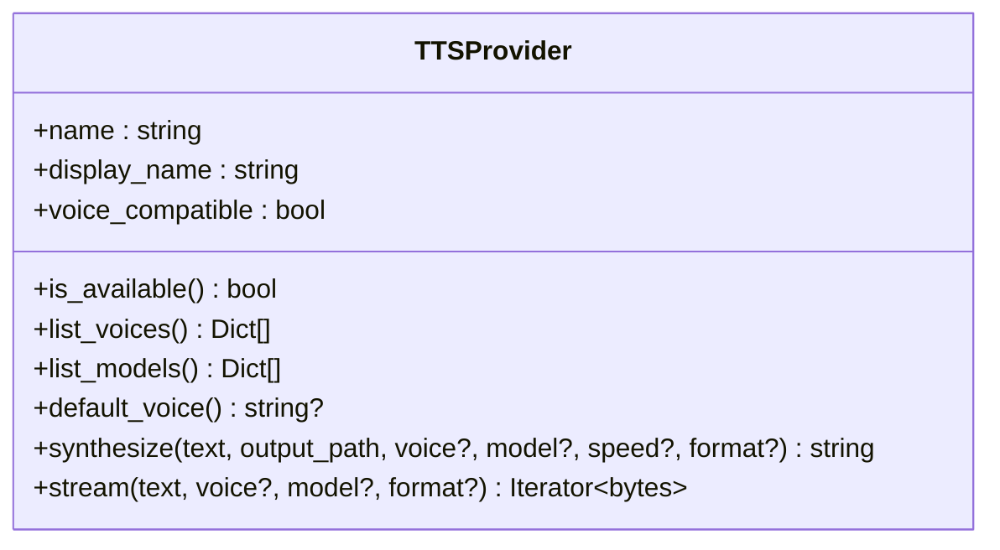
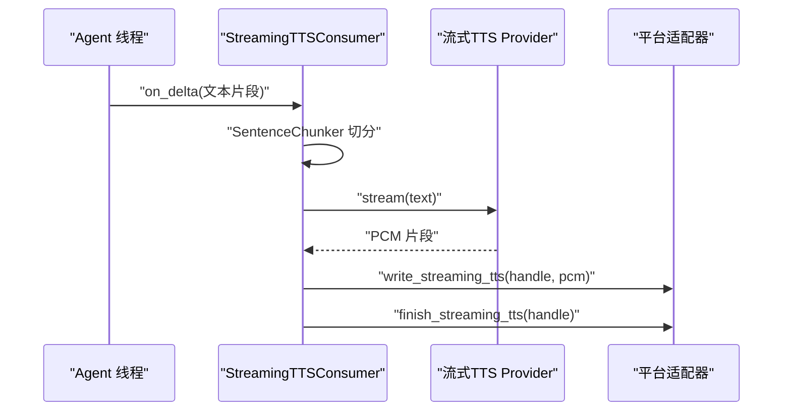
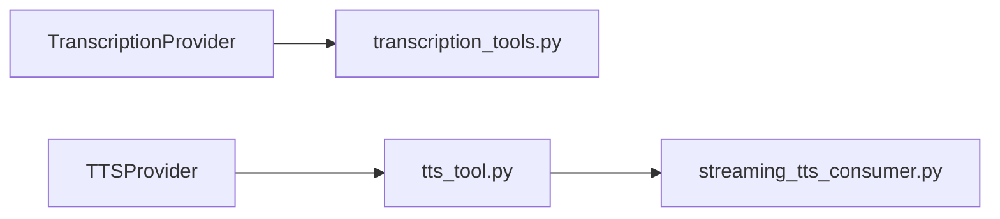

# 语音处理接口

<cite>
**本文引用的文件**
- [transcription_provider.py](file://agent/transcription_provider.py)
- [tts_provider.py](file://agent/tts_provider.py)
- [transcription_tools.py](file://tools/transcription_tools.py)
- [tts_tool.py](file://tools/tts_tool.py)
- [streaming_tts_consumer.py](file://gateway/streaming_tts_consumer.py)
</cite>

## 目录
1. [简介](#简介)
2. [项目结构](#项目结构)
3. [核心组件](#核心组件)
4. [架构总览](#架构总览)
5. [详细组件分析](#详细组件分析)
6. [依赖关系分析](#依赖关系分析)
7. [性能考虑](#性能考虑)
8. [故障排查指南](#故障排查指南)
9. [结论](#结论)
10. [附录](#附录)

## 简介
本文件面向需要集成或使用语音处理能力的开发者，提供“语音转文本（STT）”和“文本转语音（TTS）”的完整接口说明与实现要点。内容覆盖：
- STT 端点 /v1/audio/transcriptions：音频格式支持、语言提示、转录精度与模型选择、预处理/转码、错误与重试。
- TTS 端点 /v1/audio/speech：语音选择、语速控制、输出格式与音质配置、流式合成与批量模式。
- 实时转录与流式播放：从 LLM 增量到 PCM 流的端到端流程。
- 调用示例：文件上传、URL 处理、内存数据；响应格式、错误码与重试策略。
- 高级特性：多语言、方言识别、说话人分离（通过特定提供商能力）。

注意：本项目以可插拔 Provider 抽象为核心，内置多种后端（本地 Whisper、OpenAI、Groq、Mistral、xAI、ElevenLabs 等），并通过统一工具层暴露能力。外部网关或上层服务可基于这些工具进行封装，对外提供 REST 风格的 /v1/audio/* 接口。

## 项目结构
围绕语音处理的代码主要分布在以下模块：
- agent 层：定义 STT/TTS Provider 抽象与注册机制，屏蔽具体后端差异。
- tools 层：实现各 Provider 的具体逻辑、命令型 Provider、转码与资源管理。
- gateway 层：将 LLM 增量文本转换为流式 PCM 并推送给平台适配器，实现低延迟语音播放。

图表来源
- [transcription_provider.py:61-194](file://agent/transcription_provider.py#L61-L194)
- [tts_provider.py:64-275](file://agent/tts_provider.py#L64-L275)
- [transcription_tools.py:109-128](file://tools/transcription_tools.py#L109-L128)
- [tts_tool.py:208-259](file://tools/tts_tool.py#L208-L259)
- [streaming_tts_consumer.py:55-103](file://gateway/streaming_tts_consumer.py#L55-L103)

章节来源
- [transcription_provider.py:61-194](file://agent/transcription_provider.py#L61-L194)
- [tts_provider.py:64-275](file://agent/tts_provider.py#L64-L275)
- [transcription_tools.py:109-128](file://tools/transcription_tools.py#L109-L128)
- [tts_tool.py:208-259](file://tools/tts_tool.py#L208-L259)
- [streaming_tts_consumer.py:55-103](file://gateway/streaming_tts_consumer.py#L55-L103)

## 核心组件
- STT Provider 抽象：定义 name、is_available、list_models、default_model、get_setup_schema、transcribe(file_path, model, language, **extra)。返回统一信封 {success, transcript, provider, error?}。
- TTS Provider 抽象：定义 name、is_available、list_voices、list_models、synthesize(text, output_path, voice, model, speed, format)、可选 stream(text, ...) 迭代 PCM 字节。默认输出格式 mp3，有效格式集合包含 mp3/wav/ogg/opus/flac。
- STT 工具层：内置多个后端（local/local_command/groq/openai/mistral/xai/elevenlabs/deepinfra），统一输入格式校验、转码为 m4a（16kHz 单声道 AAC）、语言解析、超时与进程树清理、命令型 Provider 模板渲染与执行。
- TTS 工具层：内置多个后端（edge/openai/elevenlabs/minimax/mistral/gemini/xai/neutts/kittentts/piper/deepinfra），统一文本分块、输出格式限制、平台适配（Telegram 等需 Opus）、命令型 Provider 模板执行。
- Gateway 流式消费者：将 LLM 增量文本切分为子句，按流式 Provider 生成 PCM 片段并写入平台适配器，支持中止、完成、部分失败与抑制重复全量 TTS。

章节来源
- [transcription_provider.py:61-194](file://agent/transcription_provider.py#L61-L194)
- [tts_provider.py:64-275](file://agent/tts_provider.py#L64-L275)
- [transcription_tools.py:109-128](file://tools/transcription_tools.py#L109-L128)
- [tts_tool.py:208-259](file://tools/tts_tool.py#L208-L259)
- [streaming_tts_consumer.py:55-103](file://gateway/streaming_tts_consumer.py#L55-L103)

## 架构总览
语音处理采用“抽象 + 工具 + 网关”的分层设计：
- 抽象层：Provider ABC 定义稳定契约，便于扩展新后端。
- 工具层：封装多后端调度、参数归一化、转码、限流、超时、命令型执行。
- 网关层：在对话流中把 LLM 增量文本转为流式 PCM，降低首包延迟，提升交互体验。

图表来源
- [transcription_tools.py:109-128](file://tools/transcription_tools.py#L109-L128)
- [tts_tool.py:208-259](file://tools/tts_tool.py#L208-L259)
- [streaming_tts_consumer.py:218-349](file://gateway/streaming_tts_consumer.py#L218-L349)

## 详细组件分析

### STT 端点 /v1/audio/transcriptions
- 功能：将音频文件转为文本。
- 支持的输入格式：mp3、mp4、mpeg、mpga、m4a、wav、webm、ogg、oga、opus、aac、flac、caf。内部会将非原生格式转码为 16kHz 单声道 AAC/m4a，提高兼容性。
- 语言检测与提示：
  - 支持 BCP-47 语言提示（如 en、ja），优先级：stt.<provider>.language > stt.language > 环境变量 > 自动检测。
  - 本地命令模板支持 --language 注入。
- 转录精度与模型：
  - 可通过 model 指定后端模型（如 whisper-1、gpt-4o-transcribe、whisper-large-v3-turbo 等），不同后端有各自默认模型与能力。
  - 本地 Provider 会规范化云模型名到 faster-whisper 尺寸（tiny/base/small/medium/large-v*），避免误用。
- 预处理与后处理：
  - 转码：ffmpeg 将任意容器统一为 m4a（16k mono AAC），必要时静默裁剪静音。
  - 超时与隔离：命令型 Provider 使用进程树隔离与超时保护，支持 psutil 递归终止。
  - 空闲卸载：本地模型在长时间无调用时自动释放显存/内存。
- 错误与重试：
  - 统一返回信封 {success, transcript, provider, error?}。
  - 对网络/SDK 异常进行捕获并转换为错误消息；命令执行失败记录 stderr/stdout 摘要。
  - 建议上层实现指数退避重试（网络抖动、限流）。

图表来源
- [transcription_tools.py:235-287](file://tools/transcription_tools.py#L235-L287)
- [transcription_tools.py:312-335](file://tools/transcription_tools.py#L312-L335)
- [transcription_provider.py:151-194](file://agent/transcription_provider.py#L151-L194)

章节来源
- [transcription_tools.py:109-128](file://tools/transcription_tools.py#L109-L128)
- [transcription_tools.py:235-287](file://tools/transcription_tools.py#L235-L287)
- [transcription_tools.py:312-335](file://tools/transcription_tools.py#L312-L335)
- [transcription_provider.py:151-194](file://agent/transcription_provider.py#L151-L194)

### TTS 端点 /v1/audio/speech
- 功能：将文本合成为语音。
- 语音选择与模型：
  - 支持 list_voices/list_models 查询可用声音与模型；未声明时可回退到 default_voice/default_model。
  - 内置 Provider 包括 Edge、OpenAI、ElevenLabs、MiniMax、Mistral、Gemini、xAI、NeuTTS、KittenTTS、Piper、DeepInfra 等。
- 语速控制与音质：
  - speed 参数用于语速倍率（例如 1.0 正常），不支持的后端忽略该参数。
  - format 输出格式支持 mp3/wav/ogg/opus/flac；平台要求（如 Telegram 语音气泡）优先使用 Opus。
- 流式合成与批量：
  - 若 Provider 实现 stream()，则以 PCM 流形式逐步输出，降低首包延迟。
  - 长文本会被按句子/词边界切分为小块，分别合成后再按平台限制打包发送。
- 错误与重试：
  - 统一通过工具层捕获异常并包装为标准 JSON 信封；流式场景下失败会标记 partial/suppress_whole_file 以避免重复回放。

图表来源
- [tts_provider.py:64-275](file://agent/tts_provider.py#L64-L275)

章节来源
- [tts_provider.py:64-275](file://agent/tts_provider.py#L64-L275)
- [tts_tool.py:208-259](file://tools/tts_tool.py#L208-L259)

### 实时转录与流式播放
- 实时转录：STT 工具层负责音频预处理与后端调用，返回结构化结果。
- 流式播放：Gateway 的 StreamingTTSConsumer 将 LLM 增量文本切分为子句，通过流式 Provider 生成 PCM 片段并写入平台适配器，支持中止与完成状态上报。

图表来源
- [streaming_tts_consumer.py:156-193](file://gateway/streaming_tts_consumer.py#L156-L193)
- [streaming_tts_consumer.py:218-349](file://gateway/streaming_tts_consumer.py#L218-L349)

章节来源
- [streaming_tts_consumer.py:156-193](file://gateway/streaming_tts_consumer.py#L156-L193)
- [streaming_tts_consumer.py:218-349](file://gateway/streaming_tts_consumer.py#L218-L349)

### 调用示例与最佳实践
- 文件上传（STT）：
  - 上传受支持的音频文件至 /v1/audio/transcriptions，服务端将校验格式与大小，必要时转码为 m4a，再调用所选 Provider 进行转录。
  - 建议设置语言提示以提高准确率；如需更高精度，选择更强大的模型（如 gpt-4o-transcribe 或 whisper-large-v3-turbo）。
- URL 处理（STT）：
  - 若上游下载的文件容器不标准（如误标扩展名），工具层会尝试转码为 m4a 以提升兼容性。
- 内存数据处理（TTS）：
  - 直接调用 /v1/audio/speech，传入文本、语音、模型、语速与输出格式；若 Provider 支持流式，则返回 PCM 片段流，适合即时播放。
- 批量处理（TTS）：
  - 长文本将被自动切分并按平台限制打包；建议根据目标平台（Discord/Telegram 等）选择合适的输出格式与文件大小上限。
- 响应格式与错误：
  - STT 返回 {success, transcript, provider, error?}；TTS 返回音频文件或 PCM 流。
  - 错误场景包括：Provider 不可用、密钥缺失、格式不支持、超时、网络异常等。
- 重试机制：
  - 建议在客户端实现指数退避重试，针对 429/5xx 等临时错误；对 400/401/403 等明确错误应提示用户修正配置。

章节来源
- [transcription_tools.py:109-128](file://tools/transcription_tools.py#L109-L128)
- [transcription_tools.py:235-287](file://tools/transcription_tools.py#L235-L287)
- [tts_tool.py:208-259](file://tools/tts_tool.py#L208-L259)
- [streaming_tts_consumer.py:218-349](file://gateway/streaming_tts_consumer.py#L218-L349)

### 高级特性：多语言、方言识别、说话人分离
- 多语言与方言：
  - 通过 language 参数传递 BCP-47 语言代码（如 zh-CN、en-US），部分 Provider 支持方言与区域变体。
  - 本地命令模板与 Provider 均支持语言注入，未指定时启用自动检测。
- 说话人分离：
  - 某些云端 Provider（如 xAI）具备说话人分离能力；具体是否可用取决于所选 Provider 与模型。
  - 可在 Provider 的 list_models 中查看能力描述（languages、max_audio_seconds 等）。

章节来源
- [transcription_provider.py:100-122](file://agent/transcription_provider.py#L100-L122)
- [transcription_tools.py:181-210](file://tools/transcription_tools.py#L181-L210)
- [tts_provider.py:104-137](file://agent/tts_provider.py#L104-L137)

## 依赖关系分析
- 抽象与实现解耦：
  - agent 层定义稳定接口，tools 层实现具体逻辑，便于替换与扩展。
- 内置与命令型 Provider：
  - 内置 Provider 始终优先于插件与命令型 Provider，确保稳定性。
  - 命令型 Provider 允许接入任意 CLI，通过模板渲染与进程隔离执行。
- 流式与非流式协同：
  - TTS 优先使用流式 Provider 以降低延迟；不支持时回退到整文件合成。
  - Gateway 层负责将流式 PCM 写入平台适配器，并处理中止与完成状态。

图表来源
- [transcription_provider.py:61-194](file://agent/transcription_provider.py#L61-L194)
- [tts_provider.py:64-275](file://agent/tts_provider.py#L64-L275)
- [transcription_tools.py:109-128](file://tools/transcription_tools.py#L109-L128)
- [tts_tool.py:208-259](file://tools/tts_tool.py#L208-L259)
- [streaming_tts_consumer.py:55-103](file://gateway/streaming_tts_consumer.py#L55-L103)

章节来源
- [transcription_provider.py:61-194](file://agent/transcription_provider.py#L61-L194)
- [tts_provider.py:64-275](file://agent/tts_provider.py#L64-L275)
- [transcription_tools.py:109-128](file://tools/transcription_tools.py#L109-L128)
- [tts_tool.py:208-259](file://tools/tts_tool.py#L208-L259)
- [streaming_tts_consumer.py:55-103](file://gateway/streaming_tts_consumer.py#L55-L103)

## 性能考虑
- 本地模型缓存与空闲卸载：
  - 本地 STT 模型加载一次并复用；长时间无调用时自动释放显存/内存，减少资源占用。
- 转码优化：
  - 统一转码为 16kHz 单声道 AAC/m4a，减小体积并提高兼容性。
- 流式合成：
  - 优先使用流式 Provider 生成 PCM 片段，降低首包延迟，提升交互体验。
- 文本分块与打包：
  - 长文本按句子/词边界切分，避免超出 Provider 限制；按平台限制打包音频文件，防止上传失败。

章节来源
- [transcription_tools.py:134-157](file://tools/transcription_tools.py#L134-L157)
- [transcription_tools.py:235-287](file://tools/transcription_tools.py#L235-L287)
- [tts_tool.py:538-623](file://tools/tts_tool.py#L538-L623)
- [streaming_tts_consumer.py:218-349](file://gateway/streaming_tts_consumer.py#L218-L349)

## 故障排查指南
- STT 常见问题：
  - 格式不支持：检查输入扩展名与实际容器是否一致；必要时启用转码。
  - 语言提示无效：确认 BCP-47 代码正确；未指定时启用自动检测。
  - 模型名不兼容：本地 Provider 会规范化云模型名；若仍失败，切换为支持的尺寸。
  - 命令型 Provider 超时：调整 timeout；检查命令模板与依赖二进制是否存在。
- TTS 常见问题：
  - 输出格式不匹配：平台要求（如 Telegram）需 Opus；否则可使用 MP3。
  - 文本过长：按 Provider 限制自动切分；必要时缩短输入或分段发送。
  - 流式不可用：回退到整文件合成；检查 Provider 是否实现 stream()。
- 错误与重试：
  - 统一错误信封；客户端应对 429/5xx 实施指数退避重试。
  - 流式失败时，根据 partial/suppress_whole_file 决定是否回退到全量合成。

章节来源
- [transcription_tools.py:235-287](file://tools/transcription_tools.py#L235-L287)
- [transcription_tools.py:630-693](file://tools/transcription_tools.py#L630-L693)
- [tts_tool.py:317-402](file://tools/tts_tool.py#L317-L402)
- [streaming_tts_consumer.py:262-316](file://gateway/streaming_tts_consumer.py#L262-L316)

## 结论
本项目通过抽象与工具层的解耦设计，提供了稳定、可扩展的语音处理能力。STT 与 TTS 均支持多后端、多格式、流式与批量模式，满足实时与离线场景需求。结合 Gateway 的流式 PCM 推送，可实现低延迟的语音交互体验。建议在实际部署中合理选择 Provider 与模型，并根据平台限制优化输出格式与文件大小。

## 附录
- 配置与开关：
  - STT：stt.enabled、stt.provider、stt.<provider>.language/model。
  - TTS：tts.provider、tts.<provider>.model/voice/speed/format。
- 环境变量：
  - 各 Provider 的 API Key 与 Base URL 可通过配置或环境变量注入。
- 安全与隔离：
  - 命令型 Provider 使用进程树隔离与超时保护；敏感环境变量默认清洗，可按白名单透传。

章节来源
- [transcription_tools.py:164-210](file://tools/transcription_tools.py#L164-L210)
- [tts_tool.py:628-655](file://tools/tts_tool.py#L628-L655)
- [transcription_tools.py:695-708](file://tools/transcription_tools.py#L695-L708)