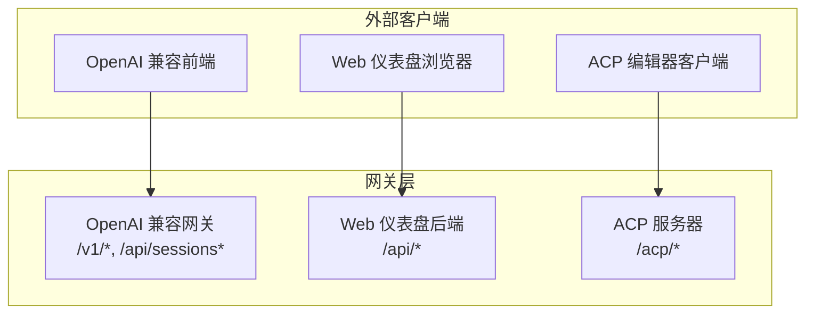
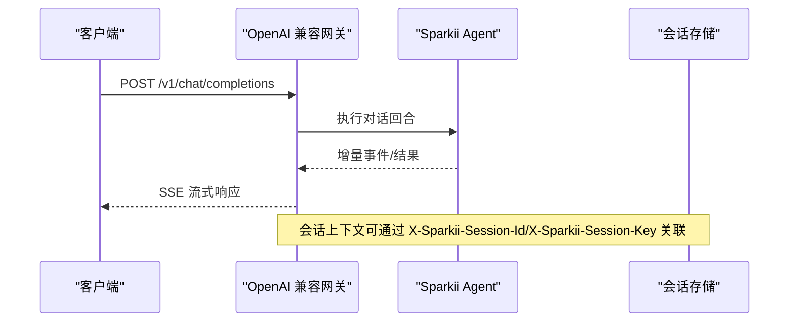
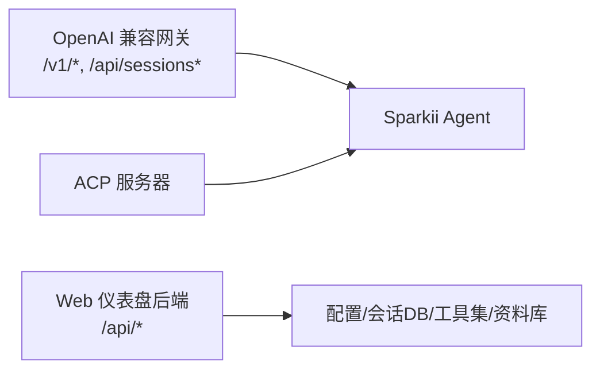

# RESTful API

<cite>
**本文引用的文件**
- [gateway/platforms/api_server.py](file://gateway/platforms/api_server.py)
- [sparkii_cli/web_server.py](file://sparkii_cli/web_server.py)
- [sparkii_cli/web_routers/sessions.py](file://sparkii_cli/web_routers/sessions.py)
- [sparkii_cli/web_routers/tools.py](file://sparkii_cli/web_routers/tools.py)
- [sparkii_cli/web_routers/profiles.py](file://sparkii_cli/web_routers/profiles.py)
- [acp_adapter/server.py](file://acp_adapter/server.py)
</cite>

## 目录
1. [简介](#简介)
2. [项目结构](#项目结构)
3. [核心组件](#核心组件)
4. [架构总览](#架构总览)
5. [详细组件分析](#详细组件分析)
6. [依赖关系分析](#依赖关系分析)
7. [性能考虑](#性能考虑)
8. [故障排查指南](#故障排查指南)
9. [结论](#结论)
10. [附录](#附录)

## 简介
本文件面向开发者与集成方，系统化说明 Sparkii/Sparkii Agent 暴露的 RESTful API，覆盖会话管理、配置管理、工具调用等核心接口。文档包含：
- HTTP 端点 URL 模式、请求方法、请求头、请求体与响应格式
- 认证机制、权限控制、错误处理与数据校验规则
- 版本控制策略与向后兼容性保证
- 客户端集成示例与最佳实践建议

本项目提供两类主要服务：
- OpenAI 兼容网关（aiohttp）：对外暴露 /v1/* 与 /api/sessions* 等端点，支持聊天补全、响应存储、运行任务生命周期、健康检查等
- Web 仪表盘后端（FastAPI）：提供本地仪表盘的会话、工具集、配置文件、资料库等管理接口，默认监听本地端口并受令牌鉴权保护

## 项目结构
- gateway/platforms/api_server.py：OpenAI 兼容网关平台适配器，定义 /v1/* 与 /api/sessions* 路由、SSE 流式、运行任务、模型列表、能力清单与健康检查
- sparkii_cli/web_server.py：FastAPI 应用入口，注册中间件（CORS、Host 校验、鉴权）、公共路径白名单、Dashboard 自测与健康统计
- sparkii_cli/web_routers/sessions.py：会话管理路由（列表、搜索、详情、消息、导入导出、批量删除、清理等）
- sparkii_cli/web_routers/tools.py：工具集与终端后端路由（启用/禁用工具集、选择模型/提供商、保存环境变量、后置安装、计算机使用权限等）
- sparkii_cli/web_routers/profiles.py：资料库路由（创建/重命名/删除资料库、设置活跃资料库、导出/导入、自动描述等）
- acp_adapter/server.py：ACP（Agent Client Protocol）服务器，将 Sparkii Agent 以 ACP 协议暴露给编辑器/IDE 客户端

图表来源
- [gateway/platforms/api_server.py:1-40](file://gateway/platforms/api_server.py#L1-L40)
- [sparkii_cli/web_server.py:1-10](file://sparkii_cli/web_server.py#L1-L10)
- [acp_adapter/server.py:1-10](file://acp_adapter/server.py#L1-L10)

章节来源
- [gateway/platforms/api_server.py:1-40](file://gateway/platforms/api_server.py#L1-L40)
- [sparkii_cli/web_server.py:1-10](file://sparkii_cli/web_server.py#L1-L10)
- [acp_adapter/server.py:1-10](file://acp_adapter/server.py#L1-L10)

## 核心组件
- OpenAI 兼容网关（/v1/*）
  - 聊天补全：POST /v1/chat/completions（支持 SSE 流式）
  - 响应 API：POST /v1/responses；GET/DELETE /v1/responses/{response_id}
  - 模型列表：GET /v1/models
  - 能力清单：GET /v1/capabilities
  - 运行任务：POST /v1/runs；GET /v1/runs/{run_id}；GET /v1/runs/{run_id}/events；POST /v1/runs/{run_id}/approval；POST /v1/runs/{run_id}/stop
  - 健康检查：GET /health；GET /health/detailed
  - 会话管理：/api/sessions*（列表、创建、读取、更新、删除、消息、分叉、聊天）
- Web 仪表盘后端（/api/*）
  - 会话管理：/api/sessions*（列表、搜索、详情、消息、导入导出、批量删除、清理、统计）
  - 工具集管理：/api/tools/toolsets*（启用/禁用、配置、模型、提供商、环境变量、后置安装）
  - 终端后端：/api/tools/terminal/*（查询/选择后端）
  - 计算机使用：/api/tools/computer-use/*（状态、授权）
  - 资料库管理：/api/profiles*（CRUD、活跃资料库、导出/导入、自动描述）
- ACP 服务器
  - 通过 ACP 协议暴露 Agent 能力（会话、模型、工具、资源等），供 IDE/编辑器集成

章节来源
- [gateway/platforms/api_server.py:1-40](file://gateway/platforms/api_server.py#L1-L40)
- [sparkii_cli/web_routers/sessions.py:53-167](file://sparkii_cli/web_routers/sessions.py#L53-L167)
- [sparkii_cli/web_routers/tools.py:57-183](file://sparkii_cli/web_routers/tools.py#L57-L183)
- [sparkii_cli/web_routers/profiles.py:373-517](file://sparkii_cli/web_routers/profiles.py#L373-L517)
- [acp_adapter/server.py:566-800](file://acp_adapter/server.py#L566-L800)

## 架构总览
OpenAI 兼容网关基于 aiohttp，提供稳定的 /v1/* 契约，便于对接各类 OpenAI 兼容前端；Web 仪表盘后端基于 FastAPI，提供本地管理界面所需的 REST 接口；ACP 服务器为编辑器/IDE 提供统一的 Agent 交互协议。

图表来源
- [gateway/platforms/api_server.py:1-40](file://gateway/platforms/api_server.py#L1-L40)

章节来源
- [gateway/platforms/api_server.py:1-40](file://gateway/platforms/api_server.py#L1-L40)

## 详细组件分析

### 会话管理 API（/api/sessions*）
- GET /api/sessions
  - 作用：列出当前资料库可见的会话，支持分页、归档过滤、排序、来源过滤、是否返回完整行
  - 查询参数：limit(0-100)、offset(≥0)、min_messages(≥0)、archived(exclude/only/include)、order(created/recent)、source、sources、exclude_sources、cwd_prefix、full(bool)、profile(可选)
  - 成功响应：{sessions:[], total:int, limit:int, offset:int}
  - 常见错误：400（参数非法）、500（内部错误）
- GET /api/sessions/search
  - 作用：按会话 ID 与全文消息内容搜索（FTS5），去重基于压缩血缘根
  - 查询参数：q、limit(≤100)、profile、source、sources、exclude_sources
  - 成功响应：{results:[...]}
  - 常见错误：400（参数非法）、500（搜索失败）
- GET /api/sessions/{session_id}
  - 作用：获取会话详情（带 profile 标记）
  - 成功响应：会话对象
  - 常见错误：404（未找到）
- GET /api/sessions/{session_id}/messages
  - 作用：分页获取会话消息（默认最新页，最大每页 500）
  - 查询参数：limit(≥0)、offset(≥0)、order(oldest/latest)
  - 成功响应：{session_id, messages:[], pagination:{limit, offset, order, returned}}
  - 常见错误：400（order 非法）、404（未找到）
- DELETE /api/sessions/{session_id}
  - 作用：删除指定会话（幂等：已不存在视为成功）
  - 成功响应：{ok:true, already_absent?:bool}
  - 常见错误：404（ID 解析失败时返回已缺失）
- PATCH /api/sessions/{session_id}
  - 作用：重命名、归档、置顶（至少提供一个字段）
  - 请求体：{title?, archived?, pinned?, profile?}
  - 成功响应：{ok:true, title?, archived?, pinned?}
  - 常见错误：400（无更新字段或标题非法）、404（未找到）
- POST /api/sessions/bulk-delete
  - 作用：批量删除（ids 最多 500）
  - 请求体：{ids:[string], profile?}
  - 成功响应：{ok:true, deleted:int}
  - 常见错误：400（ids 超限）
- POST /api/sessions/import
  - 作用：导入会话（来自导出或 CLI）
  - 请求体：{profile, sessions:[...]}
  - 成功响应：导入结果
  - 常见错误：400（无效负载）
- GET /api/sessions/empty/count
  - 作用：统计空会话数量
  - 成功响应：{count:int}
- DELETE /api/sessions/empty
  - 作用：删除所有已结束且非归档的空会话
  - 成功响应：{ok:true, deleted:int}
- GET /api/sessions/stats
  - 作用：会话存储统计（总数、活跃、归档、消息数、按来源分布）
  - 成功响应：{total, active_store, archived, messages, by_source:{...}}
- GET /api/sessions/{session_id}/latest-descendant
  - 作用：获取压缩链路的最新后代会话
  - 成功响应：{requested_session_id, session_id, path:[], changed:bool}
  - 常见错误：404（未找到）
- GET /api/sessions/{session_id}/export
  - 作用：流式导出单个会话（元数据+消息）
  - 成功响应：application/json 流
  - 常见错误：404（未找到）
- POST /api/sessions/prune
  - 作用：按条件删除已结束会话（后台执行）
  - 请求体：{...}（由 web_models.SessionPrune 定义）
  - 成功响应：清理结果

章节来源
- [sparkii_cli/web_routers/sessions.py:53-167](file://sparkii_cli/web_routers/sessions.py#L53-L167)
- [sparkii_cli/web_routers/sessions.py:169-392](file://sparkii_cli/web_routers/sessions.py#L169-L392)
- [sparkii_cli/web_routers/sessions.py:395-520](file://sparkii_cli/web_routers/sessions.py#L395-L520)
- [sparkii_cli/web_routers/sessions.py:523-552](file://sparkii_cli/web_routers/sessions.py#L523-L552)
- [sparkii_cli/web_routers/sessions.py:555-652](file://sparkii_cli/web_routers/sessions.py#L555-L652)
- [sparkii_cli/web_routers/sessions.py:655-788](file://sparkii_cli/web_routers/sessions.py#L655-L788)

### 工具集与终端后端 API（/api/tools/*）
- GET /api/tools/toolsets
  - 作用：列出可配置工具集及其平台、启用状态、可用工具
  - 成功响应：[{name, label, description, platform, platform_label, enabled, available, configured, tools:[...]}]
- PUT /api/tools/toolsets/{name}
  - 作用：启用/禁用工具集
  - 请求体：{enabled:bool, profile?}
  - 成功响应：{ok:true, name, platform, enabled}
  - 常见错误：400（未知工具集）
- GET /api/tools/toolsets/{name}/config
  - 作用：获取工具集配置面板（提供商矩阵、环境变量状态、就绪状态）
  - 成功响应：{name, has_category, providers:[...], active_provider, ...}
  - 常见错误：400（未知工具集）
- GET /api/tools/toolsets/{name}/models
  - 作用：获取工具集后端模型目录（图像/视频生成等）
  - 成功响应：{name, has_models, models:[], current, default}
- PUT /api/tools/toolsets/{name}/model
  - 作用：选择模型（需存在于目录中）
  - 请求体：{model:string, provider?, profile?}
  - 成功响应：{ok:true, name, model, plugin}
  - 常见错误：400（无模型目录/未知模型）
- PUT /api/tools/toolsets/{name}/provider
  - 作用：选择提供商（web 工具集支持 capability: search|extract）
  - 请求体：{provider:string, capability?, profile?}
  - 成功响应：{ok:true, name, provider, capability?, needs_nous_auth?, feature?}
  - 常见错误：400（未知工具集/提供商/能力）
- PUT /api/tools/toolsets/{name}/env
  - 作用：保存工具集的环境变量（仅允许白名单键）
  - 请求体：{env:{key:value}, profile?}
  - 成功响应：{ok:true, name, saved:[], skipped:[], is_set:{...}}
  - 常见错误：400（未知键）
- POST /api/tools/toolsets/{name}/post-setup
  - 作用：启动提供商的后置安装（后台进程）
  - 请求体：{key:string, profile?}
  - 成功响应：{ok:true, pid, name, key}
  - 常见错误：400（未知 key）、500（启动失败）
- GET /api/tools/terminal/backends
  - 作用：列出终端后端及健康探测结果
  - 成功响应：{active, backends:[{name, label, description, active, status, detail}]}
- PUT /api/tools/terminal/backend
  - 作用：选择终端后端
  - 请求体：{backend:string}
  - 成功响应：{ok:true, backend}
  - 常见错误：400（未知后端）
- GET /api/tools/computer-use/status
  - 作用：跨平台 Computer Use 就绪状态
  - 成功响应：就绪信息
- POST /api/tools/computer-use/permissions/grant
  - 作用：macOS 授予权限（后台进程）
  - 成功响应：{ok:true, pid, name}
  - 常见错误：400（非 macOS）、500（请求失败）

章节来源
- [sparkii_cli/web_routers/tools.py:57-183](file://sparkii_cli/web_routers/tools.py#L57-L183)
- [sparkii_cli/web_routers/tools.py:186-299](file://sparkii_cli/web_routers/tools.py#L186-L299)
- [sparkii_cli/web_routers/tools.py:301-417](file://sparkii_cli/web_routers/tools.py#L301-L417)
- [sparkii_cli/web_routers/tools.py:419-558](file://sparkii_cli/web_routers/tools.py#L419-L558)
- [sparkii_cli/web_routers/tools.py:561-668](file://sparkii_cli/web_routers/tools.py#L561-L668)
- [sparkii_cli/web_routers/tools.py:670-785](file://sparkii_cli/web_routers/tools.py#L670-L785)

### 资料库 API（/api/profiles*）
- GET /api/profiles
  - 作用：列出所有资料库
  - 成功响应：{profiles:[...]}
- POST /api/profiles
  - 作用：创建资料库（可克隆、初始化技能、写入模型/MCP 等）
  - 请求体：{name, clone_from?, clone_all?, no_skills?, description?, provider?, model?, mcp_servers?, keep_skills?, hub_skills?}
  - 成功响应：{ok:true, name, path, model_set, mcp_written, skills_disabled, hub_installs:[...]}
  - 常见错误：400（参数非法）、500（内部错误）
- GET /api/profiles/active
  - 作用：获取活跃资料库与当前资料库
  - 成功响应：{active, current}
- POST /api/profiles/active
  - 作用：设置活跃资料库
  - 请求体：{name:string}
  - 成功响应：{ok:true, active}
  - 常见错误：404/400/500
- GET /api/profiles/{name}/setup-command
  - 作用：获取资料库设置命令
  - 成功响应：{command:string}
- POST /api/profiles/{name}/open-terminal
  - 作用：在系统终端中打开资料库设置命令
  - 成功响应：{ok:true, command}
  - 常见错误：400/404/500
- PATCH /api/profiles/{name}
  - 作用：重命名资料库
  - 请求体：{new_name:string}
  - 成功响应：{ok:true, name, path}
  - 常见错误：400/404/500
- DELETE /api/profiles/{name}
  - 作用：删除资料库
  - 成功响应：{ok:true, path}
  - 常见错误：400/404/500
- GET /api/profiles/{name}/soul
  - 作用：读取 SOUL.md（存在则返回内容）
  - 成功响应：{content:string, exists:bool}
  - 常见错误：500（读取失败）
- PUT /api/profiles/{name}/soul
  - 作用：替换 SOUL.md
  - 请求体：{content:string}
  - 成功响应：{ok:true}
  - 常见错误：500（写入失败）
- PUT /api/profiles/{name}/description
  - 作用：设置角色描述（用于路由信号）
  - 请求体：{description:string}
  - 成功响应：{ok:true, description, description_auto:false}
  - 常见错误：500（写入失败）
- PUT /api/profiles/{name}/model
  - 作用：设置资料库主模型（provider + model）
  - 请求体：{provider:string, model:string}
  - 成功响应：{ok:true, provider, model}
  - 常见错误：400（必填缺失）、500（写入失败）
- POST /api/profiles/{name}/describe-auto
  - 作用：自动生成资料库描述
  - 请求体：{overwrite:bool}
  - 成功响应：{ok, reason, description, description_auto}
  - 常见错误：500（生成失败）
- POST /api/profiles/{name}/export
  - 作用：导出资料库（归档到文件或指定路径）
  - 请求体：{output?, extra_files?}
  - 成功响应：{ok:true, archive:string}
  - 常见错误：400/404/500
- POST /api/profiles/import
  - 作用：导入资料库（从归档）
  - 请求体：{archive:string, name?}
  - 成功响应：导入结果
  - 常见错误：400/404/500

章节来源
- [sparkii_cli/web_routers/profiles.py:373-517](file://sparkii_cli/web_routers/profiles.py#L373-L517)
- [sparkii_cli/web_routers/profiles.py:539-611](file://sparkii_cli/web_routers/profiles.py#L539-L611)
- [sparkii_cli/web_routers/profiles.py:613-628](file://sparkii_cli/web_routers/profiles.py#L613-L628)
- [sparkii_cli/web_routers/profiles.py:631-711](file://sparkii_cli/web_routers/profiles.py#L631-L711)
- [sparkii_cli/web_routers/profiles.py:714-739](file://sparkii_cli/web_routers/profiles.py#L714-L739)
- [sparkii_cli/web_routers/profiles.py:749-800](file://sparkii_cli/web_routers/profiles.py#L749-L800)

### OpenAI 兼容网关 API（/v1/* 与 /api/sessions*）
- POST /v1/chat/completions
  - 作用：聊天补全（支持 SSE 流式）
  - 请求头：X-Sparkii-Session-Id（可选，会话连续性）、X-Sparkii-Session-Key（可选，长期记忆范围）
  - 请求体：OpenAI Chat Completions 格式（支持多模态内容、模型选项、推理努力等）
  - 响应：JSON 或 SSE 流式事件
  - 常见错误：400（内容/图片 URL 非法）、401（未认证）、429（限流）、500（内部错误）
- POST /v1/responses
  - 作用：Responses API（状态化，previous_response_id 支持）
  - 请求头：X-Sparkii-Session-Key（可选）
  - 请求体：OpenAI Responses 格式
  - 响应：JSON 或 SSE 流式事件
- GET /v1/responses/{response_id}
  - 作用：检索已存储响应
  - 成功响应：响应对象
  - 常见错误：404（未找到）
- DELETE /v1/responses/{response_id}
  - 作用：删除已存储响应
  - 成功响应：{ok:true}
  - 常见错误：404（未找到）
- GET /v1/models
  - 作用：列出 sparkii-agent 与配置的模型路由别名
  - 成功响应：模型列表
- GET /v1/capabilities
  - 作用：机器可读的 API 能力清单
  - 成功响应：能力对象
- POST /v1/runs
  - 作用：启动运行任务（立即返回 run_id，202）
  - 成功响应：{run_id}
- GET /v1/runs/{run_id}
  - 作用：获取运行任务当前状态
  - 成功响应：状态对象
- GET /v1/runs/{run_id}/events
  - 作用：SSE 结构化生命周期事件流
  - 响应：SSE 事件
- POST /v1/runs/{run_id}/approval
  - 作用：解决待处理的运行审批
  - 请求体：{choice:...}（如 once/session/always/deny）
  - 成功响应：审批结果
- POST /v1/runs/{run_id}/stop
  - 作用：中断正在运行的代理
  - 成功响应：中断结果
- GET /health
  - 作用：健康检查
  - 成功响应：健康状态
- GET /health/detailed
  - 作用：详细状态（跨容器仪表板探测）
  - 成功响应：详细状态对象
- /api/sessions*
  - 作用：会话管理（列表、创建、读取、更新、删除、消息、分叉、聊天）
  - 参考“会话管理 API”小节

章节来源
- [gateway/platforms/api_server.py:1-40](file://gateway/platforms/api_server.py#L1-L40)

### ACP 服务器（Agent Client Protocol）
- 作用：通过 ACP 协议暴露 Agent 能力（会话、模型、工具、资源、命令等），适配 Zed/Buzz 等编辑器
- 特点：
  - 支持模型选择（含自定义 named endpoints）
  - 支持编辑审批策略映射为会话模式
  - 支持资源链接与嵌入资源的文本/图片内联
  - 支持命令（help/model/tools/context/reset/compress/steer/queue/version）

章节来源
- [acp_adapter/server.py:90-191](file://acp_adapter/server.py#L90-L191)
- [acp_adapter/server.py:566-800](file://acp_adapter/server.py#L566-L800)

## 依赖关系分析
- OpenAI 兼容网关依赖 aiohttp，提供 /v1/* 与 /api/sessions* 路由，内部调用 Sparkii Agent 执行对话与工具调用
- Web 仪表盘后端依赖 FastAPI，提供 /api/* 路由，访问配置、会话数据库、工具集与资料库
- ACP 服务器依赖 acp 协议库，封装 Sparkii Agent 能力，适配编辑器客户端

图表来源
- [gateway/platforms/api_server.py:1-40](file://gateway/platforms/api_server.py#L1-L40)
- [sparkii_cli/web_server.py:1-10](file://sparkii_cli/web_server.py#L1-L10)
- [acp_adapter/server.py:1-10](file://acp_adapter/server.py#L1-L10)

章节来源
- [gateway/platforms/api_server.py:1-40](file://gateway/platforms/api_server.py#L1-L40)
- [sparkii_cli/web_server.py:1-10](file://sparkii_cli/web_server.py#L1-L10)
- [acp_adapter/server.py:1-10](file://acp_adapter/server.py#L1-L10)

## 性能考虑
- 会话列表与消息分页：限制 limit/offset，避免一次性加载大量数据；消息端点默认返回最新页，最大 500 条
- FTS5 搜索：对查询词添加前缀通配符以提升匹配效率；结果按血缘根去重
- 流式响应：SSE 流式减少首字节延迟；SSE 帧序列化统一实现，确保一致性与高效性
- 后台任务：后置安装、权限授予等长耗时操作通过后台进程执行，前端轮询状态
- 资源限制：多模态内容长度限制、图片 URL 校验、内容数组大小限制，防止滥用

章节来源
- [sparkii_cli/web_routers/sessions.py:169-392](file://sparkii_cli/web_routers/sessions.py#L169-L392)
- [sparkii_cli/web_routers/sessions.py:601-652](file://sparkii_cli/web_routers/sessions.py#L601-L652)
- [gateway/platforms/api_server.py:187-207](file://gateway/platforms/api_server.py#L187-L207)
- [gateway/platforms/api_server.py:477-666](file://gateway/platforms/api_server.py#L477-L666)

## 故障排查指南
- 401 Unauthorized
  - Web 仪表盘：缺少有效会话令牌（X-Sparkii-Session-Token 或 Authorization: Bearer <token>）
  - OpenAI 兼容网关：未携带 API_SERVER_KEY 或未通过认证
- 400 Bad Request
  - 参数非法（如 order/archived/limit 超出范围）
  - 多模态内容非法（图片 URL 不支持、data URL 非 image）
  - 工具集/提供商/模型未知
- 404 Not Found
  - 会话/响应/资料库未找到
- 500 Internal Server Error
  - 数据库读写失败、后台进程启动失败、网络请求异常
- 调试建议
  - 查看服务端日志（web_server 与 api_server 模块日志）
  - 使用 /health 与 /health/detailed 检查服务状态
  - 对于流式响应，确认 SSE 客户端正确解析事件与数据帧

章节来源
- [sparkii_cli/web_server.py:398-467](file://sparkii_cli/web_server.py#L398-L467)
- [gateway/platforms/api_server.py:683-693](file://gateway/platforms/api_server.py#L683-L693)
- [sparkii_cli/web_routers/sessions.py:85-94](file://sparkii_cli/web_routers/sessions.py#L85-L94)
- [sparkii_cli/web_routers/tools.py:141-143](file://sparkii_cli/web_routers/tools.py#L141-L143)

## 结论
本仓库提供了完整的 RESTful API 集合，涵盖 OpenAI 兼容网关、Web 仪表盘后端与 ACP 服务器。通过明确的 URL 模式、请求/响应格式、认证与权限控制、错误处理与数据验证，以及版本控制与兼容性策略，开发者可以稳定地集成会话管理、配置管理与工具调用能力。建议在生产环境中启用 Host 头校验、CORS 限制与令牌鉴权，并结合健康检查与日志进行监控与排障。

## 附录

### 认证与权限控制
- Web 仪表盘（/api/*）
  - 会话令牌：X-Sparkii-Session-Token 或 Authorization: Bearer <token>
  - Host 头校验：拒绝非绑定接口的 Host 头，防 DNS 重绑定攻击
  - 公共路径白名单：部分只读端点无需令牌
- OpenAI 兼容网关（/v1/*）
  - 认证：API_SERVER_KEY（通过请求头或配置）
  - 会话连续性：X-Sparkii-Session-Id（可选）
  - 长期记忆范围：X-Sparkii-Session-Key（可选）
- ACP 服务器
  - 通过 ACP 协议进行身份与会话管理，适配编辑器客户端

章节来源
- [sparkii_cli/web_server.py:398-467](file://sparkii_cli/web_server.py#L398-L467)
- [gateway/platforms/api_server.py:1-40](file://gateway/platforms/api_server.py#L1-L40)

### 版本控制与向后兼容
- OpenAI 兼容网关遵循 /v1/* 路径，保持与 OpenAI 兼容前端的稳定性
- 请求体字段兼容多种拼写（如 text/input_text/output_text、image_url/input_image）
- 布尔值宽松解析（字符串 true/false/yes/on 等）
- 历史行为保留：允许裸 model 值回退到网关默认（direct_model_requests 配置）

章节来源
- [gateway/platforms/api_server.py:217-244](file://gateway/platforms/api_server.py#L217-L244)
- [gateway/platforms/api_server.py:541-666](file://gateway/platforms/api_server.py#L541-L666)
- [gateway/platforms/api_server.py:371-410](file://gateway/platforms/api_server.py#L371-L410)

### 客户端集成示例与最佳实践
- OpenAI 兼容前端
  - 基础 URL：http://localhost:8642/v1
  - 认证：API_SERVER_KEY
  - 会话连续性：X-Sparkii-Session-Id
  - 流式响应：SSE 客户端解析 data: 事件
- Web 仪表盘
  - 基础 URL：http://localhost:9219/api
  - 认证：X-Sparkii-Session-Token 或 Authorization: Bearer <token>
  - 安全：仅 localhost/CORS 限制，避免公网暴露
- ACP 编辑器
  - 使用 ACP 协议连接，利用模型选择、工具与资源能力

章节来源
- [gateway/platforms/api_server.py:1-40](file://gateway/platforms/api_server.py#L1-L40)
- [sparkii_cli/web_server.py:1-10](file://sparkii_cli/web_server.py#L1-L10)
- [acp_adapter/server.py:566-800](file://acp_adapter/server.py#L566-L800)