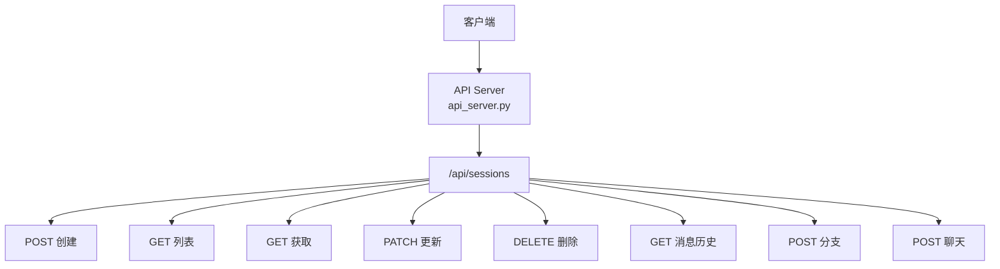
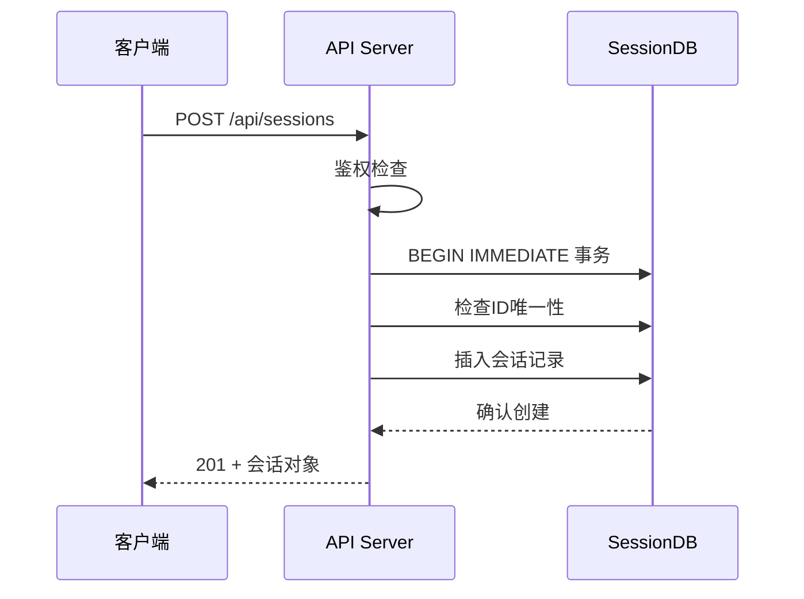

# 会话管理API

<cite>
**本文引用的文件**
- [sparkii_cli/web_routers/sessions.py](file://sparkii_cli/web_routers/sessions.py)
- [gateway/platforms/api_server.py](file://gateway/platforms/api_server.py)
</cite>

## 目录
1. [简介](#简介)
2. [项目结构](#项目结构)
3. [核心组件](#核心组件)
4. [架构总览](#架构总览)
5. [详细组件分析](#详细组件分析)
6. [依赖关系分析](#依赖关系分析)
7. [性能考量](#性能考量)
8. [故障排查指南](#故障排查指南)
9. [结论](#结论)

## 简介
本文详细阐述 Sparkii Agent 的会话管理 API，即 /api/sessions 端点的完整 CRUD 操作。会话管理 API 提供会话的创建、查询、更新、删除以及消息历史管理能力，是 Agent 持久化对话的核心接口。

系统支持会话分支（fork）、消息历史检索、会话上下文管理，以及与代理核心的会话同步机制。

## 项目结构
会话管理 API 的路由注册在 `gateway/platforms/api_server.py`，CLI 路由在 `sparkii_cli/web_routers/sessions.py`。

## 核心组件
- **会话创建**：POST /api/sessions — 创建新会话，支持 ID、模型、系统提示、标题等参数。
- **会话列表**：GET /api/sessions — 列出会话，支持分页、过滤、排序。
- **会话获取**：GET /api/sessions/{id} — 获取会话元数据。
- **会话更新**：PATCH /api/sessions/{id} — 更新标题、置顶、归档等。
- **会话删除**：DELETE /api/sessions/{id} — 删除会话。
- **消息历史**：GET /api/sessions/{id}/messages — 查询消息历史。
- **会话分支**：POST /api/sessions/{id}/fork — 基于血缘分支。
- **会话聊天**：POST /api/sessions/{id}/chat — 发送消息并交互。

## 架构总览

## 详细组件分析
### 会话 ID 生成规则
- 支持客户端指定 ID 或自动生成。
- ID 合法性校验：禁止控制字符、路径不安全字符、长度限制。
- 唯一性检查使用 SQLite BEGIN IMMEDIATE 事务保证原子性。

### 会话状态管理
- 状态字段：active、archived、ended。
- 置顶（pinned）功能支持会话优先显示。
- 归档（archived）功能隐藏不活跃的会话。

### 消息历史查询
- 支持 limit/offset 分页参数。
- 支持 order 参数：oldest（默认）或 latest。
- 最大返回数量限制保护，防止内存溢出。

### 会话分支（Fork）
- 基于 SessionDB 血缘复制会话上下文。
- 分支会话继承父会话的消息历史。
- 分支后独立发展，不影响父会话。

## 依赖关系分析
- **API 服务器**：`gateway/platforms/api_server.py` — 路由和处理器
- **CLI 路由**：`sparkii_cli/web_routers/sessions.py` — CLI 接口
- **SessionDB**：SQLite 持久化存储

## 性能考量
- SQLite 写入采用 BEGIN IMMEDIATE 事务，保证检查-插入原子性。
- 异步 I/O 与线程池执行阻塞操作，避免阻塞事件循环。
- SessionDB 实例按 profile home 缓存，避免重复打开。
- 会话列表查询使用索引加速。

## 故障排查指南
- **创建失败（ID 冲突）**：检查是否使用了已存在的会话 ID。
- **查询超时**：确认 SessionDB 连接正常。
- **消息历史为空**：确认会话已有消息，检查分页参数。
- **分支失败**：检查父会话是否存在且状态正常。

## 结论
会话管理 API 提供了完整的对话生命周期管理能力。通过标准化的 CRUD 接口和高级功能（分支、聊天），系统支持复杂的对话场景。开发者应理解事务机制和并发控制，确保数据一致性。

