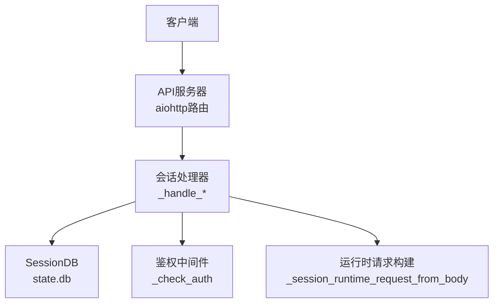
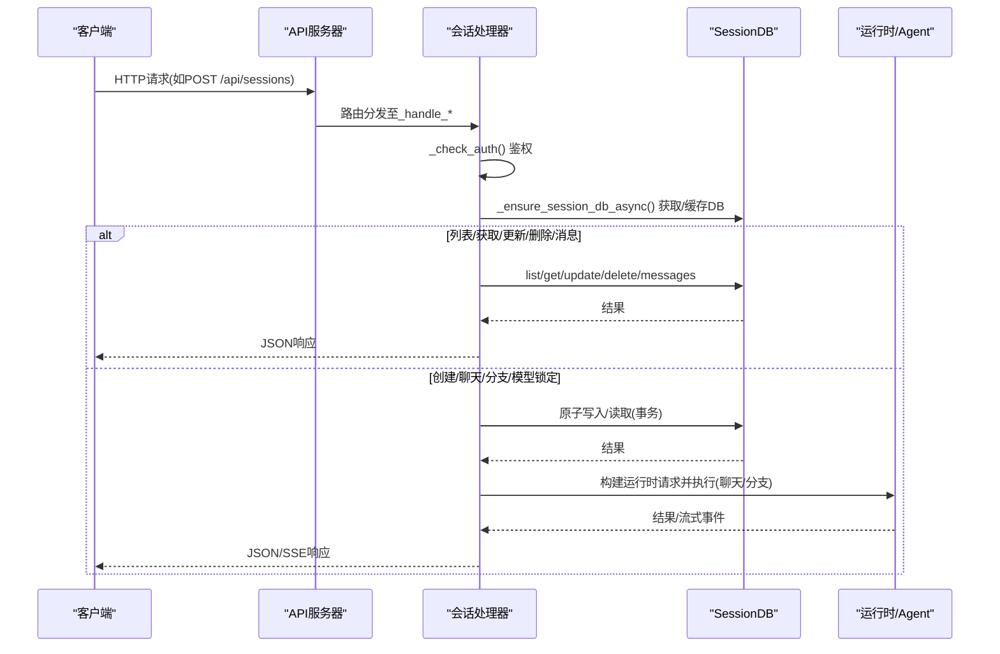
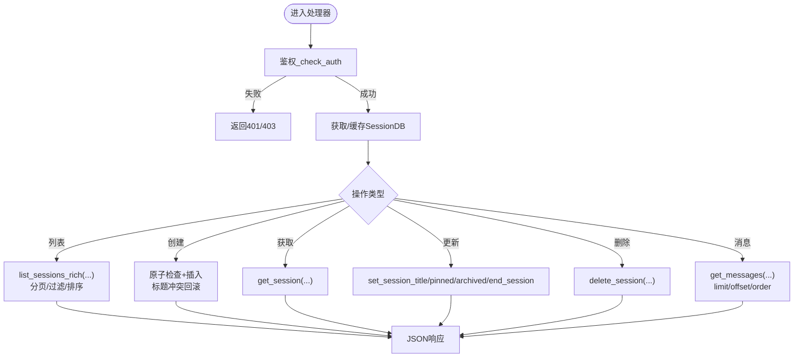
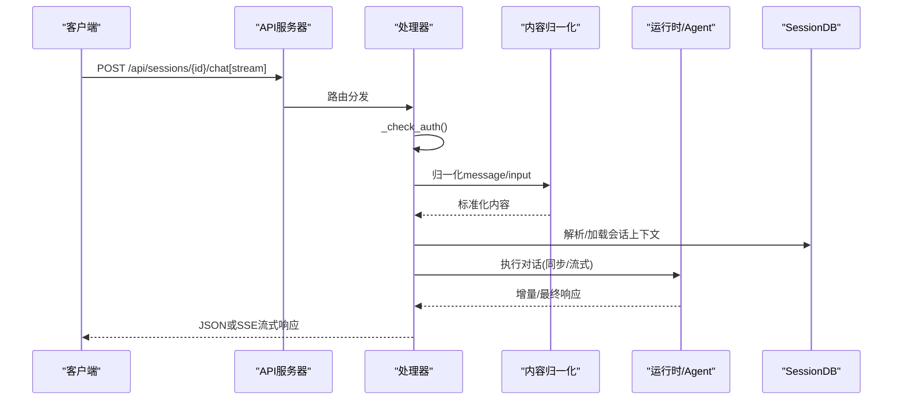
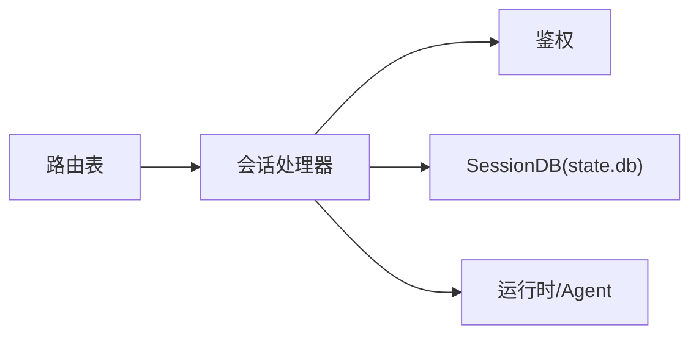

# 会话管理API

<cite>
**本文引用的文件**
- [gateway/platforms/api_server.py](file://gateway/platforms/api_server.py)
- [tests/gateway/test_session_api.py](file://tests/gateway/test_session_api.py)
</cite>

## 目录
1. [简介](#简介)
2. [项目结构](#项目结构)
3. [核心组件](#核心组件)
4. [架构总览](#架构总览)
5. [详细组件分析](#详细组件分析)
6. [依赖关系分析](#依赖关系分析)
7. [性能考量](#性能考量)
8. [故障排查指南](#故障排查指南)
9. [结论](#结论)
10. [附录：完整操作流程示例](#附录完整操作流程示例)

## 简介
本文件面向“会话管理API”，系统化说明以下RESTful端点及其行为：
- GET /api/sessions：列出客户端可见的Hermes会话
- POST /api/sessions：创建空会话（可携带模型、系统提示、标题等）
- GET /api/sessions/{session_id}：获取会话元数据
- PATCH /api/sessions/{session_id}：更新会话元数据（标题、置顶、归档、结束原因等）
- DELETE /api/sessions/{session_id}：删除会话
- GET /api/sessions/{session_id}/messages：查询会话消息历史（支持分页与排序）
- POST /api/sessions/{session_id}/fork：基于SessionDB血缘进行会话分支
- POST /api/sessions/{session_id}/chat[/stream]：向持久化会话发送消息并交互（支持流式）
- POST /api/sessions/{session_id}/model：锁定会话使用的模型/提供者

文档同时覆盖会话状态管理、持久化机制、并发控制、隔离与权限控制、错误处理，以及端到端操作流程示例。

## 项目结构
会话管理API由网关平台的HTTP适配器统一暴露，路由注册在平台适配器的路由表中；具体处理器方法位于同一模块中。测试用例将处理器挂载到应用以验证行为。

图表来源
- [gateway/platforms/api_server.py:2056-2065](file://gateway/platforms/api_server.py#L2056-L2065)
- [gateway/platforms/api_server.py:3334-3600](file://gateway/platforms/api_server.py#L3334-L3600)

章节来源
- [gateway/platforms/api_server.py:2056-2065](file://gateway/platforms/api_server.py#L2056-L2065)
- [tests/gateway/test_session_api.py:42-46](file://tests/gateway/test_session_api.py#L42-L46)

## 核心组件
- 路由注册：集中声明所有与会话相关的HTTP端点，便于统一管理与扩展。
- 会话数据库访问：通过SessionDB封装对state.db的读写，提供列表、查询、更新、删除、消息读取、会话ID解析等方法。
- 会话生命周期处理器：
  - 列表：支持分页、过滤、是否包含子会话、按最近活跃排序、固定会话回填。
  - 创建：原子检查+插入，防止重复ID；可选设置模型、系统提示、标题；标题冲突回滚。
  - 获取/更新/删除：校验字段、类型与存在性，返回标准化响应。
  - 消息历史：支持limit/offset/order，默认最新页，最大限制保护。
  - 分支：基于血缘复制会话上下文。
  - 聊天：同步或流式交互，支持多模态内容归一化与截断。
  - 模型锁定：为会话锁定模型/提供者及选项。
- 鉴权与安全：
  - 所有端点均经过鉴权校验。
  - 会话键头X-Hermes-Session-Key需配置API密钥才允许使用，防注入与长度限制。
  - 会话ID合法性校验（禁止控制字符、路径不安全字符、长度限制）。
- 持久化与并发：
  - SQLite写入采用BEGIN IMMEDIATE事务，保证检查-插入原子性。
  - 异步I/O与线程池执行阻塞操作，避免阻塞事件循环。
  - SessionDB实例按profile home缓存，避免重复打开。

章节来源
- [gateway/platforms/api_server.py:2107-2157](file://gateway/platforms/api_server.py#L2107-L2157)
- [gateway/platforms/api_server.py:2163-2237](file://gateway/platforms/api_server.py#L2163-L2237)
- [gateway/platforms/api_server.py:3334-3600](file://gateway/platforms/api_server.py#L3334-L3600)

## 架构总览
下图展示从客户端请求到会话数据持久化的调用链，突出鉴权、数据库访问与业务处理的关键节点。

图表来源
- [gateway/platforms/api_server.py:2056-2065](file://gateway/platforms/api_server.py#L2056-L2065)
- [gateway/platforms/api_server.py:2163-2237](file://gateway/platforms/api_server.py#L2163-L2237)
- [gateway/platforms/api_server.py:3334-3600](file://gateway/platforms/api_server.py#L3334-L3600)

## 详细组件分析

### 会话CRUD与消息历史
- GET /api/sessions
  - 功能：列出持久化会话，支持limit/offset/source/include_children，按最近活跃排序，固定会话回填。
  - 响应：object=list，data=会话列表，limit/offset/has_more。
- POST /api/sessions
  - 功能：创建空会话，支持id/session_id、model、system_prompt、title、source、运行时模型锁定参数。
  - 并发：SQLite BEGIN IMMEDIATE事务内完成存在性检查与插入，避免TOCTOU竞争。
  - 标题：去重与冲突回滚。
  - 响应：201 + sparkii.session对象。
- GET /api/sessions/{session_id}
  - 功能：获取会话元数据。
- PATCH /api/sessions/{session_id}
  - 功能：更新title、end_reason、pinned、archived；严格白名单与类型校验。
- DELETE /api/sessions/{session_id}
  - 功能：删除会话。
- GET /api/sessions/{session_id}/messages
  - 功能：查询消息历史，支持limit/offset/order(oldest/latest)，默认最新页，上限保护。
  - 响应：object=list，data=消息列表，pagination信息。

图表来源
- [gateway/platforms/api_server.py:3334-3600](file://gateway/platforms/api_server.py#L3334-L3600)

章节来源
- [gateway/platforms/api_server.py:3334-3600](file://gateway/platforms/api_server.py#L3334-L3600)

### 会话分支（fork）
- POST /api/sessions/{session_id}/fork
  - 功能：基于SessionDB血缘复制会话上下文，生成新会话。
  - 典型用途：在不影响原会话的前提下继续探索不同对话分支。

章节来源
- [gateway/platforms/api_server.py:2062](file://gateway/platforms/api_server.py#L2062)

### 会话聊天（同步/流式）
- POST /api/sessions/{session_id}/chat
  - 功能：向指定会话发送消息并获取响应（非流式）。
- POST /api/sessions/{session_id}/chat/stream
  - 功能：SSE流式返回增量响应，适合长对话场景。
- 内容归一化：
  - 支持文本与图片的多模态输入，自动归一化为内部格式，并进行长度与深度限制，防止滥用。
- 运行时覆盖：
  - 可从请求体提取provider/model/model_options等，合并到运行时参数，实现单次请求级别的模型/提供者覆盖。

图表来源
- [gateway/platforms/api_server.py:2063-2064](file://gateway/platforms/api_server.py#L2063-L2064)
- [gateway/platforms/api_server.py:477-666](file://gateway/platforms/api_server.py#L477-L666)

章节来源
- [gateway/platforms/api_server.py:477-666](file://gateway/platforms/api_server.py#L477-L666)
- [gateway/platforms/api_server.py:2063-2064](file://gateway/platforms/api_server.py#L2063-L2064)

### 会话模型锁定
- POST /api/sessions/{session_id}/model
  - 功能：为会话锁定模型/提供者及选项，确保后续对话使用指定模型。
  - 与创建时的模型配置协同工作，确认锁定后优先生效。

章节来源
- [gateway/platforms/api_server.py:2065](file://gateway/platforms/api_server.py#L2065)
- [gateway/platforms/api_server.py:2623-2630](file://gateway/platforms/api_server.py#L2623-L2630)
- [gateway/platforms/api_server.py:2718](file://gateway/platforms/api_server.py#L2718)

### 鉴权与会话键头
- 所有端点均需鉴权。
- X-Hermes-Session-Key用于长期记忆作用域隔离，需配置API_SERVER_KEY方可启用；拒绝控制字符与超长值，防止注入与资源耗尽。

章节来源
- [gateway/platforms/api_server.py:2107-2157](file://gateway/platforms/api_server.py#L2107-L2157)

### 持久化与并发控制
- SessionDB缓存：按profile home缓存，避免重复打开state.db。
- 异步I/O：数据库操作通过线程池执行，不阻塞事件循环。
- 原子写入：创建会话时使用BEGIN IMMEDIATE事务，保证检查与插入的原子性，避免并发重复创建。
- 分页与限制：列表与消息查询均有上限保护，防止大响应。

章节来源
- [gateway/platforms/api_server.py:2163-2237](file://gateway/platforms/api_server.py#L2163-L2237)
- [gateway/platforms/api_server.py:3369-3478](file://gateway/platforms/api_server.py#L3369-L3478)
- [gateway/platforms/api_server.py:3543-3600](file://gateway/platforms/api_server.py#L3543-L3600)

## 依赖关系分析
- 路由层：aiohttp web应用，集中注册会话相关路由。
- 处理器层：各_handle_*方法负责参数校验、鉴权、业务编排。
- 数据层：SessionDB封装SQLite state.db，提供会话与消息的CRUD能力。
- 运行时层：根据请求构建运行时参数，驱动Agent执行对话或分支。

图表来源
- [gateway/platforms/api_server.py:2056-2065](file://gateway/platforms/api_server.py#L2056-L2065)
- [gateway/platforms/api_server.py:2163-2237](file://gateway/platforms/api_server.py#L2163-L2237)

章节来源
- [gateway/platforms/api_server.py:2056-2065](file://gateway/platforms/api_server.py#L2056-L2065)
- [gateway/platforms/api_server.py:2163-2237](file://gateway/platforms/api_server.py#L2163-L2237)

## 性能考量
- 列表与消息查询默认限制与上限保护，避免大响应拖慢服务。
- 数据库操作异步化，减少事件循环阻塞。
- SSE流式输出降低首字节延迟，提升长对话体验。
- 内容归一化与长度限制防止恶意输入导致内存/CPU压力。
- SessionDB按profile缓存，减少重复初始化开销。

## 故障排查指南
- 401/403：未通过鉴权或会话键头未配置API密钥。
- 400：非法会话ID、标题冲突、字段类型错误、分页参数无效、多模态内容格式错误。
- 409：会话已存在。
- 503：SessionDB不可用。
- 常见定位步骤：
  - 检查请求头与鉴权配置。
  - 校验会话ID与标题是否符合规则。
  - 查看分页参数是否在允许范围。
  - 确认state.db可用性与权限。
  - 对于聊天接口，检查多模态内容结构与大小。

章节来源
- [gateway/platforms/api_server.py:3334-3600](file://gateway/platforms/api_server.py#L3334-L3600)
- [gateway/platforms/api_server.py:2107-2157](file://gateway/platforms/api_server.py#L2107-L2157)

## 结论
会话管理API提供了完整的会话生命周期管理能力，涵盖创建、查询、更新、删除、消息历史、分支、聊天与模型锁定。通过严格的鉴权、输入校验、原子写入与异步I/O，保证了安全性、一致性与性能。建议在生产环境中合理配置API密钥、限制请求大小与分页上限，并结合监控观察数据库与运行时负载。

## 附录：完整操作流程示例
以下为端到端流程示例（不含代码片段），展示如何创建、查询、更新、删除会话以及与会话进行消息交互。

- 创建会话
  - 方法：POST /api/sessions
  - 请求体关键字段：id或session_id（可选）、model（可选）、system_prompt（可选）、title（可选）、source（可选）、运行时模型锁定参数（可选）
  - 成功响应：201 + sparkii.session对象
  - 注意：若id已存在返回409；标题冲突返回400
- 列出会话
  - 方法：GET /api/sessions?limit&offset&source&include_children
  - 成功响应：object=list，data为会话列表，含分页信息
- 获取会话
  - 方法：GET /api/sessions/{session_id}
  - 成功响应：sparkii.session对象
- 更新会话
  - 方法：PATCH /api/sessions/{session_id}
  - 请求体关键字段：title、end_reason、pinned、archived（布尔）
  - 成功响应：更新后的sparkii.session对象
- 删除会话
  - 方法：DELETE /api/sessions/{session_id}
  - 成功响应：sparkii.session.deleted对象
- 查询消息历史
  - 方法：GET /api/sessions/{session_id}/messages?limit&offset&order
  - 成功响应：object=list，data为消息列表，含pagination信息
- 会话分支
  - 方法：POST /api/sessions/{session_id}/fork
  - 成功响应：新会话对象（基于血缘复制）
- 会话聊天（同步）
  - 方法：POST /api/sessions/{session_id}/chat
  - 请求体关键字段：message或input（支持文本与图片）
  - 成功响应：最终响应
- 会话聊天（流式）
  - 方法：POST /api/sessions/{session_id}/chat/stream
  - 成功响应：SSE流式增量响应
- 锁定模型
  - 方法：POST /api/sessions/{session_id}/model
  - 请求体关键字段：provider、model、model_options等
  - 成功响应：确认锁定后的会话或模型信息

章节来源
- [gateway/platforms/api_server.py:2056-2065](file://gateway/platforms/api_server.py#L2056-L2065)
- [gateway/platforms/api_server.py:3334-3600](file://gateway/platforms/api_server.py#L3334-L3600)
- [tests/gateway/test_session_api.py:42-46](file://tests/gateway/test_session_api.py#L42-L46)