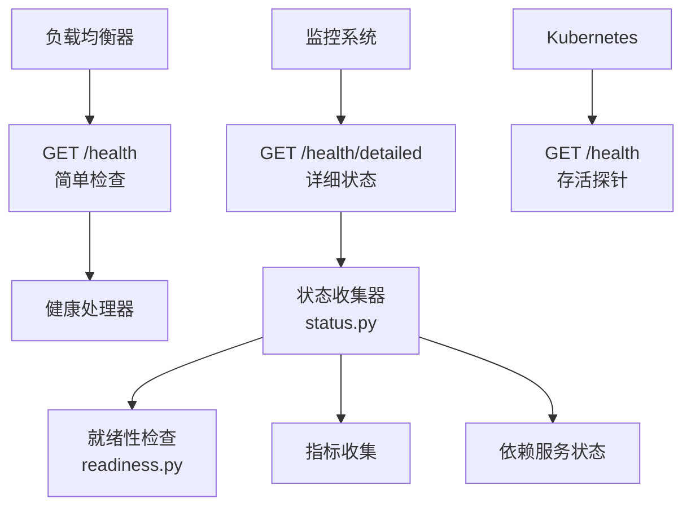
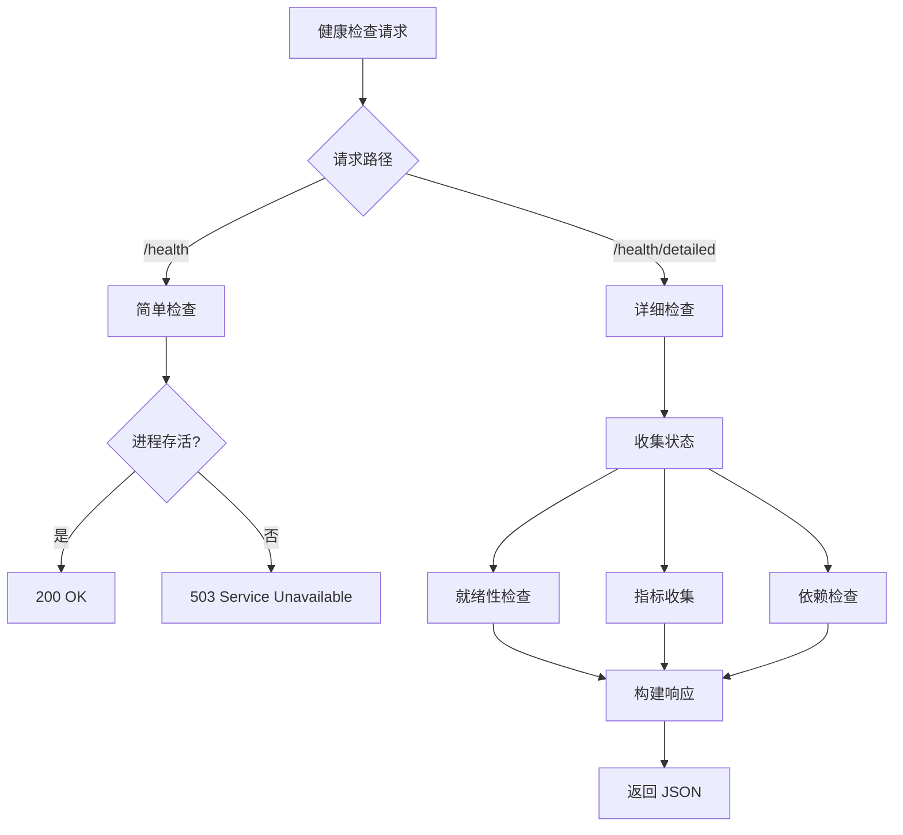

# 健康检查API

<cite>
**本文引用的文件**
- [gateway/platforms/api_server.py](file://gateway/platforms/api_server.py)
- [gateway/readiness.py](file://gateway/readiness.py)
- [gateway/status.py](file://gateway/status.py)
</cite>

## 目录
1. [简介](#简介)
2. [项目结构](#项目结构)
3. [核心组件](#核心组件)
4. [架构总览](#架构总览)
5. [详细组件分析](#详细组件分析)
6. [依赖关系分析](#依赖关系分析)
7. [性能考量](#性能考量)
8. [故障排查指南](#故障排查指南)
9. [结论](#结论)

## 简介
本文详细阐述 Sparkii Agent 的健康检查 API，即 /health 和 /health/detailed 端点的系统状态监控功能。健康检查 API 是容器化部署和微服务架构中的关键组件，提供系统存活探针、就绪性检查和详细的运行状态信息。

系统支持简单健康检查（用于负载均衡器探活）和详细健康检查（用于监控仪表盘和告警系统）。

## 项目结构
健康检查 API 的实现分布在多个模块中：
- `gateway/platforms/api_server.py`：路由注册和处理器
- `gateway/readiness.py`：就绪性检查逻辑
- `gateway/status.py`：状态信息收集

## 核心组件
- **简单健康检查**（_handle_health, api_server.py:2934）：GET /health — 返回基本的系统存活状态。
- **详细健康检查**（_handle_health_detailed, api_server.py:2940）：GET /health/detailed — 返回完整的系统状态信息。
- **就绪性检查**（collect_runtime_readiness, readiness.py:89）：评估系统是否准备好接受请求。
- **状态收集器**（status.py）：收集各模块的运行状态、资源使用和性能指标。
- **工作计数器**（_readiness_work_counts, api_server.py:1575）：统计活跃工作数量。

## 架构总览

## 详细组件分析
### 简单健康检查（GET /health）
- 返回 200 OK 表示服务存活。
- 响应体包含基本状态信息。
- 用于负载均衡器和 Kubernetes 存活探针。

### 详细健康检查（GET /health/detailed）
- 返回完整的系统状态，包括：
  - 运行时间（uptime）
  - 版本信息
  - 活跃会话数
  - 活跃运行数
  - 内存使用情况
  - CPU 使用率
  - 依赖服务状态（数据库、外部 API 等）
  - 最近错误统计

### 就绪性检查
- 评估系统是否准备好接受新请求。
- 检查关键依赖是否可用。
- 在启动阶段返回 503，直到系统完全初始化。

### 容器集成
- Kubernetes livenessProbe：使用 /health 端点。
- Kubernetes readinessProbe：使用就绪性检查。
- Docker HEALTHCHECK：配置健康检查命令。

## 依赖关系分析
- **API 服务器**：`gateway/platforms/api_server.py` — 路由和处理器
- **就绪性检查**：`gateway/readiness.py` — 就绪性逻辑
- **状态收集**：`gateway/status.py` — 状态信息
- **健康监控**：`agent/monitoring/gateway_health.py` — 健康导出
- **系统通知**：`gateway/systemd_notify.py` — systemd 集成

## 性能考量
- 健康检查端点使用轻量级处理，不执行耗时操作。
- 详细状态信息使用缓存，避免每次请求都重新收集。
- 就绪性检查使用快速路径，只检查关键依赖。
- 状态收集使用异步方式，不阻塞健康检查响应。

## 故障排查指南
- **健康检查返回 503**：检查系统是否正在启动或关键依赖不可用。
- **详细状态缺失**：确认 status.py 模块正常加载。
- **就绪性检查超时**：检查依赖服务的连接状态。
- **指标不准确**：确认指标收集器正常运行。

## 结论
健康检查 API 是系统可观测性的基础组件。通过简单和详细两种检查模式，系统满足了从负载均衡器到监控仪表盘的各种健康检查需求。开发者应确保健康检查端点的高可用性和低延迟。

