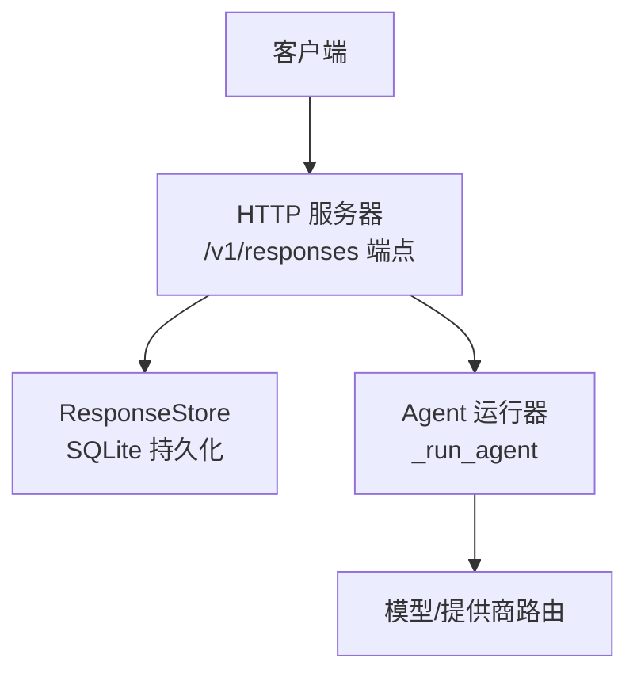
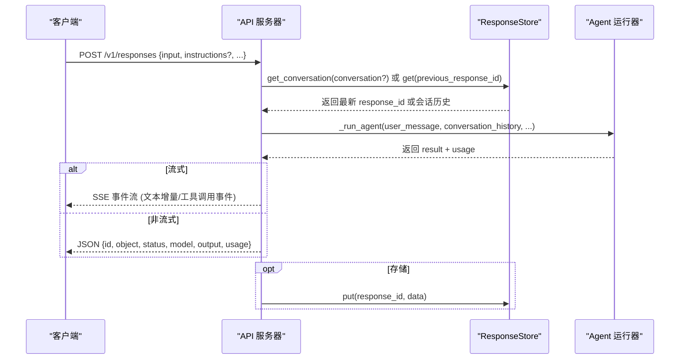
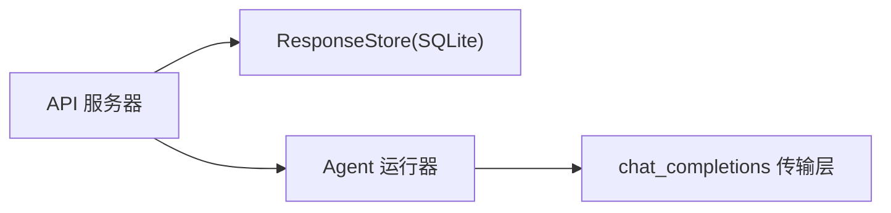

# 响应API

<cite>
**本文引用的文件**
- [gateway/platforms/api_server.py](file://gateway/platforms/api_server.py)
- [agent/transports/chat_completions.py](file://agent/transports/chat_completions.py)
</cite>

## 目录
1. [简介](#简介)
2. [项目结构](#项目结构)
3. [核心组件](#核心组件)
4. [架构总览](#架构总览)
5. [详细组件分析](#详细组件分析)
6. [依赖关系分析](#依赖关系分析)
7. [性能考量](#性能考量)
8. [故障排查指南](#故障排查指南)
9. [结论](#结论)

## 简介
本文详细说明 OpenAI Responses API 兼容的 `/v1/responses` 端点集，涵盖：
- **POST /v1/responses**：创建响应，支持状态ful对话（通过 `previous_response_id` 或 `conversation` 名称）、流式与非流式两种返回模式。
- **GET /v1/responses/{response_id}**：获取已持久化的响应对象。
- **DELETE /v1/responses/{response_id}**：删除已存储的响应记录。

该接口面向需要服务端维护对话历史、支持链式调用和响应生命周期管理的客户端。

## 项目结构
响应API的核心逻辑集中在网关平台的 HTTP 服务器模块中，响应数据通过内嵌的 `ResponseStore` 持久化到本地 SQLite 数据库。

章节来源
- [gateway/platforms/api_server.py:2067-2069](file://gateway/platforms/api_server.py#L2067-L2069)
- [gateway/platforms/api_server.py:5183-5535](file://gateway/platforms/api_server.py#L5183-L5535)

## 核心组件
- **路由注册**：POST /v1/responses、GET /v1/responses/{id}、DELETE /v1/responses/{id}。
- **请求解析与校验**：input、instructions、previous_response_id、conversation、store、stream、truncation、conversation_history 等字段。
- **会话链路与历史管理**：previous_response_id 或 conversation 名称映射到最新 response_id；支持显式 conversation_history 覆盖。
- **流式响应**：SSE 事件流，包含文本增量与工具调用开始/完成事件。
- **响应存储**：ResponseStore 将 response 对象与完整 conversation_history 持久化。
- **自动截断**：当 truncation=auto 时，对 conversation_history 进行保留最近 N 条的裁剪。

## 架构总览

## 详细组件分析

### 端点规范与行为
- **POST /v1/responses**
  - 请求体字段：input（必填，字符串或数组）、instructions（可选系统提示）、previous_response_id（引用上次响应）、conversation（对话名称）、store（是否持久化，默认开启）、stream（是否流式）、truncation（"auto" 启用自动截断）、conversation_history（显式历史列表）
  - 返回：流式为 SSE 事件流；非流式为 JSON 响应对象
  - 状态码：200 成功、400 参数错误、404 ID 不存在、500 内部错误

- **GET /v1/responses/{response_id}**
  - 返回已存储的响应 JSON 对象；404 未找到

- **DELETE /v1/responses/{response_id}**
  - 返回 `{id, object, deleted: true}`；404 未找到

### 状态ful对话与消息历史管理
- previous_response_id 加载上次响应的 conversation_history 作为当前历史上下文
- conversation 通过名称映射到最新 response_id
- conversation_history 显式传入时优先级高于 previous_response_id
- 指令继承：未提供 instructions 时从 previous_response 继承

### 响应存储策略
- 存储位置：SQLite 数据库（SPARKII_HOME/response_store.db；不可用时回退内存库）
- 存储内容：response 对象、conversation_history、instructions、session_id
- 容量控制：最大存储条目数 MAX_STORED_RESPONSES（默认 100），超出后按 accessed_at 淘汰
- 自动截断：truncation=auto 时保留最近 RESPONSES_AUTO_TRUNCATION_HISTORY_LIMIT（默认 100）条

### 与 /v1/chat/completions 的区别
| 特性 | /v1/responses | /v1/chat/completions |
|------|--------------|---------------------|
| 状态管理 | 天然支持状态ful对话 | 无状态为主 |
| 响应存储 | 自动存储+GET/DELETE 管理 | 不直接提供存储 |
| 流式体验 | SSE 含工具调用事件 | SSE 文本增量 |
| 适用场景 | 需要服务端维护对话历史 | 轻量快速问答 |

## 依赖关系分析

## 性能考量
- 并发限制：处理器入口对并发运行任务限流
- 存储淘汰：超出 MAX_STORED_RESPONSES 时按访问时间淘汰旧条目
- 自动截断：限制 conversation_history 长度降低 token 消耗
- 流式传输：SSE 增量推送降低首字节延迟
- 幂等缓存：Idempotency-Key 减少重复请求的额外计算

## 故障排查指南
- **400 参数错误**：检查 input 字段是否存在、content 类型是否正确、conversation 与 previous_response_id 是否同时提供
- **404 未找到**：确认 previous_response_id 或 response_id 已通过 POST 创建并存储
- **500 内部错误**：检查日志中 Agent 运行与模型调用是否正常
- **存储问题**：若 response_store.db 不可写，系统回退内存库；检查文件权限与磁盘空间

## 结论
`/v1/responses` 提供了状态ful对话、响应存储与检索、自动截断与流式交互等能力，适合需要服务端维护对话历史与响应生命周期的场景。对于无状态或已有外部会话管理的场景，`/v1/chat/completions` 仍是更轻量的选择。