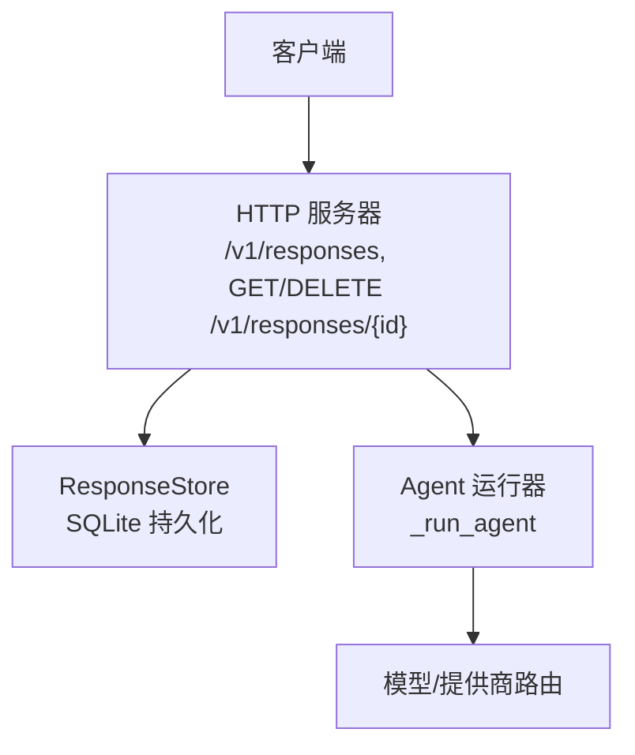
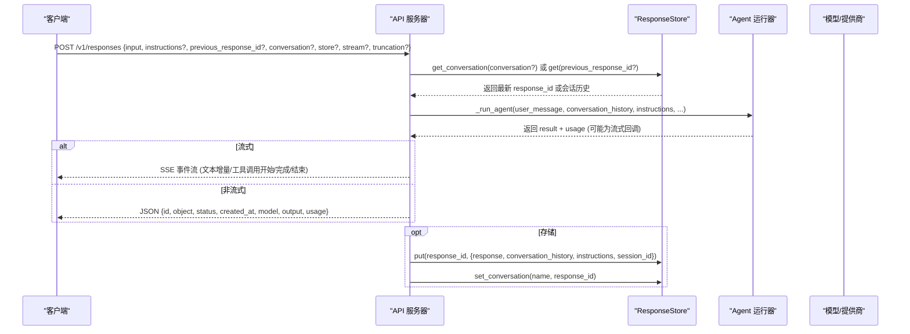
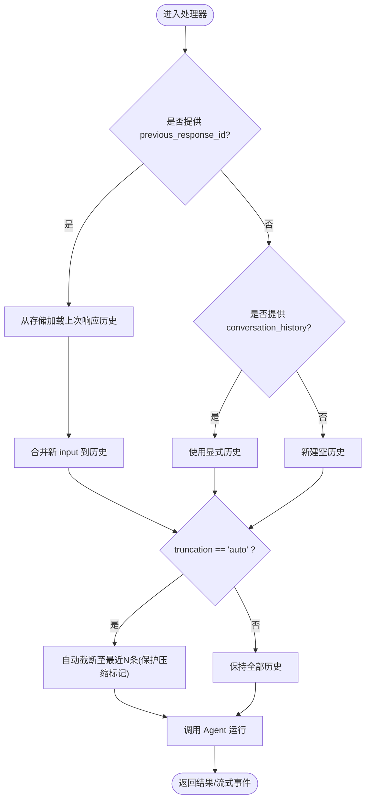
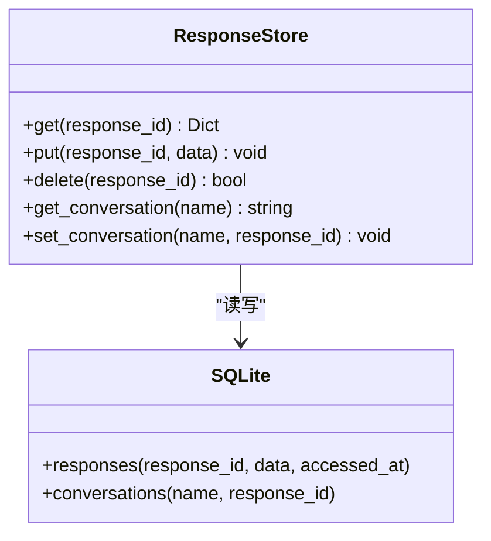
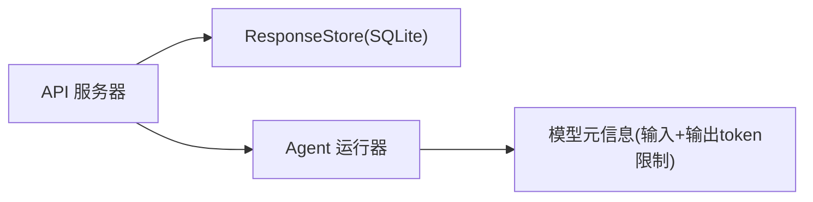

# 响应API

<cite>
**本文引用的文件**
- [gateway/platforms/api_server.py](file://gateway/platforms/api_server.py)
- [agent/model_metadata.py](file://agent/model_metadata.py)
</cite>

## 目录
1. [简介](#简介)
2. [项目结构](#项目结构)
3. [核心组件](#核心组件)
4. [架构总览](#架构总览)
5. [详细组件分析](#详细组件分析)
6. [依赖关系分析](#依赖关系分析)
7. [性能考量](#性能考量)
8. [故障排查指南](#故障排查指南)
9. [结论](#结论)
10. [附录：CRUD示例与错误处理](#附录crud示例与错误处理)

## 简介
本文件面向使用 OpenAI Responses API 兼容接口的客户端，详细说明以下端点与行为：
- POST /v1/responses：状态ful对话模式、previous_response_id 的使用、消息历史管理、流式与非流式两种返回方式。
- GET /v1/responses/{response_id}：获取已存储的响应对象。
- DELETE /v1/responses/{response_id}：删除已存储的响应对象。

同时说明响应存储策略（持久化到 SQLite）、自动截断机制（conversation_history 长度限制）以及与 /v1/chat/completions 的区别和适用场景。

## 项目结构
该功能由网关平台的 HTTP 服务器实现，核心路由与处理器集中在 api_server 模块中；响应数据通过内嵌的 ResponseStore 持久化到本地 SQLite 数据库；模型元信息中对 /v1/responses 的输入+输出 token 上限有约束说明。

图表来源
- [gateway/platforms/api_server.py:2067-2069](file://gateway/platforms/api_server.py#L2067-L2069)
- [gateway/platforms/api_server.py:820-981](file://gateway/platforms/api_server.py#L820-L981)
- [gateway/platforms/api_server.py:5183-5535](file://gateway/platforms/api_server.py#L5183-L5535)

章节来源
- [gateway/platforms/api_server.py:1-40](file://gateway/platforms/api_server.py#L1-L40)
- [gateway/platforms/api_server.py:2067-2069](file://gateway/platforms/api_server.py#L2067-L2069)

## 核心组件
- 路由注册：POST /v1/responses、GET /v1/responses/{response_id}、DELETE /v1/responses/{response_id}。
- 请求解析与校验：input、instructions、previous_response_id、conversation、store、stream、truncation、conversation_history 等字段。
- 会话链路与历史管理：previous_response_id 或 conversation 名称映射到最新 response_id；支持显式 conversation_history 覆盖。
- 流式响应：SSE 事件流，包含文本增量与工具调用开始/完成事件。
- 非流式响应：一次性返回最终结果与 usage。
- 响应存储：ResponseStore 将 response 对象与完整 conversation_history 持久化，支持按 conversation 名称索引。
- 自动截断：当 truncation=auto 时，对 conversation_history 进行保留最近 N 条的裁剪，并保护“上下文压缩”标记不被误删。

章节来源
- [gateway/platforms/api_server.py:2067-2069](file://gateway/platforms/api_server.py#L2067-L2069)
- [gateway/platforms/api_server.py:5183-5535](file://gateway/platforms/api_server.py#L5183-L5535)
- [gateway/platforms/api_server.py:820-981](file://gateway/platforms/api_server.py#L820-L981)
- [gateway/platforms/api_server.py:439-474](file://gateway/platforms/api_server.py#L439-L474)

## 架构总览
下图展示了从客户端发起请求到响应返回的端到端流程，包括状态ful对话链路与存储交互。

图表来源
- [gateway/platforms/api_server.py:5183-5535](file://gateway/platforms/api_server.py#L5183-L5535)
- [gateway/platforms/api_server.py:820-981](file://gateway/platforms/api_server.py#L820-L981)

## 详细组件分析

### 端点规范与行为

- POST /v1/responses
  - 作用：创建一次响应，支持状态ful对话（通过 previous_response_id 或 conversation 名称），支持流式与非流式。
  - 关键请求体字段
    - input：字符串或数组（字符串或消息对象）。
    - instructions：可选的系统提示词，若未提供会从 previous_response 继承。
    - previous_response_id：引用上一次响应以继续对话。
    - conversation：对话名称，用于自动链到该名称的最新 response_id。
    - store：是否将本次响应持久化（默认开启）。
    - stream：是否启用流式返回。
    - truncation：当为 "auto" 时对 conversation_history 执行自动截断。
    - conversation_history：显式传入的历史消息列表（优先级高于 previous_response_id）。
  - 返回
    - 流式：SSE 事件流，包含文本增量与工具调用开始/完成事件。
    - 非流式：JSON 响应对象，包含 id、object、status、created_at、model、output、usage。
    - 响应头：X-Hermes-Session-Id（有效会话ID），必要时携带 X-Hermes-Session-Key。
  - 状态码
    - 200：成功。
    - 400：参数校验失败（如缺少 input、非法 content、同时提供 conversation 与 previous_response_id 等）。
    - 404：previous_response_id 不存在。
    - 500：内部错误。

- GET /v1/responses/{response_id}
  - 作用：获取指定 response_id 的已存储响应对象。
  - 返回：stored response 的 JSON 对象。
  - 状态码：200 成功；404 未找到。

- DELETE /v1/responses/{response_id}
  - 作用：删除指定 response_id 的存储记录。
  - 返回：{id, object, deleted: true}。
  - 状态码：200 成功；404 未找到。

章节来源
- [gateway/platforms/api_server.py:5183-5535](file://gateway/platforms/api_server.py#L5183-L5535)

### 状态ful对话与消息历史管理
- previous_response_id：服务端根据 ID 读取上次响应的 conversation_history，作为当前请求的历史上下文。
- conversation：通过名称映射到最新的 response_id，便于同一对话名下的连续调用。
- conversation_history：允许客户端显式传入历史消息，优先级高于 previous_response_id。
- 会话复用：若 previous_response_id 链中存在 stored_session_id，则沿用该会话，保证仪表板中的会话聚合。
- 指令继承：若本次未提供 instructions，将从 previous_response 继承。

图表来源
- [gateway/platforms/api_server.py:5183-5535](file://gateway/platforms/api_server.py#L5183-L5535)
- [gateway/platforms/api_server.py:439-474](file://gateway/platforms/api_server.py#L439-L474)

章节来源
- [gateway/platforms/api_server.py:5183-5535](file://gateway/platforms/api_server.py#L5183-L5535)
- [gateway/platforms/api_server.py:439-474](file://gateway/platforms/api_server.py#L439-L474)

### 响应存储策略与自动截断
- 存储位置：SQLite 数据库（默认位于 SPARKII_HOME/response_store.db；不可用时回退到内存库）。
- 存储内容：response 对象、完整 conversation_history（含工具调用与结果）、instructions、session_id。
- 对话映射：conversations 表维护 name -> response_id 的映射，便于通过 conversation 名称链式调用。
- 容量控制：最大存储条目数 MAX_STORED_RESPONSES（默认 100），超出后按 accessed_at 淘汰最旧条目，并清理相关对话映射。
- 自动截断：当 truncation=auto 时，conversation_history 仅保留最近 RESPONSES_AUTO_TRUNCATION_HISTORY_LIMIT（默认 100）条，且不会丢弃“上下文压缩”标记消息。

图表来源
- [gateway/platforms/api_server.py:820-981](file://gateway/platforms/api_server.py#L820-L981)

章节来源
- [gateway/platforms/api_server.py:820-981](file://gateway/platforms/api_server.py#L820-L981)
- [gateway/platforms/api_server.py:152-157](file://gateway/platforms/api_server.py#L152-L157)
- [gateway/platforms/api_server.py:439-474](file://gateway/platforms/api_server.py#L439-L474)

### 流式与非流式处理
- 流式：通过 SSE 发送文本增量与工具调用开始/完成事件；完成后关闭连接。
- 非流式：一次性返回最终响应对象与 usage。
- 幂等性：支持 Idempotency-Key 请求头，基于请求指纹缓存相同请求的结果。

章节来源
- [gateway/platforms/api_server.py:5183-5535](file://gateway/platforms/api_server.py#L5183-L5535)

### 与 /v1/chat/completions 的区别与使用场景
- 状态管理
  - /v1/responses：天然支持状态ful对话（previous_response_id/conversation），适合需要服务端维护上下文的场景。
  - /v1/chat/completions：无状态为主，可通过头部或会话接口维持上下文。
- 历史与存储
  - /v1/responses：可自动存储 response 与完整 conversation_history，并提供 GET/DELETE 管理。
  - /v1/chat/completions：不直接提供响应存储与对话链式能力。
- 流式体验
  - 两者均支持流式，但 /v1/responses 的 SSE 事件更贴近 Responses API 语义（包含工具调用事件）。
- 适用场景
  - 选择 /v1/responses：需要服务端维护对话历史、链式调用、响应检索与管理。
  - 选择 /v1/chat/completions：轻量、无状态、快速问答或已有外部会话管理的场景。

章节来源
- [gateway/platforms/api_server.py:1-40](file://gateway/platforms/api_server.py#L1-L40)
- [gateway/platforms/api_server.py:2067-2069](file://gateway/platforms/api_server.py#L2067-L2069)

## 依赖关系分析
- HTTP 路由与处理器：api_server 模块负责路由注册与请求处理。
- 存储层：ResponseStore 使用 SQLite 持久化响应与对话映射。
- 模型约束：/v1/responses 对输入+输出的 token 总量存在平台级限制（参考模型元数据）。

图表来源
- [gateway/platforms/api_server.py:2067-2069](file://gateway/platforms/api_server.py#L2067-L2069)
- [gateway/platforms/api_server.py:820-981](file://gateway/platforms/api_server.py#L820-L981)
- [agent/model_metadata.py:505-583](file://agent/model_metadata.py#L505-L583)

章节来源
- [gateway/platforms/api_server.py:2067-2069](file://gateway/platforms/api_server.py#L2067-L2069)
- [agent/model_metadata.py:505-583](file://agent/model_metadata.py#L505-L583)

## 性能考量
- 并发限制：处理器入口会对并发运行任务进行限流，避免过载。
- 存储淘汰：超过 MAX_STORED_RESPONSES 时按访问时间淘汰最旧条目，减少磁盘占用。
- 自动截断：truncation=auto 时限制 conversation_history 长度，降低后续请求的 token 消耗。
- 流式传输：SSE 增量推送降低首字节延迟，提升交互体验。
- 幂等缓存：Idempotency-Key 可减少重复请求带来的额外计算。

[本节为通用指导，不直接分析具体文件]

## 故障排查指南
- 400 参数错误
  - 缺少 input：确保请求体包含 input 字段。
  - 非法 content：检查 input 或 conversation_history 中的 content 类型与格式。
  - 同时提供 conversation 与 previous_response_id：二者互斥，仅选其一。
- 404 未找到
  - previous_response_id 不存在：确认该 ID 已通过 POST 创建并存储。
  - GET/DELETE response_id 不存在：确认 ID 有效。
- 500 内部错误
  - 检查日志中的异常堆栈，确认 Agent 运行与模型调用是否正常。
- 存储相关问题
  - 若 response_store.db 不可写或损坏，系统会回退到内存库；请检查文件系统权限与磁盘空间。
  - 若对话映射丢失，可能是存储被清理或损坏；重新建立 conversation 映射即可。

章节来源
- [gateway/platforms/api_server.py:5183-5535](file://gateway/platforms/api_server.py#L5183-L5535)
- [gateway/platforms/api_server.py:820-981](file://gateway/platforms/api_server.py#L820-L981)

## 结论
/v1/responses 提供了状态ful对话、响应存储与检索、自动截断与流式交互等能力，适合需要服务端维护对话历史与响应生命周期的场景。对于无状态或已有外部会话管理的场景，/v1/chat/completions 仍是更轻量的选择。合理配置 store、truncation 与 Idempotency-Key，可在稳定性与性能之间取得平衡。

[本节为总结，不直接分析具体文件]

## 附录：CRUD示例与错误处理

- 创建响应（非流式）
  - 方法：POST
  - 路径：/v1/responses
  - 请求体要点：input（必填）、instructions（可选）、previous_response_id（可选）、conversation（可选）、store（可选，默认开启）、truncation（可选，"auto" 启用自动截断）、conversation_history（可选，优先级高于 previous_response_id）。
  - 成功响应：包含 id、object、status、created_at、model、output、usage。
  - 常见错误：400（参数校验失败）、404（previous_response_id 不存在）、500（内部错误）。

- 创建响应（流式）
  - 方法：POST
  - 路径：/v1/responses
  - 请求体要点：stream=true。
  - 成功响应：SSE 事件流，包含文本增量与工具调用开始/完成事件。
  - 常见错误：同上。

- 获取响应
  - 方法：GET
  - 路径：/v1/responses/{response_id}
  - 成功响应：stored response 的 JSON 对象。
  - 常见错误：404 未找到。

- 删除响应
  - 方法：DELETE
  - 路径：/v1/responses/{response_id}
  - 成功响应：{id, object, deleted: true}。
  - 常见错误：404 未找到。

- 历史管理与截断
  - 使用 previous_response_id 或 conversation 名称进行链式对话。
  - 使用 truncation="auto" 自动裁剪 conversation_history 至最近 N 条（默认 100），并保护“上下文压缩”标记。

- 幂等性
  - 在请求头中设置 Idempotency-Key，相同请求将被缓存并返回一致结果。

章节来源
- [gateway/platforms/api_server.py:5183-5535](file://gateway/platforms/api_server.py#L5183-L5535)
- [gateway/platforms/api_server.py:439-474](file://gateway/platforms/api_server.py#L439-L474)
- [gateway/platforms/api_server.py:820-981](file://gateway/platforms/api_server.py#L820-L981)