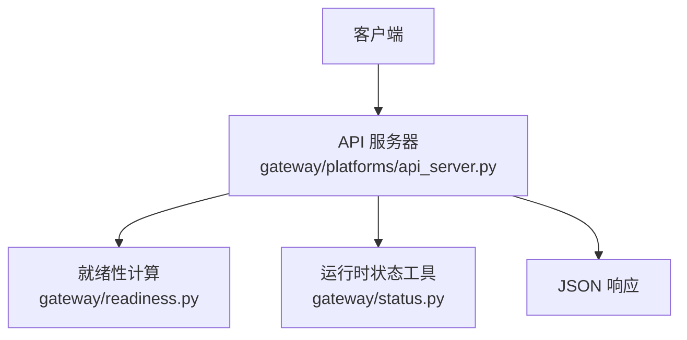
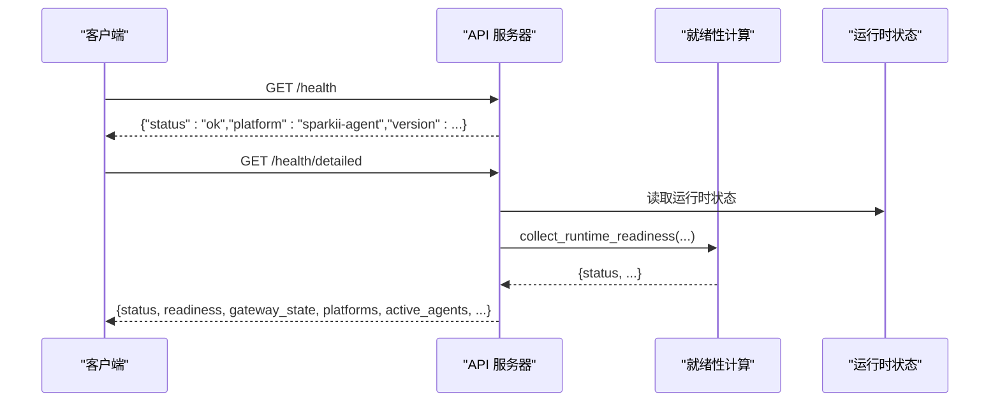
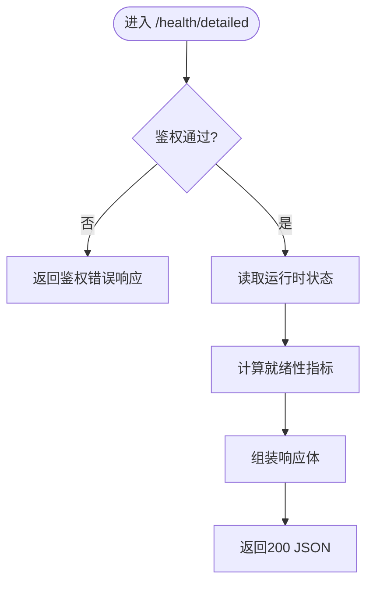
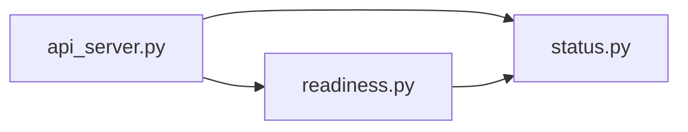

# 系统信息API

<cite>
**本文引用的文件**
- [gateway/platforms/api_server.py](file://gateway/platforms/api_server.py)
- [gateway/readiness.py](file://gateway/readiness.py)
- [gateway/status.py](file://gateway/status.py)
</cite>

## 目录
1. [简介](#简介)
2. [项目结构](#项目结构)
3. [核心组件](#核心组件)
4. [架构总览](#架构总览)
5. [详细组件分析](#详细组件分析)
6. [依赖关系分析](#依赖关系分析)
7. [性能与监控指标](#性能与监控指标)
8. [故障排查指南](#故障排查指南)
9. [结论](#结论)
10. [附录：端点参考](#附录端点参考)

## 简介
本文件面向运维与集成方，系统化说明系统信息API，包括健康检查、详细状态查询、可用模型列表以及机器可读的API能力声明。文档覆盖各端点的请求/响应格式、状态码含义、错误诊断要点，并给出基于代码实现的监控指标说明与故障排查示例。

## 项目结构
系统信息API由网关平台的HTTP服务器统一暴露，关键路由注册与处理器位于平台API服务中；详细状态读取依赖运行时状态与就绪性计算模块。

图表来源
- [gateway/platforms/api_server.py:2040-2092](file://gateway/platforms/api_server.py#L2040-L2092)
- [gateway/platforms/api_server.py:2934-3166](file://gateway/platforms/api_server.py#L2934-L3166)
- [gateway/readiness.py:89-122](file://gateway/readiness.py#L89-L122)
- [gateway/status.py:173-244](file://gateway/status.py#L173-L244)

章节来源
- [gateway/platforms/api_server.py:2040-2092](file://gateway/platforms/api_server.py#L2040-L2092)
- [gateway/platforms/api_server.py:2934-3166](file://gateway/platforms/api_server.py#L2934-L3166)

## 核心组件
- HTTP路由表：集中注册健康、模型、能力等只读接口，便于测试与多租户复用。
- 健康检查处理器：提供基础与详细两种健康检查。
- 模型列表处理器：返回当前主模型及配置的别名路由。
- 能力声明处理器：以机器可读方式声明认证方式、运行模式与可用端点集合。
- 就绪性与运行时状态：聚合网关状态、活跃代理数、是否可排空等指标。

章节来源
- [gateway/platforms/api_server.py:2040-2092](file://gateway/platforms/api_server.py#L2040-L2092)
- [gateway/platforms/api_server.py:2934-3166](file://gateway/platforms/api_server.py#L2934-L3166)
- [gateway/readiness.py:89-122](file://gateway/readiness.py#L89-L122)
- [gateway/status.py:173-244](file://gateway/status.py#L173-L244)

## 架构总览
下图展示了从客户端到API服务器的调用链路，以及详细健康检查对就绪性与运行时状态的依赖。

图表来源
- [gateway/platforms/api_server.py:2934-2997](file://gateway/platforms/api_server.py#L2934-L2997)
- [gateway/platforms/api_server.py:2968-2974](file://gateway/platforms/api_server.py#L2968-L2974)
- [gateway/readiness.py:89-122](file://gateway/readiness.py#L89-L122)

## 详细组件分析

### 基础健康检查 GET /health
- 功能：快速判断服务是否存活。
- 认证：无需鉴权。
- 成功响应（200）：包含服务标识与版本信息。
- 典型用途：探针、负载均衡器健康检查。

章节来源
- [gateway/platforms/api_server.py:2934-2938](file://gateway/platforms/api_server.py#L2934-L2938)

### 详细状态检查 GET /health/detailed
- 功能：返回更丰富的运行时状态，用于跨容器仪表板探测。
- 认证：需要与其他API相同的Bearer鉴权。
- 成功响应（200）：包含以下字段（节选）
  - status：整体状态字符串
  - readiness：就绪性详情（来自就绪性计算）
  - platform/version：平台与版本
  - gateway_state：网关状态
  - platforms：已连接平台信息
  - active_agents：解析后的活跃代理数量
  - gateway_busy/gateway_drainable：繁忙与可排空标志
  - exit_reason：退出原因（如有）
  - updated_at：规范化后的更新时间（RFC3339或null）
  - pid：进程ID
- 失败响应
  - 401/403：鉴权失败时返回鉴权错误响应。

图表来源
- [gateway/platforms/api_server.py:2940-2997](file://gateway/platforms/api_server.py#L2940-L2997)
- [gateway/readiness.py:89-122](file://gateway/readiness.py#L89-L122)
- [gateway/status.py:197-244](file://gateway/status.py#L197-L244)

章节来源
- [gateway/platforms/api_server.py:2940-2997](file://gateway/platforms/api_server.py#L2940-L2997)
- [gateway/readiness.py:89-122](file://gateway/readiness.py#L89-L122)
- [gateway/status.py:197-244](file://gateway/status.py#L197-L244)

### 列出可用模型 GET /v1/models
- 功能：列出当前主模型以及配置的模型路由别名。
- 认证：需要鉴权。
- 成功响应（200）：对象列表，每项包含id、object、created、owned_by、permission、root、parent等字段。
- 失败响应
  - 401/403：鉴权失败。

章节来源
- [gateway/platforms/api_server.py:2999-3045](file://gateway/platforms/api_server.py#L2999-L3045)

### 获取API能力信息 GET /v1/capabilities
- 功能：以机器可读方式声明API表面，供外部UI与编排系统发现。
- 认证：需要鉴权。
- 成功响应（200）：包含
  - object/platform/model/auth/runtime/features/endpoints 等字段
  - endpoints 明确列出所有受支持端点的方法与路径
- 失败响应
  - 401/403：鉴权失败。

章节来源
- [gateway/platforms/api_server.py:3084-3166](file://gateway/platforms/api_server.py#L3084-L3166)

## 依赖关系分析
- API服务器负责路由注册与请求处理。
- 详细健康检查依赖就绪性计算模块，后者综合运行时状态、活动任务数、队列深度等信息得出readiness。
- 运行时状态由状态工具模块提供，包含PID、更新时间规范化、网关状态等。

图表来源
- [gateway/platforms/api_server.py:2968-2974](file://gateway/platforms/api_server.py#L2968-L2974)
- [gateway/readiness.py:89-122](file://gateway/readiness.py#L89-L122)
- [gateway/status.py:173-244](file://gateway/status.py#L173-L244)

章节来源
- [gateway/platforms/api_server.py:2968-2974](file://gateway/platforms/api_server.py#L2968-L2974)
- [gateway/readiness.py:89-122](file://gateway/readiness.py#L89-L122)
- [gateway/status.py:173-244](file://gateway/status.py#L173-L244)

## 性能与监控指标
- 基础健康检查：轻量级，适合高频探针。
- 详细健康检查：聚合了就绪性指标，建议降低轮询频率，避免频繁触发后台计算。
- 关键指标（来自详细健康检查与就绪性计算）
  - status/readiness：整体健康与就绪性
  - gateway_state：网关生命周期状态
  - active_agents：活跃代理数量
  - gateway_busy/gateway_drainable：繁忙与可排空标志
  - updated_at：最近一次状态更新时间（RFC3339或null）
  - pid：进程标识
- 能力声明：endpoints字段可用于动态发现可用端点，减少硬编码耦合。

章节来源
- [gateway/platforms/api_server.py:2975-2997](file://gateway/platforms/api_server.py#L2975-L2997)
- [gateway/readiness.py:89-122](file://gateway/readiness.py#L89-L122)
- [gateway/status.py:197-244](file://gateway/status.py#L197-L244)

## 故障排查指南
- 鉴权失败（401/403）
  - 现象：/health/detailed、/v1/models、/v1/capabilities返回鉴权错误。
  - 排查：确认请求携带正确的Bearer令牌；检查服务端是否配置了API密钥。
  - 依据：上述端点在鉴权失败时直接返回鉴权错误响应。
- 详细健康检查异常
  - 现象：readiness或gateway_state指示非健康。
  - 排查：关注updated_at是否为有效时间；检查active_agents与gateway_busy；结合exit_reason定位异常。
  - 依据：详细健康检查聚合readiness与运行时状态。
- 模型列表为空或不完整
  - 现象：/v1/models未返回预期模型或别名。
  - 排查：确认主模型解析与模型路由别名配置是否正确。
  - 依据：模型列表包含主模型与别名路由项。
- 能力端点缺失
  - 现象：capabilities中的endpoints不包含期望端点。
  - 排查：核对当前部署版本的端点清单；确认未启用/禁用的特性开关。
  - 依据：capabilities声明了当前实例支持的端点集合。

章节来源
- [gateway/platforms/api_server.py:2940-2997](file://gateway/platforms/api_server.py#L2940-L2997)
- [gateway/platforms/api_server.py:2999-3045](file://gateway/platforms/api_server.py#L2999-L3045)
- [gateway/platforms/api_server.py:3084-3166](file://gateway/platforms/api_server.py#L3084-L3166)

## 结论
系统信息API提供了标准化的健康检查、详细状态、模型枚举与能力声明能力。通过基础与健康检查的快速判定，结合详细健康检查的丰富指标，配合能力端点发现，可有效支撑监控、编排与故障定位。建议将基础健康检查用于高频探针，详细健康检查用于低频深度巡检。

## 附录：端点参考
- GET /health
  - 认证：无
  - 成功：200，包含status、platform、version
- GET /health/detailed
  - 认证：需要Bearer
  - 成功：200，包含status、readiness、gateway_state、platforms、active_agents、gateway_busy、gateway_drainable、exit_reason、updated_at、pid
  - 失败：401/403（鉴权失败）
- GET /v1/models
  - 认证：需要Bearer
  - 成功：200，对象列表（id、object、created、owned_by、permission、root、parent）
  - 失败：401/403（鉴权失败）
- GET /v1/capabilities
  - 认证：需要Bearer
  - 成功：200，包含object、platform、model、auth、runtime、features、endpoints
  - 失败：401/403（鉴权失败）

章节来源
- [gateway/platforms/api_server.py:2040-2092](file://gateway/platforms/api_server.py#L2040-L2092)
- [gateway/platforms/api_server.py:2934-3166](file://gateway/platforms/api_server.py#L2934-L3166)