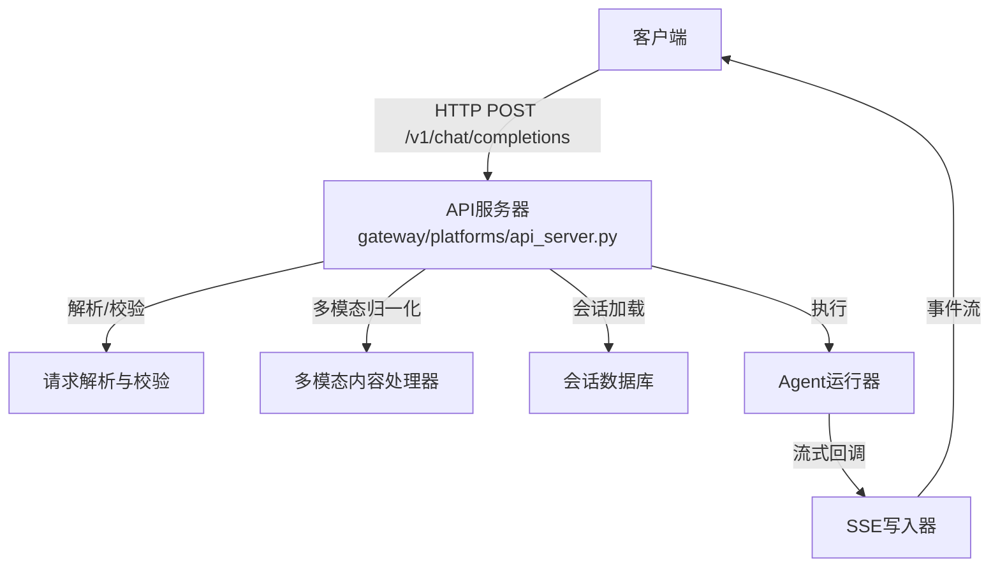
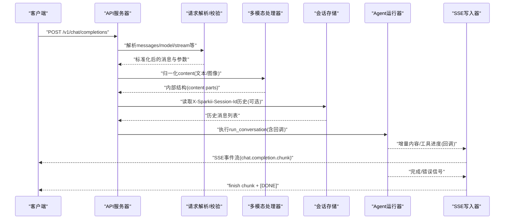
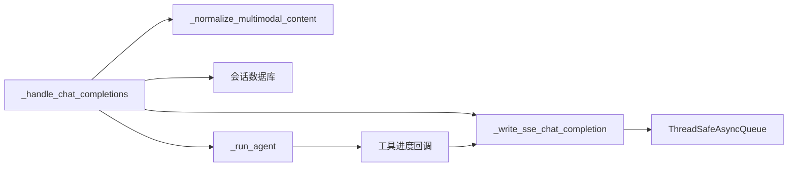

# 聊天完成API

<cite>
**本文引用的文件**
- [gateway/platforms/api_server.py](file://gateway/platforms/api_server.py)
- [.plans/openai-api-server.md](file://.plans/openai-api-server.md)
</cite>

## 目录
1. [简介](#简介)
2. [项目结构](#项目结构)
3. [核心组件](#核心组件)
4. [架构总览](#架构总览)
5. [详细组件分析](#详细组件分析)
6. [依赖关系分析](#依赖关系分析)
7. [性能考量](#性能考量)
8. [故障排查指南](#故障排查指南)
9. [结论](#结论)
10. [附录](#附录)

## 简介
本文件为“聊天完成”API（POST /v1/chat/completions）的完整规范文档。该端点提供与 OpenAI Chat Completions API 兼容的请求格式，支持文本与图像等多模态内容，支持流式（SSE）与非流式响应，并提供可选的会话连续性控制（通过请求头 X-Sparkii-Session-Id 与 X-Sparkii-Session-Key）。服务端基于 gateway/platforms/api_server.py 实现，遵循 OpenAI 兼容协议，便于对接各类前端（如 Open WebUI、LobeChat、LibreChat 等）。

## 项目结构
- 路由注册：/v1/chat/completions 由 api_server 平台适配器统一注册并处理。
- 请求解析与校验：对 messages、model、stream、temperature 等字段进行解析与规范化。
- 多模态内容：支持 text 与 image_url/input_image 类型的内容片段，自动归一化为内部结构。
- 会话连续性：
  - X-Sparkii-Session-Id：用于加载历史消息，实现跨请求会话延续（需启用 API 密钥认证）。
  - X-Sparkii-Session-Key：用于长期记忆作用域隔离（例如按频道/渠道维度）。
- 流式响应：使用 SSE 事件流返回增量内容，并在结束时发送 finish chunk 与 [DONE]。
- 非流式响应：一次性返回完整结果，包含 usage 统计与 finish_reason。

**图示来源**
- [gateway/platforms/api_server.py:4021-4380](file://gateway/platforms/api_server.py#L4021-L4380)
- [gateway/platforms/api_server.py:4381-4573](file://gateway/platforms/api_server.py#L4381-L4573)

**章节来源**
- [gateway/platforms/api_server.py:1-40](file://gateway/platforms/api_server.py#L1-L40)
- [.plans/openai-api-server.md:30-37](file://.plans/openai-api-server.md#L30-L37)

## 核心组件
- 聊天完成处理器：_handle_chat_completions
  - 负责解析请求体、提取 system/user/assistant 消息、处理 stream 标志、读取会话头、构建 agent 参数、调用 _run_agent，并输出非流式或流式响应。
- 多模态内容归一化：_normalize_multimodal_content
  - 将 content 数组中的 text 与 image_url/input_image 片段归一化为内部结构；仅支持 http(s) 与 data:image/* URL。
- SSE 写入器：_write_sse_chat_completion
  - 将增量内容以 chat.completion.chunk 形式推送，附带 role 初始块与最终 finish chunk，并在结束处发送 [DONE]。
- 会话与鉴权：
  - X-Sparkii-Session-Id：若存在且已配置 API 密钥，则从会话数据库加载历史消息；否则根据首条用户消息与系统提示派生稳定 session ID。
  - X-Sparkii-Session-Key：用于长期记忆作用域隔离，独立于会话 ID。
- 错误与状态：
  - 非流式路径在失败或截断时设置 finish_reason 为 error/length，并通过响应头与扩展字段指示 partial/completed/error。
  - 流式路径在结束时根据结果计算 finish_reason，并在错误时附加 error 与 sparkii 扩展信息。

**章节来源**
- [gateway/platforms/api_server.py:4021-4380](file://gateway/platforms/api_server.py#L4021-L4380)
- [gateway/platforms/api_server.py:4381-4573](file://gateway/platforms/api_server.py#L4381-L4573)
- [gateway/platforms/api_server.py:550-666](file://gateway/platforms/api_server.py#L550-L666)

## 架构总览
下图展示了从客户端到服务端的核心交互流程，包括请求解析、多模态处理、会话加载、Agent 执行以及 SSE 流式输出。

**图示来源**
- [gateway/platforms/api_server.py:4021-4380](file://gateway/platforms/api_server.py#L4021-L4380)
- [gateway/platforms/api_server.py:4381-4573](file://gateway/platforms/api_server.py#L4381-L4573)

## 详细组件分析

### 端点规范：POST /v1/chat/completions
- 方法：POST
- 路径：/v1/chat/completions
- 认证：Authorization: Bearer <API_SERVER_KEY>（当启用会话连续性时必须配置 API 密钥）
- 请求体字段（OpenAI 兼容）：
  - model：字符串，虚拟模型名或实际模型名（受配置允许直接模型请求影响）
  - messages：数组，元素包含 role（system/user/assistant）与 content（字符串或内容片段数组）
  - stream：布尔或可被识别为布尔的字符串（true/false/1/0/yes/no/on/off），默认 false
  - temperature：数值，采样温度（由下游模型/运行时决定取值范围）
  - provider、model_options、tools、tool_choice：可选，用于运行时覆盖与工具选择
- 请求头：
  - X-Sparkii-Session-Id：可选，指定会话ID以加载历史消息（需已配置 API 密钥）
  - X-Sparkii-Session-Key：可选，长期记忆作用域键（独立于会话ID）
  - Idempotency-Key：可选，非流式路径下用于幂等缓存（基于指纹）

**章节来源**
- [gateway/platforms/api_server.py:4021-4380](file://gateway/platforms/api_server.py#L4021-L4380)
- [gateway/platforms/api_server.py:221-243](file://gateway/platforms/api_server.py#L221-L243)

### 多模态内容支持
- 支持的 content 片段类型：
  - text：纯文本片段
  - image_url 或 input_image：图片引用，url 必须为 http(s) 或 data:image/* 内联数据
- 不支持：
  - file、input_file、document 等上传类内容
- 归一化策略：
  - 文本片段合并为字符串（当全部为文本时）
  - 包含图片时保持为内容片段数组，供下游管线直接使用

**章节来源**
- [gateway/platforms/api_server.py:550-666](file://gateway/platforms/api_server.py#L550-L666)

### 会话连续性控制
- X-Sparkii-Session-Id：
  - 若提供且已配置 API 密钥，则从会话数据库加载历史消息作为 conversation_history
  - 若未提供，则根据首条用户消息与系统提示派生稳定的 session ID，使同一对话映射到同一 Sparkii 会话
- X-Sparkii-Session-Key：
  - 用于长期记忆作用域隔离，与会话ID解耦，适合跨转录的上下文限定
- 安全限制：
  - 会话ID禁止控制字符与路径穿越形状，长度受限
  - 未配置 API 密钥时拒绝会话连续性

**章节来源**
- [gateway/platforms/api_server.py:4087-4145](file://gateway/platforms/api_server.py#L4087-L4145)

### 流式响应（SSE）
- 事件类型：
  - 角色初始化块：delta.role = "assistant"
  - 内容增量块：delta.content 逐步填充
  - 工具进度事件：event: sparkii.tool.progress，携带 tool、emoji、label、toolCallId、status（running/completed）
  - 结束块：finish_reason 为 stop/length/error，并附带 usage
  - 终止标记：data: [DONE]
- 保活机制：
  - 空闲时定期发送 keepalive 注释，避免代理超时
- 断开处理：
  - 客户端断开时中断 Agent 并取消任务，清理后台进程

**章节来源**
- [gateway/platforms/api_server.py:4381-4573](file://gateway/platforms/api_server.py#L4381-L4573)

### 非流式响应
- 返回结构：
  - id、object、created、model
  - choices[0].message.content：最终回复文本
  - choices[0].finish_reason：stop/length/error
  - usage：prompt_tokens、completion_tokens、total_tokens
- 扩展字段：
  - sparkii.completed/partial/failed/error/error_code
  - 响应头：X-Sparkii-Session-Id、X-Sparkii-Session-Key、X-Sparkii-Completed、X-Sparkii-Partial、X-Sparkii-Error（必要时）

**章节来源**
- [gateway/platforms/api_server.py:4265-4380](file://gateway/platforms/api_server.py#L4265-L4380)

### 错误处理机制
- 请求级错误：
  - JSON 解析失败：400 invalid_request_error
  - messages 缺失或非法：400 invalid_request_error
  - 多模态内容非法：400 invalid_content_part/unsupported_content_type/invalid_image_url
  - 会话连续性未授权：403 需要 API 密钥
  - 会话ID非法或过长：400 invalid_request_error
- 执行级错误：
  - 非流式：当无可用回复且失败/部分完成时返回 502，并附带 sparkii 扩展信息
  - 流式：结束时根据结果设置 finish_reason=error，并在 finish chunk 中附加 error 与 sparkii 扩展
- 常见错误码：
  - invalid_request_error：请求参数不合法
  - unsupported_content_type：不支持的文件/文档输入
  - invalid_image_url：图片URL无效或不支持的数据URL
  - agent_incomplete/output_truncated/agent_error：执行异常或截断

**章节来源**
- [gateway/platforms/api_server.py:4021-4380](file://gateway/platforms/api_server.py#L4021-L4380)
- [gateway/platforms/api_server.py:4381-4573](file://gateway/platforms/api_server.py#L4381-L4573)

### 客户端集成示例与最佳实践
- 基本请求（非流式）：
  - 设置 Authorization: Bearer <API_SERVER_KEY>
  - 发送 messages 数组，role 包含 system/user/assistant
  - 如需会话连续性，添加 X-Sparkii-Session-Id（并确保已配置 API 密钥）
- 流式请求：
  - 设置 stream=true
  - 客户端应消费 SSE 事件流，累积 delta.content，直到收到 finish chunk 与 [DONE]
- 多模态请求：
  - 在 messages 中使用 content 数组，包含 text 与 image_url/input_image 片段
  - 图片URL必须为 http(s) 或 data:image/*
- 最佳实践：
  - 合理设置 temperature 与 max_tokens（由下游模型/运行时决定）
  - 使用 Idempotency-Key 提高幂等性（非流式）
  - 使用 X-Sparkii-Session-Key 隔离长期记忆作用域
  - 处理 finish_reason 与 sparkii 扩展字段以区分正常完成、截断与错误

**章节来源**
- [gateway/platforms/api_server.py:4021-4380](file://gateway/platforms/api_server.py#L4021-L4380)
- [gateway/platforms/api_server.py:4381-4573](file://gateway/platforms/api_server.py#L4381-L4573)

## 依赖关系分析
- 模块耦合：
  - _handle_chat_completions 依赖多模态归一化、会话数据库、Agent 运行器与 SSE 写入器
  - SSE 写入器依赖线程安全队列与 Agent 生命周期管理
- 外部依赖：
  - aiohttp.web 用于 HTTP 服务与 StreamResponse
  - 会话数据库接口用于加载历史消息
  - Agent 运行器用于执行对话与工具调用

**图示来源**
- [gateway/platforms/api_server.py:4021-4380](file://gateway/platforms/api_server.py#L4021-L4380)
- [gateway/platforms/api_server.py:4381-4573](file://gateway/platforms/api_server.py#L4381-L4573)

**章节来源**
- [gateway/platforms/api_server.py:4021-4380](file://gateway/platforms/api_server.py#L4021-L4380)
- [gateway/platforms/api_server.py:4381-4573](file://gateway/platforms/api_server.py#L4381-L4573)

## 性能考量
- 并发限制：入站请求可能受并发上限保护（_concurrency_limited_response）
- 流式缓冲：SSE 写入器使用线程安全队列减少轮询延迟，提升增量推送效率
- 保活机制：空闲时发送 keepalive 注释，避免中间代理超时
- 资源清理：客户端断开时中断 Agent 并回收后台进程，防止泄漏

**章节来源**
- [gateway/platforms/api_server.py:4381-4573](file://gateway/platforms/api_server.py#L4381-L4573)

## 故障排查指南
- 常见问题：
  - 400 invalid_request_error：检查 messages 是否为有效数组，content 是否包含支持的片段类型
  - 400 invalid_image_url：确保图片URL为 http(s) 或 data:image/*
  - 403 会话连续性未授权：确认已配置 API 密钥
  - 502 agent_incomplete：Agent 未产生可用回复或执行失败，查看 sparkii 扩展字段与日志
- 调试建议：
  - 开启详细日志，关注 Agent 任务异常与 SSE 写入错误
  - 使用 Idempotency-Key 验证幂等行为
  - 检查会话ID合法性与长度限制

**章节来源**
- [gateway/platforms/api_server.py:4021-4380](file://gateway/platforms/api_server.py#L4021-L4380)
- [gateway/platforms/api_server.py:4381-4573](file://gateway/platforms/api_server.py#L4381-L4573)

## 结论
POST /v1/chat/completions 提供了与 OpenAI 兼容的聊天完成能力，支持多模态内容与流式响应，并通过 X-Sparkii-Session-Id 与 X-Sparkii-Session-Key 实现灵活的会话连续性与长期记忆作用域隔离。服务端在请求校验、多模态归一化、会话加载、Agent 执行与 SSE 输出方面具备完善的错误处理与性能优化，适用于多种前端集成场景。

## 附录
- 参考计划文档：
  - OpenAI 兼容 API 服务器设计目标与端点说明
  - 流式支持与工具透明度的演进路线

**章节来源**
- [.plans/openai-api-server.md:1-292](file://.plans/openai-api-server.md#L1-L292)