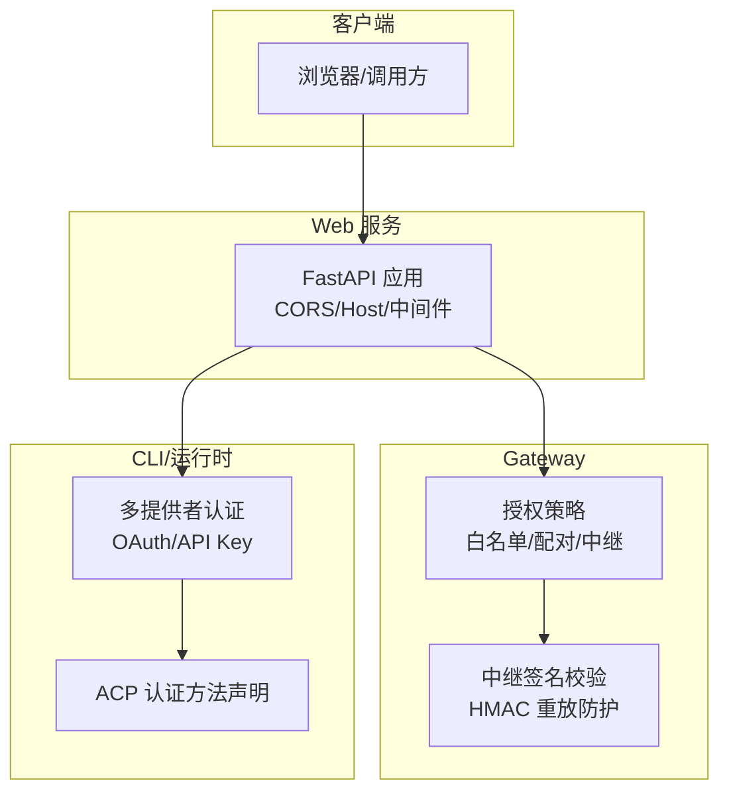
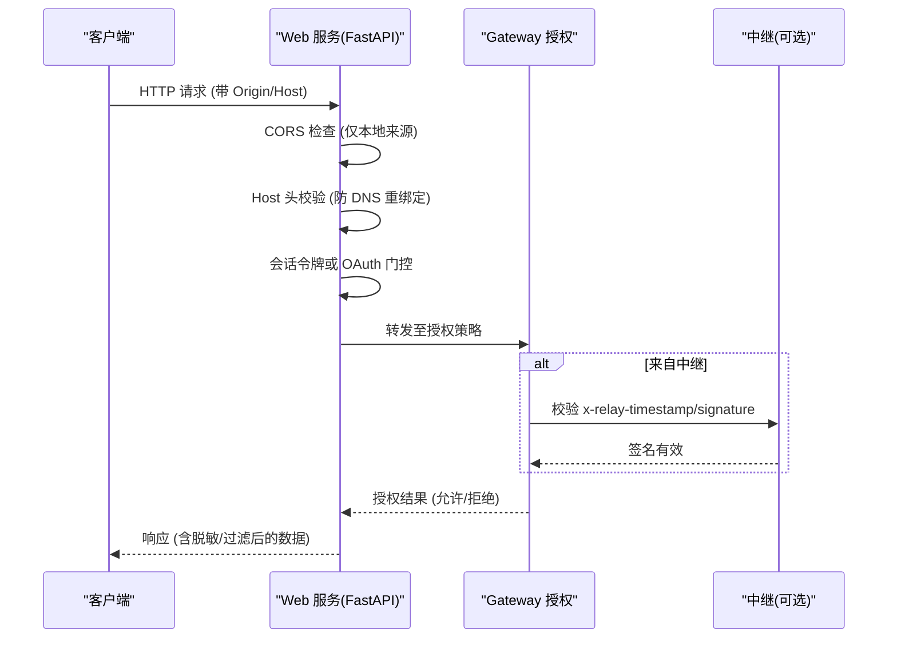
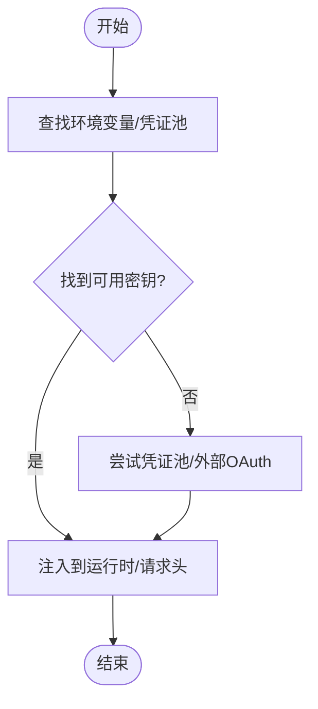
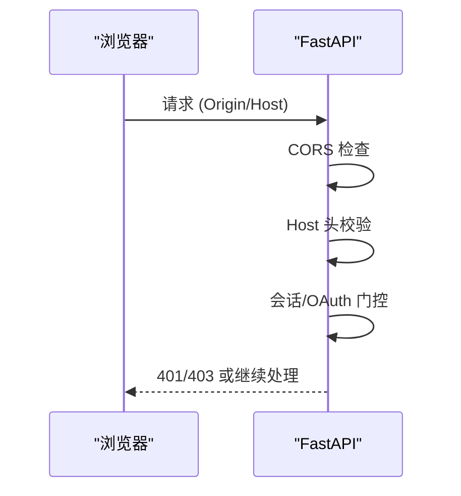
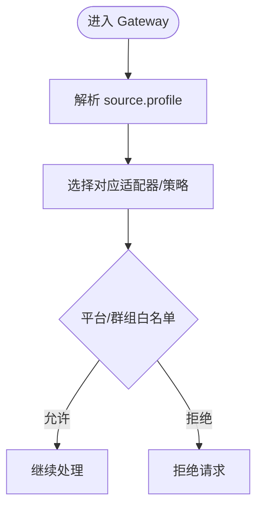
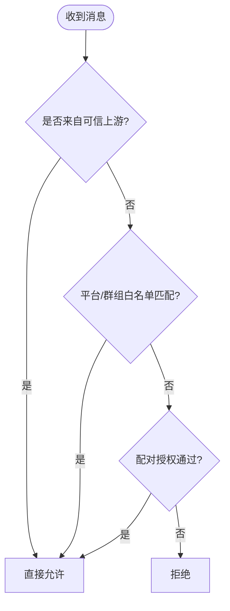
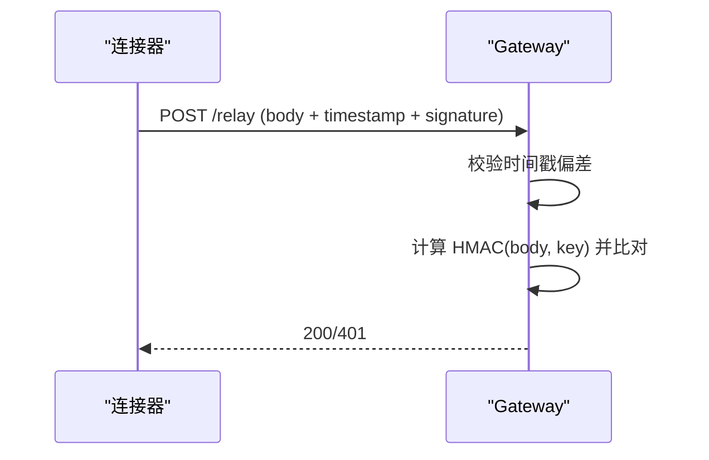
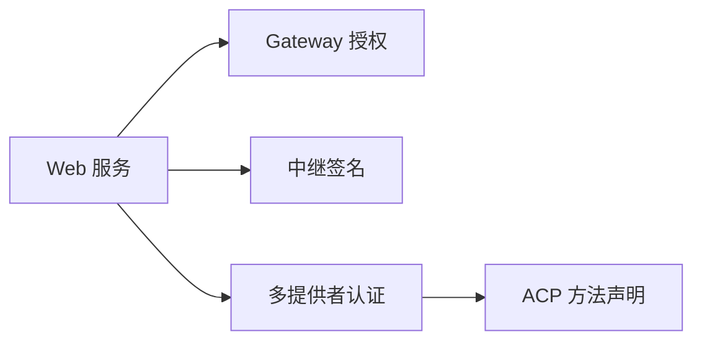

# 认证与安全

<cite>
**本文引用的文件**
- [acp_adapter/auth.py](file://acp_adapter/auth.py)
- [gateway/authz_mixin.py](file://gateway/authz_mixin.py)
- [gateway/relay/auth.py](file://gateway/relay/auth.py)
- [sparkii_cli/auth.py](file://sparkii_cli/auth.py)
- [plugins/dashboard_auth/basic/__init__.py](file://plugins/dashboard_auth/basic/__init__.py)
- [sparkii_cli/web_server.py](file://sparkii_cli/web_server.py)
</cite>

## 目录
1. [简介](#简介)
2. [项目结构](#项目结构)
3. [核心组件](#核心组件)
4. [架构总览](#架构总览)
5. [详细组件分析](#详细组件分析)
6. [依赖关系分析](#依赖关系分析)
7. [性能与速率限制](#性能与速率限制)
8. [故障排查指南](#故障排查指南)
9. [结论](#结论)
10. [附录：配置与最佳实践](#附录配置与最佳实践)

## 简介
本文件面向 API 服务器与网关的安全机制，覆盖以下主题：
- API 密钥验证与多提供者认证（OAuth、设备码、API Key）
- 多租户隔离（基于 /p/<profile>/ 路径前缀的会话与策略路由）
- 权限控制（平台级白名单、群组/频道白名单、配对授权、上游可信中继）
- 安全头部要求、请求校验、输入清洗与输出过滤
- 敏感信息脱敏、访问日志与安全审计
- 跨域请求处理与 CORS 配置
- 速率限制、防重放与令牌轮换
- 安全配置示例、最佳实践与常见问题解决方案

## 项目结构
本项目将认证与安全能力分布在多个模块中：
- CLI 层提供多提供者认证与密钥解析（OAuth 设备码、API Key、外部 OAuth）
- Web 服务层实现 Dashboard 鉴权中间件、CORS、Host 头校验、会话令牌保护
- Gateway 层实现用户/聊天授权策略、平台白名单、中继通道签名校验
- ACP 适配器负责向外部代理声明可用的认证方式

图表来源
- [sparkii_cli/web_server.py:373-378](file://sparkii_cli/web_server.py#L373-L378)
- [gateway/authz_mixin.py:386-783](file://gateway/authz_mixin.py#L386-L783)
- [gateway/relay/auth.py:142-169](file://gateway/relay/auth.py#L142-L169)
- [acp_adapter/auth.py:41-79](file://acp_adapter/auth.py#L41-L79)

章节来源
- [sparkii_cli/web_server.py:373-378](file://sparkii_cli/web_server.py#L373-L378)
- [gateway/authz_mixin.py:386-783](file://gateway/authz_mixin.py#L386-L783)
- [gateway/relay/auth.py:142-169](file://gateway/relay/auth.py#L142-L169)
- [acp_adapter/auth.py:41-79](file://acp_adapter/auth.py#L41-L79)

## 核心组件
- 多提供者认证（CLI）
  - 支持多种提供商（OpenAI、Anthropic、xAI、Qwen、Gemini 等），通过环境变量或凭证池解析 API Key；部分提供商使用 OAuth 设备码或外部 OAuth。
  - 关键职责：发现可用凭据、刷新令牌、选择推理端点、为运行时注入密钥。
- Web 服务鉴权与 CORS
  - 强制 Host 头校验，防止 DNS 重绑定；CORS 仅允许本地回环来源；对 /api/* 启用会话令牌或 OAuth 门控。
- Gateway 授权策略
  - 按平台与环境变量维护白名单；支持群组/频道白名单；支持“配对”授权；信任上游中继已授权的流量。
- 中继通道安全
  - WebSocket 升级令牌与入站交付签名双重 HMAC 校验，支持密钥轮换与重放窗口。
- ACP 认证方法声明
  - 对外暴露当前运行时的认证能力，便于代理侧握手。

章节来源
- [sparkii_cli/auth.py:194-507](file://sparkii_cli/auth.py#L194-L507)
- [sparkii_cli/web_server.py:373-378](file://sparkii_cli/web_server.py#L373-L378)
- [gateway/authz_mixin.py:386-783](file://gateway/authz_mixin.py#L386-L783)
- [gateway/relay/auth.py:83-134](file://gateway/relay/auth.py#L83-L134)
- [acp_adapter/auth.py:41-79](file://acp_adapter/auth.py#L41-L79)

## 架构总览
下图展示一次受保护的 API 请求从浏览器到 Gateway 的关键安全步骤：CORS/Host 校验 → 会话/OAuth 鉴权 → 平台授权策略 → 中继签名校验（如适用）。

图表来源
- [sparkii_cli/web_server.py:373-378](file://sparkii_cli/web_server.py#L373-L378)
- [sparkii_cli/web_server.py:494-565](file://sparkii_cli/web_server.py#L494-L565)
- [gateway/authz_mixin.py:386-783](file://gateway/authz_mixin.py#L386-L783)
- [gateway/relay/auth.py:142-169](file://gateway/relay/auth.py#L142-L169)

## 详细组件分析

### 多提供者认证（API 密钥与 OAuth）
- 支持的认证类型
  - API Key：从环境变量或凭证池读取，支持 base URL 覆盖。
  - OAuth 设备码：Nous Portal、MiniMax 等。
  - 外部 OAuth：OpenAI Codex、xAI、Qwen 等。
- 密钥解析优先级
  - 优先 ~/.sparkii/.env，其次进程环境；必要时回退到凭证池。
- 特殊处理
  - Copilot 专用 token 校验流程。
  - Z.AI 端点探测与缓存。
  - 占位值检测，避免误用示例密钥。

图表来源
- [sparkii_cli/auth.py:630-671](file://sparkii_cli/auth.py#L630-L671)
- [sparkii_cli/auth.py:694-780](file://sparkii_cli/auth.py#L694-L780)

章节来源
- [sparkii_cli/auth.py:194-507](file://sparkii_cli/auth.py#L194-L507)
- [sparkii_cli/auth.py:630-671](file://sparkii_cli/auth.py#L630-L671)
- [sparkii_cli/auth.py:694-780](file://sparkii_cli/auth.py#L694-L780)

### Web 服务鉴权与 CORS
- CORS 策略
  - 仅允许 localhost/127.0.0.1 来源，禁止通配符，防止跨站读取配置与密钥。
- Host 头校验
  - 拒绝与绑定接口不匹配的 Host 头，防御 DNS 重绑定攻击。
- 会话令牌与 OAuth 门控
  - 非公开 /api/* 需要会话令牌或经过 OAuth 门控；公共路径最小化。
- 插件 API 运行时门控
  - 对已禁用插件的路由在请求时拦截，避免信息泄露。

图表来源
- [sparkii_cli/web_server.py:373-378](file://sparkii_cli/web_server.py#L373-L378)
- [sparkii_cli/web_server.py:494-565](file://sparkii_cli/web_server.py#L494-L565)
- [sparkii_cli/web_server.py:644-685](file://sparkii_cli/web_server.py#L644-L685)

章节来源
- [sparkii_cli/web_server.py:373-378](file://sparkii_cli/web_server.py#L373-L378)
- [sparkii_cli/web_server.py:494-565](file://sparkii_cli/web_server.py#L494-L565)
- [sparkii_cli/web_server.py:644-685](file://sparkii_cli/web_server.py#L644-L685)

### 多租户隔离（/p/<profile>/ 路径前缀）
- 目标
  - 在多租户或多 profile 部署下，确保每个 profile 的会话、配置、策略与资源相互隔离。
- 实现要点
  - 授权策略根据 source.profile 选择对应的适配器与策略映射。
  - 配对存储、平台白名单、群组白名单均按 profile 隔离。
  - 中继场景下，即使底层平台相同，也依据 delivered_via_upstream_relay 标记进行正确授权。

图表来源
- [gateway/authz_mixin.py:93-128](file://gateway/authz_mixin.py#L93-L128)
- [gateway/authz_mixin.py:371-384](file://gateway/authz_mixin.py#L371-L384)
- [gateway/authz_mixin.py:386-783](file://gateway/authz_mixin.py#L386-L783)

章节来源
- [gateway/authz_mixin.py:93-128](file://gateway/authz_mixin.py#L93-L128)
- [gateway/authz_mixin.py:371-384](file://gateway/authz_mixin.py#L371-L384)
- [gateway/authz_mixin.py:386-783](file://gateway/authz_mixin.py#L386-L783)

### 权限控制机制
- 平台级白名单
  - 通过环境变量（如 TELEGRAM_ALLOWED_USERS、DISCORD_ALLOWED_USERS 等）配置。
- 群组/频道白名单
  - 针对 group/forum/channel 类型消息，支持按 chat_id 放行。
- 配对授权
  - 通过配对流程授予用户访问权限，独立于白名单。
- 上游中继信任
  - 若事件经中继且已在上游完成认证，则直接视为已授权。

图表来源
- [gateway/authz_mixin.py:386-783](file://gateway/authz_mixin.py#L386-L783)

章节来源
- [gateway/authz_mixin.py:386-783](file://gateway/authz_mixin.py#L386-L783)

### 安全头部与请求校验
- 中继入站签名
  - 要求携带 x-relay-timestamp 与 x-relay-signature，服务端校验时间戳偏差与 HMAC 签名。
- WebSocket 升级令牌
  - 使用 Authorization: Bearer <token> 进行升级握手，token 包含 payload、exp 与签名。
- Host 头校验
  - 拒绝与绑定接口不一致的 Host 头，防御 DNS 重绑定。

图表来源
- [gateway/relay/auth.py:142-169](file://gateway/relay/auth.py#L142-L169)
- [gateway/relay/auth.py:83-134](file://gateway/relay/auth.py#L83-L134)

章节来源
- [gateway/relay/auth.py:83-134](file://gateway/relay/auth.py#L83-L134)
- [gateway/relay/auth.py:142-169](file://gateway/relay/auth.py#L142-L169)

### 输入清洗与输出过滤
- 输入清洗
  - 平台适配器在接入阶段对 allow_from/group_allow_from 进行白名单校验，减少恶意输入进入系统。
- 输出过滤
  - 健康状态与诊断接口仅返回计数与枚举，不包含敏感路径或错误详情，避免信息泄露。

章节来源
- [gateway/authz_mixin.py:633-689](file://gateway/authz_mixin.py#L633-L689)
- [sparkii_cli/web_server.py:698-748](file://sparkii_cli/web_server.py#L698-L748)

### 敏感信息脱敏与访问日志/审计
- 敏感信息脱敏
  - 配置与密钥显示时使用脱敏函数，避免在日志或 UI 中暴露明文。
- 访问日志与审计
  - 健康中间件记录未处理异常与 5xx 响应，用于可观测性与审计。
  - 仪表盘自测任务定期调用受保护接口，验证鉴权链路可用性。

章节来源
- [sparkii_cli/web_server.py:698-748](file://sparkii_cli/web_server.py#L698-L748)
- [sparkii_cli/web_server.py:770-800](file://sparkii_cli/web_server.py#L770-L800)

### ACP 认证方法声明
- 作用
  - 向外部代理（如编辑器/IDE）声明 Hermes 可用的认证方式，包括终端设置与当前运行时凭据。
- 行为
  - 若检测到运行时 provider 与 api_key，则声明该 provider 作为默认认证方法；否则提供终端设置入口。

章节来源
- [acp_adapter/auth.py:11-33](file://acp_adapter/auth.py#L11-L33)
- [acp_adapter/auth.py:41-79](file://acp_adapter/auth.py#L41-L79)

## 依赖关系分析
- 组件耦合
  - Web 服务依赖 FastAPI 中间件实现 CORS、Host 校验与鉴权门控。
  - Gateway 授权策略依赖平台适配器与配置，结合环境变量与配对存储进行决策。
  - 中继模块与连接器协议严格对齐，保证签名与时间戳一致性。
- 外部依赖
  - 多提供者认证依赖 httpx、OAuth 端点与凭证池。
  - 仪表盘基础认证使用 scrypt 与 HMAC 生成无状态会话令牌。

图表来源
- [sparkii_cli/web_server.py:373-378](file://sparkii_cli/web_server.py#L373-L378)
- [gateway/authz_mixin.py:386-783](file://gateway/authz_mixin.py#L386-L783)
- [gateway/relay/auth.py:83-134](file://gateway/relay/auth.py#L83-L134)
- [acp_adapter/auth.py:41-79](file://acp_adapter/auth.py#L41-L79)

章节来源
- [sparkii_cli/web_server.py:373-378](file://sparkii_cli/web_server.py#L373-L378)
- [gateway/authz_mixin.py:386-783](file://gateway/authz_mixin.py#L386-L783)
- [gateway/relay/auth.py:83-134](file://gateway/relay/auth.py#L83-L134)
- [acp_adapter/auth.py:41-79](file://acp_adapter/auth.py#L41-L79)

## 性能与速率限制
- 速率限制
  - 仪表盘 reveal 端点采用简单滑动窗口限流，防止高频探测。
- 重放防护
  - 中继入站签名校验时间戳偏差，避免重放攻击。
- 令牌轮换
  - 中继与升级令牌支持多密钥验证列表，保障密钥轮换期间服务连续性。

章节来源
- [sparkii_cli/web_server.py:364-367](file://sparkii_cli/web_server.py#L364-L367)
- [gateway/relay/auth.py:142-169](file://gateway/relay/auth.py#L142-L169)
- [gateway/relay/auth.py:61-80](file://gateway/relay/auth.py#L61-L80)

## 故障排查指南
- 401 Unauthorized
  - 检查 Host 头是否与绑定接口一致；确认会话令牌或 OAuth 门控是否生效。
- 中继签名失败
  - 核对 x-relay-timestamp 与 x-relay-signature；确认密钥轮换列表包含当前密钥。
- 白名单不生效
  - 确认平台环境变量与群组白名单格式；检查 source.chat_type 与 source.chat_id。
- 仪表盘不可用
  - 查看健康中间件记录的最近错误与自测状态；确认公共路径未被误改。

章节来源
- [sparkii_cli/web_server.py:494-565](file://sparkii_cli/web_server.py#L494-L565)
- [gateway/relay/auth.py:142-169](file://gateway/relay/auth.py#L142-L169)
- [gateway/authz_mixin.py:386-783](file://gateway/authz_mixin.py#L386-L783)
- [sparkii_cli/web_server.py:698-748](file://sparkii_cli/web_server.py#L698-L748)

## 结论
本项目的认证与安全体系以“最小暴露面、默认拒绝、分层校验”为原则：
- Web 层严格限制来源与 Host，避免跨站与重绑定风险。
- Gateway 层通过平台白名单、群组白名单、配对与上游中继信任构建细粒度授权。
- 中继通道采用 HMAC 签名与时间戳校验，支持密钥轮换与重放防护。
- 多提供者认证覆盖主流云厂商与本地模型，提供灵活的凭据管理。
建议在生产环境中启用强密码/哈希、固定 signing secret、最小化公共路径，并结合可观测性进行持续审计。

## 附录：配置与最佳实践

### 安全配置示例
- 仪表盘基础认证（用户名/密码）
  - 配置项：username、password_hash（推荐）、secret（稳定多进程）、session_ttl_seconds
  - 环境变量：SPARKII_DASHBOARD_BASIC_AUTH_USERNAME/PASSWORD_HASH/PASSWORD/SECRET/TTL_SECONDS
- 中继签名
  - 入站请求必须携带 x-relay-timestamp 与 x-relay-signature；服务端校验时间偏差与 HMAC。
- CORS
  - 仅允许 localhost/127.0.0.1；禁止通配符。

章节来源
- [plugins/dashboard_auth/basic/__init__.py:17-45](file://plugins/dashboard_auth/basic/__init__.py#L17-L45)
- [plugins/dashboard_auth/basic/__init__.py:115-162](file://plugins/dashboard_auth/basic/__init__.py#L115-L162)
- [plugins/dashboard_auth/basic/__init__.py:176-193](file://plugins/dashboard_auth/basic/__init__.py#L176-L193)
- [plugins/dashboard_auth/basic/__init__.py:335-492](file://plugins/dashboard_auth/basic/__init__.py#L335-L492)
- [gateway/relay/auth.py:142-169](file://gateway/relay/auth.py#L142-L169)
- [sparkii_cli/web_server.py:373-378](file://sparkii_cli/web_server.py#L373-L378)

### 最佳实践
- 始终启用 Host 头校验与最小化公共路径。
- 使用预计算的 password_hash 与稳定的 signing secret，避免明文与重启失效。
- 为中继通道配置密钥轮换列表，确保平滑过渡。
- 平台白名单与群组白名单配合使用，避免“open”策略导致的全网开放。
- 定期审查健康指标与错误计数，及时定位鉴权与授权问题。

### 常见问题解决方案
- 跨域被拒
  - 确认请求 Origin 属于允许的本地来源；不要将 CORS 设置为通配符。
- 中继签名无效
  - 检查时间戳是否在允许偏差内；确认使用的密钥在验证列表中。
- 多租户策略冲突
  - 确保 source.profile 正确传递；检查 per-profile 的白名单与配对存储。

章节来源
- [sparkii_cli/web_server.py:373-378](file://sparkii_cli/web_server.py#L373-L378)
- [gateway/relay/auth.py:142-169](file://gateway/relay/auth.py#L142-L169)
- [gateway/authz_mixin.py:371-384](file://gateway/authz_mixin.py#L371-L384)