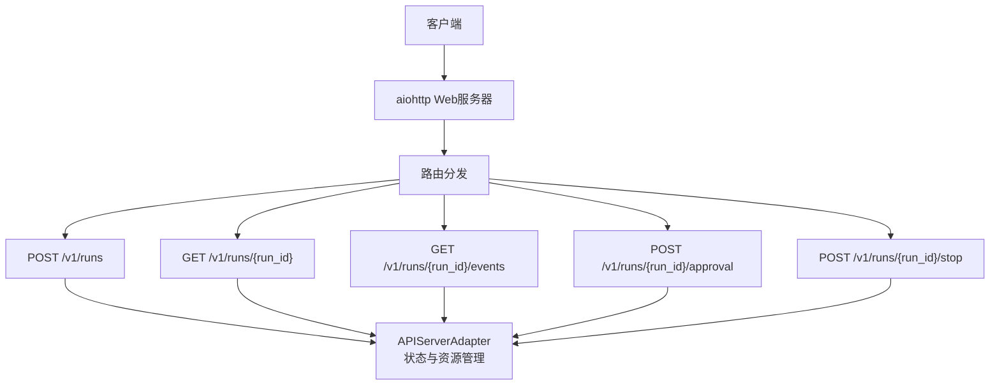
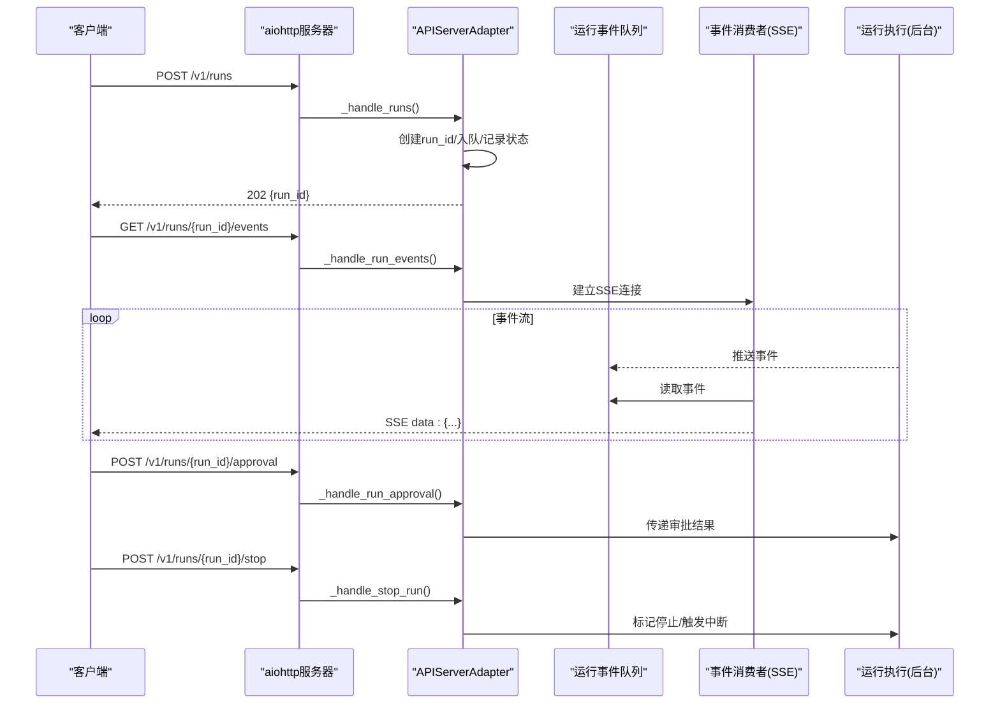
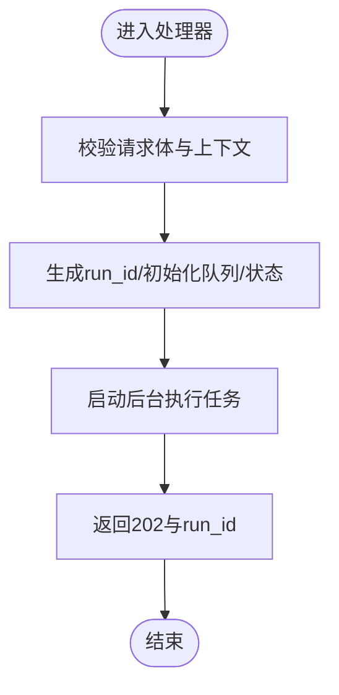
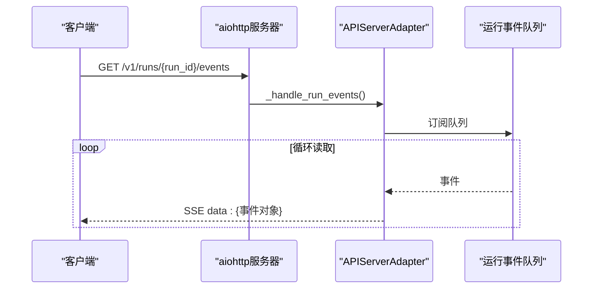
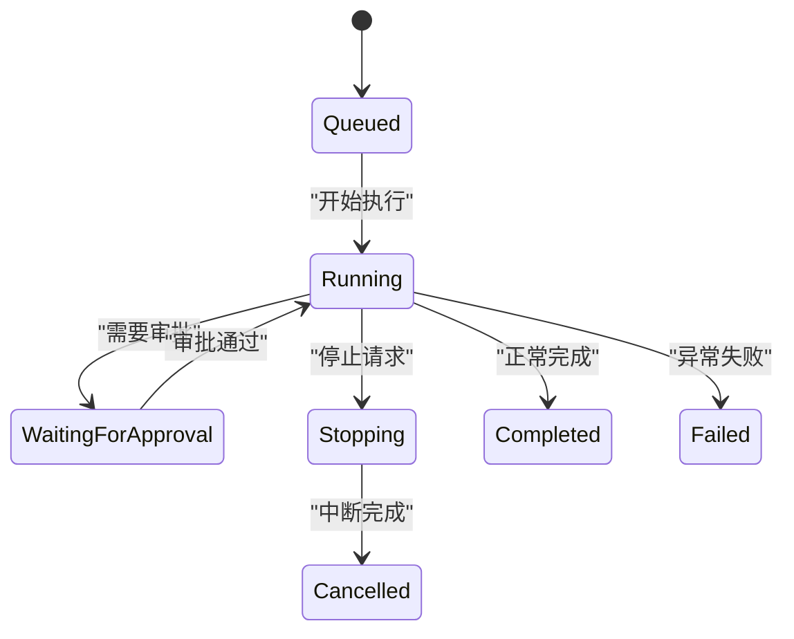
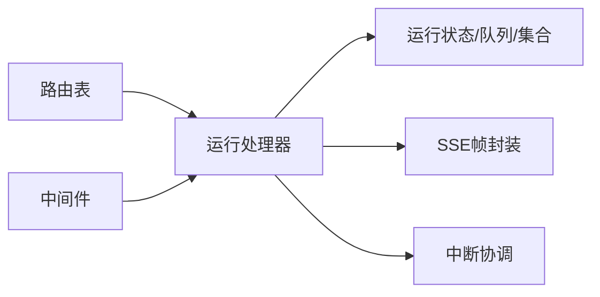

# 运行管理API

<cite>
**本文引用的文件**
- [gateway/platforms/api_server.py](file://gateway/platforms/api_server.py)
</cite>

## 目录
1. [简介](#简介)
2. [项目结构](#项目结构)
3. [核心组件](#核心组件)
4. [架构总览](#架构总览)
5. [详细组件分析](#详细组件分析)
6. [依赖关系分析](#依赖关系分析)
7. [性能考量](#性能考量)
8. [故障排查指南](#故障排查指南)
9. [结论](#结论)
10. [附录](#附录)

## 简介
本文件面向“运行管理API”，聚焦异步任务执行的生命周期管理接口与事件流，覆盖以下能力：
- 启动运行并立即返回 run_id（POST /v1/runs）
- 查询运行状态（GET /v1/runs/{run_id}）
- 通过SSE获取结构化生命周期事件（GET /v1/runs/{run_id}/events）
- 运行审批机制（POST /v1/runs/{run_id}/approval）
- 运行中断（POST /v1/runs/{run_id}/stop）

同时说明运行状态机、事件类型、错误恢复机制，并提供完整的异步任务处理流程与监控示例。

## 项目结构
运行管理API由网关平台的OpenAI兼容HTTP适配器统一暴露，路由注册在平台适配器的HTTP路由表中，处理器位于同一模块内。关键要点：
- 路由表包含 /v1/runs 系列端点，用于启动、查询、事件流、审批与停止
- SSE帧序列化由统一的SSE封装函数提供，保证事件格式一致
- 运行状态、SSE队列、活跃Agent/Task等运行时状态保存在适配器实例中
- 认证、限流、CORS与安全头等通用能力由中间件提供

图表来源
- [gateway/platforms/api_server.py:2041-2092](file://gateway/platforms/api_server.py#L2041-L2092)

章节来源
- [gateway/platforms/api_server.py:1-24](file://gateway/platforms/api_server.py#L1-L24)
- [gateway/platforms/api_server.py:2041-2092](file://gateway/platforms/api_server.py#L2041-L2092)

## 核心组件
- APIServerAdapter：承载所有HTTP端点与运行时状态，包括运行队列、SSE通道、活跃Agent/Task、运行状态缓存、并发上限控制、中断与清理等
- SSE帧封装：统一的事件序列化器，确保事件数据格式一致
- 运行状态存储：内存字典维护每个run_id的状态快照，供轮询查询
- 运行事件队列：每个运行对应一个asyncio.Queue，SSE消费者持续拉取
- 审批会话映射：将run_id与审批会话键关联，支持外部审批回调
- 中断协调：维护stopping集合与活跃Agent引用，支持协作式中断

章节来源
- [gateway/platforms/api_server.py:1351-1474](file://gateway/platforms/api_server.py#L1351-L1474)
- [gateway/platforms/api_server.py:187-207](file://gateway/platforms/api_server.py#L187-L207)

## 架构总览
下图展示从请求到运行的端到端流程，包括启动、事件推送、审批与停止的交互路径。

图表来源
- [gateway/platforms/api_server.py:2082-2086](file://gateway/platforms/api_server.py#L2082-L2086)
- [gateway/platforms/api_server.py:187-207](file://gateway/platforms/api_server.py#L187-L207)

## 详细组件分析

### 启动运行：POST /v1/runs
- 行为：接收请求体，校验参数，创建run_id，初始化事件队列与状态，启动后台任务执行运行，立即返回202与run_id
- 关键点：
  - 使用适配器实例中的并发上限控制，避免过载
  - 将run_id加入活跃任务与Agent集合，便于后续停止与清理
  - 事件通过统一SSE帧写入队列，供事件流消费

图表来源
- [gateway/platforms/api_server.py:2082-2086](file://gateway/platforms/api_server.py#L2082-L2086)
- [gateway/platforms/api_server.py:1421-1437](file://gateway/platforms/api_server.py#L1421-L1437)

章节来源
- [gateway/platforms/api_server.py:2082-2086](file://gateway/platforms/api_server.py#L2082-L2086)
- [gateway/platforms/api_server.py:1421-1437](file://gateway/platforms/api_server.py#L1421-L1437)

### 查询运行状态：GET /v1/runs/{run_id}
- 行为：根据run_id查找当前状态快照，返回最新状态信息
- 关键点：
  - 状态由后台任务或事件处理器更新，保持最终一致性
  - 未找到时返回相应错误响应

章节来源
- [gateway/platforms/api_server.py:2082-2086](file://gateway/platforms/api_server.py#L2082-L2086)
- [gateway/platforms/api_server.py:1431-1437](file://gateway/platforms/api_server.py#L1431-L1437)

### 事件流：GET /v1/runs/{run_id}/events（SSE）
- 行为：为指定run_id建立SSE长连接，持续推送结构化事件
- 关键点：
  - 使用ThreadSafeAsyncQueue跨线程安全投递事件
  - 统一SSE帧封装，保证event/data格式一致
  - 支持订阅者计数与TTL清理，防止孤儿连接

图表来源
- [gateway/platforms/api_server.py:161-185](file://gateway/platforms/api_server.py#L161-L185)
- [gateway/platforms/api_server.py:187-207](file://gateway/platforms/api_server.py#L187-L207)
- [gateway/platforms/api_server.py:2082-2086](file://gateway/platforms/api_server.py#L2082-L2086)

章节来源
- [gateway/platforms/api_server.py:161-185](file://gateway/platforms/api_server.py#L161-L185)
- [gateway/platforms/api_server.py:187-207](file://gateway/platforms/api_server.py#L187-L207)
- [gateway/platforms/api_server.py:2082-2086](file://gateway/platforms/api_server.py#L2082-L2086)

### 运行审批：POST /v1/runs/{run_id}/approval
- 行为：提交对pending运行审批的决策（如once/session/always/deny），由后端将结果传递给运行执行上下文
- 关键点：
  - 通过run_id定位运行，并与审批会话键关联
  - 支持智能拒绝策略与永久批准选项

章节来源
- [gateway/platforms/api_server.py:73-77](file://gateway/platforms/api_server.py#L73-L77)
- [gateway/platforms/api_server.py:2082-2086](file://gateway/platforms/api_server.py#L2082-L2086)
- [gateway/platforms/api_server.py:1433-1437](file://gateway/platforms/api_server.py#L1433-L1437)

### 运行中断：POST /v1/runs/{run_id}/stop
- 行为：标记运行进入停止流程，触发协作式中断，等待执行上下文退出
- 关键点：
  - 维护stopping集合，避免重复停止
  - 通过活跃Agent引用调用硬中断，确保尽快释放资源

章节来源
- [gateway/platforms/api_server.py:1427-1431](file://gateway/platforms/api_server.py#L1427-L1431)
- [gateway/platforms/api_server.py:1492-1536](file://gateway/platforms/api_server.py#L1492-L1536)
- [gateway/platforms/api_server.py:2082-2086](file://gateway/platforms/api_server.py#L2082-L2086)

### 运行状态机
- 状态流转（概念性）：
  - queued → running：开始执行
  - running → waiting_for_approval：需要审批
  - waiting_for_approval → running：审批通过
  - running → stopping：收到停止请求
  - stopping → cancelled：中断完成
  - running → completed：正常完成
  - running → failed：异常失败
- 注意：具体状态枚举与转换逻辑由后端实现决定；此处为基于代码语义的概念图

[此图为概念示意，不直接映射具体源码行]

## 依赖关系分析
- 路由注册：/v1/runs 系列端点在HTTP路由表中集中声明
- SSE帧封装：统一事件序列化，降低多路复用时的不一致风险
- 并发控制：适配器维护并发上限与活跃任务集合，保障系统稳定性
- 中断机制：通过硬中断与协作式停止结合，确保资源释放
- 认证与中间件：全局认证、CORS、安全头、请求体大小限制等

图表来源
- [gateway/platforms/api_server.py:2041-2092](file://gateway/platforms/api_server.py#L2041-L2092)
- [gateway/platforms/api_server.py:187-207](file://gateway/platforms/api_server.py#L187-L207)
- [gateway/platforms/api_server.py:1421-1437](file://gateway/platforms/api_server.py#L1421-L1437)

章节来源
- [gateway/platforms/api_server.py:2041-2092](file://gateway/platforms/api_server.py#L2041-L2092)
- [gateway/platforms/api_server.py:187-207](file://gateway/platforms/api_server.py#L187-L207)
- [gateway/platforms/api_server.py:1421-1437](file://gateway/platforms/api_server.py#L1421-L1437)

## 性能考量
- 并发上限：通过配置限制最大并发运行数，防止资源耗尽
- SSE优化：使用线程安全队列与call_soon_threadsafe减少轮询开销
- 请求体限制：早期拦截超大请求体，避免内存压力
- 健康检查：提供详细健康端点，便于外部监控与自愈

章节来源
- [gateway/platforms/api_server.py:1447-1456](file://gateway/platforms/api_server.py#L1447-L1456)
- [gateway/platforms/api_server.py:161-185](file://gateway/platforms/api_server.py#L161-L185)
- [gateway/platforms/api_server.py:1163-1185](file://gateway/platforms/api_server.py#L1163-L1185)

## 故障排查指南
- 常见问题：
  - 事件流断开：检查SSE订阅者与队列是否仍有消费者；确认run_id有效
  - 运行无法停止：确认stopping集合未被重复设置；检查Agent是否已接受中断
  - 审批无响应：确认审批会话键与run_id映射正确；检查审批策略配置
- 诊断建议：
  - 使用GET /v1/runs/{run_id}查看最新状态
  - 观察SSE事件内容，定位卡点阶段
  - 检查健康端点与负载指标，评估系统压力

章节来源
- [gateway/platforms/api_server.py:1427-1437](file://gateway/platforms/api_server.py#L1427-L1437)
- [gateway/platforms/api_server.py:1492-1536](file://gateway/platforms/api_server.py#L1492-L1536)
- [gateway/platforms/api_server.py:2041-2092](file://gateway/platforms/api_server.py#L2041-L2092)

## 结论
运行管理API通过统一的HTTP适配器暴露了完整的异步任务生命周期管理能力，涵盖启动、查询、事件流、审批与中断。借助SSE与内存状态管理，实现了高效、可观测且可控的运行体验。建议在部署时合理配置并发上限与健康检查，并结合事件流进行实时监控与故障定位。

## 附录
- 监控示例（概念性）：
  - 轮询状态：定期调用GET /v1/runs/{run_id}，记录状态变化
  - 事件订阅：通过SSE实时接收事件，构建运行看板
  - 审批集成：在审批界面调用POST /v1/runs/{run_id}/approval，联动运行状态
  - 停止操作：在紧急情况下调用POST /v1/runs/{run_id}/stop，快速释放资源

[本节为概念性指导，不直接映射具体源码行]