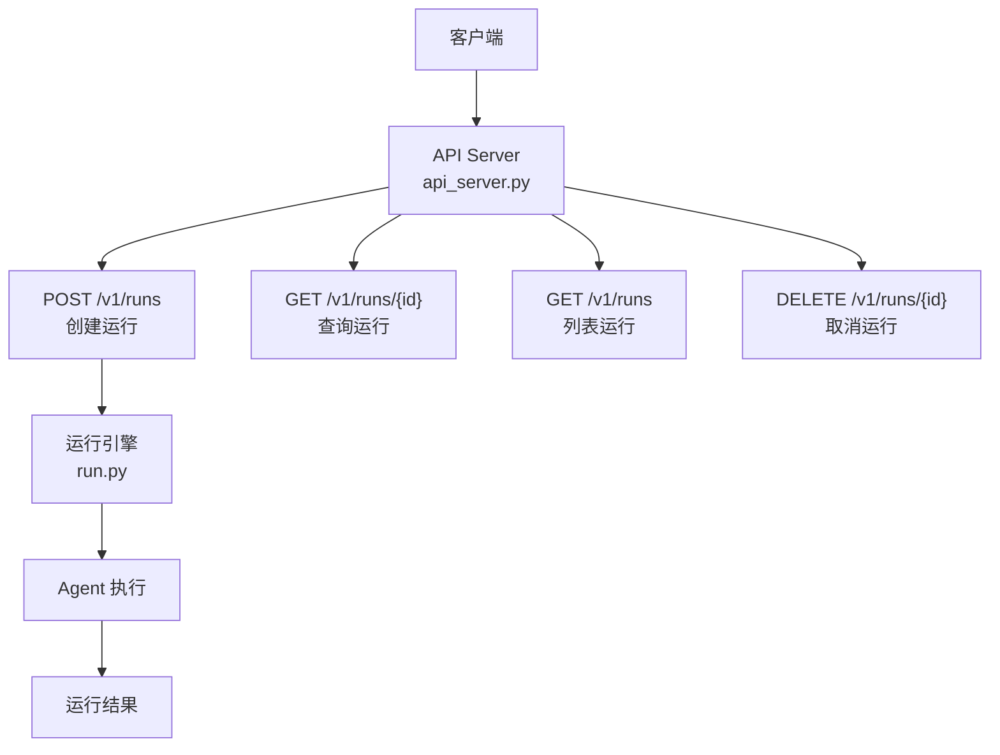
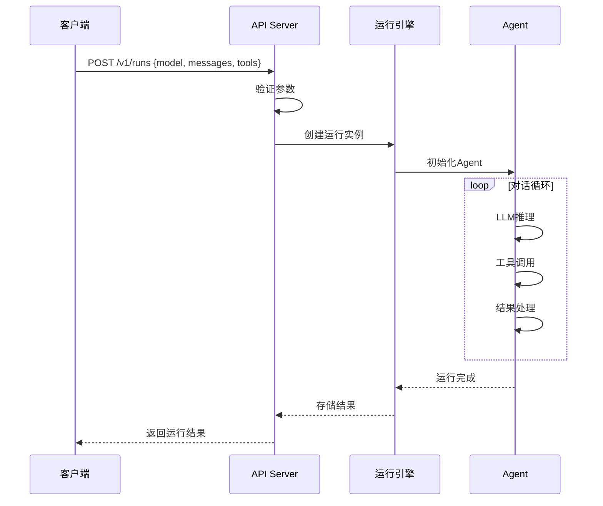

# 运行管理API

<cite>
**本文引用的文件**
- [gateway/platforms/api_server.py](file://gateway/platforms/api_server.py)
- [gateway/run.py](file://gateway/run.py)
</cite>

## 目录
1. [简介](#简介)
2. [项目结构](#项目结构)
3. [核心组件](#核心组件)
4. [架构总览](#架构总览)
5. [详细组件分析](#详细组件分析)
6. [依赖关系分析](#依赖关系分析)
7. [性能考量](#性能考量)
8. [故障排查指南](#故障排查指南)
9. [结论](#结论)

## 简介
本文详细阐述 Hermes Agent 的运行管理 API，即 /v1/runs 端点的完整接口规范。运行管理 API 提供对 Agent 运行实例的创建、查询和控制能力，是网关模式下管理 Agent 执行生命周期的核心接口。

系统支持通过 RESTful API 创建新的运行实例、查询运行状态、获取运行结果，以及取消正在执行的运行。

## 项目结构
运行管理 API 的路由注册在 `gateway/platforms/api_server.py`，运行执行逻辑在 `gateway/run.py`。

## 核心组件
- **运行创建处理器**：POST /v1/runs — 创建新的 Agent 运行实例，接收模型、消息、工具等参数。
- **运行查询处理器**：GET /v1/runs/{run_id} — 查询指定运行的状态和结果。
- **运行列表处理器**：GET /v1/runs — 列出所有运行实例，支持分页和过滤。
- **运行取消处理器**：DELETE /v1/runs/{run_id} — 取消正在执行的运行。
- **ResponseStore**：运行结果的持久化存储，使用 SQLite 数据库。
- **运行引擎**：`gateway/run.py` 中的核心执行逻辑，管理 Agent 的对话循环。

## 架构总览

## 详细组件分析
### 创建运行（POST /v1/runs）
- 请求体包含：model（模型名称）、messages（消息列表）、tools（可用工具列表）。
- 可选参数：temperature、max_tokens、stream（是否流式）、session_id（关联会话）。
- 返回：运行 ID、初始状态和创建时间。

### 查询运行（GET /v1/runs/{run_id}）
- 返回运行的当前状态、已产生的消息、工具调用记录。
- 状态包括：pending、running、completed、failed、cancelled。
- 支持轮询模式，客户端可定期查询直到运行完成。

### 列出运行（GET /v1/runs）
- 支持 limit/offset 分页参数。
- 支持按状态、模型、时间范围过滤。
- 返回总数和分页信息。

### 取消运行（DELETE /v1/runs/{run_id}）
- 取消正在执行的运行，释放相关资源。
- 已完成的运行不可取消。
- 取消后状态变为 cancelled。

## 依赖关系分析
- **API 服务器**：`gateway/platforms/api_server.py` — 路由和处理器
- **运行引擎**：`gateway/run.py` — 核心执行逻辑
- **结果存储**：ResponseStore — SQLite 持久化
- **Agent 核心**：`agent/` — 对话循环和工具执行

## 性能考量
- 运行实例使用惰性初始化，减少创建开销。
- 结果存储使用 SQLite WAL 模式，支持并发读取。
- 长时间运行通过异步执行，不阻塞 API 响应。
- 运行取消使用信号机制，快速释放资源。

## 故障排查指南
- **创建失败**：检查模型名称和消息格式是否正确。
- **查询超时**：确认运行 ID 存在，检查数据库连接。
- **取消无效**：确认运行状态为 running 或 pending。
- **结果缺失**：检查 ResponseStore 数据库完整性。

## 结论
运行管理 API 是 Hermes Agent 网关模式的核心接口，提供了完整的 Agent 运行生命周期管理。通过标准化的 RESTful 接口，客户端可以灵活地创建、监控和控制 Agent 运行实例。

