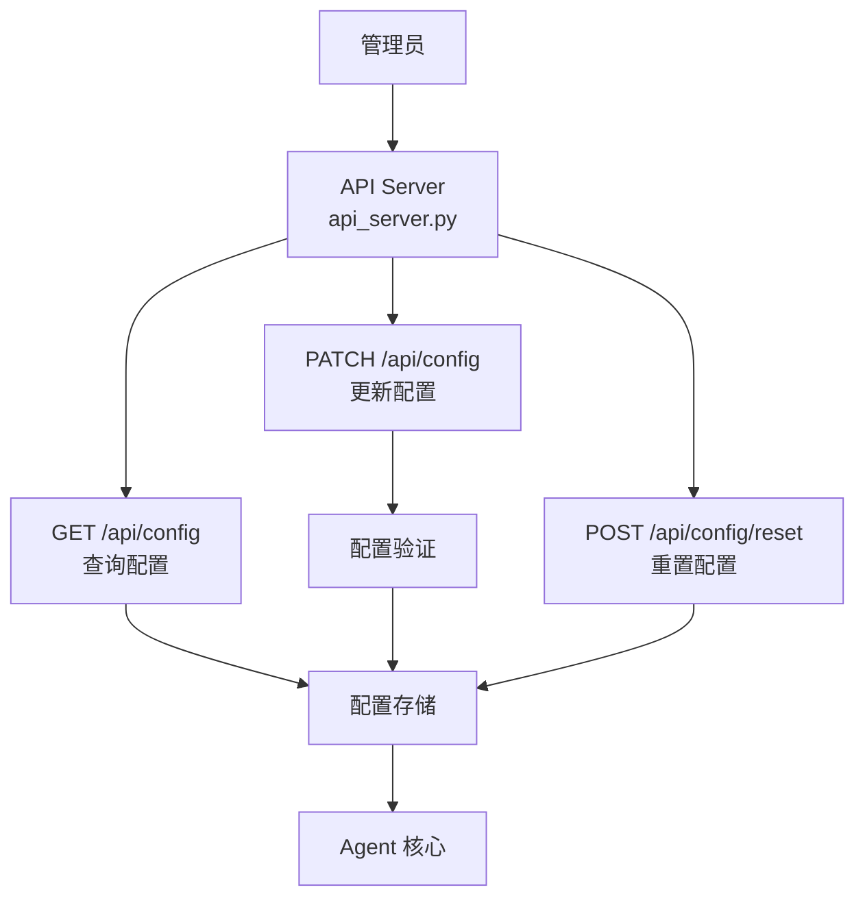
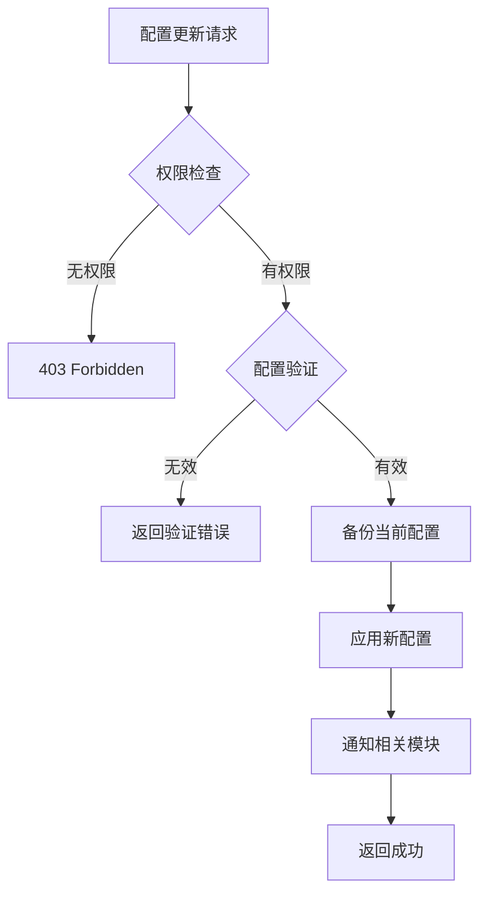

# 配置管理API

<cite>
**本文引用的文件**
- [gateway/platforms/api_server.py](file://gateway/platforms/api_server.py)
- [gateway/config.py](file://gateway/config.py)
</cite>

## 目录
1. [简介](#简介)
2. [项目结构](#项目结构)
3. [核心组件](#核心组件)
4. [架构总览](#架构总览)
5. [详细组件分析](#详细组件分析)
6. [依赖关系分析](#依赖关系分析)
7. [性能考量](#性能考量)
8. [故障排查指南](#故障排查指南)
9. [结论](#结论)

## 简介
本文详细阐述 Sparkii Agent 的配置管理 API，即通过 RESTful 接口查询和修改系统运行时配置的能力。配置管理 API 允许管理员在不重启服务的情况下调整 Agent 行为参数、模型选择、工具启用状态等关键配置。

系统支持配置的热更新、版本管理和回滚机制，确保配置变更的安全性和可追溯性。

## 项目结构
配置管理 API 的路由注册在 `gateway/platforms/api_server.py`，配置存储和管理逻辑分布在多个模块中。

## 核心组件
- **配置查询处理器**：GET /api/config — 获取当前系统配置，支持按模块过滤。
- **配置更新处理器**：PATCH /api/config — 部分更新配置，支持原子性多字段修改。
- **配置重置处理器**：POST /api/config/reset — 将配置恢复到默认值。
- **配置验证器**：在应用配置前验证其合法性，防止无效配置导致系统异常。
- **配置版本管理**：记录每次配置变更的历史，支持回滚到指定版本。

## 架构总览

## 详细组件分析
### 可配置项
- **模型配置**：默认模型、温度参数、最大 token 数。
- **工具配置**：启用/禁用特定工具集、调整工具参数。
- **安全配置**：审批策略、路径白名单、速率限制。
- **会话配置**：会话超时、消息历史长度、上下文窗口。
- **日志配置**：日志级别、输出格式、轮转策略。

### 配置验证规则
- 类型检查：确保配置值符合预期类型。
- 范围检查：数值型配置在允许范围内。
- 依赖检查：某些配置项之间存在依赖关系。
- 安全检查：防止将安全相关配置设为不安全的值。

### 热更新机制
- 配置变更通过事件系统通知相关模块。
- 模块收到通知后自行处理配置变更，无需重启。
- 某些配置（如监听端口）需要重启才能生效，系统会提示。

## 依赖关系分析
- **API 服务器**：`gateway/platforms/api_server.py` — 路由和处理器
- **配置模块**：`gateway/config.py` — 配置管理
- **Agent 配置**：`agent/` — Agent 行为配置

## 性能考量
- 配置读取使用缓存，避免每次请求都访问存储。
- 配置更新使用原子操作，防止中间状态。
- 配置验证在应用前完成，避免回滚开销。
- 配置变更事件使用异步分发，不阻塞 API 响应。

## 故障排查指南
- **配置更新失败**：检查配置值是否通过验证，确认权限足够。
- **配置不生效**：确认配置项支持热更新，检查事件通知是否正常。
- **回滚失败**：确认配置版本历史完整，检查存储状态。

## 结论
配置管理 API 提供了安全、灵活的系统配置管理能力。通过验证机制和版本管理，管理员可以放心地调整系统配置，而热更新机制确保了配置变更的即时生效。

