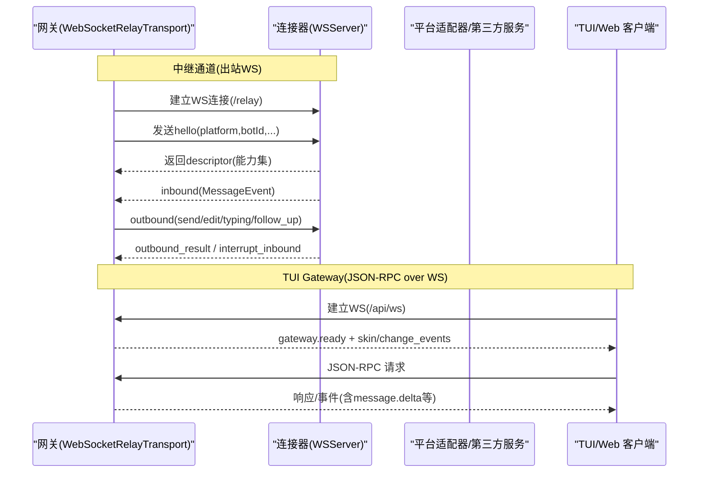
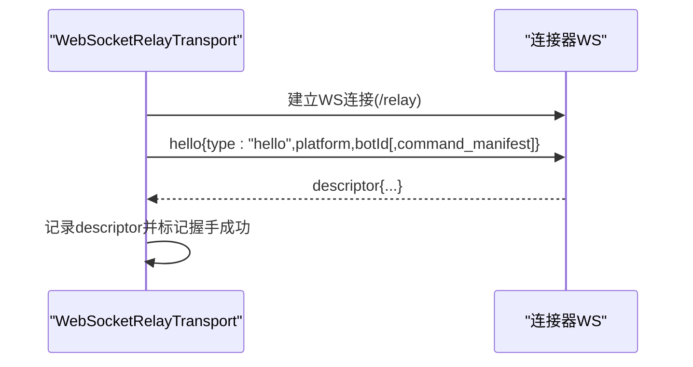
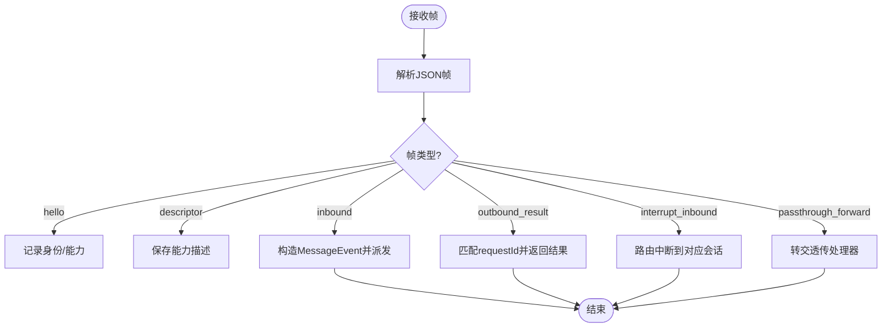
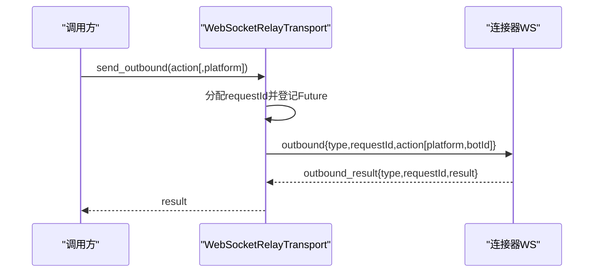
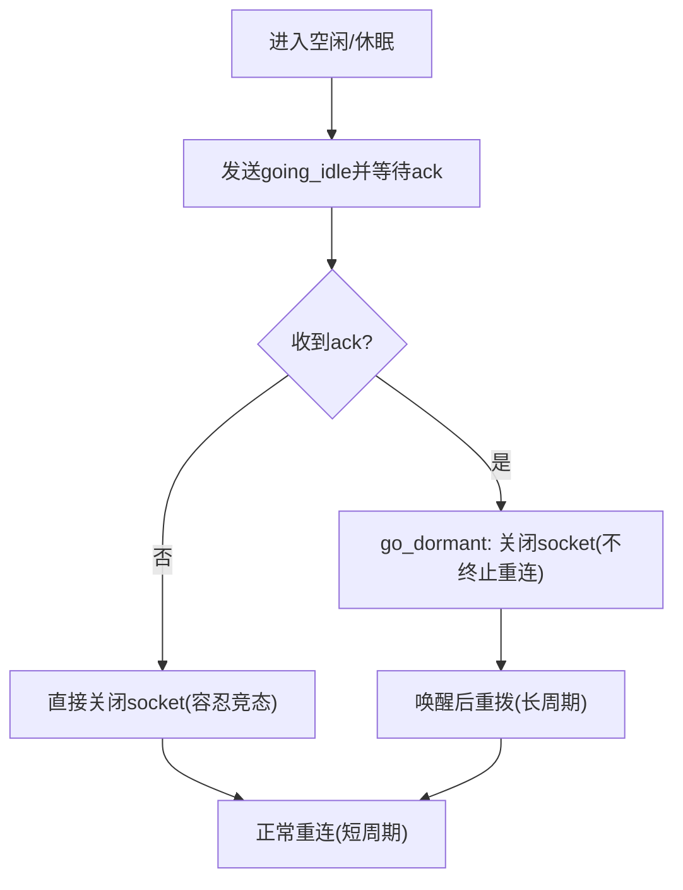
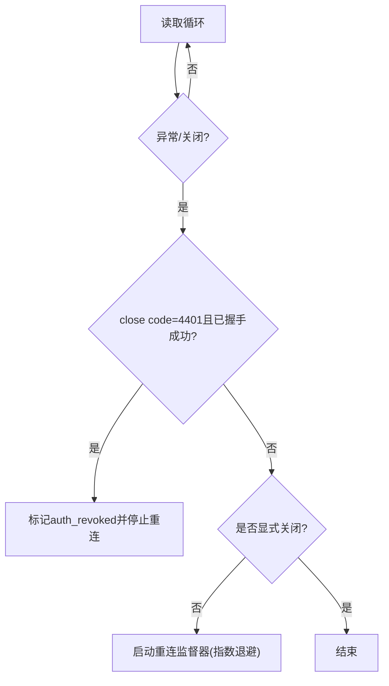
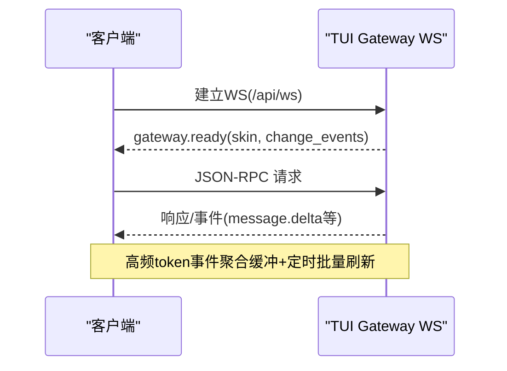
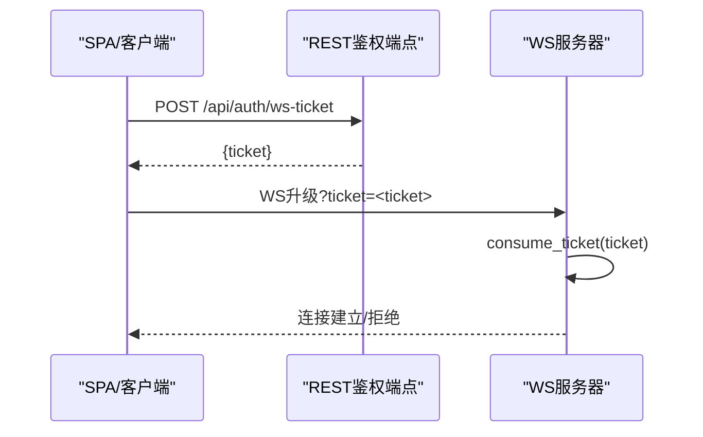
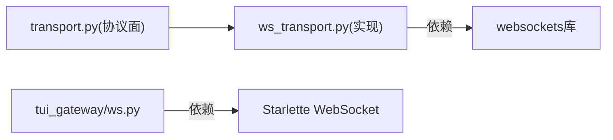

# WebSocket API

<cite>
**本文引用的文件**
- [gateway/relay/ws_transport.py](file://gateway/relay/ws_transport.py)
- [tui_gateway/ws.py](file://tui_gateway/ws.py)
- [sparkii_cli/dashboard_auth/ws_tickets.py](file://sparkii_cli/dashboard_auth/ws_tickets.py)
- [gateway/relay/transport.py](file://gateway/relay/transport.py)
</cite>

## 目录
1. [简介](#简介)
2. [项目结构](#项目结构)
3. [核心组件](#核心组件)
4. [架构总览](#架构总览)
5. [详细组件分析](#详细组件分析)
6. [依赖关系分析](#依赖关系分析)
7. [性能考虑](#性能考虑)
8. [故障排查指南](#故障排查指南)
9. [结论](#结论)
10. [附录：客户端集成示例与最佳实践](#附录客户端集成示例与最佳实践)

## 简介
本文件面向需要接入或维护系统内 WebSocket 能力的开发者，提供端到端的接口说明。内容涵盖两类 WebSocket 通道：
- 网关到连接器（Connector）的出站 WebSocket 中继通道：用于平台消息的入站转发、出站发送、能力协商、空闲缓冲切换与重连等。
- TUI Gateway 的 JSON-RPC over WebSocket：面向桌面/Web 客户端的实时 RPC 通道，支持流式事件聚合与低延迟推送。

文档将详细说明连接建立、握手协议、消息格式、事件类型、连接管理、心跳/空闲机制、重连策略、错误处理、安全认证与授权、以及客户端集成建议与性能优化。

## 项目结构
本仓库中与 WebSocket 相关的关键实现集中在以下模块：
- gateway/relay/ws_transport.py：生产级 WebSocket 中继传输层，负责与连接器建立 WS 连接、握手、帧收发、重连、空闲/休眠模式、鉴权等。
- tui_gateway/ws.py：TUI Gateway 的 WebSocket 传输封装，复用统一调度器，提供 JSON-RPC 双向通信与流式事件聚合。
- sparkii_cli/dashboard_auth/ws_tickets.py：Dashboard 模式下 WS 升级阶段的单用票据与内部凭证机制，解决浏览器无法设置 Authorization 头的问题。
- gateway/relay/transport.py：定义 RelayTransport 协议面（connect/disconnect/handshake/inbound/outbound/go_idle 等），ws_transport.py 为具体实现。

```mermaid
graph TB
subgraph "网关侧"
A["RelayTransport 协议面<br/>transport.py"]
B["WebSocketRelayTransport 实现<br/>ws_transport.py"]
C["TUI Gateway WS 传输<br/>tui_gateway/ws.py"]
end
subgraph "连接器/外部服务"
D["连接器 WebSocket 服务端"]
E["平台适配器/第三方服务"]
end
A --> B
B < --> D
C < --> E
```

图表来源
- [gateway/relay/transport.py:1-144](file://gateway/relay/transport.py#L1-L144)
- [gateway/relay/ws_transport.py:1-120](file://gateway/relay/ws_transport.py#L1-L120)
- [tui_gateway/ws.py:1-60](file://tui_gateway/ws.py#L1-L60)

章节来源
- [gateway/relay/transport.py:1-144](file://gateway/relay/transport.py#L1-L144)
- [gateway/relay/ws_transport.py:1-120](file://gateway/relay/ws_transport.py#L1-L120)
- [tui_gateway/ws.py:1-60](file://tui_gateway/ws.py#L1-L60)

## 核心组件
- WebSocketRelayTransport：基于 websockets 的出站中继传输，负责与连接器建立 WS 连接、发送 hello/descriptor 握手、入站事件解析、出站请求-响应、中断、空闲/休眠切换、自动重连与鉴权。
- WSTransport（TUI Gateway）：对 Starlette WebSocket 的封装，提供线程安全的写路径、流式 token 聚合、Nagle 禁用、错误统计与清理。
- WS 票据与内部凭证：在 Dashboard 门控模式下，通过一次性票据或进程级内部凭证完成 WS 升级认证。

章节来源
- [gateway/relay/ws_transport.py:339-440](file://gateway/relay/ws_transport.py#L339-L440)
- [tui_gateway/ws.py:70-118](file://tui_gateway/ws.py#L70-L118)
- [sparkii_cli/dashboard_auth/ws_tickets.py:1-60](file://sparkii_cli/dashboard_auth/ws_tickets.py#L1-L60)

## 架构总览
下图展示了网关与连接器之间的 WebSocket 中继通道及 TUI Gateway 的 JSON-RPC 通道之间的关系。



图表来源
- [gateway/relay/ws_transport.py:445-485](file://gateway/relay/ws_transport.py#L445-L485)
- [tui_gateway/ws.py:286-337](file://tui_gateway/ws.py#L286-L337)

## 详细组件分析

### 中继通道：连接建立与握手
- 连接目标：连接器挂载于 /relay 的 WebSocketServer；URL 规范化确保 scheme(ws/wss)与路径(/relay)。
- 握手流程：
  - 建立 WS 后启动读取任务。
  - 发送一个或多个 hello（每个 fronted identity 一个），包含 platform、botId，Discord 场景下附带 command_manifest。
  - 等待 descriptor 返回（能力描述），用于后续按平台能力限制（如最大消息长度）。
- 超时与失败：握手与出站均配置超时；握手未完成前调用 handshake() 会报错。



图表来源
- [gateway/relay/ws_transport.py:69-95](file://gateway/relay/ws_transport.py#L69-L95)
- [gateway/relay/ws_transport.py:445-485](file://gateway/relay/ws_transport.py#L445-L485)
- [gateway/relay/ws_transport.py:536-542](file://gateway/relay/ws_transport.py#L536-L542)

章节来源
- [gateway/relay/ws_transport.py:69-95](file://gateway/relay/ws_transport.py#L69-L95)
- [gateway/relay/ws_transport.py:445-485](file://gateway/relay/ws_transport.py#L445-L485)
- [gateway/relay/ws_transport.py:536-542](file://gateway/relay/ws_transport.py#L536-L542)

### 中继通道：消息格式与事件类型
- 帧格式：换行分隔的 JSON 帧。
- 关键帧类型：
  - hello：客户端发起身份声明。
  - descriptor：握手应答，能力描述。
  - inbound：归一化的 MessageEvent（source、text、message_type、reply_to、media_urls、channel_context、prompt_response 等）。
  - outbound/outbound_result：请求-响应对，action 包含 send/edit/typing/follow_up 等语义。
  - interrupt/interrupt_inbound：中断控制。
  - going_idle/going_idle_ack：空闲切换确认。
  - passthrough_forward：透传平面请求（例如 Discord interactions、Twilio 回调）。
- 入站事件映射：连接器以 snake_case 字段下发，传输层将其转换为 MessageEvent 对象，保留平台差异信息（如 Slack 命令标准化、上下文注入、回复上下文等）。



图表来源
- [gateway/relay/ws_transport.py:172-288](file://gateway/relay/ws_transport.py#L172-L288)
- [gateway/relay/ws_transport.py:731-776](file://gateway/relay/ws_transport.py#L731-L776)

章节来源
- [gateway/relay/ws_transport.py:172-288](file://gateway/relay/ws_transport.py#L172-L288)
- [gateway/relay/ws_transport.py:731-776](file://gateway/relay/ws_transport.py#L731-L776)

### 中继通道：出站请求与响应
- 出站动作：send_outbound/send_follow_up/get_chat_info/send_interrupt。
- 请求-响应模型：为每个请求生成 requestId，挂起 Future，收到 outbound_result 时解析并返回。
- 多平台 egress：可携带 platform 与匹配的 botId，连接器据此选择正确的发送端点。



图表来源
- [gateway/relay/ws_transport.py:567-579](file://gateway/relay/ws_transport.py#L567-L579)
- [gateway/relay/ws_transport.py:692-724](file://gateway/relay/ws_transport.py#L692-L724)

章节来源
- [gateway/relay/ws_transport.py:567-579](file://gateway/relay/ws_transport.py#L567-L579)
- [gateway/relay/ws_transport.py:692-724](file://gateway/relay/ws_transport.py#L692-L724)

### 中继通道：空闲/休眠与缓冲翻转
- go_idle：通知连接器切换到“仅缓冲”模式，等待 ack；期间仍保持读循环，避免丢消息。
- go_dormant：用于 scale-to-zero 休眠，先 go_idle，再关闭 socket，但不清理重连监督器；唤醒后以较长周期重拨，连接器在新握手时回放缓冲数据。
- inbound_ack：对已持久化缓冲的入站事件进行确认，保证去重与可靠投递。



图表来源
- [gateway/relay/ws_transport.py:608-633](file://gateway/relay/ws_transport.py#L608-L633)
- [gateway/relay/ws_transport.py:634-679](file://gateway/relay/ws_transport.py#L634-L679)
- [gateway/relay/ws_transport.py:680-691](file://gateway/relay/ws_transport.py#L680-L691)

章节来源
- [gateway/relay/ws_transport.py:608-633](file://gateway/relay/ws_transport.py#L608-L633)
- [gateway/relay/ws_transport.py:634-679](file://gateway/relay/ws_transport.py#L634-L679)
- [gateway/relay/ws_transport.py:680-691](file://gateway/relay/ws_transport.py#L680-L691)

### 中继通道：重连策略与错误处理
- 自动重连：当连接意外关闭且未处于显式断开状态，且未发生“鉴权撤销”，则启动重连监督器，指数退避重拨。
- 鉴权撤销：若握手成功后收到 4401（自定义未授权码），视为凭据被撤销，停止重连并上报“禁用”状态。
- 优雅关闭：disconnect() 取消监督器与读取任务，关闭 socket，并拒绝待处理的出站请求。



图表来源
- [gateway/relay/ws_transport.py:731-776](file://gateway/relay/ws_transport.py#L731-L776)
- [gateway/relay/ws_transport.py:791-800](file://gateway/relay/ws_transport.py#L791-L800)
- [gateway/relay/ws_transport.py:503-535](file://gateway/relay/ws_transport.py#L503-L535)

章节来源
- [gateway/relay/ws_transport.py:731-776](file://gateway/relay/ws_transport.py#L731-L776)
- [gateway/relay/ws_transport.py:791-800](file://gateway/relay/ws_transport.py#L791-L800)
- [gateway/relay/ws_transport.py:503-535](file://gateway/relay/ws_transport.py#L503-L535)

### TUI Gateway：JSON-RPC over WebSocket
- 协议：与 stdio 一致的 JSON-RPC，方向均为换行分隔的 JSON 帧。
- 连接建立：接受连接后立即发送 gateway.ready（含皮肤与变更事件开关），随后进入请求-响应循环。
- 流式事件聚合：高频 token 类事件（message.delta、reasoning.delta、thinking.delta）会被合并缓冲并在短时间窗口批量刷新，降低事件循环开销。
- 写入安全：write() 可从工作线程安全调用；write_async() 从事件循环线程等待写出完成。
- 网络优化：禁用 Nagle 以保证流式帧的低延迟。



图表来源
- [tui_gateway/ws.py:286-337](file://tui_gateway/ws.py#L286-L337)
- [tui_gateway/ws.py:44-61](file://tui_gateway/ws.py#L44-L61)
- [tui_gateway/ws.py:118-188](file://tui_gateway/ws.py#L118-L188)
- [tui_gateway/ws.py:268-284](file://tui_gateway/ws.py#L268-L284)

章节来源
- [tui_gateway/ws.py:286-337](file://tui_gateway/ws.py#L286-L337)
- [tui_gateway/ws.py:44-61](file://tui_gateway/ws.py#L44-L61)
- [tui_gateway/ws.py:118-188](file://tui_gateway/ws.py#L118-L188)
- [tui_gateway/ws.py:268-284](file://tui_gateway/ws.py#L268-L284)

### 安全：WS 升级认证与授权
- 中继通道鉴权：可选地通过 Authorization: Bearer 令牌（由 per-gateway secret 签名）在 WS 升级阶段认证；连接器校验失败将关闭连接（4401）。
- Dashboard 门控模式：浏览器无法设置 Authorization 头，因此采用一次性 ticket（30s TTL）或进程级内部凭证（长期有效，仅限内部子进程使用）进行 WS 升级认证。
- 权限边界：连接器作为信任边界，已对透传请求进行验证与清洗；Gateway 侧仅消费可信信号。



图表来源
- [sparkii_cli/dashboard_auth/ws_tickets.py:1-60](file://sparkii_cli/dashboard_auth/ws_tickets.py#L1-L60)
- [sparkii_cli/dashboard_auth/ws_tickets.py:62-99](file://sparkii_cli/dashboard_auth/ws_tickets.py#L62-L99)
- [sparkii_cli/dashboard_auth/ws_tickets.py:110-153](file://sparkii_cli/dashboard_auth/ws_tickets.py#L110-L153)

章节来源
- [sparkii_cli/dashboard_auth/ws_tickets.py:1-60](file://sparkii_cli/dashboard_auth/ws_tickets.py#L1-L60)
- [sparkii_cli/dashboard_auth/ws_tickets.py:62-99](file://sparkii_cli/dashboard_auth/ws_tickets.py#L62-L99)
- [sparkii_cli/dashboard_auth/ws_tickets.py:110-153](file://sparkii_cli/dashboard_auth/ws_tickets.py#L110-L153)

## 依赖关系分析
- transport.py 定义了 RelayTransport 协议面，ws_transport.py 提供具体实现；二者解耦便于测试与替换。
- ws_transport.py 依赖 websockets 库（可选依赖），在缺失时抛出明确错误。
- tui_gateway/ws.py 依赖 Starlette 的 WebSocket 抽象，兼容不同部署环境。



图表来源
- [gateway/relay/transport.py:1-144](file://gateway/relay/transport.py#L1-L144)
- [gateway/relay/ws_transport.py:46-51](file://gateway/relay/ws_transport.py#L46-L51)
- [tui_gateway/ws.py:62-68](file://tui_gateway/ws.py#L62-L68)

章节来源
- [gateway/relay/transport.py:1-144](file://gateway/relay/transport.py#L1-L144)
- [gateway/relay/ws_transport.py:46-51](file://gateway/relay/ws_transport.py#L46-L51)
- [tui_gateway/ws.py:62-68](file://tui_gateway/ws.py#L62-L68)

## 性能考虑
- 流式事件聚合：TUI Gateway 将高频 token 事件（message.delta、reasoning.delta、thinking.delta）在短时窗口内聚合批量发送，减少事件循环唤醒次数。
- 网络优化：禁用 Nagle 以避免小帧被内核合并，保障 GUI/WS 的实时性。
- 超时与背压：中继通道对握手与出站设置超时；重连采用指数退避，避免雪崩。
- 资源释放：disconnect()/go_dormant() 严格控制任务取消与 socket 关闭，防止悬挂 Future 与资源泄漏。

章节来源
- [tui_gateway/ws.py:44-61](file://tui_gateway/ws.py#L44-L61)
- [tui_gateway/ws.py:268-284](file://tui_gateway/ws.py#L268-L284)
- [gateway/relay/ws_transport.py:53-59](file://gateway/relay/ws_transport.py#L53-L59)
- [gateway/relay/ws_transport.py:791-800](file://gateway/relay/ws_transport.py#L791-L800)

## 故障排查指南
- 握手失败：检查 URL 规范化是否正确（scheme 与 /relay 路径），确认连接器可用；关注握手超时。
- 鉴权失败：若出现 4401 且已握手成功，表示凭据被撤销，需重新配置或重建实例；冷启动阶段的 4401 可能为竞态，可重试。
- 出站超时：检查 outbound 请求是否携带正确的 platform/botId 标签；确认连接器在线且能力匹配。
- 流式卡顿：观察 TUI Gateway 的 write 慢日志与 send 失败计数；必要时调整聚合时间或检查事件循环阻塞。
- 连接抖动：查看重连日志与 close code；区分意外关闭与显式关闭；确认 go_idle/go_dormant 的使用是否符合预期。

章节来源
- [gateway/relay/ws_transport.py:536-542](file://gateway/relay/ws_transport.py#L536-L542)
- [gateway/relay/ws_transport.py:731-776](file://gateway/relay/ws_transport.py#L731-L776)
- [tui_gateway/ws.py:165-188](file://tui_gateway/ws.py#L165-L188)
- [tui_gateway/ws.py:429-477](file://tui_gateway/ws.py#L429-L477)

## 结论
本系统提供了两套 WebSocket 能力：面向连接器的高可靠中继通道（具备能力协商、缓冲翻转、自动重连与鉴权），以及面向客户端的 JSON-RPC 实时通道（具备流式聚合与低延迟）。通过清晰的协议面与实现分离、完善的错误与重连策略、以及严格的安全认证机制，系统可在多种部署环境下稳定运行。

## 附录：客户端集成示例与最佳实践

### 中继通道（连接器）客户端要点
- 连接与握手：
  - 连接到 /relay 路径，发送 hello（platform、botId），等待 descriptor。
  - 如需鉴权，在 WS 升级时携带 Authorization: Bearer 令牌。
- 消息收发：
  - 入站：解析 inbound 帧，映射为 MessageEvent。
  - 出站：发送 outbound 帧，等待 outbound_result；必要时携带 platform/botId。
- 生命周期：
  - 使用 go_idle/go_dormant 配合缓冲翻转，确保停机/恢复时的可靠性。
  - 启用自动重连，注意 4401 后的终止策略。

参考路径
- [gateway/relay/ws_transport.py:69-95](file://gateway/relay/ws_transport.py#L69-L95)
- [gateway/relay/ws_transport.py:445-485](file://gateway/relay/ws_transport.py#L445-L485)
- [gateway/relay/ws_transport.py:608-679](file://gateway/relay/ws_transport.py#L608-L679)
- [gateway/relay/ws_transport.py:692-724](file://gateway/relay/ws_transport.py#L692-L724)

### TUI Gateway 客户端要点
- 连接：
  - 建立 WS 到 /api/ws，接收 gateway.ready 后再发起业务请求。
- 消息格式：
  - 使用 JSON-RPC 2.0，方法名与参数遵循服务端约定；事件类型为 message.delta、reasoning.delta、thinking.delta 等。
- 性能：
  - 客户端无需特殊处理聚合逻辑，服务端已批量发送；保持连接稳定以获得最佳体验。

参考路径
- [tui_gateway/ws.py:286-337](file://tui_gateway/ws.py#L286-L337)
- [tui_gateway/ws.py:44-61](file://tui_gateway/ws.py#L44-L61)

### 安全与认证
- 浏览器侧：
  - 通过 REST 获取一次性 ticket，WS 升级时以查询参数传递。
- 内部进程：
  - 使用进程级内部凭证，仅在受控环境内传播，避免泄露。
- 中继通道：
  - 使用 per-gateway secret 签名的 Bearer 令牌进行 WS 升级认证。

参考路径
- [sparkii_cli/dashboard_auth/ws_tickets.py:62-99](file://sparkii_cli/dashboard_auth/ws_tickets.py#L62-L99)
- [sparkii_cli/dashboard_auth/ws_tickets.py:110-153](file://sparkii_cli/dashboard_auth/ws_tickets.py#L110-L153)
- [gateway/relay/ws_transport.py:486-501](file://gateway/relay/ws_transport.py#L486-L501)

### 序列化、压缩与优化建议
- 序列化：所有帧均为 JSON 文本，换行分隔；避免额外包装，减少解析开销。
- 压缩：当前实现未内置应用层压缩；若带宽受限，建议在网关前置 TLS 压缩或网络层优化。
- 性能：
  - 合理设置超时与重连退避，避免风暴。
  - 使用 go_idle/go_dormant 配合平台 suspend 机制，降低空闲负载。
  - 对于高吞吐场景，关注事件聚合与网络栈（如 Nagle）的影响。

章节来源
- [tui_gateway/ws.py:44-61](file://tui_gateway/ws.py#L44-L61)
- [tui_gateway/ws.py:268-284](file://tui_gateway/ws.py#L268-L284)
- [gateway/relay/ws_transport.py:53-59](file://gateway/relay/ws_transport.py#L53-L59)
- [gateway/relay/ws_transport.py:608-679](file://gateway/relay/ws_transport.py#L608-L679)