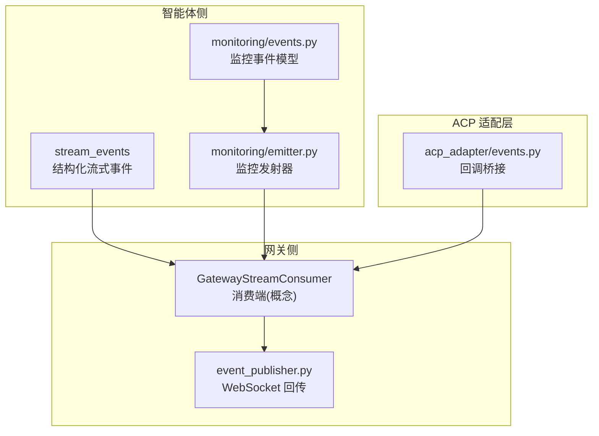
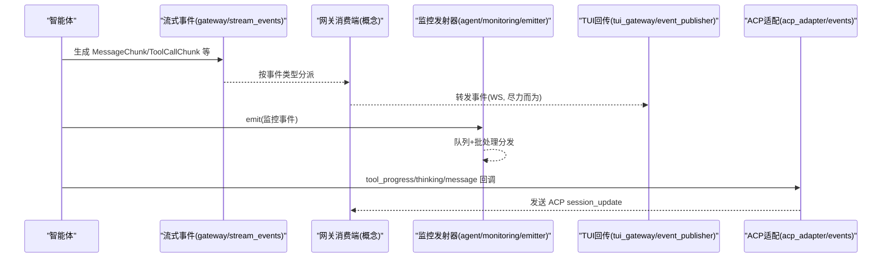
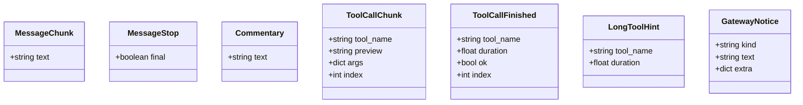
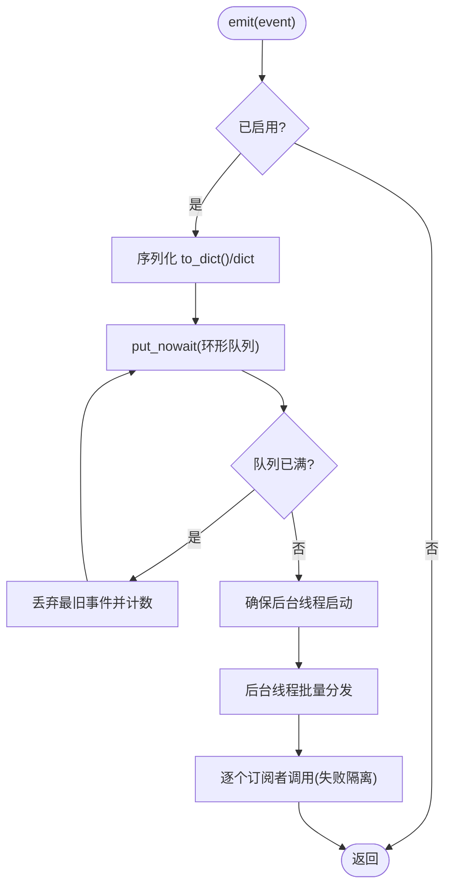
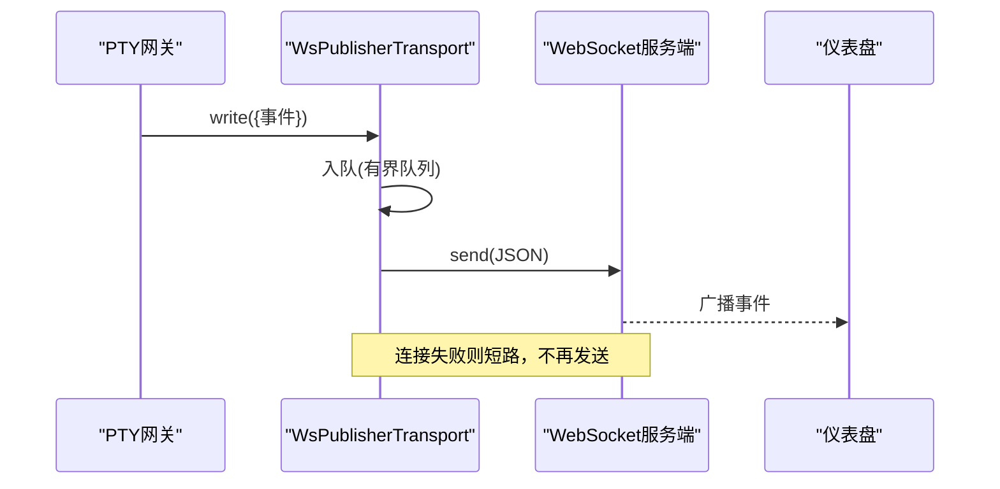
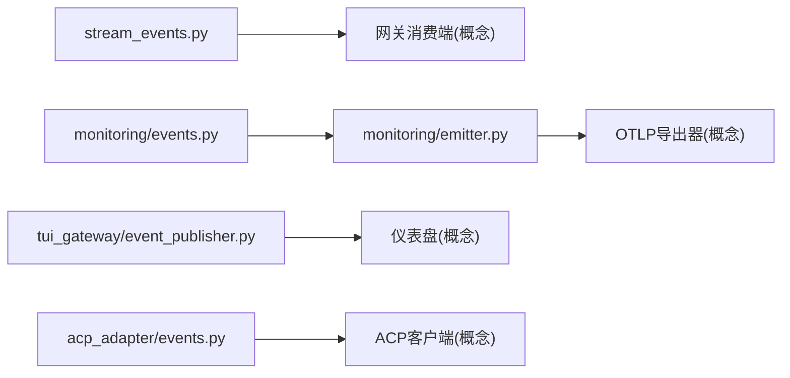

# 事件系统

<cite>
**本文引用的文件**
- [gateway/stream_events.py](file://gateway/stream_events.py)
- [agent/monitoring/events.py](file://agent/monitoring/events.py)
- [agent/monitoring/emitter.py](file://agent/monitoring/emitter.py)
- [tui_gateway/event_publisher.py](file://tui_gateway/event_publisher.py)
- [acp_adapter/events.py](file://acp_adapter/events.py)
</cite>

## 目录
1. [简介](#简介)
2. [项目结构](#项目结构)
3. [核心组件](#核心组件)
4. [架构总览](#架构总览)
5. [详细组件分析](#详细组件分析)
6. [依赖关系分析](#依赖关系分析)
7. [性能考量](#性能考量)
8. [故障排查指南](#故障排查指南)
9. [结论](#结论)
10. [附录](#附录)

## 简介
本文件系统化梳理本项目的事件体系，覆盖事件定义、发布与订阅机制、内置事件类型（会话流式事件、工具执行事件、网关监控与生命周期事件等）、数据结构与元数据字段、扩展机制、监听器实现示例（含异步处理与错误恢复）、事件持久化与回溯查询策略、性能优化方法，以及事件驱动架构的最佳实践与调试监控手段。目标是帮助开发者以最小成本理解并安全扩展事件系统。

## 项目结构
围绕事件系统的代码主要分布在以下模块：
- gateway/stream_events.py：定义“结构化流式事件”的契约，描述消息增量、工具调用、网关控制等事件形态，作为智能体到网关的交付约定。
- agent/monitoring/events.py：定义网关监控平面事件（健康快照、诊断、定时任务执行），用于可观测性。
- agent/monitoring/emitter.py：提供高性能、非阻塞的监控事件发射器，负责队列、批处理分发与订阅者隔离。
- tui_gateway/event_publisher.py：将 PTY 侧网关产生的事件通过 WebSocket 回传到仪表盘，采用“尽力而为”的背压与失败短路策略。
- acp_adapter/events.py：将 AIAgent 回调桥接到 ACP 通知，包含工具进度、思考文本、步骤完成、消息流式更新等。



图表来源
- [gateway/stream_events.py:1-172](file://gateway/stream_events.py#L1-L172)
- [agent/monitoring/events.py:1-87](file://agent/monitoring/events.py#L1-L87)
- [agent/monitoring/emitter.py:1-212](file://agent/monitoring/emitter.py#L1-L212)
- [tui_gateway/event_publisher.py:1-127](file://tui_gateway/event_publisher.py#L1-L127)
- [acp_adapter/events.py:1-280](file://acp_adapter/events.py#L1-L280)

章节来源
- [gateway/stream_events.py:1-172](file://gateway/stream_events.py#L1-L172)
- [agent/monitoring/events.py:1-87](file://agent/monitoring/events.py#L1-L87)
- [agent/monitoring/emitter.py:1-212](file://agent/monitoring/emitter.py#L1-L212)
- [tui_gateway/event_publisher.py:1-127](file://tui_gateway/event_publisher.py#L1-L127)
- [acp_adapter/events.py:1-280](file://acp_adapter/events.py#L1-L280)

## 核心组件
- 结构化流式事件（gateway/stream_events.py）
  - 目的：定义“发生了什么”，不绑定具体平台渲染或传输细节；由网关决定如何呈现。
  - 关键事件：消息增量、消息停止、评论片段、工具调用开始/结束、长工具提示、网关通知。
  - 设计约束：事件仅描述传输层，不进入对话历史；向后兼容；轻量不可变数据类。
- 监控事件（agent/monitoring/events.py）
  - 目的：面向运维的可观测性事件，不含敏感内容。
  - 关键事件：网关健康快照、诊断事件、定时任务执行投影。
  - 字段：统一包含时间戳纳秒级字段，便于排序与回溯。
- 监控发射器（agent/monitoring/emitter.py）
  - 目的：高吞吐、非阻塞的事件发射与分发；保证热路径永不阻塞、永不抛异常。
  - 机制：环形缓冲队列 + 后台调度线程 + 批量分发；订阅者失败隔离；支持统计与关闭。
- TUI 事件回传（tui_gateway/event_publisher.py）
  - 目的：将 PTY 侧网关事件通过 WebSocket 推送至仪表盘。
  - 机制：线程工作器 + 有界队列 + 失败短路；写操作返回布尔表示是否入队成功。
- ACP 适配器事件（acp_adapter/events.py）
  - 目的：将 AIAgent 的回调转换为 ACP 客户端通知（工具开始/完成、思考文本、步骤推进、消息流）。
  - 机制：跨线程安全调度；维护工具调用 ID 队列与元数据；可选自动审批编辑差异。

章节来源
- [gateway/stream_events.py:1-172](file://gateway/stream_events.py#L1-L172)
- [agent/monitoring/events.py:1-87](file://agent/monitoring/events.py#L1-L87)
- [agent/monitoring/emitter.py:1-212](file://agent/monitoring/emitter.py#L1-L212)
- [tui_gateway/event_publisher.py:1-127](file://tui_gateway/event_publisher.py#L1-L127)
- [acp_adapter/events.py:1-280](file://acp_adapter/events.py#L1-L280)

## 架构总览
事件系统遵循“生产者-消费者”解耦模式：
- 智能体产生结构化流式事件，交给网关消费端进行平台适配与呈现。
- 监控事件通过发射器以非阻塞方式投递给 OTLP 等导出器。
- TUI 侧通过 WebSocket 将事件回传给仪表盘。
- ACP 适配层将内部回调桥接为 ACP 协议通知。



图表来源
- [gateway/stream_events.py:1-172](file://gateway/stream_events.py#L1-L172)
- [agent/monitoring/emitter.py:1-212](file://agent/monitoring/emitter.py#L1-L212)
- [tui_gateway/event_publisher.py:1-127](file://tui_gateway/event_publisher.py#L1-L127)
- [acp_adapter/events.py:1-280](file://acp_adapter/events.py#L1-L280)

## 详细组件分析

### 结构化流式事件（gateway/stream_events.py）
- 事件类型与职责
  - 消息增量：携带增量文本，供消费端累积渲染。
  - 消息停止：标记一段连续文本结束，final 指示整轮是否结束。
  - 评论片段：在工具迭代之间出现的完整中间消息。
  - 工具调用开始：携带工具名、参数预览与完整参数，索引用于关联完成事件。
  - 工具调用完成：携带耗时与成功标志，用于清理进度气泡与引导提示。
  - 长工具提示：一次性提示，建议用户切换更详细视图。
  - 网关通知：网关侧控制消息（重启、在线、长运行提示等）。
- 设计要点
  - 不可变数据类，构造成本低，适合跨线程传递。
  - 事件不包含上下文信息，仅描述传输层变化；历史由智能体维护。
  - 向后兼容：网关默认行为保持原有表现，平台适配器可选择增强。



图表来源
- [gateway/stream_events.py:41-159](file://gateway/stream_events.py#L41-L159)

章节来源
- [gateway/stream_events.py:1-172](file://gateway/stream_events.py#L1-L172)

### 监控事件与发射器（agent/monitoring/events.py, agent/monitoring/emitter.py）
- 事件模型
  - 网关健康事件：包含进程状态、活跃代理数、平台计数、版本信息等。
  - 诊断事件：子系统、错误分类、严重级别、来源日志等。
  - 定时任务执行事件：状态、作业键、耗时、投递结果等。
  - 所有事件均包含纳秒级时间戳，便于时序分析与回溯。
- 发射器特性
  - 热路径不变量：emit() 微秒级返回，不阻塞、不抛异常。
  - 环形缓冲：满队列时丢弃最旧事件，保证内存上限。
  - 批量分发：后台线程按批次投递给订阅者，提升吞吐。
  - 订阅者隔离：任一订阅者异常不影响其他订阅者与热路径。
  - 统计与关闭：提供 flush、stats、close 等能力。



图表来源
- [agent/monitoring/emitter.py:53-116](file://agent/monitoring/emitter.py#L53-L116)
- [agent/monitoring/events.py:19-80](file://agent/monitoring/events.py#L19-L80)

章节来源
- [agent/monitoring/events.py:1-87](file://agent/monitoring/events.py#L1-L87)
- [agent/monitoring/emitter.py:1-212](file://agent/monitoring/emitter.py#L1-L212)

### TUI 事件回传（tui_gateway/event_publisher.py）
- 作用：将 PTY 侧网关产生的事件通过 WebSocket 回传给仪表盘。
- 机制：
  - 线程工作器从有界队列取出 JSON 字符串并发送。
  - 连接失败或写入异常会短路后续发送，避免阻塞主循环。
  - write() 返回布尔值，表示是否成功入队。
- 适用场景：仪表盘侧边栏实时展示工具、推理、状态事件。



图表来源
- [tui_gateway/event_publisher.py:40-127](file://tui_gateway/event_publisher.py#L40-L127)

章节来源
- [tui_gateway/event_publisher.py:1-127](file://tui_gateway/event_publisher.py#L1-L127)

### ACP 适配器事件（acp_adapter/events.py）
- 作用：将 AIAgent 的回调转换为 ACP 客户端通知，包括工具进度、思考文本、步骤完成、消息流式更新。
- 关键点：
  - 工具进度：为每个同名工具维护 FIFO 队列，确保并行调用正确匹配完成事件。
  - 编辑快照：对特定工具捕获本地编辑快照，配合自动审批策略生成差异。
  - 计划更新：将 todo 工具结果映射为 ACP 原生计划更新，便于编辑器渲染任务面板。
  - 跨线程安全：使用安全调度将 session_update 发送到主事件循环。

```mermaid
sequenceDiagram
participant Agent as "AIAgent"
participant Adapter as "acp_adapter/events"
participant Client as "ACP客户端"
participant Loop as "主事件循环"
Agent->>Adapter : tool_progress("tool.started", name, args)
Adapter->>Adapter : 生成tc_id并记录元数据
Adapter->>Client : session_update(tool_start)
Agent->>Adapter : step(prev_tools)
Adapter->>Adapter : 弹出对应tc_id并构建完成事件
Adapter->>Client : session_update(tool_complete)
Adapter->>Loop : 安全调度发送
```

图表来源
- [acp_adapter/events.py:114-259](file://acp_adapter/events.py#L114-L259)

章节来源
- [acp_adapter/events.py:1-280](file://acp_adapter/events.py#L1-L280)

## 依赖关系分析
- 耦合与内聚
  - 流式事件与平台渲染解耦：事件只描述“发生了什么”，渲染由网关适配器决定，降低耦合度。
  - 监控事件与导出器解耦：发射器仅负责投递，OTLP 等导出器作为订阅者独立实现。
  - TUI 回传与主流程解耦：WebSocket 失败短路，不影响主循环。
  - ACP 适配与 AIAgent 回调解耦：通过工厂函数封装回调逻辑，便于替换与测试。
- 外部依赖
  - ACP 协议对象（如 PlanEntry、AgentPlanUpdate）用于编辑器集成。
  - websockets 用于 TUI 回传。
  - asyncio 用于跨线程安全调度。



图表来源
- [gateway/stream_events.py:1-172](file://gateway/stream_events.py#L1-L172)
- [agent/monitoring/events.py:1-87](file://agent/monitoring/events.py#L1-L87)
- [agent/monitoring/emitter.py:1-212](file://agent/monitoring/emitter.py#L1-L212)
- [tui_gateway/event_publisher.py:1-127](file://tui_gateway/event_publisher.py#L1-L127)
- [acp_adapter/events.py:1-280](file://acp_adapter/events.py#L1-L280)

章节来源
- [gateway/stream_events.py:1-172](file://gateway/stream_events.py#L1-L172)
- [agent/monitoring/events.py:1-87](file://agent/monitoring/events.py#L1-L87)
- [agent/monitoring/emitter.py:1-212](file://agent/monitoring/emitter.py#L1-L212)
- [tui_gateway/event_publisher.py:1-127](file://tui_gateway/event_publisher.py#L1-L127)
- [acp_adapter/events.py:1-280](file://acp_adapter/events.py#L1-L280)

## 性能考量
- 非阻塞发射：监控发射器保证 emit() 微秒级返回，队列满时丢弃最旧事件，避免阻塞主循环。
- 批量分发：后台线程按批次投递订阅者，减少上下文切换与锁竞争。
- 失败隔离：订阅者异常被捕获并记录，不影响其他订阅者与热路径。
- 背压与短路：TUI 回传使用有界队列，连接失败短路，防止堆积与阻塞。
- 跨线程安全：ACP 适配使用安全调度将 session_update 发送到主事件循环，避免竞态。
- 事件不可变性：流式事件使用冻结数据类，构造成本低且线程安全。

[本节为通用性能指导，无需特定文件引用]

## 故障排查指南
- 监控事件丢失
  - 检查发射器是否启用（首次订阅才激活），查看 stats 中的 dropped 与 queued 指标。
  - 确认订阅者是否抛出异常导致中断；发射器会记录失败但继续运行。
- TUI 事件未显示
  - 检查 WebSocket 连接是否建立成功；write() 返回 False 表示入队失败或连接死亡。
  - 查看日志中“event publisher connect failed”与“event publisher write failed”。
- ACP 通知错配
  - 确认同名工具的 FIFO 队列是否正确维护；检查工具完成事件中 tc_id 是否匹配开始事件。
  - 若 todo 工具结果无法解析为计划更新，检查 JSON 结构与状态映射。
- 流式事件渲染异常
  - 确认消费端对 MessageStop.final 的处理逻辑；区分中间停止与最终停止。
  - 检查 ToolCallChunk.index 是否与 ToolCallFinished.index 一致，避免错配。

章节来源
- [agent/monitoring/emitter.py:118-164](file://agent/monitoring/emitter.py#L118-L164)
- [tui_gateway/event_publisher.py:72-127](file://tui_gateway/event_publisher.py#L72-L127)
- [acp_adapter/events.py:114-259](file://acp_adapter/events.py#L114-L259)
- [gateway/stream_events.py:55-117](file://gateway/stream_events.py#L55-L117)

## 结论
本事件系统通过清晰的契约与分层设计，实现了智能体流式输出、监控可观测性与多端回传的解耦。其核心优势在于：
- 事件与渲染/传输解耦，便于平台适配与向后兼容。
- 监控事件高吞吐、非阻塞，保障主流程稳定性。
- 多通道回传具备背压与失败短路，提升鲁棒性。
- ACP 适配层提供丰富的编辑器集成能力。
建议在生产环境中结合指标与日志持续观察队列深度、丢弃率与订阅者健康度，并根据平台能力定制渲染策略。

[本节为总结性内容，无需特定文件引用]

## 附录

### 事件数据结构与元数据字段
- 流式事件关键字段
  - 消息增量：text
  - 消息停止：final
  - 工具调用开始：tool_name、preview、args、index
  - 工具调用完成：tool_name、duration、ok、index
  - 网关通知：kind、text、extra
- 监控事件关键字段
  - 健康事件：name、gateway_state、active_agents、platform_count、version、ts_ns
  - 诊断事件：subsystem、error_class、severity、source_logger、ts_ns
  - 定时任务事件：status、job_key、duration_ms、delivery_outcome、ts_ns

章节来源
- [gateway/stream_events.py:41-159](file://gateway/stream_events.py#L41-L159)
- [agent/monitoring/events.py:19-80](file://agent/monitoring/events.py#L19-L80)

### 事件监听器实现示例（思路）
- 监控事件监听
  - 注册订阅者：接收批量事件列表，逐条处理（落盘、聚合指标、告警）。
  - 异步处理：在订阅者内部使用异步任务或线程池处理重负载逻辑。
  - 错误恢复：捕获异常并记录，必要时重试或降级。
- TUI 事件监听
  - 订阅 WebSocket 消息，解析 JSON 后更新 UI。
  - 断线重连：检测连接状态并尝试重建连接。
- ACP 事件监听
  - 订阅 session_update，根据类型更新编辑器面板（工具进度、计划任务、消息流）。
  - 跨线程安全：在主事件循环中处理 UI 更新。

[本节为概念性示例，无需特定文件引用]

### 事件持久化、回溯查询与性能优化策略
- 持久化
  - 流式事件不进入对话历史，如需持久化应在网关消费端另行落盘。
  - 监控事件可通过 OTLP 导出至后端存储，支持时序查询。
- 回溯查询
  - 基于 ts_ns 字段进行时间范围过滤与排序。
  - 结合 job_key、tool_name 等维度进行索引与聚合。
- 性能优化
  - 合理设置队列大小与批大小，平衡延迟与吞吐。
  - 对高频事件进行采样或合并。
  - 避免在热路径中进行 I/O 或复杂计算。

[本节为通用策略，无需特定文件引用]

### 事件驱动架构最佳实践与设计模式
- 生产者-消费者模式：解耦事件生产与消费，提升可扩展性。
- 事件溯源：保留必要元数据（时间戳、ID、上下文键），便于审计与回放。
- 幂等处理：消费者应能容忍重复事件，基于 ID 去重。
- 优雅降级：当下游不可用时，快速失败并记录，不阻塞上游。
- 配置化路由：根据事件类型或标签路由到不同处理器。

[本节为通用实践，无需特定文件引用]

### 调试与监控工具与方法
- 指标采集
  - 使用发射器的 stats() 获取队列长度、分发数量、丢弃数量与订阅者数量。
  - 在 TUI 回传中记录连接状态与发送失败次数。
- 日志记录
  - 记录关键事件的路径与异常堆栈，便于定位问题。
  - 对跨线程调度失败进行调试输出。
- 可视化
  - 仪表盘展示实时事件流，辅助定位卡顿与丢包。
  - 结合 OTLP 指标进行趋势分析与告警。

章节来源
- [agent/monitoring/emitter.py:152-164](file://agent/monitoring/emitter.py#L152-L164)
- [tui_gateway/event_publisher.py:72-127](file://tui_gateway/event_publisher.py#L72-L127)
- [acp_adapter/events.py:87-108](file://acp_adapter/events.py#L87-L108)