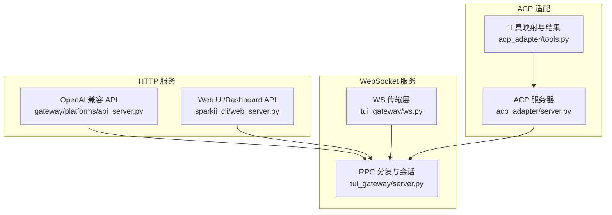
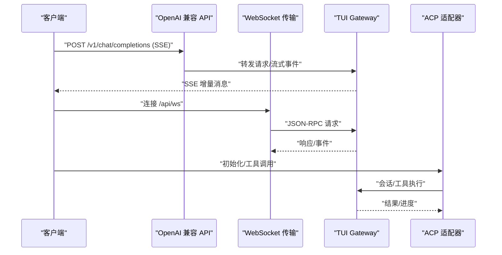
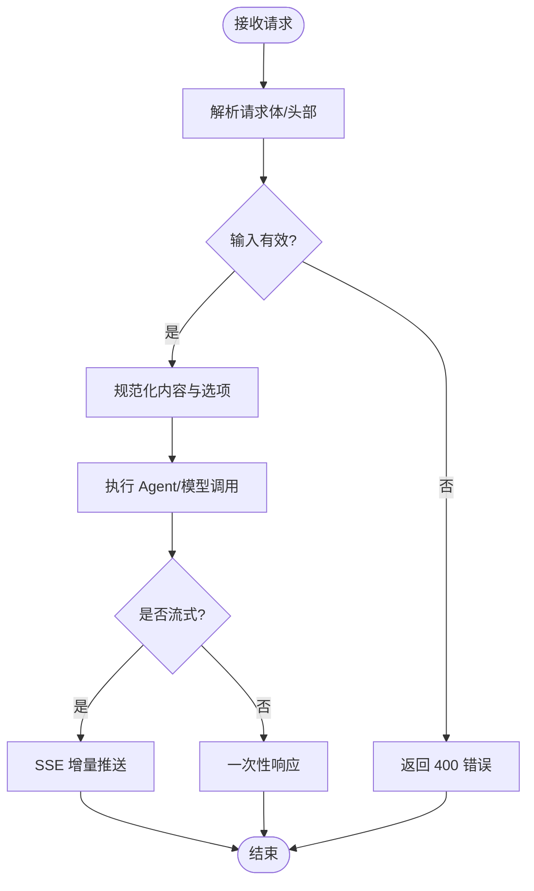
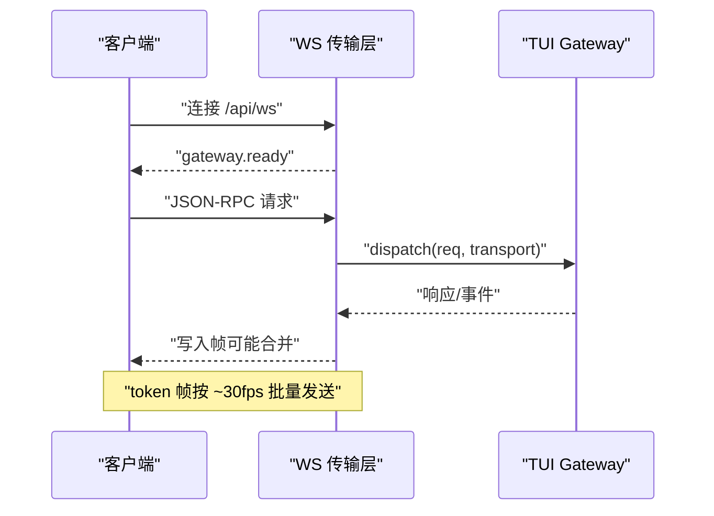
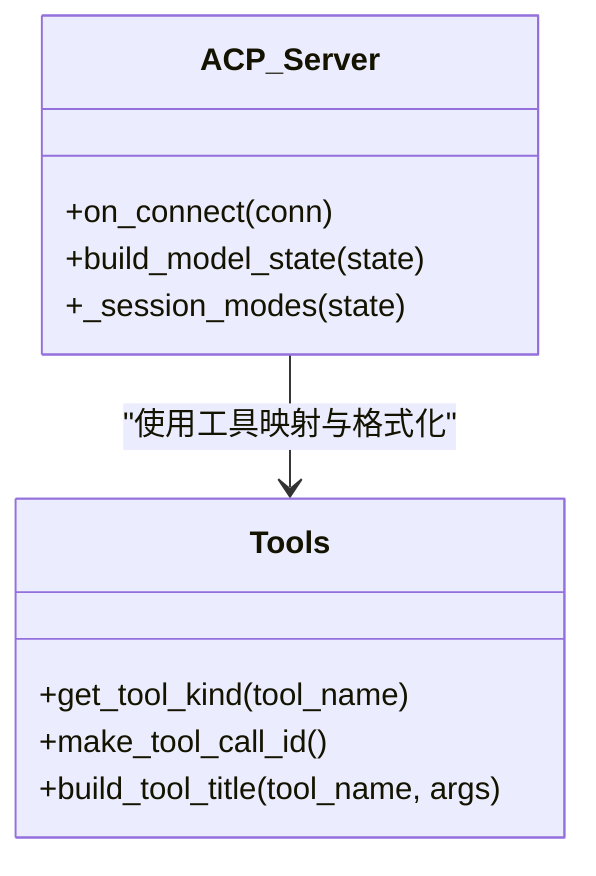
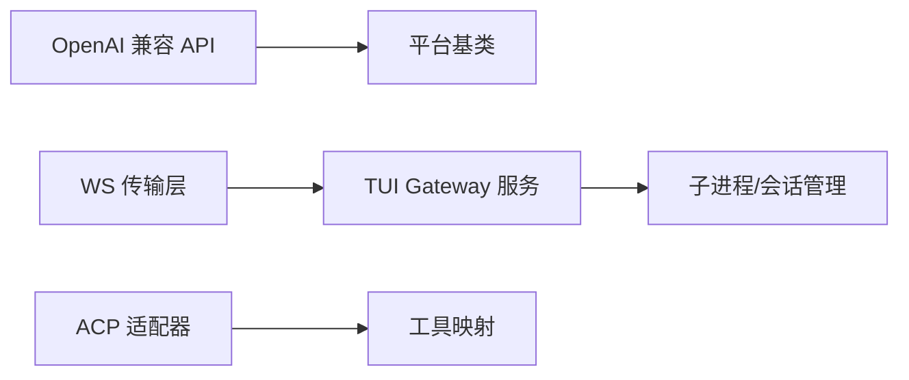

# API参考文档

<cite>
**本文引用的文件**
- [gateway/platforms/api_server.py](file://gateway/platforms/api_server.py)
- [sparkii_cli/web_server.py](file://sparkii_cli/web_server.py)
- [acp_adapter/server.py](file://acp_adapter/server.py)
- [tui_gateway/ws.py](file://tui_gateway/ws.py)
- [tui_gateway/server.py](file://tui_gateway/server.py)
- [acp_adapter/tools.py](file://acp_adapter/tools.py)
</cite>

## 目录
1. [简介](#简介)
2. [项目结构](#项目结构)
3. [核心组件](#核心组件)
4. [架构总览](#架构总览)
5. [详细组件分析](#详细组件分析)
6. [依赖关系分析](#依赖关系分析)
7. [性能与限流](#性能与限流)
8. [安全与访问控制](#安全与访问控制)
9. [错误码与状态码](#错误码与状态码)
10. [客户端集成与SDK使用](#客户端集成与sdk使用)
11. [测试与调试指南](#测试与调试指南)
12. [结论](#结论)

## 简介
本参考文档面向需要接入 Sparkii Agent 的开发者，覆盖以下接口与协议：
- OpenAI 兼容 REST API（聊天补全、响应式接口、模型列表、能力探测等）
- WebSocket 实时交互（JSON-RPC over WS，事件推送、会话管理）
- ACP（Agent Client Protocol）适配器（工具发现、调用、结果返回）
- MCP 协议相关实现（通过 CLI/网关侧路由暴露的工具与服务发现）
- 版本管理、错误码、状态码、限流与安全策略
- 客户端集成示例与调试方法

## 项目结构
本项目提供多类对外接口：
- OpenAI 兼容 HTTP API 服务：位于 gateway/platforms/api_server.py，提供 /v1/* 和 /api/* 端点，支持 SSE 流式输出、会话持久化、运行任务（runs）等。
- Web UI 与 Dashboard API：位于 sparkii_cli/web_server.py，基于 FastAPI，提供配置、环境、会话管理等 REST 接口，并承载前端静态资源。
- WebSocket 传输层：位于 tui_gateway/ws.py，提供 JSON-RPC over WebSocket 的实时通道，用于 TUI/Desktop/Web 客户端。
- ACP 适配器：位于 acp_adapter/server.py，将 Hermes Agent 以 ACP 协议暴露给编辑器/IDE 客户端；工具映射与格式化在 acp_adapter/tools.py。
- TUI Gateway 服务端：位于 tui_gateway/server.py，负责 RPC 分发、会话生命周期、子进程管理与事件广播。

图表来源
- [gateway/platforms/api_server.py:1-40](file://gateway/platforms/api_server.py#L1-L40)
- [sparkii_cli/web_server.py:1-10](file://sparkii_cli/web_server.py#L1-L10)
- [tui_gateway/ws.py:1-22](file://tui_gateway/ws.py#L1-L22)
- [tui_gateway/server.py:1-60](file://tui_gateway/server.py#L1-L60)
- [acp_adapter/server.py:1-80](file://acp_adapter/server.py#L1-L80)
- [acp_adapter/tools.py:1-80](file://acp_adapter/tools.py#L1-L80)

章节来源
- [gateway/platforms/api_server.py:1-40](file://gateway/platforms/api_server.py#L1-L40)
- [sparkii_cli/web_server.py:1-10](file://sparkii_cli/web_server.py#L1-L10)
- [tui_gateway/ws.py:1-22](file://tui_gateway/ws.py#L1-L22)
- [tui_gateway/server.py:1-60](file://tui_gateway/server.py#L1-L60)
- [acp_adapter/server.py:1-80](file://acp_adapter/server.py#L1-L80)
- [acp_adapter/tools.py:1-80](file://acp_adapter/tools.py#L1-L80)

## 核心组件
- OpenAI 兼容 API 服务器：提供聊天补全、响应式接口、模型列表、能力探测、会话管理、运行任务（runs）、健康检查等。支持 SSE 流式输出、请求体规范化、多模态内容处理、运行时代理参数覆盖。
- Web UI/Dashboard API：FastAPI 后端，提供配置与环境变量管理、会话操作、插件路由、CORS 限制、Host 头校验、令牌认证等。
- WebSocket 传输层：JSON-RPC over WebSocket，连接后发送 gateway.ready，支持高吞吐 token 合并与顺序保证，自动关闭与清理。
- ACP 适配器：将 Hermes Agent 暴露为 ACP 协议，支持模型选择、会话模式、工具调用、资源附件、文本/图片等内容转换。
- TUI Gateway 服务端：RPC 分发、长耗时任务线程池、会话槽位管理、子进程 Slash Worker、事件广播与崩溃日志。

章节来源
- [gateway/platforms/api_server.py:1-160](file://gateway/platforms/api_server.py#L1-L160)
- [sparkii_cli/web_server.py:313-378](file://sparkii_cli/web_server.py#L313-L378)
- [tui_gateway/ws.py:70-118](file://tui_gateway/ws.py#L70-L118)
- [acp_adapter/server.py:566-640](file://acp_adapter/server.py#L566-L640)
- [tui_gateway/server.py:184-296](file://tui_gateway/server.py#L184-L296)

## 架构总览
系统由多个服务组成，统一通过网关或本地服务暴露：
- HTTP 层：OpenAI 兼容 API 与 Dashboard API 分别处理不同用途的请求。
- WS 层：WebSocket 作为实时通道，承载 JSON-RPC 方法与事件。
- 适配层：ACP 适配器桥接编辑器/IDE 与 Agent。
- 执行层：TUI Gateway 负责调度、会话管理、子进程与事件。

图表来源
- [gateway/platforms/api_server.py:1-40](file://gateway/platforms/api_server.py#L1-L40)
- [tui_gateway/ws.py:286-337](file://tui_gateway/ws.py#L286-L337)
- [tui_gateway/server.py:184-296](file://tui_gateway/server.py#L184-L296)
- [acp_adapter/server.py:566-640](file://acp_adapter/server.py#L566-L640)

## 详细组件分析

### OpenAI 兼容 REST API
- 端点概览
  - POST /v1/chat/completions：聊天补全，支持流式与非流式，接受 OpenAI 格式的消息与多模态内容。
  - POST /v1/responses：响应式接口，支持 previous_response_id 进行有状态对话。
  - GET /v1/models：列出可用模型（含虚拟模型与别名）。
  - GET /v1/capabilities：机器可读的能力清单。
  - /api/sessions：会话 CRUD 与消息历史、分支、聊天（可流式）。
  - /v1/runs：启动运行任务，查询状态、事件流、审批与停止。
  - /health、/health/detailed：健康检查。
- 认证方式
  - 通过 API_SERVER_KEY 进行鉴权（见模块注释说明）。
  - 支持 X-Hermes-Session-Id 与 X-Hermes-Session-Key 进行会话上下文与长期记忆作用域。
- 请求/响应模式
  - 支持 stream=true 时返回 Server-Sent Events（SSE），帧序列化统一封装。
  - 多模态内容规范化：文本与图片 URL/data:image 支持，非法类型抛出 OpenAI 风格错误。
  - 运行时代理覆盖：允许 per-request 指定 provider/model/options。
- 版本管理
  - 通过 /v1/models 与 /v1/capabilities 暴露能力与模型信息，便于客户端适配。

图表来源
- [gateway/platforms/api_server.py:187-207](file://gateway/platforms/api_server.py#L187-L207)
- [gateway/platforms/api_server.py:477-666](file://gateway/platforms/api_server.py#L477-L666)
- [gateway/platforms/api_server.py:312-410](file://gateway/platforms/api_server.py#L312-L410)

章节来源
- [gateway/platforms/api_server.py:1-40](file://gateway/platforms/api_server.py#L1-L40)
- [gateway/platforms/api_server.py:187-207](file://gateway/platforms/api_server.py#L187-L207)
- [gateway/platforms/api_server.py:477-666](file://gateway/platforms/api_server.py#L477-L666)
- [gateway/platforms/api_server.py:312-410](file://gateway/platforms/api_server.py#L312-L410)

### WebSocket 接口（JSON-RPC over WS）
- 连接处理
  - 连接建立后立即发送 gateway.ready 事件，携带皮肤与变更事件开关。
  - 支持禁用 Nagle 以保持 token 流节奏。
- 消息格式
  - 方向一致：两端均使用换行分隔的 JSON-RPC 2.0 消息。
  - 高频 token 帧合并：message.delta/reasoning.delta/thinking.delta 等按短定时器批量发送，保持顺序。
- 实时交互模式
  - 客户端发送 RPC 请求，服务端异步分发到 tui_gateway.server.dispatch。
  - 长耗时处理器放入线程池，避免阻塞主循环；非流式响应立即写出。
  - 断开后清理会话、释放资源、记录统计。

图表来源
- [tui_gateway/ws.py:286-337](file://tui_gateway/ws.py#L286-L337)
- [tui_gateway/ws.py:44-61](file://tui_gateway/ws.py#L44-L61)
- [tui_gateway/server.py:184-296](file://tui_gateway/server.py#L184-L296)

章节来源
- [tui_gateway/ws.py:70-118](file://tui_gateway/ws.py#L70-L118)
- [tui_gateway/ws.py:286-337](file://tui_gateway/ws.py#L286-L337)
- [tui_gateway/server.py:184-296](file://tui_gateway/server.py#L184-L296)

### ACP 协议实现
- 工具发现
  - 通过 ACP 能力与模型选择器暴露可用模型与自定义提供者。
  - 工具名称到 ToolKind 的映射，便于 IDE 渲染与分类。
- 调用流程
  - 客户端发起工具调用，服务端转换为内部工具执行，返回结构化结果。
  - 结果格式化：根据工具类型生成人类可读摘要，失败状态识别。
- 结果返回
  - 文本/图片资源链接与嵌入资源转换为 OpenAI 兼容内容块。
  - 大文件或二进制资源限制与截断提示。

图表来源
- [acp_adapter/server.py:566-640](file://acp_adapter/server.py#L566-L640)
- [acp_adapter/tools.py:24-87](file://acp_adapter/tools.py#L24-L87)

章节来源
- [acp_adapter/server.py:90-192](file://acp_adapter/server.py#L90-L192)
- [acp_adapter/server.py:566-640](file://acp_adapter/server.py#L566-L640)
- [acp_adapter/tools.py:24-87](file://acp_adapter/tools.py#L24-L87)
- [acp_adapter/tools.py:213-249](file://acp_adapter/tools.py#L213-L249)

### Web UI/Dashboard API
- 功能范围
  - 配置与环境变量管理、会话操作、插件路由、CORS 限制、Host 头校验。
  - 令牌认证：X-Hermes-Session-Token 或 Bearer Token。
  - 健康自检：周期性内省受保护路由，记录组件健康。
- 安全策略
  - 仅允许 localhost/127.0.0.1 同源访问（CORS）。
  - Host 头校验防止 DNS Rebinding。
  - 非环回绑定强制启用 OAuth/密码门控。

章节来源
- [sparkii_cli/web_server.py:313-378](file://sparkii_cli/web_server.py#L313-L378)
- [sparkii_cli/web_server.py:398-468](file://sparkii_cli/web_server.py#L398-L468)
- [sparkii_cli/web_server.py:538-566](file://sparkii_cli/web_server.py#L538-L566)
- [sparkii_cli/web_server.py:644-686](file://sparkii_cli/web_server.py#L644-L686)

## 依赖关系分析
- OpenAI 兼容 API 依赖 aiohttp 与网关平台基类，提供 HTTP 服务与 SSE 流。
- WebSocket 传输层依赖 Starlette/FastAPI 的 WebSocket 抽象，复用 tui_gateway.server 的 dispatch。
- ACP 适配器依赖 acp 库与 schema，将内部工具与模型选择映射到 ACP 协议。
- TUI Gateway 依赖线程池、子进程管理、SQLite 会话存储与事件广播。

图表来源
- [gateway/platforms/api_server.py:86-94](file://gateway/platforms/api_server.py#L86-L94)
- [tui_gateway/ws.py:34-35](file://tui_gateway/ws.py#L34-L35)
- [acp_adapter/server.py:18-80](file://acp_adapter/server.py#L18-L80)
- [tui_gateway/server.py:141-158](file://tui_gateway/server.py#L141-L158)

章节来源
- [gateway/platforms/api_server.py:86-94](file://gateway/platforms/api_server.py#L86-L94)
- [tui_gateway/ws.py:34-35](file://tui_gateway/ws.py#L34-L35)
- [acp_adapter/server.py:18-80](file://acp_adapter/server.py#L18-L80)
- [tui_gateway/server.py:141-158](file://tui_gateway/server.py#L141-L158)

## 性能与限流
- SSE 流式优化
  - 统一 SSE 帧封装，确保字节级一致性。
  - 心跳与超时控制，避免空闲连接占用。
- WebSocket 优化
  - 高频 token 帧合并（~30fps），减少事件循环唤醒次数。
  - 禁用 Nagle 保持低延迟。
  - 写超时保护，避免事件循环停滞导致连接假死。
- 线程池与长耗时任务
  - 长耗时 RPC 放入线程池，避免阻塞主循环。
  - Slash Worker 子进程隔离，stderr/stdout 分离，避免污染协议。
- 内存与大小限制
  - 请求体最大字节数限制，防止滥用。
  - 多模态内容长度限制，避免过大 payload。

章节来源
- [gateway/platforms/api_server.py:150-158](file://gateway/platforms/api_server.py#L150-L158)
- [tui_gateway/ws.py:44-61](file://tui_gateway/ws.py#L44-L61)
- [tui_gateway/ws.py:268-284](file://tui_gateway/ws.py#L268-L284)
- [tui_gateway/server.py:184-296](file://tui_gateway/server.py#L184-L296)

## 安全与访问控制
- OpenAI 兼容 API
  - 使用 API_SERVER_KEY 进行鉴权。
  - 支持会话 ID 与作用域键，限定上下文与长期记忆范围。
- Web UI/Dashboard
  - CORS 限制为 localhost/127.0.0.1。
  - Host 头校验防 DNS Rebinding。
  - 令牌认证：X-Hermes-Session-Token 或 Bearer Token。
  - 非环回绑定强制启用 OAuth/密码门控。
- WebSocket
  - 连接后发送 ready，后续所有请求需遵循 JSON-RPC 协议。
  - 错误帧包含标准 JSON-RPC 错误码。

章节来源
- [gateway/platforms/api_server.py:1-40](file://gateway/platforms/api_server.py#L1-L40)
- [sparkii_cli/web_server.py:398-468](file://sparkii_cli/web_server.py#L398-L468)
- [sparkii_cli/web_server.py:538-566](file://sparkii_cli/web_server.py#L538-L566)
- [tui_gateway/ws.py:359-382](file://tui_gateway/ws.py#L359-L382)

## 错误码与状态码
- HTTP 状态码
  - 400：请求体无效（如多模态内容非法）。
  - 401：未授权（Dashboard 令牌缺失或不匹配）。
  - 404：资源不存在（插件路由禁用或路径错误）。
  - 5xx：服务端异常（记录到健康自检与崩溃日志）。
- JSON-RPC 错误码
  - -32700：解析错误（无效 JSON）。
  - -32603：内部错误（分发异常）。
- OpenAI 风格错误
  - 多模态内容验证失败返回 code 与 param，便于客户端定位问题。

章节来源
- [gateway/platforms/api_server.py:683-693](file://gateway/platforms/api_server.py#L683-L693)
- [sparkii_cli/web_server.py:644-686](file://sparkii_cli/web_server.py#L644-L686)
- [tui_gateway/ws.py:359-382](file://tui_gateway/ws.py#L359-L382)

## 客户端集成与SDK使用
- OpenAI 兼容客户端
  - 指向 http://localhost:8642/v1，使用 API_SERVER_KEY 鉴权。
  - 支持 stream=true 获取 SSE 增量消息。
  - 使用 X-Hermes-Session-Id 与 X-Hermes-Session-Key 维持会话上下文。
- WebSocket 客户端
  - 连接 /api/ws，接收 gateway.ready，随后发送 JSON-RPC 请求。
  - 处理 message.delta/reasoning.delta/thinking.delta 等高频事件。
- ACP 客户端
  - 使用 acp 库连接 ACP 服务器，调用工具与模型选择。
  - 利用工具映射与结果格式化获得可读输出。
- SDK 建议
  - 使用官方或社区提供的 OpenAI 兼容 SDK，替换 base_url 与 api_key。
  - WebSocket 客户端可使用任意支持 JSON-RPC 的库。
  - ACP 客户端使用 acp 库，遵循其会话与工具调用规范。

章节来源
- [gateway/platforms/api_server.py:1-40](file://gateway/platforms/api_server.py#L1-L40)
- [tui_gateway/ws.py:286-337](file://tui_gateway/ws.py#L286-L337)
- [acp_adapter/server.py:566-640](file://acp_adapter/server.py#L566-L640)

## 测试与调试指南
- 健康检查
  - 使用 /health 与 /health/detailed 检查服务状态。
- 日志与崩溃
  - TUI Gateway 将未处理异常写入 tui_gateway_crash.log，并在 stderr 输出摘要。
  - Dashboard 健康自检记录最近错误与自测状态。
- 调试方法
  - 启用详细日志，观察 SSE 帧与 WS 帧。
  - 使用 curl/wscat 测试 REST 与 WebSocket 端点。
  - 针对多模态内容，逐步缩小 payload 定位问题。

章节来源
- [tui_gateway/server.py:62-100](file://tui_gateway/server.py#L62-L100)
- [sparkii_cli/web_server.py:688-748](file://sparkii_cli/web_server.py#L688-L748)
- [tui_gateway/ws.py:429-477](file://tui_gateway/ws.py#L429-L477)

## 结论
本参考文档系统化梳理了 Sparkii Agent 的多类接口与协议，涵盖 OpenAI 兼容 REST、WebSocket 实时交互、ACP 适配器与 Web UI/Dashboard API。通过统一的错误码、安全策略与性能优化，开发者可以高效集成并构建稳定可靠的 AI 应用。建议在实际部署中结合健康检查、日志监控与限流策略，确保服务的可靠性与安全性。