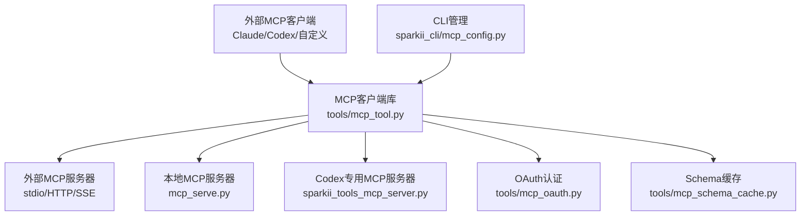
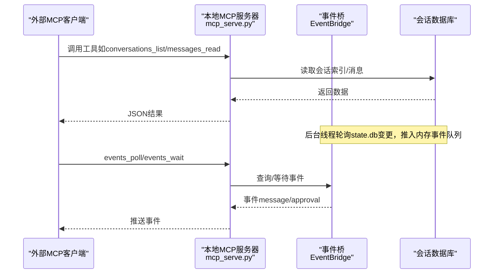
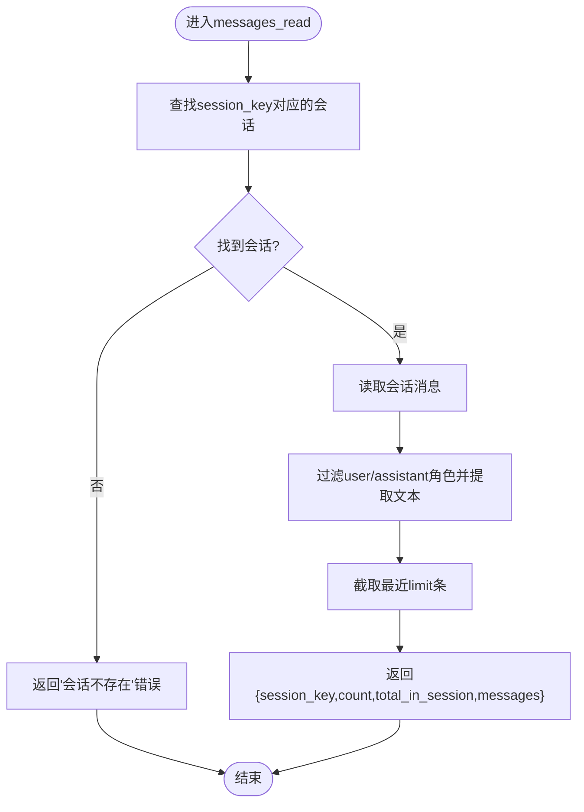
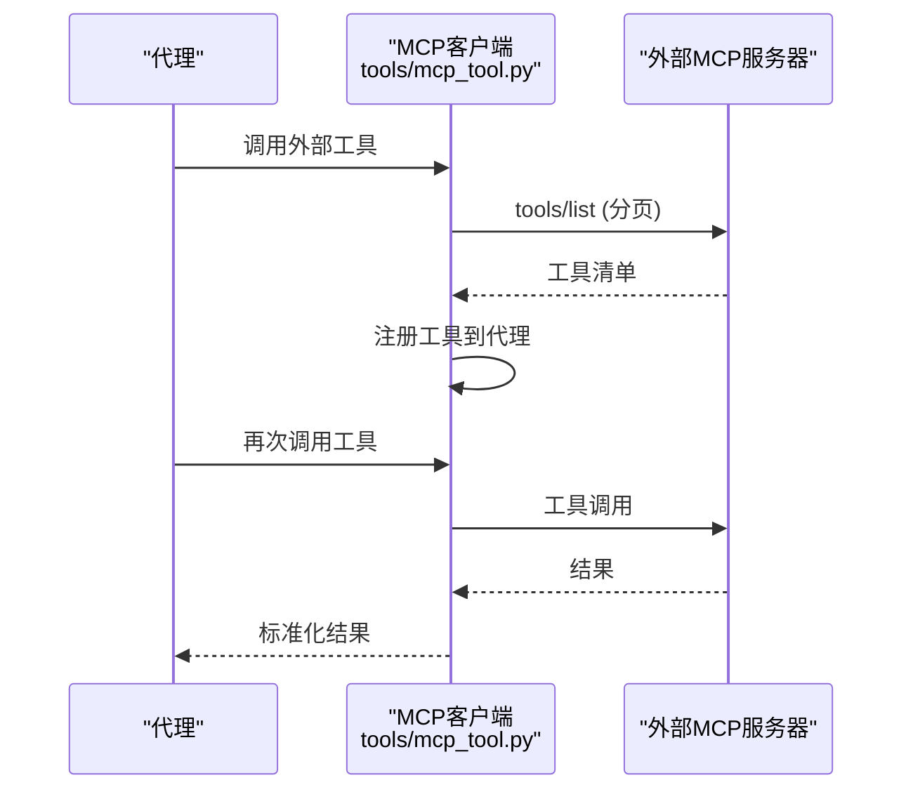
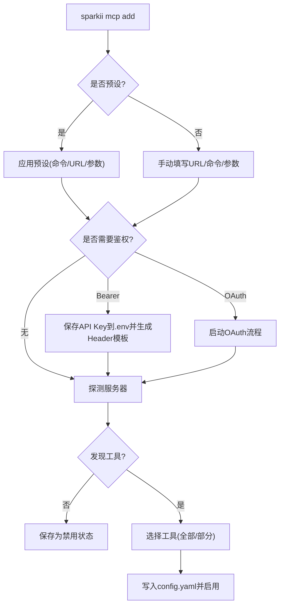
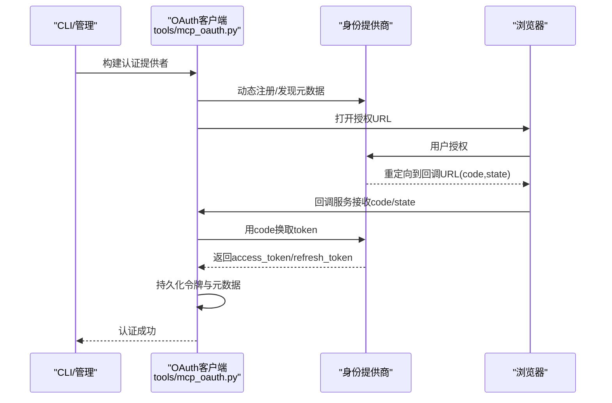
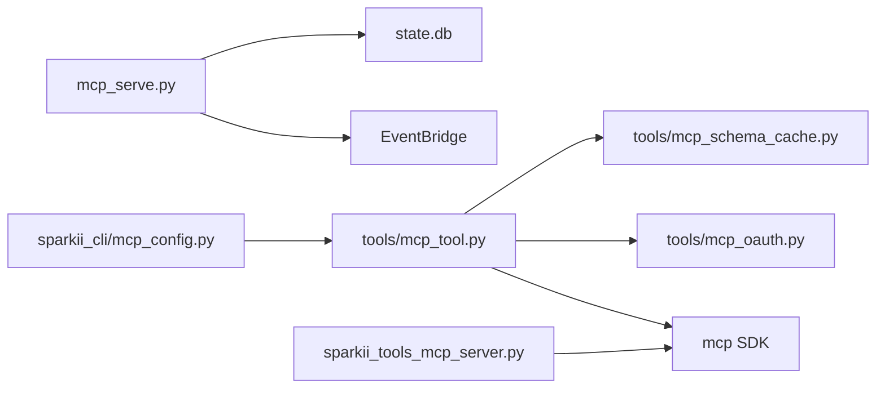

# MCP协议

<cite>
**本文引用的文件**
- [mcp_serve.py](file://mcp_serve.py)
- [tools/mcp_tool.py](file://tools/mcp_tool.py)
- [sparkii_cli/mcp_config.py](file://sparkii_cli/mcp_config.py)
- [tools/mcp_oauth.py](file://tools/mcp_oauth.py)
- [tools/mcp_schema_cache.py](file://tools/mcp_schema_cache.py)
- [agent/transports/sparkii_tools_mcp_server.py](file://agent/transports/sparkii_tools_mcp_server.py)
</cite>

## 目录
1. [简介](#简介)
2. [项目结构](#项目结构)
3. [核心组件](#核心组件)
4. [架构总览](#架构总览)
5. [详细组件分析](#详细组件分析)
6. [依赖关系分析](#依赖关系分析)
7. [性能与可靠性](#性能与可靠性)
8. [故障排查指南](#故障排查指南)
9. [结论](#结论)
10. [附录：OpenAI兼容接口映射](#附录openai兼容接口映射)

## 简介
本文件系统性梳理仓库中MCP（Model Context Protocol）的实现与使用方式，覆盖协议层、消息格式、通信机制、工具发现/注册/调用流程、OAuth认证与安全控制、服务器开发指南、客户端集成示例与调试方法，以及与OpenAI兼容接口的映射规则。文档面向不同技术背景的读者，提供从高层架构到代码级细节的渐进式说明。

## 项目结构
围绕MCP的关键实现分布在以下模块：
- mcp_serve.py：以FastMCP实现的“Sparkii MCP服务器”，将对话会话、消息、事件等暴露为MCP工具，供外部MCP客户端消费。
- tools/mcp_tool.py：MCP客户端支持，负责连接外部MCP服务器（stdio/HTTP/SSE）、发现工具、注册到代理工具表、执行调用、重连与生命周期管理。
- sparkii_cli/mcp_config.py：CLI命令用于添加/删除/列出/测试/配置MCP服务器，包含交互式工具选择、鉴权配置与探测。
- tools/mcp_oauth.py：MCP OAuth 2.1（PKCE）客户端实现，含本地回调服务、令牌持久化、动态客户端注册与元数据缓存。
- tools/mcp_schema_cache.py：MCP工具Schema的持久化缓存，避免冷启动时频繁拉起子进程。
- agent/transports/sparkii_tools_mcp_server.py：在Codex运行时下暴露精选的Sparkii工具集作为MCP服务器，补齐Codex内置能力之外的功能。

**图示来源**
- [tools/mcp_tool.py:1-120](file://tools/mcp_tool.py#L1-L120)
- [mcp_serve.py:590-605](file://mcp_serve.py#L590-L605)
- [agent/transports/sparkii_tools_mcp_server.py:152-245](file://agent/transports/sparkii_tools_mcp_server.py#L152-L245)
- [tools/mcp_oauth.py:1-80](file://tools/mcp_oauth.py#L1-L80)
- [tools/mcp_schema_cache.py:1-43](file://tools/mcp_schema_cache.py#L1-L43)

**章节来源**
- [mcp_serve.py:1-120](file://mcp_serve.py#L1-L120)
- [tools/mcp_tool.py:1-120](file://tools/mcp_tool.py#L1-L120)
- [sparkii_cli/mcp_config.py:1-120](file://sparkii_cli/mcp_config.py#L1-L120)
- [tools/mcp_oauth.py:1-120](file://tools/mcp_oauth.py#L1-L120)
- [tools/mcp_schema_cache.py:1-43](file://tools/mcp_schema_cache.py#L1-L43)
- [agent/transports/sparkii_tools_mcp_server.py:1-60](file://agent/transports/sparkii_tools_mcp_server.py#L1-L60)

## 核心组件
- MCP服务器端（mcp_serve.py）
  - 基于FastMCP创建服务，注册一组工具：会话列表、会话详情、读取消息、附件提取、事件轮询/等待、权限响应等。
  - 通过EventBridge后台线程轮询数据库变更，维护事件队列并支持按游标拉取与阻塞等待。
- MCP客户端（tools/mcp_tool.py）
  - 支持stdio、Streamable HTTP、SSE三种传输；自动重连、指数退避、保活心跳、并行工具调用开关。
  - 工具发现（tools/list）、分页遍历nextCursor、动态工具变更通知（tools/list_changed）。
  - 安全：环境变量白名单过滤、错误信息脱敏、描述注入扫描。
- CLI管理（sparkii_cli/mcp_config.py）
  - 交互式添加/删除/列出/测试/配置MCP服务器；支持Bearer/OAuth；工具选择与能力探测。
- OAuth（tools/mcp_oauth.py）
  - 浏览器授权码+PKCE流程；本地回调服务；令牌与客户端信息持久化；元数据缓存；非交互环境提示。
- Schema缓存（tools/mcp_schema_cache.py）
  - 按服务器名+配置指纹缓存工具Schema，避免冷启动开销。
- Codex专用MCP服务器（agent/transports/sparkii_tools_mcp_server.py）
  - 暴露精选Sparkii工具（搜索、浏览器自动化、视觉、图像生成、技能、TTS、看板协作等），适配Codex运行时的工具生态。

**章节来源**
- [mcp_serve.py:284-585](file://mcp_serve.py#L284-L585)
- [tools/mcp_tool.py:200-380](file://tools/mcp_tool.py#L200-L380)
- [sparkii_cli/mcp_config.py:415-617](file://sparkii_cli/mcp_config.py#L415-L617)
- [tools/mcp_oauth.py:429-645](file://tools/mcp_oauth.py#L429-L645)
- [tools/mcp_schema_cache.py:30-122](file://tools/mcp_schema_cache.py#L30-L122)
- [agent/transports/sparkii_tools_mcp_server.py:100-245](file://agent/transports/sparkii_tools_mcp_server.py#L100-L245)

## 架构总览
MCP在本仓库中扮演“工具总线”的角色：
- 服务端侧：将内部能力（对话、消息、事件、系统工具）或第三方能力封装为标准MCP工具，对外暴露。
- 客户端侧：统一接入多种MCP服务器，屏蔽传输差异，提供工具发现、调用、重试、鉴权、日志与缓存。
- 管理侧：提供CLI与Web界面进行服务器配置、鉴权、测试与监控。

**图示来源**
- [mcp_serve.py:590-754](file://mcp_serve.py#L590-L754)
- [mcp_serve.py:316-585](file://mcp_serve.py#L316-L585)

## 详细组件分析

### MCP服务器（mcp_serve.py）
- 工具集合
  - conversations_list：列出活跃会话（平台、名称、更新时间等），支持平台过滤与搜索。
  - conversation_get：根据session_key获取会话详情。
  - messages_read：读取最近消息（角色、内容、时间戳），限制长度与数量。
  - attachments_fetch：提取非文本附件（图片、媒体标签等）。
  - events_poll/events_wait：轮询或阻塞等待新事件（消息、审批请求/解决）。
  - permissions_respond：响应审批请求（尽力而为，无网关IPC）。
- 事件桥（EventBridge）
  - 后台线程每200ms检查state.db mtime变化，增量拉取新消息，维护cursor游标与队列上限。
  - 支持按session_key过滤与超时等待。
- 参数校验与容错
  - 整数参数强制转换与范围钳制；异常捕获后返回结构化错误JSON。

**图示来源**
- [mcp_serve.py:699-754](file://mcp_serve.py#L699-L754)

**章节来源**
- [mcp_serve.py:590-800](file://mcp_serve.py#L590-L800)
- [mcp_serve.py:284-585](file://mcp_serve.py#L284-L585)

### MCP客户端（tools/mcp_tool.py）
- 传输与连接
  - stdio：子进程启动，stderr重定向到共享日志文件，防止污染终端。
  - Streamable HTTP：可选skip_preflight绕过HEAD/GET探测。
  - SSE：独立transport分支。
- 工具发现与注册
  - tools/list分页遍历（nextCursor），限制最大页数防无限循环。
  - 监听tools/list_changed动态刷新。
  - 将工具注册到代理工具表，使模型可像调用内置工具一样调用外部工具。
- 安全与健壮性
  - 环境变量白名单过滤（PATH/HOME/XDG_*等），用户env合并。
  - 错误信息脱敏（令牌、密钥模式替换）。
  - 工具描述注入扫描（警告级别）。
  - 重连策略：指数退避+抖动，保活心跳，空闲回收与寿命限制。
- 采样与通知
  - 支持server-initiated LLM请求（sampling/createMessage）。
  - 支持elicitation（中间步骤收集结构化输入）。

**图示来源**
- [tools/mcp_tool.py:661-700](file://tools/mcp_tool.py#L661-L700)
- [tools/mcp_tool.py:493-533](file://tools/mcp_tool.py#L493-L533)

**章节来源**
- [tools/mcp_tool.py:1-120](file://tools/mcp_tool.py#L1-L120)
- [tools/mcp_tool.py:200-380](file://tools/mcp_tool.py#L200-L380)
- [tools/mcp_tool.py:493-533](file://tools/mcp_tool.py#L493-L533)
- [tools/mcp_tool.py:661-700](file://tools/mcp_tool.py#L661-L700)

### CLI管理（sparkii_cli/mcp_config.py）
- 添加服务器
  - 支持URL/命令/预设；环境变量解析与${VAR}插值。
  - 鉴权：Bearer头模板与.env存储；OAuth流程触发。
  - 工具选择：全部启用/交互式勾选/排除列表。
- 测试与诊断
  - 临时连接并list工具；显示能力计数（prompts/resources）。
  - 解包anyio异常组，展示真实原因。
- 删除与清理
  - 移除配置与OAuth令牌缓存。

**图示来源**
- [sparkii_cli/mcp_config.py:415-617](file://sparkii_cli/mcp_config.py#L415-L617)
- [sparkii_cli/mcp_config.py:278-379](file://sparkii_cli/mcp_config.py#L278-L379)

**章节来源**
- [sparkii_cli/mcp_config.py:278-379](file://sparkii_cli/mcp_config.py#L278-L379)
- [sparkii_cli/mcp_config.py:415-617](file://sparkii_cli/mcp_config.py#L415-L617)
- [sparkii_cli/mcp_config.py:721-782](file://sparkii_cli/mcp_config.py#L721-L782)

### OAuth认证（tools/mcp_oauth.py）
- 流程
  - 动态客户端注册（RFC 7591）或预注册client_id。
  - 浏览器打开授权URL，本地回调服务接收code/state。
  - 交换访问令牌与刷新令牌，持久化到SPARKII_HOME/mcp-tokens。
  - 缓存OAuth元数据，避免重启后重复发现。
- 非交互环境
  - 检测TTY/SSH/远程会话，给出操作指引或跳过。
  - Dashboard/桌面GUI可通过上下文变量强制允许交互。
- 安全性
  - 文件权限0o600，原子写入，父目录加固。
  - 无效客户端时主动销毁缓存并重新注册。

**图示来源**
- [tools/mcp_oauth.py:429-645](file://tools/mcp_oauth.py#L429-L645)
- [tools/mcp_oauth.py:697-791](file://tools/mcp_oauth.py#L697-L791)

**章节来源**
- [tools/mcp_oauth.py:1-120](file://tools/mcp_oauth.py#L1-L120)
- [tools/mcp_oauth.py:429-645](file://tools/mcp_oauth.py#L429-L645)
- [tools/mcp_oauth.py:697-791](file://tools/mcp_oauth.py#L697-L791)

### Schema缓存（tools/mcp_schema_cache.py）
- 目的：避免冷启动时频繁拉起子进程，提升Dashboard/代理初始化速度。
- 键：服务器名 + 配置指纹（command/args/url/transport/tools include/exclude）。
- 读写：线程安全，原子写入，仅当内容变化时落盘。

**章节来源**
- [tools/mcp_schema_cache.py:1-122](file://tools/mcp_schema_cache.py#L1-L122)

### Codex专用MCP服务器（agent/transports/sparkii_tools_mcp_server.py）
- 目标：在Codex运行时下暴露精选Sparkii工具，弥补Codex内置工具不足。
- 暴露能力：网页搜索/抽取、浏览器自动化、视觉分析、图像生成、技能浏览、TTS、看板协作等。
- 实现：从Sparkii工具定义中提取schema，动态构造处理器并注册到FastMCP。

**章节来源**
- [agent/transports/sparkii_tools_mcp_server.py:1-60](file://agent/transports/sparkii_tools_mcp_server.py#L1-L60)
- [agent/transports/sparkii_tools_mcp_server.py:100-245](file://agent/transports/sparkii_tools_mcp_server.py#L100-L245)

## 依赖关系分析
- 组件耦合
  - mcp_serve.py依赖事件桥与数据库访问，工具间松耦合。
  - tools/mcp_tool.py依赖MCP SDK（可选），对传输抽象良好，便于扩展。
  - sparkii_cli/mcp_config.py依赖tools/mcp_tool.py进行探测与连接。
  - tools/mcp_oauth.py与tools/mcp_tool.py协同完成鉴权。
- 外部依赖
  - mcp Python SDK（FastMCP、Streamable HTTP、SSE、OAuth）。
  - 数据库（state.db）与文件系统（缓存、令牌、日志）。

**图示来源**
- [mcp_serve.py:590-754](file://mcp_serve.py#L590-L754)
- [tools/mcp_tool.py:200-380](file://tools/mcp_tool.py#L200-L380)
- [tools/mcp_oauth.py:429-645](file://tools/mcp_oauth.py#L429-L645)
- [tools/mcp_schema_cache.py:30-122](file://tools/mcp_schema_cache.py#L30-L122)
- [agent/transports/sparkii_tools_mcp_server.py:152-245](file://agent/transports/sparkii_tools_mcp_server.py#L152-L245)

**章节来源**
- [tools/mcp_tool.py:200-380](file://tools/mcp_tool.py#L200-L380)
- [mcp_serve.py:590-754](file://mcp_serve.py#L590-L754)
- [tools/mcp_oauth.py:429-645](file://tools/mcp_oauth.py#L429-L645)
- [tools/mcp_schema_cache.py:30-122](file://tools/mcp_schema_cache.py#L30-L122)
- [agent/transports/sparkii_tools_mcp_server.py:152-245](file://agent/transports/sparkii_tools_mcp_server.py#L152-L245)

## 性能与可靠性
- 事件轮询优化
  - 基于state.db mtime判断是否变更，避免无意义查询。
  - 游标与队列上限控制，防止内存膨胀。
- 重连与保活
  - 指数退避+抖动，避免雪崩；keepalive_interval可调，适应短TTL服务。
  - 空闲回收与最大生命周期，减少僵尸连接。
- 缓存
  - Schema缓存降低冷启动开销；OAuth元数据缓存减少重复发现。
- 资源限制
  - 分页限制（最多50页）；消息内容截断；附件大小限制。

[本节为通用指导，不直接分析具体文件]

## 故障排查指南
- 连接失败
  - 检查传输类型（stdio/HTTP/SSE）与网络可达性；查看connect_timeout与超时设置。
  - 使用CLI测试命令验证连通性与工具发现。
- 鉴权问题
  - Bearer：确认.env中的密钥正确且未被多余前缀干扰；检查headers模板。
  - OAuth：确认浏览器可打开授权URL；检查回调端口与防火墙；在非交互环境下遵循提示。
- 工具未生效
  - 检查tools/include或exclude过滤；确认工具已注册到代理工具表。
  - 查看mcp-stderr.log定位子进程输出。
- 事件丢失或延迟
  - 检查state.db是否可访问；确认EventBridge线程运行正常；调整poll间隔与队列限制。

**章节来源**
- [sparkii_cli/mcp_config.py:721-782](file://sparkii_cli/mcp_config.py#L721-L782)
- [tools/mcp_tool.py:151-204](file://tools/mcp_tool.py#L151-L204)
- [tools/mcp_oauth.py:298-355](file://tools/mcp_oauth.py#L298-L355)
- [mcp_serve.py:316-585](file://mcp_serve.py#L316-L585)

## 结论
本仓库实现了完整的MCP生态：服务端暴露丰富工具，客户端统一接入多传输与鉴权，CLI提供便捷管理，Schema与OAuth增强性能与安全。通过事件桥与缓存机制，系统在实时性与冷启动之间取得平衡。建议在生产环境中合理配置超时、保活与缓存策略，并结合CLI与日志进行持续监控与排障。

[本节为总结，不直接分析具体文件]

## 附录：OpenAI兼容接口映射
- 背景
  - ACP适配器将Sparkii能力以Agent Client Protocol暴露，并在内部转换为OpenAI兼容的用户内容结构（文本与image_url等），以便下游模型消费。
- 映射要点
  - 文本块：ACP TextContentBlock → OpenAI content parts中的text。
  - 图片块：ACP ImageContentBlock → OpenAI image_url（data URL或URI）。
  - 资源链接：ACP ResourceContentBlock → 本地文件读取，图片转为image_url，文本内联或提示二进制省略。
  - 嵌入资源：EmbeddedResourceContentBlock → 文本或图片处理，超大文件截断或省略。
- 影响
  - 确保多模态输入在Sparkii/OpenAI路径中一致呈现，便于模型理解与渲染。

**章节来源**
- [acp_adapter/server.py:332-563](file://acp_adapter/server.py#L332-L563)