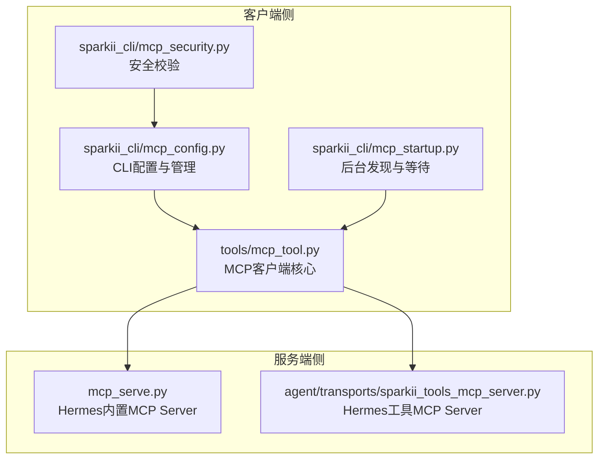
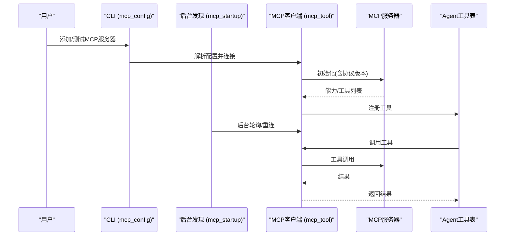
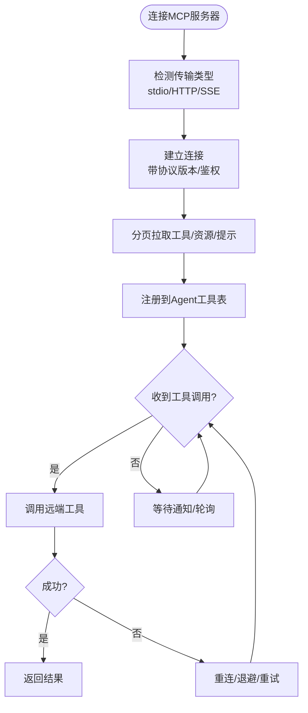
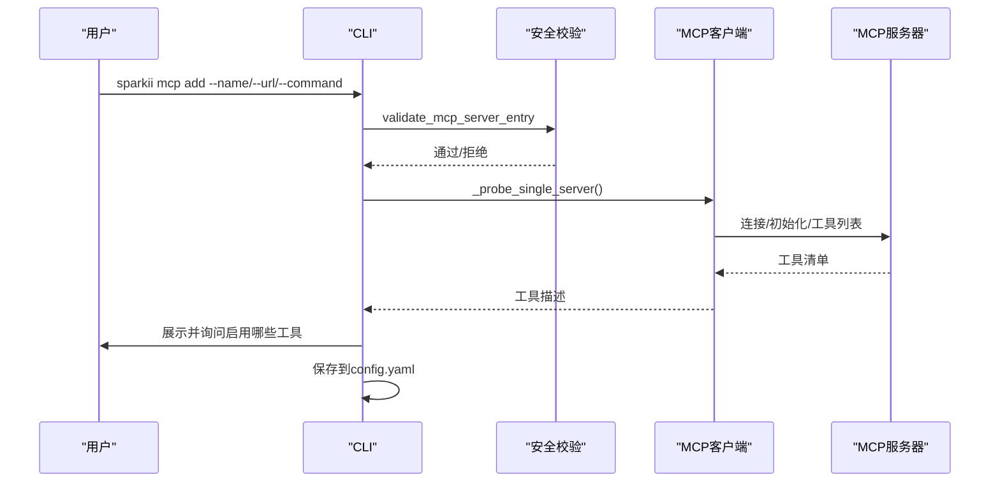
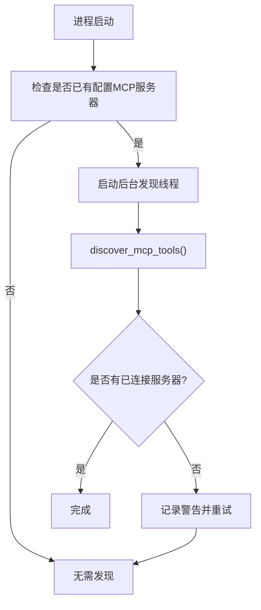
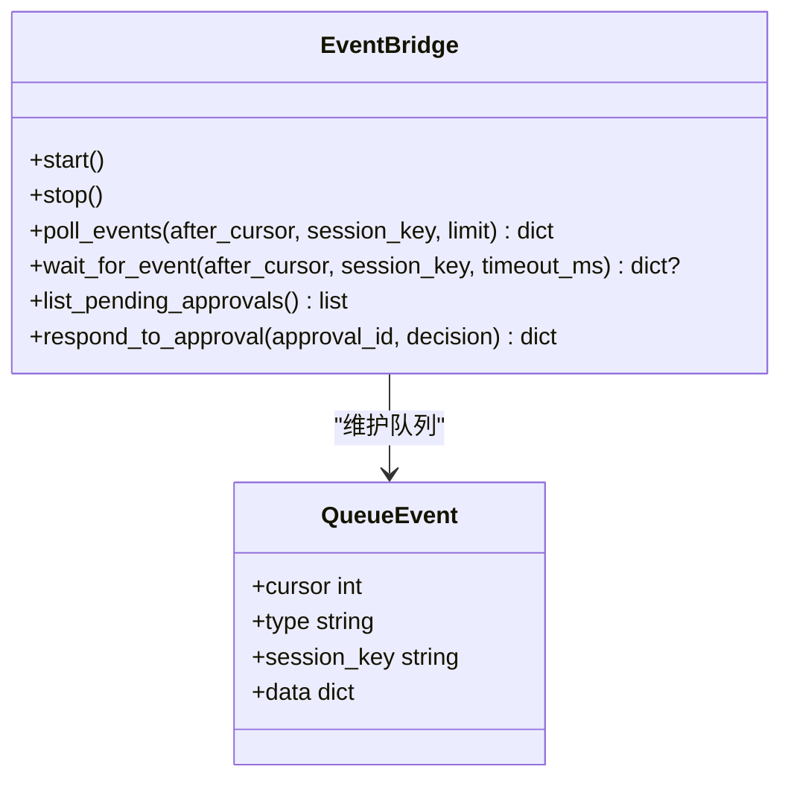
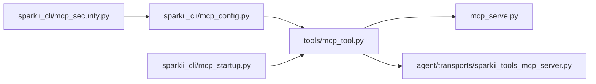

# MCP协议概述

<cite>
**本文引用的文件**
- [mcp_serve.py](file://mcp_serve.py)
- [tools/mcp_tool.py](file://tools/mcp_tool.py)
- [sparkii_cli/mcp_config.py](file://sparkii_cli/mcp_config.py)
- [sparkii_cli/mcp_startup.py](file://sparkii_cli/mcp_startup.py)
- [sparkii_cli/mcp_security.py](file://sparkii_cli/mcp_security.py)
- [agent/transports/sparkii_tools_mcp_server.py](file://agent/transports/sparkii_tools_mcp_server.py)
</cite>

## 目录
1. [简介](#简介)
2. [项目结构](#项目结构)
3. [核心组件](#核心组件)
4. [架构总览](#架构总览)
5. [详细组件分析](#详细组件分析)
6. [依赖关系分析](#依赖关系分析)
7. [性能考量](#性能考量)
8. [故障排查指南](#故障排查指南)
9. [结论](#结论)
10. [附录：快速开始与配置示例](#附录快速开始与配置示例)

## 简介
本概述文档面向希望在SparkiiDesktop中理解和使用MCP（Model Context Protocol）的开发者。内容涵盖：
- 设计目标与核心特性
- 传输方式（stdio、HTTP/StreamableHTTP、SSE）、消息格式与通信机制
- 工具发现、注册、调用的完整流程
- 协议版本兼容性、安全考虑与性能优化策略
- 快速开始指南与基本配置示例

MCP在SparkiiDesktop中的角色：
- 作为“外部能力”的统一接入层，将本地或远程MCP服务器暴露的工具纳入Agent可调用范围
- 提供统一的连接管理、重连、鉴权、日志与错误脱敏等横切能力
- 通过CLI/TUI进行交互式配置、测试与生命周期管理

## 项目结构
围绕MCP的关键代码分布在以下模块：
- tools/mcp_tool.py：MCP客户端核心，负责连接、发现、注册、调用、重连、鉴权、采样、通知处理等
- sparkii_cli/mcp_config.py：CLI命令实现（add/remove/list/test/configure），交互式配置与工具选择
- sparkii_cli/mcp_startup.py：后台MCP发现线程与等待机制，保证启动时不阻塞且具备超时保护
- sparkii_cli/mcp_security.py：对MCP服务端配置的恶意模式检测（网络外发、持久化写入、IOC匹配）
- mcp_serve.py：Hermes内置MCP Server，将会话消息、事件、权限审批等暴露为MCP工具
- agent/transports/sparkii_tools_mcp_server.py：将Hermes部分工具以MCP Server形式暴露给Codex等运行时

**图表来源**
- [tools/mcp_tool.py:1-95](file://tools/mcp_tool.py#L1-L95)
- [sparkii_cli/mcp_config.py:1-10](file://sparkii_cli/mcp_config.py#L1-L10)
- [sparkii_cli/mcp_startup.py:1-30](file://sparkii_cli/mcp_startup.py#L1-L30)
- [sparkii_cli/mcp_security.py:1-25](file://sparkii_cli/mcp_security.py#L1-L25)
- [mcp_serve.py:1-28](file://mcp_serve.py#L1-L28)
- [agent/transports/sparkii_tools_mcp_server.py:1-43](file://agent/transports/sparkii_tools_mcp_server.py#L1-L43)

**章节来源**
- [tools/mcp_tool.py:1-95](file://tools/mcp_tool.py#L1-L95)
- [sparkii_cli/mcp_config.py:1-10](file://sparkii_cli/mcp_config.py#L1-L10)
- [sparkii_cli/mcp_startup.py:1-30](file://sparkii_cli/mcp_startup.py#L1-L30)
- [sparkii_cli/mcp_security.py:1-25](file://sparkii_cli/mcp_security.py#L1-L25)
- [mcp_serve.py:1-28](file://mcp_serve.py#L1-L28)
- [agent/transports/sparkii_tools_mcp_server.py:1-43](file://agent/transports/sparkii_tools_mcp_server.py#L1-L43)

## 核心组件
- MCP客户端核心（tools/mcp_tool.py）
  - 支持stdio、HTTP/StreamableHTTP、SSE三种传输
  - 自动重连、指数退避、keepalive、会话保活
  - 环境变量插值、安全过滤、错误信息脱敏
  - 动态工具发现（tools/list_changed等通知）
  - 采样（sampling/createMessage）与elicitation支持（按SDK能力）
  - 并行工具调用开关（per-server配置）
- CLI配置与管理（sparkii_cli/mcp_config.py）
  - add/remove/list/test/configure命令
  - 交互式工具选择、OAuth流程、Bearer令牌保存
  - 预置模板（如codex）
- 后台发现与等待（sparkii_cli/mcp_startup.py）
  - 单进程共享后台线程执行MCP发现
  - 非阻塞启动、超时控制、重试机制
- 安全校验（sparkii_cli/mcp_security.py）
  - 阻止shell解释器+网络外发、系统持久化写入、已知IOC
- 内置MCP Server（mcp_serve.py）
  - 暴露会话列表、消息读取、附件获取、事件轮询/等待、权限审批等工具
- Hermes工具MCP Server（agent/transports/sparkii_tools_mcp_server.py）
  - 将Hermes的部分工具（搜索、浏览器自动化、图像生成、TTS、看板等）暴露为MCP工具供Codex等运行时使用

**章节来源**
- [tools/mcp_tool.py:1-95](file://tools/mcp_tool.py#L1-L95)
- [sparkii_cli/mcp_config.py:1-10](file://sparkii_cli/mcp_config.py#L1-L10)
- [sparkii_cli/mcp_startup.py:1-30](file://sparkii_cli/mcp_startup.py#L1-L30)
- [sparkii_cli/mcp_security.py:1-25](file://sparkii_cli/mcp_security.py#L1-L25)
- [mcp_serve.py:1-28](file://mcp_serve.py#L1-L28)
- [agent/transports/sparkii_tools_mcp_server.py:1-43](file://agent/transports/sparkii_tools_mcp_server.py#L1-L43)

## 架构总览
MCP在SparkiiDesktop的整体交互如下：
- 用户通过CLI添加/配置MCP服务器（支持stdio、HTTP/StreamableHTTP、SSE）
- 后台线程异步发现并建立连接，注册工具到Agent工具表
- Agent在对话中按需调用工具；失败时自动重连
- 内置MCP Server提供跨平台会话管理能力；Hermes工具MCP Server为特定运行时暴露能力

**图表来源**
- [sparkii_cli/mcp_config.py:278-378](file://sparkii_cli/mcp_config.py#L278-L378)
- [sparkii_cli/mcp_startup.py:32-119](file://sparkii_cli/mcp_startup.py#L32-L119)
- [tools/mcp_tool.py:215-280](file://tools/mcp_tool.py#L215-L280)
- [tools/mcp_tool.py:661-699](file://tools/mcp_tool.py#L661-L699)

## 详细组件分析

### MCP客户端核心（tools/mcp_tool.py）
- 传输与连接
  - stdio：子进程启动，stderr重定向到统一日志，父进程死亡监控（watchdog）
  - HTTP/StreamableHTTP：自动探测content-type，必要时跳过预检；支持身份头与环境变量插值
  - SSE：可选传输，用于MCP服务器使用SSE协议的场景
- 工具发现与注册
  - 分页拉取tools/resources/prompts，遵循nextCursor直到结束
  - 监听server端通知（tools/list_changed等）动态刷新工具集
- 调用与容错
  - 每工具超时、连接超时、最大重连次数、退避抖动
  - 错误信息脱敏（隐藏token、密钥等）
  - 采样（sampling/createMessage）与elicitation（按SDK能力）
- 版本兼容
  - 优先从SDK导入LATEST_PROTOCOL_VERSION，否则回退到保守常量
  - 在HTTP请求头携带协议版本，确保服务端正确协商

**图表来源**
- [tools/mcp_tool.py:215-280](file://tools/mcp_tool.py#L215-L280)
- [tools/mcp_tool.py:661-699](file://tools/mcp_tool.py#L661-L699)
- [tools/mcp_tool.py:338-374](file://tools/mcp_tool.py#L338-L374)
- [tools/mcp_tool.py:493-532](file://tools/mcp_tool.py#L493-L532)

**章节来源**
- [tools/mcp_tool.py:215-280](file://tools/mcp_tool.py#L215-L280)
- [tools/mcp_tool.py:338-374](file://tools/mcp_tool.py#L338-L374)
- [tools/mcp_tool.py:493-532](file://tools/mcp_tool.py#L493-L532)
- [tools/mcp_tool.py:661-699](file://tools/mcp_tool.py#L661-L699)

### CLI配置与管理（sparkii_cli/mcp_config.py）
- 支持交互式添加服务器：URL或命令+参数，可选OAuth或Bearer认证
- 连接后列出工具，允许全选/选择/取消
- 保存配置到config.yaml的mcp_servers键下
- 测试连接、显示工具清单、清理OAuth状态

**图表来源**
- [sparkii_cli/mcp_config.py:415-617](file://sparkii_cli/mcp_config.py#L415-L617)
- [sparkii_cli/mcp_security.py:121-177](file://sparkii_cli/mcp_security.py#L121-L177)

**章节来源**
- [sparkii_cli/mcp_config.py:415-617](file://sparkii_cli/mcp_config.py#L415-L617)
- [sparkii_cli/mcp_security.py:121-177](file://sparkii_cli/mcp_security.py#L121-L177)

### 后台发现与等待（sparkii_cli/mcp_startup.py）
- 单进程共享后台线程执行MCP发现，避免重复启动
- 若首次无连接成功，后续仍可重试
- 支持配置化的发现超时（普通/单次查询模式不同默认值）
- 在构建Agent前确保有足够时间完成发现，避免首回合缺失工具

**图表来源**
- [sparkii_cli/mcp_startup.py:32-119](file://sparkii_cli/mcp_startup.py#L32-L119)
- [sparkii_cli/mcp_startup.py:175-194](file://sparkii_cli/mcp_startup.py#L175-L194)

**章节来源**
- [sparkii_cli/mcp_startup.py:32-119](file://sparkii_cli/mcp_startup.py#L32-L119)
- [sparkii_cli/mcp_startup.py:175-194](file://sparkii_cli/mcp_startup.py#L175-L194)

### 安全校验（sparkii_cli/mcp_security.py）
- 阻止shell解释器+网络外发（curl/wget/nc等）
- 阻止系统持久化写入（SSH/PAM/sudoers/cron/rc文件）
- 硬编码IOC阻断（已知攻击指标）
- 在保存与启动两个阶段均进行检查，防止被植入的配置执行

**章节来源**
- [sparkii_cli/mcp_security.py:1-25](file://sparkii_cli/mcp_security.py#L1-L25)
- [sparkii_cli/mcp_security.py:121-177](file://sparkii_cli/mcp_security.py#L121-L177)

### 内置MCP Server（mcp_serve.py）
- 暴露工具：会话列表、会话详情、消息读取、附件获取、事件轮询/等待、权限审批
- 通过EventBridge轮询state.db，维护内存队列与waiter，降低DB压力
- 兼容旧sessions.json索引，迁移至state.db路由索引

**图表来源**
- [mcp_serve.py:288-449](file://mcp_serve.py#L288-L449)
- [mcp_serve.py:450-584](file://mcp_serve.py#L450-L584)

**章节来源**
- [mcp_serve.py:288-449](file://mcp_serve.py#L288-L449)
- [mcp_serve.py:450-584](file://mcp_serve.py#L450-L584)

### Hermes工具MCP Server（agent/transports/sparkii_tools_mcp_server.py）
- 将Hermes的部分工具（web_search、browser_*、vision_analyze、image_generate、skills_*、text_to_speech、kanban_*）暴露为MCP工具
- 通过FastMCP注册，参数签名由JSON Schema推导
- 适用于Codex等运行时，使其获得Hermes更丰富的工具能力

**章节来源**
- [agent/transports/sparkii_tools_mcp_server.py:1-43](file://agent/transports/sparkii_tools_mcp_server.py#L1-L43)
- [agent/transports/sparkii_tools_mcp_server.py:100-149](file://agent/transports/sparkii_tools_mcp_server.py#L100-L149)
- [agent/transports/sparkii_tools_mcp_server.py:152-245](file://agent/transports/sparkii_tools_mcp_server.py#L152-L245)

## 依赖关系分析
- tools/mcp_tool.py依赖mcp SDK（可选），根据可用能力启用HTTP/SSE、采样、通知等功能
- CLI与后台发现模块依赖tools/mcp_tool.py进行实际连接与工具发现
- 安全模块独立于连接逻辑，但在CLI保存与启动时被调用
- 内置MCP Server与Hermes工具MCP Server作为服务端，被客户端连接

**图表来源**
- [tools/mcp_tool.py:1-95](file://tools/mcp_tool.py#L1-L95)
- [sparkii_cli/mcp_config.py:1-10](file://sparkii_cli/mcp_config.py#L1-L10)
- [sparkii_cli/mcp_startup.py:1-30](file://sparkii_cli/mcp_startup.py#L1-L30)
- [sparkii_cli/mcp_security.py:1-25](file://sparkii_cli/mcp_security.py#L1-L25)
- [mcp_serve.py:1-28](file://mcp_serve.py#L1-L28)
- [agent/transports/sparkii_tools_mcp_server.py:1-43](file://agent/transports/sparkii_tools_mcp_server.py#L1-L43)

**章节来源**
- [tools/mcp_tool.py:1-95](file://tools/mcp_tool.py#L1-L95)
- [sparkii_cli/mcp_config.py:1-10](file://sparkii_cli/mcp_config.py#L1-L10)
- [sparkii_cli/mcp_startup.py:1-30](file://sparkii_cli/mcp_startup.py#L1-L30)
- [sparkii_cli/mcp_security.py:1-25](file://sparkii_cli/mcp_security.py#L1-L25)
- [mcp_serve.py:1-28](file://mcp_serve.py#L1-L28)
- [agent/transports/sparkii_tools_mcp_server.py:1-43](file://agent/transports/sparkii_tools_mcp_server.py#L1-L43)

## 性能考量
- 连接与重连
  - 指数退避+抖动，避免雪崩式重连
  - keepalive间隔可调，适配不同服务器的会话TTL
- 工具发现
  - 分页拉取限制页数，防止无限循环
  - 后台异步发现，不阻塞主流程
- 事件轮询
  - EventBridge基于mtime缓存与阈值判断，减少无效DB访问
  - 队列长度限制，避免内存膨胀
- 超时与回收
  - 工具调用超时、连接超时、空闲回收、最大生命周期
- 日志与调试
  - stdio子进程stderr统一重定向到日志文件，便于定位问题

[本节为通用性能指导，不直接分析具体文件]

## 故障排查指南
- 连接失败
  - 检查传输类型（stdio/HTTP/SSE）与URL/命令是否正确
  - 查看CLI输出中的连接耗时与错误信息（已脱敏）
  - 确认鉴权配置（OAuth/Bearer）与环境变量插值
- 工具未出现
  - 确认后台发现线程是否运行（mcp_discovery_in_flight）
  - 检查tools/list是否分页完整（nextCursor）
  - 查看通知处理（tools/list_changed）是否生效
- 工具调用异常
  - 检查工具超时、连接超时、重连次数
  - 查看错误信息是否包含敏感数据（应已脱敏）
  - 确认服务端是否实现了所需方法（method not found）
- 安全拦截
  - 若配置被拒绝，检查是否命中shell外发、持久化写入或IOC规则
  - 调整命令/参数以避免触发安全规则

**章节来源**
- [sparkii_cli/mcp_config.py:721-782](file://sparkii_cli/mcp_config.py#L721-L782)
- [tools/mcp_tool.py:526-532](file://tools/mcp_tool.py#L526-L532)
- [tools/mcp_tool.py:547-586](file://tools/mcp_tool.py#L547-L586)
- [sparkii_cli/mcp_security.py:121-177](file://sparkii_cli/mcp_security.py#L121-L177)

## 结论
SparkiiDesktop通过MCP协议将外部工具与服务无缝集成到Agent工作流中，提供了：
- 多传输支持（stdio、HTTP/StreamableHTTP、SSE）
- 健壮的连接管理与自动重连
- 安全的配置校验与敏感信息脱敏
- 高效的工具发现与动态更新
- 内置MCP Server与Hermes工具MCP Server扩展了跨平台与运行时能力

建议开发者：
- 使用CLI进行交互式配置与测试
- 合理设置超时与keepalive，适配服务端会话策略
- 关注安全规则，避免恶意配置
- 利用后台发现机制，确保首回合工具可用性

[本节为总结性内容，不直接分析具体文件]

## 附录：快速开始与配置示例

- 安装与准备
  - 确保已安装mcp包（可选依赖）
  - 准备MCP服务器（本地命令或远程URL）

- 添加MCP服务器（CLI）
  - 通过URL（HTTP/StreamableHTTP或SSE）
  - 或通过命令（stdio）
  - 支持OAuth或Bearer认证

- 测试连接
  - 使用CLI测试命令验证连通性与工具列表

- 配置示例（概念说明）
  - stdio：指定command与args，可选env
  - HTTP/StreamableHTTP：指定url与headers（含Authorization）
  - SSE：指定transport为sse与url
  - 可选：connect_timeout、timeout、keepalive_interval、idle/max lifetime

- 注意事项
  - 环境变量插值支持${VAR}与${env:VAR}
  - 安全规则会阻止可疑配置
  - 后台发现线程会在启动时尝试连接，超时保护避免阻塞

[本节为操作指引，不直接分析具体文件]