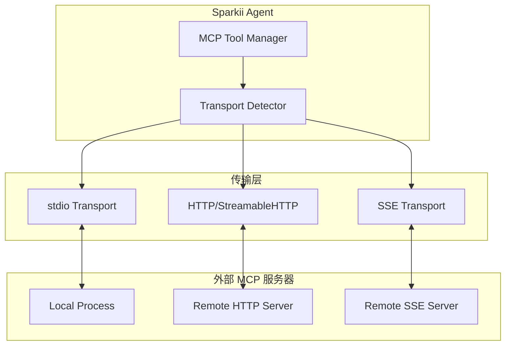
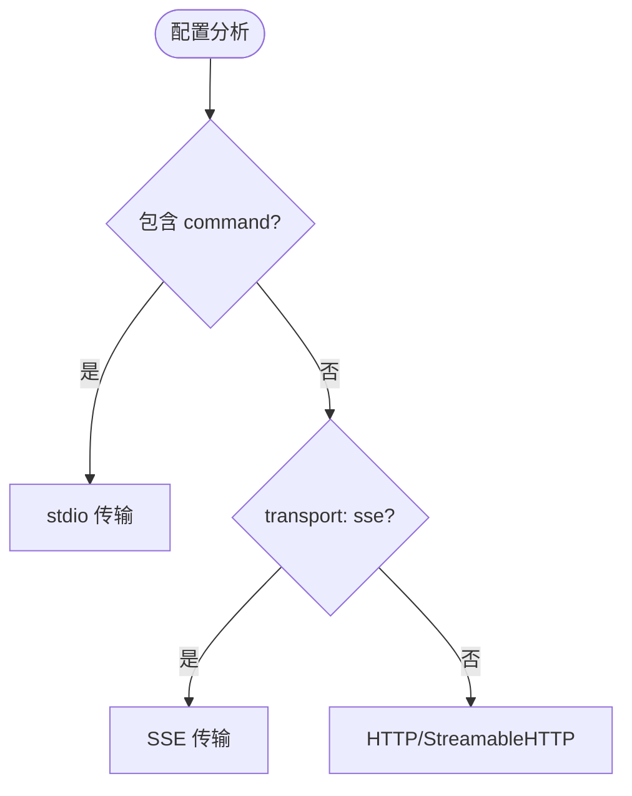

# 传输机制

<cite>

**本文引用的文件**
- [tools/mcp_tool.py](file://tools/mcp_tool.py)
</cite>

## 简介

MCP (Model Context Protocol) 传输层是 Sparkii Agent 与外部 MCP 服务器之间的通信基础。系统支持三种传输方式：**stdio 进程间通信**、**HTTP/StreamableHTTP** 和 **SSE (Server-Sent Events)**。核心实现位于 `tools/mcp_tool.py`。

## 架构总览



## 三种传输方式对比

| 特性 | stdio | HTTP/StreamableHTTP | SSE |
|------|-------|---------------------|-----|
| 连接方式 | 子进程 stdin/stdout | HTTP 请求/响应 | HTTP 长连接 + 事件流 |
| 适用场景 | 本地工具、CLI 集成 | 远程服务、REST 风格 | 实时推送、流式响应 |
| 延迟 | 极低（进程内） | 中等（网络往返） | 低（持久连接） |
| 安全模型 | 进程隔离 + 环境变量过滤 | TLS + 认证头 | TLS + 认证头 |
| 重连机制 | 进程重启 | 请求重试 | 自动重连 |

## stdio 进程间通信

stdio 传输通过启动子进程建立连接，根据配置中的 `command` 和 `args` 字段启动外部 MCP 服务器进程，通过 stdin/stdout 管道进行双向通信。

关键特性：
- **环境变量过滤**：敏感变量不会传递到子进程
- **空闲回收**：`idle_timeout_seconds`（默认 3600 秒）内无活动时回收
- **生命周期上限**：`max_lifetime_seconds`（默认 86400 秒）强制重启
- **OSV 恶意检测**：启动前扫描外部 MCP 包的安全漏洞

```json
{
    "mcpServers": {
        "filesystem": {
            "command": "npx",
            "args": ["-y", "@modelcontextprotocol/server-filesystem", "/path"],
            "idle_timeout_seconds": 3600,
            "max_lifetime_seconds": 86400
        }
    }
}
```

章节来源
- [tools/mcp_tool.py:26-71](file://tools/mcp_tool.py#L26-L71)

## HTTP/StreamableHTTP

HTTP 传输使用配置中的 `url` 字段连接远程 MCP 服务器，支持自定义请求头和认证令牌。StreamableHTTP 是标准 HTTP 的扩展，支持流式响应体，适用于大数据量的工具响应。

```json
{
    "mcpServers": {
        "remote-tools": {
            "url": "https://mcp.example.com/api",
            "headers": {"X-User-Id": "user-123"}
        }
    }
}
```

错误处理：自动处理 429（限流）、503（服务不可用），支持指数退避重试。

## SSE 服务器发送事件

SSE 传输通过设置 `"transport": "sse"` 启用。客户端建立 HTTP 长连接后，服务器通过事件流推送消息。支持双向通信：客户端通过 HTTP POST 发送请求，服务器通过 SSE 事件流推送响应。

内置自动重连机制，按指数退避策略尝试重连，同时保留请求队列避免消息丢失。

## 传输选择策略



系统根据配置自动选择传输方式：包含 `command` 字段则使用 stdio；包含 `url` + `transport: "sse"` 则使用 SSE；仅包含 `url` 则使用 HTTP/StreamableHTTP。

## 安全考虑

- stdio：进程隔离 + 环境变量过滤 + OSV 恶意包扫描
- HTTP/SSE：TLS 加密 + 自定义认证头
- 所有传输：请求超时控制和资源清理

## 故障排查

| 问题 | 可能原因 | 解决方案 |
|------|---------|---------|
| stdio 启动失败 | 命令不存在或权限不足 | 检查 command 路径和权限 |
| HTTP 超时 | 网络不可达 | 检查 URL 和网络连通性 |
| SSE 频繁断开 | 网络不稳定 | 调整心跳和重连参数 |
| 工具不可用 | 服务器未正确注册工具 | 检查服务器日志 |

## 最佳实践

1. 本地工具优先使用 stdio（延迟最低）
2. 远程服务使用 HTTPS（确保加密）
3. 配置合理的超时参数
4. 启用 OSV 检测防止供应链攻击
