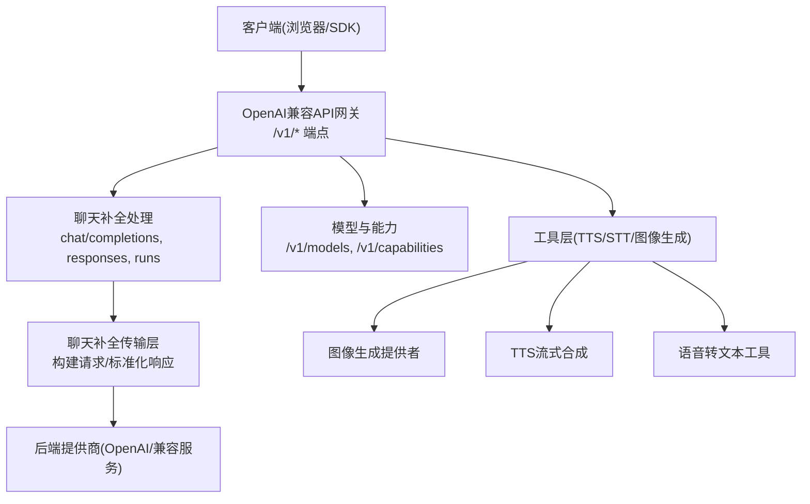
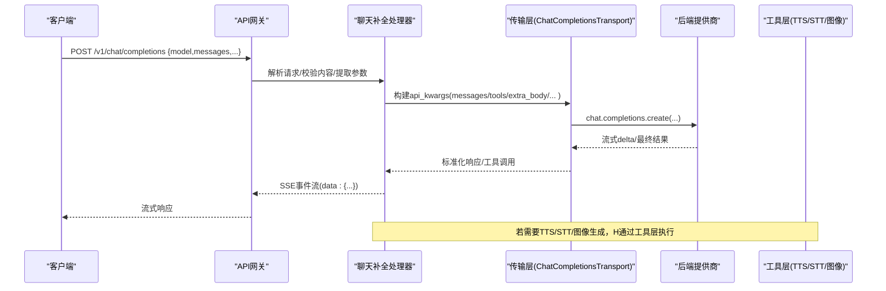
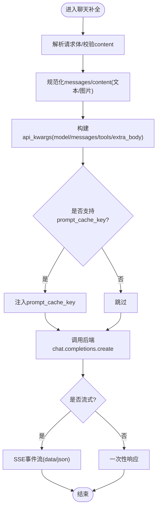
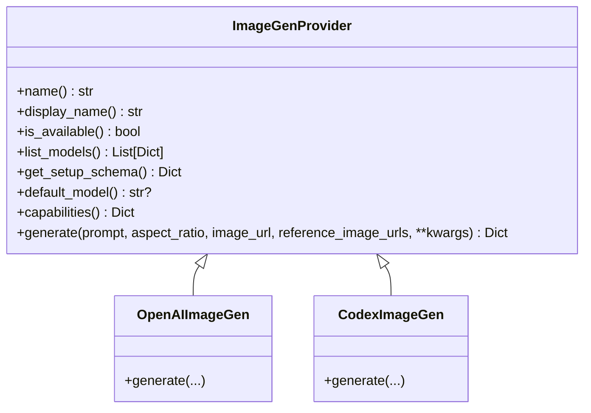
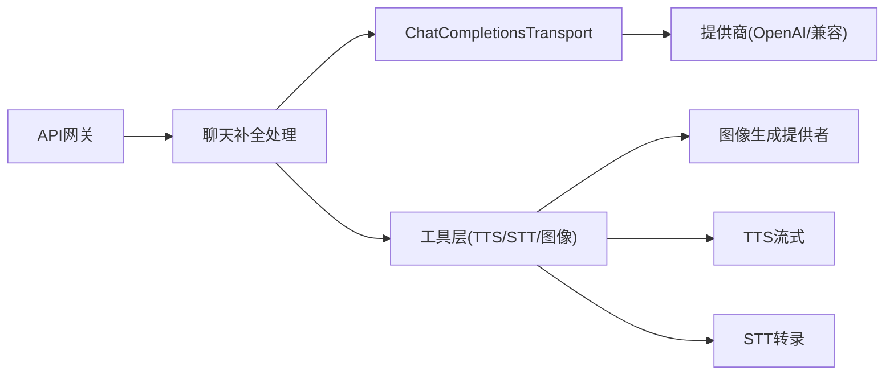

# OpenAI兼容API

<cite>
**本文引用的文件**
- [gateway/platforms/api_server.py](file://gateway/platforms/api_server.py)
- [agent/chat_completion_helpers.py](file://agent/chat_completion_helpers.py)
- [agent/transports/chat_completions.py](file://agent/transports/chat_completions.py)
- [agent/image_gen_provider.py](file://agent/image_gen_provider.py)
- [tools/tts_streaming.py](file://tools/tts_streaming.py)
- [tools/transcription_tools.py](file://tools/transcription_tools.py)
- [plugins/image_gen/openai/__init__.py](file://plugins/image_gen/openai/__init__.py)
- [plugins/image_gen/openai-codex/__init__.py](file://plugins/image_gen/openai-codex/__init__.py)
</cite>

## 目录
1. [简介](#简介)
2. [项目结构](#项目结构)
3. [核心组件](#核心组件)
4. [架构总览](#架构总览)
5. [详细组件分析](#详细组件分析)
6. [依赖关系分析](#依赖关系分析)
7. [性能考虑](#性能考虑)
8. [故障排查指南](#故障排查指南)
9. [结论](#结论)
10. [附录](#附录)

## 简介
本文件面向使用“OpenAI兼容API”的开发者与集成方，系统性说明聊天完成接口、图像生成、语音转文本、文本转语音等扩展能力的调用方式、参数规范、流式响应、批量处理、错误重试与兼容性差异。文档基于仓库中网关API服务器、聊天补全传输层、图像生成抽象与工具实现进行梳理，并提供Python/JavaScript客户端的使用建议与最佳实践。

## 项目结构
- API网关与HTTP端点：由网关平台适配器提供OpenAI兼容的REST/SSE接口，包括聊天补全、Responses、模型列表、能力查询、会话管理、运行任务（runs）等。
- 聊天补全传输层：负责将内部消息/工具/参数转换为各OpenAI兼容后端的请求格式，并标准化响应。
- 图像生成：通过可插拔提供者抽象统一入口，支持文生图与图生图/编辑。
- 语音能力：文本转语音（TTS）与语音转文本（STT）以工具形式暴露，可由Agent在对话中调用。

**图示来源**
- [gateway/platforms/api_server.py:1-40](file://gateway/platforms/api_server.py#L1-L40)
- [agent/transports/chat_completions.py:1-10](file://agent/transports/chat_completions.py#L1-L10)
- [agent/image_gen_provider.py:1-40](file://agent/image_gen_provider.py#L1-L40)

**章节来源**
- [gateway/platforms/api_server.py:1-40](file://gateway/platforms/api_server.py#L1-L40)

## 核心组件
- OpenAI兼容API网关
  - 提供/v1/chat/completions、/v1/responses、/v1/runs等端点；支持SSE流式输出；支持X-Hermes-Session-Id/X-Hermes-Session-Key进行会话延续与长期记忆作用域控制。
  - 提供/v1/models与/v1/capabilities用于能力发现。
- 聊天补全传输层
  - 负责消息清洗、工具定义、温度/超时/推理配置、提示缓存键注入、多提供商适配与响应标准化。
- 图像生成提供者抽象
  - 统一image_generate工具入口，支持text-to-image与image-to-image/edit，返回统一成功/错误结构。
- 语音能力工具
  - TTS流式合成与STT转录工具，供Agent在对话流程中按需调用。

**章节来源**
- [gateway/platforms/api_server.py:1-40](file://gateway/platforms/api_server.py#L1-L40)
- [agent/transports/chat_completions.py:207-216](file://agent/transports/chat_completions.py#L207-L216)
- [agent/image_gen_provider.py:64-194](file://agent/image_gen_provider.py#L64-L194)
- [tools/tts_streaming.py](file://tools/tts_streaming.py)
- [tools/transcription_tools.py](file://tools/transcription_tools.py)

## 架构总览
下图展示从客户端到后端提供商的完整调用链，包含流式事件与工具调用的关键路径。

**图示来源**
- [gateway/platforms/api_server.py:187-206](file://gateway/platforms/api_server.py#L187-L206)
- [agent/transports/chat_completions.py:356-597](file://agent/transports/chat_completions.py#L356-L597)

## 详细组件分析

### 聊天完成接口（/v1/chat/completions）
- 请求体关键字段
  - model：虚拟或真实模型标识；当未指定provider时，按网关默认路由策略选择。
  - messages：支持字符串或数组形式的多模态内容（text/image_url），系统会做规范化与长度限制。
  - tools：工具定义（函数调用），遵循OpenAI schema。
  - temperature、max_tokens、timeout、stream等标准字段。
  - model_options：可携带reasoning_effort、service_tier/fast等运行时选项。
  - provider：显式指定提供商时，优先使用该提供商。
- 流式响应
  - 使用SSE帧序列化，统一data: JSON格式，支持keepalive心跳。
- 会话与上下文
  - 可选头X-Hermes-Session-Id维持无状态会话连续性；X-Hermes-Session-Key限定长期记忆作用域。
- 多模态内容
  - 支持text与image_url/input_image；data:image/...仅允许图片类型；非文本部分会被忽略或拒绝。
- 提示缓存
  - 对特定后端（如官方OpenAI）自动注入prompt_cache_key以提升缓存命中。

**图示来源**
- [gateway/platforms/api_server.py:477-666](file://gateway/platforms/api_server.py#L477-L666)
- [agent/transports/chat_completions.py:356-597](file://agent/transports/chat_completions.py#L356-L597)

**章节来源**
- [gateway/platforms/api_server.py:187-206](file://gateway/platforms/api_server.py#L187-L206)
- [gateway/platforms/api_server.py:477-666](file://gateway/platforms/api_server.py#L477-L666)
- [agent/transports/chat_completions.py:356-597](file://agent/transports/chat_completions.py#L356-L597)

### 图像生成（image_generate工具）
- 统一入口：image_generate工具覆盖文生图与图生图/编辑，依据是否提供image_url/reference_image_urls路由至对应后端。
- 参数
  - prompt：文本提示词
  - aspect_ratio：landscape/square/portrait
  - image_url：源图像URL（编辑模式）
  - reference_image_urls：参考图像列表（风格/构图参考）
  - upscale：可选，触发后端超分增强
- 返回结构
  - success、image（URL或本地路径）、model、prompt、aspect_ratio、modality、provider、error/error_type等。
- 提供者
  - 内置OpenAI与Codex图像生成提供者，可通过插件注册。

**图示来源**
- [agent/image_gen_provider.py:64-194](file://agent/image_gen_provider.py#L64-L194)
- [plugins/image_gen/openai/__init__.py](file://plugins/image_gen/openai/__init__.py)
- [plugins/image_gen/openai-codex/__init__.py](file://plugins/image_gen/openai-codex/__init__.py)

**章节来源**
- [agent/image_gen_provider.py:64-194](file://agent/image_gen_provider.py#L64-L194)

### 语音转文本（STT）与文本转语音（TTS）
- STT：通过transcription_tools暴露转录能力，可在对话中由Agent调用，将音频转为文本。
- TTS：通过tts_streaming提供流式文本转语音能力，适合实时播报与低延迟场景。
- 使用方式：作为工具被Agent在turn中调度，输入为文本或音频数据，输出为文本或音频流。

**章节来源**
- [tools/transcription_tools.py](file://tools/transcription_tools.py)
- [tools/tts_streaming.py](file://tools/tts_streaming.py)

### 流式响应与SSE
- 统一SSE帧序列化，确保跨端点一致的数据格式与ASCII安全。
- 支持keepalive心跳，避免中间代理断开长连接。
- 聊天补全与responses/runs事件流均复用同一SSE编码逻辑。

**章节来源**
- [gateway/platforms/api_server.py:187-206](file://gateway/platforms/api_server.py#L187-L206)

### 批量处理与Runs
- /v1/runs：启动后台任务，立即返回run_id；支持查询状态、事件流、审批与停止。
- 适用于长时间运行的批处理任务，结合SSE事件流获取结构化生命周期事件。

**章节来源**
- [gateway/platforms/api_server.py:17-23](file://gateway/platforms/api_server.py#L17-L23)

## 依赖关系分析
- 网关API服务器依赖聊天补全传输层进行请求构建与响应标准化。
- 传输层依赖提供商配置文件与模型元数据，决定temperature、推理配置、提示缓存键等。
- 图像生成、TTS/STT作为工具被Agent在对话中调用，形成“对话→工具→外部能力”的闭环。

**图示来源**
- [gateway/platforms/api_server.py:1-40](file://gateway/platforms/api_server.py#L1-L40)
- [agent/transports/chat_completions.py:1-10](file://agent/transports/chat_completions.py#L1-L10)
- [agent/image_gen_provider.py:1-40](file://agent/image_gen_provider.py#L1-L40)

**章节来源**
- [gateway/platforms/api_server.py:1-40](file://gateway/platforms/api_server.py#L1-L40)
- [agent/transports/chat_completions.py:1-10](file://agent/transports/chat_completions.py#L1-L10)

## 性能考虑
- 流式传输：优先使用stream=true以降低首字节延迟，减少内存占用。
- 提示缓存：对稳定system/developer前缀的请求，利用prompt_cache_key提升缓存命中率。
- 超时与空闲检测：合理设置timeout与stale超时，避免长连接挂起；大上下文请求适当提高stale阈值。
- 内容裁剪：messages content有最大长度限制，避免超长payload导致性能下降。
- 工具调用：将耗时操作（图像生成/TTS/STT）放入工具异步执行，主对话保持低延迟。

[本节为通用指导，不直接分析具体文件]

## 故障排查指南
- 多模态内容错误
  - 现象：传入非图片data URL或未知content type导致400。
  - 处理：检查image_url是否为http(s)或data:image/...；确保只包含支持的文本与图片部分。
- 流式中断/空流
  - 现象：长时间无响应或空流。
  - 处理：检查stale超时与网络代理；必要时重启会话或切换模型。
- 工具调用失败
  - 现象：图像生成/TTS/STT报错。
  - 处理：查看工具返回的error/error_type；确认密钥与配额；重试或降级到备用提供者。
- Runs任务异常
  - 现象：任务卡住或未完成。
  - 处理：通过/v1/runs/{id}/events查看事件；必要时调用stop中止并清理资源。

**章节来源**
- [gateway/platforms/api_server.py:683-692](file://gateway/platforms/api_server.py#L683-L692)
- [agent/chat_completion_helpers.py:303-391](file://agent/chat_completion_helpers.py#L303-L391)

## 结论
本OpenAI兼容API提供了稳定的聊天补全、图像生成、语音能力与后台任务管理能力，具备流式响应、提示缓存、会话作用域控制等高级特性。通过统一的传输层与工具抽象，可灵活对接多种后端提供商，满足多样化业务需求。建议在生产环境中启用流式响应、合理配置超时与缓存、并对工具调用进行监控与重试。

[本节为总结性内容，不直接分析具体文件]

## 附录

### API端点速查
- POST /v1/chat/completions：聊天补全（支持stream）
- GET /v1/models：列出可用模型
- GET /v1/capabilities：机器可读能力清单
- POST /v1/responses：Responses API（stateful）
- GET /v1/responses/{response_id}：获取存储的响应
- DELETE /v1/responses/{response_id}：删除存储的响应
- POST /v1/runs：启动后台任务
- GET /v1/runs/{run_id}：查询任务状态
- GET /v1/runs/{run_id}/events：SSE事件流
- POST /v1/runs/{run_id}/approval：审批
- POST /v1/runs/{run_id}/stop：停止任务

**章节来源**
- [gateway/platforms/api_server.py:1-23](file://gateway/platforms/api_server.py#L1-L23)

### Python客户端使用示例（概念性）
- 初始化客户端，设置base_url为网关地址，配置API密钥。
- 调用chat.completions.create，传入model、messages、stream等参数。
- 若stream=true，逐条读取SSE事件并拼接内容。
- 如需图像生成，调用image_generate工具（通过Agent或工具SDK）。
- 如需TTS/STT，调用相应工具方法。

[本节为概念性示例，不直接引用代码片段]

### JavaScript客户端使用示例（概念性）
- 使用fetch或HTTP库发送POST请求到/v1/chat/completions。
- 设置Content-Type为application/json，Authorization为Bearer token。
- 若stream=true，使用ReadableStream或EventSource处理SSE事件。
- 根据返回的choices.delta.content增量更新UI。

[本节为概念性示例，不直接引用代码片段]

### 与官方OpenAI API的差异与兼容性说明
- 兼容范围：聊天补全、模型列表、能力查询基本对齐OpenAI格式；Responses与Runs为扩展能力。
- 差异点：
  - 会话作用域：通过X-Hermes-Session-Id与X-Hermes-Session-Key控制会话与记忆作用域。
  - 提示缓存：仅在明确支持的后端注入prompt_cache_key。
  - 工具调用：以工具形式暴露TTS/STT/图像生成，不在OpenAI原生范围内。
  - 流式事件：SSE格式统一，但事件结构与字段可能因后端而异。
- 建议：在迁移时优先验证messages格式、工具定义与流式事件处理逻辑。

**章节来源**
- [gateway/platforms/api_server.py:1-23](file://gateway/platforms/api_server.py#L1-L23)
- [agent/transports/chat_completions.py:588-597](file://agent/transports/chat_completions.py#L588-L597)