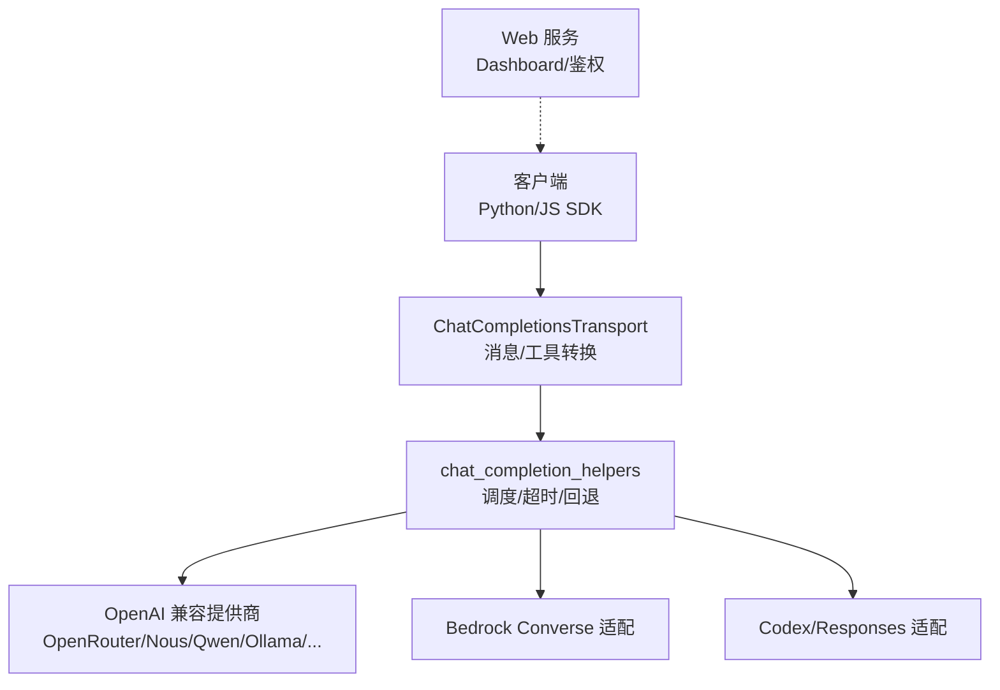
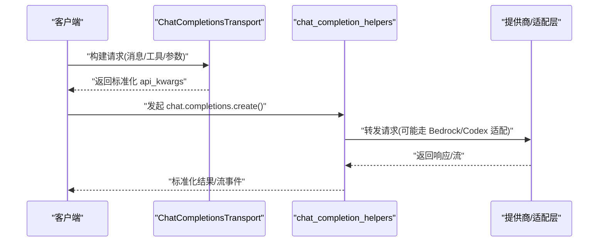
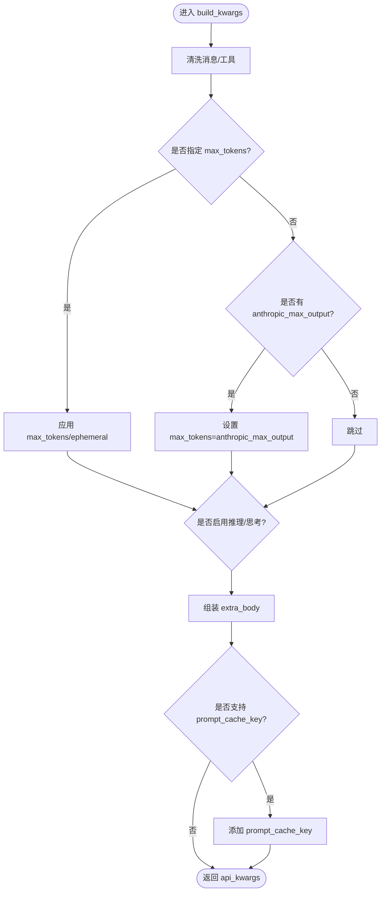
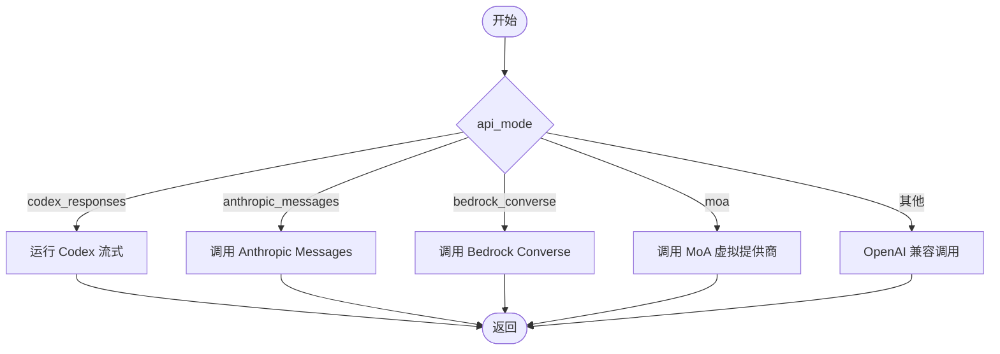
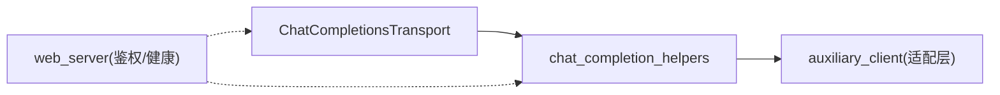

# 聊天完成接口

<cite>
**本文引用的文件**
- [agent/chat_completion_helpers.py](file://agent/chat_completion_helpers.py)
- [agent/transports/chat_completions.py](file://agent/transports/chat_completions.py)
- [sparkii_cli/web_server.py](file://sparkii_cli/web_server.py)
- [agent/auxiliary_client.py](file://agent/auxiliary_client.py)
</cite>

## 目录
1. [简介](#简介)
2. [项目结构](#项目结构)
3. [核心组件](#核心组件)
4. [架构总览](#架构总览)
5. [详细组件分析](#详细组件分析)
6. [依赖关系分析](#依赖关系分析)
7. [性能与稳定性](#性能与稳定性)
8. [故障排查指南](#故障排查指南)
9. [结论](#结论)
10. [附录：请求/响应规范与示例](#附录请求响应规范与示例)

## 简介
本章节面向使用 OpenAI 兼容的“聊天完成”接口的开发者，说明如何在当前系统中发起聊天补全请求、构造消息与工具参数、配置模型行为（如 temperature、max_tokens、tools），以及如何处理流式响应。文档同时覆盖文本生成、工具调用、多轮对话等典型场景，并给出 Python、JavaScript 等主流语言的客户端 SDK 使用指引，以及与官方 OpenAI API 的差异与兼容性注意事项。

## 项目结构
聊天完成能力由以下关键模块协同实现：
- 传输层：将内部消息/工具转换为各提供商可接受的 OpenAI 兼容格式，并处理 provider 差异（如 Gemini thinking_config、Moonshot schema 等）。
- 助手层：负责非流式/流式调度的统一入口、超时与空闲保护、失败回退、上下文大小估算、活动心跳等。
- Web 服务：提供本地 Dashboard 与认证中间件，用于管理会话与调试；聊天完成通常通过 Agent 运行时或 Gateway 暴露的 OpenAI 兼容端点被调用。
- 辅助适配：在需要时将 Responses/Codex/Bedrock 等后端适配为 chat.completions 形态，便于上层统一调用。

图表来源
- [agent/transports/chat_completions.py:207-597](file://agent/transports/chat_completions.py#L207-L597)
- [agent/chat_completion_helpers.py:497-558](file://agent/chat_completion_helpers.py#L497-L558)
- [sparkii_cli/web_server.py:313-671](file://sparkii_cli/web_server.py#L313-L671)

章节来源
- [agent/transports/chat_completions.py:207-597](file://agent/transports/chat_completions.py#L207-L597)
- [agent/chat_completion_helpers.py:497-558](file://agent/chat_completion_helpers.py#L497-L558)
- [sparkii_cli/web_server.py:313-671](file://sparkii_cli/web_server.py#L313-L671)

## 核心组件
- ChatCompletionsTransport：负责消息清洗、工具定义标准化、按模型/提供商拼装请求体（含 reasoning/thinking、extra_body、prompt_cache_key 等）。
- chat_completion_helpers：统一调度非流式/流式调用，计算上下文负载、设置超时与空闲保护、失败回退、活动心跳与死锁规避。
- Web 服务：提供本地访问入口与鉴权中间件，保障 Dashboard 安全；聊天完成通常经由 Agent/Gateway 对外暴露 OpenAI 兼容端点。
- auxiliary_client：将 Responses/Codex/Bedrock 等后端适配为 chat.completions 形态，使上层以统一方式调用。

章节来源
- [agent/transports/chat_completions.py:207-597](file://agent/transports/chat_completions.py#L207-L597)
- [agent/chat_completion_helpers.py:497-558](file://agent/chat_completion_helpers.py#L497-L558)
- [agent/auxiliary_client.py:1277-1352](file://agent/auxiliary_client.py#L1277-L1352)
- [sparkii_cli/web_server.py:313-671](file://sparkii_cli/web_server.py#L313-L671)

## 架构总览
下图展示一次聊天完成的端到端流程：客户端通过 OpenAI 兼容 SDK 调用 /chat/completions，传输层进行消息/工具清洗与参数拼装，助手层负责调度、超时与回退，最终命中目标提供商或适配层。

图表来源
- [agent/transports/chat_completions.py:356-597](file://agent/transports/chat_completions.py#L356-L597)
- [agent/chat_completion_helpers.py:497-558](file://agent/chat_completion_helpers.py#L497-L558)
- [agent/auxiliary_client.py:1277-1352](file://agent/auxiliary_client.py#L1277-L1352)

## 详细组件分析

### 传输层：消息与工具转换、参数拼装
- 消息清洗：移除内部字段（如 codex_reasoning_items、tool_name、时间戳、api_content 等）与以“_”开头的内部标记，避免严格提供商拒绝。
- 工具标准化：对 Moonshot/Kimi 等严格 JSON Schema 的工具进行规范化。
- 参数拼装：
  - max_tokens：支持临时覆盖、用户指定、提供商默认等多优先级策略。
  - reasoning/thinking：根据模型族（Gemini、LM Studio、Kimi、TokenHub 等）注入对应字段。
  - extra_body：按提供商注入 provider 路由、插件、thinking_config 等。
  - prompt_cache_key：在明确支持的端点（如官方 OpenAI）自动附加缓存键。

图表来源
- [agent/transports/chat_completions.py:356-597](file://agent/transports/chat_completions.py#L356-L597)

章节来源
- [agent/transports/chat_completions.py:207-597](file://agent/transports/chat_completions.py#L207-L597)

### 助手层：调度、超时与回退
- 非流式调度：根据 api_mode 分发到 Codex、Anthropic Messages、Bedrock Converse、MoA 或直接 OpenAI 兼容调用。
- 直接调用路径：在特定上下文（如 cron、子代理）中绕过中断工作线程，避免嵌套池死锁，并通过轻量心跳维持活动状态。
- 超时与空闲保护：基于上下文大小估算、推理模型地板值、提供商配置动态计算 stale_timeout；对无响应的长连接进行主动中止。
- 连续失败熔断：当连续多次出现“无响应”时，快速放弃以避免无限等待。

图表来源
- [agent/chat_completion_helpers.py:497-558](file://agent/chat_completion_helpers.py#L497-L558)

章节来源
- [agent/chat_completion_helpers.py:497-558](file://agent/chat_completion_helpers.py#L497-L558)
- [agent/chat_completion_helpers.py:637-800](file://agent/chat_completion_helpers.py#L637-L800)

### Web 服务与鉴权
- 提供 FastAPI 应用与生命周期管理，预热重模块以降低首启延迟。
- 鉴权中间件：支持会话令牌与 OAuth 门控，限制非环回地址的访问；Host 头校验防御 DNS 重绑定。
- 健康自检：周期性内省认证路由，反馈服务健康状态。

章节来源
- [sparkii_cli/web_server.py:217-268](file://sparkii_cli/web_server.py#L217-L268)
- [sparkii_cli/web_server.py:313-671](file://sparkii_cli/web_server.py#L313-L671)
- [sparkii_cli/web_server.py:674-800](file://sparkii_cli/web_server.py#L674-L800)

### 辅助适配：Responses/Codex/Bedrock 到 chat.completions
- 将 Responses/Codex 请求包装为 chat.completions.create() 的等价调用，保持超时契约与 reasoning 字段映射。
- Bedrock Converse 适配：将原始响应归一化为 OpenAI 兼容形态，便于下游统一处理。

章节来源
- [agent/auxiliary_client.py:1277-1352](file://agent/auxiliary_client.py#L1277-L1352)

## 依赖关系分析
- ChatCompletionsTransport 依赖消息/工具清洗与模型族判断逻辑，确保不同提供商的兼容性。
- chat_completion_helpers 依赖提供商配置与环境变量，动态决定超时、回退与重试策略。
- Web 服务通过中间件链保证安全性与可用性，不直接参与聊天完成的核心数据流，但为调试与运维提供入口。

图表来源
- [agent/transports/chat_completions.py:207-597](file://agent/transports/chat_completions.py#L207-L597)
- [agent/chat_completion_helpers.py:497-558](file://agent/chat_completion_helpers.py#L497-L558)
- [agent/auxiliary_client.py:1277-1352](file://agent/auxiliary_client.py#L1277-L1352)
- [sparkii_cli/web_server.py:313-671](file://sparkii_cli/web_server.py#L313-L671)

章节来源
- [agent/transports/chat_completions.py:207-597](file://agent/transports/chat_completions.py#L207-L597)
- [agent/chat_completion_helpers.py:497-558](file://agent/chat_completion_helpers.py#L497-L558)
- [agent/auxiliary_client.py:1277-1352](file://agent/auxiliary_client.py#L1277-L1352)
- [sparkii_cli/web_server.py:313-671](file://sparkii_cli/web_server.py#L313-L671)

## 性能与稳定性
- 上下文负载估算：基于 messages/instructions/tools 的字符长度估算 token 量，用于超时与资源分配。
- 超时策略：结合提供商配置、环境基线、上下文规模与推理模型地板值，动态计算 stale_timeout；对本地端点有禁用分支。
- 活动心跳：在直接调用路径中定期刷新 last_activity_ts，避免被误判为卡死。
- 连续失败熔断：当连续多次无响应时立即中止，防止无限等待。
- 流式诊断：对每个 chunk 进行轻量级字节估算，降低 CPU 开销。

章节来源
- [agent/chat_completion_helpers.py:79-129](file://agent/chat_completion_helpers.py#L79-L129)
- [agent/chat_completion_helpers.py:394-429](file://agent/chat_completion_helpers.py#L394-L429)
- [agent/chat_completion_helpers.py:637-800](file://agent/chat_completion_helpers.py#L637-L800)
- [agent/chat_completion_helpers.py:231-275](file://agent/chat_completion_helpers.py#L231-L275)

## 故障排查指南
- 无响应/长时间等待：检查 stale_timeout 与 idle_timeout 配置；确认提供商是否返回首个 delta；查看连续失败计数是否触发熔断。
- 400/422 参数错误：检查消息中是否包含内部字段（如 tool_name、timestamp、api_content 等）；确认 tools 的 JSON Schema 是否符合提供商要求。
- 工具调用失败：确认 provider 是否支持 tools；检查 function name/arguments 格式；必要时开启 reasoning/thinking 相关字段。
- 流式卡顿：关注 chunk 大小估计与网络状况；确认服务端未提前关闭连接。
- 鉴权问题：确认 Dashboard 会话令牌或 OAuth 门控是否正确；Host 头是否与绑定地址匹配。

章节来源
- [agent/chat_completion_helpers.py:380-392](file://agent/chat_completion_helpers.py#L380-L392)
- [agent/transports/chat_completions.py:217-350](file://agent/transports/chat_completions.py#L217-L350)
- [sparkii_cli/web_server.py:538-671](file://sparkii_cli/web_server.py#L538-L671)

## 结论
本系统通过统一的传输层与助手层，将多种后端（OpenAI 兼容、Bedrock、Codex/Responses 等）抽象为一致的聊天完成接口。借助消息/工具清洗、参数拼装、超时与回退机制，既保证了跨提供商的兼容性，也提升了稳定性与可观测性。Web 服务提供安全的本地访问与运维能力，便于集成与调试。

## 附录：请求/响应规范与示例

### 端点与方法
- 方法：POST
- 路径：/chat/completions
- 内容类型：application/json
- 认证：依据部署模式，可能需携带会话令牌或 OAuth 凭证（Dashboard 鉴权中间件控制）

### 请求体关键字段
- model：字符串，模型标识
- messages：数组，消息列表（role/content 等）
- tools：可选，工具定义（函数描述、参数 schema）
- temperature：可选，采样温度
- max_tokens：可选，最大输出 token 数（或 max_completion_tokens，取决于提供商）
- reasoning/thinking：可选，推理/思考开关与强度（因提供商而异）
- extra_body：可选，提供商扩展字段（如 provider 路由、插件、thinking_config 等）
- timeout：可选，请求超时秒数

### 响应体关键字段
- choices：数组，包含 message（content/tool_calls）、finish_reason
- usage：prompt_tokens、completion_tokens、total_tokens
- id、object、created：标准元信息

### 流式响应
- 使用 SSE 或流式传输，逐块返回 delta（content/reasoning/tool_arguments 增量）
- finish_reason 出现在最后一个块或独立事件中

### 典型场景与示例（以路径引用代替代码片段）
- 文本生成：发送 system/user 消息，设置 temperature 与 max_tokens
  - 参考：[agent/transports/chat_completions.py:356-597](file://agent/transports/chat_completions.py#L356-L597)
- 工具调用：提供 tools 定义，模型返回 tool_calls，客户端执行后回填结果
  - 参考：[agent/transports/chat_completions.py:217-350](file://agent/transports/chat_completions.py#L217-L350)
- 多轮对话：维护 messages 历史，追加 user/assistant/tool 消息
  - 参考：[agent/transports/chat_completions.py:217-350](file://agent/transports/chat_completions.py#L217-L350)
- 推理/思考：根据模型族注入 reasoning/thinking 配置
  - 参考：[agent/transports/chat_completions.py:470-560](file://agent/transports/chat_completions.py#L470-L560)

### 客户端 SDK 使用示例（路径引用）
- Python（OpenAI 兼容 SDK）
  - 调用 chat.completions.create(model, messages, tools, temperature, max_tokens)
  - 参考：[agent/auxiliary_client.py:1277-1352](file://agent/auxiliary_client.py#L1277-L1352)
- JavaScript（OpenAI 兼容 SDK）
  - 使用 fetch 或 SDK 调用 /chat/completions，解析流式事件
  - 参考：[agent/transports/chat_completions.py:356-597](file://agent/transports/chat_completions.py#L356-L597)

### 与官方 OpenAI API 的差异与兼容性注意
- 字段差异：部分提供商使用 max_completion_tokens 而非 max_tokens；reasoning/thinking 字段名与取值范围因提供商而异。
- 严格校验：某些网关拒绝未知字段（如 timestamp、tool_name、内部标记），需依赖消息清洗。
- 缓存键：仅在明确支持的端点（如官方 OpenAI）启用 prompt_cache_key。
- 工具 schema：Moonshot/Kimi 等对 JSON Schema 更严格，需规范化。

章节来源
- [agent/transports/chat_completions.py:217-350](file://agent/transports/chat_completions.py#L217-L350)
- [agent/transports/chat_completions.py:356-597](file://agent/transports/chat_completions.py#L356-L597)
- [agent/auxiliary_client.py:1277-1352](file://agent/auxiliary_client.py#L1277-L1352)