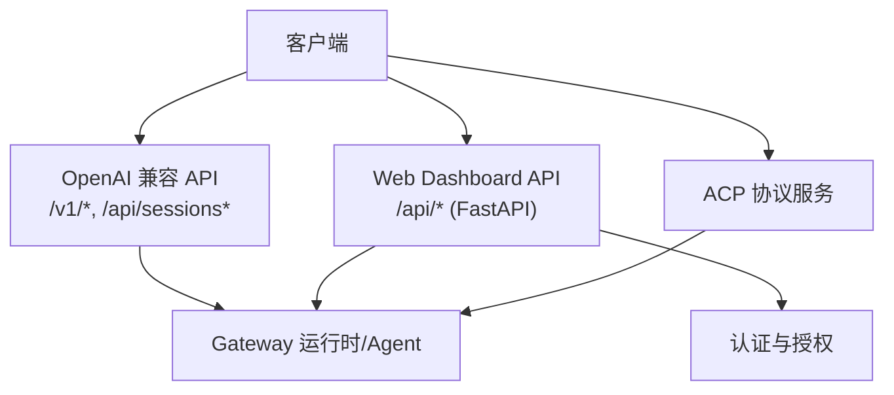
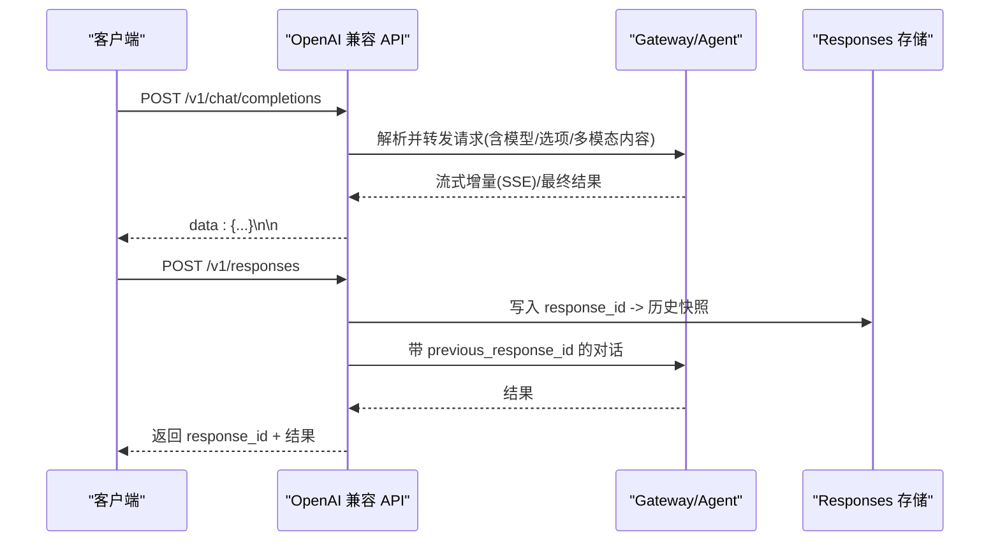
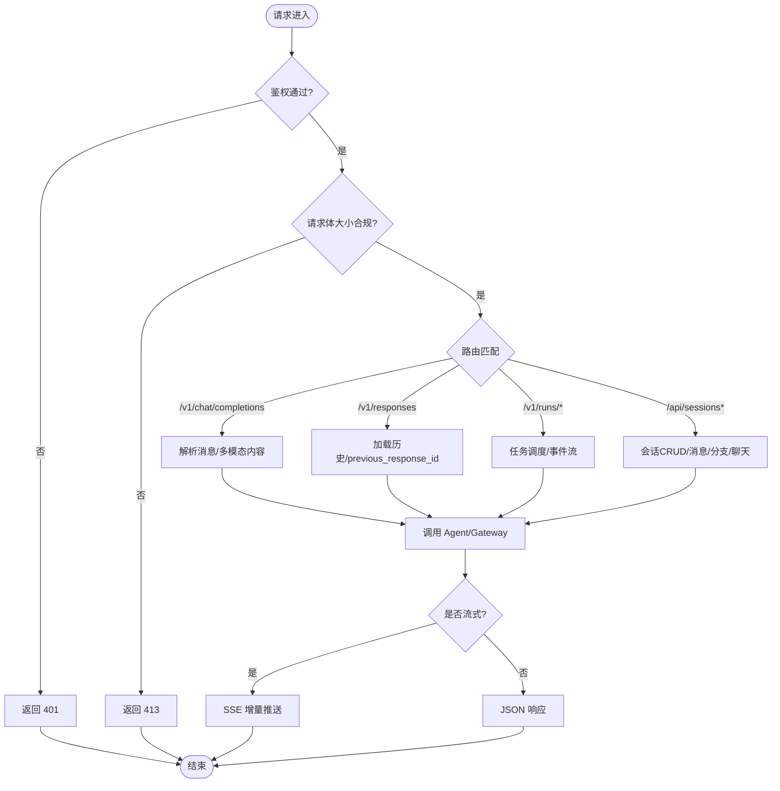
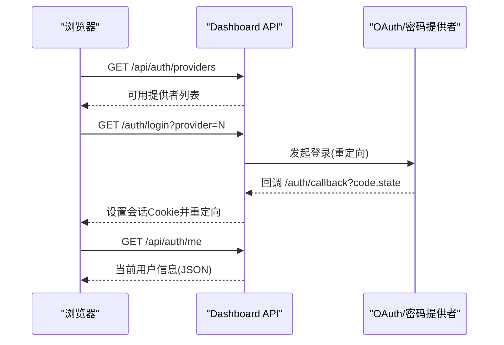
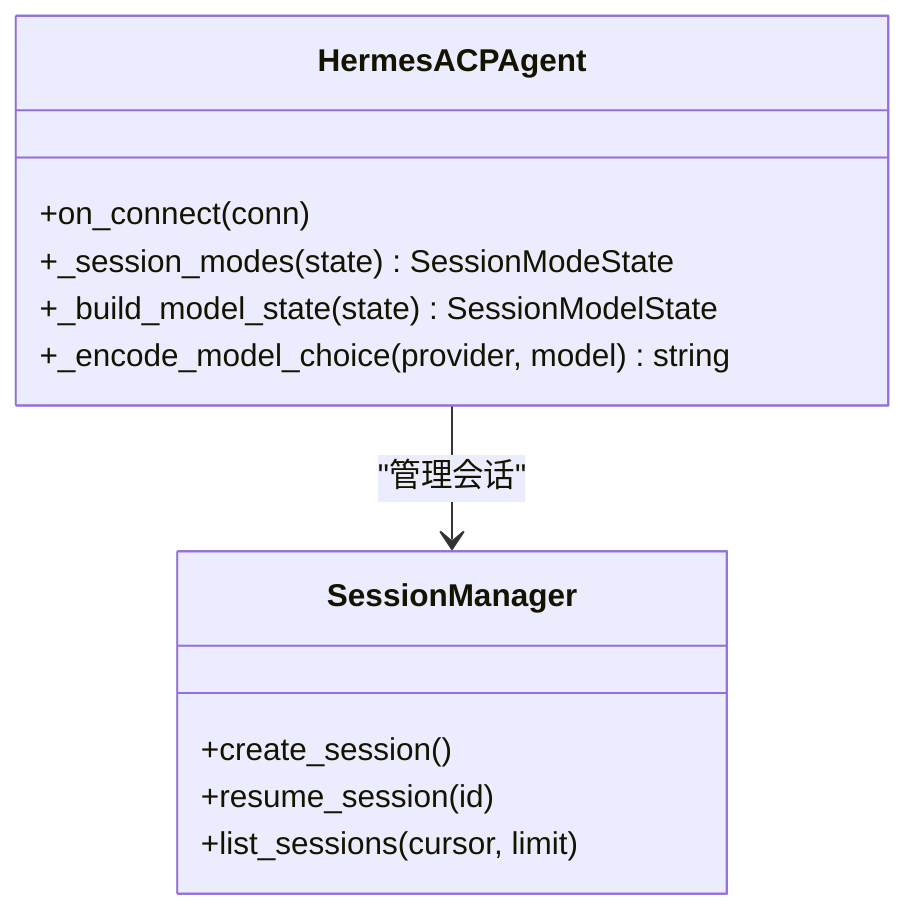
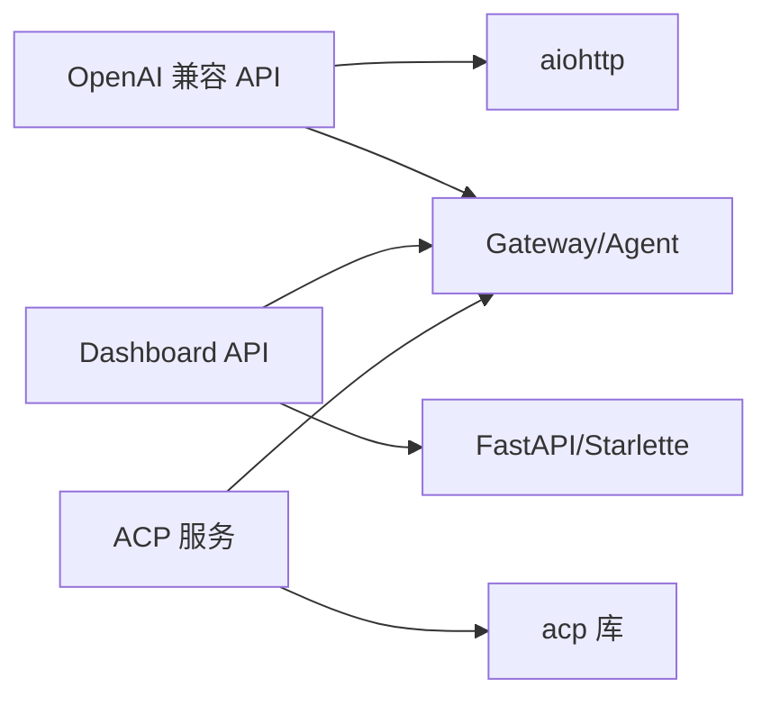

# REST API

<cite>
**本文引用的文件**
- [gateway/platforms/api_server.py](file://gateway/platforms/api_server.py)
- [sparkii_cli/web_server.py](file://sparkii_cli/web_server.py)
- [acp_adapter/server.py](file://acp_adapter/server.py)
- [tui_gateway/server.py](file://tui_gateway/server.py)
- [sparkii_cli/dashboard_auth/routes.py](file://sparkii_cli/dashboard_auth/routes.py)
</cite>

## 目录
1. [简介](#简介)
2. [项目结构](#项目结构)
3. [核心组件](#核心组件)
4. [架构总览](#架构总览)
5. [详细组件分析](#详细组件分析)
6. [依赖关系分析](#依赖关系分析)
7. [性能与限流](#性能与限流)
8. [故障排查指南](#故障排查指南)
9. [结论](#结论)
10. [附录：客户端集成与最佳实践](#附录客户端集成与最佳实践)

## 简介
本文件为 Sparkii Agent 的 REST API 文档，覆盖三类对外接口：
- OpenAI 兼容 HTTP API（会话、模型、能力、运行任务等）
- Web Dashboard 管理 API（配置、环境、会话、认证等）
- ACP 协议服务（Agent Client Protocol，面向编辑器/IDE 的会话与工具调用）

文档包含端点清单、请求/响应格式、认证与权限、错误码、版本兼容性、限流与安全建议，以及客户端集成示例和最佳实践。

## 项目结构
- gateway/platforms/api_server.py：OpenAI 兼容 HTTP 服务器，提供 /v1/* 与 /api/sessions*、健康检查等端点，支持 SSE 流式输出、Runs 异步任务、Responses 持久化存储。
- sparkii_cli/web_server.py：FastAPI 后端，承载 Web UI 与 /api/* 管理接口，内置鉴权中间件、CORS、Host 校验、插件路由门控、健康自检。
- acp_adapter/server.py：ACP 协议实现，封装 Hermes Agent，暴露会话、模型选择、工具执行、资源附件等能力。
- tui_gateway/server.py：TUI/Gateway 内部 RPC 网关，负责长耗时操作线程池隔离、会话生命周期、子进程管理与崩溃日志。
- sparkii_cli/dashboard_auth/routes.py：Dashboard OAuth/密码登录流程、提供者列表、当前用户信息、WS 票据等认证相关端点。

**图示来源**
- [gateway/platforms/api_server.py:1-40](file://gateway/platforms/api_server.py#L1-L40)
- [sparkii_cli/web_server.py:1-10](file://sparkii_cli/web_server.py#L1-L10)
- [acp_adapter/server.py:1-80](file://acp_adapter/server.py#L1-L80)

**章节来源**
- [gateway/platforms/api_server.py:1-40](file://gateway/platforms/api_server.py#L1-L40)
- [sparkii_cli/web_server.py:1-10](file://sparkii_cli/web_server.py#L1-L10)

## 核心组件
- OpenAI 兼容 API 服务器
  - 会话与消息：/api/sessions、/api/sessions/{id}/messages、/api/sessions/{id}/chat[/stream]
  - 模型与能力：/v1/models、/v1/capabilities
  - 运行任务：/v1/runs、/v1/runs/{run_id}、/v1/runs/{run_id}/events、/v1/runs/{run_id}/approval、/v1/runs/{run_id}/stop
  - Responses API：/v1/responses、/v1/responses/{response_id}
  - 健康检查：/health、/health/detailed
- Web Dashboard API
  - 认证：/login、/auth/login、/auth/callback、/auth/logout、/api/auth/providers、/api/auth/me、/auth/password-login
  - 其他管理端点由 web_server.py 注册（配置、环境、会话等），受统一鉴权中间件保护
- ACP 协议服务
  - 会话创建/恢复/列举、模型选择、工具执行、资源附件、命令（help/model/tools/context/reset/compress/steer/queue/version）

**章节来源**
- [gateway/platforms/api_server.py:1-40](file://gateway/platforms/api_server.py#L1-L40)
- [sparkii_cli/dashboard_auth/routes.py:1-15](file://sparkii_cli/dashboard_auth/routes.py#L1-L15)
- [acp_adapter/server.py:566-621](file://acp_adapter/server.py#L566-L621)

## 架构总览

**图示来源**
- [gateway/platforms/api_server.py:187-206](file://gateway/platforms/api_server.py#L187-L206)
- [gateway/platforms/api_server.py:816-982](file://gateway/platforms/api_server.py#L816-L982)

## 详细组件分析

### OpenAI 兼容 API（/v1/* 与 /api/sessions*）
- 端点概览
  - GET /v1/models：列出虚拟模型与别名
  - GET /v1/capabilities：机器可读能力描述
  - POST /v1/chat/completions：聊天补全（支持 stream）
  - POST /v1/responses：Responses API（stateful，previous_response_id）
  - GET /v1/responses/{response_id}：获取已存储响应
  - DELETE /v1/responses/{response_id}：删除已存储响应
  - POST /v1/runs：启动任务（立即返回 202）
  - GET /v1/runs/{run_id}：查询任务状态
  - GET /v1/runs/{run_id}/events：SSE 事件流
  - POST /v1/runs/{run_id}/approval：审批
  - POST /v1/runs/{run_id}/stop：中断
  - GET /api/sessions：列出会话
  - POST /api/sessions：创建空会话
  - GET/PATCH/DELETE /api/sessions/{session_id}：读取/更新/删除
  - GET /api/sessions/{session_id}/messages：读取消息历史
  - POST /api/sessions/{session_id}/fork：分支会话
  - POST /api/sessions/{session_id}/chat[/stream]：与持久化会话聊天（可流式）
  - GET /health、GET /health/detailed：健康检查

- 认证与权限
  - 通过 API_SERVER_KEY 或平台配置的鉴权机制进行验证；中间件在请求进入前完成鉴权与 draining 检查
  - 支持跨域（CORS）预检与头控制

- 请求参数与响应格式（要点）
  - chat/completions：支持 messages、model、provider、model_options、stream 等；content 可为字符串或多模态数组（text/image_url）
  - responses：支持 previous_response_id 维持上下文；history 自动截断以保留压缩摘要
  - runs：POST 返回 run_id；GET 返回状态；events 使用 SSE 推送结构化事件；approval 支持 once/session/always/deny 等策略
  - sessions：标准 CRUD 与 fork/chat 扩展

- 错误处理
  - 统一 OpenAI 风格错误体：{ error: { message, type, param, code } }
  - 常见错误码：400（无效请求）、401（未授权）、403（禁止）、413（请求体过大）、429（限流）、5xx（服务端错误）

- 版本与兼容性
  - 遵循 OpenAI Chat Completions/Responses 约定；支持 provider/model 覆盖；虚拟模型“sparkii-agent”作为默认入口
  - 多租户/多 profile 可通过 URL 前缀 /p/<profile>/ 访问

**图示来源**
- [gateway/platforms/api_server.py:1162-1185](file://gateway/platforms/api_server.py#L1162-L1185)
- [gateway/platforms/api_server.py:1090-1099](file://gateway/platforms/api_server.py#L1090-L1099)
- [gateway/platforms/api_server.py:439-475](file://gateway/platforms/api_server.py#L439-L475)

**章节来源**
- [gateway/platforms/api_server.py:1-40](file://gateway/platforms/api_server.py#L1-L40)
- [gateway/platforms/api_server.py:816-982](file://gateway/platforms/api_server.py#L816-L982)
- [gateway/platforms/api_server.py:1090-1099](file://gateway/platforms/api_server.py#L1090-L1099)
- [gateway/platforms/api_server.py:1162-1185](file://gateway/platforms/api_server.py#L1162-L1185)

### Web Dashboard API（/api/*）
- 认证与授权
  - 本地回环绑定：注入临时会话令牌到前端，通过 X-Hermes-Session-Token 或 Bearer 头校验
  - 非回环绑定：启用 OAuth/密码登录门控，基于 Cookie 会话
  - Host 头校验防止 DNS Rebinding；CORS 限制为 localhost/127.0.0.1
  - 插件 API 动态门控：运行时禁用插件时拒绝对应路由

- 主要端点
  - 认证流程：/login、/auth/login、/auth/callback、/auth/logout、/api/auth/providers、/api/auth/me、/auth/password-login
  - 管理端点：配置、环境变量、会话管理等（由 web_server.py 注册，受统一鉴权保护）

- 安全与限流
  - 密码登录滑动窗口限流（每 IP 每分钟最多尝试次数）
  - 敏感端点需会话令牌或已通过门控认证的会话

**图示来源**
- [sparkii_cli/dashboard_auth/routes.py:152-174](file://sparkii_cli/dashboard_auth/routes.py#L152-L174)
- [sparkii_cli/dashboard_auth/routes.py:182-245](file://sparkii_cli/dashboard_auth/routes.py#L182-L245)
- [sparkii_cli/dashboard_auth/routes.py:379-558](file://sparkii_cli/dashboard_auth/routes.py#L379-L558)
- [sparkii_cli/dashboard_auth/routes.py:650-739](file://sparkii_cli/dashboard_auth/routes.py#L650-L739)
- [sparkii_cli/dashboard_auth/routes.py:778-791](file://sparkii_cli/dashboard_auth/routes.py#L778-L791)

**章节来源**
- [sparkii_cli/web_server.py:320-468](file://sparkii_cli/web_server.py#L320-L468)
- [sparkii_cli/web_server.py:538-671](file://sparkii_cli/web_server.py#L538-L671)
- [sparkii_cli/dashboard_auth/routes.py:1-15](file://sparkii_cli/dashboard_auth/routes.py#L1-L15)

### ACP 协议服务
- 功能概述
  - 会话：创建、恢复、列举、模式切换（编辑审批策略映射为模式）
  - 模型：从共享库存构建可用模型列表，支持自定义命名端点
  - 工具：工具开始/完成事件、进度、思考过程、消息块
  - 资源：文本/图片附件，支持 data URL 与本地文件 URI 转换

- 典型交互
  - 初始化连接 → 列举会话 → 创建/恢复会话 → 发送提示（文本/图片/资源）→ 接收增量消息/工具调用 → 结束会话

**图示来源**
- [acp_adapter/server.py:566-621](file://acp_adapter/server.py#L566-L621)
- [acp_adapter/server.py:637-686](file://acp_adapter/server.py#L637-L686)
- [acp_adapter/server.py:688-799](file://acp_adapter/server.py#L688-L799)

**章节来源**
- [acp_adapter/server.py:1-80](file://acp_adapter/server.py#L1-L80)
- [acp_adapter/server.py:566-621](file://acp_adapter/server.py#L566-L621)
- [acp_adapter/server.py:688-799](file://acp_adapter/server.py#L688-L799)

### TUI/Gateway 内部网关（辅助说明）
- 职责
  - 将慢速 RPC 路由到线程池，避免阻塞主循环
  - 会话生命周期管理、子进程管理、崩溃日志记录
  - 活跃会话槽位分配与释放，避免空闲标签占用资源

- 与 REST API 的关系
  - 为 Dashboard/TUI 提供底层 RPC 支撑；REST 层通过 web_server.py 调用或桥接至该网关

**章节来源**
- [tui_gateway/server.py:184-296](file://tui_gateway/server.py#L184-L296)
- [tui_gateway/server.py:332-466](file://tui_gateway/server.py#L332-L466)
- [tui_gateway/server.py:512-623](file://tui_gateway/server.py#L512-L623)

## 依赖关系分析
- OpenAI 兼容 API 依赖 aiohttp；若不可用则降级
- Dashboard API 依赖 FastAPI/Starlette；首次使用时按需安装
- ACP 依赖 acp 包与 Hermes Agent 包装器
- 所有服务均与 Gateway/Agent 运行时交互，共享会话、模型、工具与审批策略

**图示来源**
- [gateway/platforms/api_server.py:79-84](file://gateway/platforms/api_server.py#L79-L84)
- [sparkii_cli/web_server.py:103-133](file://sparkii_cli/web_server.py#L103-L133)
- [acp_adapter/server.py:18-63](file://acp_adapter/server.py#L18-L63)

**章节来源**
- [gateway/platforms/api_server.py:79-84](file://gateway/platforms/api_server.py#L79-L84)
- [sparkii_cli/web_server.py:103-133](file://sparkii_cli/web_server.py#L103-L133)
- [acp_adapter/server.py:18-63](file://acp_adapter/server.py#L18-L63)

## 性能与限流
- 请求体大小限制：早期基于 Content-Length 拦截，超过阈值返回 413
- SSE 心跳与流式传输：统一帧编码，减少延迟
- 响应存储 LRU：SQLite-backed，按访问时间淘汰，最大条目数可控
- 多模态内容规范化：限制递归深度、列表长度与文本长度，防滥用
- Dashboard 密码登录：滑动窗口限流，防止暴力破解
- 长耗时 RPC：TUI/Gateway 使用线程池隔离，避免阻塞主循环

**章节来源**
- [gateway/platforms/api_server.py:1162-1185](file://gateway/platforms/api_server.py#L1162-L1185)
- [gateway/platforms/api_server.py:187-206](file://gateway/platforms/api_server.py#L187-L206)
- [gateway/platforms/api_server.py:816-982](file://gateway/platforms/api_server.py#L816-L982)
- [gateway/platforms/api_server.py:477-539](file://gateway/platforms/api_server.py#L477-L539)
- [sparkii_cli/dashboard_auth/routes.py:609-634](file://sparkii_cli/dashboard_auth/routes.py#L609-L634)
- [tui_gateway/server.py:184-296](file://tui_gateway/server.py#L184-L296)

## 故障排查指南
- 常见错误
  - 400：请求参数非法（如缺失 message、多模态内容类型不支持）
  - 401：未携带有效会话令牌或鉴权失败
  - 403：CORS 源不被允许或 Host 头不匹配
  - 413：请求体过大
  - 429：密码登录尝试过多
  - 5xx：服务端异常（Dashboard 健康组件会记录最近错误计数）

- 诊断建议
  - 使用 /health 与 /health/detailed 检查服务就绪状态
  - 查看 Dashboard 健康快照中的 recent_unhandled_errors 与 last_error_at
  - 对于 ACP/Agent 侧问题，关注 SSE 事件流与工具调用进度
  - 对 Responses 持久化问题，检查 response_store.db 权限与 WAL 状态

**章节来源**
- [gateway/platforms/api_server.py:1090-1099](file://gateway/platforms/api_server.py#L1090-L1099)
- [sparkii_cli/web_server.py:695-768](file://sparkii_cli/web_server.py#L695-L768)
- [sparkii_cli/dashboard_auth/routes.py:609-634](file://sparkii_cli/dashboard_auth/routes.py#L609-L634)

## 结论
本仓库提供了三套互补的对外接口：OpenAI 兼容 API 便于通用前端接入；Dashboard API 提供管理与认证能力；ACP 协议服务于编辑器/IDE 场景。系统具备完善的鉴权、限流、错误处理与性能优化措施，适合在生产环境中部署与集成。

## 附录：客户端集成与最佳实践
- 认证
  - OpenAI 兼容 API：使用 API_SERVER_KEY 或平台配置密钥；必要时通过 Authorization 头传递
  - Dashboard API：本地回环模式使用 X-Hermes-Session-Token；非回环模式使用 OAuth/密码登录后 Cookie
- 会话与消息
  - 使用 /api/sessions 管理会话；/api/sessions/{id}/chat 进行对话；需要流式时使用 /stream 后缀
  - 使用 /v1/chat/completions 进行无状态对话；如需上下文延续可使用 X-Hermes-Session-Id
- 运行任务
  - 使用 /v1/runs 启动任务并轮询状态；通过 /events 订阅 SSE 事件；必要时提交审批或停止
- 多模态内容
  - 支持 text 与 image_url 部分；确保图片 URL 为 http(s) 或 data:image/*；避免超大图片
- 错误处理
  - 统一解析 error 对象；重试策略建议针对 429/5xx 指数退避
- 安全
  - 仅允许 localhost/127.0.0.1 的 CORS；严格 Host 头校验；避免在非回环绑定下暴露敏感端点
- 性能
  - 合理设置 max_tokens、model_options；利用 Responses previous_response_id 维护上下文；避免过大的请求体

[本节为通用指导，无需特定文件引用]