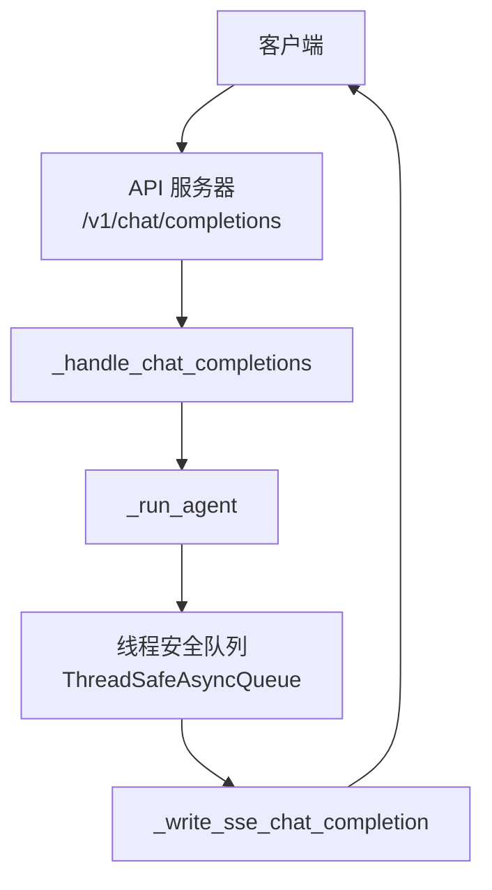
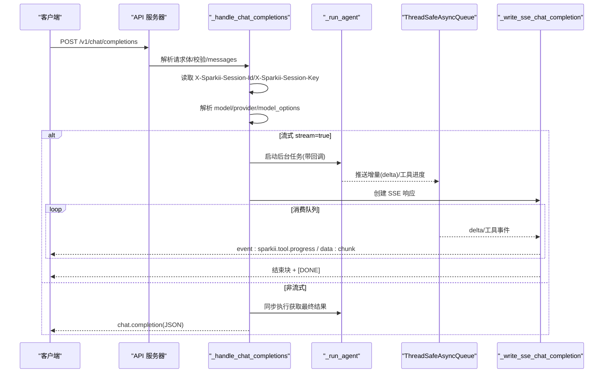
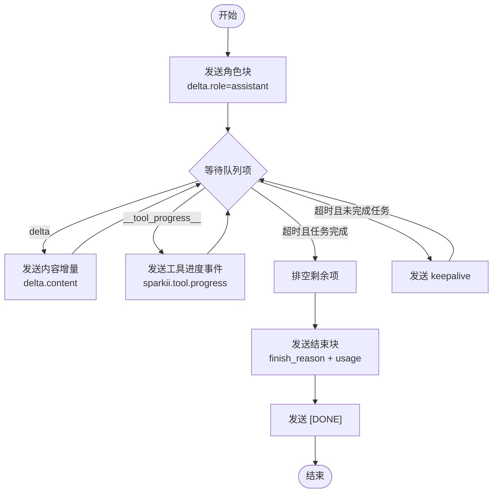
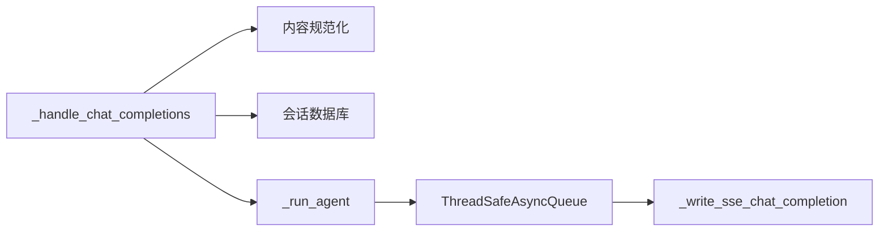

# 聊天完成API

<cite>
**本文引用的文件**
- [gateway/platforms/api_server.py](file://gateway/platforms/api_server.py)
</cite>

## 目录
1. [简介](#简介)
2. [项目结构](#项目结构)
3. [核心组件](#核心组件)
4. [架构总览](#架构总览)
5. [详细组件分析](#详细组件分析)
6. [依赖关系分析](#依赖关系分析)
7. [性能考量](#性能考量)
8. [故障排查指南](#故障排查指南)
9. [结论](#结论)
10. [附录](#附录)

## 简介
本文件为 OpenAI 兼容的 /v1/chat/completions 端点的权威文档。该端点由网关平台的 API 服务器实现，支持：
- POST 方法
- 请求体包含 messages、model、stream 等参数
- 非流式与流式（SSE）两种响应模式
- 推理配置与服务层级设置
- 与 Sparkii 会话系统的集成（X-Sparkii-Session-Id、X-Sparkii-Session-Key）
- 认证方式与错误处理机制
- 客户端集成示例与最佳实践

## 项目结构
- 该端点位于 gateway/platforms/api_server.py 中，作为 OpenAI 兼容平台适配器的一部分对外暴露。
- 路由注册将 POST /v1/chat/completions 映射到内部处理器 _handle_chat_completions。
- 流式响应通过 SSE 事件输出，使用统一的帧编码函数生成数据帧。

图表来源
- [gateway/platforms/api_server.py:4021-4263](file://gateway/platforms/api_server.py#L4021-L4263)
- [gateway/platforms/api_server.py:4381-4573](file://gateway/platforms/api_server.py#L4381-L4573)

章节来源
- [gateway/platforms/api_server.py:1-40](file://gateway/platforms/api_server.py#L1-L40)
- [gateway/platforms/api_server.py:4021-4263](file://gateway/platforms/api_server.py#L4021-L4263)
- [gateway/platforms/api_server.py:4381-4573](file://gateway/platforms/api_server.py#L4381-L4573)

## 核心组件
- 请求解析与校验
  - 解析 JSON 请求体，校验 messages 字段必须存在且为数组。
  - 提取 system/user/assistant 消息，system 内容会被合并为临时系统提示；user/assistant 内容会进行多模态规范化。
  - 若最后一条 user 消息为空或无可见负载，返回 400 错误。
- 会话与长期记忆作用域
  - X-Sparkii-Session-Id：可选，用于继续已有会话并加载历史消息；需要启用 API 密钥认证才允许。
  - X-Sparkii-Session-Key：可选，用于跨会话的长期记忆作用域隔离。
- 模型与路由选择
  - model 字段决定虚拟模型或具体模型；支持 provider/model_options 覆盖。
  - 服务层级 service_tier 可通过 model_options 指定，或 fast=true 映射为 priority。
  - 推理配置 reasoning_config 可从 model_options.reasoning 或 reasoning_effort 推导。
- 执行与响应
  - 非流式：调用 _run_agent 得到最终结果，构造 chat.completion 响应，附加 usage 与扩展字段 sparkii。
  - 流式：通过 SSE 发送角色块、增量内容块、工具进度事件、结束块与 [DONE]。
- 幂等性
  - 支持 Idempotency-Key 头，对相同指纹的请求缓存结果。

章节来源
- [gateway/platforms/api_server.py:4021-4167](file://gateway/platforms/api_server.py#L4021-L4167)
- [gateway/platforms/api_server.py:4169-4263](file://gateway/platforms/api_server.py#L4169-L4263)
- [gateway/platforms/api_server.py:4265-4379](file://gateway/platforms/api_server.py#L4265-L4379)
- [gateway/platforms/api_server.py:4381-4573](file://gateway/platforms/api_server.py#L4381-L4573)

## 架构总览
下图展示了从客户端请求到代理执行再到 SSE 响应的完整流程，包括会话加载、模型路由、流式事件与终止逻辑。

图表来源
- [gateway/platforms/api_server.py:4021-4263](file://gateway/platforms/api_server.py#L4021-L4263)
- [gateway/platforms/api_server.py:4381-4573](file://gateway/platforms/api_server.py#L4381-L4573)

## 详细组件分析

### 端点定义与路由
- 路径与方法：POST /v1/chat/completions
- 路由注册：在平台适配器的路由表中将该路径绑定到 _handle_chat_completions。
- 能力说明：提供 OpenAI Chat Completions 格式，支持状态无关调用，并通过可选头实现会话延续与长期记忆作用域。

章节来源
- [gateway/platforms/api_server.py:1-40](file://gateway/platforms/api_server.py#L1-L40)
- [gateway/platforms/api_server.py:2066-2066](file://gateway/platforms/api_server.py#L2066-L2066)

### 请求体结构与参数
- messages：必需，数组。元素包含 role 与 content。
  - role：system、user、assistant。
  - content：字符串或多部分对象（text/image_url）。
- model：可选，虚拟模型名或具体模型标识；可与 provider 配合。
- stream：可选，布尔或可被识别为布尔的字符串；true 时启用 SSE 流式响应。
- provider：可选，运行时提供者覆盖。
- model_options：可选，包含：
  - reasoning：{enabled, effort} 或 reasoning_effort 标量，控制推理开关与强度。
  - service_tier：字符串或 null；fast=true 映射为 priority。
- tools/tool_choice：可选，参与幂等指纹计算。
- Idempotency-Key：可选，用于幂等缓存。

章节来源
- [gateway/platforms/api_server.py:4028-4167](file://gateway/platforms/api_server.py#L4028-L4167)
- [gateway/platforms/api_server.py:4265-4284](file://gateway/platforms/api_server.py#L4265-L4284)

### 头部与会话集成
- X-Sparkii-Session-Id：可选，用于继续已有会话并加载历史消息。
  - 需要 API 密钥认证；否则返回 403。
  - 会对 session ID 做安全检查（禁止控制字符、路径穿越等）。
- X-Sparkii-Session-Key：可选，用于长期记忆作用域隔离；独立于会话 ID。
- 响应头：
  - X-Sparkii-Session-Id：本次运行使用的会话 ID。
  - X-Sparkii-Session-Key：回显当前作用域键。
  - X-Sparkii-Completed/X-Sparkii-Partial/X-Sparkii-Error：非成功或截断时的扩展信息。

章节来源
- [gateway/platforms/api_server.py:4078-4144](file://gateway/platforms/api_server.py#L4078-L4144)
- [gateway/platforms/api_server.py:4318-4323](file://gateway/platforms/api_server.py#L4318-L4323)
- [gateway/platforms/api_server.py:4403-4406](file://gateway/platforms/api_server.py#L4403-L4406)

### 模型选项与推理配置
- 推理配置：
  - 支持 reasoning.enabled 与 reasoning.effort，或兼容的 reasoning_effort 标量。
  - 有效值包括 none/minimal/low/medium/high/xhigh；none 或 enabled=false 表示关闭推理。
- 服务层级：
  - model_options.service_tier 可直接指定；或 fast=true 映射为 priority。
- 运行时覆盖：
  - 支持通过 provider/model/model_options 覆盖单次请求的运行时配置。

章节来源
- [gateway/platforms/api_server.py:268-309](file://gateway/platforms/api_server.py#L268-L309)
- [gateway/platforms/api_server.py:371-409](file://gateway/platforms/api_server.py#L371-L409)

### 非流式响应
- 成功响应：
  - object: chat.completion
  - choices[0].message.role: assistant
  - choices[0].finish_reason: stop/length/error
  - usage: {prompt_tokens, completion_tokens, total_tokens}
  - sparkii: {completed, partial, failed, error, error_code}（当异常或截断时）
- 失败响应：
  - 若无可用文本且运行失败，返回 502 并附带 OpenAI 风格错误信封。
  - 软失败（有部分内容但未完成）返回 200，但 finish_reason=length 并附加 sparkii 扩展。

章节来源
- [gateway/platforms/api_server.py:4265-4379](file://gateway/platforms/api_server.py#L4265-L4379)

### 流式响应（SSE）
- 事件类型：
  - 初始角色块：delta.role=assistant
  - 内容增量块：delta.content=文本片段
  - 工具进度事件：event=sparkii.tool.progress，携带 tool、toolCallId、status(running/completed)、label、emoji
  - 结束块：finish_reason=stop/length/error，usage 汇总
  - 终止标记：data: [DONE]
- 保活：
  - 空闲超过阈值时会发送 keepalive 注释行，避免中间设备断开连接。
- 中断与清理：
  - 客户端断开时中断代理并取消任务，回收后台进程。

图表来源
- [gateway/platforms/api_server.py:4381-4573](file://gateway/platforms/api_server.py#L4381-L4573)

章节来源
- [gateway/platforms/api_server.py:4169-4263](file://gateway/platforms/api_server.py#L4169-L4263)
- [gateway/platforms/api_server.py:4381-4573](file://gateway/platforms/api_server.py#L4381-L4573)

### 错误处理机制
- 请求级错误：
  - JSON 解析失败：400 invalid_request_error
  - messages 缺失或无效：400 invalid_request_error
  - 无用户消息：400 invalid_request_error
  - 多模态内容非法：400 invalid_content_part/unsupported_content_type/invalid_image_url
  - 会话延续未认证：403
  - 会话 ID 不合法：400
- 运行级错误：
  - 代理崩溃或失败：非流式返回 502 或 200（含 sparkii 扩展），流式在结束块中体现 finish_reason="error" 并附带错误信息。
- 幂等缓存异常：
  - 捕获并转换为 500 server_error。

章节来源
- [gateway/platforms/api_server.py:4028-4167](file://gateway/platforms/api_server.py#L4028-L4167)
- [gateway/platforms/api_server.py:4265-4379](file://gateway/platforms/api_server.py#L4265-L4379)
- [gateway/platforms/api_server.py:4481-4537](file://gateway/platforms/api_server.py#L4481-L4537)

### 认证方式
- API 密钥：
  - 当启用 API_SERVER_KEY 后，X-Sparkii-Session-Id 续会话功能才被允许。
  - 其他通用认证策略由网关层统一处理（例如鉴权中间件）。
- 会话作用域：
  - X-Sparkii-Session-Key 用于长期记忆作用域隔离，与会话 ID 解耦。

章节来源
- [gateway/platforms/api_server.py:4078-4144](file://gateway/platforms/api_server.py#L4078-L4144)

### 客户端集成示例与最佳实践
- 基本请求（非流式）：
  - 方法：POST
  - 路径：/v1/chat/completions
  - 头部：Content-Type: application/json；可选 Idempotency-Key
  - 主体：{messages:[...], model:"...", stream:false}
- 流式请求：
  - 主体添加 stream:true；客户端需按 SSE 协议消费事件，直到收到 [DONE]。
- 会话延续：
  - 首次请求可省略 X-Sparkii-Session-Id；后续请求携带该头以继续同一会话。
  - 如需跨会话共享长期记忆，设置 X-Sparkii-Session-Key。
- 模型与推理：
  - 通过 model 指定模型；通过 model_options.reasoning 或 reasoning_effort 控制推理。
  - 通过 model_options.service_tier 或 fast=true 调整服务层级。
- 错误处理：
  - 检查 finish_reason 与 sparkii 扩展字段；流式模式下关注结束块的 finish_reason 与 error 字段。
- 幂等性：
  - 对重复请求设置相同的 Idempotency-Key，服务端将基于请求指纹缓存结果。

章节来源
- [gateway/platforms/api_server.py:4021-4263](file://gateway/platforms/api_server.py#L4021-L4263)
- [gateway/platforms/api_server.py:4265-4379](file://gateway/platforms/api_server.py#L4265-L4379)
- [gateway/platforms/api_server.py:4381-4573](file://gateway/platforms/api_server.py#L4381-L4573)

## 依赖关系分析
- 模块内依赖：
  - 请求解析与校验：_handle_chat_completions
  - 多模态内容规范化：_normalize_multimodal_content/_normalize_chat_content
  - 会话与持久化：_ensure_session_db_async/get_messages_as_conversation
  - 流式传输：ThreadSafeAsyncQueue/_sse_frame/_write_sse_chat_completion
  - 代理执行：_run_agent（外部入口）
- 外部集成：
  - 网关会话数据库（SQLite）
  - 进程注册表（用于后台进程回收）
  - 运行时提供者解析（provider/model 路由）

图表来源
- [gateway/platforms/api_server.py:4021-4263](file://gateway/platforms/api_server.py#L4021-L4263)
- [gateway/platforms/api_server.py:4381-4573](file://gateway/platforms/api_server.py#L4381-L4573)

章节来源
- [gateway/platforms/api_server.py:4021-4263](file://gateway/platforms/api_server.py#L4021-L4263)
- [gateway/platforms/api_server.py:4381-4573](file://gateway/platforms/api_server.py#L4381-L4573)

## 性能考量
- 并发限制：
  - 入站请求受并发上限保护，避免过载。
- 流式优化：
  - 使用线程安全队列与 call_soon_threadsafe 降低延迟，避免轮询开销。
  - 空闲保活防止中间设备断开连接。
- 内存与长度限制：
  - 对归一化文本与内容列表大小进行限制，防止滥用。
- 幂等缓存：
  - 对相同指纹的请求进行缓存，减少重复计算。

章节来源
- [gateway/platforms/api_server.py:161-185](file://gateway/platforms/api_server.py#L161-L185)
- [gateway/platforms/api_server.py:4381-4573](file://gateway/platforms/api_server.py#L4381-L4573)
- [gateway/platforms/api_server.py:4265-4284](file://gateway/platforms/api_server.py#L4265-L4284)

## 故障排查指南
- 常见错误码与原因：
  - 400：JSON 解析失败、messages 缺失/无效、无用户消息、多模态内容非法、会话 ID 不合法。
  - 403：会话延续未启用 API 密钥认证。
  - 500：幂等缓存异常或内部错误。
  - 502：代理运行失败且无可用文本。
- 诊断要点：
  - 检查 finish_reason 与 sparkii 扩展字段，定位截断或失败原因。
  - 流式模式下确认是否收到 [DONE]；若未收到，检查客户端断开与代理中断日志。
  - 核对 X-Sparkii-Session-Id 与 X-Sparkii-Session-Key 是否正确传递。
- 恢复建议：
  - 重试带 Idempotency-Key 的请求以获得幂等结果。
  - 对于截断，适当增加 max_tokens 或调整推理配置。

章节来源
- [gateway/platforms/api_server.py:4028-4167](file://gateway/platforms/api_server.py#L4028-L4167)
- [gateway/platforms/api_server.py:4265-4379](file://gateway/platforms/api_server.py#L4265-L4379)
- [gateway/platforms/api_server.py:4481-4573](file://gateway/platforms/api_server.py#L4481-L4573)

## 结论
/v1/chat/completions 提供了稳定、可扩展的 OpenAI 兼容接口，支持非流式与流式响应、会话延续与长期记忆作用域、推理配置与服务层级设置，以及完善的错误处理与幂等性保障。通过合理设置请求头与参数，可实现高可靠、低延迟的聊天完成调用。

## 附录
- 关键常量与默认值：
  - 最大请求字节数、SSE 保活间隔、文本长度限制等。
- 相关端点：
  - /v1/responses、/v1/models、/v1/capabilities 等。

章节来源
- [gateway/platforms/api_server.py:149-158](file://gateway/platforms/api_server.py#L149-L158)
- [gateway/platforms/api_server.py:1-40](file://gateway/platforms/api_server.py#L1-L40)