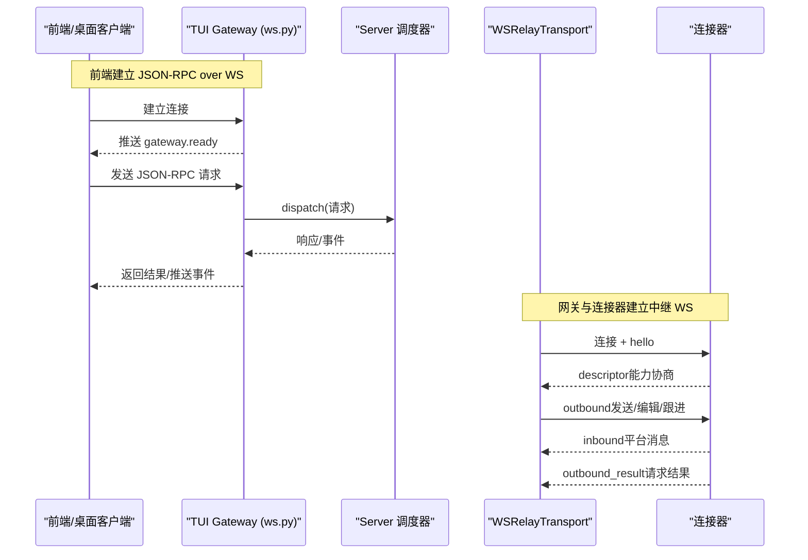
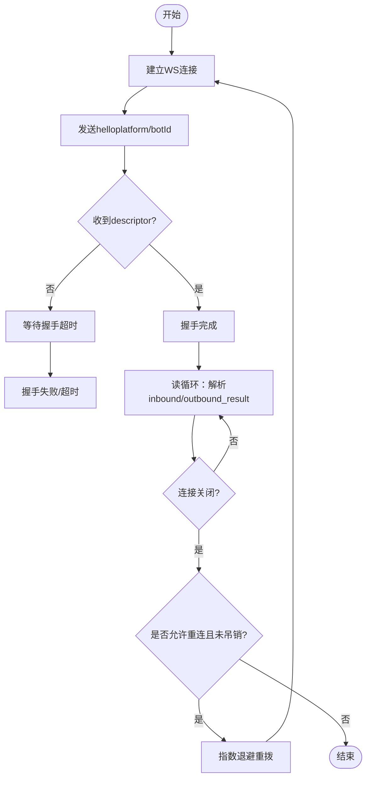
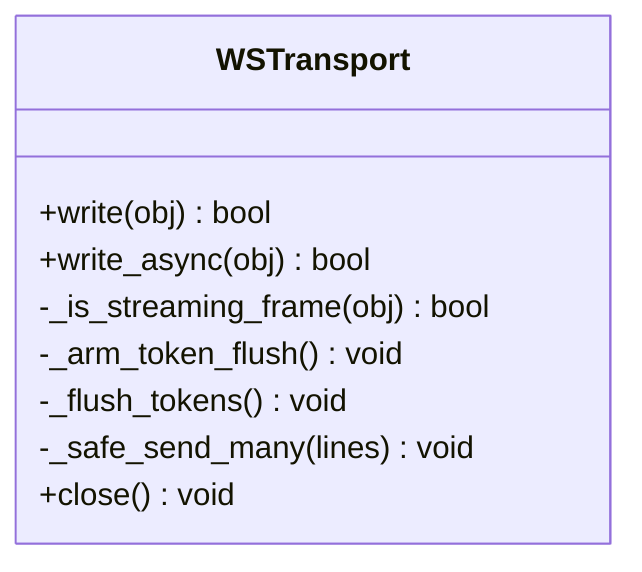
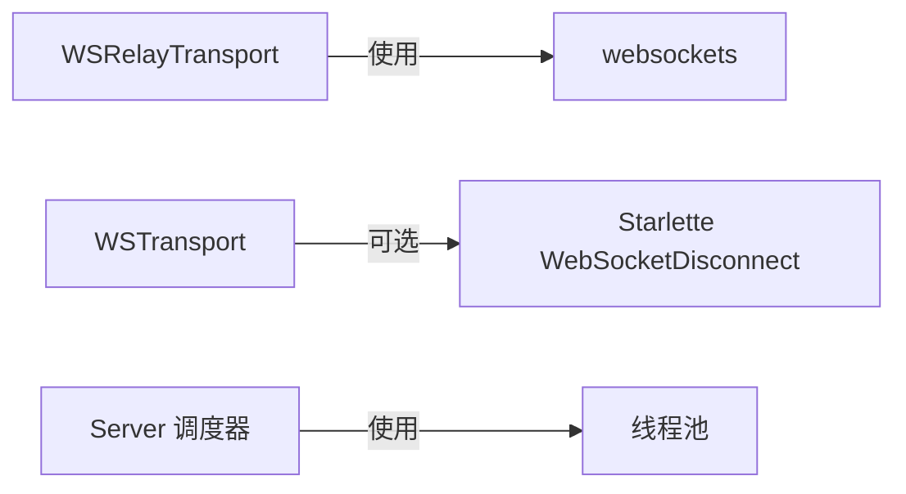

# WebSocket API

<cite>
**本文引用的文件**
- [gateway/relay/ws_transport.py](file://gateway/relay/ws_transport.py)
- [tui_gateway/ws.py](file://tui_gateway/ws.py)
- [tui_gateway/server.py](file://tui_gateway/server.py)
- [tui_gateway/transport.py](file://tui_gateway/transport.py)
</cite>

## 目录
1. [简介](#简介)
2. [项目结构](#项目结构)
3. [核心组件](#核心组件)
4. [架构总览](#架构总览)
5. [详细组件分析](#详细组件分析)
6. [依赖关系分析](#依赖关系分析)
7. [性能考量](#性能考量)
8. [故障排除指南](#故障排除指南)
9. [结论](#结论)
10. [附录](#附录)

## 简介
本文件面向本项目中的两类 WebSocket 能力，提供端到端、可操作的 API 文档：
- 网关到连接器（Connector）的实时中继通道：用于平台消息的入站/出站转发、握手协商、断线重连与缓冲投递。
- TUI Gateway 的 JSON-RPC over WebSocket：用于桌面/Web 客户端与后端进行实时对话、进度更新、错误通知等交互。

文档涵盖连接建立、握手协议、帧格式、事件类型、安全认证、加密与性能优化策略，并提供客户端实现要点与调试排障建议。

## 项目结构
WebSocket 相关代码主要分布在两个子系统：
- gateway/relay：网关与连接器之间的 WebSocket 中继传输层，负责握手、帧编解码、请求-响应匹配、断线重连与“空闲/休眠”状态切换。
- tui_gateway：面向桌面/Web 前端的 JSON-RPC over WebSocket 服务，包含连接处理、流式事件合并、写路径保护与资源回收。

```mermaid
graph TB
subgraph "网关侧"
A["WSRelayTransport<br/>连接器中继"]
B["TUI WSTransport<br/>JSON-RPC"]
C["Server 调度器"]
end
subgraph "外部系统"
D["连接器Connector"]
E["前端/桌面客户端"]
end
E --> B
B --> C
A < --> D
```

图表来源
- [gateway/relay/ws_transport.py:339-541](file://gateway/relay/ws_transport.py#L339-L541)
- [tui_gateway/ws.py:70-332](file://tui_gateway/ws.py#L70-L332)
- [tui_gateway/server.py:184-296](file://tui_gateway/server.py#L184-L296)

章节来源
- [gateway/relay/ws_transport.py:1-800](file://gateway/relay/ws_transport.py#L1-L800)
- [tui_gateway/ws.py:1-477](file://tui_gateway/ws.py#L1-L477)
- [tui_gateway/server.py:1-800](file://tui_gateway/server.py#L1-L800)
- [tui_gateway/transport.py:1-220](file://tui_gateway/transport.py#L1-L220)

## 核心组件
- 连接器中继传输（WebSocketRelayTransport）
  - 负责与连接器建立 WebSocket 连接、发送 hello/descriptor 握手、收发 inbound/outbound/interrupt 帧、请求-响应匹配、断线自动重连、空闲/休眠模式切换、授权吊销检测。
- TUI WebSocket 传输（WSTransport）
  - 封装 per-connection 的 JSON-RPC 读写，支持高吞吐 token 流合并、线程安全写入、Nagle 禁用、写超时保护、关闭清理。
- Server 调度器
  - 将 WS 接入的请求分发到具体 RPC 方法；对长耗时方法使用线程池避免阻塞读循环；维护会话生命周期与资源回收。
- Transport 抽象
  - 统一 write/close 接口，支持 StdioTransport/TeeTransport，使同一套逻辑可复用至 stdio 与 WS 两种通道。

章节来源
- [gateway/relay/ws_transport.py:339-541](file://gateway/relay/ws_transport.py#L339-L541)
- [tui_gateway/ws.py:70-256](file://tui_gateway/ws.py#L70-L256)
- [tui_gateway/server.py:184-296](file://tui_gateway/server.py#L184-L296)
- [tui_gateway/transport.py:66-220](file://tui_gateway/transport.py#L66-L220)

## 架构总览
下图展示了两条典型数据通路：
- 平台消息经连接器通过 WS 到达网关，再进入内部消息总线。
- 前端通过 WS 向 TUI Gateway 发送 JSON-RPC 请求，服务端处理后以事件或响应返回。



图表来源
- [tui_gateway/ws.py:286-332](file://tui_gateway/ws.py#L286-L332)
- [tui_gateway/server.py:384-428](file://tui_gateway/server.py#L384-L428)
- [gateway/relay/ws_transport.py:441-541](file://gateway/relay/ws_transport.py#L441-L541)

## 详细组件分析

### 连接器中继传输（WebSocketRelayTransport）
- 连接建立与握手
  - URL 规范化为 ws(s)://…/relay。
  - 可选升级头携带基于每实例密钥的签名令牌，连接器据此鉴权。
  - 发送 hello（含 platform/botId），接收 descriptor（能力描述）。
- 帧格式（换行分隔 JSON）
  - 上行：hello、outbound（send/edit/follow_up）、interrupt、going_idle、inbound_ack
  - 下行：descriptor、inbound、outbound_result、interrupt_inbound
- 请求-响应匹配
  - outbound 携带 requestId，等待对应 outbound_result 完成 Future。
- 断线重连与空闲/休眠
  - 非预期断开时按指数退避重拨；支持 go_idle/go_dormant 配合连接器缓冲投递与唤醒。
- 授权吊销处理
  - 成功握手后收到 4401 视为密钥被撤销，停止重连并上报“已禁用”。



图表来源
- [gateway/relay/ws_transport.py:441-541](file://gateway/relay/ws_transport.py#L441-L541)
- [gateway/relay/ws_transport.py:731-800](file://gateway/relay/ws_transport.py#L731-L800)

章节来源
- [gateway/relay/ws_transport.py:69-96](file://gateway/relay/ws_transport.py#L69-L96)
- [gateway/relay/ws_transport.py:339-441](file://gateway/relay/ws_transport.py#L339-L441)
- [gateway/relay/ws_transport.py:536-561](file://gateway/relay/ws_transport.py#L536-L561)
- [gateway/relay/ws_transport.py:605-632](file://gateway/relay/ws_transport.py#L605-L632)
- [gateway/relay/ws_transport.py:692-729](file://gateway/relay/ws_transport.py#L692-L729)
- [gateway/relay/ws_transport.py:731-800](file://gateway/relay/ws_transport.py#L731-L800)

### TUI WebSocket 传输（WSTransport）
- 连接处理
  - 接受连接、禁用 Nagle、推送 gateway.ready、注册传输句柄。
- 流式事件合并
  - 高频 token 事件（message.delta/reasoning.delta/thinking.delta）在短定时器内批量合并发送，降低事件风暴开销。
- 线程安全写入
  - 从工作线程调用 write() 通过事件循环安全调度；写失败标记关闭并记录日志。
- 关闭与清理
  - 取消合并定时器、释放会话、关闭底层 socket。



图表来源
- [tui_gateway/ws.py:70-256](file://tui_gateway/ws.py#L70-L256)

章节来源
- [tui_gateway/ws.py:70-256](file://tui_gateway/ws.py#L70-L256)
- [tui_gateway/ws.py:286-332](file://tui_gateway/ws.py#L286-L332)
- [tui_gateway/ws.py:339-477](file://tui_gateway/ws.py#L339-L477)

### Server 调度器（tui_gateway.server）
- 长耗时 RPC 路由到线程池，避免阻塞 WS 读循环。
- 会话管理：创建/恢复/压缩/分支/终止，结合 WS 断开后的“停靠+回收”机制防止进程泄漏。
- 事件广播：skin.changed、agent.* 等事件通过当前传输下发。

章节来源
- [tui_gateway/server.py:184-296](file://tui_gateway/server.py#L184-L296)
- [tui_gateway/server.py:332-467](file://tui_gateway/server.py#L332-L467)
- [tui_gateway/server.py:661-800](file://tui_gateway/server.py#L661-L800)

### 传输抽象（tui_gateway.transport）
- Transport 协议：统一的 write/close 接口。
- StdioTransport：将 JSON-RPC 帧写入标准输出，区分“对端消失”与真实 I/O 错误。
- TeeTransport：主通道 + 多个旁路通道镜像写入，保证主路径不受慢旁路影响。

章节来源
- [tui_gateway/transport.py:66-220](file://tui_gateway/transport.py#L66-L220)

## 依赖关系分析
- 连接器中继传输依赖 websockets 库（可选导入），并在缺失时给出明确提示。
- TUI WS 依赖 Starlette 的 WebSocketDisconnect（可选导入），降级为通用异常。
- Server 依赖线程池执行长耗时 RPC，避免阻塞事件循环。



图表来源
- [gateway/relay/ws_transport.py:46-51](file://gateway/relay/ws_transport.py#L46-L51)
- [tui_gateway/ws.py:62-67](file://tui_gateway/ws.py#L62-L67)
- [tui_gateway/server.py:184-296](file://tui_gateway/server.py#L184-L296)

章节来源
- [gateway/relay/ws_transport.py:46-51](file://gateway/relay/ws_transport.py#L46-L51)
- [tui_gateway/ws.py:62-67](file://tui_gateway/ws.py#L62-L67)
- [tui_gateway/server.py:184-296](file://tui_gateway/server.py#L184-L296)

## 性能考量
- 流式事件合并：对 message.delta/reasoning.delta/thinking.delta 等高频事件进行短时批合并，显著降低事件风暴带来的 CPU/GIL 竞争。
- 禁用 Nagle：WS 连接设置 TCP_NODELAY，确保小帧即时发出，保持客户端渲染流畅度。
- 写超时保护：当事件循环卡顿导致写阻塞时，不直接判定连接死亡，而是留待后续重试，避免误杀活跃连接。
- 长耗时 RPC 分流：将慢操作放入线程池，保障快速路径（如中断、审批）不被阻塞。
- 连接器中继的重连退避与休眠模式：减少无效重拨，配合连接器缓冲投递提升可靠性。

章节来源
- [tui_gateway/ws.py:44-60](file://tui_gateway/ws.py#L44-L60)
- [tui_gateway/ws.py:268-284](file://tui_gateway/ws.py#L268-L284)
- [tui_gateway/ws.py:118-187](file://tui_gateway/ws.py#L118-L187)
- [tui_gateway/server.py:184-296](file://tui_gateway/server.py#L184-L296)
- [gateway/relay/ws_transport.py:791-800](file://gateway/relay/ws_transport.py#L791-L800)

## 故障排除指南
- 无法建立连接器中继连接
  - 检查 URL 是否以 /relay 结尾，scheme 是否为 ws/wss。
  - 确认连接器可达、端口开放、证书有效（wss）。
- 握手失败或无 descriptor
  - 检查 hello 字段是否正确（platform/botId）。
  - 若启用升级头鉴权，确认 gateway_id 与 upgrade_secret 配置正确。
- 频繁 4401 关闭
  - 成功握手后出现 4401 表示密钥被撤销，需重新注册实例或调整权限。
- 前端收不到 gateway.ready
  - 检查 WS 接受流程与皮肤初始化是否成功；查看 read/write 错误日志。
- 流式文本卡顿或延迟
  - 确认已禁用 Nagle；观察是否发生事件合并导致的批量延迟。
- 长耗时 RPC 导致界面假死
  - 确认该 RPC 是否在长任务列表中，必要时增加超时或拆分任务。

章节来源
- [gateway/relay/ws_transport.py:69-96](file://gateway/relay/ws_transport.py#L69-L96)
- [gateway/relay/ws_transport.py:486-501](file://gateway/relay/ws_transport.py#L486-L501)
- [gateway/relay/ws_transport.py:745-758](file://gateway/relay/ws_transport.py#L745-L758)
- [tui_gateway/ws.py:286-332](file://tui_gateway/ws.py#L286-L332)
- [tui_gateway/ws.py:268-284](file://tui_gateway/ws.py#L268-L284)

## 结论
本项目提供了两套互补的 WebSocket 能力：面向平台的连接器中继通道与面向前端的 JSON-RPC 通道。前者强调可靠握手、请求-响应匹配、断线重连与缓冲投递；后者强调低延迟、高吞吐、线程安全与优雅关闭。通过合理的帧设计、事件合并与超时保护，系统在稳定性与性能之间取得良好平衡。

## 附录

### 连接器中继帧规范（摘要）
- hello：{type, platform, botId}
- descriptor：{type, descriptor}
- inbound：{type, event, bufferId?}
- outbound：{type, requestId, action}
- outbound_result：{type, requestId, result}
- interrupt：{type, session_key, reason?}
- interrupt_inbound：{type, session_key, chat_id}
- going_idle/inbound_ack：用于空闲/缓冲模式控制与确认

章节来源
- [gateway/relay/ws_transport.py:1-28](file://gateway/relay/ws_transport.py#L1-L28)
- [gateway/relay/ws_transport.py:605-632](file://gateway/relay/ws_transport.py#L605-L632)
- [gateway/relay/ws_transport.py:680-690](file://gateway/relay/ws_transport.py#L680-L690)

### TUI JSON-RPC over WebSocket 事件与消息（摘要）
- 连接就绪：gateway.ready（含 skin/change_events）
- 流式事件：message.delta、reasoning.delta、thinking.delta（高频合并）
- 请求/响应：遵循 JSON-RPC 2.0 格式，错误码 -32700/-32603 等
- 会话事件：session.*、agent.* 等由 Server 派发

章节来源
- [tui_gateway/ws.py:286-332](file://tui_gateway/ws.py#L286-L332)
- [tui_gateway/ws.py:339-477](file://tui_gateway/ws.py#L339-L477)
- [tui_gateway/server.py:384-428](file://tui_gateway/server.py#L384-L428)

### 客户端实现要点（示例说明）
- 连接器中继客户端（Python）
  - 连接 URL 规范化为 ws(s)://host/relay。
  - 发送 hello，等待 descriptor，记录 requestId 并 await outbound_result。
  - 实现断线重连：捕获连接关闭，指数退避重拨；遇到 4401 则停止重连。
  - 支持 go_idle/go_dormant：在挂起/恢复场景下与连接器协作缓冲投递。
- TUI 前端客户端（JS/TS）
  - 建立 WS 连接，监听 gateway.ready。
  - 发送 JSON-RPC 请求，处理响应与事件。
  - 对 message.delta/reasoning.delta/thinking.delta 做节流/合并显示。
  - 处理断线重连与错误提示。

章节来源
- [gateway/relay/ws_transport.py:441-541](file://gateway/relay/ws_transport.py#L441-L541)
- [gateway/relay/ws_transport.py:692-729](file://gateway/relay/ws_transport.py#L692-L729)
- [tui_gateway/ws.py:286-332](file://tui_gateway/ws.py#L286-L332)
- [tui_gateway/ws.py:339-477](file://tui_gateway/ws.py#L339-L477)

### 安全与加密
- 连接器中继升级头鉴权：使用 per-gateway secret 生成签名令牌，作为 Authorization: Bearer 发送；连接器校验失败返回 4401。
- 传输加密：生产环境建议使用 wss（TLS），由反向代理或网关层提供。
- 敏感信息：避免在帧中明文传递密钥；仅传递必要标识与业务数据。

章节来源
- [gateway/relay/ws_transport.py:486-501](file://gateway/relay/ws_transport.py#L486-L501)
- [gateway/relay/ws_transport.py:745-758](file://gateway/relay/ws_transport.py#L745-L758)

### 调试工具与日志
- 连接器中继
  - 关注握手、inbound/outbound_result、4401 关闭等关键日志。
  - 使用最小化 hello/descriptor 测试链路连通性。
- TUI WS
  - 观察 gateway.ready、parse error、dispatch crash、send failure 等指标。
  - 通过 peer 标签定位客户端地址，便于问题复现。

章节来源
- [tui_gateway/ws.py:339-477](file://tui_gateway/ws.py#L339-L477)
- [gateway/relay/ws_transport.py:731-800](file://gateway/relay/ws_transport.py#L731-L800)