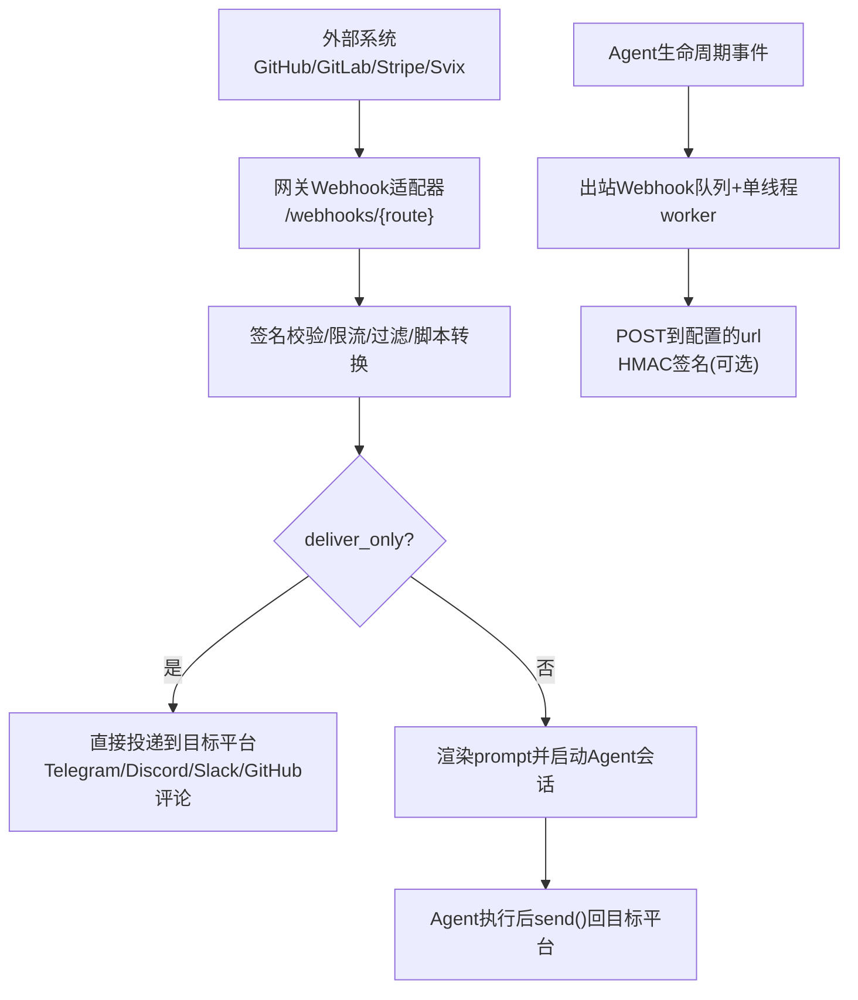
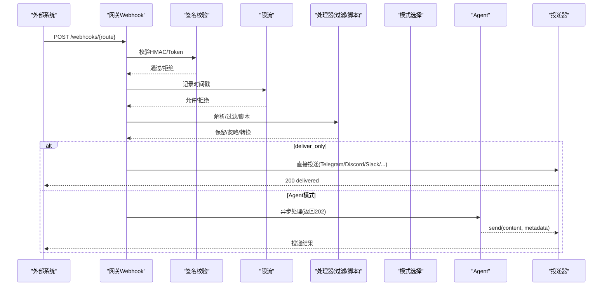
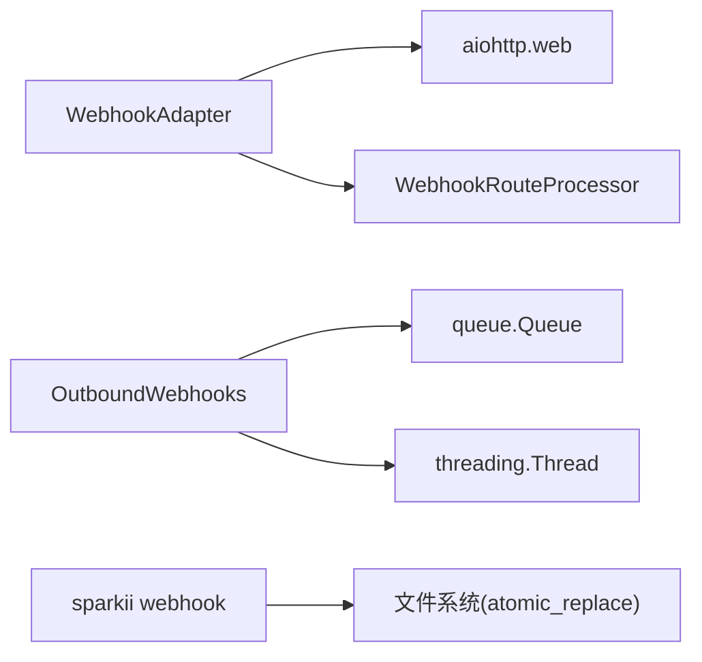

# Webhook API

<cite>
**本文引用的文件**
- [agent/outbound_webhooks.py](file://agent/outbound_webhooks.py)
- [gateway/platforms/webhook.py](file://gateway/platforms/webhook.py)
- [gateway/platforms/webhook_filters.py](file://gateway/platforms/webhook_filters.py)
- [sparkii_cli/webhook.py](file://sparkii_cli/webhook.py)
- [tests/gateway/test_webhook_signature_rate_limit.py](file://tests/gateway/test_webhook_signature_rate_limit.py)
- [tests/agent/test_outbound_webhooks.py](file://tests/agent/test_outbound_webhooks.py)
</cite>

## 目录
1. [简介](#简介)
2. [项目结构](#项目结构)
3. [核心组件](#核心组件)
4. [架构总览](#架构总览)
5. [详细组件分析](#详细组件分析)
6. [依赖关系分析](#依赖关系分析)
7. [性能与限流](#性能与限流)
8. [安全与签名验证](#安全与签名验证)
9. [重试、幂等与错误处理](#重试幂等与错误处理)
10. [平台集成示例（Telegram/Discord/Slack）](#平台集成示例telegramdiscordslack)
11. [监控告警与可观测性](#监控告警与可观测性)
12. [调试工具与故障排除](#调试工具与故障排除)
13. [结论](#结论)

## 简介
本文档面向Webhook的注册、配置与管理，覆盖事件触发机制、回调URL设置、消息格式规范、签名验证、重试机制、错误处理、限流策略、监控告警以及常见平台（Telegram、Discord、Slack）的集成方式。内容基于仓库中网关侧入站Webhook适配器、Agent侧出站Webhook通知、CLI动态订阅管理以及相关测试用例进行整理与说明。

## 项目结构
Webhook能力由两部分组成：
- 入站Webhook（接收外部服务POST到网关，触发Agent运行或直接投递）
- 出站Webhook（Agent在生命周期事件中向外部HTTP端点发送通知）

图表来源
- [gateway/platforms/webhook.py:177-344](file://gateway/platforms/webhook.py#L177-L344)
- [gateway/platforms/webhook.py:584-934](file://gateway/platforms/webhook.py#L584-L934)
- [gateway/platforms/webhook.py:1255-1413](file://gateway/platforms/webhook.py#L1255-L1413)
- [agent/outbound_webhooks.py:156-207](file://agent/outbound_webhooks.py#L156-L207)
- [agent/outbound_webhooks.py:380-570](file://agent/outbound_webhooks.py#L380-L570)

章节来源
- [gateway/platforms/webhook.py:177-344](file://gateway/platforms/webhook.py#L177-L344)
- [agent/outbound_webhooks.py:156-207](file://agent/outbound_webhooks.py#L156-L207)

## 核心组件
- 入站Webhook适配器：提供HTTP路由、签名验证、限流、事件过滤、脚本转换、模板渲染、幂等去重、直接投递或Agent模式、跨平台响应投递。
- 出站Webhook通知：从Agent生命周期钩子触发，将事件以JSON POST到外部URL，支持HMAC签名、超时、重试、队列与后台worker。
- CLI动态订阅：通过命令行创建/列出/删除/测试Webhook路由，持久化到本地JSON文件，热加载生效。
- 路由过滤器与脚本：声明式过滤器（字段存在/相等/包含/正则/文件匹配/逻辑组合）和外部脚本转换（bash/python），用于精细控制事件是否继续处理及载荷变换。

章节来源
- [gateway/platforms/webhook.py:177-344](file://gateway/platforms/webhook.py#L177-L344)
- [gateway/platforms/webhook.py:584-934](file://gateway/platforms/webhook.py#L584-L934)
- [gateway/platforms/webhook_filters.py:94-303](file://gateway/platforms/webhook_filters.py#L94-L303)
- [sparkii_cli/webhook.py:140-308](file://sparkii_cli/webhook.py#L140-L308)
- [agent/outbound_webhooks.py:156-207](file://agent/outbound_webhooks.py#L156-L207)

## 架构总览
入站流程：
- 请求进入 /webhooks/{route_name} 或 /p/{profile}/webhooks/{route_name}
- 读取body前检查Content-Length限制
- 校验签名（Svix/GitHub/GitLab/通用V2/V1）
- 限流检查（固定窗口）
- 解析payload与事件类型过滤
- 可选：执行route脚本转换
- 渲染prompt或直投
- 幂等去重（delivery_id）
- 非阻塞处理：返回202 Accepted，后台执行Agent或投递

出站流程：
- Agent调用插件管理器invoke_hook触发事件
- 根据配置生成WebhookTarget并序列化payload
- 加入进程内队列，单daemon worker线程POST到目标URL
- 支持HMAC签名、超时、重试（连接错误/5xx）、拒绝3xx重定向

图表来源
- [gateway/platforms/webhook.py:584-934](file://gateway/platforms/webhook.py#L584-L934)
- [gateway/platforms/webhook.py:1028-1141](file://gateway/platforms/webhook.py#L1028-L1141)
- [gateway/platforms/webhook.py:1255-1413](file://gateway/platforms/webhook.py#L1255-L1413)

章节来源
- [gateway/platforms/webhook.py:584-934](file://gateway/platforms/webhook.py#L584-L934)
- [gateway/platforms/webhook.py:1028-1141](file://gateway/platforms/webhook.py#L1028-L1141)

## 详细组件分析

### 入站Webhook适配器（gateway/platforms/webhook.py）
- 监听地址与端口：默认绑定所有IPv4/IPv6接口，端口8644；可通过配置host/port调整。
- 路由：
  - GET /health：健康检查
  - POST /webhooks/{route_name}：主入口
  - POST /p/{profile}/webhooks/{route_name}：多Profile复用同一处理器
- 关键能力：
  - 签名验证：支持Svix、GitHub、GitLab、通用V2（带时间戳防重放）、通用V1（仅body，已弃用）
  - 限流：每路由固定窗口计数，默认每分钟30次
  - 事件过滤：header-based或payload-based
  - 脚本转换：在独立线程执行，超时保护，输出JSON或文本
  - 模板渲染：支持点号访问嵌套字段与特殊token
  - 幂等：基于delivery_id缓存TTL，避免重复执行
  - 直接投递：deliver_only跳过Agent，零LLM成本
  - 跨平台投递：支持Telegram、Discord、Slack、Signal、WhatsApp、Matrix、Mattermost、HomeAssistant、Email、DingTalk、飞书、企业微信、Weixin、BlueBubbles、QQBot、元宝等
  - GitHub评论：通过gh CLI发布PR/Issue评论

章节来源
- [gateway/platforms/webhook.py:177-344](file://gateway/platforms/webhook.py#L177-L344)
- [gateway/platforms/webhook.py:584-934](file://gateway/platforms/webhook.py#L584-L934)
- [gateway/platforms/webhook.py:1028-1141](file://gateway/platforms/webhook.py#L1028-L1141)
- [gateway/platforms/webhook.py:1197-1249](file://gateway/platforms/webhook.py#L1197-L1249)
- [gateway/platforms/webhook.py:1255-1413](file://gateway/platforms/webhook.py#L1255-L1413)

### 出站Webhook通知（agent/outbound_webhooks.py）
- 配置来源：config.yaml中的hooks.outbound列表
- 目标对象：WebhookTarget（url、events、name、secret、matcher、timeout）
- 注册：idempotent注册到插件管理器，支持safe mode跳过
- 回调：对pre/post_tool_call支持matcher过滤
- 负载：JSON，包含事件名、工具名、输入、会话ID、工作目录、extra、delivery_id、timestamp
- 头部：Content-Type、User-Agent、X-Hermes-Event、X-Hermes-Delivery、X-Hermes-Signature-256（当配置secret时）
- 传输：进程内队列+单daemon worker线程，超时、重试（连接错误/5xx）、拒绝3xx重定向
- 安全：HMAC-SHA256签名，支持secret_env优先于inline secret

章节来源
- [agent/outbound_webhooks.py:112-150](file://agent/outbound_webhooks.py#L112-L150)
- [agent/outbound_webhooks.py:156-207](file://agent/outbound_webhooks.py#L156-L207)
- [agent/outbound_webhooks.py:250-355](file://agent/outbound_webhooks.py#L250-L355)
- [agent/outbound_webhooks.py:380-570](file://agent/outbound_webhooks.py#L380-L570)

### CLI动态订阅管理（sparkii_cli/webhook.py）
- 命令：subscribe/list/remove/test
- 存储：~/.sparkii/webhook_subscriptions.json，原子写入并设置严格权限
- 热加载：网关每次请求时检测mtime变化并重新加载动态路由
- 测试：自动计算HMAC签名并发送测试请求

章节来源
- [sparkii_cli/webhook.py:140-308](file://sparkii_cli/webhook.py#L140-L308)

### 路由过滤器与脚本（gateway/platforms/webhook_filters.py）
- 过滤器：支持all/any/not组合，字段存在/缺失/相等/不等/包含/in/in_file/regex
- 脚本：支持bash/python，路径限制在SPARKII_HOME/scripts下，超时保护，输出JSON或文本，支持[SILENT]或__sparkii_ignore__忽略事件

章节来源
- [gateway/platforms/webhook_filters.py:94-303](file://gateway/platforms/webhook_filters.py#L94-L303)

## 依赖关系分析
- 入站Webhook依赖aiohttp提供HTTP服务器；若不可用则功能不可用。
- 出站Webhook依赖Python标准库urllib与threading实现队列与worker。
- CLI依赖文件系统读写与原子替换确保配置文件安全。
- 过滤器脚本依赖外部解释器（bash/python）与工具环境构建。

图表来源
- [gateway/platforms/webhook.py:47-53](file://gateway/platforms/webhook.py#L47-L53)
- [agent/outbound_webhooks.py:69-109](file://agent/outbound_webhooks.py#L69-L109)
- [sparkii_cli/webhook.py:51-80](file://sparkii_cli/webhook.py#L51-L80)

章节来源
- [gateway/platforms/webhook.py:47-53](file://gateway/platforms/webhook.py#L47-L53)
- [agent/outbound_webhooks.py:69-109](file://agent/outbound_webhooks.py#L69-L109)
- [sparkii_cli/webhook.py:51-80](file://sparkii_cli/webhook.py#L51-L80)

## 性能与限流
- 入站限流：固定窗口计数器，按路由维度统计，默认每分钟30次；超限返回429。
- 出站队列：最大256条，满队丢弃并记录警告；worker为daemon线程，进程退出时尝试flush。
- 超时控制：出站默认10秒，上限60秒；入站脚本默认30秒，可配置。
- 内存与清理：delivery_info与seen_deliveries按TTL定期清理，防止无限增长。

章节来源
- [gateway/platforms/webhook.py:226-239](file://gateway/platforms/webhook.py#L226-L239)
- [gateway/platforms/webhook.py:436-461](file://gateway/platforms/webhook.py#L436-L461)
- [gateway/platforms/webhook.py:676-681](file://gateway/platforms/webhook.py#L676-L681)
- [agent/outbound_webhooks.py:89-109](file://agent/outbound_webhooks.py#L89-L109)
- [agent/outbound_webhooks.py:458-501](file://agent/outbound_webhooks.py#L458-L501)

## 安全与签名验证
- 入站签名：
  - Svix：svix-id/svix-timestamp/svix-signature，支持whsec_前缀base64密钥与多签名轮转
  - GitHub：X-Hub-Signature-256 = sha256=<hex>
  - GitLab：X-Gitlab-Token明文对比
  - 通用V2：X-Webhook-Signature-V2 + X-Webhook-Timestamp，时间戳绑定防重放
  - 通用V1：仅body签名，已弃用且会记录警告
  - 安全开关：INSECURE_NO_AUTH仅允许loopback绑定，否则启动失败
- 出站签名：
  - HMAC-SHA256，secret_env优先于inline secret
  - 头：X-Hermes-Signature-256 = sha256=<hex>
- 其他防护：
  - 请求体大小限制（默认1MB）
  - 禁止跟随3xx重定向（出站）
  - 动态路由secret为空或INSECURE_NO_AUTH在非loopback被拒绝

章节来源
- [gateway/platforms/webhook.py:158-170](file://gateway/platforms/webhook.py#L158-L170)
- [gateway/platforms/webhook.py:248-285](file://gateway/platforms/webhook.py#L248-L285)
- [gateway/platforms/webhook.py:626-674](file://gateway/platforms/webhook.py#L626-L674)
- [gateway/platforms/webhook.py:1028-1141](file://gateway/platforms/webhook.py#L1028-L1141)
- [agent/outbound_webhooks.py:358-373](file://agent/outbound_webhooks.py#L358-L373)
- [agent/outbound_webhooks.py:504-517](file://agent/outbound_webhooks.py#L504-L517)

## 重试、幂等与错误处理
- 入站幂等：基于delivery_id缓存TTL（默认1小时），重复请求返回200 duplicate
- 入站限流：超限返回429
- 入站错误：无效签名401、未知路由404、禁用路由403、负载过大413、解析失败400
- 出站重试：连接错误或5xx最多重试2次，指数退避；4xx不重试；3xx不跟随并重试
- 出站异常：网络异常、序列化失败、队列满均记录日志且不中断Agent循环

章节来源
- [gateway/platforms/webhook.py:802-812](file://gateway/platforms/webhook.py#L802-L812)
- [gateway/platforms/webhook.py:676-681](file://gateway/platforms/webhook.py#L676-L681)
- [gateway/platforms/webhook.py:599-624](file://gateway/platforms/webhook.py#L599-L624)
- [gateway/platforms/webhook.py:626-651](file://gateway/platforms/webhook.py#L626-L651)
- [gateway/platforms/webhook.py:683-697](file://gateway/platforms/webhook.py#L683-L697)
- [agent/outbound_webhooks.py:520-570](file://agent/outbound_webhooks.py#L520-L570)
- [tests/gateway/test_webhook_signature_rate_limit.py:59-143](file://tests/gateway/test_webhook_signature_rate_limit.py#L59-L143)

## 平台集成示例（Telegram/Discord/Slack）
- 直接投递模式（deliver_only）：无需Agent，直接将渲染后的消息投递到目标平台，零LLM成本
- 跨平台投递：通过gateway_runner的适配器发送，支持Telegram、Discord、Slack等
- 配置要点：
  - route.deliver设置为平台名称（如telegram/discord/slack）
  - route.deliver_extra可指定chat_id或thread_id（例如Telegram论坛主题）
  - 使用CLI创建动态订阅，自动生成URL与secret，便于第三方服务回调

章节来源
- [gateway/platforms/webhook.py:104-109](file://gateway/platforms/webhook.py#L104-L109)
- [gateway/platforms/webhook.py:814-870](file://gateway/platforms/webhook.py#L814-L870)
- [gateway/platforms/webhook.py:1358-1413](file://gateway/platforms/webhook.py#L1358-L1413)
- [sparkii_cli/webhook.py:162-224](file://sparkii_cli/webhook.py#L162-L224)

## 监控告警与可观测性
- 日志：大量INFO/WARNING/ERROR日志记录签名、限流、过滤、脚本执行、投递结果
- 健康检查：GET /health返回平台状态
- 指标建议：结合网关整体监控，关注401/429/413比例、脚本超时率、投递失败率
- 审计：动态路由文件权限严格（0o600），敏感信息脱敏（脚本输出）

章节来源
- [gateway/platforms/webhook.py:286-344](file://gateway/platforms/webhook.py#L286-L344)
- [gateway/platforms/webhook.py:626-697](file://gateway/platforms/webhook.py#L626-L697)
- [gateway/platforms/webhook_filters.py:268-278](file://gateway/platforms/webhook_filters.py#L268-L278)
- [sparkii_cli/webhook.py:51-80](file://sparkii_cli/webhook.py#L51-L80)

## 调试工具与故障排除
- CLI测试：sparkii webhook test <name> [--payload ...] 自动计算签名并发送
- 动态订阅：sparkii webhook list查看当前路由与URL
- 常见问题：
  - 401 Invalid signature：检查签名头与secret，确认使用正确算法（Svix/GitHub/GitLab/V2/V1）
  - 429 Rate limit exceeded：提高rate_limit或优化上游频率
  - 413 Payload too large：减小请求体或调整max_body_bytes
  - 404 Unknown route：确认route_name与动态/静态路由一致
  - 403 Route disabled：检查enabled标志
  - 出站无签名：确认未配置secret_env或secret
  - 出站重定向：修正URL，避免3xx
- 参考测试用例验证行为

章节来源
- [sparkii_cli/webhook.py:267-308](file://sparkii_cli/webhook.py#L267-L308)
- [tests/gateway/test_webhook_signature_rate_limit.py:59-143](file://tests/gateway/test_webhook_signature_rate_limit.py#L59-L143)
- [tests/agent/test_outbound_webhooks.py:351-531](file://tests/agent/test_outbound_webhooks.py#L351-L531)

## 结论
本Webhook体系提供了完整的入站与出站能力：入站支持多种签名、限流、过滤、脚本转换与直接投递/Agent模式；出站提供可靠的通知通道与HMAC签名。通过CLI动态订阅与热加载，可实现灵活的事件驱动集成。生产部署应启用强签名、合理限流与监控告警，并结合测试用例进行验证与排障。