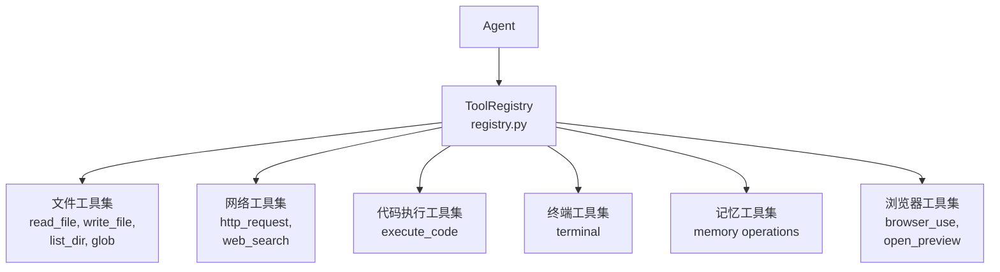
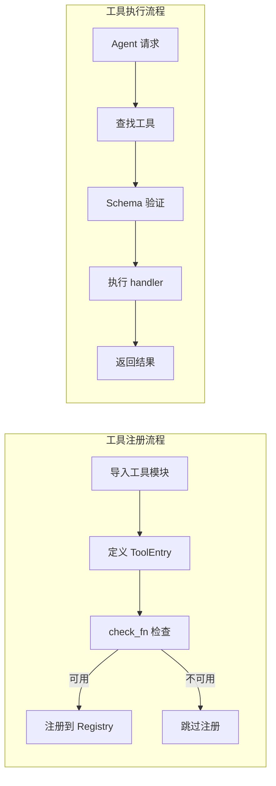

# 内置工具集

<cite>
**本文引用的文件**
- [tools/file_tools.py](file://tools/file_tools.py)
- [tools/web_tools.py](file://tools/web_tools.py)
- [tools/code_execution_tool.py](file://tools/code_execution_tool.py)
- [tools/terminal_tool.py](file://tools/terminal_tool.py)
- [tools/memory_tool.py](file://tools/memory_tool.py)
- [tools/registry.py](file://tools/registry.py)
</cite>

## 目录
1. [简介](#简介)
2. [项目结构](#项目结构)
3. [核心组件](#核心组件)
4. [架构总览](#架构总览)
5. [详细组件分析](#详细组件分析)
6. [依赖关系分析](#依赖关系分析)
7. [性能考量](#性能考量)
8. [故障排查指南](#故障排查指南)
9. [结论](#结论)

## 简介
本文全面介绍 Hermes Agent 的内置工具集，即随系统开箱即用的核心工具集合。内置工具覆盖文件操作、网络请求、代码执行、终端命令、记忆管理等基础能力，是 Agent 完成日常任务的基石。

每个工具集（Toolset）包含一组相关工具，通过统一的注册机制和安全策略进行管理。工具的可用性由 check_fn 动态决定，确保在不满足运行时条件时自动降级。

## 项目结构
内置工具按功能域组织为多个工具集：
- 文件工具集：`tools/file_tools.py`
- 网络工具集：`tools/web_tools.py`
- 代码执行工具集：`tools/code_execution_tool.py`
- 终端工具集：`tools/terminal_tool.py`
- 记忆工具集：`tools/memory_tool.py`
- 注册中心：`tools/registry.py`

## 核心组件
- **文件工具集**（file_tools.py）：提供 read_file、write_file、list_dir、glob 等文件系统操作。支持路径安全验证和文件大小限制。
- **网络工具集**（web_tools.py）：提供 http_request、web_search 等网络请求能力。支持代理配置、超时控制和响应缓存。
- **代码执行工具集**（code_execution_tool.py）：提供安全的代码执行环境，支持 Python、JavaScript 等语言。运行在沙箱中，限制文件系统和网络访问。
- **终端工具集**（terminal_tool.py）：提供 shell 命令执行能力，支持 Docker 和本地环境。通过 check_fn 检测 Docker 可用性。
- **记忆工具集**（memory_tool.py）：提供记忆查询、写入和删除操作。与 MemoryManager 集成，支持多后端存储。
- **浏览器工具集**（browser_tool.py）：提供浏览器自动化能力，包括页面导航、截图、表单填写等。

## 架构总览

## 详细组件分析
### 文件工具集详细功能
- `read_file`：读取文件内容，支持行范围选择和编码指定。自动处理大文件截断。
- `write_file`：写入文件内容，支持追加模式和目录自动创建。经过路径安全验证。
- `list_dir`：列出目录内容，支持递归和过滤。
- `glob`：使用 glob 模式搜索文件。

### 网络工具集详细功能
- `http_request`：发送 HTTP 请求，支持 GET/POST/PUT/DELETE 等方法。自动处理重定向和 cookies。
- `web_search`：网络搜索，返回结构化结果列表。

### 代码执行工具集
- 支持多语言代码执行（Python、JavaScript、Bash）。
- 沙箱环境限制：禁止网络访问、限制文件系统写入、设置执行超时。
- 输出捕获：标准输出和错误输出均被捕获并返回。

### 终端工具集
- 支持本地和 Docker 两种执行环境。
- 通过 check_terminal_requirements 检测环境可用性。
- 支持长时间运行命令的后台执行和输出流式读取。

## 依赖关系分析
- **注册中心**：`tools/registry.py` — 全局工具注册和发现
- **文件操作**：`tools/file_tools.py` — 文件系统工具集
- **网络请求**：`tools/web_tools.py` — HTTP 和搜索工具
- **代码执行**：`tools/code_execution_tool.py` — 代码沙箱
- **终端命令**：`tools/terminal_tool.py` — Shell 执行
- **记忆管理**：`tools/memory_tool.py` — 记忆操作
- **浏览器**：`tools/browser_tool.py` — 浏览器自动化
- **路径安全**：`tools/path_security.py` — 路径验证
- **Schema 清理**：`tools/schema_sanitizer.py` — 参数清理

## 性能考量
- 工具注册是惰性的，只有在首次 get_definitions() 调用时才触发 check_fn。
- check_fn 结果通过 TTL 缓存（默认30秒）避免频繁探测外部环境。
- 文件读取支持流式模式，大文件不会一次性加载到内存。
- 网络请求使用连接池复用，减少 TCP 握手开销。
- 代码执行沙箱使用进程隔离，不影响主进程。

## 故障排查指南
- **工具不可用**：检查 check_fn 返回值和 requires_env 环境变量。
- **文件权限错误**：确认路径安全验证通过，检查文件系统权限。
- **网络超时**：调整 http_request 的 timeout 参数，检查代理配置。
- **代码执行失败**：查看沙箱日志，确认语言运行时已安装。
- **终端命令超时**：检查 Docker 守护进程状态或本地 shell 环境。

## 结论
内置工具集是 Hermes Agent 的核心能力基础。通过模块化的工具集设计和统一的注册机制，系统实现了灵活的工具管理和动态可用性检测。开发者可以通过扩展内置工具集或创建自定义工具来增强 Agent 能力。

