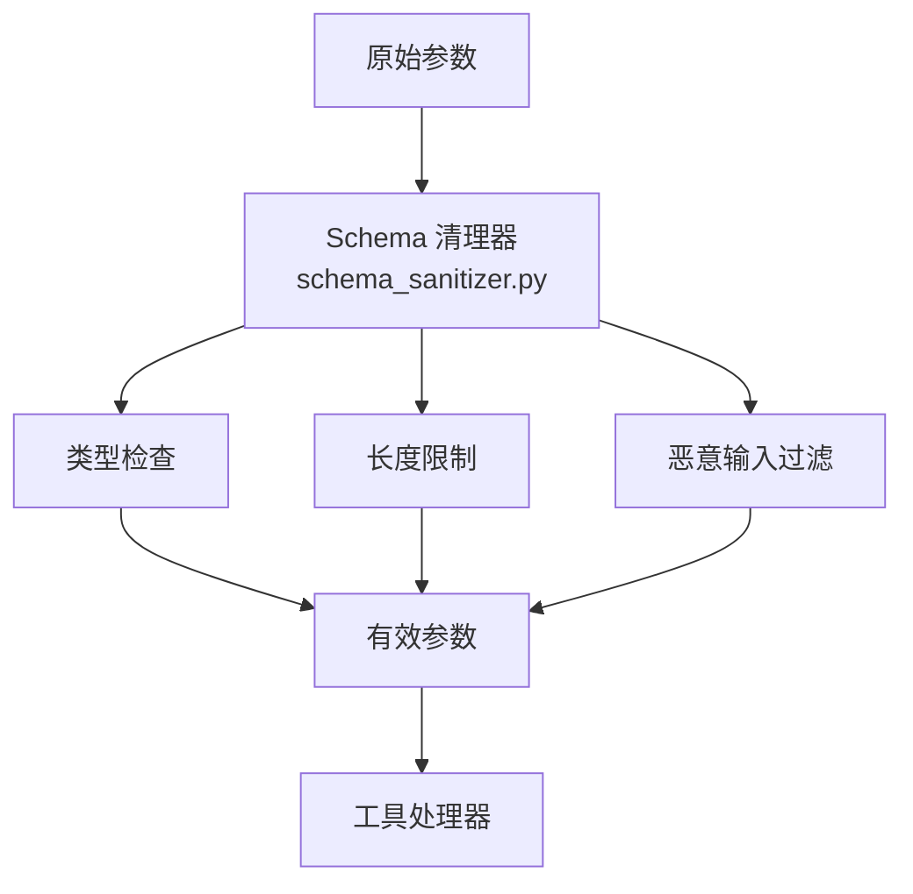
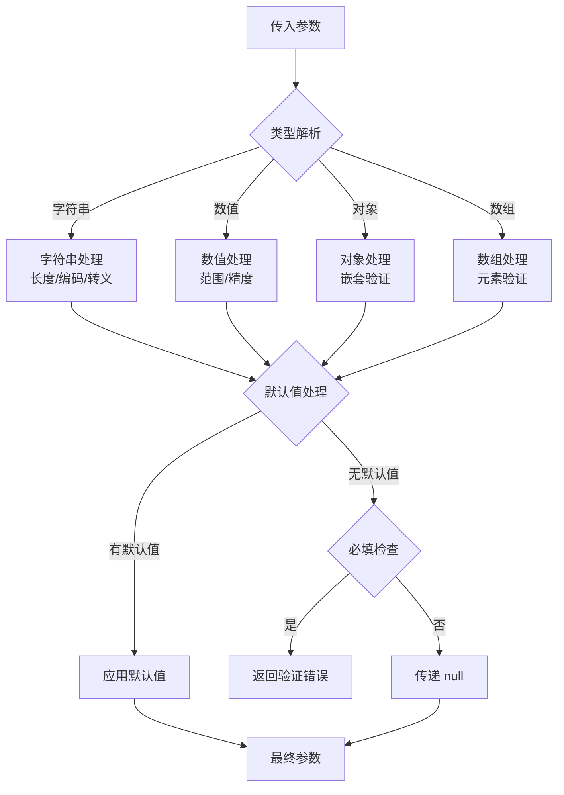

# 参数验证与处理

<cite>
**本文引用的文件**
- [tools/schema_sanitizer.py](file://tools/schema_sanitizer.py)
- [tools/tool_backend_helpers.py](file://tools/tool_backend_helpers.py)
- [tools/delegation_output_schema.py](file://tools/delegation_output_schema.py)
- [tools/path_security.py](file://tools/path_security.py)
</cite>

## 目录
1. [简介](#简介)
2. [项目结构](#项目结构)
3. [核心组件](#核心组件)
4. [架构总览](#架构总览)
5. [详细组件分析](#详细组件分析)
6. [依赖关系分析](#依赖关系分析)
7. [性能考量](#性能考量)
8. [故障排查指南](#故障排查指南)
9. [结论](#结论)

## 简介
本文详细阐述 Sparkii Agent 工具系统的参数验证与处理机制。参数验证是工具安全执行的第一道防线——通过 Schema 驱动的类型检查、长度限制、恶意输入过滤，确保每个工具调用都携带合法参数。

系统支持 JSON Schema 规范的完整子集，包括类型约束、枚举验证、嵌套对象校验和自定义验证规则。参数处理还包括数据类型转换、默认值管理和敏感参数的安全传输。

## 项目结构
参数验证系统由以下模块组成：
- `tools/schema_sanitizer.py`：Schema 清理和规范化
- `tools/tool_backend_helpers.py`：工具后端辅助函数
- `tools/delegation_output_schema.py`：委托输出 Schema 定义
- `tools/path_security.py`：路径参数安全验证

## 核心组件
- **Schema 清理器**（sanitize_tool_schemas）：递归遍历 JSON Schema，规范化属性键名、修复无效类型声明、添加缺失的描述字段。
- **属性键清理**（sanitize_property_key）：移除键名中的非法字符，确保符合 API 规范。
- **节点清理器**（_sanitize_node）：递归处理 Schema 节点，处理嵌套对象和数组类型。
- **路径安全验证**：防止路径遍历攻击，验证文件路径在允许范围内。
- **委托输出 Schema**：定义子代理输出的标准化格式，确保结果可解析。

## 架构总览

## 详细组件分析
### Schema 规范化流程
1. **键名清理**：移除属性名中的特殊字符，确保兼容不同 LLM 提供商。
2. **类型修复**：将非标准类型声明转换为 JSON Schema 兼容格式。
3. **描述补全**：为缺少 description 的字段添加默认描述。
4. **深度限制**：限制 Schema 嵌套深度，防止过深的递归结构。

### 数据类型转换
- 字符串：支持编码检测、BOM 移除、Unicode 规范化。
- 数值：支持字符串到数字的自动转换，处理科学计数法。
- 日期：支持 ISO 8601 和常见日期格式的解析。
- 布尔值：支持字符串 "true"/"false" 到布尔值的转换。

### 安全参数处理
- 敏感参数（如 API 密钥）在日志中自动脱敏。
- 路径参数经过 path_security 验证，防止目录遍历。
- 长参数自动截断，防止内存溢出。

## 依赖关系分析
- **Schema 清理**：`tools/schema_sanitizer.py` — 主要验证逻辑
- **后端辅助**：`tools/tool_backend_helpers.py` — 工具调用辅助
- **输出 Schema**：`tools/delegation_output_schema.py` — 委托输出格式
- **路径安全**：`tools/path_security.py` — 路径验证
- **工具注册**：`tools/registry.py` — Schema 注册和获取

## 性能考量
- Schema 清理在工具注册时一次性完成，不在每次调用时重复执行。
- 参数验证使用早期拒绝策略，无效参数立即返回错误，不进入处理器。
- 大型 Schema 的清理使用增量处理，只清理变更部分。
- 路径安全验证使用白名单模式，比黑名单更安全高效。

## 故障排查指南
- **Schema 验证失败**：检查参数类型是否与 Schema 定义匹配，确认必填字段已提供。
- **路径被拒绝**：确认文件路径在允许的目录范围内，检查符号链接目标。
- **类型转换错误**：确认输入值可以正确转换为目标类型。
- **嵌套深度超限**：简化 Schema 结构，减少嵌套层级。
- **参数过长**：调整 max_result_size_chars 或在调用前截断输入。

## 结论
参数验证与处理是工具系统安全可靠运行的基础。通过 Schema 驱动的验证机制和多层安全检查，系统能够有效防御恶意输入和意外错误。开发者应充分利用 JSON Schema 的表达能力，为每个工具定义清晰的参数约束。

