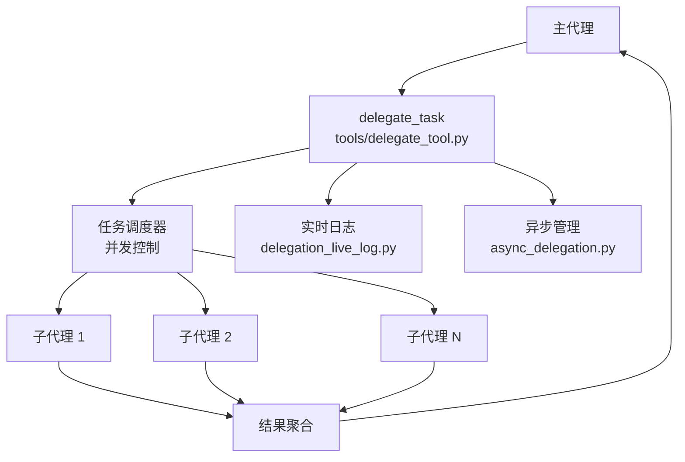
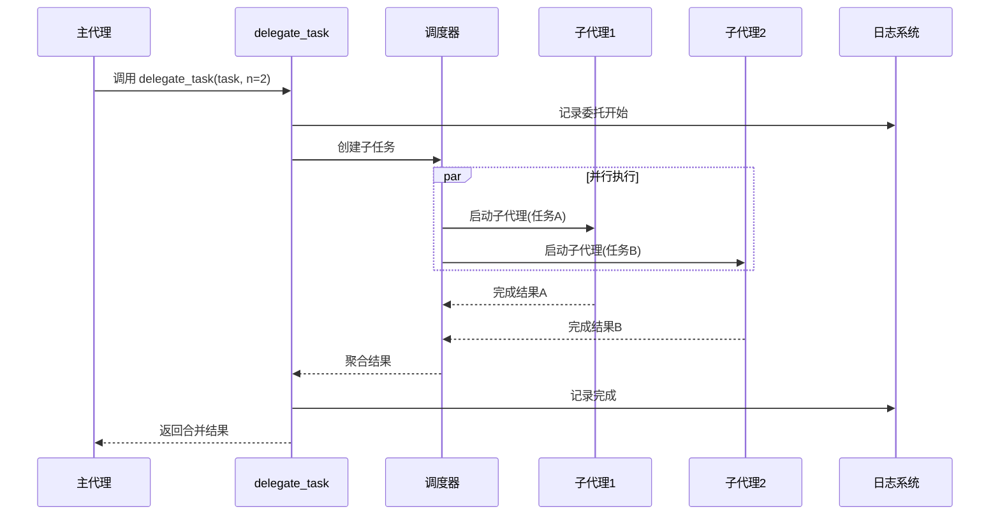
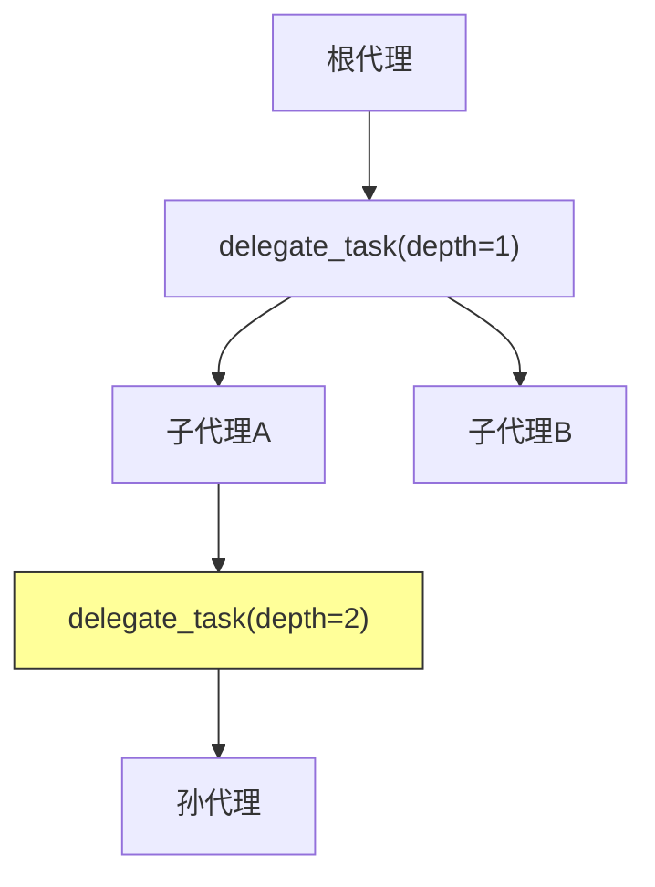

# 工具委托机制

<cite>
**本文引用的文件**
- [tools/delegate_tool.py](file://tools/delegate_tool.py)
- [tools/async_delegation.py](file://tools/async_delegation.py)
- [tools/delegation_live_log.py](file://tools/delegation_live_log.py)
- [agent/conversation_loop.py](file://agent/conversation_loop.py)
</cite>

## 目录
1. [简介](#简介)
2. [项目结构](#项目结构)
3. [核心组件](#核心组件)
4. [架构总览](#架构总览)
5. [详细组件分析](#详细组件分析)
6. [依赖关系分析](#依赖关系分析)
7. [性能考量](#性能考量)
8. [故障排查指南](#故障排查指南)
9. [结论](#结论)

## 简介
本文详细阐述 Sparkii Agent 的工具委托机制（Delegation），即通过 delegate_task 工具将复杂任务拆分给子代理并行执行的核心能力。委托机制是 Agent 处理大规模、多步骤任务的关键架构组件，支持并发子代理管理、超时控制、结果聚合和实时进度追踪。

系统支持嵌套委托（子代理再委托）、异步执行模式、以及基于会话血缘的上下文传递，使 Agent 能够高效处理需要多轮推理或跨领域知识的复合任务。

## 项目结构
工具委托机制的实现分布在多个模块中，核心入口为 `tools/delegate_tool.py`，异步执行支持在 `tools/async_delegation.py`，实时日志在 `tools/delegation_live_log.py`。

## 核心组件
- **delegate_task 工具**：核心委托入口，接受任务描述、子代理数量、超时时间等参数，自动拆分并分发任务。
- **并发控制器**：管理子代理并发数量（max_concurrent_children），防止资源耗尽；支持嵌套深度限制（max_spawn_depth）。
- **子代理执行器**：`_run_single_child` 函数封装单个子代理的完整生命周期，包括会话创建、工具注入、超时监控和结果收集。
- **异步委托管理**：`async_delegation.py` 提供非阻塞的委托执行模式，支持后台任务和进度回调。
- **实时日志系统**：`delegation_live_log.py` 记录委托过程的详细日志，存储在 `cache/delegation` 目录下，支持事后审计。
- **结果聚合器**：收集所有子代理的输出，处理部分失败场景，生成统一的执行报告。

## 架构总览

图表来源
- [tools/delegate_tool.py:3132-3200](file://tools/delegate_tool.py#L3132-L3200)
- [tools/async_delegation.py:32-100](file://tools/async_delegation.py#L32-L100)

## 详细组件分析
### 委托参数与配置
- `task`：任务描述字符串，会传递给子代理作为系统指令。
- `num_children`：并行子代理数量，默认由配置决定。
- `timeout`：单个子代理的超时时间（秒），超时后强制终止。
- `max_spawn_depth`：嵌套委托深度限制，防止无限递归。

### 子代理生命周期
每个子代理经历以下阶段：
1. **初始化**：创建独立会话，注入可用工具集（根据 check_fn 缓存动态决定）。
2. **执行**：运行对话循环，调用工具完成任务。
3. **监控**：异步管理器定期检查子代理状态，处理超时和异常。
4. **收集**：提取子代理的最终输出和工具调用记录。

### 嵌套委托
子代理可以再次调用 delegate_task，形成嵌套委托树。系统通过 max_spawn_depth 限制嵌套深度，通过并发计数器防止资源耗尽。

## 依赖关系分析
- **主模块**：`tools/delegate_tool.py` — 核心委托逻辑
- **异步支持**：`tools/async_delegation.py` — 非阻塞执行
- **日志模块**：`tools/delegation_live_log.py` — 实时日志
- **会话管理**：`agent/conversation_loop.py` — 子代理对话循环
- **工具注册**：`tools/registry.py` — 工具可用性检查
- **文件状态**：`tools/file_state.py` — 子代理完成提醒

## 性能考量
- 子代理并发数受 max_concurrent_children 限制，避免同时创建过多进程。
- 委托任务的超时机制防止子代理无限挂起。
- 结果聚合采用流式收集，不需要等待所有子代理完成即可处理部分结果。
- 异步委托模式下，主代理可以继续执行其他任务，不被阻塞。
- 委托日志使用异步写入，不影响主执行路径性能。

## 故障排查指南
- **子代理启动失败**：检查工具注册状态，确认 check_fn 缓存未过期。
- **委托超时**：调整 timeout 参数或优化子代理任务拆分粒度。
- **嵌套深度超限**：减少委托层级，将深层任务合并到浅层子代理。
- **结果缺失**：检查子代理是否因异常退出，查看 delegation 日志。
- **并发冲突**：确认 max_concurrent_children 配置合理。

## 结论
工具委托机制是 Sparkii Agent 处理复杂任务的核心能力。通过合理的任务拆分和并行执行，系统能够显著提升多步骤任务的完成效率。开发者应根据任务特性选择合适的子代理数量和超时配置，并通过实时日志系统监控委托过程。

