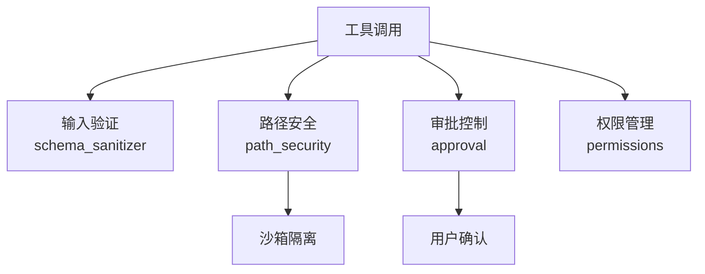
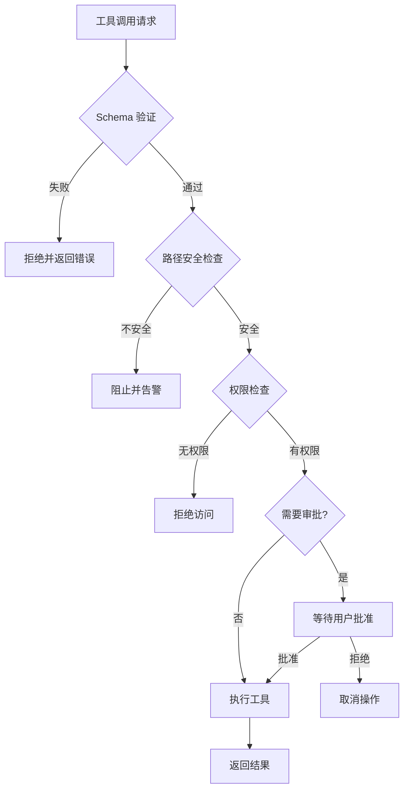
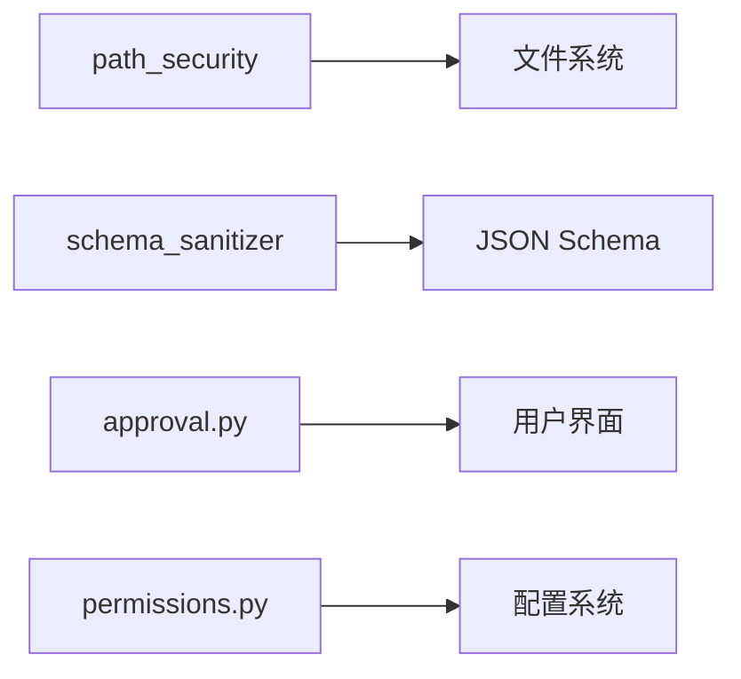

# 工具安全考虑

<cite>
**本文引用的文件**
- [tools/path_security.py](file://tools/path_security.py)
- [tools/schema_sanitizer.py](file://tools/schema_sanitizer.py)
- [tools/approval.py](file://tools/approval.py)
- [agent/permissions.py](file://agent/permissions.py)
</cite>

## 目录
1. [简介](#简介)
2. [项目结构](#项目结构)
3. [核心组件](#核心组件)
4. [架构总览](#架构总览)
5. [详细组件分析](#详细组件分析)
6. [依赖关系分析](#依赖关系分析)
7. [性能考量](#性能考量)
8. [故障排查指南](#故障排查指南)
9. [结论](#结论)

## 简介
本文详细阐述 Sparkii Agent 工具系统的安全防护机制，涵盖输入验证、路径安全、权限控制、沙箱执行等核心安全层面。工具安全是 Agent 可信运行的基石——每个工具调用都可能涉及文件读写、网络请求、代码执行等敏感操作，必须通过多层防御确保安全。

## 项目结构
安全机制分布在多个模块中：路径安全验证在 `tools/path_security.py`，Schema 清理在 `tools/schema_sanitizer.py`，审批控制在 `tools/approval.py`，权限管理在 `agent/permissions.py` 和 `agent/file_safety.py`。

## 核心组件
- **路径安全验证**：防止路径遍历攻击，限制文件系统访问范围，验证符号链接安全性。
- **Schema 清理**：对工具参数进行类型检查、长度限制、恶意输入过滤。
- **审批控制**：高风险操作需用户显式批准，支持编辑审批和写入审批。
- **权限管理**：基于角色的访问控制，文件系统权限检查，网络请求限制。
- **敏感信息保护**：密钥管理、日志脱敏、环境变量过滤。

## 架构总览

## 详细组件分析

### 输入验证与 Schema 清理
- **参数类型检查**：基于 JSON Schema 验证每个参数的类型、格式和范围。
- **长度限制**：字符串参数设最大长度，数组参数设最大元素数，防止内存耗尽。
- **恶意输入过滤**：检测注入攻击模式（SQL 注入、命令注入、路径遍历），拒绝可疑输入。

### 路径安全机制
- **路径遍历防护**：规范化路径后检查是否在允许的根目录内，阻止 `../` 逃逸。
- **符号链接验证**：解析符号链接目标，确保最终路径仍在安全范围内。
- **工作目录限制**：工具只能访问当前工作目录及其子目录（除非显式授权）。

### 审批与确认机制
- **编辑审批（Edit Approval）**：文件修改操作需用户确认变更内容。
- **写入审批（Write Approval）**：新建或覆盖文件需用户批准。
- **危险操作审批**：删除文件、执行命令等高风险操作强制要求用户确认。

### 沙箱执行环境
- **进程隔离**：代码执行工具在独立子进程中运行，限制系统调用。
- **资源限制**：CPU 时间限制、内存使用上限、磁盘空间保护。
- **网络限制**：可配置的网络访问白名单，限制外网请求目标。

## 依赖关系分析

## 性能考量
- 路径规范化和安全检查引入微量开销（通常 <1ms）。
- Schema 验证使用高效的 JSON Schema 库，保持低延迟。
- 审批机制为异步设计，不阻塞其他工具的执行。
- 缓存已验证的路径权限，避免重复检查。

## 故障排查指南
- **"Path traversal detected"**：检查参数中的路径是否包含 `..` 或指向工作目录外。
- **"Permission denied"**：确认当前用户对目标资源有读/写权限。
- **"Schema validation failed"**：检查参数是否符合 schema 定义的类型和约束。

## 结论
Sparkii Agent 的工具安全体系采用多层防御策略：Schema 验证过滤无效输入，路径安全防止越界访问，权限控制限制操作范围，审批机制确保高风险操作得到用户确认。开发者应遵循最小权限原则，合理使用 check_fn 进行环境验证。
