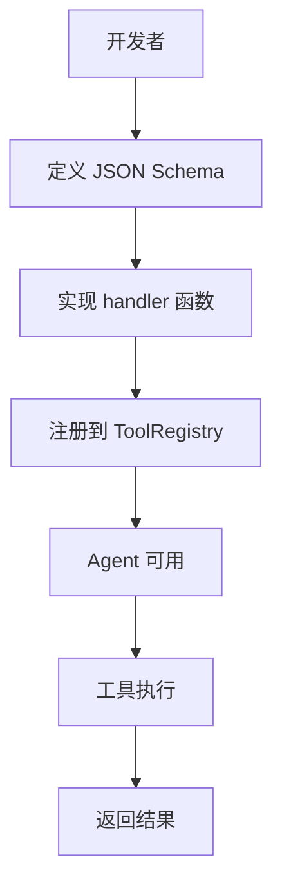
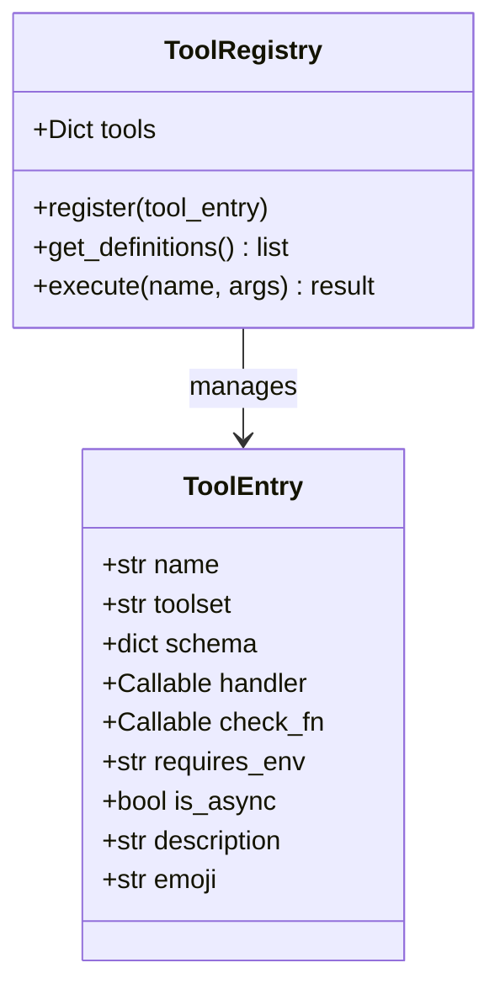

# 工具开发指南

<cite>
**本文引用的文件**
- [tools/file_tools.py](file://tools/file_tools.py)
- [tools/web_tools.py](file://tools/web_tools.py)
- [tools/code_execution_tool.py](file://tools/code_execution_tool.py)
- [tools/browser_tool.py](file://tools/browser_tool.py)
- [tools/registry.py](file://tools/registry.py)
</cite>

## 目录
1. [简介](#简介)
2. [项目结构](#项目结构)
3. [核心组件](#核心组件)
4. [架构总览](#架构总览)
5. [详细组件分析](#详细组件分析)
6. [依赖关系分析](#依赖关系分析)
7. [性能考量](#性能考量)
8. [故障排查指南](#故障排查指南)
9. [结论](#结论)

## 简介
本文提供 Sparkii Agent 工具开发的完整指南，涵盖工具框架、元数据定义、Schema 设计、测试调试和发布分发的全流程。工具是 Agent 与外部世界交互的桥梁——每个工具封装特定能力（文件操作、网络请求、代码执行等），通过标准化接口供 Agent 调用。

开发者可以基于内置工具模板快速创建自定义工具，也可以通过工具集（Toolset）机制将相关工具打包分发。

## 项目结构
工具开发涉及以下核心文件：
- `tools/registry.py`：工具注册中心，管理 ToolEntry 元数据和 check_fn 缓存。
- `tools/file_tools.py`：文件操作工具集示例。
- `tools/web_tools.py`：网络请求工具集示例。
- `tools/code_execution_tool.py`：代码执行工具示例。
- `tools/browser_tool.py`：浏览器自动化工具示例。



## 核心组件
- **ToolRegistry**：全局工具注册中心，维护所有已注册工具的元数据和处理器。
- **ToolEntry**：工具元数据封装，包含 name、schema、handler、check_fn、requires_env 等字段。
- **JSON Schema**：标准参数定义格式，支持类型约束、必填校验、默认值和嵌套结构。
- **check_fn**：可用性检查函数，决定工具是否在当前环境中可用。
- **工具处理器**：实际执行逻辑的函数，支持同步和异步两种模式。

## 架构总览


## 详细组件分析
### 创建工具的基本步骤

1. **定义参数 Schema**：使用 JSON Schema 格式定义工具接受的参数类型和约束。
2. **实现处理器函数**：编写实际执行逻辑，接受解析后的参数字典，返回结果字符串或字典。
3. **定义 check_fn**（可选）：检查工具所需的运行时环境是否满足。
4. **注册工具**：通过装饰器或直接调用注册函数将工具添加到注册中心。

### 工具处理器示例

```python
async def my_tool_handler(params: dict) -> str:
    # 参数已在 Schema 层验证
    path = params.get("path", "")
    # 执行操作...
    return {"status": "ok", "result": data}
```

### Schema 设计最佳实践
- 使用 `type: object` 包装所有参数。
- 明确标注 `required` 字段。
- 为可选参数提供 `default` 值。
- 使用 `description` 字段详细说明每个参数的用途。
- 避免过于复杂的嵌套结构，保持参数扁平化。

## 依赖关系分析
- **核心注册**：`tools/registry.py` — ToolEntry 和 ToolRegistry
- **文件工具**：`tools/file_tools.py` — read_file、write_file 等
- **网络工具**：`tools/web_tools.py` — http_request 等
- **代码执行**：`tools/code_execution_tool.py` — execute_code
- **浏览器**：`tools/browser_tool.py` — browser_use、open_preview
- **Schema 清理**：`tools/schema_sanitizer.py` — 参数验证
- **安全检查**：`tools/path_security.py` — 路径安全验证

## 性能考量
- 工具注册是惰性的，check_fn 结果通过 TTL 缓存优化。
- 大型工具集使用 toolset 分组，按需加载减少内存占用。
- 工具执行结果有大小限制（max_result_size_chars），防止上下文溢出。
- 异步工具处理器避免阻塞事件循环。
- 动态 Schema 覆盖（dynamic_schema_overrides）支持运行时配置变化。

## 故障排查指南
- **工具未注册**：确认 check_fn 返回 True，检查 requires_env 环境变量。
- **Schema 验证失败**：检查参数类型和 required 字段定义。
- **处理器超时**：优化执行逻辑或增加超时限制。
- **结果过大**：调整 max_result_size_chars 或在处理器中截断输出。

## 结论
工具开发是扩展 Sparkii Agent 能力的核心方式。遵循标准化的 Schema 定义和注册流程，开发者可以快速创建高质量的工具。建议从现有工具模板出发，逐步添加自定义逻辑，并通过完善的测试确保工具的可靠性。

