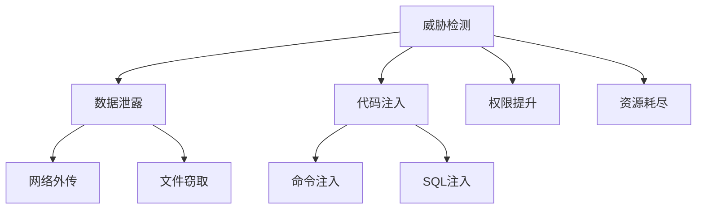

# 工具安全沙箱

<cite>
**本文引用的文件**
- [tools/skills_guard.py](file://tools/skills_guard.py)
- [tools/path_security.py](file://tools/path_security.py)
- [tools/threat_patterns.py](file://tools/threat_patterns.py)
</cite>

## 目录
1. [简介](#简介)
2. [权限控制系统](#权限控制系统)
3. [威胁检测模式](#威胁检测模式)
4. [资源限制策略](#资源限制策略)
5. [输入输出验证](#输入输出验证)
6. [安全配置指南](#安全配置指南)
7. [结论](#结论)

## 简介
本文档详细阐述工具执行的安全沙箱设计和防护机制，确保工具在隔离环境中安全运行。

## 权限控制系统

### 文件系统访问限制
```python
from tools.path_security import validate_within_dir

def safe_file_access(user_path, allowed_root):
    error = validate_within_dir(Path(user_path), Path(allowed_root))
    if error:
        raise PermissionError(error)
    return open(user_path).read()
```

### 权限矩阵
| 资源类型 | 读权限 | 写权限 | 执行权限 |
|----------|--------|--------|----------|
| 工作目录 | ✓ | ✓ | ✗ |
| 系统目录 | ✗ | ✗ | ✗ |
| 临时目录 | ✓ | ✓ | ✗ |
| 网络 | 受限 | 受限 | - |

## 威胁检测模式

### 检测类别


### 检测规则
- 使用正则表达式匹配恶意模式
- 静态分析检测危险函数调用
- 行为分析识别异常操作

## 资源限制策略

### CPU时间限制
```python
import signal

def timeout_handler(signum, frame):
    raise TimeoutError("执行超时")

signal.signal(signal.SIGALRM, timeout_handler)
signal.alarm(30)  # 30秒超时
```

### 内存使用控制
- 设置进程内存上限
- 监控内存使用量
- 超限自动终止

### 磁盘空间保护
- 限制临时文件大小
- 定期清理临时目录
- 监控磁盘使用率

## 输入输出验证

### 数据清洗
```python
import re

def sanitize_input(input_str):
    # 移除危险字符
    cleaned = re.sub(r'[;&|`$]', '', input_str)
    # 限制长度
    return cleaned[:1000]
```

### 格式校验
- 验证输入数据类型
- 检查数据格式合规性
- 拒绝超大输入

## 安全配置指南

### 推荐配置
```yaml
security:
  sandbox:
    enabled: true
    max_memory_mb: 512
    max_cpu_seconds: 30
    allowed_paths:
      - ~/.sparkii/workspace
    blocked_paths:
      - /etc
      - /sys
    network_access: false
```

### 安全审计
- 记录所有工具调用
- 监控异常行为
- 定期安全扫描

## 结论
安全沙箱是保护系统安全的关键机制。通过多层防护策略，确保工具在隔离环境中安全运行，防止恶意代码对系统造成损害。

