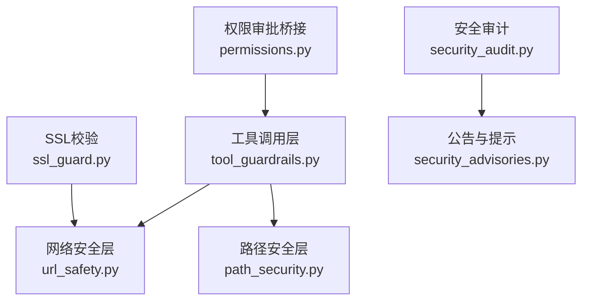
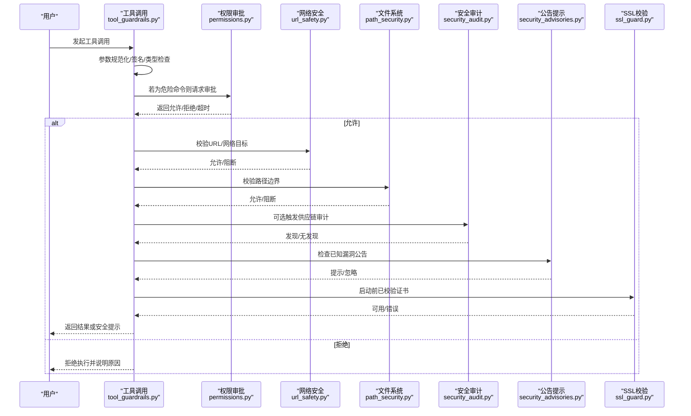
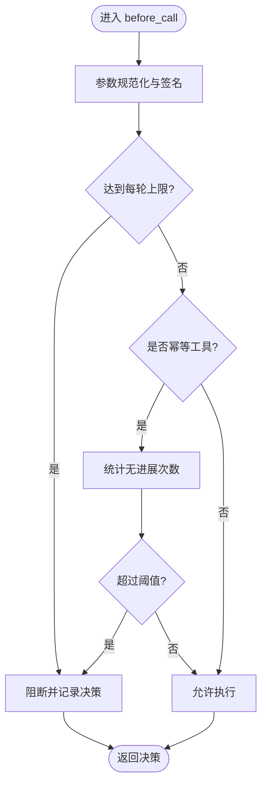
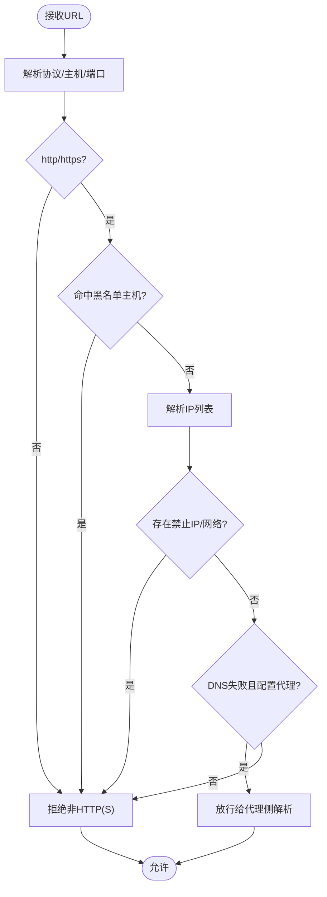
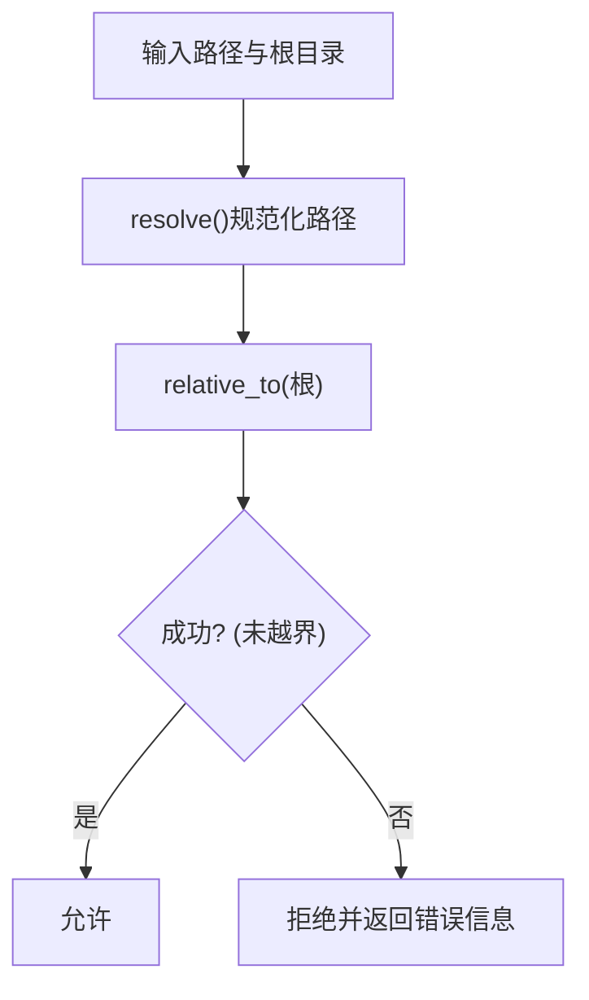
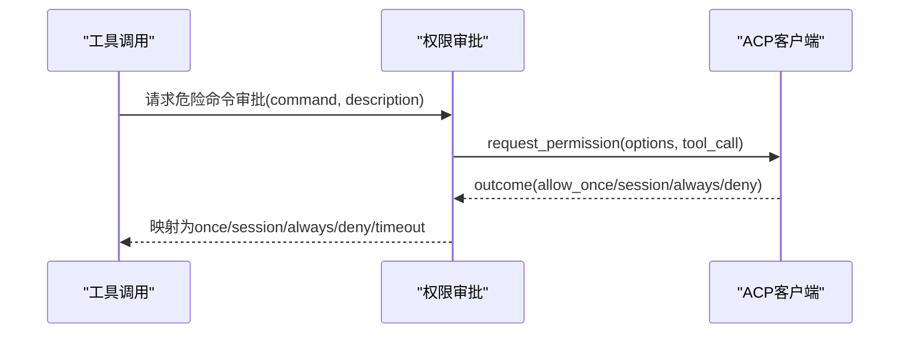
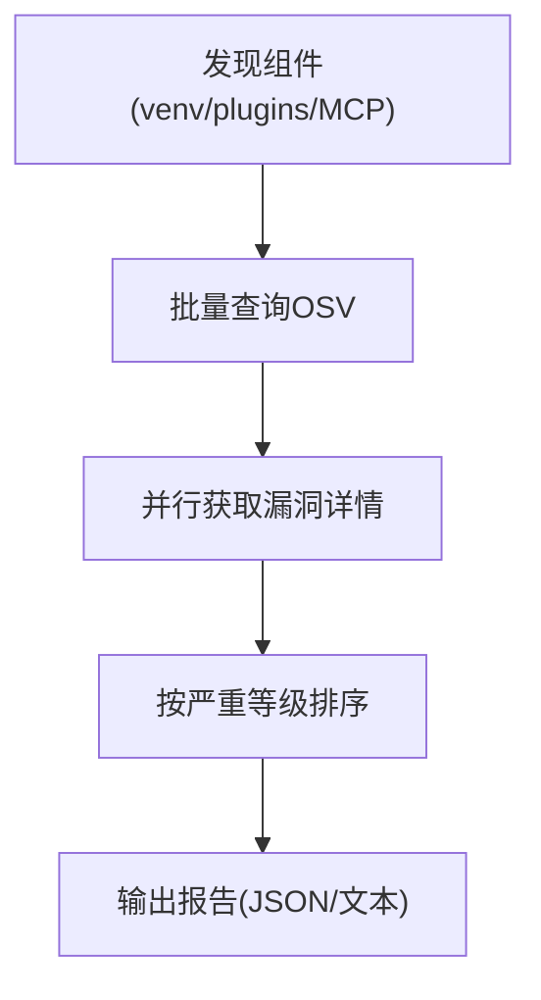
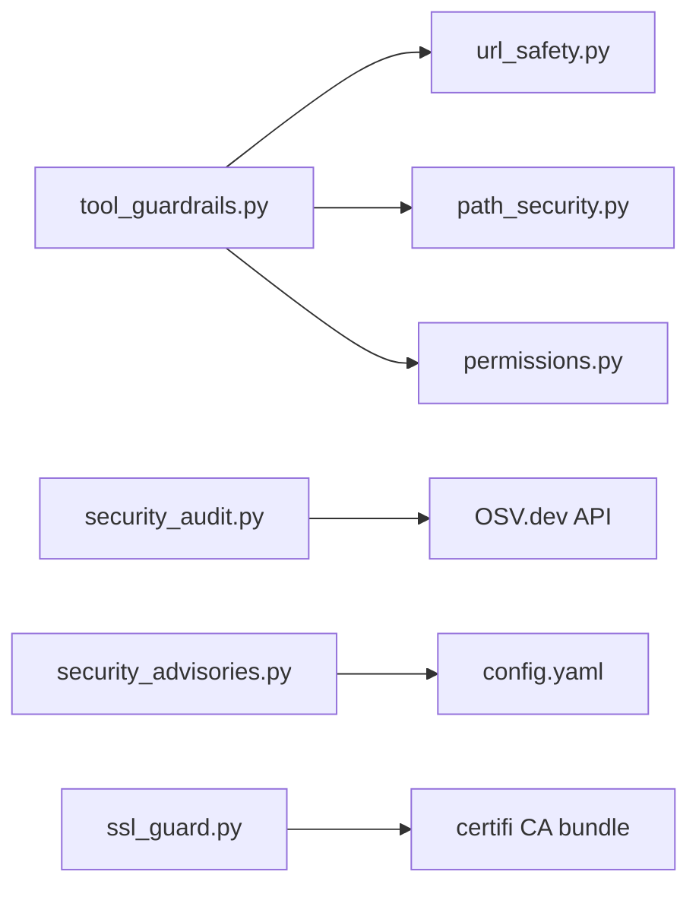

# 工具安全考虑

<cite>
**本文引用的文件**
- [agent/tool_guardrails.py](file://agent/tool_guardrails.py)
- [tools/url_safety.py](file://tools/url_safety.py)
- [tools/path_security.py](file://tools/path_security.py)
- [acp_adapter/permissions.py](file://acp_adapter/permissions.py)
- [sparkii_cli/security_audit.py](file://sparkii_cli/security_audit.py)
- [sparkii_cli/security_advisories.py](file://sparkii_cli/security_advisories.py)
- [agent/ssl_guard.py](file://agent/ssl_guard.py)
</cite>

## 目录
1. [简介](#简介)
2. [项目结构](#项目结构)
3. [核心组件](#核心组件)
4. [架构总览](#架构总览)
5. [详细组件分析](#详细组件分析)
6. [依赖关系分析](#依赖关系分析)
7. [性能与资源限制](#性能与资源限制)
8. [故障排查指南](#故障排查指南)
9. [结论](#结论)
10. [附录](#附录)

## 简介
本安全文档聚焦于工具开发中的安全考量，围绕输入验证、权限控制、网络与路径安全、资源限制、安全编码最佳实践以及安全审计与漏洞检测展开。基于仓库中现有实现，本文总结了以下关键能力：
- 输入验证：参数白名单、类型检查、长度限制（通过工具调用签名与规范化）
- 权限控制：危险命令审批桥接、会话级授权、环境变量保护
- 网络安全：SSRF防护、私有/内部地址拦截、重定向校验、代理环境兼容
- 路径安全：目录边界校验、遍历攻击防护
- 资源限制：每轮工具调用上限、循环检测与硬停止
- 安全编码：防注入、防路径穿越、最小权限原则
- 安全审计：供应链扫描、已知漏洞告警、可操作修复建议

## 项目结构
与安全相关的核心模块分布在如下位置：
- 工具调用护栏与循环检测：agent/tool_guardrails.py
- 网络安全与URL校验：tools/url_safety.py
- 路径安全校验：tools/path_security.py
- 权限审批桥接：acp_adapter/permissions.py
- 供应链安全审计：sparkii_cli/security_audit.py
- 已知漏洞公告与提示：sparkii_cli/security_advisories.py
- SSL证书校验：agent/ssl_guard.py

**图示来源**
- [agent/tool_guardrails.py:273-507](file://agent/tool_guardrails.py#L273-L507)
- [tools/url_safety.py:415-519](file://tools/url_safety.py#L415-L519)
- [tools/path_security.py:15-43](file://tools/path_security.py#L15-L43)
- [acp_adapter/permissions.py:110-182](file://acp_adapter/permissions.py#L110-L182)
- [sparkii_cli/security_audit.py:433-481](file://sparkii_cli/security_audit.py#L433-L481)
- [sparkii_cli/security_advisories.py:167-188](file://sparkii_cli/security_advisories.py#L167-L188)
- [agent/ssl_guard.py:68-101](file://agent/ssl_guard.py#L68-L101)

**章节来源**
- [agent/tool_guardrails.py:273-507](file://agent/tool_guardrails.py#L273-L507)
- [tools/url_safety.py:415-519](file://tools/url_safety.py#L415-L519)
- [tools/path_security.py:15-43](file://tools/path_security.py#L15-L43)
- [acp_adapter/permissions.py:110-182](file://acp_adapter/permissions.py#L110-L182)
- [sparkii_cli/security_audit.py:433-481](file://sparkii_cli/security_audit.py#L433-L481)
- [sparkii_cli/security_advisories.py:167-188](file://sparkii_cli/security_advisories.py#L167-L188)
- [agent/ssl_guard.py:68-101](file://agent/ssl_guard.py#L68-L101)

## 核心组件
- 工具调用护栏：对重复失败、无进展、同工具失败进行警告或阻断；提供每轮上限（如web_search、子代理）防止失控循环。
- URL安全：阻止访问私有/内部地址、云元数据端点；支持代理环境；连接时再次校验IP，避免DNS重绑定。
- 路径安全：确保目标路径在允许目录内，拒绝“..”穿越。
- 权限审批：将危险命令执行请求桥接到ACP，支持一次性/会话/永久允许或拒绝。
- 安全审计：扫描venv、插件、MCP服务器依赖，查询OSV.dev获取漏洞详情并输出报告。
- 公告提示：检测已知被破坏的包版本，提供修复步骤与持久化确认。
- SSL校验：启动前验证CA证书链可用性，给出可操作的修复指引。

**章节来源**
- [agent/tool_guardrails.py:20-83](file://agent/tool_guardrails.py#L20-L83)
- [tools/url_safety.py:1-26](file://tools/url_safety.py#L1-L26)
- [tools/path_security.py:1-6](file://tools/path_security.py#L1-L6)
- [acp_adapter/permissions.py:18-27](file://acp_adapter/permissions.py#L18-L27)
- [sparkii_cli/security_audit.py:1-18](file://sparkii_cli/security_audit.py#L1-L18)
- [sparkii_cli/security_advisories.py:1-32](file://sparkii_cli/security_advisories.py#L1-L32)
- [agent/ssl_guard.py:1-6](file://agent/ssl_guard.py#L1-L6)

## 架构总览
下图展示了从工具调用到安全策略执行的端到端流程，包括输入验证、权限审批、网络安全与路径安全、资源限制与安全审计。

**图示来源**
- [agent/tool_guardrails.py:295-440](file://agent/tool_guardrails.py#L295-L440)
- [acp_adapter/permissions.py:110-182](file://acp_adapter/permissions.py#L110-L182)
- [tools/url_safety.py:415-519](file://tools/url_safety.py#L415-L519)
- [tools/path_security.py:15-43](file://tools/path_security.py#L15-L43)
- [sparkii_cli/security_audit.py:433-481](file://sparkii_cli/security_audit.py#L433-L481)
- [sparkii_cli/security_advisories.py:167-188](file://sparkii_cli/security_advisories.py#L167-L188)
- [agent/ssl_guard.py:68-101](file://agent/ssl_guard.py#L68-L101)

## 详细组件分析

### 工具调用护栏与循环检测
- 功能要点：
  - 识别幂等与变更型工具，统计失败次数与无进展情况，提供警告或阻断。
  - 每轮上限：限制web_search与delegate_task（子代理）调用次数，防止失控循环。
  - 参数规范化与签名：使用JSON排序键生成稳定签名，便于去重与计数。
- 安全收益：
  - 防止恶意或异常模型行为导致的无限重试与资源耗尽。
  - 降低因相同失败路径反复尝试造成的系统不稳定。

**图示来源**
- [agent/tool_guardrails.py:295-440](file://agent/tool_guardrails.py#L295-L440)
- [agent/tool_guardrails.py:447-507](file://agent/tool_guardrails.py#L447-L507)

**章节来源**
- [agent/tool_guardrails.py:20-83](file://agent/tool_guardrails.py#L20-L83)
- [agent/tool_guardrails.py:273-440](file://agent/tool_guardrails.py#L273-L440)
- [agent/tool_guardrails.py:447-507](file://agent/tool_guardrails.py#L447-L507)

### 网络安全与URL安全
- 功能要点：
  - 阻止访问私有/内部地址、环回地址、链路本地地址、CGNAT范围及云元数据端点。
  - 支持代理环境：当DNS解析失败且配置了代理时，允许交由代理侧解析。
  - 连接时二次校验：在TCP连接建立前再次解析并校验IP，缓解DNS重绑定风险。
  - 敏感查询参数检测：识别可能携带凭据的参数名，用于下游处理时的脱敏或阻断。
- 安全收益：
  - 有效防御SSRF攻击，避免访问内部服务或云实例元数据。
  - 在复杂网络环境中保持安全性与可用性平衡。

**图示来源**
- [tools/url_safety.py:415-519](file://tools/url_safety.py#L415-L519)
- [tools/url_safety.py:539-595](file://tools/url_safety.py#L539-L595)

**章节来源**
- [tools/url_safety.py:1-26](file://tools/url_safety.py#L1-L26)
- [tools/url_safety.py:106-161](file://tools/url_safety.py#L106-L161)
- [tools/url_safety.py:311-408](file://tools/url_safety.py#L311-L408)
- [tools/url_safety.py:415-519](file://tools/url_safety.py#L415-L519)
- [tools/url_safety.py:539-595](file://tools/url_safety.py#L539-L595)

### 路径安全与目录边界
- 功能要点：
  - 使用Path.resolve()与relative_to()确保目标路径位于允许根目录下。
  - 快速检测“..”穿越组件，提前拒绝可疑路径。
- 安全收益：
  - 防止路径遍历攻击，限制工具仅能访问指定工作目录。

**图示来源**
- [tools/path_security.py:15-43](file://tools/path_security.py#L15-L43)

**章节来源**
- [tools/path_security.py:1-6](file://tools/path_security.py#L1-L6)
- [tools/path_security.py:15-43](file://tools/path_security.py#L15-L43)

### 权限控制与审批桥接
- 功能要点：
  - 将危险命令执行请求转换为ACP权限选项（一次性/会话/永久允许或拒绝）。
  - 超时自动拒绝，异常默认拒绝，保证最小权限原则。
  - 映射ACP结果为Hermes审批字符串，统一处理语义。
- 安全收益：
  - 对高风险操作实施显式授权，避免误用或恶意利用。

**图示来源**
- [acp_adapter/permissions.py:110-182](file://acp_adapter/permissions.py#L110-L182)

**章节来源**
- [acp_adapter/permissions.py:18-27](file://acp_adapter/permissions.py#L18-L27)
- [acp_adapter/permissions.py:110-182](file://acp_adapter/permissions.py#L110-L182)

### 安全审计与漏洞检测
- 功能要点：
  - 扫描venv、插件requirements/pyproject、MCP服务器命令参数，提取组件名称与版本。
  - 批量查询OSV.dev获取漏洞ID，并行拉取详情（严重等级、摘要、修复版本）。
  - 输出人类可读或JSON格式报告，支持按严重等级退出码控制。
- 安全收益：
  - 主动发现供应链风险，提供可操作的修复建议，减少未知漏洞影响面。

**图示来源**
- [sparkii_cli/security_audit.py:84-103](file://sparkii_cli/security_audit.py#L84-L103)
- [sparkii_cli/security_audit.py:300-329](file://sparkii_cli/security_audit.py#L300-L329)
- [sparkii_cli/security_audit.py:386-408](file://sparkii_cli/security_audit.py#L386-L408)
- [sparkii_cli/security_audit.py:433-481](file://sparkii_cli/security_audit.py#L433-L481)

**章节来源**
- [sparkii_cli/security_audit.py:1-18](file://sparkii_cli/security_audit.py#L1-L18)
- [sparkii_cli/security_audit.py:84-103](file://sparkii_cli/security_audit.py#L84-L103)
- [sparkii_cli/security_audit.py:300-329](file://sparkii_cli/security_audit.py#L300-L329)
- [sparkii_cli/security_audit.py:386-408](file://sparkii_cli/security_audit.py#L386-L408)
- [sparkii_cli/security_audit.py:433-481](file://sparkii_cli/security_audit.py#L433-L481)

### 已知漏洞公告与提示
- 功能要点：
  - 检测当前环境中是否存在已知被破坏的包版本。
  - 提供修复步骤，支持持久化确认以避免重复提示。
  - 启动横幅与网关日志提示，帮助运维人员及时响应。
- 安全收益：
  - 快速暴露高危供应链事件，缩短响应时间，降低损失。

**章节来源**
- [sparkii_cli/security_advisories.py:1-32](file://sparkii_cli/security_advisories.py#L1-L32)
- [sparkii_cli/security_advisories.py:95-129](file://sparkii_cli/security_advisories.py#L95-L129)
- [sparkii_cli/security_advisories.py:167-188](file://sparkii_cli/security_advisories.py#L167-L188)
- [sparkii_cli/security_advisories.py:202-257](file://sparkii_cli/security_advisories.py#L202-L257)
- [sparkii_cli/security_advisories.py:424-454](file://sparkii_cli/security_advisories.py#L424-L454)

### SSL证书校验
- 功能要点：
  - 启动前验证配置的CA证书与内置certifi证书可用。
  - 提供明确的修复指引（重新安装certifi、修正环境变量）。
- 安全收益：
  - 避免因证书链损坏导致的安全通信失败或被劫持风险。

**章节来源**
- [agent/ssl_guard.py:1-6](file://agent/ssl_guard.py#L1-L6)
- [agent/ssl_guard.py:68-101](file://agent/ssl_guard.py#L68-L101)

## 依赖关系分析
- 组件耦合：
  - 工具调用护栏依赖URL安全与路径安全进行前置校验。
  - 权限审批桥接与工具调用护栏协同，确保危险操作需显式授权。
  - 安全审计与公告提示独立运行，但可与工具调用流程集成以增强运行时可见性。
- 外部依赖：
  - OSV.dev用于漏洞信息查询。
  - httpx/httpcore用于网络传输，并通过自定义后端强化SSRF防护。
  - certifi用于CA证书管理。

**图示来源**
- [agent/tool_guardrails.py:295-440](file://agent/tool_guardrails.py#L295-L440)
- [tools/url_safety.py:415-519](file://tools/url_safety.py#L415-L519)
- [tools/path_security.py:15-43](file://tools/path_security.py#L15-L43)
- [acp_adapter/permissions.py:110-182](file://acp_adapter/permissions.py#L110-L182)
- [sparkii_cli/security_audit.py:300-329](file://sparkii_cli/security_audit.py#L300-L329)
- [sparkii_cli/security_advisories.py:202-257](file://sparkii_cli/security_advisories.py#L202-L257)
- [agent/ssl_guard.py:68-101](file://agent/ssl_guard.py#L68-L101)

**章节来源**
- [agent/tool_guardrails.py:295-440](file://agent/tool_guardrails.py#L295-L440)
- [tools/url_safety.py:415-519](file://tools/url_safety.py#L415-L519)
- [tools/path_security.py:15-43](file://tools/path_security.py#L15-L43)
- [acp_adapter/permissions.py:110-182](file://acp_adapter/permissions.py#L110-L182)
- [sparkii_cli/security_audit.py:300-329](file://sparkii_cli/security_audit.py#L300-L329)
- [sparkii_cli/security_advisories.py:202-257](file://sparkii_cli/security_advisories.py#L202-L257)
- [agent/ssl_guard.py:68-101](file://agent/ssl_guard.py#L68-L101)

## 性能与资源限制
- CPU使用限制：
  - 通过每轮工具调用上限（web_search、子代理）限制计算开销，避免CPU耗尽。
- 内存占用控制：
  - 参数规范化与签名采用紧凑JSON，减少内存占用；结果哈希用于去重与计数。
- 磁盘空间保护：
  - 路径边界校验限制写入范围，避免意外覆盖或填充磁盘。
- 网络I/O限制：
  - URL安全在连接时再次校验IP，减少无效或恶意连接带来的带宽浪费。

[本节提供通用指导，不直接分析具体文件]

## 故障排查指南
- 常见安全问题与定位：
  - SSRF阻断：检查URL是否命中私有/内部地址或云元数据端点；查看代理配置与DNS解析结果。
  - 路径穿越：确认目标路径是否在允许根目录下；检查是否存在“..”组件。
  - 权限拒绝：确认ACP审批是否超时或拒绝；检查会话上下文与权限选项。
  - SSL错误：验证CA证书路径与环境变量；执行修复命令或重新安装certifi。
  - 供应链漏洞：运行安全审计，根据报告升级或替换受影响组件。
- 操作建议：
  - 启用严格模式：开启硬停止与每轮上限，降低失控风险。
  - 定期审计：结合安全审计与公告提示，持续跟踪依赖风险。
  - 最小权限：仅在必要时授予临时或会话级权限，避免永久允许。

**章节来源**
- [tools/url_safety.py:415-519](file://tools/url_safety.py#L415-L519)
- [tools/path_security.py:15-43](file://tools/path_security.py#L15-L43)
- [acp_adapter/permissions.py:110-182](file://acp_adapter/permissions.py#L110-L182)
- [agent/ssl_guard.py:68-101](file://agent/ssl_guard.py#L68-L101)
- [sparkii_cli/security_audit.py:433-481](file://sparkii_cli/security_audit.py#L433-L481)
- [sparkii_cli/security_advisories.py:167-188](file://sparkii_cli/security_advisories.py#L167-L188)

## 结论
本仓库在工具开发中实现了多层次的安全保障：从输入验证、权限控制到网络安全与路径安全，再到资源限制与安全审计。这些机制共同构成了一个健壮的安全基线，能够有效抵御常见威胁（如SSRF、路径穿越、供应链攻击），并提供可操作的修复与审计能力。建议在部署与使用中启用严格模式，定期执行安全审计，并结合公告提示及时响应已知风险。

[本节总结性内容，不直接分析具体文件]

## 附录
- 安全编码最佳实践：
  - 始终对用户输入进行白名单校验与类型检查。
  - 使用参数化查询与转义防止SQL注入；避免拼接命令防止命令注入。
  - 使用路径规范化与边界校验防止路径遍历。
  - 遵循最小权限原则，按需授予临时或会话级权限。
  - 在网络请求前后进行双重校验，防范DNS重绑定与重定向绕过。
- 安全审计方法：
  - 定期运行供应链审计，关注高严重等级漏洞。
  - 结合公告提示，快速识别并修复已知风险。
  - 在CI/CD中集成安全检查，确保新依赖引入时自动评估风险。

[本节提供通用指导，不直接分析具体文件]