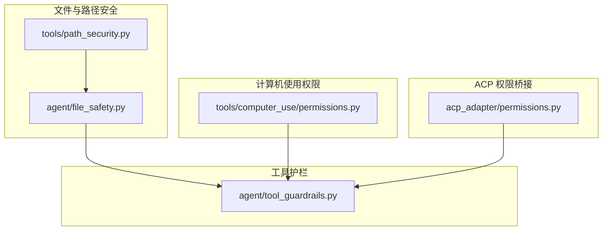
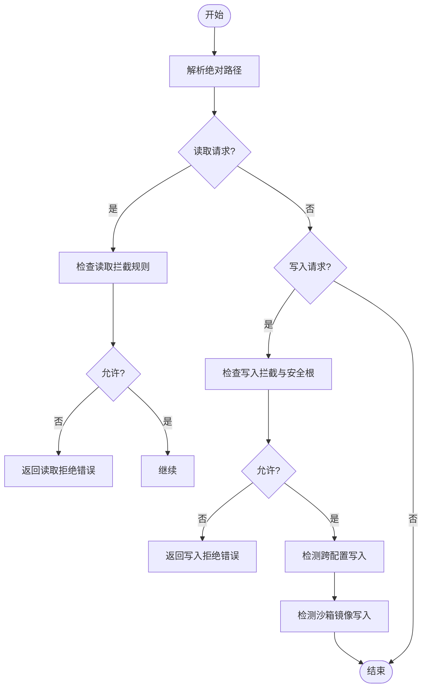
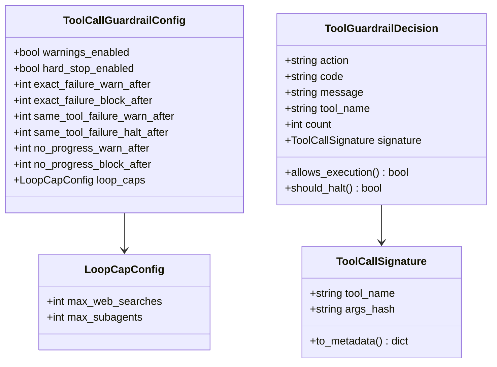
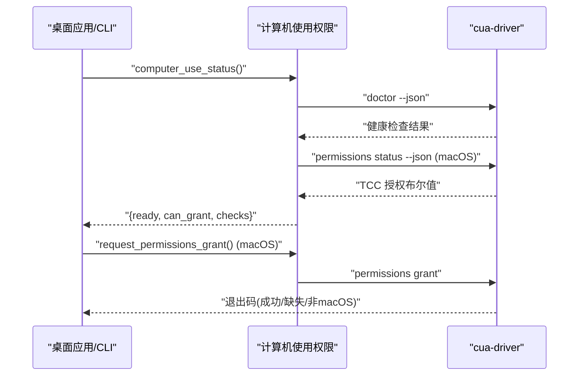
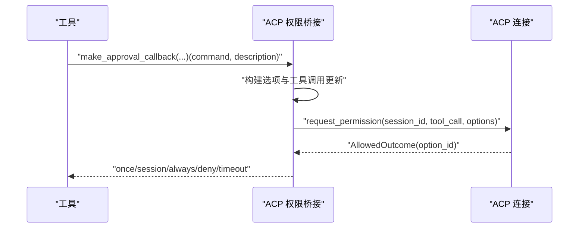
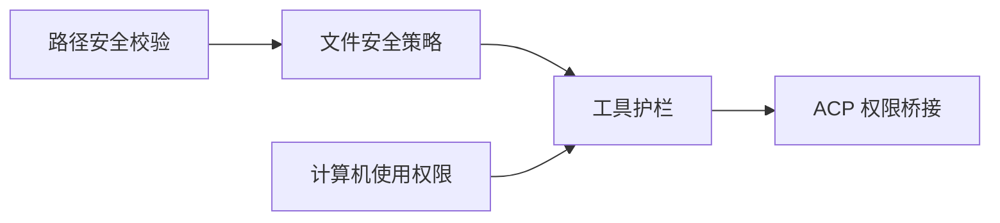

# 权限控制系统

<cite>
**本文引用的文件**
- [acp_adapter/permissions.py](file://acp_adapter/permissions.py)
- [tools/computer_use/permissions.py](file://tools/computer_use/permissions.py)
- [agent/tool_guardrails.py](file://agent/tool_guardrails.py)
- [agent/file_safety.py](file://agent/file_safety.py)
- [tools/path_security.py](file://tools/path_security.py)
</cite>

## 目录
1. [简介](#简介)
2. [项目结构](#项目结构)
3. [核心组件](#核心组件)
4. [架构总览](#架构总览)
5. [详细组件分析](#详细组件分析)
6. [依赖关系分析](#依赖关系分析)
7. [性能考量](#性能考量)
8. [故障排查指南](#故障排查指南)
9. [结论](#结论)
10. [附录](#附录)

## 简介
本文件聚焦“工具执行时的权限控制”，围绕以下目标展开：
- 文件访问权限控制：读写权限检查、目录遍历限制、敏感文件保护。
- 网络请求限制：域名白名单、协议限制与超时控制（概念性说明，结合现有安全能力）。
- 环境变量保护：敏感变量过滤、隔离与动态注入控制。
- 进程权限管理：用户权限降级、系统调用限制与资源访问控制（概念性说明）。
- 沙箱隔离：文件系统沙箱、网络沙箱与内存隔离（概念性说明）。
- 权限审计：操作日志记录、权限变更追踪与违规告警。

本仓库在文件安全、工具调用护栏、跨平台计算机使用权限等方面提供了可落地的实现；网络、进程与沙箱相关部分以概念性建议为主，便于在现有基础上扩展。

## 项目结构
与权限控制直接相关的核心模块分布如下：
- 文件安全与路径校验：agent/file_safety.py、tools/path_security.py
- 工具调用护栏与循环防护：agent/tool_guardrails.py
- 跨平台计算机使用权限：tools/computer_use/permissions.py
- ACP 权限桥接（危险命令审批）：acp_adapter/permissions.py



图表来源
- [agent/file_safety.py:1-694](file://agent/file_safety.py#L1-L694)
- [tools/path_security.py:1-44](file://tools/path_security.py#L1-L44)
- [agent/tool_guardrails.py:1-633](file://agent/tool_guardrails.py#L1-L633)
- [tools/computer_use/permissions.py:1-199](file://tools/computer_use/permissions.py#L1-L199)
- [acp_adapter/permissions.py:1-183](file://acp_adapter/permissions.py#L1-L183)

章节来源
- [agent/file_safety.py:1-694](file://agent/file_safety.py#L1-L694)
- [tools/path_security.py:1-44](file://tools/path_security.py#L1-L44)
- [agent/tool_guardrails.py:1-633](file://agent/tool_guardrails.py#L1-L633)
- [tools/computer_use/permissions.py:1-199](file://tools/computer_use/permissions.py#L1-L199)
- [acp_adapter/permissions.py:1-183](file://acp_adapter/permissions.py#L1-L183)

## 核心组件
- 文件安全策略（读/写/跨配置/沙箱镜像）：提供受保护路径清单、读取拦截、写入拦截、跨配置写入警告、容器/沙箱镜像写入警告等。
- 路径安全校验：统一的路径解析与越界检测、遍历组件检测。
- 工具调用护栏：识别幂等/可变工具、统计失败与无进展重复调用、按轮次限制搜索与子代理数量、生成阻断/警告决策。
- 计算机使用权限：macOS TCC 授权状态查询与申请、多平台驱动健康检查。
- ACP 权限桥接：将危险命令执行前的审批流程映射为 ACP 选项，支持一次性/会话级/永久允许或拒绝，并带超时处理。

章节来源
- [agent/file_safety.py:1-694](file://agent/file_safety.py#L1-L694)
- [tools/path_security.py:1-44](file://tools/path_security.py#L1-L44)
- [agent/tool_guardrails.py:1-633](file://agent/tool_guardrails.py#L1-L633)
- [tools/computer_use/permissions.py:1-199](file://tools/computer_use/permissions.py#L1-L199)
- [acp_adapter/permissions.py:1-183](file://acp_adapter/permissions.py#L1-L183)

## 架构总览
下图展示了工具执行时从“入口”到“安全决策”的关键路径：工具调用先经过路径与文件安全校验，再进入工具护栏进行循环与配额控制；对需要用户确认的危险操作通过 ACP 权限桥接发起审批；跨平台计算机使用能力通过驱动健康与 TCC 授权状态保障可用性与合规性。

```mermaid
sequenceDiagram
participant Tool as "工具调用方"
participant PathSec as "路径安全校验"
participant FileSafe as "文件安全策略"
participant Guard as "工具护栏"
participant ACP as "ACP 权限桥接"
participant CUA as "计算机使用权限"
Tool->>PathSec : "验证路径是否在允许目录内"
PathSec-->>Tool : "通过/错误"
Tool->>FileSafe : "读取/写入前检查"
FileSafe-->>Tool : "允许/拒绝/警告"
Tool->>Guard : "before_call/after_call"
Guard-->>Tool : "允许/警告/阻断/停止"
alt 需要用户审批
Tool->>ACP : "发起危险命令审批"
ACP-->>Tool : "允许/拒绝/超时"
end
if 需要屏幕/辅助功能
Tool->>CUA : "查询/申请权限"
CUA-->>Tool : "就绪/不可用"
end
```

图表来源
- [tools/path_security.py:15-34](file://tools/path_security.py#L15-L34)
- [agent/file_safety.py:161-177](file://agent/file_safety.py#L161-L177)
- [agent/tool_guardrails.py:295-348](file://agent/tool_guardrails.py#L295-L348)
- [acp_adapter/permissions.py:110-183](file://acp_adapter/permissions.py#L110-L183)
- [tools/computer_use/permissions.py:121-161](file://tools/computer_use/permissions.py#L121-L161)

## 详细组件分析

### 文件访问权限控制（读/写/目录遍历/敏感文件）
- 读取拦截：针对 Sparkii 内部缓存、凭据存储、项目本地 .env 等敏感位置进行读取拦截，返回明确错误信息。
- 写入拦截：维护精确的敏感文件黑名单与敏感目录前缀；当启用 SPARKII_WRITE_SAFE_ROOT 时，仅允许向指定安全根目录写入。
- 跨配置写入：检测写入是否落入其他配置的受控区域（skills/plugins/cron/memories），给出软拦截提示并要求显式确认。
- 沙箱镜像写入：检测写入是否命中容器/沙箱镜像路径，避免在镜像副本上产生“静默成功但主机未生效”的问题。
- 路径安全：统一进行 resolve + relative_to 校验，防止目录穿越；快速检测 .. 组件。



图表来源
- [agent/file_safety.py:161-177](file://agent/file_safety.py#L161-L177)
- [agent/file_safety.py:194-337](file://agent/file_safety.py#L194-L337)
- [agent/file_safety.py:417-506](file://agent/file_safety.py#L417-L506)
- [agent/file_safety.py:551-616](file://agent/file_safety.py#L551-L616)
- [tools/path_security.py:15-44](file://tools/path_security.py#L15-L44)

章节来源
- [agent/file_safety.py:1-694](file://agent/file_safety.py#L1-L694)
- [tools/path_security.py:1-44](file://tools/path_security.py#L1-L44)

### 工具调用护栏（循环与配额控制）
- 工具分类：区分幂等工具与可变工具，用于无进展检测与失败计数。
- 失败与无进展检测：统计相同参数失败次数、同一工具失败次数、幂等工具重复结果次数，达到阈值后发出警告或阻断。
- 每轮配额：限制单轮 web_search 与 delegate_task（子代理）调用上限，防止失控循环。
- 决策输出：生成结构化决策（允许/警告/阻断/停止），并可附加元数据用于审计与展示。



图表来源
- [agent/tool_guardrails.py:63-126](file://agent/tool_guardrails.py#L63-L126)
- [agent/tool_guardrails.py:139-173](file://agent/tool_guardrails.py#L139-L173)
- [agent/tool_guardrails.py:176-222](file://agent/tool_guardrails.py#L176-L222)
- [agent/tool_guardrails.py:273-348](file://agent/tool_guardrails.py#L273-L348)
- [agent/tool_guardrails.py:447-507](file://agent/tool_guardrails.py#L447-L507)

章节来源
- [agent/tool_guardrails.py:1-633](file://agent/tool_guardrails.py#L1-L633)

### 跨平台计算机使用权限（macOS TCC 与驱动健康）
- 统一状态查询：通过驱动健康检查与 macOS TCC 授权状态合并输出 ready、can_grant、checks 等字段。
- 权限申请：在 macOS 上通过 LaunchServices 触发 TCC 对话框，授予辅助功能与屏幕录制权限。
- 环境隔离：子进程环境变量进行脱敏，避免泄露密钥。



图表来源
- [tools/computer_use/permissions.py:121-161](file://tools/computer_use/permissions.py#L121-L161)
- [tools/computer_use/permissions.py:164-199](file://tools/computer_use/permissions.py#L164-L199)
- [tools/computer_use/permissions.py:46-76](file://tools/computer_use/permissions.py#L46-L76)

章节来源
- [tools/computer_use/permissions.py:1-199](file://tools/computer_use/permissions.py#L1-L199)

### ACP 权限桥接（危险命令审批）
- 选项映射：将一次性允许、会话级允许、永久允许与拒绝映射为 ACP 选项。
- 审批回调：构造工具调用更新，异步调度至事件循环，等待用户响应，支持超时自动拒绝。
- 结果映射：将 ACP 返回结果映射为 Sparkii 审批语义（once/session/always/deny/timeout）。



图表来源
- [acp_adapter/permissions.py:41-73](file://acp_adapter/permissions.py#L41-L73)
- [acp_adapter/permissions.py:76-95](file://acp_adapter/permissions.py#L76-L95)
- [acp_adapter/permissions.py:110-183](file://acp_adapter/permissions.py#L110-L183)

章节来源
- [acp_adapter/permissions.py:1-183](file://acp_adapter/permissions.py#L1-L183)

### 网络请求限制（概念性说明）
- 域名白名单：建议在网关或 HTTP 客户端层维护域名白名单，仅允许预注册域名出站。
- 协议限制：仅允许必要协议（如 https），禁用不安全协议（如 http、ftp）。
- 超时控制：对所有外部请求设置合理超时与重试上限，避免长时间阻塞或被滥用。
- 与现有能力的衔接：当前代码库中的工具护栏可对“web_search”等高风险工具进行每轮配额限制，可作为上层网络行为控制的补充。

[本节为概念性说明，不直接分析具体文件]

### 环境变量保护（敏感变量过滤、隔离与动态注入控制）
- 子进程环境脱敏：在调用第三方二进制（如 cua-driver）时，对子进程环境变量进行脱敏，避免继承敏感键。
- 最小化暴露：仅在必要时注入运行所需的环境变量，避免全量继承父进程环境。
- 动态注入控制：对运行时注入的环境变量进行白名单校验与格式校验，防止注入攻击。

章节来源
- [tools/computer_use/permissions.py:46-76](file://tools/computer_use/permissions.py#L46-L76)

### 进程权限管理（概念性说明）
- 用户权限降级：在可能场景下以最小权限用户运行工具与子进程。
- 系统调用限制：在受限环境中通过系统能力（如 seccomp、SELinux/AppArmor）限制系统调用。
- 资源访问控制：结合操作系统 ACL 与容器卷挂载限制，确保进程只能访问必要资源。

[本节为概念性说明，不直接分析具体文件]

### 沙箱隔离（概念性说明）
- 文件系统沙箱：通过只读根、白名单目录、chroot/命名空间等手段限制文件系统访问。
- 网络沙箱：限制出站连接、端口与协议，结合域名白名单与超时控制。
- 内存隔离：为每个任务分配独立内存空间，限制共享内存与敏感数据驻留。

[本节为概念性说明，不直接分析具体文件]

### 权限审计（操作日志、变更追踪与违规告警）
- 操作日志：对关键权限决策（读/写拦截、工具护栏阻断、ACP 审批结果）记录结构化日志，包含时间戳、主体、动作、结果与上下文。
- 权限变更追踪：记录配置项（如 SPARKII_WRITE_SAFE_ROOT、工具护栏阈值）的变更历史与责任人。
- 违规告警：对高频拒绝、异常模式（如大量失败重试、跨配置写入尝试）触发告警，便于运营与审计。

[本节为概念性说明，不直接分析具体文件]

## 依赖关系分析
- 文件安全与路径安全：路径安全校验作为前置条件，文件安全策略在此基础上实施更细粒度的读/写拦截与警告。
- 工具护栏：依赖工具分类与结果判定，对失败与无进展进行统计，并在必要时阻断。
- ACP 权限桥接：与工具护栏协同，对危险命令进行用户审批后再执行。
- 计算机使用权限：独立于文件安全，但在 UI 自动化场景中影响工具可用性。



图表来源
- [tools/path_security.py:15-34](file://tools/path_security.py#L15-L34)
- [agent/file_safety.py:161-177](file://agent/file_safety.py#L161-L177)
- [agent/tool_guardrails.py:295-348](file://agent/tool_guardrails.py#L295-L348)
- [acp_adapter/permissions.py:110-183](file://acp_adapter/permissions.py#L110-L183)
- [tools/computer_use/permissions.py:121-161](file://tools/computer_use/permissions.py#L121-L161)

章节来源
- [tools/path_security.py:1-44](file://tools/path_security.py#L1-L44)
- [agent/file_safety.py:1-694](file://agent/file_safety.py#L1-L694)
- [agent/tool_guardrails.py:1-633](file://agent/tool_guardrails.py#L1-L633)
- [acp_adapter/permissions.py:1-183](file://acp_adapter/permissions.py#L1-L183)
- [tools/computer_use/permissions.py:1-199](file://tools/computer_use/permissions.py#L1-L199)

## 性能考量
- 路径解析与相对校验开销较低，适合在工具入口高频调用。
- 工具护栏的计数与哈希计算在单轮内重置，避免长期累积带来的内存压力。
- ACP 审批回调具备超时机制，避免长耗时阻塞主循环。
- 计算机使用权限查询通过 JSON 输出与超时控制，降低外部二进制调用的不确定性。

[本节为通用性能讨论，不直接分析具体文件]

## 故障排查指南
- 读取被拒：检查路径是否命中内部缓存、凭据文件或项目 .env 黑名单；确认是否为相对路径导致解析偏差。
- 写入被拒：检查是否位于敏感目录前缀或受保护文件；若启用了安全根，确认目标路径是否在其范围内。
- 跨配置写入：确认当前配置名与目标路径所属配置是否一致；如需跨配置，需显式确认。
- 沙箱镜像写入：确认是否误写容器/沙箱镜像路径；应指向宿主侧权威路径或使用宿主侧工具。
- 工具护栏阻断：查看失败次数与重复结果计数；调整参数或策略以避免无限重试；必要时提高阈值或关闭硬停止（谨慎）。
- ACP 审批超时：检查事件循环调度是否正常；适当增加超时时间或排查客户端响应问题。
- 计算机使用不可用：检查驱动安装与健康状态；在 macOS 上完成 TCC 授权。

章节来源
- [agent/file_safety.py:194-337](file://agent/file_safety.py#L194-L337)
- [agent/file_safety.py:417-506](file://agent/file_safety.py#L417-L506)
- [agent/file_safety.py:551-616](file://agent/file_safety.py#L551-L616)
- [agent/tool_guardrails.py:295-348](file://agent/tool_guardrails.py#L295-L348)
- [acp_adapter/permissions.py:110-183](file://acp_adapter/permissions.py#L110-L183)
- [tools/computer_use/permissions.py:121-161](file://tools/computer_use/permissions.py#L121-L161)

## 结论
本权限控制系统以“文件安全 + 路径校验 + 工具护栏 + ACP 审批 + 计算机使用权限”为核心，形成多层防御：
- 文件层面：严格的读/写拦截与敏感路径保护，配合安全根与跨配置/沙箱镜像警告。
- 工具层面：通过失败与无进展检测、每轮配额限制，有效抑制失控循环。
- 交互层面：通过 ACP 审批对用户意图进行显式确认，提升安全性与可解释性。
- 平台层面：跨平台计算机使用权限保障 UI 自动化能力的安全可用。

在网络、进程与沙箱方面，建议结合网关、系统与容器能力进一步加固，以实现端到端的权限治理。

[本节为总结性内容，不直接分析具体文件]

## 附录
- 关键配置与环境变量
  - SPARKII_WRITE_SAFE_ROOT：限定可写入的安全根目录列表。
  - 工具护栏阈值：warn_after/hard_stop_after 与 loop_caps 中的配额。
- 最佳实践
  - 始终传递绝对路径，避免相对路径导致的解析歧义。
  - 对高风险工具启用护栏与审批，避免自动化脚本滥用。
  - 定期审查拦截日志与告警，持续优化策略。

[本节为补充信息，不直接分析具体文件]