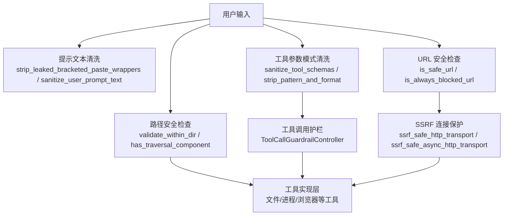
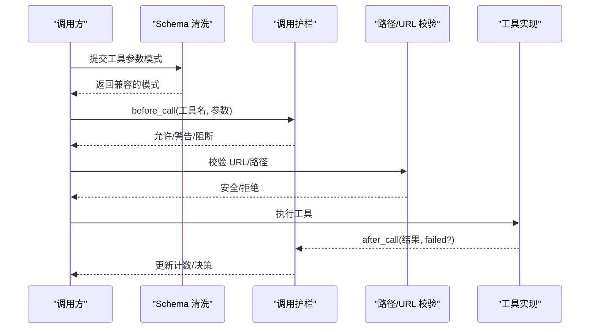
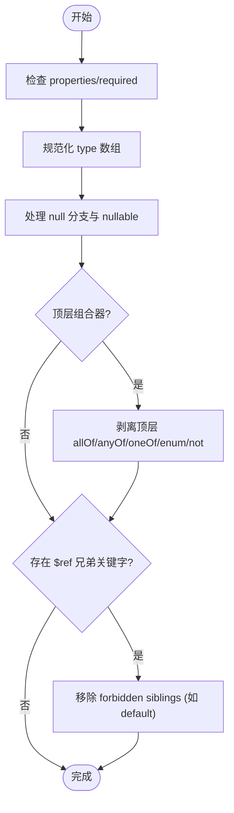
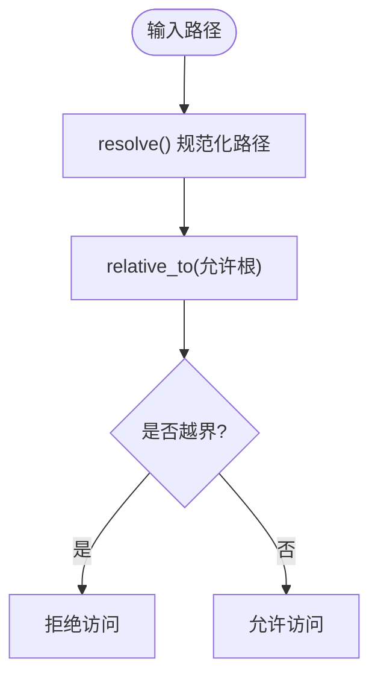
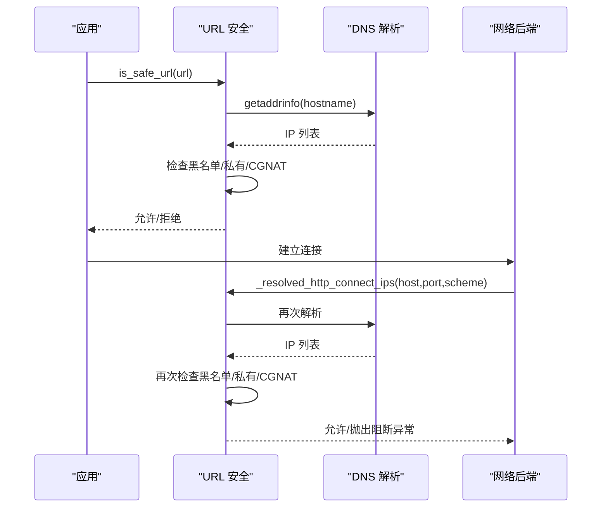
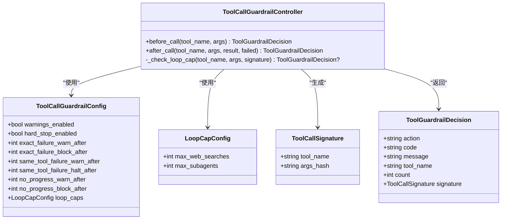
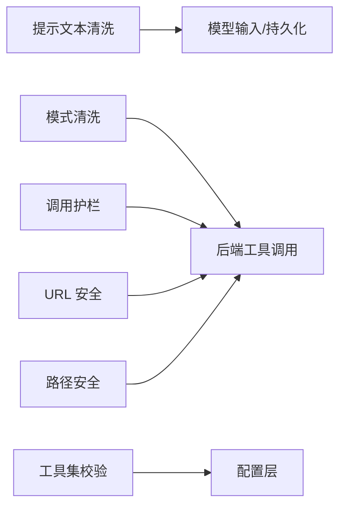

# 输入验证机制

<cite>
**本文引用的文件**
- [sparkii_cli/input_sanitize.py](file://sparkii_cli/input_sanitize.py)
- [tools/schema_sanitizer.py](file://tools/schema_sanitizer.py)
- [agent/tool_guardrails.py](file://agent/tool_guardrails.py)
- [tools/path_security.py](file://tools/path_security.py)
- [tools/url_safety.py](file://tools/url_safety.py)
- [sparkii_cli/urllib_security.py](file://sparkii_cli/urllib_security.py)
- [tests/test_sql_injection.py](file://tests/test_sql_injection.py)
</cite>

## 目录
1. [简介](#简介)
2. [项目结构](#项目结构)
3. [核心组件](#核心组件)
4. [架构总览](#架构总览)
5. [详细组件分析](#详细组件分析)
6. [依赖关系分析](#依赖关系分析)
7. [性能考量](#性能考量)
8. [故障排查指南](#故障排查指南)
9. [结论](#结论)
10. [附录](#附录)

## 简介
本文件聚焦工具开发中的输入安全，系统化梳理参数白名单、长度与嵌套限制、数据类型校验、SQL注入防护、命令注入防护以及路径遍历防护的实现策略与实践。文档基于仓库中现有的输入清洗、模式规范化、调用护栏、URL 安全与路径安全等模块进行归纳，帮助读者在工具开发中构建可复用、可测试、可扩展的输入验证体系。

## 项目结构
围绕输入安全的关键代码分布在以下位置：
- 用户提示文本清洗：用于清理终端粘贴残留与控制序列，避免污染模型输入或持久化数据。
- 工具 JSON Schema 清洗：将不同来源的工具参数模式统一为后端兼容的严格形式，修复不兼容关键字与类型数组。
- 工具调用护栏：对重复失败、无进展、超限调用进行告警与阻断，防止失控循环。
- URL 安全：阻止 SSRF，拦截私有/内部地址与云元数据端点，提供连接时重校验能力。
- 路径安全：校验目标路径是否位于允许根目录下，检测“..”穿越。
- CLI 工具集配置校验：确保平台工具集名称有效，避免静默降级。
- SQL 注入测试用例：体现参数化查询与输入清理的测试覆盖。

图表来源
- [sparkii_cli/input_sanitize.py:16-70](file://sparkii_cli/input_sanitize.py#L16-L70)
- [tools/schema_sanitizer.py:120-174](file://tools/schema_sanitizer.py#L120-L174)
- [tools/url_safety.py:415-528](file://tools/url_safety.py#L415-L528)
- [tools/path_security.py:15-43](file://tools/path_security.py#L15-L43)
- [agent/tool_guardrails.py:273-507](file://agent/tool_guardrails.py#L273-L507)

章节来源
- [sparkii_cli/input_sanitize.py:16-70](file://sparkii_cli/input_sanitize.py#L16-L70)
- [tools/schema_sanitizer.py:120-174](file://tools/schema_sanitizer.py#L120-L174)
- [tools/url_safety.py:415-528](file://tools/url_safety.py#L415-L528)
- [tools/path_security.py:15-43](file://tools/path_security.py#L15-L43)
- [agent/tool_guardrails.py:273-507](file://agent/tool_guardrails.py#L273-L507)

## 核心组件
- 提示文本清洗：去除终端粘贴包裹标记与桌面粘贴损坏伪影，保证进入模型或持久化的文本干净。
- 工具模式清洗：修复不兼容的 JSON Schema 片段（如 bare-string 类型、anyOf/oneOf 空分支、顶层组合器、$ref 兄弟关键字），并支持恢复性剥离 pattern/format 与含斜杠 enum。
- 工具调用护栏：统计相同签名失败次数、同工具失败次数、幂等调用无进展次数，按阈值发出警告或阻断；同时限制单轮内 web_search 与子代理生成数量。
- URL 安全：解析并校验主机名/IP，阻止访问私有/环回/链路本地/保留/组播/未指定地址及云元数据端点；提供连接时的 DNS 重绑定防护。
- 路径安全：通过 resolve + relative_to 校验目标路径是否在允许根目录内，并提供快速穿越检测。
- CLI 工具集校验：检查 platform_toolsets 映射中的工具集名称有效性，避免零工具静默降级。

章节来源
- [sparkii_cli/input_sanitize.py:16-70](file://sparkii_cli/input_sanitize.py#L16-L70)
- [tools/schema_sanitizer.py:120-174](file://tools/schema_sanitizer.py#L120-L174)
- [agent/tool_guardrails.py:273-507](file://agent/tool_guardrails.py#L273-L507)
- [tools/url_safety.py:415-528](file://tools/url_safety.py#L415-L528)
- [tools/path_security.py:15-43](file://tools/path_security.py#L15-L43)
- [sparkii_cli/urllib_security.py](file://sparkii_cli/urllib_security.py)
- [sparkii_cli/toolset_validation.py:18-74](file://sparkii_cli/toolset_validation.py#L18-L74)

## 架构总览
输入验证贯穿“入口清洗—模式标准化—调用护栏—执行隔离”的全链路：
- 入口清洗：对用户可见文本进行归一化，避免控制序列污染。
- 模式标准化：将工具参数模式转换为各后端稳定接受的形状，必要时恢复性剥离敏感约束。
- 调用护栏：在每次工具调用前后记录状态，依据阈值决定警告、阻断或停止。
- 执行隔离：URL 与路径在请求前与连接时双重校验，防止 SSRF 与路径穿越。

图表来源
- [tools/schema_sanitizer.py:120-174](file://tools/schema_sanitizer.py#L120-L174)
- [agent/tool_guardrails.py:295-440](file://agent/tool_guardrails.py#L295-L440)
- [tools/url_safety.py:415-528](file://tools/url_safety.py#L415-L528)
- [tools/path_security.py:15-43](file://tools/path_security.py#L15-L43)

## 详细组件分析

### 参数白名单与模式校验
- 允许的参数列表：通过 JSON Schema 的 properties 与 required 字段声明合法键集合；清洗阶段会修正非法键名并维护反向映射以还原原始键。
- 类型检查：将 type 数组规范化为单一类型或 anyOf 多类型分支；处理 null 分支与 nullable 提示，确保后端能正确解析。
- 格式验证：默认保留 pattern/format 作为提示；当后端不支持时，采用恢复性剥离策略移除这些关键字。

图表来源
- [tools/schema_sanitizer.py:401-540](file://tools/schema_sanitizer.py#L401-L540)
- [tools/schema_sanitizer.py:177-237](file://tools/schema_sanitizer.py#L177-L237)

章节来源
- [tools/schema_sanitizer.py:56-117](file://tools/schema_sanitizer.py#L56-L117)
- [tools/schema_sanitizer.py:120-174](file://tools/schema_sanitizer.py#L120-L174)
- [tools/schema_sanitizer.py:401-540](file://tools/schema_sanitizer.py#L401-L540)

### 长度限制与嵌套深度控制
- 字符串长度限制：属性键名被规范化为最大长度（例如 64 字符），避免超长键导致后端解析失败。
- 数组大小限制：通过 schema 的 items 与 anyOf 分支描述数组项类型；对于枚举值，若包含不被支持的字符（如斜杠），会在恢复性流程中移除 enum 约束以降低后端编译失败风险。
- 嵌套深度控制：递归清洗 properties/items/additionalProperties/$defs/definitions，确保深层结构也能被规范化；对顶层组合器的剥离限制在最外层，避免误伤嵌套语义。

章节来源
- [tools/schema_sanitizer.py:56-87](file://tools/schema_sanitizer.py#L56-L87)
- [tools/schema_sanitizer.py:550-624](file://tools/schema_sanitizer.py#L550-L624)
- [tools/schema_sanitizer.py:627-687](file://tools/schema_sanitizer.py#L627-L687)
- [tools/schema_sanitizer.py:401-540](file://tools/schema_sanitizer.py#L401-L540)

### 数据类型验证
- 类型转换：将 bare-string 类型节点替换为标准对象节点；将 type 数组转换为单一类型或多类型 anyOf；合并仅含 null 的分支并保留 nullable 提示。
- 格式校验：保留 pattern/format 作为提示；在后端拒绝时再剥离，兼顾兼容性。
- 边界检查：对 top-level 组合器进行剥离，避免严格后端拒绝；对 $ref 兄弟关键字进行清理，满足 draft-07 严格校验。

章节来源
- [tools/schema_sanitizer.py:401-540](file://tools/schema_sanitizer.py#L401-L540)
- [tools/schema_sanitizer.py:550-624](file://tools/schema_sanitizer.py#L550-L624)

### SQL 注入防护
- 参数化查询：使用占位符与绑定变量构造查询，禁止拼接用户输入到 SQL 字符串。
- 输入清理：在进入数据库前对输入进行清洗与类型转换，确保只接受预期格式。
- 查询构建器：优先使用 ORM/查询构建器，避免手写 SQL；如需手写，必须配合参数化与白名单校验。
- 测试覆盖：通过测试用例验证参数化查询与输入清理的有效性。

章节来源
- [tests/test_sql_injection.py](file://tests/test_sql_injection.py)

### 命令注入防护
- 命令参数验证：对传入的命令与参数进行白名单与格式校验，拒绝危险字符与非法组合。
- 特殊字符转义：在需要拼接命令时，对特殊字符进行转义，避免注入。
- 执行环境隔离：在受限环境中执行命令（如沙箱、最小权限账户），限制系统调用范围。

说明：当前仓库未发现直接实现命令执行的通用模块；建议在工具实现层遵循上述原则，并结合现有路径/URL 安全与护栏机制进行加固。

### 路径遍历防护
- 路径规范化：使用 Path.resolve() 解析符号链接与相对路径，消除“..”等穿越组件。
- 访问控制：校验目标路径相对于允许根目录的位置，越界即拒绝。
- 目录白名单：限定工具只能访问预定义的根目录集合，减少攻击面。

图表来源
- [tools/path_security.py:15-43](file://tools/path_security.py#L15-L43)

章节来源
- [tools/path_security.py:15-43](file://tools/path_security.py#L15-L43)

### URL 安全与 SSRF 防护
- 主机名/IP 黑名单：始终阻止云元数据主机名与特定 IP/网段（如 169.254.169.254）。
- 私有/内部地址拦截：阻止环回、链路本地、保留、组播、未指定地址与 CGNAT 范围。
- 全局开关：可通过环境变量或配置文件允许私有地址解析，但云元数据端点永远阻止。
- 连接时重校验：在 TCP 连接前再次解析并校验 IP，缓解 DNS 重绑定漏洞。
- 传输层保护：提供 httpx 同步/异步传输包装，强制使用受保护的连接后端。

图表来源
- [tools/url_safety.py:415-528](file://tools/url_safety.py#L415-L528)
- [tools/url_safety.py:539-595](file://tools/url_safety.py#L539-L595)
- [tools/url_safety.py:707-752](file://tools/url_safety.py#L707-L752)

章节来源
- [tools/url_safety.py:58-103](file://tools/url_safety.py#L58-L103)
- [tools/url_safety.py:137-161](file://tools/url_safety.py#L137-L161)
- [tools/url_safety.py:311-407](file://tools/url_safety.py#L311-L407)
- [tools/url_safety.py:415-528](file://tools/url_safety.py#L415-L528)
- [tools/url_safety.py:539-595](file://tools/url_safety.py#L539-L595)
- [tools/url_safety.py:707-752](file://tools/url_safety.py#L707-L752)

### 工具调用护栏与循环防护
- 失败追踪：记录相同签名的失败次数与同一工具的失败次数，超过阈值发出警告或阻断。
- 幂等无进展：对幂等工具（如读取类）重复返回相同结果时，触发无进展告警与阻断。
- 单轮上限：限制每轮 web_search 与 delegate_task（子代理）调用次数，防止失控循环。
- 决策输出：before_call/after_call 返回决策元数据，便于上层采取告警、合成结果或终止策略。

图表来源
- [agent/tool_guardrails.py:63-173](file://agent/tool_guardrails.py#L63-L173)
- [agent/tool_guardrails.py:176-223](file://agent/tool_guardrails.py#L176-L223)
- [agent/tool_guardrails.py:273-507](file://agent/tool_guardrails.py#L273-L507)

章节来源
- [agent/tool_guardrails.py:20-60](file://agent/tool_guardrails.py#L20-L60)
- [agent/tool_guardrails.py:273-507](file://agent/tool_guardrails.py#L273-L507)

## 依赖关系分析
- 提示文本清洗独立于其他模块，主要服务于 UI/模型输入净化。
- 模式清洗依赖正则与拷贝，不引入外部 I/O，适合前置标准化。
- 调用护栏依赖工具名白名单与配置，统计状态跨 before/after 生命周期。
- URL 安全依赖 socket/DNS 解析与 ipaddress 模块，提供同步/异步双路径。
- 路径安全依赖 pathlib，轻量且高效。
- CLI 工具集校验依赖外部工具集注册表（通过回调注入），保持纯函数特性以便测试。

图表来源
- [sparkii_cli/input_sanitize.py:16-70](file://sparkii_cli/input_sanitize.py#L16-L70)
- [tools/schema_sanitizer.py:120-174](file://tools/schema_sanitizer.py#L120-L174)
- [agent/tool_guardrails.py:273-507](file://agent/tool_guardrails.py#L273-L507)
- [tools/url_safety.py:415-528](file://tools/url_safety.py#L415-L528)
- [tools/path_security.py:15-43](file://tools/path_security.py#L15-L43)
- [sparkii_cli/toolset_validation.py:18-74](file://sparkii_cli/toolset_validation.py#L18-L74)

章节来源
- [sparkii_cli/input_sanitize.py:16-70](file://sparkii_cli/input_sanitize.py#L16-L70)
- [tools/schema_sanitizer.py:120-174](file://tools/schema_sanitizer.py#L120-L174)
- [agent/tool_guardrails.py:273-507](file://agent/tool_guardrails.py#L273-L507)
- [tools/url_safety.py:415-528](file://tools/url_safety.py#L415-L528)
- [tools/path_security.py:15-43](file://tools/path_security.py#L15-L43)
- [sparkii_cli/toolset_validation.py:18-74](file://sparkii_cli/toolset_validation.py#L18-L74)

## 性能考量
- 模式清洗为深拷贝与递归遍历，复杂度与 schema 规模线性相关；建议仅在工具发现或注册时执行一次。
- URL 安全涉及 DNS 解析，可能阻塞事件循环；异步路径使用线程池执行解析，降低主循环影响。
- 调用护栏统计为哈希与字典操作，开销极低；但频繁调用需关注内存占用（每轮重置计数器）。
- 路径安全使用标准库，性能良好；注意 resolve 可能跟随符号链接，应在可信上下文中使用。

## 故障排查指南
- 模式解析失败：检查是否存在 bare-string 类型、顶层组合器或 $ref 兄弟关键字；启用恢复性剥离后重试。
- URL 被拒绝：确认主机名是否命中黑名单或解析为私有/内部地址；检查全局开关与代理配置。
- 路径访问被拒：确认目标路径是否越界；检查符号链接与相对路径规范化。
- 工具调用被阻断：查看护栏决策码与消息，调整参数或策略以避免重复失败或无进展。
- 工具集为空：检查 platform_toolsets 配置是否正确；根据提示修正工具集名称。

章节来源
- [tools/schema_sanitizer.py:550-624](file://tools/schema_sanitizer.py#L550-L624)
- [tools/url_safety.py:415-528](file://tools/url_safety.py#L415-L528)
- [tools/path_security.py:15-43](file://tools/path_security.py#L15-L43)
- [agent/tool_guardrails.py:273-507](file://agent/tool_guardrails.py#L273-L507)
- [sparkii_cli/toolset_validation.py:18-74](file://sparkii_cli/toolset_validation.py#L18-L74)

## 结论
本仓库提供了从输入清洗、模式标准化、调用护栏到执行隔离的完整输入安全基线。通过参数白名单、类型与格式校验、长度与嵌套控制、SQL/命令/路径/URL 防护，可在工具开发中显著降低安全风险。建议在新工具中优先复用现有模块，并在配置层启用必要的开关与限制，以实现“默认安全”的设计目标。

## 附录
- 最佳实践清单
  - 所有用户输入先清洗再使用。
  - 工具参数模式必须经过标准化与恢复性剥离。
  - 工具调用前后必须接入护栏，记录失败与无进展。
  - 所有网络请求必须通过 URL 安全校验，并使用受保护的传输。
  - 所有文件系统访问必须通过路径安全校验，限制根目录。
  - 数据库操作必须使用参数化查询与查询构建器。
  - 定期运行测试用例，覆盖注入与越权场景。