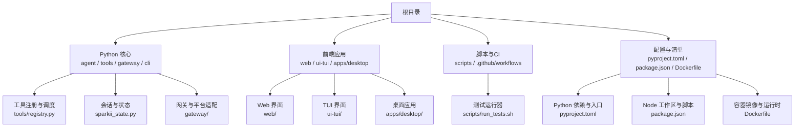
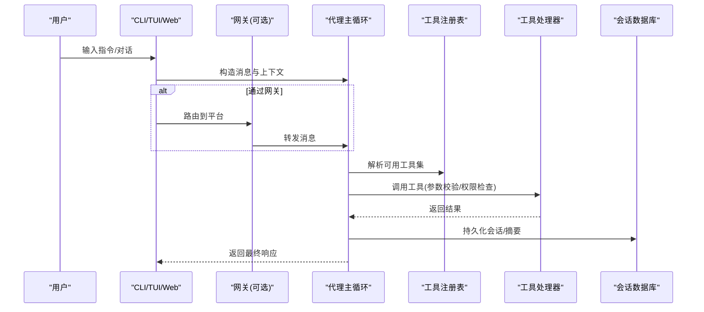
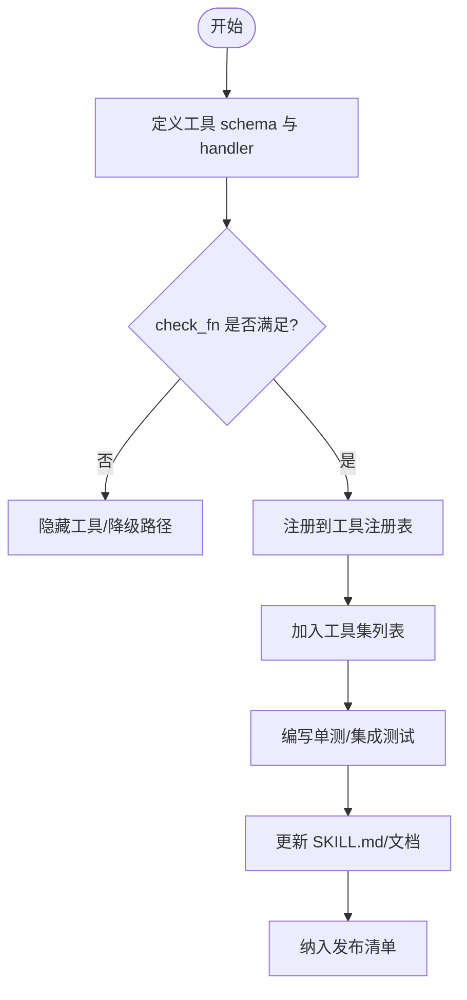
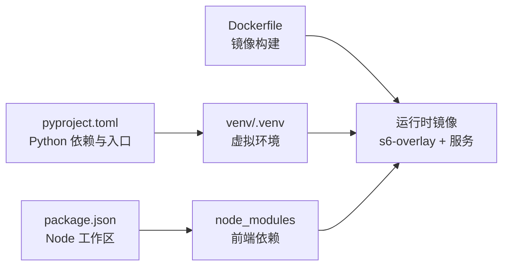

# 工具开发工作流

<cite>
**本文引用的文件**
- [README.md](file://README.md)
- [CONTRIBUTING.md](file://CONTRIBUTING.md)
- [AGENTS.md](file://AGENTS.md)
- [pyproject.toml](file://pyproject.toml)
- [package.json](file://package.json)
- [Dockerfile](file://Dockerfile)
- [scripts/run_tests.sh](file://scripts/run_tests.sh)
</cite>

## 目录
1. [简介](#简介)
2. [项目结构](#项目结构)
3. [核心组件](#核心组件)
4. [架构总览](#架构总览)
5. [详细组件分析](#详细组件分析)
6. [依赖分析](#依赖分析)
7. [性能考虑](#性能考虑)
8. [故障排查指南](#故障排查指南)
9. [结论](#结论)
10. [附录](#附录)

## 简介
本工作流文档面向“工具”（含内置工具、技能与插件）从需求到发布的完整生命周期，覆盖：
- 需求规格定义与优先级评估
- 架构设计与影响面评估（对模型调用成本、缓存、安全边界的影响）
- 代码实现规范（命名、注释、错误处理、跨平台）
- 测试验证（单元、集成、端到端、性能）
- 发布部署（本地构建、容器镜像、CI/CD、质量门禁）
同时提供开发环境搭建、调试工具使用、质量保证流程与最佳实践。

## 项目结构
仓库采用多语言、多工作区组织：Python 核心（agent/tools/gateway/cli）、前端（web/ui-tui/desktop）、脚本与 CI、文档与配置等。顶层通过 pyproject.toml 管理 Python 包与依赖，package.json 管理 Node 工作区与脚本，Dockerfile 定义容器化构建与运行。

图表来源
- [pyproject.toml:358-401](file://pyproject.toml#L358-L401)
- [package.json:1-81](file://package.json#L1-L81)
- [Dockerfile:171-286](file://Dockerfile#L171-L286)

章节来源
- [README.md:35-118](file://README.md#L35-L118)
- [CONTRIBUTING.md:215-298](file://CONTRIBUTING.md#L215-L298)
- [pyproject.toml:358-401](file://pyproject.toml#L358-L401)
- [package.json:1-81](file://package.json#L1-L81)
- [Dockerfile:171-286](file://Dockerfile#L171-L286)

## 核心组件
- 工具注册与发现：工具以自注册方式加入中央注册表，按工具集分组暴露给代理。新增工具需声明 schema、handler、check_fn，并纳入工具集。
- 会话与持久化：会话数据落库 SQLite，支持全文检索；系统提示与预填充消息在 API 调用时注入，不持久化。
- 网关与平台：统一网关对接多种消息平台，复用同一代理内核。
- CLI/TUI/Web：提供交互式终端、桌面与 Web 界面，共享命令与能力。
- 依赖与扩展：核心保持精简，能力优先以技能、插件、MCP 服务形式扩展；可选依赖通过 extras 与懒加载策略控制。

章节来源
- [CONTRIBUTING.md:215-327](file://CONTRIBUTING.md#L215-L327)
- [CONTRIBUTING.md:339-400](file://CONTRIBUTING.md#L339-L400)
- [AGENTS.md:16-27](file://AGENTS.md#L16-L27)
- [AGENTS.md:182-200](file://AGENTS.md#L182-L200)

## 架构总览
下图展示“工具”在系统中的位置与交互：用户通过 CLI/TUI/Web 或网关发起请求，进入代理主循环，根据上下文选择工具执行，结果回写会话并返回响应。

图表来源
- [CONTRIBUTING.md:300-327](file://CONTRIBUTING.md#L300-L327)
- [CONTRIBUTING.md:339-400](file://CONTRIBUTING.md#L339-L400)

## 详细组件分析

### 工具开发与注册流程
- 新建工具文件：包含描述、schema、handler、check_fn，并在导入时调用注册接口。
- 工具集接入：将工具名加入对应工具集列表，确保被代理可见。
- 条件启用：通过 check_fn 控制依赖是否满足，避免无谓的工具暴露。
- 文档与测试：为工具编写说明与单元测试，必要时补充集成测试。

图表来源
- [CONTRIBUTING.md:339-400](file://CONTRIBUTING.md#L339-L400)
- [CONTRIBUTING.md:404-529](file://CONTRIBUTING.md#L404-L529)

章节来源
- [CONTRIBUTING.md:339-400](file://CONTRIBUTING.md#L339-L400)
- [CONTRIBUTING.md:404-529](file://CONTRIBUTING.md#L404-L529)

### 技能（Skill）与工具的选择
- 优先技能：当能力可通过指令+现有工具组合表达时，优先用技能。
- 工具场景：需要结构化 I/O、二进制/流式处理、严格逻辑或密钥管理时，才考虑工具。
- 平台与条件：技能可声明平台限制与条件激活（如 fallback_for_toolsets/requires_tools）。

章节来源
- [CONTRIBUTING.md:39-67](file://CONTRIBUTING.md#L39-L67)
- [CONTRIBUTING.md:404-529](file://CONTRIBUTING.md#L404-L529)

### 开发环境与调试
- 依赖安装：使用 uv 创建 venv 并安装 all,dev 等 extras；Node 工作区按需安装。
- 配置：复制示例配置到 ~/.sparkii/config.yaml，设置 .env 中的密钥。
- 运行与诊断：sparkii doctor、sparkii chat -q 快速验证；日志位于 ~/.sparkii/logs。
- 测试：通过 scripts/run_tests.sh 运行，保证与 CI 一致的环境隔离与并行度。

章节来源
- [CONTRIBUTING.md:105-211](file://CONTRIBUTING.md#L105-L211)
- [scripts/run_tests.sh:1-184](file://scripts/run_tests.sh#L1-L184)

### 测试策略
- 单元测试：针对工具/技能逻辑，使用 pytest + mock，避免网络与外部依赖。
- 集成测试：标记 integration，仅在需要外部服务时运行；使用 hermetic 环境。
- 端到端：E2E 用于关键路径（安装、网关、浏览器自动化等），配合截图与证据收集。
- 性能测试：对耗时工具/网关进行基准与回归监控，关注延迟与吞吐。

章节来源
- [pyproject.toml:412-423](file://pyproject.toml#L412-L423)
- [scripts/run_tests.sh:1-184](file://scripts/run_tests.sh#L1-L184)

### 发布与部署
- 本地构建：npm 构建前端资源，uv 同步 Python 依赖，生成可执行入口。
- 容器镜像：Dockerfile 分层缓存依赖，预装必要运行时，写入构建信息，s6-overlay 管理服务。
- CI/CD：GitHub Actions 执行 lint、测试、安全扫描、构建与发布流水线。
- 质量门禁：依赖锁定、CVE 扫描、变更审计、E2E 证据归档。

章节来源
- [Dockerfile:171-286](file://Dockerfile#L171-L286)
- [Dockerfile:288-357](file://Dockerfile#L288-L357)
- [Dockerfile:359-458](file://Dockerfile#L359-L458)
- [package.json:13-27](file://package.json#L13-L27)

## 依赖分析
- Python 依赖：核心依赖精确锁定，减少供应链风险；可选功能通过 extras 与懒加载控制。
- Node 依赖：工作区管理 web、ui-tui、desktop 等前端模块，统一脚本与审计。
- 容器依赖：固定基础镜像版本，预编译 SQLite 修复已知问题，s6-overlay 提供服务编排。

图表来源
- [pyproject.toml:1-155](file://pyproject.toml#L1-L155)
- [package.json:1-81](file://package.json#L1-L81)
- [Dockerfile:171-286](file://Dockerfile#L171-L286)

章节来源
- [pyproject.toml:1-155](file://pyproject.toml#L1-L155)
- [package.json:1-81](file://package.json#L1-L81)
- [Dockerfile:171-286](file://Dockerfile#L171-L286)

## 性能考虑
- 模型调用成本：新增工具会随每次 LLM 调用发送，应谨慎评估工具数量与复杂度。
- 会话压缩：接近上下文限制时自动压缩，避免超长上下文导致延迟与费用上升。
- 懒加载与 extras：非核心依赖按需安装，降低冷启动时间与镜像体积。
- 并发与隔离：测试与运行采用进程级隔离，避免共享状态导致的竞争与泄漏。

章节来源
- [AGENTS.md:16-27](file://AGENTS.md#L16-L27)
- [CONTRIBUTING.md:300-327](file://CONTRIBUTING.md#L300-L327)
- [pyproject.toml:157-352](file://pyproject.toml#L157-L352)

## 故障排查指南
- 环境问题：确认 venv 已激活且包含 pytest；若未找到，脚本会提示缺失项。
- 环境变量：确保 ~/.sparkii/.env 中设置了必要的密钥；配置文件 ~/.sparkii/config.yaml 正确。
- 日志定位：查看 ~/.sparkii/logs 下的日志，结合 sparkii doctor 输出定位问题。
- 跨平台差异：Windows 下注意编码、进程信号、路径分隔符与权限差异；遵循跨平台指南。

章节来源
- [scripts/run_tests.sh:40-99](file://scripts/run_tests.sh#L40-L99)
- [CONTRIBUTING.md:676-800](file://CONTRIBUTING.md#L676-L800)

## 结论
本工作流强调“核心窄、能力外延”的设计原则：通过技能与插件扩展能力，严格控制核心工具数量以降低模型调用成本；以严格的依赖锁定、测试与 CI 门禁保障质量；以容器化与 s6-overlay 提升部署稳定性。遵循本文档的流程与规范，可高效、可靠地交付高质量工具与技能。

## 附录

### 需求规格与优先级
- 优先级：缺陷修复 > 跨平台兼容 > 安全加固 > 性能与健壮性 > 新技能 > 新工具 > 文档。
- 决策框架：优先技能，其次 CLI+技能，再服务门控工具，最后插件/MCP/核心工具。

章节来源
- [CONTRIBUTING.md:7-17](file://CONTRIBUTING.md#L7-L17)
- [AGENTS.md:182-200](file://AGENTS.md#L182-L200)

### 代码规范与最佳实践
- 风格：PEP 8，注释解释意图而非复述代码；错误处理捕获具体异常并记录堆栈。
- 跨平台：避免 POSIX-only 调用；使用 psutil/shutil.which/pathlib；正确处理编码与信号。
- 安全：最小权限、输入校验、敏感信息不入日志；第三方产品集成走插件路径。

章节来源
- [CONTRIBUTING.md:330-336](file://CONTRIBUTING.md#L330-L336)
- [CONTRIBUTING.md:676-800](file://CONTRIBUTING.md#L676-L800)

### 单元测试与集成测试
- 单测：仅使用标准库与 pytest/mock；避免真实网络调用；使用 monkeypatch/tmp_path。
- 集成测试：标记 integration，仅在需要外部服务时运行；hermetic 环境。
- E2E：关键路径验证，保留截图与证据；CI 自动归档。

章节来源
- [CONTRIBUTING.md:565-623](file://CONTRIBUTING.md#L565-L623)
- [pyproject.toml:412-423](file://pyproject.toml#L412-L423)

### 发布与质量保证
- 构建：npm 构建前端，uv 同步依赖，生成可执行入口。
- 镜像：固定基础镜像与依赖，预编译 SQLite，s6-overlay 管理服务，写入构建 SHA。
- 质量门禁：依赖锁定、CVE 扫描、变更审计、E2E 证据归档。

章节来源
- [Dockerfile:171-286](file://Dockerfile#L171-L286)
- [Dockerfile:288-357](file://Dockerfile#L288-L357)
- [Dockerfile:359-458](file://Dockerfile#L359-L458)