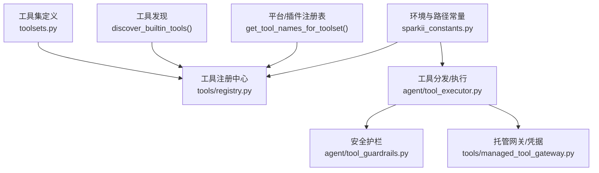
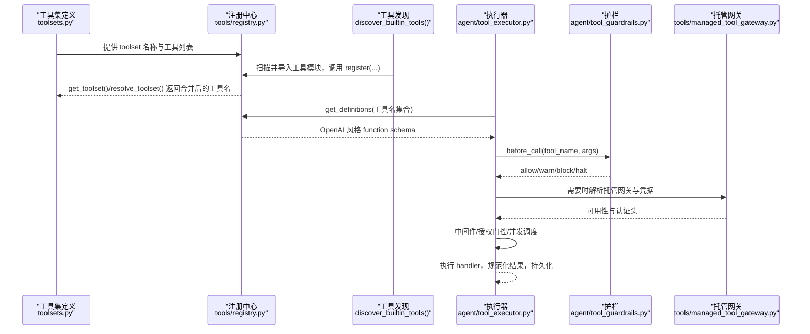
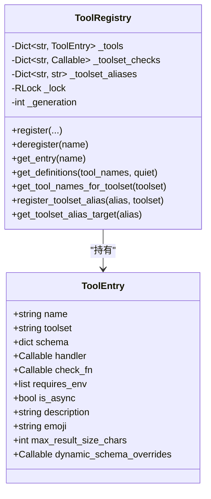
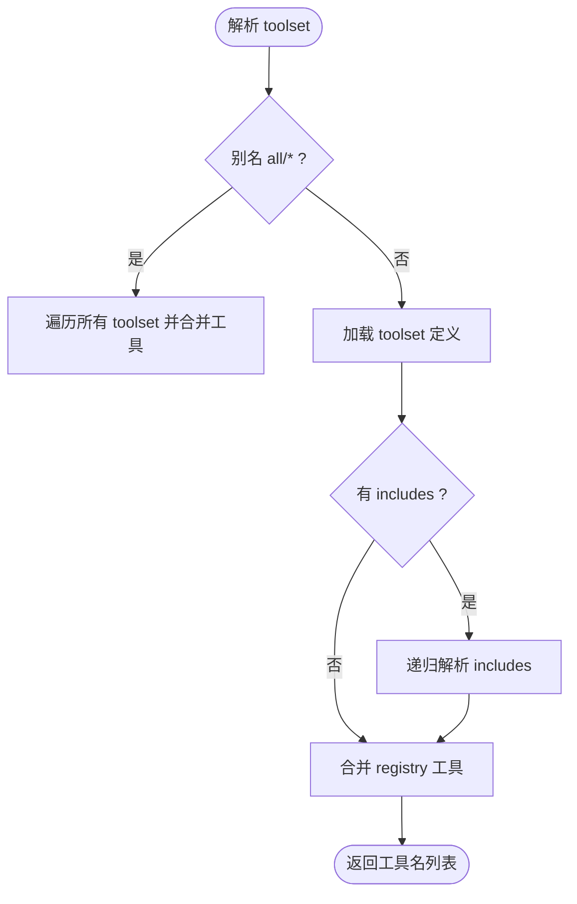
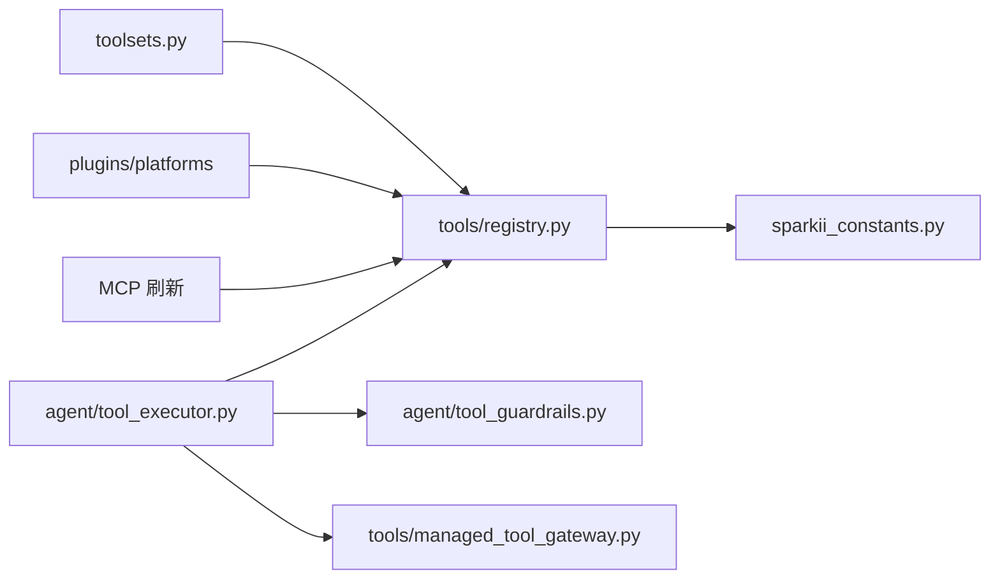

# 工具架构设计

<cite>
**本文引用的文件**
- [toolsets.py](file://toolsets.py)
- [toolset_distributions.py](file://toolset_distributions.py)
- [tools/registry.py](file://tools/registry.py)
- [agent/tool_executor.py](file://agent/tool_executor.py)
- [agent/tool_guardrails.py](file://agent/tool_guardrails.py)
- [tools/managed_tool_gateway.py](file://tools/managed_tool_gateway.py)
- [sparkii_constants.py](file://sparkii_constants.py)
</cite>

## 目录
1. [简介](#简介)
2. [项目结构](#项目结构)
3. [核心组件](#核心组件)
4. [架构总览](#架构总览)
5. [详细组件分析](#详细组件分析)
6. [依赖关系分析](#依赖关系分析)
7. [性能考量](#性能考量)
8. [故障排查指南](#故障排查指南)
9. [结论](#结论)
10. [附录](#附录)

## 简介
本文件系统性阐述工具系统的架构设计原理，覆盖工具注册机制、生命周期管理、依赖解析、工具分类体系（toolset）的设计理念与实现、工具发现机制（内置工具与插件/MCP动态加载）、安全沙箱与权限控制、工具间通信模式与错误处理策略。文档提供架构图与组件交互流程图，帮助读者从高层到代码级理解系统如何组织、调度与保护工具执行。

## 项目结构
工具系统围绕“注册中心 + 工具集定义 + 分发器 + 执行器 + 护栏”的层次化设计展开：
- 工具集定义：集中声明场景化的工具组合（如 web、browser、coding、平台 bundle 等），支持包含其他 toolset 进行组合。
- 工具注册中心：维护每个工具的元数据（名称、schema、handler、check_fn、toolset、异步标志、结果大小限制、动态 schema 覆盖等），并提供发现、查询、快照与并发安全访问。
- 工具发现：扫描内置工具模块并自动导入以完成自注册；同时支持通过平台/插件注册表注入工具与 toolset 别名。
- 工具分发与执行：将模型发出的 tool_call 请求经中间件、授权门控、护栏检查后，串行或并发执行，收集结果并回写会话。
- 安全护栏与权限：对重复失败、无进展、超限调用进行告警或阻断；对插件覆盖内置工具进行显式授权；对托管网关 URL 与凭据进行严格校验。
- 环境常量与路径：统一解析 SPARKII_HOME、可选技能/MCP 目录、Node 工具链等，确保多进程/多 profile 隔离与可恢复性。

**图示来源**
- [toolsets.py:101-641](file://toolsets.py#L101-L641)
- [tools/registry.py:108-159](file://tools/registry.py#L108-L159)
- [tools/registry.py:414-764](file://tools/registry.py#L414-L764)
- [agent/tool_executor.py:482-662](file://agent/tool_executor.py#L482-L662)
- [agent/tool_guardrails.py:273-440](file://agent/tool_guardrails.py#L273-L440)
- [tools/managed_tool_gateway.py:174-196](file://tools/managed_tool_gateway.py#L174-L196)
- [sparkii_constants.py:114-139](file://sparkii_constants.py#L114-L139)

**章节来源**
- [toolsets.py:101-641](file://toolsets.py#L101-L641)
- [tools/registry.py:108-159](file://tools/registry.py#L108-L159)
- [tools/registry.py:414-764](file://tools/registry.py#L414-L764)
- [agent/tool_executor.py:482-662](file://agent/tool_executor.py#L482-L662)
- [agent/tool_guardrails.py:273-440](file://agent/tool_guardrails.py#L273-L440)
- [tools/managed_tool_gateway.py:174-196](file://tools/managed_tool_gateway.py#L174-L196)
- [sparkii_constants.py:114-139](file://sparkii_constants.py#L114-L139)

## 核心组件
- 工具集（Toolset）：按场景聚合工具，支持 includes 组合与 posture 标记（如 coding）。平台 bundle（sparkii-*）复用核心工具集并叠加平台专属能力。
- 工具注册中心（Registry）：单例，线程安全，维护 ToolEntry 集合、toolset 检查函数映射、toolset 别名映射、生成号（generation）用于外部缓存失效。
- 工具发现（Discovery）：AST 扫描 tools/*.py 中顶层 registry.register 调用，避免全量 import 开销；结果缓存于磁盘，提升冷启动速度。
- 工具执行器（Executor）：串联请求中间件、pre_tool_call 插件拦截、guardrail 决策、开始/结束回调、并发调度、预算控制、结果持久化与截断。
- 安全护栏（Guardrails）：检测重复失败、无进展、超限调用（web_search、delegate_task），支持警告与硬停止；区分幂等与变更型工具。
- 托管网关（Managed Gateway）：为 Nous 托管供应商工具提供统一的鉴权、URL 构建、上传协议与 SSRF 防护。
- 环境常量（Constants）：SPARKII_HOME、profile 隔离、可选技能/MCP 目录、Node 工具链定位与自愈。

**章节来源**
- [toolsets.py:101-641](file://toolsets.py#L101-L641)
- [tools/registry.py:201-231](file://tools/registry.py#L201-L231)
- [tools/registry.py:108-159](file://tools/registry.py#L108-L159)
- [agent/tool_executor.py:482-662](file://agent/tool_executor.py#L482-L662)
- [agent/tool_guardrails.py:20-82](file://agent/tool_guardrails.py#L20-L82)
- [tools/managed_tool_gateway.py:174-196](file://tools/managed_tool_gateway.py#L174-L196)
- [sparkii_constants.py:114-139](file://sparkii_constants.py#L114-L139)

## 架构总览
下图展示从工具集定义到工具执行的端到端流程，包括注册、发现、解析、授权、护栏与执行。

**图示来源**
- [toolsets.py:645-715](file://toolsets.py#L645-L715)
- [tools/registry.py:108-159](file://tools/registry.py#L108-L159)
- [tools/registry.py:717-764](file://tools/registry.py#L717-L764)
- [agent/tool_executor.py:482-662](file://agent/tool_executor.py#L482-L662)
- [agent/tool_guardrails.py:295-348](file://agent/tool_guardrails.py#L295-L348)
- [tools/managed_tool_gateway.py:174-196](file://tools/managed_tool_gateway.py#L174-L196)

## 详细组件分析

### 工具注册机制与生命周期
- 注册入口：每个工具模块在顶层调用 registry.register(name, toolset, schema, handler, check_fn, requires_env, is_async, description, emoji, max_result_size_chars, dynamic_schema_overrides, override)。
- 生命周期要点：
  - 注册阶段：记录 ToolEntry，维护 toolset 检查函数映射与别名映射，递增 generation。
  - 可用性探测：check_fn 被缓存（TTL 约 30s，带失败宽限窗口），避免频繁探测导致工具抖动。
  - 动态 Schema 覆盖：dynamic_schema_overrides 在 get_definitions 时调用，用于根据运行时配置调整描述/参数。
  - 撤销与覆盖：deregister 受所有权策略约束；register 的 override 需 operator 显式授权，防止插件误覆盖内置工具。
  - 快照与并发：所有读操作基于锁内快照，保证多线程下的一致性。

**图示来源**
- [tools/registry.py:201-231](file://tools/registry.py#L201-L231)
- [tools/registry.py:414-764](file://tools/registry.py#L414-L764)

**章节来源**
- [tools/registry.py:201-231](file://tools/registry.py#L201-L231)
- [tools/registry.py:414-764](file://tools/registry.py#L414-L764)

### 工具分类体系（Toolset）设计与实现
- 设计理念：
  - 场景化聚合：web、browser、terminal、file、vision、image_gen、video_gen、bfl、computer_use、skills、cronjob、memory、todo、session_search、clarify、code_execution、delegation、homeassistant、kanban、discord、yuanbao、feishu_doc、feishu_drive、spotify 等。
  - 组合与继承：通过 includes 字段组合多个 toolset，形成更高层的场景包（如 debugging、safe、coding）。
  - 平台 Bundle：sparkii-cli、sparkii-cron、sparkii-telegram、sparkii-discord、sparkii-whatsapp、sparkii-slack、sparkii-signal、sparkii-bluebubbles、sparkii-homeassistant、sparkii-email、sparkii-mattermost、sparkii-matrix、sparkii-dingtalk、sparkii-feishu、sparkii-weixin、sparkii-qqbot、sparkii-wecom、sparkii-wecom-callback、sparkii-yuanbao、sparkii-webhook、sparkii-gateway 等，复用核心工具集并叠加平台能力。
  - Posture 标记：coding 作为 posture toolset，由上下文选择而非平台配置恢复。
- 实现方式：
  - TOOLSETS 字典集中声明，get_toolset 支持 include_registry 合并插件注册的工具。
  - resolve_toolset 递归解析 includes，支持 all/* 别名，防环检测。
  - bundle_non_core_tools 计算平台 bundle 的非核心差集，便于禁用时不伤及核心工具。

**图示来源**
- [toolsets.py:746-800](file://toolsets.py#L746-L800)
- [toolsets.py:645-715](file://toolsets.py#L645-L715)

**章节来源**
- [toolsets.py:101-641](file://toolsets.py#L101-L641)
- [toolsets.py:645-715](file://toolsets.py#L645-L715)
- [toolsets.py:746-800](file://toolsets.py#L746-L800)

### 工具发现机制（内置工具与插件/MCP动态加载）
- 内置工具发现：
  - discover_builtin_tools 扫描 tools/*.py，使用 AST 判断是否包含顶层 registry.register 调用，命中则记录模块名并导入触发注册。
  - 发现结果缓存至 SPARKII_HOME/cache/tool_discovery_cache.json，键为 (mtime_ns, size)，减少重复扫描成本。
- 插件/MCP 动态加载：
  - 通过 platform_registry 与 registry.get_tool_names_for_toolset 将插件注册的工具纳入 toolset。
  - 支持 toolset 别名（register_toolset_alias），MCP 刷新时可 deregister 再 register 重建工具集。
- 安全性：
  - 仅扫描顶层语句，避免 helper 模块中的函数内注册被误识别。
  - 导入失败会记录日志但不中断整体发现。

**章节来源**
- [tools/registry.py:108-159](file://tools/registry.py#L108-L159)
- [tools/registry.py:162-199](file://tools/registry.py#L162-L199)
- [tools/registry.py:487-507](file://tools/registry.py#L487-L507)

### 依赖解析过程
- 工具可用性依赖 check_fn：
  - 例如 terminal、browser、MCP 连接、Docker/Modal SDK 等外部状态探测。
  - 采用 TTL 缓存（~30s）+ 失败宽限窗口（最近成功后的短暂失败视为瞬态），避免抖动导致工具不可用。
  - 支持 profile 维度缓存隔离（multiplex 模式下）。
- 动态 Schema 覆盖：
  - dynamic_schema_overrides 在 get_definitions 时调用，读取当前配置（如 delegation 限制）并覆盖 schema 字段，使模型看到准确的能力边界。
- 工具集解析：
  - resolve_toolset 递归解析 includes，去重并排序，支持 all/* 别名与环检测。

**章节来源**
- [tools/registry.py:233-380](file://tools/registry.py#L233-L380)
- [tools/registry.py:717-764](file://tools/registry.py#L717-L764)
- [toolsets.py:746-800](file://toolsets.py#L746-L800)

### 工具安全沙箱与权限控制
- 插件覆盖保护：
  - register(override=True) 需 operator 显式授权，否则拒绝跨 toolset 覆盖内置工具。
  - deregister 同样受所有权策略约束，防止插件移除非自有工具。
- 托管网关安全：
  - 仅允许访问由 build_vendor_gateway_url 生成的可信 origin，上传 PUT 目标使用 SSRF 安全客户端。
  - 凭据通过 read_nous_access_token 获取，支持过期前预刷新与 env 覆盖。
- 执行期护栏：
  - 重复失败、无进展、超限调用（web_search、delegate_task）触发 warn/block/halt。
  - 区分幂等与变更型工具，避免误判。
- 中间件与授权门控：
  - pre_tool_call 插件可阻塞执行；授权门控序列化审批提示，避免并发干扰。

**章节来源**
- [tools/registry.py:562-711](file://tools/registry.py#L562-L711)
- [tools/managed_tool_gateway.py:174-196](file://tools/managed_tool_gateway.py#L174-L196)
- [tools/managed_tool_gateway.py:278-325](file://tools/managed_tool_gateway.py#L278-L325)
- [agent/tool_guardrails.py:273-440](file://agent/tool_guardrails.py#L273-L440)
- [agent/tool_executor.py:482-662](file://agent/tool_executor.py#L482-L662)

### 工具间通信模式与错误处理策略
- 通信模式：
  - 工具通过 handler 返回值与 agent 通信；结果被标准化为字符串或多模态信封。
  - 支持中间件链（apply_tool_request_middleware、run_tool_execution_middleware）对请求/响应进行转换与追踪。
  - 并发执行通过线程池并行调度，结果按序收集。
- 错误处理：
  - 结果体截断：_bound_error_text/_bound_json_error_result 限制错误消息长度，防止上下文爆炸。
  - 异常捕获：check_fn 异常视为 False；工具执行异常被捕获并转为结构化错误。
  - 护栏反馈：after_call 根据失败分类与计数决定警告或阻断，并附加恢复建议。
  - 持久化：关键步骤（如 destructive 命令前）创建 checkpoint，失败时仍可恢复。

**章节来源**
- [tools/registry.py:29-68](file://tools/registry.py#L29-L68)
- [tools/registry.py:770-800](file://tools/registry.py#L770-L800)
- [agent/tool_executor.py:482-662](file://agent/tool_executor.py#L482-L662)
- [agent/tool_guardrails.py:238-270](file://agent/tool_guardrails.py#L238-L270)

## 依赖关系分析
- 低耦合高内聚：
  - toolsets.py 仅声明工具集，不感知具体实现。
  - registry.py 独立维护工具元数据与生命周期，不依赖 model_tools 或具体工具模块。
  - executor 通过 registry 获取 schema 与 handler，解耦业务逻辑。
- 直接依赖：
  - registry 依赖 sparkii_constants 解析 home 路径。
  - executor 依赖 guardrails、approval、checkpoint、budget 等子系统。
  - managed_tool_gateway 依赖 url_safety 与 httpx 进行安全上传。
- 间接依赖：
  - platform_registry 与 plugins 通过 registry 注入工具与别名。
  - MCP 刷新通过 deregister/register 重建工具集。

**图示来源**
- [toolsets.py:645-715](file://toolsets.py#L645-L715)
- [tools/registry.py:108-159](file://tools/registry.py#L108-L159)
- [tools/registry.py:414-764](file://tools/registry.py#L414-L764)
- [agent/tool_executor.py:482-662](file://agent/tool_executor.py#L482-L662)
- [tools/managed_tool_gateway.py:174-196](file://tools/managed_tool_gateway.py#L174-L196)
- [sparkii_constants.py:114-139](file://sparkii_constants.py#L114-L139)

**章节来源**
- [toolsets.py:645-715](file://toolsets.py#L645-L715)
- [tools/registry.py:108-159](file://tools/registry.py#L108-L159)
- [tools/registry.py:414-764](file://tools/registry.py#L414-L764)
- [agent/tool_executor.py:482-662](file://agent/tool_executor.py#L482-L662)
- [tools/managed_tool_gateway.py:174-196](file://tools/managed_tool_gateway.py#L174-L196)
- [sparkii_constants.py:114-139](file://sparkii_constants.py#L114-L139)

## 性能考量
- 工具发现缓存：基于 mtime_ns+size 的磁盘缓存，显著降低冷启动扫描成本。
- check_fn 缓存：TTL 与失败宽限窗口平衡实时性与稳定性，避免频繁外部探测。
- 并发执行：线程池上限默认 8，图片生成并行度可配置，避免后端过载。
- 结果截断：错误消息与 JSON error 字段截断，防止上下文膨胀。
- 预算控制：按上下文窗口缩放工具输出预算，避免单次大结果打满请求。

[本节为通用指导，无需特定文件引用]

## 故障排查指南
- 工具不可用：
  - 检查 check_fn 缓存与失败宽限窗口，确认外部依赖是否就绪。
  - 查看 registry 日志中关于 check_fn 失败的警告。
- 插件覆盖被拒：
  - 确认是否设置 allow_tool_override 并正确调用 override=True。
- 托管网关上传失败：
  - 验证 is_managed_nous_gateway_url 与凭据有效性；检查 presign 与 PUT 超时配置。
- 重复失败/无进展：
  - 参考护栏告警信息，调整参数或切换工具路径；必要时启用硬停止。
- 路径与环境问题：
  - 使用 get_sparkii_home 与相关常量函数确保 profile 隔离与 Node 工具链可用。

**章节来源**
- [tools/registry.py:233-380](file://tools/registry.py#L233-L380)
- [tools/registry.py:562-711](file://tools/registry.py#L562-L711)
- [tools/managed_tool_gateway.py:278-325](file://tools/managed_tool_gateway.py#L278-L325)
- [agent/tool_guardrails.py:273-440](file://agent/tool_guardrails.py#L273-L440)
- [sparkii_constants.py:114-139](file://sparkii_constants.py#L114-L139)

## 结论
该工具系统通过清晰的分层与职责划分，实现了可扩展、安全、高性能的工具生态：
- 工具集定义与组合提供了灵活的场景化能力封装。
- 注册中心统一管理工具元数据与生命周期，支持插件与 MCP 动态扩展。
- 执行器与护栏保障调用的可控性与鲁棒性，防止失控循环与资源滥用。
- 托管网关与权限控制确保对外部服务的可信访问与凭据安全。
- 环境常量与路径管理保障了多 profile、多进程的一致性与可恢复性。

[本节为总结性内容，无需特定文件引用]

## 附录
- 工具集分布采样：toolset_distributions 提供概率化采样，适用于批量数据生成与评测场景。
- 平台 Bundle 差集计算：bundle_non_core_tools 确保禁用平台 bundle 时不伤及核心工具。

**章节来源**
- [toolset_distributions.py:217-282](file://toolset_distributions.py#L217-L282)
- [toolsets.py:718-743](file://toolsets.py#L718-L743)