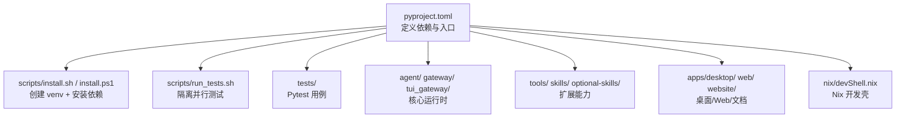
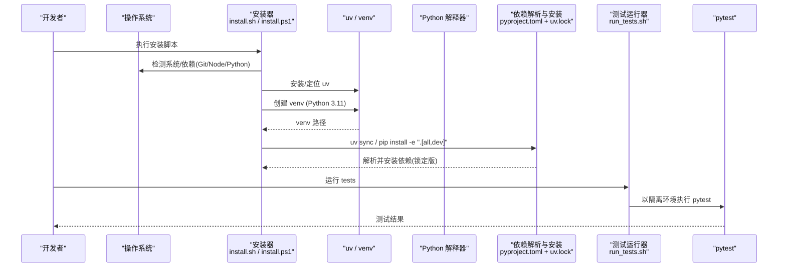
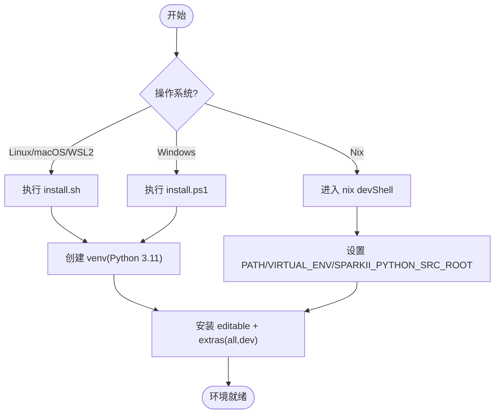
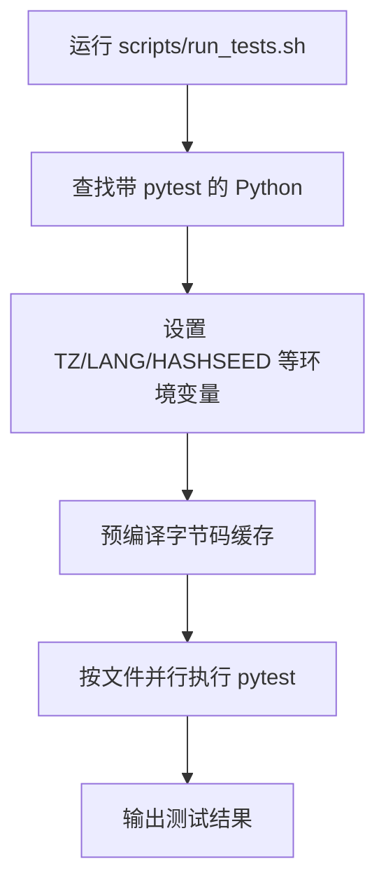
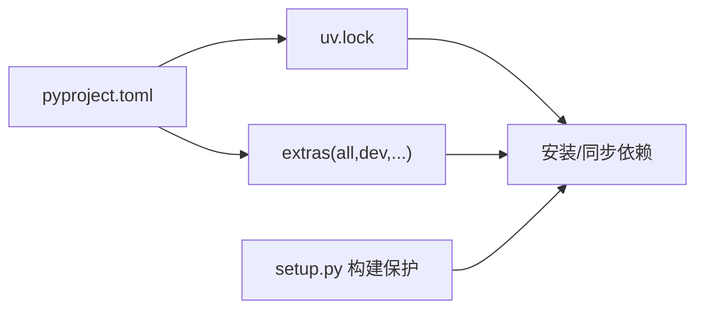

# 开发环境搭建

<cite>
**本文引用的文件**
- [pyproject.toml](file://pyproject.toml)
- [uv.lock](file://uv.lock)
- [setup.py](file://setup.py)
- [scripts/install.sh](file://scripts/install.sh)
- [scripts/install.ps1](file://scripts/install.ps1)
- [scripts/run_tests.sh](file://scripts/run_tests.sh)
- [nix/devShell.nix](file://nix/devShell.nix)
- [CONTRIBUTING.md](file://CONTRIBUTING.md)
- [README.md](file://README.md)
</cite>

## 目录
1. [简介](#简介)
2. [项目结构](#项目结构)
3. [核心组件](#核心组件)
4. [架构总览](#架构总览)
5. [详细组件分析](#详细组件分析)
6. [依赖分析](#依赖分析)
7. [性能考虑](#性能考虑)
8. [故障排查指南](#故障排查指南)
9. [结论](#结论)
10. [附录](#附录)

## 简介
本指南面向首次参与开发的工程师，目标是帮助你从零开始搭建可运行的 Python 开发环境，理解仓库结构与核心模块，配置 IDE 调试与代码质量工具，并解决常见环境问题（依赖冲突、路径问题、权限等）。本项目使用 uv 进行包管理与虚拟环境管理，Python 版本要求为 3.11–3.13，并通过 pyproject.toml 与 uv.lock 锁定依赖。Windows 提供专用安装脚本，Linux/macOS 提供统一安装脚本；Nix 用户可通过 devShell 获得一致的本地开发体验。

## 项目结构
仓库采用多语言、多子项目的组织方式：
- Python 核心与 CLI：根目录的 pyproject.toml 定义了包名、依赖、可选 extras、入口点与构建配置；scripts/ 包含跨平台安装与测试运行器；tests/ 为完整测试集。
- Agent/Gateway/TUI：agent/、gateway/、tui_gateway/ 分别实现智能体核心循环、消息网关与终端界面。
- 工具与技能：tools/ 提供工具注册与执行；skills/ 与 optional-skills/ 提供内置与可选技能。
- 桌面与 Web：apps/desktop/（Electron）、web/（前端 SPA）、website/（文档站点）。
- Nix 与 Docker：nix/ 提供开发壳与打包；docker/ 提供容器化运行。

图表来源
- [pyproject.toml:1-155](file://pyproject.toml#L1-L155)
- [scripts/install.sh:549-653](file://scripts/install.sh#L549-L653)
- [scripts/install.ps1:689-735](file://scripts/install.ps1#L689-L735)
- [scripts/run_tests.sh:1-184](file://scripts/run_tests.sh#L1-L184)
- [nix/devShell.nix:24-61](file://nix/devShell.nix#L24-L61)

章节来源
- [pyproject.toml:1-155](file://pyproject.toml#L1-L155)
- [CONTRIBUTING.md:105-211](file://CONTRIBUTING.md#L105-L211)
- [README.md:35-66](file://README.md#L35-L66)

## 核心组件
- 包与依赖管理：pyproject.toml 声明 Python 版本约束、核心依赖、可选 extras（如 dev、web、mcp、voice 等），以及 setuptools 打包元数据与 pytest/ruff/ty 工具配置。uv.lock 锁定所有解析结果，确保可重现安装。
- 安装器：scripts/install.sh（Linux/macOS/WSL2/Termux）与 scripts/install.ps1（Windows）负责检测/安装 Python、uv、Node.js、Git，创建 venv，安装依赖，并配置命令链接与环境变量。
- 测试运行器：scripts/run_tests.sh 保证与 CI 一致的环境（TZ/LANG/HASHSEED 等），按文件并行隔离执行，自动发现 venv 或 Nix devShell 提供的 Python。
- Nix 开发壳：nix/devShell.nix 聚合常用开发工具，设置 PATH、SPARKII_PYTHON_SRC_ROOT、VIRTUAL_ENV，并提供一键启动提示。

章节来源
- [pyproject.toml:1-155](file://pyproject.toml#L1-L155)
- [pyproject.toml:354-452](file://pyproject.toml#L354-L452)
- [scripts/install.sh:549-653](file://scripts/install.sh#L549-L653)
- [scripts/install.ps1:689-735](file://scripts/install.ps1#L689-L735)
- [scripts/run_tests.sh:1-184](file://scripts/run_tests.sh#L1-L184)
- [nix/devShell.nix:24-61](file://nix/devShell.nix#L24-L61)

## 架构总览
下图展示从“安装”到“运行/测试”的关键流程，以及各组件之间的关系。

图表来源
- [scripts/install.sh:549-653](file://scripts/install.sh#L549-L653)
- [scripts/install.ps1:689-735](file://scripts/install.ps1#L689-L735)
- [pyproject.toml:1-155](file://pyproject.toml#L1-L155)
- [scripts/run_tests.sh:1-184](file://scripts/run_tests.sh#L1-L184)

## 详细组件分析

### 环境准备与虚拟环境
- Python 版本：要求 >=3.11,<3.14；推荐 3.11 以获得最佳兼容性。
- 包管理器：优先使用 uv；在 Termux 上回退到 stdlib venv + pip。
- 安装步骤（Linux/macOS/WSL2/Termux）：
  - 通过脚本安装 uv、Python、Node.js、Git，并在 $SPARKII_HOME/sparkii-agent 下克隆源码。
  - 激活 venv 后安装 editable 模式与开发 extras：uv pip install -e ".[all,dev]"。
- 安装步骤（Windows）：
  - 使用 PowerShell 安装脚本，自动处理 8.3 短路径、PATH 刷新、证书信任提示等。
  - 同样会安装 uv、Python 3.11、Node.js，并创建 venv 与安装依赖。
- Nix 用户：
  - 使用 nix develop 进入 devShell，已预装 uv、playwright-test、ghostty 等，并导出 SPARKII_PYTHON_SRC_ROOT 与 VIRTUAL_ENV。

图表来源
- [scripts/install.sh:549-653](file://scripts/install.sh#L549-L653)
- [scripts/install.ps1:689-735](file://scripts/install.ps1#L689-L735)
- [nix/devShell.nix:24-61](file://nix/devShell.nix#L24-L61)

章节来源
- [pyproject.toml:1-15](file://pyproject.toml#L1-L15)
- [scripts/install.sh:549-653](file://scripts/install.sh#L549-L653)
- [scripts/install.ps1:689-735](file://scripts/install.ps1#L689-L735)
- [nix/devShell.nix:24-61](file://nix/devShell.nix#L24-L61)
- [CONTRIBUTING.md:105-211](file://CONTRIBUTING.md#L105-L211)

### 依赖安装与锁定
- 核心依赖与可选依赖：
  - 核心依赖在 dependencies 中精确锁定，避免上游漂移带来的风险。
  - 可选功能通过 extras 按需启用（如 dev、web、mcp、voice、google、youtube 等）。
- 锁定机制：
  - uv.lock 记录完整的解析结果与哈希，确保跨机器一致。
  - 更新依赖需重新生成 uv.lock，保持传递依赖稳定。
- 构建保护：
  - setup.py 在非 Nix 环境下阻止 wheel/sdist 构建，防止遗漏资源；开发时使用 editable 安装不受影响。

章节来源
- [pyproject.toml:1-155](file://pyproject.toml#L1-L155)
- [pyproject.toml:354-452](file://pyproject.toml#L354-L452)
- [uv.lock:1-21](file://uv.lock#L1-L21)
- [setup.py:1-75](file://setup.py#L1-L75)

### 测试框架与运行
- 测试运行器：
  - scripts/run_tests.sh 强制与 CI 一致的环境变量与隔离策略，按文件并行执行，避免模块级状态泄漏。
  - 自动探测 .venv/venv/Nix devShell 中的 Python，并确保 pytest 可用。
- 测试配置：
  - pyproject.toml 中定义 testpaths、markers、addopts（默认跳过 integration）。
- 建议：
  - 始终通过 run_tests.sh 运行测试，以保证一致性。
  - 单文件调试可使用 pytest 直接调用，但需确保 venv 已激活且含 pytest。

图表来源
- [scripts/run_tests.sh:1-184](file://scripts/run_tests.sh#L1-L184)
- [pyproject.toml:412-424](file://pyproject.toml#L412-L424)

章节来源
- [scripts/run_tests.sh:1-184](file://scripts/run_tests.sh#L1-L184)
- [pyproject.toml:412-424](file://pyproject.toml#L412-L424)

### IDE 配置建议
- 解释器与 venv：
  - 将项目根目录下的 .venv 或 ~/.sparkii/sparkii-agent/venv 设置为解释器。
  - Windows 注意 Scripts/python.exe；Linux/macOS 使用 bin/python。
- 调试器：
  - VS Code：使用内置 Debug Adapter，配置 launch.json 指向 sparkii 入口或 pytest 会话。
  - PyCharm：选择 venv 解释器，配置 Run/Debug Configuration 为 Module name 或 Script path。
- 代码格式化与静态检查：
  - ruff：启用预览规则，仅开启 PLW1514（显式编码）以确保跨平台文本安全。
  - ty：类型检查，python-version 设为 3.13。
  - 编辑器集成：安装 ruff/ty 插件，保存时自动修复/检查。
- 其他：
  - Node.js 与 npm：如需浏览器工具或文档站点，先安装 Node 20+，再在项目根运行 npm install。

章节来源
- [pyproject.toml:425-452](file://pyproject.toml#L425-L452)
- [CONTRIBUTING.md:105-211](file://CONTRIBUTING.md#L105-L211)

### 常见问题与解决方案
- 依赖冲突：
  - 使用 uv.lock 锁定依赖；若出现冲突，重新运行 uv sync 或 uv pip install -e ".[all,dev]"。
  - 避免全局污染：始终在 venv 内工作，不要向系统 Python 安装包。
- 路径问题：
  - Windows 8.3 短路径：安装脚本会自动规范化路径；如遇异常，检查 %TEMP%、%LOCALAPPDATA% 等是否被改写。
  - 非标准 PATH：确保 venv/bin 或 Scripts 在 PATH 前部；Nix 用户通过 devShell 自动设置。
- 权限问题：
  - Linux 根安装使用 FHS 布局，代码位于 /usr/local/lib/sparkii-agent，命令链接到 /usr/local/bin；数据仍位于 $SPARKII_HOME。
  - Windows 管理员权限：某些操作可能需要管理员（如写入系统目录），尽量在用户目录下操作。
- 网络与证书：
  - Windows 证书错误：根据提示设置 NODE_EXTRA_CA_CERTS 或临时关闭 strict-ssl（仅限安装阶段）。
  - 代理/防火墙：确保能访问 PyPI、GitHub、Astral 等域名。

章节来源
- [scripts/install.sh:549-653](file://scripts/install.sh#L549-L653)
- [scripts/install.ps1:527-554](file://scripts/install.ps1#L527-L554)
- [scripts/install.ps1:737-800](file://scripts/install.ps1#L737-L800)
- [pyproject.toml:1-155](file://pyproject.toml#L1-L155)

## 依赖分析
- 版本约束：
  - requires-python: >=3.11,<3.14；避免 3.14 因部分 Rust 后端尚无 cp314 wheel。
  - 核心依赖精确锁定，减少供应链风险；可选依赖通过 extras 按需启用。
- 锁定与覆盖：
  - uv.lock 记录所有包的版本与哈希；manifest.overrides 用于强制覆盖特定依赖（如 pynacl）。
  - exclude-newer 限制新包引入时间窗口，降低意外升级风险。
- 构建系统：
  - setuptools.build_meta；setup.py 在非 Nix 环境阻止 wheel/sdist 构建，保障资源完整性。

图表来源
- [pyproject.toml:1-155](file://pyproject.toml#L1-L155)
- [uv.lock:1-21](file://uv.lock#L1-L21)
- [setup.py:1-75](file://setup.py#L1-L75)

章节来源
- [pyproject.toml:1-155](file://pyproject.toml#L1-L155)
- [uv.lock:1-21](file://uv.lock#L1-L21)
- [setup.py:1-75](file://setup.py#L1-L75)

## 性能考虑
- 使用 uv 替代 pip：更快解析与安装，支持并发与缓存。
- 预编译字节码：测试运行器会预编译 .pyc，减少重复编译开销。
- 隔离执行：按文件并行执行测试，避免共享状态导致的竞态与锁竞争。
- 最小化依赖：仅安装必要 extras，减少安装体积与潜在冲突。

## 故障排查指南
- 无法找到 Python/uv：
  - 确认安装脚本成功安装 uv 与 Python 3.11；检查 $SPARKII_HOME/bin 是否在 PATH。
  - Windows 下确认 PATH 已刷新；必要时重启终端。
- 测试失败或无测试：
  - 确保 venv 中包含 pytest；使用 scripts/run_tests.sh 而非直接 pytest。
  - 检查是否启用了正确的 venv 或 Nix devShell。
- 权限错误：
  - Linux 根安装使用 FHS 布局；确保对 /usr/local/bin 有写权限或使用 sudo。
  - Windows 避免在受保护目录写入；优先使用用户目录。
- 网络/证书错误：
  - Windows 证书问题：按提示设置 NODE_EXTRA_CA_CERTS 或临时关闭 strict-ssl。
  - 代理/防火墙：配置 HTTP_PROXY/HTTPS_PROXY 或调整企业策略。

章节来源
- [scripts/install.sh:549-653](file://scripts/install.sh#L549-L653)
- [scripts/install.ps1:527-554](file://scripts/install.ps1#L527-L554)
- [scripts/run_tests.sh:1-184](file://scripts/run_tests.sh#L1-L184)

## 结论
通过 uv 与 pyproject.toml/uv.lock 的强约束，配合跨平台安装脚本与 Nix 开发壳，本项目提供了稳定、可重现的开发环境。遵循本指南的步骤，你可以快速完成环境搭建、理解项目结构、配置 IDE 与工具链，并高效排查常见问题。建议在贡献代码前，始终通过 scripts/run_tests.sh 运行测试，确保与 CI 行为一致。

## 附录
- 快速参考
  - 安装（Linux/macOS/WSL2/Termux）：curl 安装脚本 → 进入 $SPARKII_HOME/sparkii-agent → uv pip install -e ".[all,dev]"
  - 安装（Windows）：PowerShell 安装脚本 → 同上
  - 测试：scripts/run_tests.sh
  - Nix：nix develop → 自动设置环境与工具
- 相关文档
  - 贡献指南：CONTRIBUTING.md
  - 快速入门：README.md

章节来源
- [CONTRIBUTING.md:105-211](file://CONTRIBUTING.md#L105-L211)
- [README.md:35-66](file://README.md#L35-L66)