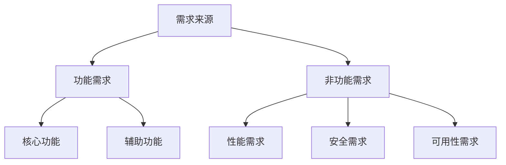

# 需求分析

<cite>
**本文引用的文件**
- [tools/file_operations.py](file://tools/file_operations.py)
- [tools/web_tools.py](file://tools/web_tools.py)
- [tools/code_execution_tool.py](file://tools/code_execution_tool.py)
</cite>

## 目录
1. [简介](#简介)
2. [需求识别方法](#需求识别方法)
3. [功能规格说明](#功能规格说明)
4. [需求文档模板](#需求文档模板)
5. [需求验证](#需求验证)
6. [结论](#结论)

## 简介
本文档提供工具开发需求分析的完整指南。通过系统化的需求分析方法，帮助开发者从业务需求转化为可执行的技术规格。

## 需求识别方法

### 需求来源
1. **用户场景分析**：识别用户在特定场景下的操作需求
2. **系统集成需求**：与外部API、数据库等系统的交互需求
3. **性能优化需求**：提升执行效率、减少资源消耗
4. **安全合规需求**：数据保护、权限控制、审计追踪

### 需求分类


## 功能规格说明

### 输入输出规范
每个工具需明确定义：
- **输入参数**：参数名、类型、必填性、默认值、取值范围
- **输出格式**：返回值结构、成功/失败响应格式
- **错误处理**：异常类型、错误码、错误消息

### 接口设计原则
1. **单一职责**：每个工具专注完成一个特定功能
2. **参数验证**：在执行前验证所有输入参数
3. **幂等性**：相同输入产生相同输出，避免副作用
4. **可组合性**：支持与其他工具链式调用

## 需求文档模板

### 模板结构
```markdown
# 工具名称

## 1. 概述
简要描述工具的用途和目标用户。

## 2. 功能需求
### 2.1 核心功能
- 功能描述
- 输入参数
- 输出结果

### 2.2 辅助功能
- 错误处理
- 日志记录
- 性能监控

## 3. 非功能需求
- 性能指标
- 安全要求
- 兼容性要求

## 4. 接口定义
- 函数签名
- 参数说明
- 返回值说明
```

## 需求验证

### 验证方法
1. **原型验证**：快速实现核心功能原型
2. **场景测试**：模拟真实使用场景
3. **边界测试**：验证极端输入情况
4. **安全审计**：检查潜在安全风险

### 优先级评估
使用MoSCoW方法：
- **Must have**：必须实现的核心功能
- **Should have**：重要但非必需的功能
- **Could have**：锦上添花的功能
- **Won't have**：本期不实现的功能

## 结论
系统化的需求分析是高质量工具开发的基础。通过明确的需求规格和验证方法，可以有效降低开发风险，提升工具的可用性和可靠性。

