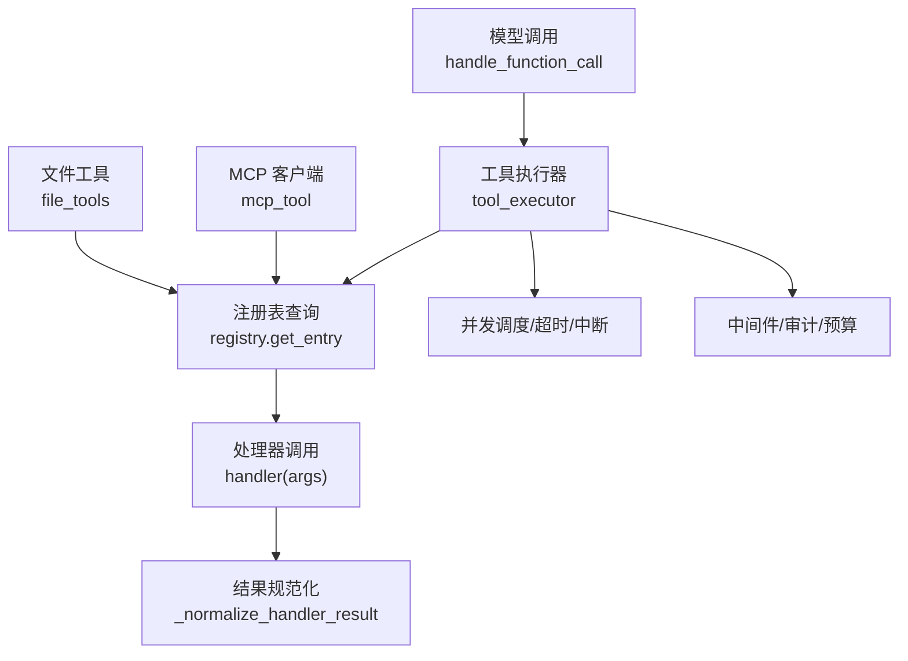
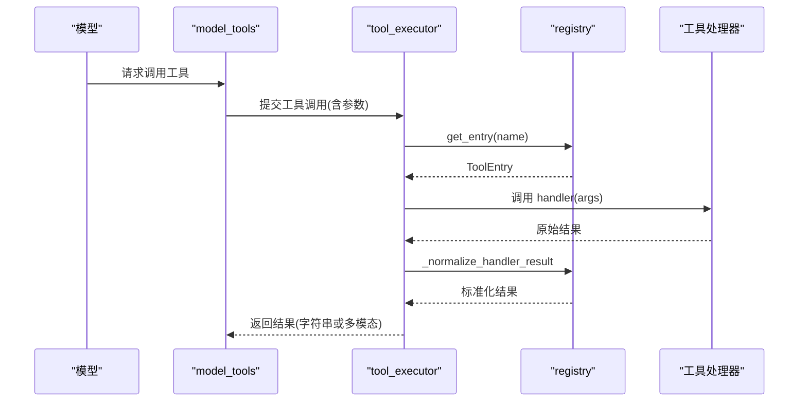
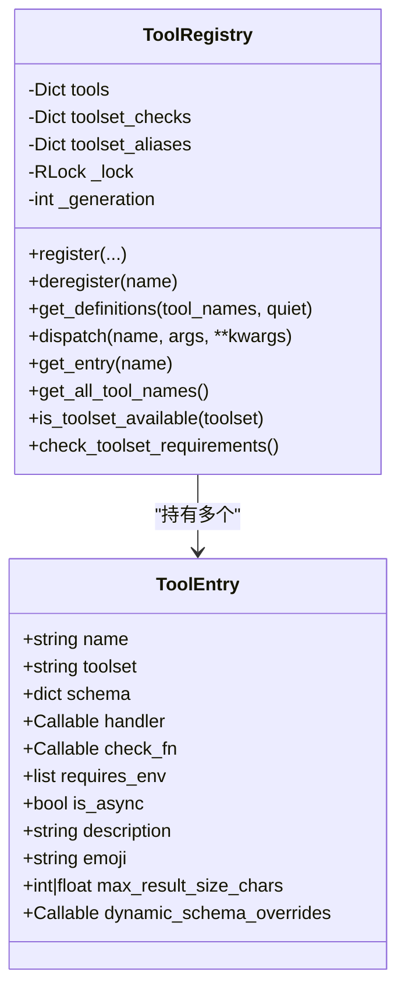
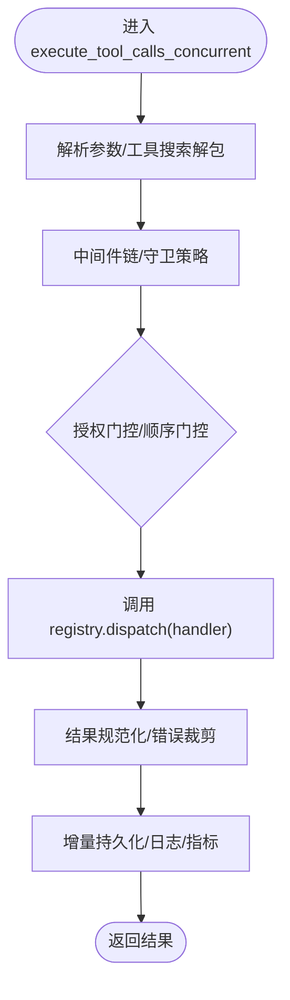
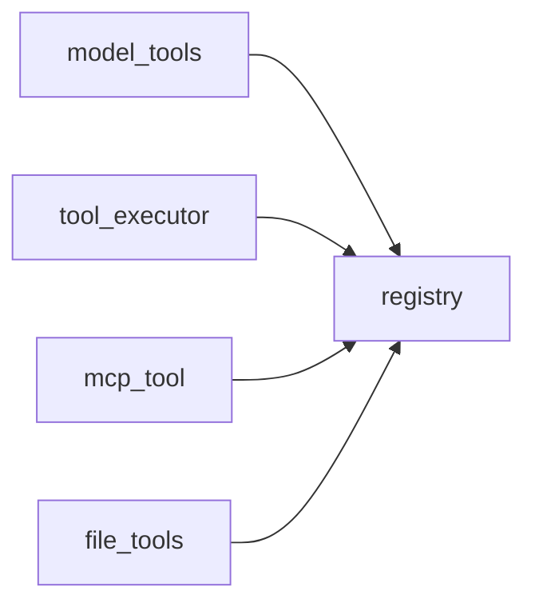

# 工具开发指南

<cite>
**本文引用的文件**
- [tools/registry.py](file://tools/registry.py)
- [agent/tool_executor.py](file://agent/tool_executor.py)
- [tools/mcp_tool.py](file://tools/mcp_tool.py)
- [model_tools.py](file://model_tools.py)
- [tools/file_tools.py](file://tools/file_tools.py)
</cite>

## 目录
1. [简介](#简介)
2. [项目结构](#项目结构)
3. [核心组件](#核心组件)
4. [架构总览](#架构总览)
5. [详细组件分析](#详细组件分析)
6. [依赖关系分析](#依赖关系分析)
7. [性能考量](#性能考量)
8. [故障排查指南](#故障排查指南)
9. [结论](#结论)
10. [附录](#附录)

## 简介
本指南面向希望在本项目中开发、集成与治理“工具”的工程师。文档聚焦以下目标：
- 工具注册机制的实现细节：ToolEntry 结构与 ToolRegistry 方法
- 工具接口规范：参数校验、返回值格式、错误处理模式
- 执行引擎工作原理：异步处理、资源隔离、超时控制
- 完整开发流程：从需求分析到实现、测试与部署
- 安全考虑：输入验证、权限控制、资源限制
- 性能优化建议与最佳实践
- 实际示例与常见问题解决方案

## 项目结构
围绕工具系统的关键代码分布在以下模块：
- 工具注册与发现：tools/registry.py
- 工具执行与并发调度：agent/tool_executor.py
- 外部工具接入（MCP）：tools/mcp_tool.py
- 模型侧编排与异步桥接：model_tools.py
- 典型工具实现（文件操作）：tools/file_tools.py

图表来源
- [agent/tool_executor.py:758-1200](file://agent/tool_executor.py#L758-L1200)
- [tools/registry.py:801-834](file://tools/registry.py#L801-L834)
- [tools/mcp_tool.py:1-120](file://tools/mcp_tool.py#L1-L120)
- [tools/file_tools.py:1-100](file://tools/file_tools.py#L1-L100)

章节来源
- [tools/registry.py:1-160](file://tools/registry.py#L1-L160)
- [agent/tool_executor.py:1-120](file://agent/tool_executor.py#L1-L120)
- [tools/mcp_tool.py:1-120](file://tools/mcp_tool.py#L1-L120)
- [model_tools.py:1-200](file://model_tools.py#L1-L200)
- [tools/file_tools.py:1-200](file://tools/file_tools.py#L1-L200)

## 核心组件
- ToolEntry：描述单个工具的元数据，包括名称、所属工具集、Schema、处理器函数、可用性检查、是否异步、描述、表情、最大结果大小、动态 Schema 覆盖等。
- ToolRegistry：单例注册表，负责工具注册、去重与覆盖策略、工具集别名、定义生成、分发执行、查询辅助等。
- 工具执行器：负责解析参数、中间件链、并发调度、授权门控、开始顺序门控、超时与中断、结果收集与持久化。
- MCP 客户端：连接外部 MCP 服务器，动态发现并注册工具，提供安全的环境过滤、错误脱敏、重试与保活。
- 模型侧编排：提供异步桥接、事件循环管理、工具定义获取与工具搜索范围控制。

章节来源
- [tools/registry.py:201-231](file://tools/registry.py#L201-L231)
- [tools/registry.py:414-445](file://tools/registry.py#L414-L445)
- [agent/tool_executor.py:758-1200](file://agent/tool_executor.py#L758-L1200)
- [tools/mcp_tool.py:1-120](file://tools/mcp_tool.py#L1-L120)
- [model_tools.py:68-200](file://model_tools.py#L68-L200)

## 架构总览
工具系统的整体流程如下：
- 启动时扫描 tools/*.py，自动导入自注册的模块，完成工具发现与注册
- 模型侧通过 handle_function_call 发起工具调用
- 执行器解析参数、应用中间件、进行权限与安全校验、并发调度
- 注册表根据工具名查找处理器，支持同步/异步执行
- 结果统一规范化为字符串或受支持的多模态信封，错误被裁剪与脱敏
- MCP 工具作为外部扩展，动态注册到同一注册表，遵循相同执行路径

图表来源
- [model_tools.py:1-200](file://model_tools.py#L1-L200)
- [agent/tool_executor.py:758-1200](file://agent/tool_executor.py#L758-L1200)
- [tools/registry.py:801-834](file://tools/registry.py#L801-L834)

## 详细组件分析

### ToolEntry 类
- 职责：封装单个工具的元数据，供注册表与执行器使用
- 关键字段：
  - name：工具唯一标识
  - toolset：工具集归属
  - schema：OpenAI 风格的函数定义
  - handler：处理器函数（可同步或异步）
  - check_fn：可用性检查（如 Docker/Playwright 存在性）
  - requires_env：环境依赖列表
  - is_async：是否异步处理器
  - description/emoji：UI 展示信息
  - max_result_size_chars：结果大小上限
  - dynamic_schema_overrides：运行时动态覆盖 Schema 的零参回调

章节来源
- [tools/registry.py:201-231](file://tools/registry.py#L201-L231)

### ToolRegistry 类
- 注册与覆盖：
  - register()：注册工具；跨工具集同名覆盖需显式 override=True，插件覆盖需 operator 授权
  - deregister()：移除工具；对非 mcp-* 工具集有所有权校验，防止插件误删
- 定义生成：
  - get_definitions()：按工具名集合生成 OpenAI 风格工具定义；应用 check_fn 缓存与 TTL；合并动态 Schema 覆盖
- 分发执行：
  - dispatch()：按名称查找并执行处理器；自动桥接异步；异常捕获并返回结构化错误；结果规范化
- 查询辅助：
  - get_entry/get_all_tool_names/get_schema/get_tool_to_toolset_map/is_toolset_available/check_toolset_requirements 等

图表来源
- [tools/registry.py:201-231](file://tools/registry.py#L201-L231)
- [tools/registry.py:414-445](file://tools/registry.py#L414-L445)
- [tools/registry.py:562-645](file://tools/registry.py#L562-L645)
- [tools/registry.py:717-764](file://tools/registry.py#L717-L764)
- [tools/registry.py:801-834](file://tools/registry.py#L801-L834)

章节来源
- [tools/registry.py:562-645](file://tools/registry.py#L562-L645)
- [tools/registry.py:717-764](file://tools/registry.py#L717-L764)
- [tools/registry.py:801-834](file://tools/registry.py#L801-L834)

### 工具执行引擎（并发、超时、中断）
- 参数解析与预检：
  - 解析 JSON 参数；非法参数直接返回错误
  - 工具搜索解包与范围校验，避免越权调用
- 中间件链：
  - 请求级与执行级中间件；pre_tool_call 钩子；守卫策略拦截
- 并发调度：
  - 线程池并行执行；按提交顺序的顺序门控，避免审批提示交错
  - 授权门控序列化人类审批等待，排除在批次截止时间之外
- 超时与中断：
  - 批次级超时；授权门控锁超时；中断信号传播至工作线程
- 结果收集与持久化：
  - 记录耗时、错误标记、中间件追踪；增量持久化工具调用进度

图表来源
- [agent/tool_executor.py:758-1200](file://agent/tool_executor.py#L758-L1200)
- [tools/registry.py:801-834](file://tools/registry.py#L801-L834)

章节来源
- [agent/tool_executor.py:758-1200](file://agent/tool_executor.py#L758-L1200)

### MCP 工具接入
- 多传输支持：stdio、HTTP/StreamableHTTP、SSE
- 动态发现：tools/list 分页拉取，注册到 ToolRegistry
- 安全与环境：
  - 白名单环境变量注入；敏感信息脱敏
  - 命令解析与 PATH 补全；父进程死亡守护
- 可靠性：
  - 指数退避重连；keepalive 保活；parked 状态定期探测
- 安全扫描：
  - 工具描述中的提示注入模式检测并告警

章节来源
- [tools/mcp_tool.py:1-120](file://tools/mcp_tool.py#L1-L120)
- [tools/mcp_tool.py:338-412](file://tools/mcp_tool.py#L338-L412)
- [tools/mcp_tool.py:493-533](file://tools/mcp_tool.py#L493-L533)
- [tools/mcp_tool.py:593-639](file://tools/mcp_tool.py#L593-L639)
- [tools/mcp_tool.py:661-700](file://tools/mcp_tool.py#L661-L700)
- [tools/mcp_tool.py:702-747](file://tools/mcp_tool.py#L702-L747)
- [tools/mcp_tool.py:749-775](file://tools/mcp_tool.py#L749-L775)

### 工具接口规范
- 参数校验：
  - 由模型侧传入 JSON 对象；执行器负责解析与错误返回
  - 工具内部应基于 schema 做进一步校验（类型、必填、范围）
- 返回值格式：
  - 推荐返回 JSON 字符串；支持多模态信封（包含 content 列表）
  - 其他类型会被视为错误并转换为结构化错误
- 错误处理模式：
  - 使用 tool_error() 返回结构化错误；异常被捕获并裁剪长度
  - 错误消息中敏感信息会被脱敏（MCP 层）

章节来源
- [tools/registry.py:974-1002](file://tools/registry.py#L974-L1002)
- [tools/registry.py:801-834](file://tools/registry.py#L801-L834)
- [tools/mcp_tool.py:526-533](file://tools/mcp_tool.py#L526-L533)

### 工具开发完整流程
- 需求分析：明确工具能力、输入输出、权限与资源需求
- 实现：
  - 在 tools/ 下新增模块，定义 schema 与 handler
  - 模块级别调用 registry.register() 完成自注册
  - 如需外部依赖，提供 check_fn 并在配置中声明 requires_env
- 测试：
  - 单元测试：参数校验、边界值、错误路径
  - 集成测试：注册表发现、定义生成、执行路径
  - 性能测试：大结果裁剪、并发执行、超时行为
- 部署：
  - 确保依赖可用（Docker/Playwright 等）
  - 配置 MCP 服务器（如适用），设置超时与保活
  - 启用/禁用工具集，观察可用性检查

章节来源
- [tools/registry.py:108-160](file://tools/registry.py#L108-L160)
- [tools/registry.py:562-645](file://tools/registry.py#L562-L645)
- [tools/mcp_tool.py:1-120](file://tools/mcp_tool.py#L1-L120)

### 安全考虑
- 输入验证：严格基于 schema 校验；拒绝非法 JSON
- 权限控制：
  - 跨工具集覆盖需 operator 授权
  - 工具搜索范围限制，防止越权调用
- 资源限制：
  - 结果大小裁剪；读取文件大小限制
  - 设备路径黑名单；危险命令检测
  - MCP 环境变量白名单；敏感信息脱敏

章节来源
- [tools/registry.py:562-645](file://tools/registry.py#L562-L645)
- [agent/tool_executor.py:831-873](file://agent/tool_executor.py#L831-L873)
- [tools/file_tools.py:132-150](file://tools/file_tools.py#L132-L150)
- [tools/mcp_tool.py:493-533](file://tools/mcp_tool.py#L493-L533)

### 性能优化建议与最佳实践
- 使用 check_fn 缓存与 TTL，减少频繁外部探测
- 合理设置 max_result_size_chars，避免大结果阻塞上下文
- 利用并发执行与顺序门控，提升吞吐同时保证交互一致性
- 对长耗时任务设置超时与中断，避免资源泄漏
- 对 MCP 服务器配置 keepalive 与生命周期回收，降低连接抖动

章节来源
- [tools/registry.py:234-380](file://tools/registry.py#L234-L380)
- [agent/tool_executor.py:93-131](file://agent/tool_executor.py#L93-L131)
- [tools/mcp_tool.py:338-375](file://tools/mcp_tool.py#L338-L375)

## 依赖关系分析
- model_tools 依赖 registry 进行工具发现与定义生成
- tool_executor 依赖 registry 进行处理器分发与结果规范化
- mcp_tool 将外部工具注册到 registry，复用统一执行路径
- file_tools 作为具体工具实现，遵循统一接口与错误模式

图表来源
- [model_tools.py:1-200](file://model_tools.py#L1-L200)
- [agent/tool_executor.py:758-1200](file://agent/tool_executor.py#L758-L1200)
- [tools/mcp_tool.py:1-120](file://tools/mcp_tool.py#L1-L120)
- [tools/file_tools.py:1-100](file://tools/file_tools.py#L1-L100)

章节来源
- [model_tools.py:1-200](file://model_tools.py#L1-L200)
- [agent/tool_executor.py:758-1200](file://agent/tool_executor.py#L758-L1200)
- [tools/mcp_tool.py:1-120](file://tools/mcp_tool.py#L1-L120)
- [tools/file_tools.py:1-100](file://tools/file_tools.py#L1-L100)

## 性能考量
- 异步桥接：
  - 主线程与 worker 线程分别维护持久事件循环，避免“事件循环已关闭”错误
  - 超时后取消任务并清理，防止线程泄漏
- 并发与限流：
  - 默认最大并发工作线程数；图片生成等慢操作单独限速
  - 授权门控与顺序门控平衡用户体验与系统稳定性
- 结果裁剪与预算：
  - 根据上下文窗口调整工具结果预算，防止单次结果过大导致请求失败
- 缓存与探测：
  - check_fn 结果缓存与 TTL；最近成功后的短暂失败容忍，避免抖动影响

章节来源
- [model_tools.py:68-200](file://model_tools.py#L68-L200)
- [agent/tool_executor.py:93-131](file://agent/tool_executor.py#L93-L131)
- [tools/registry.py:234-380](file://tools/registry.py#L234-L380)

## 故障排查指南
- 工具不可用：
  - 检查 check_fn 是否返回 False；查看缓存 TTL 与最近成功时间
  - 确认环境变量与依赖安装正确
- 工具覆盖冲突：
  - 跨工具集同名注册需 override=True；插件覆盖需 operator 授权
- 执行超时或中断：
  - 检查批次超时与授权门控锁超时；确认中断信号传播
- MCP 连接问题：
  - 检查传输配置、超时、keepalive；查看 stderr 日志定位服务端问题
- 结果过大或错误：
  - 使用 tool_error()/tool_result()；确认结果规范化；检查敏感信息脱敏

章节来源
- [tools/registry.py:234-380](file://tools/registry.py#L234-L380)
- [tools/registry.py:562-645](file://tools/registry.py#L562-L645)
- [agent/tool_executor.py:895-960](file://agent/tool_executor.py#L895-L960)
- [tools/mcp_tool.py:155-188](file://tools/mcp_tool.py#L155-L188)
- [tools/registry.py:974-1002](file://tools/registry.py#L974-L1002)

## 结论
本项目的工具系统以注册表为核心，结合执行器的并发调度与中间件链，提供了统一的工具接入与治理能力。通过严格的权限控制、资源限制与安全脱敏，确保了工具的安全性与稳定性。开发者可依据本文档的流程与规范，快速实现高质量的工具模块，并通过 MCP 扩展外部能力。

## 附录
- 常用 API 参考：
  - registry.register()：注册工具
  - registry.dispatch()：执行工具
  - tool_error()/tool_result()：返回结构化结果
- 配置项建议：
  - 工具集启用/禁用
  - MCP 服务器超时与保活
  - 文件读取大小限制

章节来源
- [tools/registry.py:562-645](file://tools/registry.py#L562-L645)
- [tools/registry.py:801-834](file://tools/registry.py#L801-L834)
- [tools/registry.py:974-1002](file://tools/registry.py#L974-L1002)
- [tools/mcp_tool.py:338-375](file://tools/mcp_tool.py#L338-L375)
- [tools/file_tools.py:52-86](file://tools/file_tools.py#L52-L86)