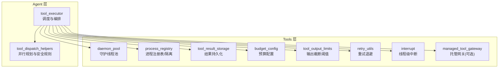
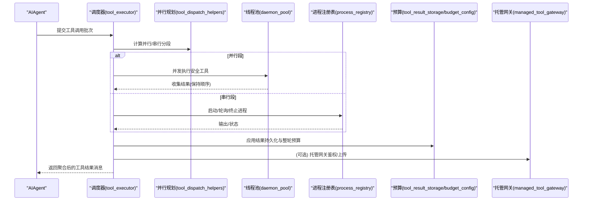
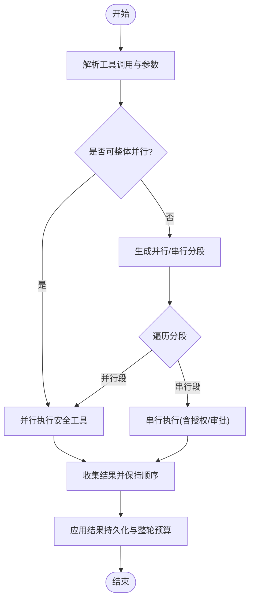
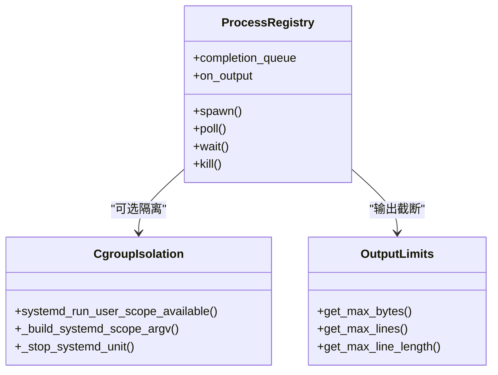
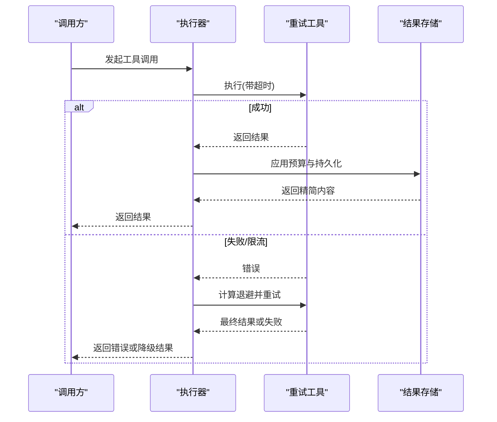
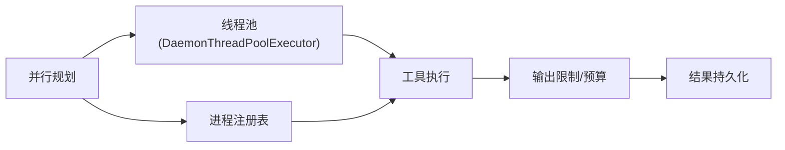
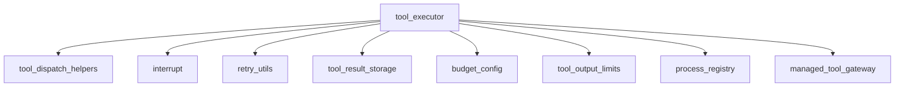

# 工具执行引擎

<cite>
**本文引用的文件**
- [agent/tool_executor.py](file://agent/tool_executor.py)
- [agent/tool_dispatch_helpers.py](file://agent/tool_dispatch_helpers.py)
- [tools/daemon_pool.py](file://tools/daemon_pool.py)
- [tools/process_registry.py](file://tools/process_registry.py)
- [tools/tool_result_storage.py](file://tools/tool_result_storage.py)
- [tools/budget_config.py](file://tools/budget_config.py)
- [tools/tool_output_limits.py](file://tools/tool_output_limits.py)
- [agent/retry_utils.py](file://agent/retry_utils.py)
- [tools/interrupt.py](file://tools/interrupt.py)
- [tools/managed_tool_gateway.py](file://tools/managed_tool_gateway.py)
</cite>

## 目录
1. [简介](#简介)
2. [项目结构](#项目结构)
3. [核心组件](#核心组件)
4. [架构总览](#架构总览)
5. [详细组件分析](#详细组件分析)
6. [依赖关系分析](#依赖关系分析)
7. [性能考量](#性能考量)
8. [故障排查指南](#故障排查指南)
9. [结论](#结论)
10. [附录](#附录)

## 简介
本文件面向“工具执行引擎”的深入技术文档，聚焦以下目标：
- 工具调度的实现原理与同步/异步执行模式的选择策略
- 资源隔离机制：进程隔离、内存限制、文件系统访问控制
- 超时控制与重试机制：超时检测、优雅降级、故障恢复
- 执行性能优化：并行执行、结果缓存、资源池管理
- 执行监控与日志记录最佳实践

该引擎在 Agent 层负责将模型发出的工具调用进行解析、编排、调度与结果聚合；在 Tools 层提供进程生命周期管理、输出持久化、预算控制、中断信号、重试退避等能力。

## 项目结构
围绕工具执行的关键模块分布如下：
- 调度与编排：agent/tool_executor.py、agent/tool_dispatch_helpers.py
- 并发与线程池：tools/daemon_pool.py
- 进程与沙箱：tools/process_registry.py
- 结果持久化与预算：tools/tool_result_storage.py、tools/budget_config.py、tools/tool_output_limits.py
- 重试与退避：agent/retry_utils.py
- 中断与协作：tools/interrupt.py
- 托管网关（可选）：tools/managed_tool_gateway.py

图表来源
- [agent/tool_executor.py:758-800](file://agent/tool_executor.py#L758-L800)
- [agent/tool_dispatch_helpers.py:116-234](file://agent/tool_dispatch_helpers.py#L116-L234)
- [tools/daemon_pool.py:37-65](file://tools/daemon_pool.py#L37-L65)
- [tools/process_registry.py:394-467](file://tools/process_registry.py#L394-L467)
- [tools/tool_result_storage.py:144-200](file://tools/tool_result_storage.py#L144-L200)
- [tools/budget_config.py:22-58](file://tools/budget_config.py#L22-L58)
- [tools/tool_output_limits.py:59-89](file://tools/tool_output_limits.py#L59-L89)
- [agent/retry_utils.py:90-128](file://agent/retry_utils.py#L90-L128)
- [tools/interrupt.py:39-70](file://tools/interrupt.py#L39-L70)
- [tools/managed_tool_gateway.py:174-196](file://tools/managed_tool_gateway.py#L174-L196)

章节来源
- [agent/tool_executor.py:758-800](file://agent/tool_executor.py#L758-L800)
- [agent/tool_dispatch_helpers.py:116-234](file://agent/tool_dispatch_helpers.py#L116-L234)

## 核心组件
- 工具调度器：负责解析工具调用、选择串行或并行执行路径、维护顺序与批处理边界、集成中间件与授权门控。
- 并行规划器：基于工具类型、参数与文件路径冲突分析，生成“并行段/串行段”的执行计划，保证结果顺序一致性与副作用安全。
- 进程注册表：管理后台进程的生命周期、输出缓冲、状态轮询、中断与清理，并在系统支持时通过 systemd scope 做 cgroup 隔离与内存限制。
- 结果存储与预算：对超大工具输出进行分层持久化（单结果阈值、整轮预算），并生成可被 read_file 读取的文件引用。
- 重试与退避：为外部服务限流/过载提供抖动指数退避与特定供应商的自适应长等待策略。
- 中断信号：线程级中断标志，确保多会话并发下仅影响当前会话的工具执行。
- 托管网关：当启用托管模式时，统一鉴权与上传协议，屏蔽上游细节。

章节来源
- [agent/tool_executor.py:758-800](file://agent/tool_executor.py#L758-L800)
- [agent/tool_dispatch_helpers.py:116-234](file://agent/tool_dispatch_helpers.py#L116-L234)
- [tools/process_registry.py:394-467](file://tools/process_registry.py#L394-L467)
- [tools/tool_result_storage.py:144-200](file://tools/tool_result_storage.py#L144-L200)
- [agent/retry_utils.py:90-128](file://agent/retry_utils.py#L90-L128)
- [tools/interrupt.py:39-70](file://tools/interrupt.py#L39-L70)
- [tools/managed_tool_gateway.py:174-196](file://tools/managed_tool_gateway.py#L174-L196)

## 架构总览
工具执行从 Agent 侧发起，经中间件与授权门控后进入调度器；调度器根据并行规划决定串行或并行执行；并行任务由守护线程池派发；涉及 I/O 或子进程的任务通过进程注册表管理；结果按预算策略持久化；对外部服务的调用使用重试退避；所有阶段均支持中断与日志上报。

图表来源
- [agent/tool_executor.py:758-800](file://agent/tool_executor.py#L758-L800)
- [agent/tool_dispatch_helpers.py:116-234](file://agent/tool_dispatch_helpers.py#L116-L234)
- [tools/daemon_pool.py:37-65](file://tools/daemon_pool.py#L37-L65)
- [tools/process_registry.py:394-467](file://tools/process_registry.py#L394-L467)
- [tools/tool_result_storage.py:144-200](file://tools/tool_result_storage.py#L144-L200)
- [tools/managed_tool_gateway.py:174-196](file://tools/managed_tool_gateway.py#L174-L196)

## 详细组件分析

### 工具调度与执行模式选择
- 串行与并行：调度器会先检查是否整体可并行；否则按“并行段/串行段”拆分，保证模型原始调用顺序不变，且避免写读竞争。
- 安全规则：
  - 某些工具永远禁止并行（如交互类）。
  - 只读工具集合可直接并行。
  - 文件相关工具（read/search/write/patch）基于路径范围与读写角色进行冲突检测，读写冲突则拆段。
- 授权门控：对需要人类审批或前置策略校验的工具调用进行序列化与超时保护，避免阻塞整个批次。
- 超时控制：并发工具调用具备全局超时上限，可通过环境变量覆盖；授权门控持有锁也有独立超时，防止死锁饥饿。
- 中断响应：在执行前与执行中均可响应中断，快速取消并返回标准化取消结果。

图表来源
- [agent/tool_dispatch_helpers.py:116-234](file://agent/tool_dispatch_helpers.py#L116-L234)
- [agent/tool_executor.py:758-800](file://agent/tool_executor.py#L758-L800)

章节来源
- [agent/tool_dispatch_helpers.py:116-234](file://agent/tool_dispatch_helpers.py#L116-L234)
- [agent/tool_executor.py:758-800](file://agent/tool_executor.py#L758-L800)

### 资源隔离机制
- 进程隔离：
  - 后台命令通过进程注册表统一管理，支持轮询、等待、终止、输出缓冲与崩溃恢复。
  - 在支持的系统上，使用 systemd-run 创建用户作用域（cgroup），使单个工作进程 OOM 不会杀死网关主进程。
- 内存限制：
  - 工作进程 cgroup 设置 MemoryMax，结合物理内存比例与最小/最大上限，避免越界占用。
  - 可通过环境变量收紧上限，但不会放宽风险。
- 文件系统访问控制：
  - 大输出不直接塞入上下文，而是写入沙箱临时目录并通过 read_file 按需读取。
  - 文件工具的路径规范化与冲突检测避免并发写读竞争。
  - 终端命令若判定为破坏性操作，会在执行前创建检查点以支持回滚。

图表来源
- [tools/process_registry.py:83-168](file://tools/process_registry.py#L83-L168)
- [tools/process_registry.py:248-327](file://tools/process_registry.py#L248-L327)
- [tools/tool_output_limits.py:59-89](file://tools/tool_output_limits.py#L59-L89)

章节来源
- [tools/process_registry.py:83-168](file://tools/process_registry.py#L83-L168)
- [tools/process_registry.py:248-327](file://tools/process_registry.py#L248-L327)
- [tools/tool_output_limits.py:59-89](file://tools/tool_output_limits.py#L59-L89)

### 超时控制与重试机制
- 并发工具超时：
  - 默认并发工具超时上限，可通过环境变量调整；为 0 表示禁用。
  - 授权门控持有锁有独立超时，避免长期阻塞。
- 重试与退避：
  - 通用抖动指数退避，避免雪崩式重试风暴。
  - 针对特定供应商过载（如 Z.AI Coding Plan GLM-5.2）采用短重试+渐进长等待策略，提升用户体验。
- 优雅降级与恢复：
  - 结果过大时自动持久化到沙箱，上下文内保留预览与文件路径，模型可后续读取。
  - 整轮工具输出超过预算时，优先持久化较大结果，直至满足预算。
  - 进程异常退出或丢失时，通过检查点与队列通知恢复。

图表来源
- [agent/tool_executor.py:160-175](file://agent/tool_executor.py#L160-L175)
- [agent/retry_utils.py:90-128](file://agent/retry_utils.py#L90-L128)
- [agent/retry_utils.py:162-191](file://agent/retry_utils.py#L162-L191)
- [tools/tool_result_storage.py:144-200](file://tools/tool_result_storage.py#L144-L200)

章节来源
- [agent/tool_executor.py:160-175](file://agent/tool_executor.py#L160-L175)
- [agent/retry_utils.py:90-128](file://agent/retry_utils.py#L90-L128)
- [agent/retry_utils.py:162-191](file://agent/retry_utils.py#L162-L191)
- [tools/tool_result_storage.py:144-200](file://tools/tool_result_storage.py#L144-L200)

### 执行性能优化策略
- 并行执行：
  - 基于工具类型与路径冲突分析的细粒度并行，最大化吞吐同时保证正确性。
  - 图像生成等慢 I/O 工具限制并发度，避免后端突发导致失败。
- 结果缓存：
  - 工具定义与作用域缓存，减少重复构建开销。
  - 输出限制与预算策略降低上下文压力，提高模型处理效率。
- 资源池管理：
  - 守护线程池避免解释器退出时被挂起线程阻塞，提升进程退出性能。
  - 进程注册表集中管理后台进程，避免资源泄漏。

图表来源
- [agent/tool_dispatch_helpers.py:116-234](file://agent/tool_dispatch_helpers.py#L116-L234)
- [tools/daemon_pool.py:37-65](file://tools/daemon_pool.py#L37-L65)
- [tools/tool_output_limits.py:59-89](file://tools/tool_output_limits.py#L59-L89)
- [tools/tool_result_storage.py:144-200](file://tools/tool_result_storage.py#L144-L200)
- [tools/process_registry.py:394-467](file://tools/process_registry.py#L394-L467)

章节来源
- [agent/tool_dispatch_helpers.py:116-234](file://agent/tool_dispatch_helpers.py#L116-L234)
- [tools/daemon_pool.py:37-65](file://tools/daemon_pool.py#L37-L65)
- [tools/tool_output_limits.py:59-89](file://tools/tool_output_limits.py#L59-L89)
- [tools/tool_result_storage.py:144-200](file://tools/tool_result_storage.py#L144-L200)
- [tools/process_registry.py:394-467](file://tools/process_registry.py#L394-L467)

### 执行监控与日志记录最佳实践
- 进度回调与钩子：
  - 工具开始/完成回调用于 UI 展示与追踪。
  - 中间件链路记录请求与执行轨迹，便于审计与排障。
- 增量持久化：
  - 工具执行过程中及时刷新会话数据库，确保破坏性操作前的进度可恢复。
- 日志脱敏与风险标记：
  - 工具输出中的敏感信息会被脱敏；高风险工具输出会被标记并包裹，提示模型将其视为数据而非指令。
- 观察指标：
  - 建议记录工具名称、耗时、状态码、错误类型、是否被阻断、是否触发预算持久化等关键指标，便于性能分析与问题定位。

章节来源
- [agent/tool_executor.py:259-330](file://agent/tool_executor.py#L259-L330)
- [agent/tool_executor.py:482-662](file://agent/tool_executor.py#L482-L662)
- [agent/tool_dispatch_helpers.py:533-706](file://agent/tool_dispatch_helpers.py#L533-L706)

## 依赖关系分析
- 低耦合高内聚：
  - 调度器依赖并行规划器与工具中间件，但不直接实现具体工具逻辑。
  - 进程注册表封装了系统级隔离与生命周期管理，对上层透明。
  - 结果存储与预算模块解耦于具体工具，按统一接口处理。
- 外部依赖：
  - 托管网关仅在启用时参与流程，不影响默认路径。
  - 重试工具与中断信号为横切关注点，被多处复用。

图表来源
- [agent/tool_executor.py:758-800](file://agent/tool_executor.py#L758-L800)
- [agent/tool_dispatch_helpers.py:116-234](file://agent/tool_dispatch_helpers.py#L116-L234)
- [tools/interrupt.py:39-70](file://tools/interrupt.py#L39-L70)
- [agent/retry_utils.py:90-128](file://agent/retry_utils.py#L90-L128)
- [tools/tool_result_storage.py:144-200](file://tools/tool_result_storage.py#L144-L200)
- [tools/budget_config.py:22-58](file://tools/budget_config.py#L22-L58)
- [tools/tool_output_limits.py:59-89](file://tools/tool_output_limits.py#L59-L89)
- [tools/process_registry.py:394-467](file://tools/process_registry.py#L394-L467)
- [tools/managed_tool_gateway.py:174-196](file://tools/managed_tool_gateway.py#L174-L196)

章节来源
- [agent/tool_executor.py:758-800](file://agent/tool_executor.py#L758-L800)
- [agent/tool_dispatch_helpers.py:116-234](file://agent/tool_dispatch_helpers.py#L116-L234)
- [tools/interrupt.py:39-70](file://tools/interrupt.py#L39-L70)
- [agent/retry_utils.py:90-128](file://agent/retry_utils.py#L90-L128)
- [tools/tool_result_storage.py:144-200](file://tools/tool_result_storage.py#L144-L200)
- [tools/budget_config.py:22-58](file://tools/budget_config.py#L22-L58)
- [tools/tool_output_limits.py:59-89](file://tools/tool_output_limits.py#L59-L89)
- [tools/process_registry.py:394-467](file://tools/process_registry.py#L394-L467)
- [tools/managed_tool_gateway.py:174-196](file://tools/managed_tool_gateway.py#L174-L196)

## 性能考量
- 并行度控制：
  - 根据工具类型动态调整并发上限，图像生成等慢 I/O 工具限制并发以避免后端限流。
- 预算与截断：
  - 单结果阈值与整轮预算双重保护，避免上下文溢出；大输出持久化到沙箱，按需读取。
- 线程池与进程管理：
  - 守护线程池避免进程退出阻塞；进程注册表集中回收与清理，防止资源泄漏。
- 重试策略：
  - 抖动退避与供应商自适应策略降低重试风暴概率，提升成功率与用户体验。
- 缓存与去重：
  - 工具定义与作用域缓存减少重复计算；路径规范化避免重复冲突判断。

[本节为通用指导，无需特定文件来源]

## 故障排查指南
- 工具被阻断：
  - 检查授权门控与前置插件是否返回阻断消息；查看中间件轨迹与错误类型。
- 并发超时：
  - 确认并发工具超时配置与环境变量；检查授权门控锁是否长时间持有。
- 进程卡死或无法终止：
  - 使用进程注册表的 kill 与 systemctl stop 组合释放 cgroup；检查 PID 复用与存活检测。
- 结果过大或上下文溢出：
  - 检查预算配置与工具输出限制；确认持久化是否成功，必要时手动 read_file 读取。
- 重试风暴：
  - 检查重试退避参数与供应商特定策略；适当增大抖动比例或调整长等待表。
- 中断未生效：
  - 确认线程级中断标志是否正确设置与清除；调试模式下查看中断日志。

章节来源
- [agent/tool_executor.py:482-662](file://agent/tool_executor.py#L482-L662)
- [tools/process_registry.py:780-800](file://tools/process_registry.py#L780-L800)
- [tools/tool_result_storage.py:144-200](file://tools/tool_result_storage.py#L144-L200)
- [agent/retry_utils.py:90-128](file://agent/retry_utils.py#L90-L128)
- [tools/interrupt.py:39-70](file://tools/interrupt.py#L39-L70)

## 结论
该工具执行引擎通过细粒度的并行规划、严格的资源隔离、健壮的超时与重试机制、以及完善的预算与持久化策略，实现了高效、稳定、安全的工具执行。其模块化设计使得各关注点清晰分离，便于扩展与维护。在生产环境中，建议结合监控与日志，持续优化并行度、预算阈值与重试策略，以获得最佳的性能与可靠性。

[本节为总结，无需特定文件来源]

## 附录
- 环境变量参考：
  - SPARKII_CONCURRENT_TOOL_TIMEOUT_S：并发工具超时秒数
  - TERMINAL_LOCAL_MEMORY_MAX_MB：本地工作进程内存上限（MB）
  - TOOL_GATEWAY_SCHEME / TOOL_GATEWAY_DOMAIN：托管网关地址配置
- 配置项参考：
  - tool_output.max_bytes / max_lines / max_line_length：工具输出截断阈值
  - budget_config：按模型上下文窗口缩放的结果与整轮预算

[本节为补充信息，无需特定文件来源]