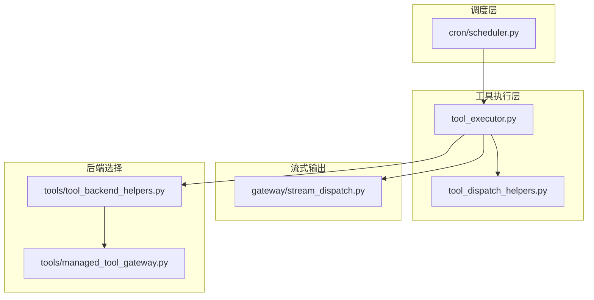
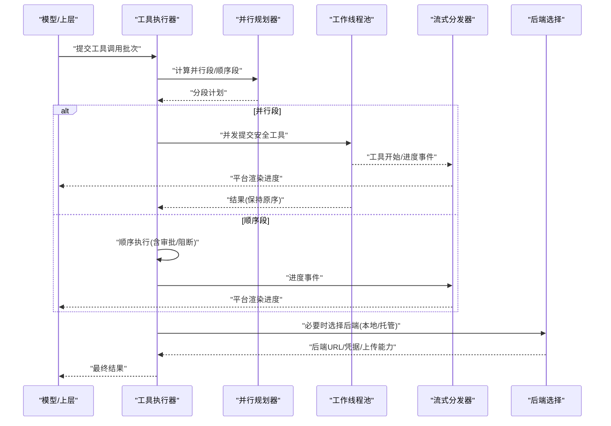
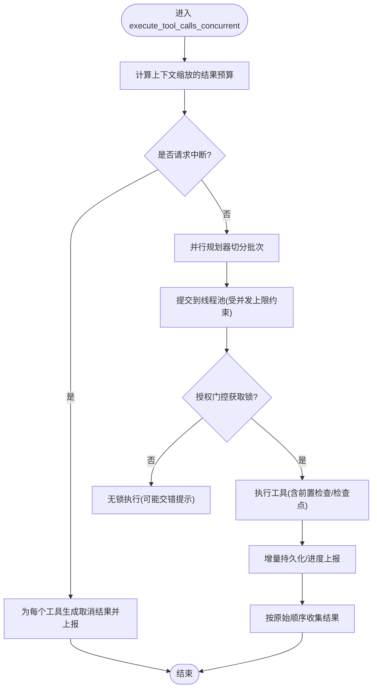
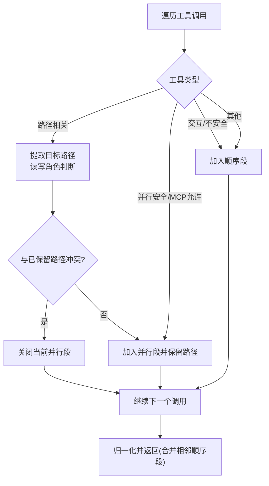
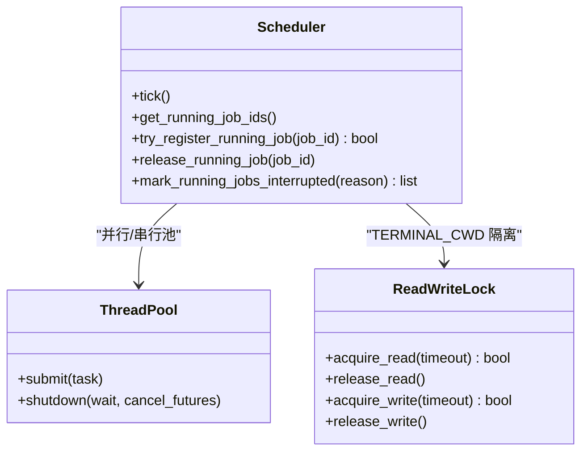
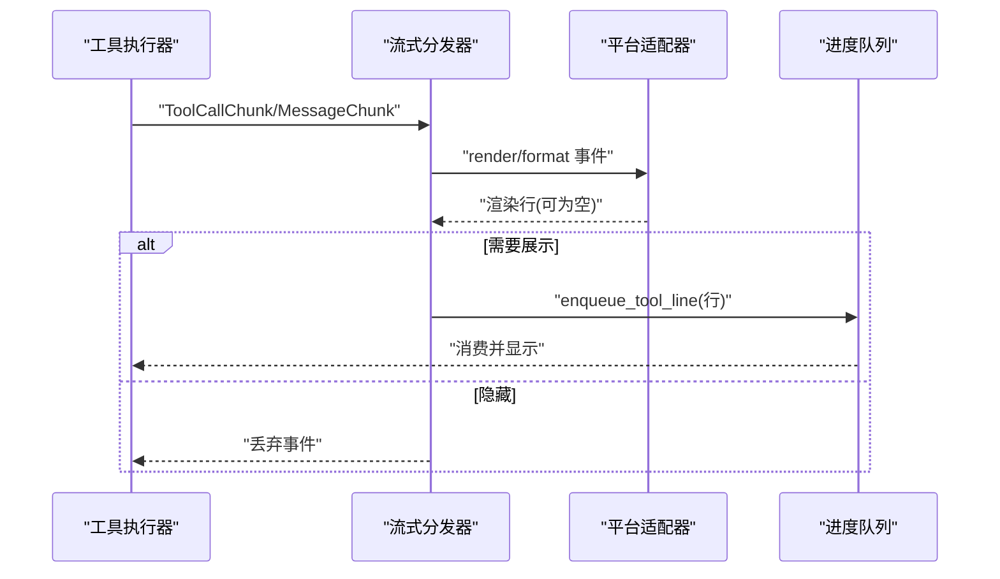
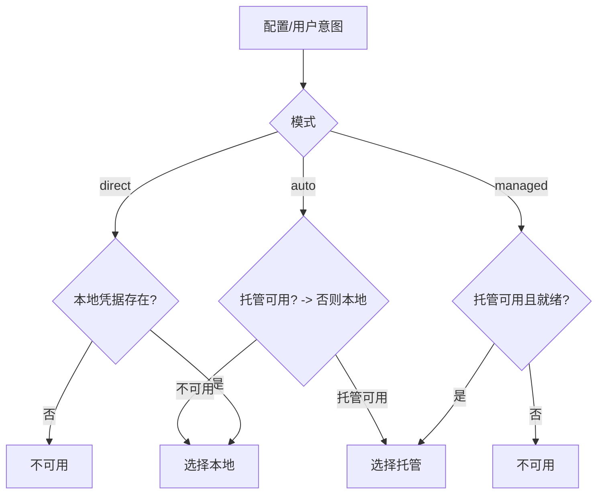
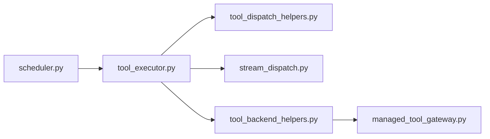

# 工具调度系统

<cite>
**本文引用的文件**
- [agent/tool_executor.py](file://agent/tool_executor.py)
- [agent/tool_dispatch_helpers.py](file://agent/tool_dispatch_helpers.py)
- [cron/scheduler.py](file://cron/scheduler.py)
- [gateway/stream_dispatch.py](file://gateway/stream_dispatch.py)
- [tools/tool_backend_helpers.py](file://tools/tool_backend_helpers.py)
- [tools/managed_tool_gateway.py](file://tools/managed_tool_gateway.py)
</cite>

## 目录
1. [简介](#简介)
2. [项目结构](#项目结构)
3. [核心组件](#核心组件)
4. [架构总览](#架构总览)
5. [详细组件分析](#详细组件分析)
6. [依赖关系分析](#依赖关系分析)
7. [性能考虑](#性能考虑)
8. [故障排查指南](#故障排查指南)
9. [结论](#结论)
10. [附录](#附录)

## 简介
本文件面向“工具调度系统”的机制与实现，聚焦以下目标：
- 同步与异步执行模式的选择逻辑、任务队列管理与优先级调度算法
- 工具后端选择策略（本地执行、云端托管、混合模式）的决策过程
- 调度器的负载均衡与资源分配机制，区分 CPU 密集型与 I/O 密集型任务
- 调度性能优化策略：批处理、延迟优化、并发控制
- 调度监控与故障恢复的最佳实践

## 项目结构
围绕工具调度的关键模块分布如下：
- agent/tool_executor.py：工具调用执行器，负责顺序/并发执行、超时、授权门控、结果持久化与进度上报
- agent/tool_dispatch_helpers.py：并行安全判定、路径冲突检测、多模态结果封装、不可信内容包装
- cron/scheduler.py：定时任务调度器，提供并行/串行线程池、工作目录隔离、中断与失败处理
- gateway/stream_dispatch.py：流式事件分发器，将工具进度等事件路由到平台适配器
- tools/tool_backend_helpers.py：后端选择辅助（本地/托管/直连），凭据解析与网关偏好
- tools/managed_tool_gateway.py：托管工具网关（Nous 托管）配置、鉴权、媒体上传协议

**图表来源**
- [agent/tool_executor.py:1-120](file://agent/tool_executor.py#L1-L120)
- [agent/tool_dispatch_helpers.py:1-120](file://agent/tool_dispatch_helpers.py#L1-L120)
- [cron/scheduler.py:330-650](file://cron/scheduler.py#L330-L650)
- [gateway/stream_dispatch.py:40-133](file://gateway/stream_dispatch.py#L40-L133)
- [tools/tool_backend_helpers.py:20-142](file://tools/tool_backend_helpers.py#L20-L142)
- [tools/managed_tool_gateway.py:174-216](file://tools/managed_tool_gateway.py#L174-L216)

**章节来源**
- [agent/tool_executor.py:1-120](file://agent/tool_executor.py#L1-L120)
- [agent/tool_dispatch_helpers.py:1-120](file://agent/tool_dispatch_helpers.py#L1-L120)
- [cron/scheduler.py:330-650](file://cron/scheduler.py#L330-L650)
- [gateway/stream_dispatch.py:40-133](file://gateway/stream_dispatch.py#L40-L133)
- [tools/tool_backend_helpers.py:20-142](file://tools/tool_backend_helpers.py#L20-L142)
- [tools/managed_tool_gateway.py:174-216](file://tools/managed_tool_gateway.py#L174-L216)

## 核心组件
- 工具执行器（tool_executor.py）
  - 并发执行：基于线程池的批量工具调用，按原始顺序收集结果
  - 授权门控：序列化审批提示，排除人类等待时间对批次超时的影响
  - 超时控制：可配置的并发工具超时；图像生成并发度上限
  - 进度与持久化：增量写入会话消息，确保破坏性操作前的检查点
- 并行规划器（tool_dispatch_helpers.py）
  - 将一批工具调用切分为“并行段”和“顺序段”，保证顺序不变
  - 路径冲突检测：读写分离，避免写者与任何重叠读者/写者竞争
  - 多模态结果封装与不可信内容包装，防止间接提示注入
- 定时调度器（cron/scheduler.py）
  - 并行与串行线程池：并行用于无副作用任务，串行用于修改环境变量的任务
  - 工作目录隔离：读写锁保护进程级工作目录，避免跨任务污染
  - 中断与失败：优雅关闭、标记中断、失败摘要与投递抑制
- 流式分发器（gateway/stream_dispatch.py）
  - 将工具进度、消息片段等事件通过平台适配器渲染并投递
  - 支持“仅新工具”去重、预览长度限制、长任务提示
- 后端选择（tools/tool_backend_helpers.py, tools/managed_tool_gateway.py）
  - 本地/托管/直连三种模式的自动或强制选择
  - 凭据解析：环境变量、配置文件、凭证池、多租户作用域
  - 托管网关：访问令牌刷新、媒体上传预签名流程

**章节来源**
- [agent/tool_executor.py:758-800](file://agent/tool_executor.py#L758-L800)
- [agent/tool_dispatch_helpers.py:116-234](file://agent/tool_dispatch_helpers.py#L116-L234)
- [cron/scheduler.py:330-650](file://cron/scheduler.py#L330-L650)
- [gateway/stream_dispatch.py:40-133](file://gateway/stream_dispatch.py#L40-L133)
- [tools/tool_backend_helpers.py:20-142](file://tools/tool_backend_helpers.py#L20-L142)
- [tools/managed_tool_gateway.py:174-216](file://tools/managed_tool_gateway.py#L174-L216)

## 架构总览
工具调度由“执行器 + 并行规划器 + 调度器 + 流式分发 + 后端选择”构成。模型生成的工具调用进入执行器，先进行并行安全规划，再决定顺序或并发执行；执行过程中通过流式分发器上报进度；后端选择根据可用性与配置决定本地或云端托管执行；定时调度器以独立线程池运行周期性任务，保障环境与状态隔离。

**图表来源**
- [agent/tool_executor.py:758-800](file://agent/tool_executor.py#L758-L800)
- [agent/tool_dispatch_helpers.py:116-234](file://agent/tool_dispatch_helpers.py#L116-L234)
- [gateway/stream_dispatch.py:88-133](file://gateway/stream_dispatch.py#L88-L133)
- [tools/tool_backend_helpers.py:105-142](file://tools/tool_backend_helpers.py#L105-L142)
- [tools/managed_tool_gateway.py:174-216](file://tools/managed_tool_gateway.py#L174-L216)

## 详细组件分析

### 工具执行器（并发与顺序）
- 并发执行入口：接收助手消息中的工具调用列表，按批次提交到线程池，维护原始顺序
- 授权门控：使用带超时的序列化锁，避免审批提示交错；人类等待时间从批次超时中排除
- 超时与并发度：可配置全局并发超时；图像生成有独立并发上限
- 进度与持久化：在工具开始前记录进度，必要时提前刷盘，确保破坏性操作的中间状态不丢失

**图表来源**
- [agent/tool_executor.py:758-800](file://agent/tool_executor.py#L758-L800)
- [agent/tool_executor.py:391-468](file://agent/tool_executor.py#L391-L468)
- [agent/tool_executor.py:160-176](file://agent/tool_executor.py#L160-L176)
- [agent/tool_executor.py:209-247](file://agent/tool_executor.py#L209-L247)

**章节来源**
- [agent/tool_executor.py:758-800](file://agent/tool_executor.py#L758-L800)
- [agent/tool_executor.py:391-468](file://agent/tool_executor.py#L391-L468)
- [agent/tool_executor.py:160-176](file://agent/tool_executor.py#L160-L176)
- [agent/tool_executor.py:209-247](file://agent/tool_executor.py#L209-L247)

### 并行规划器（任务队列与优先级）
- 分段策略：将一批调用划分为“并行段”和“顺序段”，严格保持模型原始顺序
- 安全规则：
  - 交互式工具（如 clarify）强制顺序
  - 参数无法解析或非字典视为顺序屏障
  - 路径相关工具（read_file/search_files/write_file/patch）按读写角色与路径重叠判定
  - 其他工具默认顺序，除非明确标记为并行安全或 MCP 允许并行
- 路径冲突：规范化路径后比较前缀，读写冲突即关闭当前并行段

**图表来源**
- [agent/tool_dispatch_helpers.py:116-234](file://agent/tool_dispatch_helpers.py#L116-L234)
- [agent/tool_dispatch_helpers.py:250-346](file://agent/tool_dispatch_helpers.py#L250-L346)

**章节来源**
- [agent/tool_dispatch_helpers.py:116-234](file://agent/tool_dispatch_helpers.py#L116-L234)
- [agent/tool_dispatch_helpers.py:250-346](file://agent/tool_dispatch_helpers.py#L250-L346)

### 定时调度器（任务队列与优先级）
- 双池设计：
  - 并行池：执行无副作用、可并发任务
  - 串行池：单线程执行会修改进程级环境（如工作目录）的任务，保证顺序
- 工作目录隔离：读写锁保护共享工作目录，避免任务间互相污染
- 中断与失败：
  - 运行时标记中断，阻止错误覆盖成功状态
  - 失败摘要适配不同错误类型（限流、超时、认证）
  - 静默标记支持抑制投递但保留审计

**图表来源**
- [cron/scheduler.py:330-650](file://cron/scheduler.py#L330-L650)
- [cron/scheduler.py:471-557](file://cron/scheduler.py#L471-L557)

**章节来源**
- [cron/scheduler.py:330-650](file://cron/scheduler.py#L330-L650)
- [cron/scheduler.py:471-557](file://cron/scheduler.py#L471-L557)

### 流式分发器（监控与可见性）
- 事件类型：消息片段、工具进度、长任务提示、网关通知
- 渲染与投递：通过平台适配器格式化工具事件，入队到统一进度队列
- 模式控制：支持“全部/仅新/详细/关闭”四种工具进度模式，减少噪音

**图表来源**
- [gateway/stream_dispatch.py:40-133](file://gateway/stream_dispatch.py#L40-L133)

**章节来源**
- [gateway/stream_dispatch.py:40-133](file://gateway/stream_dispatch.py#L40-L133)

### 后端选择（本地/云端/混合）
- 模式选择：
  - direct：仅本地直连（需本地凭据/配置）
  - managed：仅托管（需权限与就绪）
  - auto：优先托管，回退本地
- 凭据解析：
  - 配置项 > 作用域环境变量 > 凭证池（非多租户时）
  - 多租户下仅读取当前作用域密钥，避免串扰
- 托管网关：
  - 访问令牌缓存与刷新
  - 媒体上传预签名协议，绕过请求大小限制

**图表来源**
- [tools/tool_backend_helpers.py:105-142](file://tools/tool_backend_helpers.py#L105-L142)
- [tools/tool_backend_helpers.py:158-252](file://tools/tool_backend_helpers.py#L158-L252)
- [tools/managed_tool_gateway.py:174-216](file://tools/managed_tool_gateway.py#L174-L216)

**章节来源**
- [tools/tool_backend_helpers.py:105-142](file://tools/tool_backend_helpers.py#L105-L142)
- [tools/tool_backend_helpers.py:158-252](file://tools/tool_backend_helpers.py#L158-L252)
- [tools/managed_tool_gateway.py:174-216](file://tools/managed_tool_gateway.py#L174-L216)

## 依赖关系分析
- tool_executor 依赖 tool_dispatch_helpers 做并行安全判定与结果包装
- tool_executor 依赖 stream_dispatch 上报进度
- scheduler 通过线程池管理任务生命周期，并与 tool_executor 协同（例如在代理上下文中执行工具）
- 后端选择模块被工具调用方使用，决定是否走本地或托管路径
- 托管网关提供统一的鉴权与上传协议，屏蔽上游差异

**图表来源**
- [agent/tool_executor.py:1-120](file://agent/tool_executor.py#L1-L120)
- [agent/tool_dispatch_helpers.py:1-120](file://agent/tool_dispatch_helpers.py#L1-L120)
- [cron/scheduler.py:330-650](file://cron/scheduler.py#L330-L650)
- [gateway/stream_dispatch.py:40-133](file://gateway/stream_dispatch.py#L40-L133)
- [tools/tool_backend_helpers.py:20-142](file://tools/tool_backend_helpers.py#L20-L142)
- [tools/managed_tool_gateway.py:174-216](file://tools/managed_tool_gateway.py#L174-L216)

**章节来源**
- [agent/tool_executor.py:1-120](file://agent/tool_executor.py#L1-L120)
- [agent/tool_dispatch_helpers.py:1-120](file://agent/tool_dispatch_helpers.py#L1-L120)
- [cron/scheduler.py:330-650](file://cron/scheduler.py#L330-L650)
- [gateway/stream_dispatch.py:40-133](file://gateway/stream_dispatch.py#L40-L133)
- [tools/tool_backend_helpers.py:20-142](file://tools/tool_backend_helpers.py#L20-L142)
- [tools/managed_tool_gateway.py:174-216](file://tools/managed_tool_gateway.py#L174-L216)

## 性能考虑
- 批处理与分段并行
  - 将一批工具调用切分为最大连续并行段，减少顺序屏障带来的串行开销
  - 对路径相关工具进行读写冲突检测，避免不必要的顺序降级
- 并发控制
  - 全局并发工具超时，防止慢任务拖垮整体
  - 图像生成并发上限，避免后端突发导致 TTFB/限流失败
  - 授权门控超时，避免审批阻塞导致整批饥饿
- 延迟优化
  - 增量持久化与进度上报，缩短 UI 反馈延迟
  - “仅新工具”模式减少重复渲染
- 资源分配
  - 并行池用于 I/O 密集任务（网络、磁盘读）
  - 串行池用于修改进程级状态的任务（如工作目录），避免竞争
  - 对 CPU 密集型任务建议拆分小批并发，结合超时与预算控制

[本节为通用指导，无需特定文件引用]

## 故障排查指南
- 工具执行被阻断
  - 检查插件/护栏是否返回阻断信息；查看“blocked”标志与错误类型
  - 确认授权门控未因锁超时而跳过序列化
- 任务超时或饥饿
  - 调整并发工具超时与图像生成并发上限
  - 检查是否存在长时间审批或外部依赖导致的门控持有
- 定时任务异常
  - 查看失败摘要（限流、超时、认证）与投递抑制标记
  - 检查工作目录锁是否超时，避免跨任务污染
- 后端不可用
  - 检查托管权限与令牌刷新；确认本地凭据与作用域
  - 验证托管网关 URL 与上传端点可达性

**章节来源**
- [agent/tool_executor.py:482-662](file://agent/tool_executor.py#L482-L662)
- [agent/tool_executor.py:160-176](file://agent/tool_executor.py#L160-L176)
- [cron/scheduler.py:101-152](file://cron/scheduler.py#L101-L152)
- [cron/scheduler.py:555-604](file://cron/scheduler.py#L555-L604)
- [tools/tool_backend_helpers.py:20-71](file://tools/tool_backend_helpers.py#L20-L71)
- [tools/managed_tool_gateway.py:119-145](file://tools/managed_tool_gateway.py#L119-L145)

## 结论
该工具调度系统通过“并行规划 + 并发执行 + 流式分发 + 后端选择”的组合，实现了高吞吐、低延迟与强一致性的工具调用执行。其关键优势包括：
- 安全的并行化：基于路径与工具类型的细粒度冲突检测
- 稳健的执行：授权门控、超时与增量持久化保障可靠性
- 灵活的调度：并行/串行池与工作目录隔离满足复杂场景
- 可扩展的后端：本地/托管/混合模式与统一鉴权/上传协议

[本节为总结性内容，无需特定文件引用]

## 附录
- 术语
  - 并行段：一组可安全并发执行的调用
  - 顺序段：必须按序执行的调用（含交互/阻断/路径冲突）
  - 授权门控：序列化审批提示并排除人类等待时间的机制
  - 托管网关：通过 Nous 托管服务转发的工具调用与媒体上传
- 最佳实践
  - 将 I/O 密集任务放入并行段，CPU 密集任务控制并发度
  - 合理设置超时与预算，避免单次大结果导致上下文溢出
  - 启用流式进度上报以提升用户体验
  - 使用托管网关时关注令牌有效期与上传端点可用性

[本节为补充说明，无需特定文件引用]