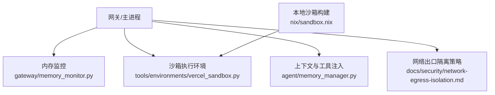
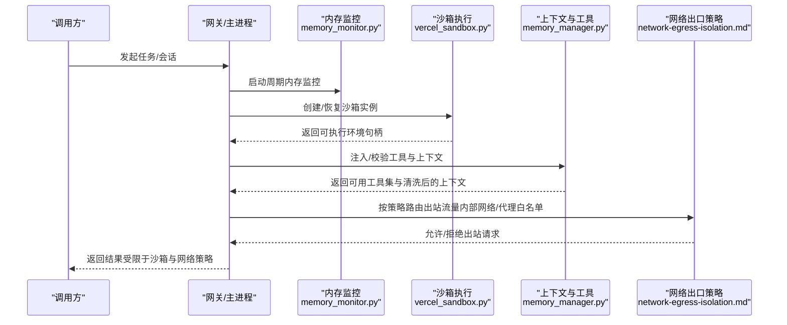
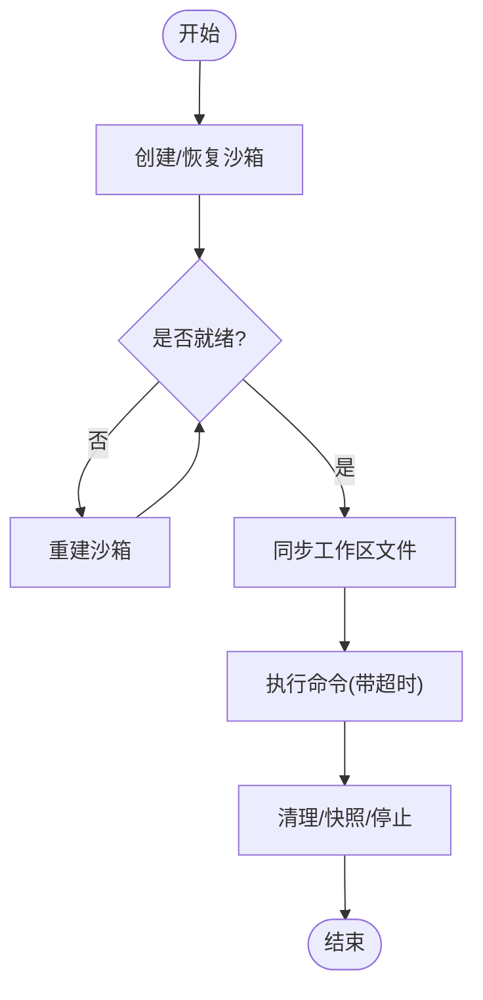
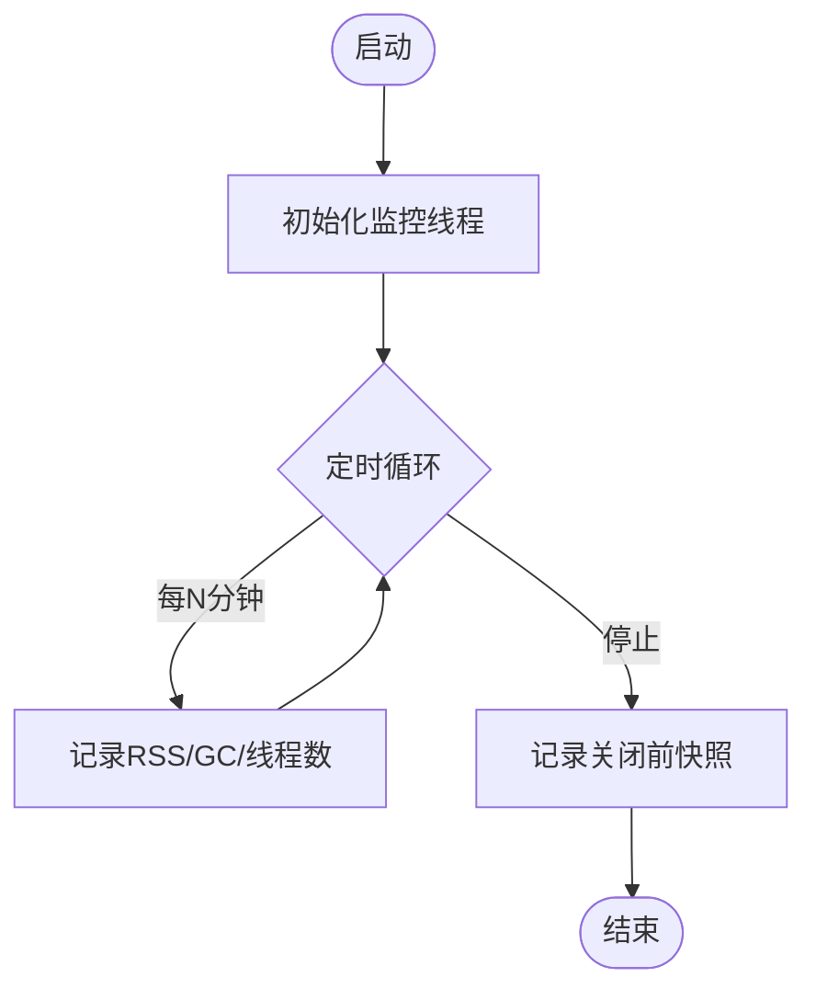
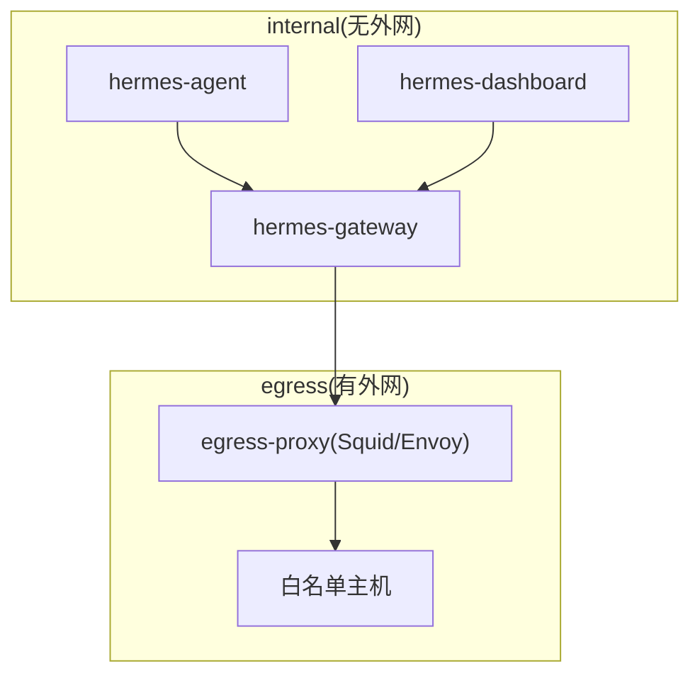
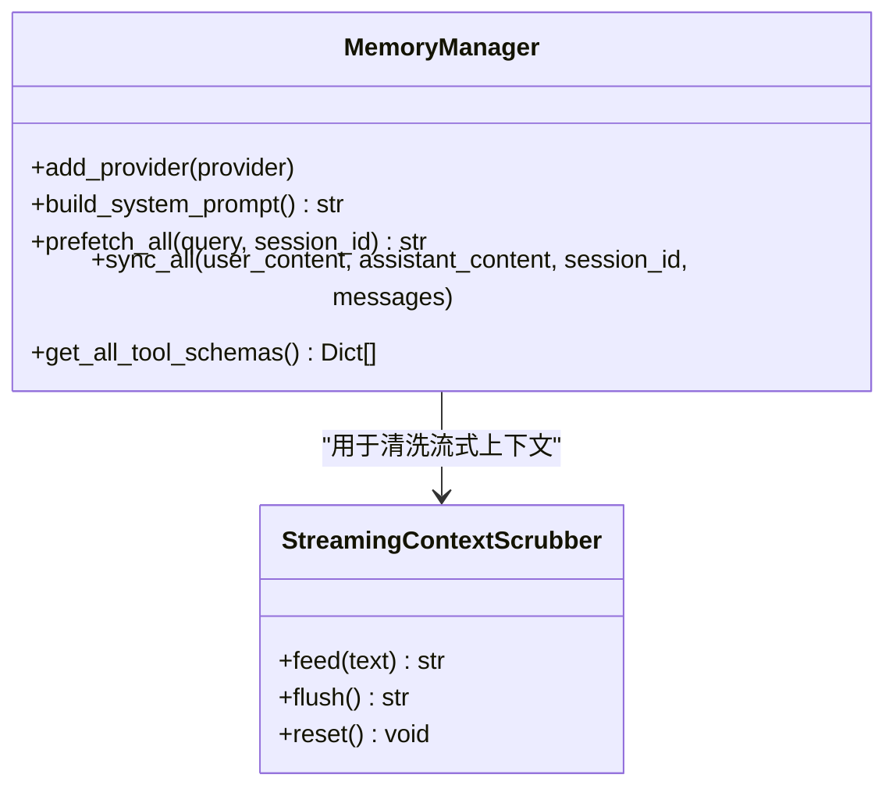
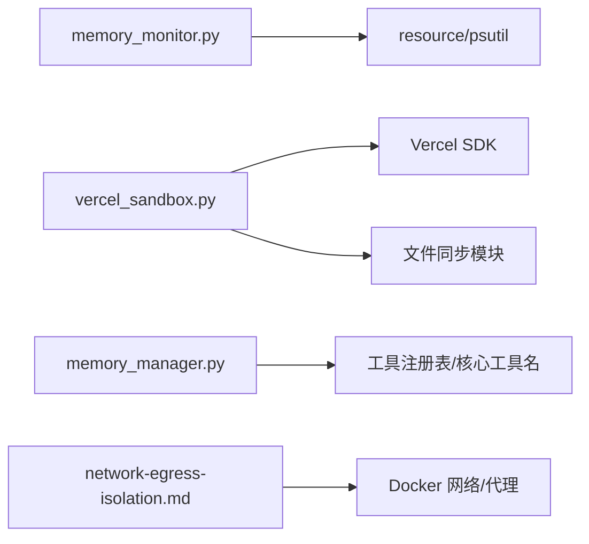

# 资源隔离机制

<cite>
**本文引用的文件**
- [network-egress-isolation.md](file://docs/security/network-egress-isolation.md)
- [memory_manager.py](file://agent/memory_manager.py)
- [memory_monitor.py](file://gateway/memory_monitor.py)
- [vercel_sandbox.py](file://tools/environments/vercel_sandbox.py)
- [sandbox.nix](file://nix/sandbox.nix)
</cite>

## 目录
1. [简介](#简介)
2. [项目结构](#项目结构)
3. [核心组件](#核心组件)
4. [架构总览](#架构总览)
5. [详细组件分析](#详细组件分析)
6. [依赖关系分析](#依赖关系分析)
7. [性能考量](#性能考量)
8. [故障排查指南](#故障排查指南)
9. [结论](#结论)
10. [附录](#附录)

## 简介
本文件系统性阐述本仓库中的资源隔离机制，覆盖进程隔离（沙箱环境、进程间通信与安全边界）、内存限制与监控（使用监控、垃圾回收控制、泄漏防护）、文件系统访问控制（路径白名单、权限验证、敏感文件保护）、网络访问隔离（DNS过滤、代理配置、出站连接控制），以及资源监控与告警的实现细节。文档以代码级事实为依据，辅以架构图与时序图帮助理解。

## 项目结构
围绕资源隔离的关键实现分布在以下位置：
- 网络出口隔离策略与部署建议：docs/security/network-egress-isolation.md
- 进程/沙箱执行环境：tools/environments/vercel_sandbox.py（云端沙箱后端）
- 本地沙箱构建与依赖：nix/sandbox.nix（bubblewrap/slirp4netns 等）
- 内存监控与日志：gateway/memory_monitor.py（周期性 RSS/GC/线程数记录）
- 上下文与工具注入的隔离：agent/memory_manager.py（工具注册、命名冲突防护、流式上下文清洗）

图表来源
- [memory_monitor.py:1-231](file://gateway/memory_monitor.py#L1-L231)
- [vercel_sandbox.py:243-663](file://tools/environments/vercel_sandbox.py#L243-L663)
- [memory_manager.py:364-800](file://agent/memory_manager.py#L364-L800)
- [network-egress-isolation.md:23-154](file://docs/security/network-egress-isolation.md#L23-L154)
- [sandbox.nix:89-124](file://nix/sandbox.nix#L89-L124)

章节来源
- [memory_monitor.py:1-231](file://gateway/memory_monitor.py#L1-L231)
- [vercel_sandbox.py:243-663](file://tools/environments/vercel_sandbox.py#L243-L663)
- [memory_manager.py:364-800](file://agent/memory_manager.py#L364-L800)
- [network-egress-isolation.md:23-154](file://docs/security/network-egress-isolation.md#L23-L154)
- [sandbox.nix:89-124](file://nix/sandbox.nix#L89-L124)

## 核心组件
- 沙箱执行环境（Vercel Sandbox）：提供进程级隔离的执行容器，支持超时、CPU/内存资源声明、工作目录与快照恢复、命令执行与文件同步。
- 本地沙箱构建（Nix + bubblewrap + slirp4netns）：用于在开发或受控环境中通过最小化运行时和受限网络栈创建安全边界。
- 内存监控：周期性采集进程 RSS、GC 计数、线程数并输出结构化日志，便于发现慢泄漏与线程泄漏。
- 上下文与工具注入隔离：对工具注册进行名称冲突防护，避免污染核心工具；对流式上下文进行标签清洗，防止内部上下文泄露到用户可见输出。
- 网络出口隔离：通过 Docker 网络分段与可选 HTTP 代理（如 Squid）实现严格出站白名单，阻断任意外联。

章节来源
- [vercel_sandbox.py:243-663](file://tools/environments/vercel_sandbox.py#L243-L663)
- [sandbox.nix:89-124](file://nix/sandbox.nix#L89-L124)
- [memory_monitor.py:1-231](file://gateway/memory_monitor.py#L1-L231)
- [memory_manager.py:364-800](file://agent/memory_manager.py#L364-L800)
- [network-egress-isolation.md:23-154](file://docs/security/network-egress-isolation.md#L23-L154)

## 架构总览
下图展示网关/主进程如何组合沙箱执行、内存监控、上下文隔离与网络出口策略，形成端到端的资源隔离体系。

图表来源
- [memory_monitor.py:139-193](file://gateway/memory_monitor.py#L139-L193)
- [vercel_sandbox.py:306-342](file://tools/environments/vercel_sandbox.py#L306-L342)
- [memory_manager.py:404-470](file://agent/memory_manager.py#L404-L470)
- [network-egress-isolation.md:62-154](file://docs/security/network-egress-isolation.md#L62-L154)

## 详细组件分析

### 进程隔离与沙箱环境
- 云端沙箱（Vercel）：
  - 创建与恢复：支持从快照恢复，失败时回退到全新沙箱；具备重试与临时错误处理。
  - 资源声明：可配置 CPU、内存与运行超时；磁盘容量由平台默认约束。
  - 执行模型：通过 run_command 执行 bash/shell 命令，结合基础类的等待与取消机制实现超时终止。
  - 文件同步：基于 FileSyncManager 将宿主与工作区目录双向同步，清理临时归档。
  - 生命周期：确保停止与关闭客户端，避免资源泄漏；必要时重建沙箱。
- 本地沙箱（Nix + bubblewrap + slirp4netns）：
  - 通过 Nix 打包最小化运行时与必要系统库，配合 bubblewrap 提供命名空间隔离。
  - 使用 slirp4netns 提供受限的网络栈，便于在无 root 环境下进行网络隔离测试。

图表来源
- [vercel_sandbox.py:306-342](file://tools/environments/vercel_sandbox.py#L306-L342)
- [vercel_sandbox.py:398-421](file://tools/environments/vercel_sandbox.py#L398-L421)
- [vercel_sandbox.py:591-637](file://tools/environments/vercel_sandbox.py#L591-L637)
- [vercel_sandbox.py:639-663](file://tools/environments/vercel_sandbox.py#L639-L663)
- [sandbox.nix:89-124](file://nix/sandbox.nix#L89-L124)

章节来源
- [vercel_sandbox.py:243-663](file://tools/environments/vercel_sandbox.py#L243-L663)
- [sandbox.nix:89-124](file://nix/sandbox.nix#L89-L124)

### 进程间通信与安全边界
- 沙箱内命令执行通过 SDK 提供的 run_command 接口，输入输出被封装为字符串与退出码，避免直接暴露底层进程句柄。
- 超时与取消：基础类负责等待与取消回调，在超时时触发停止沙箱，确保不可信命令不会长期占用资源。
- 文件同步边界：仅同步约定的工作区与隐藏目录（如 .hermes），减少越界访问风险。

章节来源
- [vercel_sandbox.py:591-637](file://tools/environments/vercel_sandbox.py#L591-L637)
- [vercel_sandbox.py:344-367](file://tools/environments/vercel_sandbox.py#L344-L367)

### 内存限制与监控
- 进程内存监控：
  - 周期性采集 RSS、GC 计数、线程数，输出单行结构化日志，便于 grep 定位泄漏趋势。
  - 使用 resource.getrusage（Linux/macOS）或 psutil（Windows/其他）获取 RSS；若均不可用则降级并跳过监控。
  - 后台守护线程运行，不影响主流程；启动时记录基线，关闭前记录最终值。
- 垃圾回收控制：
  - 通过 gc.get_count() 统计各代 GC 次数作为“垃圾产生量”的代理指标，辅助判断是否存在异常分配。
- 内存泄漏防护：
  - 定期日志序列可用于识别缓慢增长；结合线程数变化定位线程泄漏。
  - 沙箱侧的资源上限（CPU/内存/超时）进一步限制单个任务的资源消耗。

图表来源
- [memory_monitor.py:139-193](file://gateway/memory_monitor.py#L139-L193)
- [memory_monitor.py:83-127](file://gateway/memory_monitor.py#L83-L127)
- [memory_monitor.py:196-224](file://gateway/memory_monitor.py#L196-L224)

章节来源
- [memory_monitor.py:1-231](file://gateway/memory_monitor.py#L1-L231)
- [vercel_sandbox.py:248-304](file://tools/environments/vercel_sandbox.py#L248-L304)

### 文件系统访问控制
- 工作目录与根目录探测：自动检测远程工作区根与 home 目录，统一挂载到约定路径。
- 同步范围限定：仅同步特定目录（如 .hermes）与用户工作区，避免全量镜像带来的安全风险。
- 删除与上传：批量上传与删除操作均通过 SDK 或 shell 命令执行，并对返回值进行校验。
- 敏感文件保护：通过最小化运行时与受限目录，降低读取系统敏感文件的概率；如需更严格限制，可在上层策略中进一步收敛。

章节来源
- [vercel_sandbox.py:344-367](file://tools/environments/vercel_sandbox.py#L344-L367)
- [vercel_sandbox.py:513-553](file://tools/environments/vercel_sandbox.py#L513-L553)
- [vercel_sandbox.py:554-590](file://tools/environments/vercel_sandbox.py#L554-L590)

### 网络访问隔离策略
- 网络分段：
  - internal 网络：无默认路由、无互联网访问，承载 agent、dashboard、gateway。
  - egress 网络：具备互联网访问，仅放置需要出站的网关服务。
- 代理白名单：
  - 通过 HTTP/HTTPS 代理（如 Squid）配置 dstdomain 白名单，仅允许访问 LLM 提供商与消息平台 API。
  - 设置 NO_PROXY 排除内部服务域名，避免误拦截。
- DNS 与出站控制：
  - internal 网络仍可解析外部域名，但若无出站路由则无法建立连接；如需更强控制，可搭配本地 DNS 解析器屏蔽外部查询。
- 验证方法：
  - 在容器内尝试访问外部站点应失败；访问内部服务应成功；经代理访问白名单主机应成功。

图表来源
- [network-egress-isolation.md:23-61](file://docs/security/network-egress-isolation.md#L23-L61)
- [network-egress-isolation.md:62-154](file://docs/security/network-egress-isolation.md#L62-L154)

章节来源
- [network-egress-isolation.md:23-154](file://docs/security/network-egress-isolation.md#L23-L154)

### 上下文与工具注入的安全边界
- 工具注册与名称冲突防护：
  - 只允许一个外部记忆提供者；拒绝与核心工具重名的注册，避免劫持。
  - 收集工具 schema 时跳过保留的核心工具名，保证内置工具优先。
- 流式上下文清洗：
  - 针对可能被分片传输的 <memory-context> 标签，实现状态机清洗器，丢弃内部上下文片段，防止泄露到 UI。
- 预取与同步的隔离：
  - 外部提供者的预取与同步在后台线程执行，避免阻塞主流程；提供超时与失败容忍，确保健壮性。

图表来源
- [memory_manager.py:364-800](file://agent/memory_manager.py#L364-L800)
- [memory_manager.py:182-346](file://agent/memory_manager.py#L182-L346)

章节来源
- [memory_manager.py:364-800](file://agent/memory_manager.py#L364-L800)
- [memory_manager.py:182-346](file://agent/memory_manager.py#L182-L346)

## 依赖关系分析
- 沙箱执行依赖 Vercel SDK 与文件同步模块；超时与取消逻辑依赖基础类。
- 内存监控依赖标准库 resource 或可选依赖 psutil；不阻塞主流程。
- 上下文与工具注入依赖工具集注册表与核心工具名集合，确保命名安全。
- 网络出口隔离依赖 Docker 网络与可选代理配置，属于部署层策略。

图表来源
- [memory_monitor.py:52-80](file://gateway/memory_monitor.py#L52-L80)
- [vercel_sandbox.py:243-304](file://tools/environments/vercel_sandbox.py#L243-L304)
- [memory_manager.py:404-470](file://agent/memory_manager.py#L404-L470)
- [network-egress-isolation.md:62-154](file://docs/security/network-egress-isolation.md#L62-L154)

章节来源
- [memory_monitor.py:52-80](file://gateway/memory_monitor.py#L52-L80)
- [vercel_sandbox.py:243-304](file://tools/environments/vercel_sandbox.py#L243-L304)
- [memory_manager.py:404-470](file://agent/memory_manager.py#L404-L470)
- [network-egress-isolation.md:62-154](file://docs/security/network-egress-isolation.md#L62-L154)

## 性能考量
- 沙箱创建与恢复：
  - 使用重试与指数退避应对瞬时错误；最小化超时以避免长时间挂起。
  - 快照恢复可减少冷启动开销，但需权衡一致性。
- 内存监控开销：
  - 后台守护线程低频率采样，对主流程影响极小；在不可用平台自动降级。
- 上下文清洗：
  - 流式状态机避免重复扫描，仅在块边界匹配标签，降低 CPU 开销。
- 网络隔离：
  - 代理白名单减少不必要的外联尝试；内部网络阻断默认路由，降低攻击面。

[本节为通用指导，无需引用具体文件]

## 故障排查指南
- 沙箱无法启动或进入终态：
  - 检查创建/恢复流程的重试与错误信息；确认工作区与 home 探测结果。
  - 参考创建与等待运行的关键路径。
- 命令执行超时或卡死：
  - 确认超时与取消回调是否正确触发；查看基础类等待逻辑。
- 内存持续增长：
  - 查看周期性内存日志序列，关注 RSS 与线程数变化；结合 GC 计数判断分配异常。
- 上下文泄露：
  - 检查流式清洗器是否正确丢弃 <memory-context> 片段；确认工具注册未污染核心工具名。
- 网络出站被阻断或误放行：
  - 核对 Docker 网络分段与代理白名单；验证内部可达性与外部不可达性。

章节来源
- [vercel_sandbox.py:398-421](file://tools/environments/vercel_sandbox.py#L398-L421)
- [vercel_sandbox.py:591-637](file://tools/environments/vercel_sandbox.py#L591-L637)
- [memory_monitor.py:139-193](file://gateway/memory_monitor.py#L139-L193)
- [memory_manager.py:182-346](file://agent/memory_manager.py#L182-L346)
- [network-egress-isolation.md:156-189](file://docs/security/network-egress-isolation.md#L156-L189)

## 结论
本仓库通过多层次的资源隔离机制保障系统安全与稳定：
- 进程级隔离：云端沙箱与本地 bubblewrap 构建最小化、受限的执行环境。
- 内存监控与限制：周期性 RSS/GC/线程数日志与沙箱资源上限，共同抑制泄漏与滥用。
- 文件系统访问控制：限定同步范围与目录，降低越权访问风险。
- 网络出口隔离：Docker 网络分段与代理白名单，阻断任意出站连接。
- 上下文与工具注入：严格的名称冲突防护与流式上下文清洗，防止内部信息泄露。

这些机制协同工作，为不可信任务提供了坚实的安全边界与可观测性。

[本节为总结，无需引用具体文件]

## 附录
- 推荐实践：
  - 在生产部署中启用网络分段与代理白名单，仅开放必要的出站目标。
  - 开启内存监控并定期审查日志，结合沙箱资源上限设定合理的超时与配额。
  - 在自定义工具与提供者中遵循命名规范，避免与核心工具冲突。
  - 对敏感文件与目录采用最小权限原则，仅暴露必要的工作区。

[本节为补充说明，无需引用具体文件]