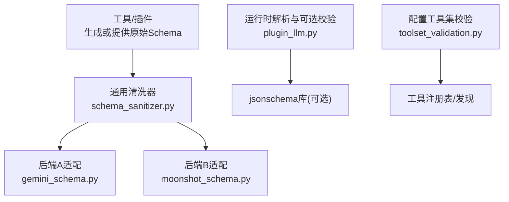
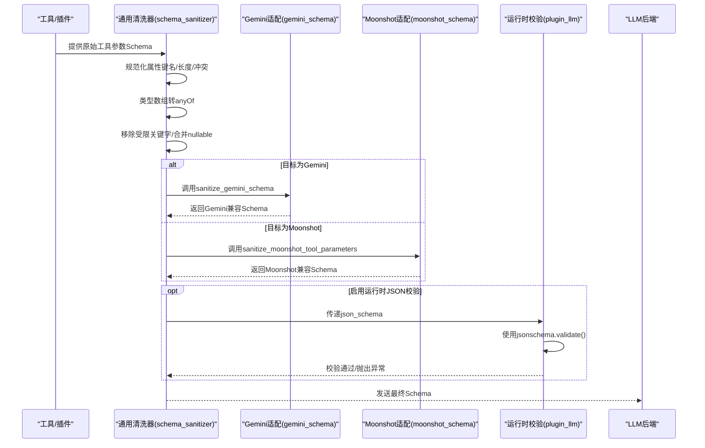
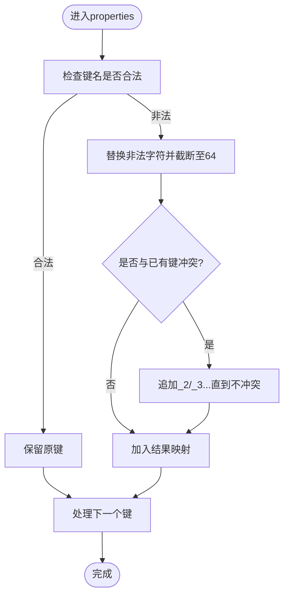
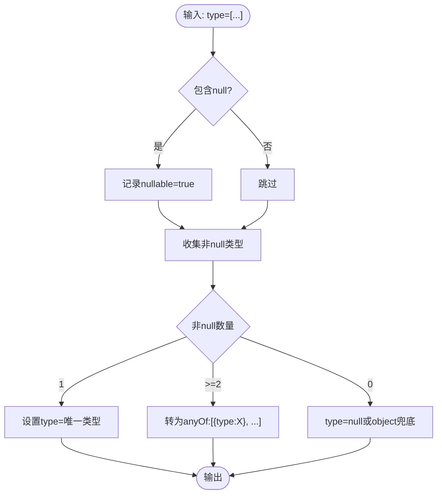
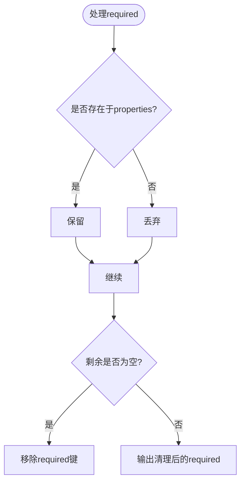
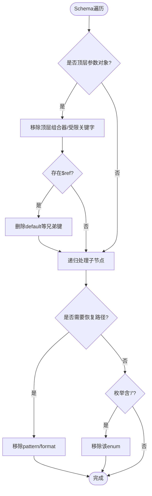
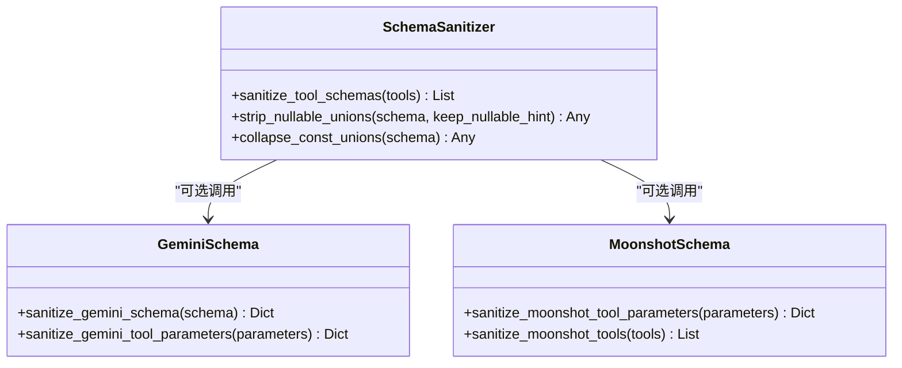
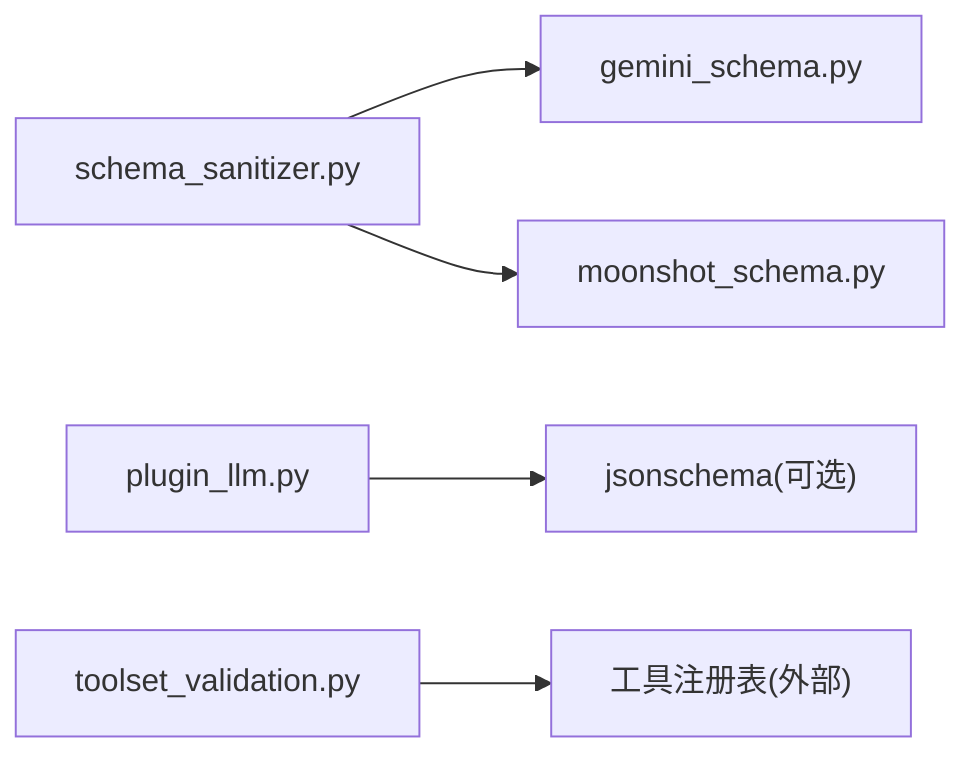

# 参数验证机制

<cite>
**本文引用的文件**
- [tools/schema_sanitizer.py](file://tools/schema_sanitizer.py)
- [agent/gemini_schema.py](file://agent/gemini_schema.py)
- [agent/moonshot_schema.py](file://agent/moonshot_schema.py)
- [sparkii_cli/toolset_validation.py](file://sparkii_cli/toolset_validation.py)
- [agent/plugin_llm.py](file://agent/plugin_llm.py)
</cite>

## 目录
1. [简介](#简介)
2. [项目结构](#项目结构)
3. [核心组件](#核心组件)
4. [架构总览](#架构总览)
5. [详细组件分析](#详细组件分析)
6. [依赖关系分析](#依赖关系分析)
7. [性能考量](#性能考量)
8. [故障排查指南](#故障排查指南)
9. [结论](#结论)
10. [附录](#附录)

## 简介
本文件系统性阐述本仓库中的“参数验证机制”，聚焦于 JSON Schema 验证、属性键名规范化、类型数组转换（将多类型定义转换为 anyOf）、以及面向不同后端的 Schema 适配。文档同时给出工具参数验证的实际示例思路、调试技巧与常见错误解决方案，帮助读者在不深入代码细节的情况下理解并正确使用该机制。

## 项目结构
围绕参数验证的核心代码主要分布在以下模块：
- 通用 Schema 清洗与兼容层：tools/schema_sanitizer.py
- 特定后端适配：agent/gemini_schema.py、agent/moonshot_schema.py
- 配置级工具集校验：sparkii_cli/toolset_validation.py
- 运行时可选的 JSON Schema 校验入口：agent/plugin_llm.py

图表来源
- [tools/schema_sanitizer.py:120-174](file://tools/schema_sanitizer.py#L120-L174)
- [agent/gemini_schema.py:37-141](file://agent/gemini_schema.py#L37-L141)
- [agent/moonshot_schema.py:196-243](file://agent/moonshot_schema.py#L196-L243)
- [agent/plugin_llm.py:472-479](file://agent/plugin_llm.py#L472-L479)
- [sparkii_cli/toolset_validation.py:18-74](file://sparkii_cli/toolset_validation.py#L18-L74)

章节来源
- [tools/schema_sanitizer.py:1-688](file://tools/schema_sanitizer.py#L1-L688)
- [agent/gemini_schema.py:1-141](file://agent/gemini_schema.py#L1-L141)
- [agent/moonshot_schema.py:1-270](file://agent/moonshot_schema.py#L1-L270)
- [sparkii_cli/toolset_validation.py:1-75](file://sparkii_cli/toolset_validation.py#L1-L75)
- [agent/plugin_llm.py:472-479](file://agent/plugin_llm.py#L472-L479)

## 核心组件
- 通用 Schema 清洗器（schema_sanitizer）
  - 负责将任意来源的工具参数 Schema 转换为各后端可接受的稳定形态，包括：
    - 非法属性键名规范化与冲突解决
    - 类型数组转 anyOf
    - 移除严格后端不支持的关键字（如顶层 anyOf/oneOf/allOf/enum/not）
    - 清理 $ref 旁不允许的兄弟关键字（如 default）
    - 剥离 pattern/format 等仅在部分后端受限的提示性字段（按需）
    - 剥离含斜杠的 enum 值（针对特定后端语法编译限制）
- 后端适配层
  - Gemini 适配：仅保留 Gemini 允许的 Schema 键集合，修复 required 与 properties 的一致性，处理 enum 字符串化
  - Moonshot 适配：补齐缺失 type、anyOf 子项类型约束、强制 object 带 required 数组、清理 null/空串 enum 值等
- 配置级工具集校验
  - 校验 platform_toolsets 配置中引用的工具集名称是否有效，并在全部无效时发出明确告警
- 运行时可选 JSON Schema 校验
  - 在启用 json_mode 或传入 json_schema 时，使用 jsonschema 库对模型输出进行二次校验（可选）

章节来源
- [tools/schema_sanitizer.py:56-87](file://tools/schema_sanitizer.py#L56-L87)
- [tools/schema_sanitizer.py:401-540](file://tools/schema_sanitizer.py#L401-L540)
- [agent/gemini_schema.py:37-141](file://agent/gemini_schema.py#L37-L141)
- [agent/moonshot_schema.py:44-216](file://agent/moonshot_schema.py#L44-L216)
- [sparkii_cli/toolset_validation.py:18-74](file://sparkii_cli/toolset_validation.py#L18-L74)
- [agent/plugin_llm.py:472-479](file://agent/plugin_llm.py#L472-L479)

## 架构总览
下图展示了从工具 Schema 到最终发送给后端的完整流程，包括通用清洗、后端适配与可选运行时校验。

图表来源
- [tools/schema_sanitizer.py:120-174](file://tools/schema_sanitizer.py#L120-L174)
- [agent/gemini_schema.py:37-141](file://agent/gemini_schema.py#L37-L141)
- [agent/moonshot_schema.py:196-243](file://agent/moonshot_schema.py#L196-L243)
- [agent/plugin_llm.py:472-479](file://agent/plugin_llm.py#L472-L479)

## 详细组件分析

### 属性键名规范化与冲突解决
- 规则
  - 仅允许字母、数字、下划线、点、连字符，且最大长度为 64
  - 非法字符替换为下划线；若结果为空则使用默认键名
  - 冲突时使用递增后缀去重，保证确定性映射
- 作用范围
  - 作用于每个对象节点的 properties 键名
  - 同步更新 required 列表以保持一致
- 反向映射
  - 提供将模型输出的规范化键还原为原始键的能力，支持嵌套对象与数组项

图表来源
- [tools/schema_sanitizer.py:56-87](file://tools/schema_sanitizer.py#L56-L87)
- [tools/schema_sanitizer.py:441-520](file://tools/schema_sanitizer.py#L441-L520)

章节来源
- [tools/schema_sanitizer.py:56-87](file://tools/schema_sanitizer.py#L56-L87)
- [tools/schema_sanitizer.py:90-117](file://tools/schema_sanitizer.py#L90-L117)
- [tools/schema_sanitizer.py:441-520](file://tools/schema_sanitizer.py#L441-L520)

### 类型数组转换机制（多类型→anyOf）
- 行为
  - 单非空类型：type 设为该类型，必要时标记 nullable
  - 多个非空类型：转换为 anyOf 的单类型分支列表，保留所有分支
  - 全 null 或空数组：退化为 type: "null" 或 object 兜底
- 目的
  - 兼容仅接受单一 string 类型的后端（如 llama.cpp 的 grammar 生成器）
  - 避免丢失任何类型分支

图表来源
- [tools/schema_sanitizer.py:450-483](file://tools/schema_sanitizer.py#L450-L483)

章节来源
- [tools/schema_sanitizer.py:401-540](file://tools/schema_sanitizer.py#L401-L540)

### 必填字段验证与 required 清理
- 通用清洗器
  - 清理 required 中不存在于 properties 的条目，防御畸形 Schema
  - 当 required 为空时移除该键，避免无意义声明
- Gemini 适配
  - 严格校验 required 必须与当前节点的 properties 一致，否则请求失败
  - 过滤无效 required 项，确保请求不被拒绝
- Moonshot 适配
  - 强制 object 节点携带 required 数组（可为空），避免后端报错
  - 清理 enum 中的 null/空串值，防止类型不匹配错误

图表来源
- [tools/schema_sanitizer.py:524-539](file://tools/schema_sanitizer.py#L524-L539)
- [agent/gemini_schema.py:107-130](file://agent/gemini_schema.py#L107-L130)
- [agent/moonshot_schema.py:136-159](file://agent/moonshot_schema.py#L136-L159)

章节来源
- [tools/schema_sanitizer.py:524-539](file://tools/schema_sanitizer.py#L524-L539)
- [agent/gemini_schema.py:107-130](file://agent/gemini_schema.py#L107-L130)
- [agent/moonshot_schema.py:136-159](file://agent/moonshot_schema.py#L136-L159)

### 自定义验证规则与后端差异处理
- 顶层组合器剥离
  - 在函数参数顶层移除 anyOf/oneOf/allOf/enum/not，避免严格后端直接拒绝
- $ref 兄弟关键字清理
  - 移除 $ref 旁的 default 等不被严格验证器接受的键
- 模式与格式提示剥离
  - 在 llama.cpp 语法解析失败时，按需提供 strip_pattern_and_format 恢复路径
- 枚举值斜杠剥离
  - 针对 xAI 语法编译限制，移除包含 "/" 的 enum 值

图表来源
- [tools/schema_sanitizer.py:205-237](file://tools/schema_sanitizer.py#L205-L237)
- [tools/schema_sanitizer.py:177-202](file://tools/schema_sanitizer.py#L177-L202)
- [tools/schema_sanitizer.py:547-624](file://tools/schema_sanitizer.py#L547-L624)
- [tools/schema_sanitizer.py:627-687](file://tools/schema_sanitizer.py#L627-L687)

章节来源
- [tools/schema_sanitizer.py:177-237](file://tools/schema_sanitizer.py#L177-L237)
- [tools/schema_sanitizer.py:547-687](file://tools/schema_sanitizer.py#L547-L687)

### 后端适配：Gemini 与 Moonshot
- Gemini
  - 仅保留允许键集合，递归清理 properties/items/anyOf
  - 将 integer/number/boolean 的 enum 值统一字符串化
  - 修正 required 与 properties 一致性
- Moonshot
  - 补齐缺失 type，anyOf 子项承载类型
  - 强制 object 带 required 数组
  - 清理 enum 中的 null/空串值

图表来源
- [agent/gemini_schema.py:37-141](file://agent/gemini_schema.py#L37-L141)
- [agent/moonshot_schema.py:196-243](file://agent/moonshot_schema.py#L196-L243)
- [tools/schema_sanitizer.py:120-174](file://tools/schema_sanitizer.py#L120-L174)

章节来源
- [agent/gemini_schema.py:37-141](file://agent/gemini_schema.py#L37-L141)
- [agent/moonshot_schema.py:196-243](file://agent/moonshot_schema.py#L196-L243)

### 配置级工具集校验
- 校验 platform_toolsets 中引用的工具集名称是否有效
- 当全部无效时发出明确告警，避免“静默降级”导致工具不可用

章节来源
- [sparkii_cli/toolset_validation.py:18-74](file://sparkii_cli/toolset_validation.py#L18-L74)

### 运行时可选 JSON Schema 校验
- 在启用 json_mode 或传入 json_schema 时，尝试使用 jsonschema 库对模型输出进行校验
- 若未安装 jsonschema，则跳过严格校验并记录日志

章节来源
- [agent/plugin_llm.py:472-479](file://agent/plugin_llm.py#L472-L479)

## 依赖关系分析
- 低耦合设计
  - 通用清洗器独立于具体后端，后端适配作为可选步骤
  - 配置校验与工具注册解耦，便于单元测试
- 外部依赖
  - 运行时可选依赖 jsonschema，用于二次校验
  - 日志用于记录关键转换与恢复动作

图表来源
- [tools/schema_sanitizer.py:120-174](file://tools/schema_sanitizer.py#L120-L174)
- [agent/gemini_schema.py:37-141](file://agent/gemini_schema.py#L37-L141)
- [agent/moonshot_schema.py:196-243](file://agent/moonshot_schema.py#L196-L243)
- [agent/plugin_llm.py:472-479](file://agent/plugin_llm.py#L472-L479)
- [sparkii_cli/toolset_validation.py:18-74](file://sparkii_cli/toolset_validation.py#L18-L74)

章节来源
- [tools/schema_sanitizer.py:120-174](file://tools/schema_sanitizer.py#L120-L174)
- [agent/gemini_schema.py:37-141](file://agent/gemini_schema.py#L37-L141)
- [agent/moonshot_schema.py:196-243](file://agent/moonshot_schema.py#L196-L243)
- [agent/plugin_llm.py:472-479](file://agent/plugin_llm.py#L472-L479)
- [sparkii_cli/toolset_validation.py:18-74](file://sparkii_cli/toolset_validation.py#L18-L74)

## 性能考量
- 深度拷贝与递归遍历
  - 清洗过程对工具列表进行深拷贝与递归遍历，复杂度与 Schema 规模线性相关
- 选择性恢复路径
  - pattern/format 与斜杠 enum 的剥离仅在触发后端错误时执行，减少常规路径开销
- 最小改动原则
  - 仅修改后端无法使用的结构，尽量保持语义不变，降低额外计算

[本节为通用指导，无需引用具体文件]

## 故障排查指南
- 常见错误与定位
  - 属性键名非法或过长：检查 properties 键是否符合正则与长度限制，查看键名重映射日志
  - 类型数组不被接受：确认是否已转换为 anyOf，或单类型+nullable
  - 顶层组合器被拒绝：确认顶层是否移除了 anyOf/oneOf/allOf/enum/not
  - $ref 旁 default 报错：确认已移除兄弟关键字
  - required 与 properties 不一致：检查 required 是否仅包含存在的属性
  - 后端特定错误（如 Gemini/Moonshot）：使用对应适配函数进行预处理
- 调试技巧
  - 开启日志观察键名重命名、类型转换、关键字剥离等操作
  - 对复杂嵌套对象，逐层打印中间 Schema 以定位问题节点
  - 对于模型输出，启用运行时 JSON Schema 校验以快速定位数据问题
- 恢复策略
  - 遇到 llama.cpp 语法解析失败：调用 strip_pattern_and_format 恢复
  - 遇到 xAI 语法编译失败：调用 strip_slash_enum 恢复

章节来源
- [tools/schema_sanitizer.py:56-87](file://tools/schema_sanitizer.py#L56-L87)
- [tools/schema_sanitizer.py:401-540](file://tools/schema_sanitizer.py#L401-L540)
- [tools/schema_sanitizer.py:547-687](file://tools/schema_sanitizer.py#L547-L687)
- [agent/gemini_schema.py:107-130](file://agent/gemini_schema.py#L107-L130)
- [agent/moonshot_schema.py:136-159](file://agent/moonshot_schema.py#L136-L159)
- [agent/plugin_llm.py:472-479](file://agent/plugin_llm.py#L472-L479)

## 结论
本项目的参数验证机制以“通用清洗 + 后端适配 + 可选运行时校验”的分层架构实现，兼顾了跨后端兼容性与可扩展性。通过严格的属性键名规范化、类型数组转换、必填字段清理与后端特定的 Schema 修复，显著降低了因 Schema 不兼容导致的请求失败风险。配合日志与恢复路径，可在复杂场景下快速定位并解决问题。

## 附录
- 实际工具参数验证示例思路
  - 复杂嵌套对象：递归应用 _sanitize_node，确保每层 properties 与 required 一致
  - 数组类型：items 子 Schema 同样参与清洗，类型数组转换为 anyOf
  - 可选字段：使用 strip_nullable_unions 合并 nullable 分支，保留 nullable 提示以便运行时处理
- 参考路径
  - 属性键名规范化与冲突解决：[tools/schema_sanitizer.py:56-87](file://tools/schema_sanitizer.py#L56-L87)
  - 类型数组转 anyOf：[tools/schema_sanitizer.py:450-483](file://tools/schema_sanitizer.py#L450-L483)
  - 必填字段清理：[tools/schema_sanitizer.py:524-539](file://tools/schema_sanitizer.py#L524-L539)
  - 后端适配（Gemini/Moonshot）：[agent/gemini_schema.py:37-141](file://agent/gemini_schema.py#L37-L141)、[agent/moonshot_schema.py:196-243](file://agent/moonshot_schema.py#L196-L243)
  - 运行时 JSON 校验：[agent/plugin_llm.py:472-479](file://agent/plugin_llm.py#L472-L479)