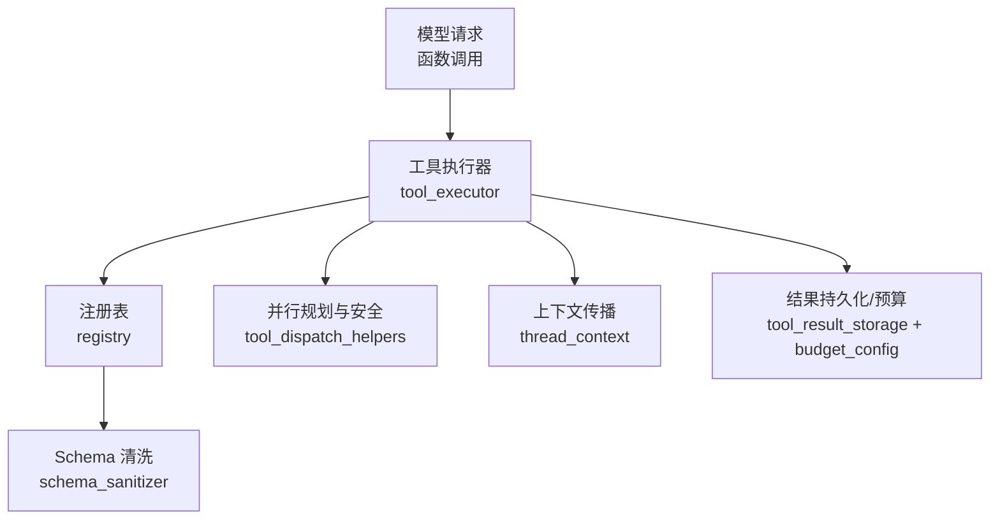
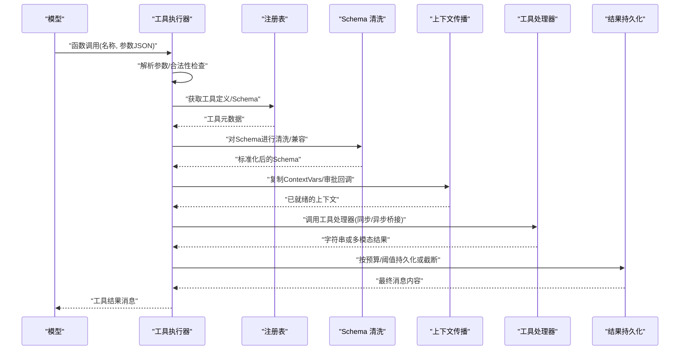
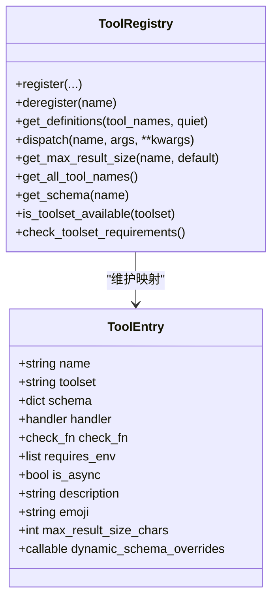
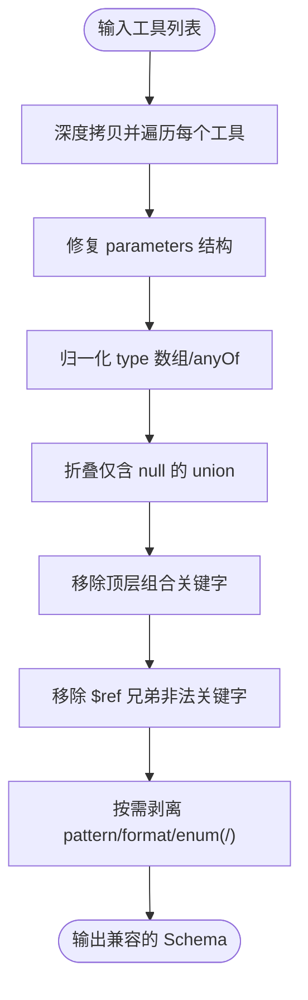
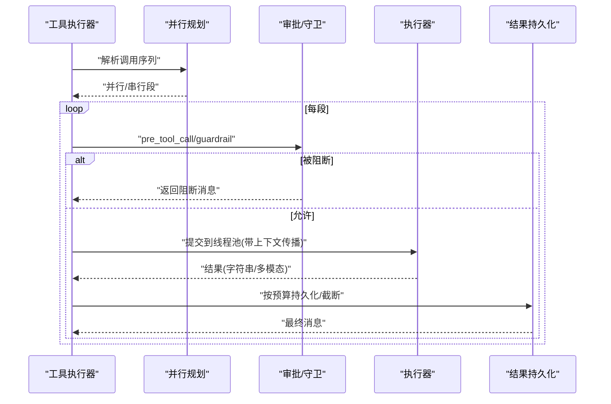
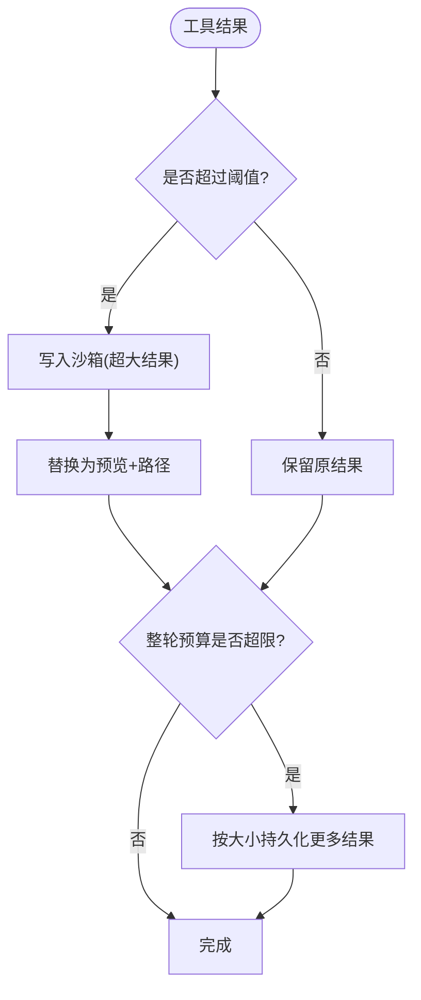
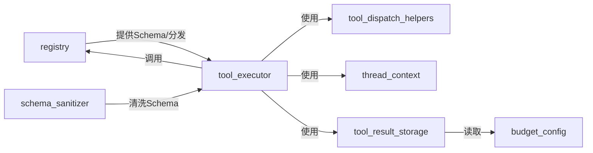

# 工具接口设计

<cite>
**本文引用的文件**
- [tools/registry.py](file://tools/registry.py)
- [tools/schema_sanitizer.py](file://tools/schema_sanitizer.py)
- [agent/tool_executor.py](file://agent/tool_executor.py)
- [agent/tool_dispatch_helpers.py](file://agent/tool_dispatch_helpers.py)
- [tools/thread_context.py](file://tools/thread_context.py)
- [tools/tool_result_storage.py](file://tools/tool_result_storage.py)
- [tools/budget_config.py](file://tools/budget_config.py)
</cite>

## 目录
1. [简介](#简介)
2. [项目结构](#项目结构)
3. [核心组件](#核心组件)
4. [架构总览](#架构总览)
5. [详细组件分析](#详细组件分析)
6. [依赖关系分析](#依赖关系分析)
7. [性能考量](#性能考量)
8. [故障排查指南](#故障排查指南)
9. [结论](#结论)
10. [附录](#附录)

## 简介
本文件面向“工具接口”的设计与实现，系统性说明：
- 工具接口的定义规范（参数校验、返回值格式、错误处理模式）
- Schema 验证机制（类型检查、必填字段、自定义规则）
- 执行上下文管理（环境变量注入、权限检查、资源限制）
- 最佳实践（异步处理、超时控制、异常处理）
- 实际示例与调试技巧

目标是让开发者在不深入源码的情况下，也能正确设计、注册、调用和调试工具。

## 项目结构
围绕工具接口的相关代码主要分布在以下模块：
- 工具注册与分发：tools/registry.py
- 工具 Schema 清洗与兼容：tools/schema_sanitizer.py
- 工具执行编排与并发：agent/tool_executor.py
- 并行安全与结果封装：agent/tool_dispatch_helpers.py
- 线程上下文传播：tools/thread_context.py
- 结果持久化与预算控制：tools/tool_result_storage.py, tools/budget_config.py

图表来源
- [agent/tool_executor.py:758-1580](file://agent/tool_executor.py#L758-L1580)
- [tools/registry.py:562-834](file://tools/registry.py#L562-L834)
- [tools/schema_sanitizer.py:120-174](file://tools/schema_sanitizer.py#L120-L174)
- [agent/tool_dispatch_helpers.py:116-234](file://agent/tool_dispatch_helpers.py#L116-L234)
- [tools/thread_context.py:64-121](file://tools/thread_context.py#L64-L121)
- [tools/tool_result_storage.py:144-255](file://tools/tool_result_storage.py#L144-L255)
- [tools/budget_config.py:22-61](file://tools/budget_config.py#L22-L61)

章节来源
- [tools/registry.py:1-1002](file://tools/registry.py#L1-L1002)
- [tools/schema_sanitizer.py:1-688](file://tools/schema_sanitizer.py#L1-L688)
- [agent/tool_executor.py:1-1600](file://agent/tool_executor.py#L1-L1600)
- [agent/tool_dispatch_helpers.py:1-733](file://agent/tool_dispatch_helpers.py#L1-L733)
- [tools/thread_context.py:1-121](file://tools/thread_context.py#L1-L121)
- [tools/tool_result_storage.py:1-255](file://tools/tool_result_storage.py#L1-L255)
- [tools/budget_config.py:1-115](file://tools/budget_config.py#L1-L115)

## 核心组件
- 工具注册表（ToolRegistry）
  - 负责工具的发现、注册、查询、分发与生命周期管理
  - 支持 check_fn 可用性探测缓存、动态 Schema 覆盖、插件覆盖策略
- Schema 清洗器（schema_sanitizer）
  - 将不同后端接受的 JSON Schema 规范化，确保跨 LLM 后端可用
- 工具执行器（tool_executor）
  - 解析参数、规划并行/串行段、设置超时、中断、审批门控、结果持久化
- 并行安全与结果封装（tool_dispatch_helpers）
  - 决定哪些工具可并行、路径冲突检测、多模态结果封装、不可信内容包装
- 上下文传播（thread_context）
  - 在子线程中复制 ContextVars 并安装/清理审批与 sudo 回调
- 结果持久化与预算（tool_result_storage + budget_config）
  - 三层防御：单工具输出上限、沙箱持久化、整轮聚合预算

章节来源
- [tools/registry.py:201-834](file://tools/registry.py#L201-L834)
- [tools/schema_sanitizer.py:120-174](file://tools/schema_sanitizer.py#L120-L174)
- [agent/tool_executor.py:758-1580](file://agent/tool_executor.py#L758-L1580)
- [agent/tool_dispatch_helpers.py:116-234](file://agent/tool_dispatch_helpers.py#L116-L234)
- [tools/thread_context.py:64-121](file://tools/thread_context.py#L64-L121)
- [tools/tool_result_storage.py:144-255](file://tools/tool_result_storage.py#L144-L255)
- [tools/budget_config.py:22-61](file://tools/budget_config.py#L22-L61)

## 架构总览
下图展示一次工具调用的端到端流程，涵盖参数解析、Schema 校验、权限/审批、执行、结果持久化与返回。

图表来源
- [agent/tool_executor.py:758-1580](file://agent/tool_executor.py#L758-L1580)
- [tools/registry.py:562-834](file://tools/registry.py#L562-L834)
- [tools/schema_sanitizer.py:120-174](file://tools/schema_sanitizer.py#L120-L174)
- [tools/thread_context.py:64-121](file://tools/thread_context.py#L64-L121)
- [tools/tool_result_storage.py:144-255](file://tools/tool_result_storage.py#L144-L255)

## 详细组件分析

### 工具注册与分发（ToolRegistry）
- 注册接口
  - 通过 register(name, toolset, schema, handler, check_fn, requires_env, is_async, description, emoji, max_result_size_chars, dynamic_schema_overrides, override) 声明工具
  - 支持同名工具跨 toolset 的保护性覆盖策略（需显式 opt-in）
- 可用性探测
  - check_fn 用于探测外部依赖（如 Docker/Playwright），带 TTL 与失败宽限缓存，避免瞬时抖动导致工具不可用
- Schema 获取
  - get_definitions 会应用动态覆盖，并过滤掉 check_fn 失败的条目
- 分发
  - dispatch 自动桥接异步处理器，统一捕获异常并以结构化错误返回
  - _normalize_handler_result 强制结果为字符串或多模态信封，防止下游消费异常

图表来源
- [tools/registry.py:201-834](file://tools/registry.py#L201-L834)

章节来源
- [tools/registry.py:201-834](file://tools/registry.py#L201-L834)

### Schema 验证与兼容性（schema_sanitizer）
- 目标
  - 消除不同 LLM 后端对 JSON Schema 的差异性拒绝（如 bare-string type、anyOf/oneOf 含 null、top-level combinators、$ref 兄弟关键字等）
- 关键能力
  - 属性键重命名以符合严格后端要求
  - 将 type 数组归一化为单一类型或 anyOf
  - 折叠仅允许 null 的 anyOf/oneOf 为单分支，保留 nullable 提示
  - 移除顶层组合关键字（allOf/anyOf/oneOf/enum/not）
  - 移除 $ref 节点上的非法兄弟关键字（如 default）
  - 可选地剥离 pattern/format、含斜杠的 enum 值以适配特定后端
- 运行时参数还原
  - unrename_tool_args 将清洗后的参数键还原为原始 wire 名称，保证调度一致性

图表来源
- [tools/schema_sanitizer.py:120-174](file://tools/schema_sanitizer.py#L120-L174)
- [tools/schema_sanitizer.py:240-303](file://tools/schema_sanitizer.py#L240-L303)
- [tools/schema_sanitizer.py:339-398](file://tools/schema_sanitizer.py#L339-L398)
- [tools/schema_sanitizer.py:401-540](file://tools/schema_sanitizer.py#L401-L540)
- [tools/schema_sanitizer.py:550-688](file://tools/schema_sanitizer.py#L550-L688)

章节来源
- [tools/schema_sanitizer.py:1-688](file://tools/schema_sanitizer.py#L1-L688)

### 工具执行与并发编排（tool_executor）
- 参数解析与预检
  - 解析 JSON 参数，非法时直接返回错误消息
  - 支持 tool_search 解包与范围校验，避免越权调用
- 并行规划
  - 基于工具类别与路径冲突，将一批调用切分为“并行段”和“串行段”，保持顺序一致性与副作用边界
- 超时与中断
  - 批级超时（可配置）、授权审批门控排除人类等待时间、启动顺序门控防饥饿
  - 用户中断时取消未开始的任务，释放排队中的工作项
- 权限与审批
  - 通过 pre_tool_call 钩子与 guardrails 决定是否阻止执行
  - 审批门控序列化，避免并发审批交错
- 结果处理
  - 多模态结果识别与文本摘要
  - 结果写入会话数据库，必要时触发增量持久化
  - 生成工具结果消息，标记不可信内容风险

图表来源
- [agent/tool_executor.py:758-1580](file://agent/tool_executor.py#L758-L1580)
- [agent/tool_dispatch_helpers.py:116-234](file://agent/tool_dispatch_helpers.py#L116-L234)
- [tools/thread_context.py:64-121](file://tools/thread_context.py#L64-L121)
- [tools/tool_result_storage.py:144-255](file://tools/tool_result_storage.py#L144-L255)

章节来源
- [agent/tool_executor.py:1-1600](file://agent/tool_executor.py#L1-L1600)
- [agent/tool_dispatch_helpers.py:1-733](file://agent/tool_dispatch_helpers.py#L1-L733)

### 并行安全与结果封装（tool_dispatch_helpers）
- 并行安全规则
  - 明确禁止并行的工具（如交互式工具）
  - 只读且无共享状态的工具集合
  - 文件系统工具的路径冲突检测（读写角色区分）
- 多模态结果
  - 识别多模态信封、提取文本摘要、追加子目录提示
- 不可信内容包装
  - 对高风险工具的输出包裹信任边界标签，降低间接提示注入风险

章节来源
- [agent/tool_dispatch_helpers.py:1-733](file://agent/tool_dispatch_helpers.py#L1-L733)

### 上下文传播（thread_context）
- 作用
  - 在子线程中复制主线程的 ContextVars，并安装/清理审批与 sudo 回调，确保危险命令审批不丢失
- 安全性
  - 失败关闭：回调安装失败则拒绝危险操作；退出时总是清理回调，避免复用线程污染

章节来源
- [tools/thread_context.py:1-121](file://tools/thread_context.py#L1-L121)

### 结果持久化与预算（tool_result_storage + budget_config）
- 三层防御
  - 单工具输出上限：超过阈值即持久化到沙箱，返回预览+路径
  - 整轮聚合预算：若一轮工具输出总量超限，优先持久化最大非持久化结果
  - 可配置阈值：支持 per-tool 覆盖与上下文窗口缩放
- 沙箱写入
  - 通过 env.execute 将大结果写入沙箱，避免命令行长度限制
- 预算计算
  - 根据模型上下文窗口按比例缩放 per-result/per-turn 预算，同时设置上下界保护小模型可用性

图表来源
- [tools/tool_result_storage.py:144-255](file://tools/tool_result_storage.py#L144-L255)
- [tools/budget_config.py:22-61](file://tools/budget_config.py#L22-L61)

章节来源
- [tools/tool_result_storage.py:1-255](file://tools/tool_result_storage.py#L1-L255)
- [tools/budget_config.py:1-115](file://tools/budget_config.py#L1-L115)

## 依赖关系分析
- 低耦合高内聚
  - registry 仅暴露注册/查询/分发接口，不关心具体工具实现
  - schema_sanitizer 独立于执行路径，仅在需要时清洗 Schema
  - tool_executor 协调各组件，但不直接实现工具逻辑
- 潜在循环依赖规避
  - 使用延迟导入（如 model_tools._run_async）避免循环
- 外部依赖点
  - 审批系统、网关会话上下文、环境执行器（env.execute）

图表来源
- [tools/registry.py:562-834](file://tools/registry.py#L562-L834)
- [tools/schema_sanitizer.py:120-174](file://tools/schema_sanitizer.py#L120-L174)
- [agent/tool_executor.py:758-1580](file://agent/tool_executor.py#L758-L1580)
- [tools/tool_result_storage.py:144-255](file://tools/tool_result_storage.py#L144-L255)
- [tools/budget_config.py:22-61](file://tools/budget_config.py#L22-L61)

章节来源
- [tools/registry.py:1-1002](file://tools/registry.py#L1-L1002)
- [agent/tool_executor.py:1-1600](file://agent/tool_executor.py#L1-L1600)

## 性能考量
- 并发与限流
  - 最大工作线程数限制，图像生成等特殊工具进一步降并发
  - 启动顺序门控与授权门控超时，避免饥饿与死锁
- 缓存
  - check_fn 可用性探测缓存（TTL 与失败宽限）
  - 工具定义生成时的动态覆盖缓存（基于配置 mtime）
- 结果大小控制
  - 单工具阈值与整轮预算双重保护，避免上下文溢出
- I/O 优化
  - 大结果通过 stdin 管道写入沙箱，避免命令行长度限制

[本节为通用指导，无需引用具体文件]

## 故障排查指南
- 工具不可用
  - 检查 check_fn 是否持续失败（网络/依赖问题），查看日志中的“check_fn failed”提示
  - 确认工具所属 toolset 是否被启用/禁用
- 参数错误
  - 若出现“Invalid tool arguments”，检查模型输出的参数是否为合法 JSON 对象
- Schema 兼容性问题
  - 若后端报“grammar-parse failed”，查看是否触发了 pattern/format/enum(/) 剥离恢复路径
- 结果过大
  - 观察是否进入沙箱持久化流程，确认 env.execute 可用
- 并发阻塞/超时
  - 检查授权门控是否长时间占用（人工审批卡住），或启动顺序门控是否超时
- 中断与取消
  - 用户中断后，确认未开始任务已被取消，已运行任务有机会优雅退出

章节来源
- [tools/registry.py:233-380](file://tools/registry.py#L233-L380)
- [tools/schema_sanitizer.py:550-688](file://tools/schema_sanitizer.py#L550-L688)
- [agent/tool_executor.py:880-1346](file://agent/tool_executor.py#L880-L1346)
- [tools/tool_result_storage.py:144-255](file://tools/tool_result_storage.py#L144-L255)

## 结论
本设计通过“注册表 + 执行器 + 并行规划 + Schema 清洗 + 上下文传播 + 结果预算”的分层架构，实现了：
- 统一的工具接口规范与错误处理
- 跨后端的 Schema 兼容
- 安全的并发执行与资源限制
- 可扩展的权限/审批与上下文隔离
- 健壮的大结果处理与上下文保护

遵循本文档的规范与实践，可快速开发稳定、可观测、可维护的工具接口。

## 附录

### 工具接口设计规范（要点）
- 参数验证
  - 使用 JSON Schema 描述参数类型、必填字段、枚举等
  - 由 schema_sanitizer 做后端兼容清洗；运行时再校验必填与类型
- 返回值格式
  - 默认返回 JSON 字符串；多模态结果使用标准信封
  - 错误统一通过 tool_error 返回，包含 error 字段
- 错误处理模式
  - 所有异常被捕获并转为结构化错误，避免泄露内部堆栈
  - 超长错误信息会被截断，日志保留更长片段便于诊断

章节来源
- [tools/registry.py:974-1002](file://tools/registry.py#L974-L1002)
- [tools/schema_sanitizer.py:120-174](file://tools/schema_sanitizer.py#L120-L174)
- [agent/tool_executor.py:141-157](file://agent/tool_executor.py#L141-L157)

### 执行上下文管理（环境变量、权限、资源）
- 环境变量注入
  - 通过工具注册表的 requires_env 声明依赖的环境变量
  - 工具执行前可结合环境执行器注入工作目录、临时目录等
- 权限检查
  - pre_tool_call 钩子与 guardrails 共同决定是否可以执行
  - 插件覆盖内置工具需显式授权
- 资源限制
  - 并发线程上限、批级超时、授权门控超时、启动顺序门控超时
  - 结果大小预算（per-tool 与 per-turn）

章节来源
- [tools/registry.py:562-644](file://tools/registry.py#L562-L644)
- [agent/tool_executor.py:391-468](file://agent/tool_executor.py#L391-L468)
- [tools/budget_config.py:22-61](file://tools/budget_config.py#L22-L61)

### 最佳实践
- 异步处理
  - 使用 is_async=True 注册异步处理器，由注册表自动桥接
- 超时控制
  - 合理设置 SPARKII_CONCURRENT_TOOL_TIMEOUT_S，避免长尾任务拖垮批次
- 异常处理
  - 工具内部抛出异常将被统一捕获并转成结构化错误
  - 对可能产生大量输出的工具，主动截断或持久化

章节来源
- [tools/registry.py:801-834](file://tools/registry.py#L801-L834)
- [agent/tool_executor.py:160-176](file://agent/tool_executor.py#L160-L176)
- [tools/tool_result_storage.py:144-200](file://tools/tool_result_storage.py#L144-L200)

### 实际示例与调试技巧
- 示例：注册一个简单工具
  - 在工具模块顶部调用 registry.register(...) 声明 schema/handler/check_fn
  - 使用 tool_result/tool_error 构造返回
- 调试技巧
  - 开启 verbose_logging 查看工具参数与结果摘要
  - 关注“post_tool_call”事件，定位失败原因
  - 使用工具搜索与范围校验，确认当前会话可调用工具集

章节来源
- [tools/registry.py:562-644](file://tools/registry.py#L562-L644)
- [tools/registry.py:974-1002](file://tools/registry.py#L974-L1002)
- [agent/tool_executor.py:665-756](file://agent/tool_executor.py#L665-L756)